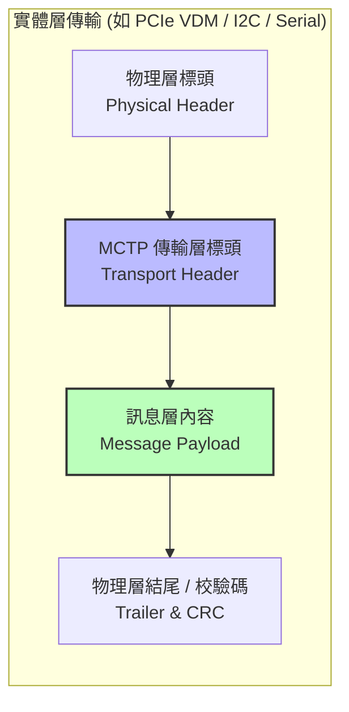
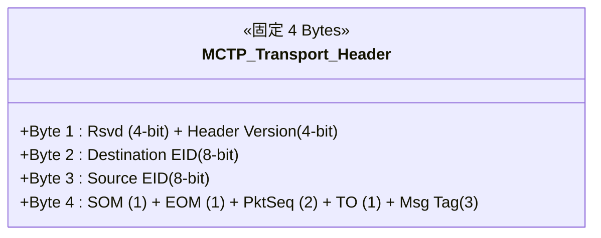
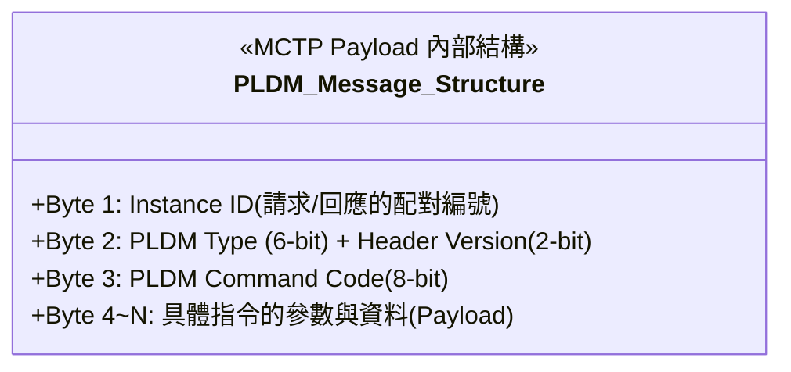

# 🚀 AST2700 PCIe 韌體開發與 OpenBMC 實務手冊

本文件彙整了關於 OpenBMC 生態系、PCIe 協定細節、以及針對 ASPEED AST2700 晶片進行韌體開發與模擬的核心技術知識。

---

## 📋 目錄

- [一、 OpenBMC 與 BMC 基礎概述](#一-openbmc-與-bmc-基礎概述)
  - [1.1 伺服器管理的兩大通道：In-Band 與 Out-of-Band](#11-伺服器管理的兩大通道in-band-與-out-of-band-oob)
  - [1.2 OpenBMC 軟體架構](#12-openbmc-軟體架構)
- [二、 PCIe 協定與韌體開發核心](#二-pcie-協定與韌體開發核心)
  - [2.1 PCIe 虛擬 USB：xHCI 控制器架構](#21-pcie-虛擬-usb：xhci-控制器架構-usb-over-pcie)
  - [2.1.5 BMC 上的 Linux 在 EP 架構中扮演的角色](#215-bmc-上的-linux-在-pcie-ep-架構中扮演的角色)
  - [2.2 實務總結：鍵盤與 USB 存取場景對照表](#22-實務總結鍵盤與-usb-存取場景對照表)
- [三、 DC-SCM 與 LTPI 技術架構](#三-dc-scm-與-ltpi-技術架構)
  - [3.1 DC-SCM 伺服器解耦架構](#31-dc-scm-伺服器解耦架構)
  - [3.2 LTPI 技術介紹](#32-ltpi-low-pin-count-tunneling-over-pcie-interface)
  - [3.3 MCTP 協議](#33-mctp-management-component-transport-protocol)
  - [3.3.2 PLDM 模組化架構與 Type 定義](#332-pldm-模組化架構與-type-定義)
  - [3.4 DC-SCM 規範與 PCIe 拓樸設計](#34-實務探討dc-scm-規範與-pcie-拓樸設計-以-ssd-管理為例)
- [四、 GPIO 控制流程](#四-openbmc-在-ast2700dc-scm-架構下的-gpio-控制流程)

---

## 📘 一、 OpenBMC 與 BMC 基礎概述

BMC (基板管理控制器) 是一顆嵌入在伺服器主機板上的小型處理器，獨立於作業系統運行。其主要功能包括遠端控制、環境監控、KVM 重導向及日誌紀錄。

### 1.1 伺服器管理的兩大通道：In-Band 與 Out-of-Band (OOB)

在伺服器管理與遙測的領域中，通訊路徑分為兩種極難被取代的觀念：
* **In-Band (頻內管理)**：就是「走大門」。透過伺服器主機的 CPU 與主作業系統 (如 Windows/Linux) 及其主要的網路孔來進行管理行動。
  * *致命缺點*：只要主機作業系統當機 (藍屏)、主機網路卡故障、或是系統正處於關機狀態，管理員就徹底斷線，無能為力。
* **Out-of-Band (頻外管理，簡稱 OOB)**：就是「走獨立的專用後門」。這正是 **BMC 存在的最核心價值**。BMC 有自己獨立的微處理器、記憶體、甚至專屬的**管理網路接孔 (Management LAN Port)**。
  * *絕對優勢*：由於它與主機系統「物理及邏輯上完全脫鉤」，只要伺服器一插上電源線 (即使處於關機的 Standby 狀態)，管理員就能透過 OOB 網路連進 BMC。即使伺服器死機，你依然能遠端強制重開機、查看發生什麼硬體錯誤日誌，或透過虛擬 KVM 掛載 ISO 檔重灌 OS。

### 1.2 OpenBMC 軟體架構

OpenBMC 是一個開源專案，旨在為伺服器與基礎設施的 OOB 管理打造標準化、靈活的 Linux 發行版。它整合了以下核心技術：

* **Linux Kernel**：核心運作系統。
* **Yocto Project**：用於建構嵌入式 Linux 的工具鏈與框架。
* **D-Bus**：系統內部不同服務之間的溝通匯流排。
  > 💡 **特別注意 (觀念釐清)**：D-Bus **不是**硬體實體線路（如 PCIe、I2C 或 LTPI）。它是一種存在於記憶體中的**軟體通訊機制 (Inter-Process Communication, IPC)**。它就像軟體世界裡的「郵局」或「內部廣播系統」，讓各種獨立的應用服務（如網頁伺服器、GPIO 管理程式）不需要互相綁定，就能透過標準格式傳遞訊息，達到軟體架構極佳的解耦效果。
* **Web UI**：提供現代化網頁介面。

---

## ⚡ 二、 PCIe 協定與韌體開發核心

### 2.1 PCIe 虛擬 USB：xHCI 控制器架構 (USB over PCIe)

在進階的伺服器與 DC-SCM 架構中，為了節省 BMC 到主機板 (HPM) 的實體 USB 走線，硬體工程師會採用「透過 PCIe 虛擬化 USB」的策略。這個技術的核心，就是讓 BMC 晶片透過 PCIe 通道假裝自己是一張 **xHCI (eXtensible Host Controller Interface)** 擴充卡。

#### 2.1.1 xHCI 核心觀念
**xHCI** 是由 Intel 主導制定的 USB 3.0 主機控制器標準規範（向下相容 USB 2.0/1.1）。
在傳統架構中，xHCI 邏輯通常位於 CPU 的 PCH (南橋) 內。而在「USB over PCIe」的高階架構中，**AST2700 (BMC) 將透過設定自身的 PCIe Endpoint (EP)**，主動向伺服器的 CPU 宣稱：「我這裡有一顆外接的 xHCI USB 控制器」。

#### 2.1.2 虛擬 USB 的運作流程
當伺服器開機，CPU (Host) 啟動 PCIe 硬體枚舉 (Enumeration) 時，這個「指鹿為馬」的過程如下：

1. **PCIe 認親 (Enumeration)**：CPU 掃描 PCIe Bus，在 AST2700 端點上發現新裝置。讀取其 Configuration Space 時，會看到 `Class Code` 標示為 `0C0330` (這在國際標準中代表 USB 3.0 xHCI Controller)。
2. **載入通用驅動**：Host 作業系統 (Windows/Linux) 收到這組 Code，完全不會懷疑，直接掛載系統內建的標準 xHCI 驅動程式。此時，實體上根本沒有任何真正的 USB 電子訊號產生，一切的資料溝通都是透過打散的 PCIe TLP 封包傳輸。
3. **BMC 軟體餵資料 (Virtual Media / KVM)**：這時 BMC 內部的 Linux 系統，會將管理員在 Web UI 上的滑鼠點擊，或是掛載的 `.iso` 重灌映像檔，轉換成符合 xHCI 規範的資料結構 (如 Transfer Rings)，轉包給 PCIe 控制器拋給 Host CPU。
4. **Host 完美受騙**：Host CPU 收到了標準的 xHCI 資料流，便以為真的有人在主機的 USB 孔插上了一把實體鍵盤與一台隨身碟（這正是遠端 KVM 與虛擬媒體底層的魔法）。

#### 2.1.3 架構優缺點與開發地雷
* ✅ **絕對優勢 (省腳位與集中傳輸)**：移除了主機板上超容易受雜訊干擾的實體 USB 銅線 (D+/D-)，也省下了 DC-SCM 金手指上的專屬腳位，全部收斂交由高頻寬、自帶強大糾錯機制的 PCIe 高速公路來統一運送。
* ⚠️ **開發地雷 (ASPM 省電與斷線風險)**：既然 USB 依附在 PCIe 上，那「皮之不存，毛將焉附」。只要主機的作業系統因為省電策略啟動了 PCIe 的休眠模式 (如 `ASPM L1` 狀態)，或者發生了瞬斷的 PCIe 鏈路重置 (Link Reset)，Host 的 xHCI 驅動就會立刻判定「USB 擴充卡已被拔除」，導致遠端重建的虛擬光碟或正在移動的滑鼠**瞬間全數斷線**！這是韌體開發工程師處理 PCIe 電源管理時最頭痛的難關，必須特別透過設定去禁用或穩住 ASPM 的狀態。

#### 2.1.4 BMC 本機「自用」實體 USB 與 NVMe 儲存
有時候，工程師會在 SCM 板卡 (BMC 所在環境) 上預留實體的 USB 埠或是 M.2 插槽。如果這個設計是為了讓 **BMC 自己專用**（例如：資料中心需要讓 BMC 儲存海量的 Debug 日誌，或是用作 BMC 的多版本快照備份），而完全不需要交給 Host Server 讀取呢？

BMC 此時的行為類似一台標準的桌上型電腦：

1. **若插上實體 USB 隨身碟 (AST2700 擔任 USB Host / xHCI)**：
   AST2700 晶片內部本身就整合了 **USB Host Controller (其高階控制器亦相容 xHCI 規範)**。此時主機板上的實體 USB 腳位是直接走原生線路進到 AST2700 的 SoC 內。BMC 內部的 Linux 系統會直接掛載標準的 `xhci-hcd` (或 ehci/uhci) 核心驅動程式，主動去「枚舉 Enumeration」這張剛剛插入的隨身碟，並將它掛載到自己的檔案系統裡（如 `/dev/sda`）。
   > **重點**：整個存取過程完全都是在 SCM 卡內部消化，沒有使用到任何對外的 PCIe 金手指通道，Host Server 也完全不知道這顆隨身碟的存在。

2. **若插上實體 NVMe SSD (AST2700 擔任 PCIe RC)**：
   如果是把極高速的 NVMe SSD 插在 SCM 板上的 M.2 槽給 BMC 專用。此時韌體開發者必須將 AST2700 晶片上對應該 M.2 插槽的 PCIe 控制器設定為 **RC (Root Complex)** 模式（自己當老大）。只要鏈路訓練 (Link Training) 成功，BMC 內部的 Linux 就會啟動標準的 NVMe 磁碟驅動，將這顆 SSD 掛載成 `/dev/nvme0n1`，讓 BMC 獲得巨大的儲存吞吐能力。這也完美呼應了「場景二」所提的 Local RC 合規設計。

#### 2.1.5 BMC 上的 Linux 在 PCIe EP 架構中扮演的角色

理解了硬體如何呈現 PCIe Endpoint 之後，接著要問的是：**AST2700 上跑的 Linux（及其 User-space 應用程式）在這套架構裡實際上在做什麼？**

答案是——它扮演的是整張介面卡的「**韌體大腦 (Firmware Brain)**」。它把 PCIe EP 硬體當作對外溝通的橋樑，並負責以下四大職責：

1. **決定要扮演誰（身分宣告 / EPF 設定）**

   Linux 透過 **ConfigFS** 介面或專屬的 EP Function（EPF）驅動程式，向 PCIe 控制器寫入 Vendor ID、Device ID、Class Code 等配置空間欄位。這一步決定了 Host 端「認為插進來的是什麼裝置」——例如要冒充 xHCI USB 控制器、NVMe 儲存裝置，或是自定義的管理介面卡（`Class Code = FF00h`）。

   > 💡 Linux 核心的 **PCIe EPC（Endpoint Controller）** 框架提供了硬體無關的 API，讓 EPF 驅動程式可以統一操作不同廠商的 EP 控制器暫存器，包括 AST2700 的 PCIe 控制器。

2. **配置對外記憶體視窗（BAR 空間設定）**

   Linux 透過 EPC API 設定每個 BAR 對應到 AST2700 內部哪一塊實體記憶體或暫存器空間。Host 端一旦完成 MMIO 映射，只要對該位址執行 Memory Write，訊號就會穿過 PCIe 鏈路抵達 AST2700 的對應記憶體區域。

3. **監聽並處理 Host 的寫入事件（中斷處理 / ISR）**

   當 Host 端對 BAR 空間執行寫入（例如敲擊 Doorbell 暫存器、推送命令），AST2700 的 EP 硬體會觸發一個內部中斷，通知 BMC 的 CPU：「Host 丟工作過來了！」。BMC Linux 的中斷服務程序（ISR）被喚醒後，讀取 Doorbell 的值或 BAR 中的命令結構，決定下一步動作。

4. **主動推送資料回 Host（DMA 引擎驅動 + MSI-X 通知）**

   當 BMC 端完成運算（例如 KVM 畫面編碼、虛擬磁碟資料讀取），它會操作 EP 控制器的 **DMA 引擎**，主動把結果寫入 Host 端記憶體（由 Host 驅動程式在初始化時提前告知的目標位址）。寫入完成後，再觸發 **MSI-X 中斷**通知 Host 端驅動程式「資料已就位，可以來取」。

   ```mermaid
   sequenceDiagram
       participant BMC as AST2700 (BMC Linux)
       participant Host as Host CPU

       BMC->>Host: ① DMA Write<br/>(把結果推到 Host 記憶體)
       BMC->>Host: ② MSI-X 中斷 TLP<br/>(通知 Host 驅動取資料)
       Note right of Host: ③ Host ISR 處理資料
   ```

**總結**：BMC 上的 Linux 將 PCIe EP 硬體視為一個「**對外服務的硬體通道（EPC）**」。它的職責是透過 EPF 驅動設定通道行為、監聽 Host 端透過這個通道傳來的命令，並主動透過 DMA + MSI-X 回應。這正是 AST2700 能夠同時模擬 xHCI 控制器、管理介面、虛擬 NVMe 等多種 PCIe 身分的根本原因。

### 2.2 實務總結：鍵盤與 USB 存取場景對照表


綜合上述 PCIe 架構與實體線路設計，我們可以用最常見的「鍵盤敲擊」作為例子，歸納在四種不同的維護場景下，訊號到底經歷了什麼轉譯路徑，以及到底誰才是真正的 USB Host：

| 場景 | 鍵盤實體在哪？ | 誰是 USB 主人 (Host)？ | 數據路徑 (核心流程) | 需經過 PCIe 嗎？ |
| :--- | :--- | :--- | :--- | :--- |
| **1. 遠端 KVM (管 HPM)** | 維護者的外部電腦 | HPM (主機 CPU) | 網路 → BMC CPU → vhub 虛擬打包 → **PCIe 隧道** → HPM | **是** |
| **2. 主機本地 (管 HPM)** | 插在伺服器前方主機埠 | HPM (主機 CPU) | 實體埠 → 主機板 PCH 晶片 xHCI → 主機 CPU | 否 |
| **3. BMC 遠端 (管 BMC)** | 維護者的外部電腦 | 無 (純網路數據封包) | 網路 → BMC 實體網卡 → AXI 內部匯流排 → BMC CPU | 否 |
| **4. BMC 本地 (管 BMC)** | 插在伺服器 BMC 專用埠 | BMC (AST2700) | 實體埠 → BMC 內建 xHCI → AXI 內部匯流排 → BMC CPU | 否 |

---

## 🏗️ 三、 DC-SCM 與 LTPI 技術架構

### 3.1 DC-SCM 伺服器解耦架構

DC-SCM 是由 OCP (Open Compute Project) 推動的硬體標準，旨在實現伺服器核心的顛覆性「模組化」。在傳統設計中，CPU 與 BMC 總是死死地焊在同一張主機板上；而在這套新標準下，整台伺服器會被物理性地「一分為二」：

#### 3.1.1 HPM (Host Processor Module - 主處理器模組)
* **角色定位**：伺服器的「純算力苦力」。這是一塊完全專注於高效能運算的主機板。
* **主要硬體**：板子上只搭載主角級別的 CPU (Intel/AMD/ARM)、系統記憶體 (DIMM插槽)、以及各種 PCIe 高速擴充槽 (給 GPU 或是高速網卡使用)。
* **極端特性**：HPM 將所有的系統開機時序控制 (Power Sequence)、風扇溫控、實體資安防護邏輯全部「斷捨離」。換句話說，如果沒有插上 SCM 卡，HPM 本身就是一塊連電源都開不了的廢鐵。

#### 3.1.2 SCM (Secure Control Module - 安全控制模組)
* **角色定位**：伺服器的「大腦中樞與保全室」。將所有管理與防護機制收斂到一張可以抽換的擴充卡上。
* **主要硬體**：板子上搭載了 BMC 晶片 (如 AST2700)、硬體安全信任根晶片 (Platform RoT)、TPM 模組，以及存放 BMC 運作所需的 SPI Flash 等等。
* **解耦優勢**：管理模組可與 HPM 完全獨立升級。廠商可以一套 SCM 卡設計，套用到 Intel 或 AMD 兩套不同的 HPM 板子上，省下了海量的 BMC 重複驗證成本。若發生資安漏洞，直接拔出 SCM 卡更新硬體即可。
* **韌體開發挑戰**：既然 SCM 與 HPM 被實體腰斬切開了，原本用幾根銅線就能控制的開機訊號，現在被迫要走連接兩張板子的金手指。這也是為什麼現代 BMC 極度依賴下節會提到的 **LTPI 隧道** 與 **MCTP 協議** 來進行「跨板溝通」。

#### 3.1.3 DC-SCI (Data Center Server Control Interface)
嚴格來說，DC-SCM 指的是「模組板卡本身」的設計概念，而 **DC-SCI 則是那座「連接的橋樑」也就是介面標準**：
* **介面定義**：它統整規範了這塊 SCM 卡「金手指插槽」的物理腳位排列、電氣特性與針腳定義（例如哪幾腳固定走 PCIe、哪幾腳固定走 LTPI 或是 USB）。
* **重要性**：有了統一的 DC-SCI 接腳定義，不同硬體廠家設計的 SCM 模組跟主機板 (HPM) 之間，才能像樂高積木一樣達成完美的「跨廠牌互相抽換」！

### 3.2 LTPI (Low-pin Count Tunneling Over PCIe Interface)

LTPI 是針對 DC-SCM 2.0 架構設計的關鍵技術，解決了模組間連接器腳位限制的問題。

* **運作角色**：充當「訊號傳送門」或「高效能封裝員」。它利用 **PCIe 實體層 (PHY)** 作為硬體通道。
* **隧道技術 (Tunneling)**：將原本需要數百根線傳輸的低速訊號打包封裝進 PCIe 實體線路中，並在接收端解開還原。主要支援的隧道通道包含：
  * **GPIO** (用以傳輸 PWR_GD、Reset 等關鍵控制訊號)
  * **I2C / I3C** / **UART** / **Post Code** 等低速周邊介面。
* **技術本質**：它並非完整的 PCIe 傳輸層協定，而是「借用」其硬體線路進行序列化傳輸。與軟體層級的 **D-Bus** 完全不同，LTPI 是純**實體硬體**的訊號傳輸機制。
* **韌體開發重點**：
  * 需處理 AST2700 的 LTPI 控制器暫存器初始化與設定。
  * 確保 LTPI 在 PCIe PHY 上成功與主機板 (HPM) 建立連結 (Link up) 與硬體握手 (Handshake)。

### 3.3 MCTP (Management Component Transport Protocol)

MCTP 完全獨立於物理層的特性，使其成為獨立網管模組 (如 DC-SCM) 與伺服器主機 (HPM) 內部元件之間最重要的「通訊共同語言」。

* **核心概念**：MCTP 是由 DMTF 制定的一種通用封包格式協定，專為系統內部各種元件 (BMC、CPU、SmartNIC、NVMe) 之間的網管通訊而設計。
* **物理層獨立 (Transport Independence)**：MCTP 最強大的優勢在於它「不在乎底層載具是什麼」。相同的網管指令可以透過以下實體層傳遞：
  * **MCTP over PCIe VDM**：走 PCIe 協定裡的 Vendor Defined Message 包裝傳輸（高速）。
  * **MCTP over SMBus / I2C**：走傳統的 I2C 接腳傳輸（低速但最普及）。
  * **MCTP over Serial**：走標準序列埠傳輸。
* **上層高階應用 (Payload)**：MCTP 只負責當「運貨車」，車上載的網管資料 (Payload) 主要由以下兩種強大協定構成：
  * **PLDM (Platform Level Data Model)**：主管狀態監控。用來讀取各種溫度感測器讀數、跨板更新韌體 (Firmware Update Payload)、以及查詢 FRU 資訊。
  * **SPDM (Security Protocol and Data Model)**：主管安全。現代伺服器要求「零信任」，SPDM 負責在通訊前進行硬體的加密憑證交換與身分認證，確保插上去的 SCM 或者感測晶片不是被竄改過的惡意硬體。

#### 3.3.1 MCTP 封包格式解析 (Packet Format)

考量到實體層面的跨界能力，一個完整的 MCTP 傳輸封包結構宛如「俄羅斯娃娃」，由外到內可分為三個主要區塊：



**1. MCTP 傳輸層標頭 (MCTP Transport Header)**
這是剝除掉物理外衣 (如 I2C Address 或是 PCIe VDM Header) 後，MCTP 最核心的固定 4 Bytes 標頭，負責負責網路中的節點尋址與大封包切割：

| Byte (位元組) | 欄位名稱 | 功能解釋 |
| :--- | :--- | :--- |
| **Byte 1** | `Rsvd` (4-bit) + `Header Version` (4-bit) | 保留位元與版本號（通常版本號目前為 `0x01`）。 |
| **Byte 2** | `Destination EID` (8-bit) | **目標端點 ID**。MCTP 網路中每一個通訊裝置 (如 BMC, CPU, NVMe) 被分配到的專屬網管位址 (Endpoint ID)。 |
| **Byte 3** | `Source EID` (8-bit) | **來源端點 ID**。標註這個封包是誰發出來的。 |
| **Byte 4** | `SOM` + `EOM` + `PktSeq` + `TO` + `Msg Tag` | **控制封包拆解與組裝**。由於 MCTP 基線最大負載只有 64 Bytes，太大的資料需切件 (Fragmentation)。<br>- **SOM (Start of Message)**: 代表這是一筆大訊息切出來的第一個封包。<br>- **EOM (End of Message)**: 代表這是最後一個封包。 |



**2. 訊息層與負載內容 (Message Payload)**
如果這是一個完整的訊息或是訊息的第一個封包（即 `SOM = 1`），進入 Payload 的**第一個 Byte 必定為「Message Type (訊息類型)」**，這是讓接收端決定如何解析後續二進位資料的關鍵印章：

* **0x00**：MCTP Control Message（管理用的內部語言，用於設定網路通訊狀態、查詢設備支援能力、動態分配 EID）
* **0x01**：PLDM (Platform Level Data Model)
* **0x04**：NVMe-MI (NVMe 管理介面)
* **0x05**：SPDM (安全憑證與身份認證)

後續的資料空間，將全數交由被指定的上層協定（如依據 PLDM 的專屬格式）去填寫具體的網管指令。

#### 3.3.2 PLDM 模組化架構與 Type 定義

當 MCTP 封包的 Message Type 標示為 `0x01` 時，代表內部的 Payload 是一筆 **PLDM 訊息**。

PLDM 之所以能涵蓋極度廣泛的管理功能，是因為它採用了**兩層式**的指令結構：`PLDM Type` + `PLDM Command`。在 PLDM 專屬的標頭中，會明確標示這個封包屬於哪一個功能大類 (Type)：



**常見的 PLDM Type 分類表**

DMTF 針對不同的管理領域，分別制定了獨立的規範書，也就是所謂的 PLDM Types：

| PLDM Type | 名稱與對應規範 | 核心功能說明 |
| :---: | :--- | :--- |
| **Type 0** | **Base / Discovery** (DSP0240) | **身分查核與能力探索**。用來詢問設備：「你支援哪些 PLDM Types？」與「你的版本是多少？」。這是所有 PLDM 通訊的第一步。 |
| **Type 2** | **BIOS Control** (DSP0247) | **BIOS 參數管理**。用來讀取或設定 Host BIOS 的各項配置（如 Boot Order）。 |
| **Type 3** | **Monitoring & Control** (DSP0248) | **感測器與狀態監控**。這也是最龐大的部分。包含讀取溫度/電壓感測器、讀取系統狀態，以及處理 PDR (Platform Descriptor Record，硬體地圖)。 |
| **Type 4** | **FRU Data** (DSP0257) | **資產資訊讀取**。讀取設備的製造商、序號、出廠日期、型號等 FRU (Field Replaceable Unit) 資訊。 |
| **Type 5** | **Firmware Update** (DSP0267) | **韌體更新**。提供一套跨廠牌標準化的韌體傳輸、驗證、燒錄與重啟啟用的流程。 |
| **Type 6** | **RDE** (DSP0218) | **Redfish Device Enablement**。允許將高階的 Redfish JSON API 指令，壓縮封裝成二進位透過 PLDM 傳輸給底層設備。 |

**能力探索機制 (Discovery Mechanism) 的好處：**

這種模組化的最大優勢在於**「按需實作 (Pay-as-you-go)」**。一個連接在 PCIe 上的設備不需要支援所有的 PLDM 功能：
* 一顆 **智慧型溫度感測器** 可能只回報自己支援 `Type 0` 與 `Type 3`。
* 一張 **NVMe 網卡** 可能回報支援 `Type 0`、`Type 4` (給序號) 與 `Type 5` (可遠端更新韌體)。

當 AST2700 (BMC) 上的 `pldmd` (PLDM Daemon) 啟動時，它會先用 **Type 0** 去掃描網路上所有端點的能力，然後根據結果，將後續的封包精準派發給負責處理感測器或韌體更新的內部子程式，達成完美的軟體解耦。

**OpenBMC 軟體分層：Daemon Layer (背景服務層)**

值得特別強調的是，在 OpenBMC 架構中，上述的 MCTP 與 PLDM 解析及能力探索，**完全不在 Linux Kernel 內執行**，而是交由使用者空間 (User-space) 的 **Daemon Layer** 來負責。這展現了明確的權責分層：

1. **Linux Kernel (硬體搬運工)**：核心內的 PCIe VDM 或 I2C 驅動程式只負責處理硬體中斷，將收到的原始二進位資料撈出，並透過網路 Socket (如 `AF_MCTP`) 往上傳遞給應用程式。Kernel 根本不需要懂什麼是 PLDM。
2. **`mctpd` (MCTP Daemon)**：負責底層網管路由。它透過發送 MCTP Control Message 探索實體匯流排，動態分配 EID (Endpoint ID) 給新加入的設備，建構出基礎的通訊網路地圖。
3. **`pldmd` (PLDM Daemon)**：負責高階管理邏輯。它依賴 `mctpd` 建立的管線，主動對各端點發出 PLDM Type 0 指令查戶口。隨後，`pldmd` 會將收集到的硬體狀態 (如感測器溫度、韌體版本) 轉換為標準的 **D-Bus** 訊號，供最上層的 Web UI 或 Redfish 服務存取。

這種將協定邏輯全數抽離至 Daemon Layer 的設計，讓韌體開發者可以隨時擴充或升級 PLDM 支援的功能模組，而完全不需要重新編譯或更動底層的 Linux Kernel 硬體驅動。

### 3.4 實務探討：DC-SCM 規範與 PCIe 拓樸設計 (以 SSD 管理為例)

在 AST2700 搭配 DC-SCM 的硬體設計中，如何透過 PCIe 管理儲存裝置 (如 SSD) 會因架構而異。以下列舉三種常見的拓樸場景與優缺點分析：

**場景一：標準 DC-SCM 2.0 設計 (業界最推薦)**
* **架構說明**：為了嚴格遵守 DC-SCM 標準的普適性，金手指介面**不允許**暴露出 AST2700 額外的 PCIe RC (Root Complex) 腳位。AST2700 乖乖扮演標準的 PCIe EP (Endpoint) 角色。
* **管理路徑**：不依賴實體 PCIe 專屬線路直連 SSD，而是採用 **In-Band 精神結合 OOB 協定**的管理策略。AST2700 透過表準的 PCIe 介面連往 Host CPU，利用 **MCTP over VDM** 協議，請 Host CPU 或是 PCIe Switch 協助轉發網管指令給主機板上的 SSD。
* **結論**：此架構完全符合標準互通性，無須浪費寶貴的 SCM 金手指腳位，但要求韌體開發者必須具備深厚的 MCTP 與 PLDM 軟體實作能力。

**場景二：AST2700 本地擴充 (Local RC)**
* **架構說明**：當討論到「對內門戶」時，通常是指 SCM 卡實體板層次上的擴充。例如在 SCM 卡上直接配備一組 M.2 介面插槽來安插 SSD，專門用來存放 BMC 高速寫入的 Log 或多版本備份韌體。
* **管理路徑**：AST2700 (設定為 RC) $\rightarrow$ SCM 卡上的實體 PCB 線路 $\rightarrow$ SCM 卡上的 SSD。
* **結論**：由於 PCIe 訊號完全沒有離開 SCM 卡，因此根本不需要經過對外溝通的金手指。這**完全符合** DC-SCM 標準——因為 OCP 標準所限制的僅有「SCM 至 HPM 的接口腳位」，並不干涉卡塊內部的自由設計。

**場景三：客製化外衝的「非標準」設計**
* **架構說明**：這是一種強行跨板直連的設計。硬體工程師直接把 AST2700 的 PCIe RC 腳位牽線出來拉到金手指上，試圖以實體線路跨板直連主機板 (HPM) 的特定硬碟。
* **問題與結論**：這會導致你的 SCM 卡金手指腳位定義與其他廠家完全衝突（不回溯相容標準槽）。在業界，某些超大型資料中心 (如 Google 或 Meta) 為了極端的專案性能需求偶爾會如此設計，變成一種「類 DC-SCM 私有架構」。但代價是喪失了「標準 DC-SCM 2.0」可以跨平台抽換模組的最大優勢。

---

## 🔀 四、 OpenBMC 在 AST2700/DC-SCM 架構下的 GPIO 控制流程

在 OpenBMC 的架構中，控制一個 GPIO（通用型輸入輸出腳位）並非直接寫入硬體暫存器，而是經過一個標準的「軟硬體分層堆疊」。特別是在你負責的 **AST2700** 與 **DC-SCM** 架構下，這個流程會因為「訊號隧道化（LTPI）」而變得更具技術深度。以下是實際運行的四個階段：

### 第一階段：使用者與應用層 (User & Application Layer)
一切從管理需求開始。
* **觸發源**：管理員透過 **Web UI** 點擊開關，或是開發者在 **tio** 終端機輸入 Linux 指令（如使用 gpioset）。
* **管理服務**：OpenBMC 中的應用服務（如 phosphor-gpio-monitor）會收到請求。

### 第二階段：通訊匯流排層 (D-Bus Layer)
OpenBMC 核心機制。
* **D-Bus 傳輸**：應用服務不會直接找驅動程式，而是透過 **D-Bus** 發送訊息。D-Bus 就像系統內部的「通訊大動脈」，負責將「開啟電源（GPIO 動作）」的需求傳遞給專門負責 GPIO 管理的守護行程 (Daemon)。

### 第三階段：核心與驅動層 (Linux Kernel & Driver)
進入作業系統大腦。
* **標準介面**：GPIO 管理行程會透過 Linux 標準的 **gpiod** 函式庫或內核介面下達指令。
* **硬體驅動**：Linux 核心內的 **ASPEED GPIO Driver** 會接手，將軟體邏輯轉化為對硬體控制器的操作。

### 第四階段：實體傳輸層 (Physical Layer - 區分兩種模式)
這是 AST2700 最關鍵的環節，取決於該 GPIO 是「本地」還是「跨板」。
1. **本地控制 (Traditional GPIO)**：
   * 驅動程式直接寫入 AST2700 內部的暫存器，晶片上的實體腳位電平立即改變。
2. **跨板隧道化 (LTPI 模式 - DC-SCM 架構)**：
   * **封裝**：當驅動程式要控制主機板（HPM）上的 GPIO 時，訊號會被送入 **LTPI 控制器**。
   * **隧道化**：LTPI 會將 GPIO 狀態「隧道化」，封裝進特殊的訊號格式中。
   * **傳輸**：透過 **PCIe 的實體線路 (PHY)**，以高速序列訊號將指令傳送到對面的主機板。
   * **解開**：主機板端的接收晶片解開封包，最後才真正撥動目標腳位。

---
> 📌 本文件整合自開發者筆記與技術對話紀錄，適用於 AST2700 PCIe 韌體工程師參考。
