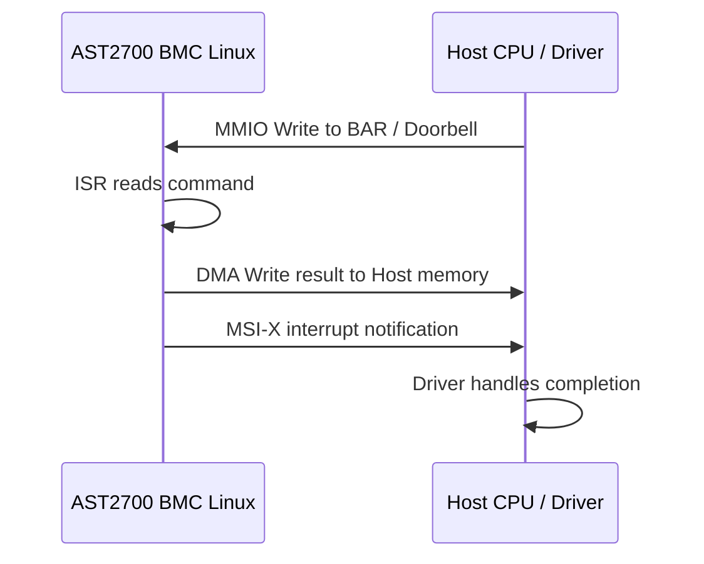
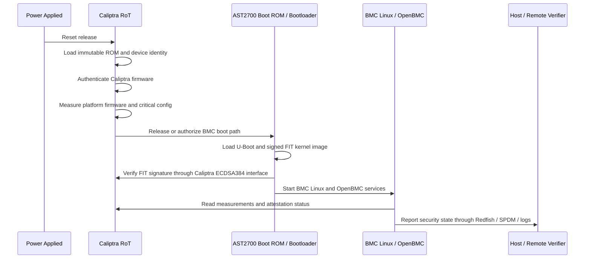
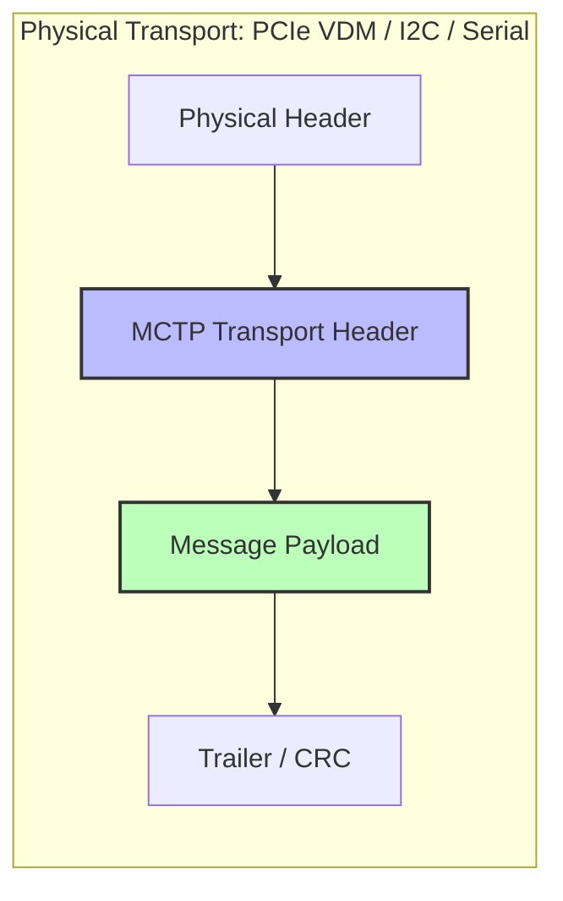
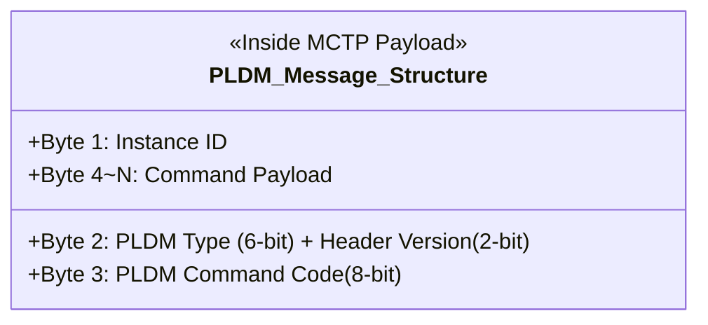

# AST2700 PCIe 韌體開發與 OpenBMC 實務手冊

本文件整理 OpenBMC、PCIe Endpoint、DC-SCM、Caliptra、LTPI、MCTP/PLDM，以及 AST2700 韌體開發常見設計情境。內容聚焦於架構理解、開發職責與實務判斷。

---

## 目錄

- [一、OpenBMC 與 BMC 基礎](#一openbmc-與-bmc-基礎)
  - [1.1 In-Band 與 Out-of-Band 管理](#11-in-band-與-out-of-band-管理)
  - [1.2 OpenBMC 軟體架構](#12-openbmc-軟體架構)
- [二、PCIe 協定與韌體開發核心](#二pcie-協定與韌體開發核心)
  - [2.1 PCIe 虛擬 USB：xHCI 控制器架構](#21-pcie-虛擬-usbxhci-控制器架構)
  - [2.2 鍵盤與 USB 存取場景](#22-鍵盤與-usb-存取場景)
- [三、DC-SCM、Caliptra 與 LTPI 技術架構](#三dc-scmcaliptra-與-ltpi-技術架構)
  - [3.1 DC-SCM 伺服器解耦架構](#31-dc-scm-伺服器解耦架構)
  - [3.2 Caliptra 硬體信任根](#32-caliptra-硬體信任根)
  - [3.3 LTPI](#33-ltpi-lvds-tunneling-protocol-and-interface)
  - [3.4 MCTP](#34-mctp-management-component-transport-protocol)
  - [3.5 DC-SCM 與 PCIe 拓樸設計](#35-dc-scm-與-pcie-拓樸設計)
- [四、OpenBMC GPIO 控制流程](#四openbmc-gpio-控制流程)

---

## 一、OpenBMC 與 BMC 基礎

BMC（Baseboard Management Controller）是伺服器主機板上的獨立管理控制器，不依賴 Host 作業系統運作。主要功能包含遠端電源控制、硬體監控、事件記錄、KVM 重導向與虛擬媒體掛載。

### 1.1 In-Band 與 Out-of-Band 管理

伺服器管理路徑可分為 In-Band 與 Out-of-Band（OOB）兩類：

* **In-Band 管理**：管理流量經由 Host CPU、Host OS 與主機網路介面傳輸。優點是可直接使用作業系統內資源；限制是 Host OS 當機、網路驅動失效或主機關機時，管理能力會受影響。
* **Out-of-Band 管理**：管理流量經由 BMC 的處理器、記憶體與管理網路介面傳輸。只要系統具備待機電源，管理員即可透過 BMC 執行遠端重啟、硬體事件查詢、KVM 操作或 ISO 掛載。

OOB 是 BMC 的核心價值：即使 Host OS 不可用，仍能保留基本維運能力。

### 1.2 OpenBMC 軟體架構

OpenBMC 是用於 BMC 的開源 Linux 發行版與管理框架，主要由下列元件組成：

* **Linux Kernel**：負責硬體驅動、中斷處理、檔案系統與網路堆疊。
* **Yocto Project**：負責嵌入式 Linux 映像建構、套件整合與板級客製化。
* **D-Bus**：OpenBMC 服務之間的 IPC 匯流排，用於服務解耦與狀態發布。
* **Daemon Layer**：包含感測器、電源、GPIO、MCTP、PLDM、Redfish 等背景服務。
* **Web UI / Redfish**：提供使用者與自動化系統的管理介面。

> **注意**：D-Bus 是軟體 IPC 機制，不是 PCIe、I2C、LTPI 等硬體匯流排。它負責 OpenBMC 內部服務間的訊息傳遞，不能取代底層硬體協定。

---

## 二、PCIe 協定與韌體開發核心

### 2.1 PCIe 虛擬 USB：xHCI 控制器架構

在 DC-SCM 或進階伺服器平台中，BMC 可透過 PCIe Endpoint 模擬 USB 控制器，減少 BMC 與 HPM 間的實體 USB 走線。此設計讓 AST2700 以 PCIe 裝置形式呈現為 xHCI（eXtensible Host Controller Interface）控制器。

#### 2.1.1 xHCI 核心概念

xHCI 是 USB 3.x Host Controller 的標準介面，並可向下相容 USB 2.0/1.1。傳統平台中，xHCI 通常位於 PCH；在 USB over PCIe 架構中，AST2700 會將自身 PCIe Endpoint 設定為 xHCI 類型裝置，使 Host OS 載入標準 xHCI 驅動。

#### 2.1.2 虛擬 USB 運作流程

1. **PCIe Enumeration**：Host 掃描 PCIe Bus，讀取 AST2700 Endpoint 的 Configuration Space。若 Class Code 設為 `0C0330`，Host 會識別為 USB 3.0 xHCI Controller。
2. **驅動載入**：Host OS 使用內建 xHCI 驅動程式管理該 PCIe 裝置。此時資料實際上經由 PCIe TLP 傳輸，不經過實體 USB D+/D- 或 SuperSpeed 線路。
3. **BMC 產生 xHCI 資料結構**：BMC Linux 與使用者空間服務將 KVM 輸入、滑鼠事件或虛擬媒體資料轉換為 xHCI 規範要求的 Transfer Ring、TRB 與事件資料。
4. **Host 端存取**：Host 端以標準 USB 裝置模型處理資料，因此可將遠端鍵盤、滑鼠或 ISO 映像視為本機 USB 裝置。

#### 2.1.3 架構優點與開發風險

* **優點**：減少 DC-SCM 連接器腳位與實體 USB 走線，將 KVM 與虛擬媒體資料收斂至 PCIe 高速通道。
* **風險**：USB 功能依附 PCIe Link。若 Host 啟用 ASPM L1、觸發 Link Reset，或發生 Endpoint 重新訓練，Host xHCI 驅動可能判定裝置移除，導致 KVM 或虛擬媒體中斷。
* **開發重點**：需明確定義 PCIe 電源管理策略，確認 ASPM、L1 Substates、Link Reset、PERST# 與驅動恢復流程是否符合平台需求。

#### 2.1.4 BMC 本機 USB 與 NVMe 儲存

若 SCM 板上預留 BMC 專用 USB 埠或 M.2 插槽，該裝置可只供 BMC 使用，不暴露給 Host。

1. **BMC 使用實體 USB 裝置**

   AST2700 以 USB Host 身分管理本機 USB 埠。BMC Linux 載入 `xhci-hcd` 或對應 USB Host 驅動，完成裝置枚舉後將隨身碟掛載為 `/dev/sdX`。此路徑不經過對外 PCIe 連接器，Host 不會感知該 USB 裝置。

2. **BMC 使用本機 NVMe SSD**

   若 SCM 板上 M.2 插槽供 BMC 專用，AST2700 對應 PCIe 控制器需設定為 RC（Root Complex）。Link Training 成功後，BMC Linux 載入 NVMe 驅動並產生 `/dev/nvme0n1` 等節點，供日誌、備份映像或本機資料儲存使用。

#### 2.1.5 Linux 在 PCIe Endpoint 架構中的角色

AST2700 上的 Linux 負責將 PCIe Endpoint 硬體包裝成 Host 可識別的功能裝置。主要工作如下：

1. **設定 Endpoint Function（EPF）**

   Linux 透過 ConfigFS 或專用 EPF 驅動設定 Vendor ID、Device ID、Class Code、BAR、MSI/MSI-X 等 Configuration Space 欄位。這些欄位決定 Host 端看到的裝置型態，例如 xHCI 控制器、NVMe 裝置或自定義管理介面。

   Linux Kernel 的 PCIe EPC（Endpoint Controller）框架提供硬體抽象 API，使 EPF 驅動可用一致方式操作不同廠商的 Endpoint 控制器。

2. **配置 BAR 空間**

   Linux 透過 EPC API 將 BAR 對應至 AST2700 內部記憶體或暫存器區域。Host 完成 MMIO 映射後，可透過 Memory Read/Write 存取該區域。

3. **處理 Host 命令**

   Host 對 BAR 寫入 Doorbell 或命令結構時，Endpoint 硬體觸發中斷。BMC 端 ISR 或驅動工作佇列讀取命令內容，並交由對應服務處理。

4. **回傳資料與通知 Host**

   BMC 完成資料準備後，可透過 DMA Engine 將結果寫入 Host 記憶體，再以 MSI/MSI-X 通知 Host 驅動資料已就緒。

```mermaid
sequenceDiagram
    participant BMC as AST2700 BMC Linux
    participant Host as Host CPU / Driver

    Host->>BMC: MMIO Write to BAR / Doorbell
    BMC->>BMC: ISR reads command
    BMC->>Host: DMA Write result to Host memory
    BMC->>Host: MSI-X interrupt notification
    Host->>Host: Driver handles completion
```

**結論**：BMC Linux 負責透過 EPF/EPC 框架定義 Endpoint 行為，處理 Host 命令，並以 DMA 與 MSI-X 完成資料回傳。這是 AST2700 模擬 xHCI、管理介面或其他 PCIe 功能的核心機制。

### 2.2 鍵盤與 USB 存取場景

下表整理常見維護情境、USB Host 所屬位置與資料路徑：

| 場景 | 鍵盤位置 | USB Host | 主要資料路徑 | 是否經過 PCIe |
| :--- | :--- | :--- | :--- | :--- |
| 遠端 KVM 管理 HPM | 維護者電腦 | HPM / Host CPU | 網路 → BMC → 虛擬 xHCI → PCIe → HPM | 是 |
| 本地鍵盤管理 HPM | 伺服器前面板或主機 USB 埠 | HPM / PCH xHCI | 實體 USB 埠 → PCH xHCI → Host OS | 否 |
| 遠端管理 BMC | 維護者電腦 | 不涉及 USB Host | 網路 → BMC NIC → BMC Linux | 否 |
| 本地鍵盤管理 BMC | BMC 專用 USB 埠 | AST2700 xHCI | 實體 USB 埠 → AST2700 xHCI → BMC Linux | 否 |

---

## 三、DC-SCM、Caliptra 與 LTPI 技術架構

### 3.1 DC-SCM 伺服器解耦架構

DC-SCM（Data Center Secure Control Module）是 OCP 推動的模組化伺服器管理架構。其目標是將 Host 運算板與管理控制模組分離，降低平台重複設計與驗證成本。

#### 3.1.1 HPM（Host Processor Module）

HPM 是伺服器的主要運算模組，通常包含：

* CPU、DIMM、PCIe 擴充槽與高速 I/O。
* Host 開機與作業系統執行所需的核心運算資源。
* 與 SCM 連接的 DC-SCI 介面。

HPM 專注於運算與 I/O 擴充；電源時序、平台監控、管理網路與安全控制通常由 SCM 協調。

#### 3.1.2 SCM（Secure Control Module）

SCM 是可抽換的管理控制模組，通常包含：

* BMC，例如 ASPEED AST2700。
* Platform Root of Trust（RoT）、Caliptra、TPM 或安全啟動相關元件。
* BMC SPI Flash、管理網路與必要低速介面。

SCM 的價值在於管理模組可獨立於 HPM 演進。同一套 SCM 設計可支援多種 HPM，降低韌體、硬體與安全驗證成本。

#### 3.1.3 HPM 未開機時仍可運作的介面

在 DC-SCM 架構中，HPM 未開機不代表整台伺服器完全不可管理。只要 SCM/BMC 取得待機電源，OpenBMC 與部分低速管理介面仍可正常運作；但依賴 Host CPU、Host OS 或 PCIe 枚舉的功能，通常要等 HPM 上電後才成立。

| 介面 / 功能 | HPM 未開機時 | 條件與說明 |
| :--- | :---: | :--- |
| BMC 管理網路 | 可用 | BMC NIC、OpenBMC、Web UI、Redfish、SSH 可在待機電源下運作。 |
| OpenBMC 內部服務 | 可用 | D-Bus、sensor daemon、power control daemon、event log 等服務可先啟動。 |
| 電源控制 / Reset 控制 | 可用 | BMC 可透過本地 GPIO、CPLD、PMIC 或 LTPI 隧道化 GPIO 控制 HPM 上電與重置。 |
| SCM 本地感測器 | 可用 | 位於 SCM 且有待機電源的 I2C/I3C 感測器可被 BMC 讀取。 |
| HPM 待機域感測器 | 視設計而定 | 若 HPM 端感測器、I2C mux 或 LTPI receiver 有 standby power，BMC 仍可能讀取部分狀態。 |
| LTPI 低速隧道 | 視設計而定 | 若 HPM 端 LTPI 邏輯位於待機電源域，可傳遞 GPIO、I2C、UART 或 Post Code 類訊號。 |
| MCTP over SMBus / I2C | 視設計而定 | 端點若在待機電源域，BMC 可在 Host OS 未啟動時通訊。 |
| MCTP over PCIe VDM | 通常不可用 | 需要 PCIe link training、Host/PCIe fabric 上電與裝置枚舉。 |
| PCIe xHCI / 遠端 KVM 給 HPM | 不可用 | Host 尚未枚舉 BMC 模擬的 PCIe xHCI 前，鍵盤、滑鼠與虛擬媒體無法送進 HPM。 |
| SCM 本地 USB / NVMe | 可用 | 若裝置只接在 SCM 且由 AST2700 自己擔任 Host 或 Root Complex，不依賴 HPM 開機。 |

**判斷原則**：只依賴 BMC、SCM 本地硬體與待機電源的介面通常可用；需要 HPM CPU、Host OS、PCIe link 或 Host 端驅動參與的介面，通常不可用或只能等 HPM 上電後再啟用。

#### 3.1.4 DC-SCI（Data Center Server Control Interface）

DC-SCI 是 HPM 與 SCM 之間的介面規範，定義連接器腳位、電氣特性與訊號用途，例如 PCIe、LTPI、I2C、USB、電源與重置信號。統一介面有助於不同供應商之間維持模組互通性。

### 3.2 Caliptra 硬體信任根

Caliptra 是開放規格的硬體信任根（Hardware Root of Trust）架構，目標是提供可驗證、可量測、可證明的韌體啟動基礎。它通常整合在 SoC、加速器、智慧網卡、儲存控制器或平台安全控制邏輯中，用於建立裝置自身的信任鏈。

在 AST2700 與 DC-SCM 平台脈絡中，Caliptra 可視為 SCM 安全架構的一部分，重點不在取代 BMC，而是提供更底層的可信啟動與證明能力：

* **Secure Boot**：驗證第一階段韌體與後續韌體映像，防止未授權程式碼進入啟動鏈。
* **Measured Boot**：量測韌體、設定資料與關鍵啟動狀態，產生可追溯的啟動量測紀錄。
* **Attestation**：以硬體保護的金鑰與量測資料產生證明，讓 BMC、Host 或遠端管理系統確認裝置目前執行的韌體狀態。
* **Device Identity**：提供裝置身分與金鑰派生基礎，常用於供應鏈驗證、韌體更新授權與零信任管理流程。

Caliptra 與 OpenBMC 的分工如下：

| 元件 | 職責 |
| :--- | :--- |
| Caliptra | 建立硬體信任根、驗證韌體、保存量測資料、產生 attestation evidence。 |
| AST2700 / BMC | 執行平台管理、收集安全狀態、協調韌體更新、透過 Redfish 或其他管理介面回報狀態。 |
| TPM | 提供平台層級 PCR、金鑰保護與作業系統信任鏈整合。 |
| SPDM | 提供裝置間的安全通道、身分認證與證明資料交換機制。 |

實務上，BMC 可透過驅動或管理服務讀取 Caliptra 的啟動狀態、量測紀錄與 attestation 結果，再將資訊映射至 D-Bus、Redfish 或安全事件記錄。若平台同時支援 SPDM，Caliptra 產生的證明資料可作為 SPDM attestation 流程中的可信證據來源。

**開發重點**：韌體需明確定義 Caliptra 與 BMC 的權責邊界。Caliptra 負責信任根與證明，BMC 負責平台管理與狀態發布；兩者不應互相取代。

#### 3.2.1 加入 Caliptra 後的開機流程

未導入 Caliptra 時，BMC 開機流程通常是 SoC Boot ROM 讀取 SPI Flash，載入 Bootloader，再啟動 Linux Kernel 與 OpenBMC 服務。安全檢查若存在，多半集中在 Boot ROM、Bootloader 或 TPM/UEFI 相關流程。

導入 Caliptra 後，開機流程會多出一條硬體信任鏈。Caliptra 先建立裝置身分、驗證自身韌體，再對 BMC 或平台韌體進行驗證與量測。BMC 啟動後，不只回報「系統已開機」，還需回報「以何種韌體與設定狀態開機」。

```mermaid
sequenceDiagram
    participant Power as Power Applied
    participant Cal as Caliptra RoT
    participant Boot as AST2700 Boot ROM / Bootloader
    participant Linux as BMC Linux / OpenBMC
    participant Host as Host / Remote Verifier

    Power->>Cal: Reset release
    Cal->>Cal: Load immutable ROM and device identity
    Cal->>Cal: Authenticate Caliptra firmware
    Cal->>Cal: Measure platform firmware and critical config
    Cal->>Boot: Release or authorize BMC boot path
    Boot->>Boot: Load U-Boot and signed FIT kernel image
    Boot->>Cal: Verify FIT signature through Caliptra ECDSA384 interface
    Boot->>Linux: Start BMC Linux and OpenBMC services
    Linux->>Cal: Read measurements and attestation status
    Linux->>Host: Report security state through Redfish / SPDM / logs
```

實務流程可拆成下列階段：

1. **Power-on / Reset**

   平台上電後，Caliptra 或平台 RoT 邏輯先進入可控制狀態。此階段會讀取 fuse、生命週期狀態、裝置身分資料與安全設定。

2. **Caliptra ROM 啟動**

   Caliptra ROM 屬於信任鏈起點，通常視為不可變更程式碼。它負責驗證 Caliptra Runtime Firmware，並建立後續量測與證明所需的基礎狀態。

3. **Caliptra Runtime Firmware 啟動**

   Caliptra Runtime Firmware 通過驗證後開始執行，接手韌體量測、金鑰派生、attestation 資料準備與安全服務。

4. **BMC 韌體載入、驗證與量測**

   在公開 U-Boot 支援中，AST2700 可透過 Caliptra ECDSA384 硬體介面支援 signed FIT image 驗證。也就是由 U-Boot 執行 FIT verified boot 流程，並使用 Caliptra 提供的 ECDSA384 簽章驗證能力。Linux kernel、initrd 與 device tree 是否被納入驗證範圍，取決於平台是否採用 signed FIT 映像與對應的 U-Boot 設定。

   需特別區分兩件事：

   * **Secure Boot**：驗證簽章，決定映像是否允許執行。
   * **Measured Boot**：計算雜湊並記錄量測值，不一定阻止映像執行，但可供後續 attestation 判斷可信狀態。

   因此，較精準的說法是：U-Boot 驗證 signed FIT kernel image，並可透過 AST2700 內建 Caliptra ECDSA384 硬體介面完成簽章驗證。

5. **BMC Linux / OpenBMC 啟動**

   AST2700 進入正常 Bootloader 與 Linux 開機流程。OpenBMC 服務啟動後，可讀取 Caliptra 狀態、量測紀錄、錯誤碼與 attestation evidence，並映射至 D-Bus、Redfish 或事件日誌。

6. **Host 或遠端驗證**

   Host、管理系統或遠端 verifier 可透過 Redfish、SPDM 或平台定義介面取得證明資料，確認 BMC 與平台韌體是否符合預期版本與量測值。

| 階段 | 未加入 Caliptra | 加入 Caliptra 後 |
| :--- | :--- | :--- |
| 信任起點 | SoC Boot ROM 或平台既有 RoT | Caliptra ROM / 硬體信任根 |
| 韌體驗證 | 多由 Boot ROM、Bootloader 或廠商機制處理 | 可由 Caliptra、Boot ROM 或 Bootloader 分工完成驗證與量測 |
| 啟動紀錄 | 多為一般 boot log | 產生可用於 attestation 的量測紀錄 |
| 遠端可信度 | 管理端主要相信 BMC 回報 | 管理端可驗證 Caliptra 簽署或保護的 evidence |
| 失敗處置 | 依 Bootloader 或平台設計決定 | 可進入 recovery、拒絕放行下一階段，或上報安全事件 |

**開發注意事項**：

* 需定義哪些映像必須驗證，哪些資料只需量測。
* 需定義驗證失敗時的策略：停止開機、切換 recovery image、降級功能，或允許開機但標記安全狀態異常。
* 需讓 OpenBMC 能讀取 Caliptra 狀態，並以穩定的 D-Bus/Redfish 介面回報。
* 若與 SPDM 整合，需確認 attestation evidence、憑證鏈與 measurement block 的格式與生命週期管理。

### 3.3 LTPI（LVDS Tunneling Protocol and Interface）

LTPI 是 DC-SCM 2.0 中用於低速控制訊號隧道化的技術。它將 GPIO、I2C/I3C、UART、Post Code 等訊號封裝後，透過少量 LVDS 差分線在 HPM 與 SCM 間傳輸。

* **定位**：低速控制訊號的封裝與傳輸機制。
* **目的**：降低 DC-SCI 連接器腳位需求，取代大量獨立低速訊號線。
* **本質**：偏硬體與鏈路層設計，與 D-Bus 等軟體 IPC 無直接對應關係。
* **韌體重點**：需完成 LTPI 控制器初始化、鏈路訓練、握手流程、錯誤狀態處理與訊號映射設定。

### 3.4 MCTP（Management Component Transport Protocol）

MCTP 是 DMTF 制定的管理通訊協定，用於 BMC、CPU、SmartNIC、NVMe、CXL 裝置等元件間的管理訊息傳輸。其特點是傳輸層獨立，可承載於不同實體介面。

常見傳輸方式包含：

* **MCTP over PCIe VDM**：使用 PCIe Vendor Defined Message，適合高速平台內管理通訊。
* **MCTP over SMBus / I2C**：使用既有低速管理匯流排，普及度高。
* **MCTP over Serial**：用於特定序列傳輸場景。

MCTP 本身只定義管理訊息傳輸與路由；上層管理內容通常由 PLDM、SPDM 或 NVMe-MI 承載。

* **PLDM（Platform Level Data Model）**：負責平台狀態、感測器、FRU、BIOS 設定與韌體更新等管理模型。
* **SPDM（Security Protocol and Data Model）**：負責裝置身分驗證、憑證交換與安全通道建立。
* **NVMe-MI**：負責 NVMe 裝置管理與狀態查詢。

#### 3.4.1 MCTP 封包格式

MCTP 封包通常被包在底層實體傳輸格式中，例如 PCIe VDM 或 I2C。概念結構如下：

```mermaid
graph LR
    subgraph PhysicalLayer ["Physical Transport: PCIe VDM / I2C / Serial"]
        A[Physical Header] --> B[MCTP Transport Header]
        B --> C[Message Payload]
        C --> D[Trailer / CRC]
    end
    style B fill:#bbf,stroke:#333,stroke-width:2px
    style C fill:#bfb,stroke:#333,stroke-width:2px
```

MCTP Transport Header 為固定 4 Bytes：

| Byte | 欄位 | 說明 |
| :--- | :--- | :--- |
| Byte 1 | `Rsvd` + `Header Version` | 保留欄位與版本號，常見版本為 `0x01`。 |
| Byte 2 | `Destination EID` | 目的端點 ID。 |
| Byte 3 | `Source EID` | 來源端點 ID。 |
| Byte 4 | `SOM`、`EOM`、`PktSeq`、`TO`、`Msg Tag` | 控制訊息分段、重組、請求/回應關聯與 Tag 管理。 |

**MCTP Transport Header Layout（Fixed 4 Bytes / 32 bits）**

<table>
  <tr>
    <th style="text-align:center;">Byte</th>
    <th style="text-align:center;">Bit 7</th>
    <th style="text-align:center;">Bit 6</th>
    <th style="text-align:center;">Bit 5</th>
    <th style="text-align:center;">Bit 4</th>
    <th style="text-align:center;">Bit 3</th>
    <th style="text-align:center;">Bit 2</th>
    <th style="text-align:center;">Bit 1</th>
    <th style="text-align:center;">Bit 0</th>
  </tr>
  <tr>
    <td style="text-align:center;"><strong>Byte 1</strong></td>
    <td colspan="4" style="text-align:center;background:#fef3c7;"><strong>Rsvd</strong> <em>4-bit</em></td>
    <td colspan="4" style="text-align:center;background:#dbeafe;"><strong>Header Version</strong> <em>4-bit</em></td>
  </tr>
  <tr>
    <td style="text-align:center;"><strong>Byte 2</strong></td>
    <td colspan="8" style="text-align:center;background:#dcfce7;"><strong>Destination EID</strong> <em>8-bit</em></td>
  </tr>
  <tr>
    <td style="text-align:center;"><strong>Byte 3</strong></td>
    <td colspan="8" style="text-align:center;background:#ede9fe;"><strong>Source EID</strong> <em>8-bit</em></td>
  </tr>
  <tr>
    <td style="text-align:center;"><strong>Byte 4</strong></td>
    <td style="text-align:center;background:#fee2e2;"><strong>SOM</strong> <em>1</em></td>
    <td style="text-align:center;background:#fee2e2;"><strong>EOM</strong> <em>1</em></td>
    <td colspan="2" style="text-align:center;background:#cffafe;"><strong>PktSeq</strong> <em>2-bit</em></td>
    <td style="text-align:center;background:#fce7f3;"><strong>TO</strong> <em>1</em></td>
    <td colspan="3" style="text-align:center;background:#e0e7ff;"><strong>Msg Tag</strong> <em>3-bit</em></td>
  </tr>
</table>

若封包為完整訊息或第一個分段（`SOM = 1`），Message Payload 的第一個 Byte 為 Message Type，用於指定上層協定：

| Message Type | 協定 |
| :---: | :--- |
| `0x00` | MCTP Control Message |
| `0x01` | PLDM |
| `0x04` | NVMe-MI |
| `0x05` | SPDM |

#### 3.4.2 PLDM 模組化架構

當 MCTP Message Type 為 `0x01` 時，Payload 為 PLDM 訊息。PLDM 使用 `PLDM Type` 與 `PLDM Command` 組成管理命令。

```mermaid
classDiagram
    class PLDM_Message_Structure {
        <<Inside MCTP Payload>>
        +Byte 1: Instance ID
        +Byte 2: PLDM Type (6-bit) + Header Version (2-bit)
        +Byte 3: PLDM Command Code (8-bit)
        +Byte 4~N: Command Payload
    }
```

常見 PLDM Type：

| PLDM Type | 名稱 / 規範 | 功能 |
| :---: | :--- | :--- |
| Type 0 | Base / Discovery（DSP0240） | 查詢裝置支援的 PLDM Type 與版本。 |
| Type 2 | BIOS Control（DSP0247） | 讀取或設定 Host BIOS 參數。 |
| Type 3 | Monitoring & Control（DSP0248） | 感測器、狀態監控與 PDR 管理。 |
| Type 4 | FRU Data（DSP0257） | 讀取 FRU 資產資訊。 |
| Type 5 | Firmware Update（DSP0267） | 標準化韌體傳輸、驗證、燒錄與啟用流程。 |
| Type 6 | RDE（DSP0218） | 將 Redfish 裝置模型映射至 PLDM 傳輸。 |

PLDM 採模組化設計，裝置只需實作必要 Type。例如溫度感測器可能支援 Type 0 與 Type 3；NVMe 裝置可能支援 Type 0、Type 4 與 Type 5。

#### 3.4.3 OpenBMC 中的 MCTP/PLDM 分層

OpenBMC 通常將 MCTP/PLDM 處理放在 User-space Daemon，而非 Kernel 內部：

1. **Linux Kernel**：負責硬體驅動、PCIe VDM/I2C 收送、中斷處理與 `AF_MCTP` 等介面。Kernel 不解析 PLDM 業務邏輯。
2. **`mctpd`**：負責 MCTP 網路探索、EID 分配、路由管理與 Control Message。
3. **`pldmd`**：負責 PLDM Discovery、感測器/FRU/韌體更新等管理邏輯，並將狀態發布至 D-Bus，供 Redfish、Web UI 或其他服務使用。

此分層可降低 Kernel 複雜度，並讓 PLDM 功能擴充集中於 User-space。

### 3.5 DC-SCM 與 PCIe 拓樸設計

AST2700 在 DC-SCM 架構中管理 SSD 或其他 PCIe 裝置時，常見拓樸如下。

#### 場景一：標準 DC-SCM 2.0 設計

* **架構**：AST2700 以 PCIe Endpoint 連接 HPM，不將額外 PCIe RC 腳位暴露到 DC-SCI。
* **管理路徑**：BMC 透過 MCTP over PCIe VDM，經 Host CPU 或 PCIe Switch 轉發管理命令至 SSD。
* **優點**：符合 DC-SCM 標準互通性，不額外占用連接器腳位。
* **要求**：韌體需完整支援 MCTP、PLDM 或 NVMe-MI 等管理協定。

#### 場景二：SCM 本地 PCIe RC 擴充

* **架構**：AST2700 將本機 PCIe 控制器設定為 RC，連接 SCM 板上的 M.2 SSD。
* **管理路徑**：AST2700 RC → SCM 板內 PCIe 走線 → 本機 SSD。
* **優點**：PCIe 訊號不離開 SCM，不影響 DC-SCI 腳位定義；適合 BMC 日誌、備份與本地高速儲存。
* **限制**：該 SSD 屬於 BMC 本機資源，Host 預設不可直接存取。

#### 場景三：客製化跨板 PCIe RC 設計

* **架構**：將 AST2700 PCIe RC 腳位拉至 DC-SCI，直接連接 HPM 上的 SSD 或 PCIe 裝置。
* **風險**：可能破壞標準 DC-SCM 腳位相容性，導致 SCM 無法跨平台抽換。
* **適用情境**：僅適合明確控制 HPM/SCM 成套設計的大型客製平台，不建議作為通用 DC-SCM 設計。

---

## 四、OpenBMC GPIO 控制流程

OpenBMC 控制 GPIO 時通常不直接由應用程式寫硬體暫存器，而是經過使用者介面、D-Bus、Daemon、Kernel Driver 與硬體控制器。AST2700/DC-SCM 平台還需區分本地 GPIO 與 LTPI 隧道化 GPIO。

### 第一階段：使用者與應用層

管理需求可來自 Web UI、Redfish API、CLI 或測試工具。例如維護者切換電源狀態，或開發者透過 `gpioset` 操作指定 GPIO line。

OpenBMC 相關服務接收請求後，轉換為平台內部的狀態變更或 GPIO 操作。

### 第二階段：D-Bus 層

OpenBMC 服務透過 D-Bus 傳遞狀態與命令。D-Bus 負責服務間溝通，使 Web UI、Redfish、電源控制服務與 GPIO 管理服務不需直接耦合。

### 第三階段：Kernel 與驅動層

GPIO 管理服務透過 `libgpiod` 或 Kernel GPIO 介面下達操作。Linux Kernel 中的 ASPEED GPIO Driver 接手後，將抽象 GPIO 操作轉換為硬體暫存器存取或對應控制器命令。

### 第四階段：實體傳輸層

依 GPIO 所在位置分為兩種模式：

1. **本地 GPIO**

   Driver 直接操作 AST2700 內部 GPIO 控制器暫存器，晶片實體腳位電平隨之改變。

2. **LTPI 隧道化 GPIO**

   若目標 GPIO 位於 HPM，AST2700 需將 GPIO 狀態交由 LTPI 控制器封裝，透過 LVDS Link 傳至 HPM 端接收邏輯，再還原為目標腳位狀態。

```mermaid
flowchart LR
    A[Web UI / Redfish / CLI] --> B[OpenBMC Service]
    B --> C[D-Bus]
    C --> D[GPIO Daemon / libgpiod]
    D --> E[Linux GPIO Driver]
    E --> F{GPIO Location}
    F -->|Local| G[AST2700 GPIO Register]
    F -->|Remote HPM| H[LTPI Controller]
    H --> I[LVDS Link]
    I --> J[HPM LTPI Receiver]
    J --> K[Target GPIO Pin]
```

---

## 適用範圍

本文件適用於 AST2700 PCIe Endpoint、OpenBMC、DC-SCM、Caliptra、LTPI 與 MCTP/PLDM 相關韌體開發、平台 bring-up 與架構討論。
