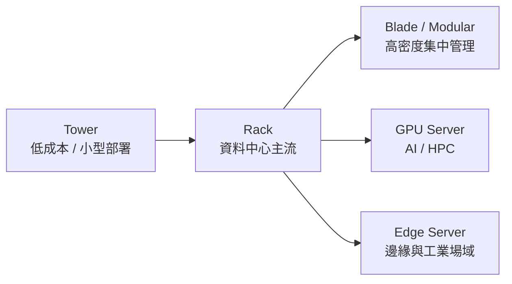
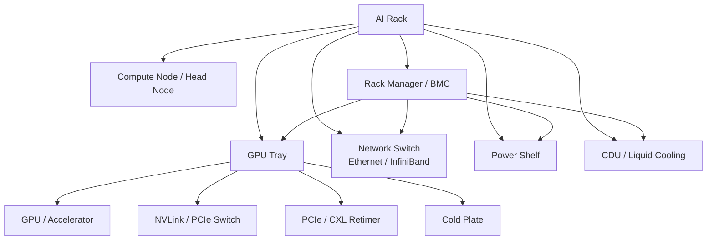
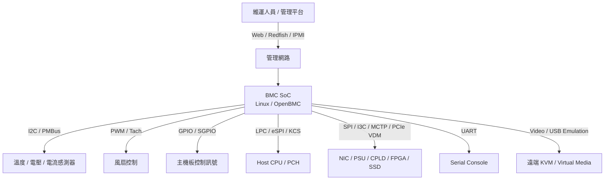
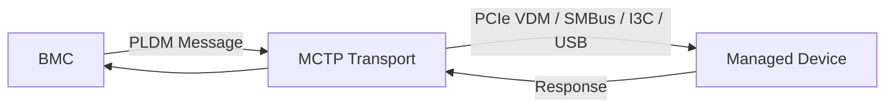

# BMC 基礎知識、伺服器應用與管理協定總整理

> 本文件整理伺服器分類、AI rack 關鍵元件、BMC 基礎概念、典型應用與管理協定，作為後續學習 OpenBMC、Redfish、PLDM、MCTP、PCIe 等主題的基礎。

---

## 目錄

- [0. 伺服器種類](#0-伺服器種類)
- [1. AI Rack 與高階 GPU 平台名詞](#1-ai-rack-與高階-gpu-平台名詞)
- [2. BMC 是什麼](#2-bmc-是什麼)
- [3. BMC 在系統中的位置](#3-bmc-在系統中的位置)
- [4. 基礎功能](#4-基礎功能)
- [5. 基本應用場景](#5-基本應用場景)
- [6. 常見管理介面與協定](#6-常見管理介面與協定)
- [7. 速查表](#7-速查表)

---

## 0. 伺服器種類

BMC 的功能深度通常取決於伺服器等級、應用場景與硬體複雜度。因此，理解伺服器分類有助於判斷 BMC 的管理需求。

### 0.1 依等級分類

<div align="center">

| 等級 | 常見定位 | 主要特徵 | 典型應用 |
|:--:|:--|:--|:--|
| <span style="color:#16a34a"><b>低階 / Entry-level</b></span> | 小型企業、實驗室、分店 | 單 CPU、少量記憶體與儲存，管理功能較基本。 | 檔案伺服器、小型網站、NAS、測試機、AD/DNS。 |
| <span style="color:#2563eb"><b>中階 / Mainstream</b></span> | 企業主力平台 | 1 到 2 顆 CPU、較多 DIMM、RAID、雙電源、完整 BMC。 | 虛擬化、資料庫、ERP、Web service、CI/CD。 |
| <span style="color:#9333ea"><b>高階 / Enterprise</b></span> | 關鍵任務、高可靠性 | 多 CPU、大量記憶體、熱插拔、強 RAS、冗餘設計。 | 金融、電信、核心資料庫、SAP HANA、大型虛擬化。 |
| <span style="color:#dc2626"><b>AI / HPC</b></span> | GPU 或加速器運算 | 多 GPU、高功耗、高散熱、液冷、高速網路。 | AI training、AI inference、HPC、科學運算。 |
| <span style="color:#ea580c"><b>Edge Server</b></span> | 邊緣場域 | 短機身、耐溫、低功耗、遠端維運重要。 | 工廠、零售、基地台、影像分析、IoT gateway。 |

</div>

重點：

- **低階伺服器**重成本與容易部署。
- **中階伺服器**重通用性、穩定性與維護性。
- **高階伺服器**重冗餘、可靠性、熱插拔與不中斷維運。
- **AI / HPC 伺服器**重 GPU、功耗、散熱、高速互連與高密度管理。
- **Edge 伺服器**重環境適應、遠端管理與低人力維護。

### 0.2 依外型分類

| 類型 | 說明 | 優點 | 限制 |
|:--|:--|:--|:--|
| Tower Server | 外型類似大型桌機，可放置於辦公室或小型機房。 | 成本低、噪音較低、維護容易。 | 不適合大量部署，空間效率較低。 |
| Rack Server | 放入標準 19 吋機櫃，常見 1U、2U、4U。 | 資料中心主流，擴充彈性好。 | 需要機櫃、機房、散熱與線材管理。 |
| Blade Server | 多片 blade 插入同一 chassis，共用電源、散熱與網路背板。 | 高密度、集中管理、線材較少。 | chassis 成本高，平台綁定度高。 |
| Modular Server | 多節點或模組化設計，可依 workload 組合。 | 適合雲端、大規模或特殊部署。 | 架構複雜，維護方式依廠商差異大。 |
| GPU Server | 通常為 2U、4U、8U，搭載多張 GPU 或 accelerator。 | AI/HPC 運算能力高。 | 功耗、散熱、成本與 BMC 管理複雜度高。 |
| Edge / Rugged Server | 部署在邊緣、工業、戶外或空間受限環境。 | 可在較嚴苛環境運作，遠端維運價值高。 | 擴充性通常較低。 |



### 0.3 主流廠商與供應鏈角色

伺服器市場包含品牌廠、ODM、白牌供應鏈、晶片平台、BMC SoC、網卡與加速器供應商。

| 類別 | 常見廠商 |
|:--|:--|
| 國際品牌 OEM | Dell Technologies、HPE、Lenovo、Cisco、Fujitsu。 |
| 高密度 / AI 伺服器廠商 | Supermicro、Gigabyte、ASUS、ASRock Rack、QCT。 |
| 中國與亞洲大型供應商 | Inspur / IEIT Systems、Huawei、xFusion、Sugon、H3C。 |
| ODM / 雲端白牌 | Quanta、Wiwynn、Inventec、Foxconn、MiTAC、Celestica。 |
| CPU / 平台核心供應商 | Intel、AMD、Ampere、NVIDIA、ARM ecosystem。 |
| BMC SoC 供應商 | ASPEED、Nuvoton。 |

近年伺服器市場由 **AI server / GPU server** 明顯推動。傳統通用伺服器仍是企業 IT 主力，但高階 GPU 平台、液冷、高速網路與資料中心整合，持續擴大 BMC 的管理範圍。

### 0.4 應用區別

| 應用 | 常見伺服器類型 | 重點 |
|:--|:--|:--|
| Web / App Server | 1U / 2U rack，中階平台即可。 | 網路、CPU、可靠性、水平擴充。 |
| Database | 中高階 2U / 4U。 | 記憶體、NVMe、RAID、備援與低延遲。 |
| Virtualization | 中高階 2 socket server。 | CPU core、RAM、網路、儲存與 VM density。 |
| Storage Server | 2U / 4U 多硬碟機型。 | 硬碟槽、HBA/RAID、散熱、資料保護。 |
| AI Training | 4U / 8U GPU server。 | GPU 數量、PCIe/NVLink、高速網路、液冷。 |
| AI Inference | GPU server 或 edge server。 | 延遲、功耗、部署位置、服務穩定性。 |
| Telecom / Edge | Edge / rugged server。 | 遠端管理、耐溫、短機身、長時間無人值守。 |
| HPC | 高密度 CPU/GPU server。 | 高速網路、平行運算、散熱與排程系統。 |
| 小型辦公室 | Tower / entry rack。 | 成本、噪音、維護便利性與基本備份。 |

### 0.5 不同等級伺服器對 BMC 的需求

| 伺服器類型 | BMC 需求重點 |
|:--|:--|
| 低階伺服器 | 基本遠端開關機、sensor、event log、基礎 Web UI。 |
| 中階伺服器 | Redfish、IPMI、firmware update、SOL、KVM、fan control、power policy。 |
| 高階伺服器 | 冗餘電源管理、熱插拔事件、故障隔離、RAS event、完整 telemetry。 |
| AI / HPC Server | 多 GPU 溫度與功耗監控、PCIe topology、液冷狀態、MCTP/PLDM 裝置管理。 |
| Edge Server | 遠端復原、看門狗、網路自癒、低頻寬管理、安全更新。 |

摘要：

> **伺服器越高階，BMC 越不只是看 sensor，而是整台機器的遠端維運、韌體更新、故障診斷與平台管理中心。**

---

## 1. AI Rack 與高階 GPU 平台名詞

AI Rack 是針對 AI training / inference 設計的 **整櫃級系統架構**，不是單一零件，也不是單純一台伺服器。隨著功耗、散熱與高速互連規模提高，BMC 或 rack manager 需要管理 GPU tray、switch、retimer、CXL device、液冷系統等元件。

### 1.1 系統層級

| 名詞 | 層級 | 說明 |
|:--|:--|:--|
| GPU Server | 單台伺服器 | 一台機器內包含 CPU、GPU、記憶體、網卡與 BMC。 |
| GPU Tray | 模組 | 承載 GPU 的抽屜式模組，常見於高密度 AI server。 |
| AI Rack | 整櫃系統架構 | 一個 rack 內整合 compute node、GPU tray、switch、power shelf、液冷設備與 rack manager。 |
| Data Center | 多櫃 / 機房 | 多個 rack 組成 cluster 或資料中心。 |

> **AI Rack 是 rack-scale architecture，重點在於整櫃電源、散熱、高速互連與模組化維運。**

### 1.2 常見名詞

| 名詞 | 說明 | BMC / 管理控制器關聯 |
|:--|:--|:--|
| AI Rack | 針對 AI training / inference 設計的整櫃系統，包含 compute node、GPU tray、switch、power shelf、液冷設備。 | 管理整櫃電源、散熱、GPU、網路與故障事件。 |
| GPU Tray | 承載 GPU 的抽屜式模組。 | 偵測插拔、GPU 狀態、溫度、功耗、故障。 |
| Switch | 可指 PCIe switch、NVLink switch、Ethernet switch、InfiniBand switch。 | 監控 link、port、溫度、錯誤計數、firmware。 |
| Retimer | PCIe / CXL 高速訊號重整晶片。 | 監控 link health、錯誤計數、溫度、firmware。 |
| CXL | Compute Express Link，基於 PCIe 的高速互連協定。 | 管理 CXL memory device、錯誤事件、溫度與韌體。 |
| Liquid Cooling | 液冷系統，包含 cold plate、CDU、pump、valve、flow sensor、leak sensor。 | 監控水溫、流量、壓力、泵浦、閥門、漏液。 |

### 1.3 AI Rack 的概念架構



### 1.4 Switch 的種類

| Switch 類型 | 用途 | 常見管理重點 |
|:--|:--|:--|
| PCIe Switch | 擴充 CPU 對 GPU、NVMe、DPU、accelerator 的連接。 | link width/speed、錯誤計數、溫度、firmware。 |
| NVLink Switch | 提供 NVIDIA GPU 間高頻寬互連。 | fabric 狀態、link health、溫度、錯誤事件。 |
| Ethernet Switch | 資料網路或管理網路。 | port link、VLAN、溫度、firmware。 |
| InfiniBand Switch | AI/HPC cluster 低延遲高速網路。 | fabric health、port state、cable、錯誤計數。 |

### 1.5 Liquid Cooling 常見元件

| 元件 | 說明 | 管理重點 |
|:--|:--|:--|
| Cold Plate | CPU/GPU 導熱模組。 | 進出水溫、熱交換效率。 |
| Coolant | 冷卻液。 | 溫度、壓力、流量。 |
| Pump | 冷卻液循環泵浦。 | 轉速、故障、冗餘狀態。 |
| Valve | 流量或流向控制閥。 | 開關狀態、控制命令、異常狀態。 |
| Flow Sensor | 流速感測器。 | 流量不足、堵塞偵測。 |
| Leak Sensor | 漏液感測器。 | 漏液告警、保護流程。 |
| CDU | Coolant Distribution Unit，冷卻液分配與換熱設備。 | 進出水溫、壓力、pump、alarm。 |

### 1.6 為什麼這些名詞對 BMC 重要

在 AI rack / GPU server 中，BMC 或 rack manager 需額外處理：

- GPU / accelerator 溫度、功耗、錯誤事件。
- PCIe / NVLink / InfiniBand 高速互連狀態。
- retimer、switch、CXL device 的 link health 與 firmware。
- GPU tray、power shelf、fan module、liquid cooling module 插拔與故障。
- 液冷流量、壓力、漏液與保護動作。
- 整櫃 power budget、thermal policy、降載與故障隔離。

摘要：

> **AI 平台越高密度，BMC 越接近整櫃級健康監控與保護系統。**

---

## 2. BMC 是什麼

**BMC** 是 **Baseboard Management Controller**，中文常譯為 **基板管理控制器**。它是獨立於主機 CPU 的管理晶片，常見於 server、storage、network appliance、AI server、telecom equipment 等需要遠端維運的設備。

<div align="center">

| 角色 | 說明 |
|:--:|:--|
| <span style="color:#2563eb"><b>獨立管理控制器</b></span> | 即使 host CPU 未開機，BMC 仍可透過 standby power 運作。 |
| <span style="color:#16a34a"><b>硬體監控中心</b></span> | 讀取溫度、電壓、風扇、電源、事件紀錄等硬體狀態。 |
| <span style="color:#dc2626"><b>遠端維運入口</b></span> | 提供 Web UI、Redfish、IPMI、KVM、SOL、遠端開關機等功能。 |
| <span style="color:#9333ea"><b>韌體更新橋樑</b></span> | 可更新 BMC firmware、BIOS/UEFI、CPLD、FPGA、SSD/NIC firmware。 |

</div>

**BMC 是主機板上的獨立管理控制器**，負責設備管理、監控、維護與故障恢復。

---

## 3. BMC 在系統中的位置



BMC 通常具備 CPU core、DDR、Flash、Ethernet MAC、GPIO、I2C、UART、PWM、ADC、SPI、PCIe 或 eSPI 等介面，並透過這些介面控制主板與周邊裝置。

---

## 4. 基礎功能

### 4.1 電源與開關機控制

BMC 可控制 host power sequence，例如：

- 遠端開機、關機、重開機
- power button 模擬
- reset button 模擬
- AC power restore policy
- power good / power fault 監控

### 4.2 感測器監控

常見 sensor 類型如下：

| 類型 | 來源 | 用途 |
|:--|:--|:--|
| Temperature | CPU、DIMM、VR、板上熱敏電阻 | 過熱保護、風扇策略 |
| Voltage | VR、PSU、主板 rail | 電源異常偵測 |
| Current / Power | PMBus、PSU、hot-swap controller | 功耗管理 |
| Fan Tach | 風扇回饋訊號 | 風扇故障偵測 |
| Intrusion | chassis switch | 機箱入侵紀錄 |

### 4.3 事件紀錄

BMC 會保存系統事件，常見類型包含：

- sensor threshold crossing
- power fault
- fan fault
- boot failure
- watchdog timeout
- firmware update result
- host crash / machine check

在 OpenBMC 中，事件通常由 `phosphor-logging` 記錄，並透過 Redfish Event Log 或 journal 查詢。

### 4.4 遠端 Console 與 KVM

| 功能 | 說明 |
|:--|:--|
| SOL | Serial over LAN，將 UART console 轉為網路連線。 |
| KVM | 遠端觀看 host 畫面並操作鍵盤滑鼠。 |
| Virtual Media | 掛載遠端 ISO 或 image，常用於 OS 安裝與救援。 |

### 4.5 韌體更新

BMC 常負責多類韌體更新：

- BMC image
- BIOS / UEFI
- CPLD / FPGA
- PSU firmware
- NIC firmware
- SSD / NVMe firmware

韌體更新流程通常需考量 **版本管理、簽章驗證、rollback、A/B image、失敗恢復**。

---

## 5. 基本應用場景

### 5.1 資料中心遠端維運

當伺服器位於機房或遠端站點時，維運人員可透過 BMC：

- 查詢硬體健康狀態
- 遠端重開機
- 讀取 event log
- 查看 boot console
- 掛載 OS installer
- 更新 firmware

### 5.2 量產測試與板級驗證

BMC 在工廠或實驗室也常用於自動化測試：

- 自動上下電循環
- sensor sweep
- fan table 驗證
- GPIO / I2C / UART 測試
- FRU / EEPROM 寫入
- BIOS 設定與版本檢查

### 5.3 故障診斷與恢復

當 host 無法開機時，BMC 仍可能維持運作，可協助：

- 讀取 POST code
- 擷取 console log
- 檢查電源 rail
- 觸發 crash dump
- 更新 BIOS 後救援
- 比對上一次正常 boot 的事件紀錄

### 5.4 大規模管理平台整合

現代管理平台多透過 **Redfish** 進行標準化管理，可整合：

- inventory
- sensor telemetry
- power control
- firmware update
- account and privilege
- event subscription

---

## 6. 常見管理介面與協定

### 6.0 DMTF 是什麼

**DMTF** 是 **Distributed Management Task Force**，為制定 IT 基礎架構、伺服器、資料中心與平台管理標準的產業標準組織。

在 BMC 領域的定位：

> **DMTF 定義管理標準，BMC 實作這些標準，管理平台再透過這些標準控制與監控伺服器。**

DMTF 與 BMC 最相關的標準包含：

| 標準 | 說明 |
|:--|:--|
| Redfish | 現代伺服器管理 API，使用 RESTful + JSON。 |
| PLDM | Platform Level Data Model，用於描述 sensor、FRU、firmware update 等平台管理資料。 |
| MCTP | Management Component Transport Protocol，用於在 SMBus、I3C、PCIe、USB 等媒介上傳輸管理訊息。 |
| SPDM | Security Protocol and Data Model，用於裝置身份驗證、量測驗證與安全 session。 |
| SMBIOS | System Management BIOS，用於描述 BIOS、主板、CPU、DIMM、序號等系統硬體資訊。 |
| CIM | Common Information Model，較早期的管理資料模型。 |

### 6.1 管理介面比較

| 介面 / 協定 | 特色 | 常見用途 |
|:--|:--|:--|
| Redfish | DMTF 定義，RESTful、JSON、現代化標準 | 資料中心管理、自動化平台 |
| IPMI | 傳統 server management 標準 | 舊系統相容、基本 power/sensor/event |
| PLDM | DMTF 定義，Platform Level Data Model | firmware update、sensor、FRU、host-BMC 溝通 |
| MCTP | DMTF 定義，Management Component Transport Protocol | 在 SMBus/I3C/PCIe/USB 等媒介上傳管理訊息 |
| SPDM | DMTF 定義，Security Protocol and Data Model | 裝置身份驗證、measurement、secure session |
| D-Bus | OpenBMC 內部 IPC | services 之間交換狀態與物件 |
| SSH | shell access | 開發、除錯、維運 |
| Web UI | 瀏覽器操作 | 手動管理與視覺化監控 |

### 6.2 Redfish 的定位

Redfish 是現代 BMC 對外的主要管理 API。常見 endpoint 類型：

```text
/redfish/v1/Systems
/redfish/v1/Chassis
/redfish/v1/Managers
/redfish/v1/UpdateService
/redfish/v1/AccountService
/redfish/v1/EventService
```

### 6.3 MCTP / PLDM 的定位

MCTP 負責傳輸層，PLDM 負責資料模型，兩者常搭配使用：



### 6.4 SPDM 的定位

**SPDM** 是 **Security Protocol and Data Model**，用於平台內部元件的身份驗證、量測驗證與安全通道建立。常見 requester 是 BMC 或 host，responder 則可能是 NIC、GPU、CXL device、SSD、retimer、accelerator 等裝置。

| 功能 | 說明 |
|:--|:--|
| Certificate | 驗證裝置身份，確認裝置是否來自可信任廠商或平台。 |
| Measurement | 驗證裝置 firmware、boot state、configuration 是否符合安全政策。 |
| Challenge | 確認裝置持有對應私鑰，避免偽裝裝置。 |
| Secure session | 建立具加密與完整性保護的管理通道。 |

SPDM 與 MCTP / PLDM 的關係：

| 名詞 | 角色 |
|:--|:--|
| MCTP | 管理訊息的傳輸層。 |
| PLDM | 管理資料模型，例如 sensor、FRU、firmware update。 |
| SPDM | 安全驗證與安全 session。 |

摘要：

> **MCTP 解決訊息怎麼送，PLDM 解決資料怎麼表達，SPDM 解決裝置是否可信與通訊是否安全。**

---

## 7. 速查表

### 7.1 BMC 核心心智模型

<div align="center">

| 問題 | 答案 |
|:--:|:--|
| BMC 管什麼？ | 電源、感測器、風扇、事件、console、firmware、遠端管理。 |
| BMC 何時能工作？ | 只要 standby power 存在，通常 host 關機也能工作。 |
| OpenBMC 對外主要 API？ | Redfish。 |
| OpenBMC 內部主要 IPC？ | D-Bus。 |
| OpenBMC 怎麼建構？ | Yocto + BitBake。 |
| 新板子最常改哪裡？ | DTS、machine config、sensor config、GPIO、fan policy、recipe。 |

</div>

### 7.2 名詞對照

| 名詞 | 說明 |
|:--|:--|
| BMC | Baseboard Management Controller，基板管理控制器。 |
| Host | 被 BMC 管理的主系統，例如 x86/ARM server。 |
| SoC | System on Chip，BMC 本身通常是一顆 SoC。 |
| FRU | Field Replaceable Unit，可替換元件資訊。 |
| SEL | System Event Log，系統事件紀錄。 |
| SOL | Serial over LAN，透過網路存取序列埠。 |
| KVM | Keyboard Video Mouse，遠端螢幕與輸入控制。 |
| DMTF | Distributed Management Task Force，制定 Redfish、PLDM、MCTP、SMBIOS 等管理標準的產業組織。 |
| Redfish | DMTF 定義的現代硬體管理 REST API。 |
| IPMI | 傳統平台管理介面。 |
| PLDM | 平台層資料模型。 |
| MCTP | 管理元件傳輸協定。 |
| Yocto | 建構客製化 Linux 發行版的框架。 |
| BitBake | Yocto 使用的 build engine。 |

---

## 延伸閱讀方向

- **OpenBMC 開發環境與工具**：學習 Yocto、BitBake、QEMU、Kconfig、Makefile。
- **OpenBMC D-Bus 與 Linux user-space IPC**：理解 OpenBMC service 之間如何溝通。
- **OpenBMC 實戰指令速查**：整理開發板上常用除錯指令。
- **MCTP over PCIe VDM flow**：深入現代管理訊息在 PCIe 上的傳輸。
- **PCIe 協定與韌體開發核心**：補足 host-device 通訊與 firmware 架構。
