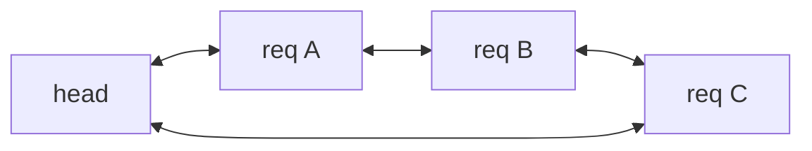
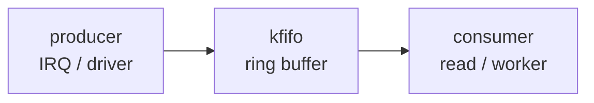
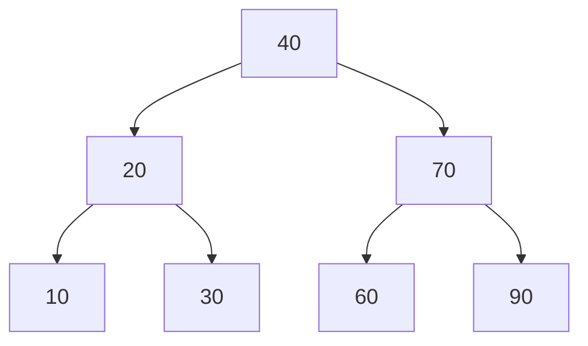
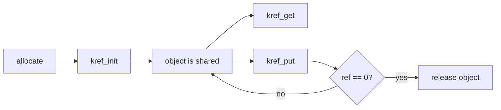
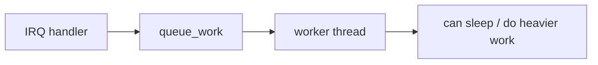
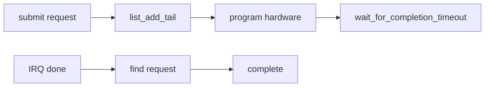
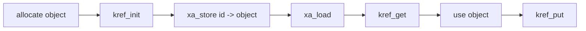
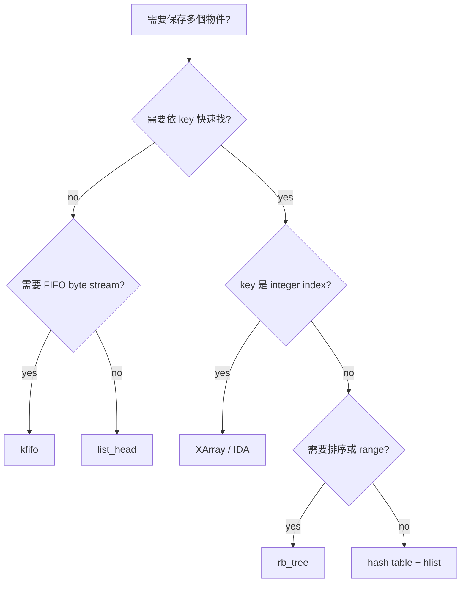

# Linux Kernel Study - Kernel Data Structures

<div style="background:#eef7f2; border-left: 4px solid #62b47a; padding: 10px 14px; border-radius: 6px;">
這份筆記整理 Linux kernel 既有的常用資料結構與輔助 API。重點不是重新發明 queue、stack、tree，而是知道 kernel 已經提供哪些工具、它們常出現在哪些 subsystem、以及 driver 撰寫時該如何選。
</div>

---

## 6.1 為什麼 kernel 有自己的資料結構

Linux kernel 不能直接依賴 user space 常見的 C library container。kernel code 需要處理：

- **沒有標準 C++ STL / user-space runtime**
- **記憶體配置情境特殊**：可能在 interrupt context、atomic context 或持有 spinlock 時操作
- **需要低 overhead**：很多資料結構用 intrusive design，把節點直接嵌進 caller 的 struct
- **需要明確 locking**：資料結構本身通常不自動保護並行存取
- **需要配合 kernel coding style**：macro、iterator、container_of() 是常態

因此 kernel 常見 pattern 是：

```text
你的 struct
   +-- 業務資料欄位
   +-- kernel data structure node
          list_head / hlist_node / rb_node / xarray entry ...
```

核心觀念：

<div style="background:#fff8e8; border-left: 4px solid #d8a23a; padding: 10px 14px; border-radius: 6px;">
Linux kernel 的 container 多半是 <b>intrusive data structure</b>。資料結構不另外配置包裝節點，而是把節點欄位嵌在物件本身，再用 <code>container_of()</code> 從節點找回外層物件。
</div>

---

## 6.2 快速選型表

| 需求 | 常用 kernel 結構 / API | 適合情境 |
|---|---|---|
| 雙向 linked list | `struct list_head` | 一般 queue、物件串列、LRU list |
| 單向 hash linked list | `struct hlist_head`, `struct hlist_node` | hash bucket、節省 head 空間 |
| FIFO byte stream | `struct kfifo` | driver RX/TX buffer、簡單 producer/consumer |
| Stack / LIFO | `llist`, 自行以 `list_head` 操作 head | lockless pending list、簡單 LIFO |
| 紅黑樹 | `struct rb_root`, `struct rb_node` | 需要排序與範圍查找 |
| ID 到 pointer mapping | `XArray` | file descriptor-like index、page cache、device id mapping |
| radix tree 舊 API | `radix_tree_root` | 舊 kernel code，很多地方已轉向 XArray |
| ID allocator | `IDA`, `IDR` | 分配 small integer id |
| reference count | `kref`, `refcount_t`, `atomic_t` | 物件生命週期管理 |
| 等待條件成立 | `wait_queue_head_t` | blocking read/write、等待 event |
| 非同步工作 | `work_struct`, `delayed_work` | interrupt bottom half、延後到 process context |
| completion event | `struct completion` | 等待一次性任務完成 |
| RCU protected pointer/list | `rcu_head`, RCU list helpers | read-mostly 資料、低成本讀路徑 |

---

## 6.3 `struct list_head`：kernel 最常見的 list / queue

`list_head` 是 Linux kernel 最常見的通用 linked list。它是 circular doubly linked list，常用於 queue、物件管理、LRU、driver resource list。

```c
struct my_device_request {
    u32 tag;
    void *buffer;
    size_t len;
    struct list_head node;
};
```

初始化常見有兩種：

```c
static LIST_HEAD(request_list);

struct my_context {
    struct list_head pending;
};

INIT_LIST_HEAD(&ctx->pending);
```

常用操作：

| API | 意義 |
|---|---|
| `list_add()` | 加到 head 後面，常可形成 stack-like LIFO |
| `list_add_tail()` | 加到 tail 前面，常用於 queue-like FIFO |
| `list_del()` | 從 list 移除 |
| `list_del_init()` | 移除後重新初始化節點 |
| `list_empty()` | 檢查 list 是否為空 |
| `list_first_entry()` | 取得第一個外層物件 |
| `list_for_each_entry()` | 走訪 list |
| `list_for_each_entry_safe()` | 走訪時允許刪除目前節點 |

### 6.3.1 list 作為 queue



FIFO queue pattern：

```c
spin_lock(&ctx->lock);
list_add_tail(&req->node, &ctx->pending);
spin_unlock(&ctx->lock);

spin_lock(&ctx->lock);
if (!list_empty(&ctx->pending)) {
    req = list_first_entry(&ctx->pending, struct my_device_request, node);
    list_del_init(&req->node);
}
spin_unlock(&ctx->lock);
```

重點：

- `list_head` 本身不含 lock，caller 要自己用 `spinlock_t`、`mutex` 或其他機制保護。
- 如果 list 會在 interrupt handler 和 process context 同時操作，通常要考慮 `spin_lock_irqsave()`。
- 節點不能同時掛在兩個 list，除非物件內有兩個不同的 `struct list_head` 欄位。

---

## 6.4 `hlist`：hash table bucket 常用的輕量 linked list

`hlist` 是 singly linked list 變形，head 只需要一個 pointer，常用於 hash table bucket。

```c
struct my_entry {
    u32 key;
    struct hlist_node node;
};

struct hlist_head table[256];
```

為什麼不用一般 `list_head`？

- hash table 可能有很多 bucket。
- 每個 `list_head` head 需要兩個 pointer。
- `hlist_head` 只需要一個 first pointer，bucket 數量大時更省空間。

常用 API：

| API | 意義 |
|---|---|
| `INIT_HLIST_HEAD()` | 初始化 bucket head |
| `INIT_HLIST_NODE()` | 初始化 node |
| `hlist_add_head()` | 加到 bucket head |
| `hlist_del()` | 刪除 node |
| `hlist_for_each_entry()` | 走訪 bucket |

---

## 6.5 `kfifo`：kernel 內建 FIFO ring buffer

`kfifo` 適合處理 byte stream 或固定大小元素的 FIFO。driver 若只是需要簡單的 ring buffer，不一定要自己維護 read/write index。

典型用途：

- UART-like driver 收到資料後暫存
- interrupt handler 先把 event 放入 FIFO
- user space 透過 `read()` 取出資料
- TX path 暫存待送資料

```c
#include <linux/kfifo.h>

struct my_port {
    struct kfifo rx_fifo;
    spinlock_t lock;
};
```

常用 API：

| API | 意義 |
|---|---|
| `kfifo_alloc()` | 動態配置 FIFO buffer |
| `kfifo_free()` | 釋放 FIFO |
| `kfifo_in()` | 放入資料 |
| `kfifo_out()` | 取出資料 |
| `kfifo_len()` | 目前資料量 |
| `kfifo_is_empty()` | 是否為空 |
| `kfifo_is_full()` | 是否已滿 |

概念圖：



注意：

- `kfifo` 不代表自動 thread-safe。
- single producer / single consumer 的情境可以比較簡單。
- 多 producer 或多 consumer 通常仍要外部 lock。

---

## 6.6 stack / LIFO：kernel 沒有單一通用 stack container

kernel 常見 stack-like 需求通常用以下方式處理：

| 作法 | 適合情境 |
|---|---|
| `list_add()` + 從 head 取出 | 一般 LIFO object stack |
| `llist` | lockless single linked list，常見於 pending work |
| per-cpu list | 每 CPU 暫存，降低 lock contention |
| call stack | 函式呼叫本身的 stack，不適合放大型資料 |

用 `list_head` 做 LIFO：

```c
list_add(&item->node, &stack);

if (!list_empty(&stack)) {
    item = list_first_entry(&stack, struct my_item, node);
    list_del_init(&item->node);
}
```

`llist` 則常出現在 lockless pending list：

```c
struct llist_head pending;
struct llist_node node;
```

重點：

- 一般 driver 先用 `list_head` 比較直覺。
- 只有在確定需要 lockless producer path 時，再研究 `llist`。
- 不要在 kernel stack 上放太大的 array，kernel stack 空間有限。

---

## 6.7 `rb_tree`：需要排序時使用

Linux kernel 的紅黑樹用於需要排序、查找、範圍搜尋的情境。它也是 intrusive design，使用 `struct rb_node` 嵌在 caller object 裡。

```c
struct my_region {
    unsigned long start;
    unsigned long end;
    struct rb_node node;
};

struct rb_root regions = RB_ROOT;
```

常見用途：

- memory region 管理
- timer / scheduler 類型的排序資料
- address range lookup
- 需要依 key 快速搜尋的物件集合

概念：



和 `list_head` 的差異：

| 結構 | 查找 | 插入 | 順序 |
|---|---:|---:|---|
| `list_head` | O(n) | O(1) | 依插入順序 |
| `rb_tree` | O(log n) | O(log n) | 依 key 排序 |

如果資料量小、只需要走訪，list 比較簡單。如果需要大量 lookup 或排序，才考慮 rb tree。

---

## 6.8 XArray / IDA / IDR：用 integer index 找物件

### 6.8.1 XArray

XArray 是 kernel 現代化的 indexed data structure，用 integer index 對應 pointer。它常用在需要 dense 或 sparse index mapping 的地方。

```c
#include <linux/xarray.h>

DEFINE_XARRAY(my_objects);
```

常用概念：

| API | 意義 |
|---|---|
| `xa_store()` | 在 index 存 pointer |
| `xa_load()` | 由 index 取 pointer |
| `xa_erase()` | 移除 index |
| `xa_for_each()` | 走訪 |
| `xa_lock()` / `xa_unlock()` | 使用 XArray 內建 lock |

適合情境：

- id 到 object 的 mapping
- sparse index 空間
- page cache 類似的 index lookup

### 6.8.2 IDA / IDR

`IDA` 和 `IDR` 常用於配置小整數 id。

| 結構 | 用途 |
|---|---|
| `IDA` | 只配置 id，不直接存 pointer |
| `IDR` | id 對應 pointer，較舊 code 常見 |
| `XArray` | 現代化 indexed pointer mapping |

driver 裡常見例子：

- `/dev/mydev0`, `/dev/mydev1` 的 minor number
- controller id
- request tag
- channel id

---

## 6.9 reference count：`kref` 與 `refcount_t`

資料結構只解決「怎麼找到物件」，還要處理「物件何時可以釋放」。kernel 常見做法是 reference count。

```c
struct my_object {
    struct kref ref;
    struct list_head node;
};
```

常用 API：

| API | 意義 |
|---|---|
| `kref_init()` | 初始化 reference count 為 1 |
| `kref_get()` | 增加引用 |
| `kref_put()` | 減少引用，歸零時呼叫 release callback |
| `refcount_t` | 較底層的安全 refcount 型別 |

典型生命週期：



注意：

- 從 list 或 tree 拿到物件，不代表 lifetime 一定安全。
- 如果 lock 放掉後仍要使用物件，通常需要拿 reference。
- release callback 裡負責真正 `kfree()` 或釋放子資源。

---

## 6.10 wait queue、completion、workqueue

這些不是傳統意義上的 container，但在 kernel driver 裡非常常見，常和 queue / FIFO 搭配。

### 6.10.1 wait queue

`wait_queue_head_t` 用於「睡眠直到條件成立」。

典型 read path：

```text
read()
   -> 如果 FIFO 沒資料
      -> wait_event_interruptible()
   -> 有資料後從 FIFO 取出
```

常用 API：

| API | 意義 |
|---|---|
| `init_waitqueue_head()` | 初始化 |
| `wait_event()` | 等待條件成立 |
| `wait_event_interruptible()` | 可被 signal 中斷 |
| `wake_up()` | 喚醒等待者 |
| `wake_up_interruptible()` | 喚醒 interruptible waiter |

### 6.10.2 completion

`completion` 適合一次性事件，例如送出 command 後等待硬體回覆。

```c
struct completion done;

init_completion(&done);
wait_for_completion_timeout(&done, timeout);
complete(&done);
```

### 6.10.3 workqueue

`work_struct` 把工作延後到 process context 執行，常見於 interrupt handler 不能做太多事情時。



---

## 6.11 RCU：read-mostly 資料的特殊同步模型

RCU 是 Linux kernel 很重要的同步機制，常用於讀取非常頻繁、更新相對少的資料。

RCU 的核心想法：

- reader 進入 `rcu_read_lock()` 後可以很低成本讀取資料。
- writer 更新 pointer 時，不會立刻釋放舊物件。
- 舊物件要等所有既有 reader 離開後才能釋放。

常見 API：

| API | 意義 |
|---|---|
| `rcu_read_lock()` | 進入 RCU read-side critical section |
| `rcu_read_unlock()` | 離開 RCU read-side critical section |
| `rcu_dereference()` | reader 取得 RCU protected pointer |
| `rcu_assign_pointer()` | writer 發布新 pointer |
| `call_rcu()` | grace period 後釋放 |
| `synchronize_rcu()` | 等待 grace period 完成 |

RCU list 也有專用 helper：

- `list_add_rcu()`
- `list_del_rcu()`
- `list_for_each_entry_rcu()`
- `hlist_for_each_entry_rcu()`

RCU 很強，但也比較容易寫錯。一般 driver 初學階段先掌握 lock + list / kfifo 即可，看到 networking、VFS、scheduler code 再逐步理解 RCU。

---

## 6.12 driver 常見組合範例

### 6.12.1 RX FIFO + wait queue


常見於 character device：

- interrupt 收到資料
- driver 把資料放到 `kfifo`
- 喚醒 blocking `read()`
- user space 讀走資料

### 6.12.2 pending request list + completion



常見於 command/response 型硬體：

- request 掛進 pending list
- 對硬體送 command
- caller 等 completion
- IRQ 收到 done 後找回 request 並 `complete()`

### 6.12.3 object table + refcount



適合用於：

- 多個 file descriptor 共用 kernel object
- request id 查找 request object
- device minor number 查找 device instance

---

## 6.13 寫 driver 時的選擇流程



實務建議：

1. 少量物件、只要走訪：先用 `list_head`。
2. byte stream FIFO：先看 `kfifo`。
3. id 找 object：優先考慮 `XArray` 或 `IDA`。
4. key lookup 很多：考慮 hash table + `hlist`。
5. 需要排序或 range lookup：考慮 `rb_tree`。
6. lifetime 複雜：加上 `kref` 或 `refcount_t`。
7. 會睡眠等待 event：搭配 `wait_queue` 或 `completion`。

---

## 6.14 常見陷阱

| 陷阱 | 說明 |
|---|---|
| 忘記初始化 list head | `INIT_LIST_HEAD()` 沒做會造成難查的 crash |
| 同一個 node 掛到兩個 list | 一個 `list_head` 欄位只能屬於一條 list |
| 走訪時刪除卻不用 safe iterator | 刪除目前節點時要用 `list_for_each_entry_safe()` |
| 把 locking 期待交給 container | 多數 container 不自動處理同步 |
| lock 放掉後繼續用物件 | 可能 use-after-free，需要 reference count |
| 在 atomic context 使用會睡眠的 API | interrupt / spinlock 內不能呼叫可能 sleep 的操作 |
| kernel stack 放大型 buffer | kernel stack 很小，大 buffer 應改用 heap 或 DMA-safe memory |
| RCU pointer 用普通讀寫 | RCU protected pointer 要用 RCU helper |

---

## 6.15 一句話總結

Linux kernel 已經提供很多成熟的資料結構。寫 driver 時應先從 kernel 既有工具選擇：

```text
list_head  管物件串列
kfifo      管 FIFO 資料流
hlist      管 hash bucket
rb_tree    管排序查找
XArray     管 index -> object
kref       管物件生命週期
waitqueue  管等待條件
workqueue  管延後工作
RCU        管 read-mostly 並行讀取
```

真正重要的是把「資料如何被找到」、「誰保護並行存取」、「物件何時釋放」三件事一起想清楚。
