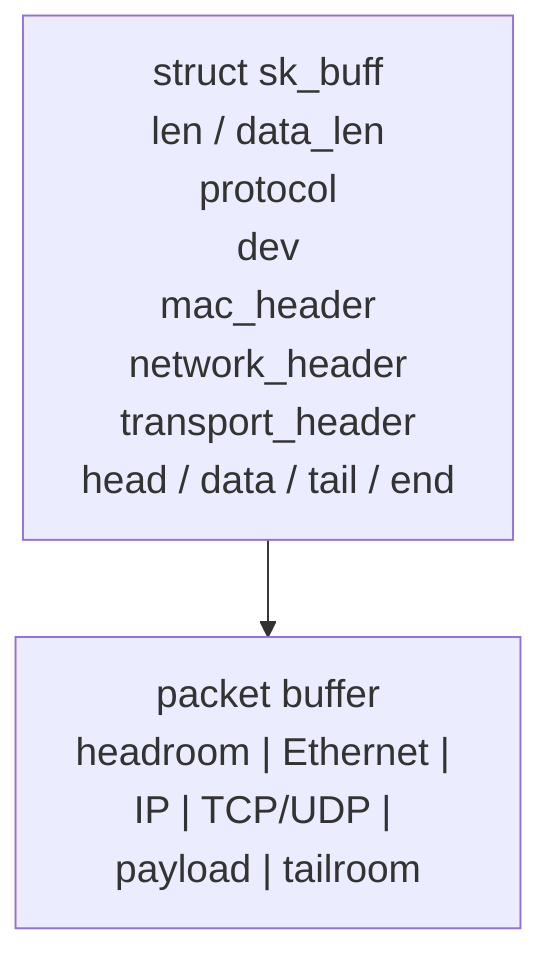
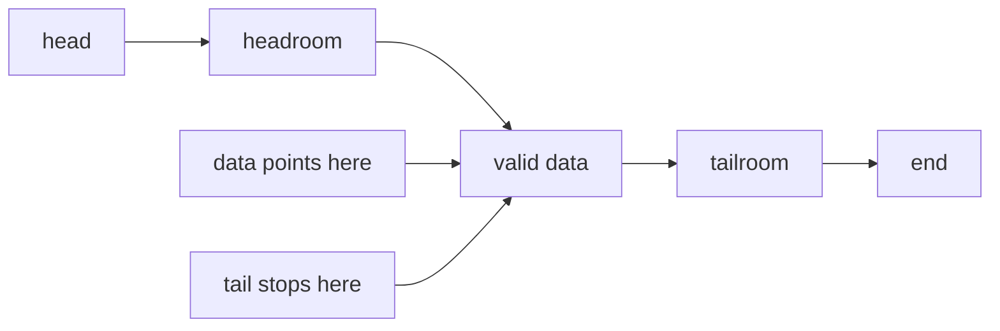
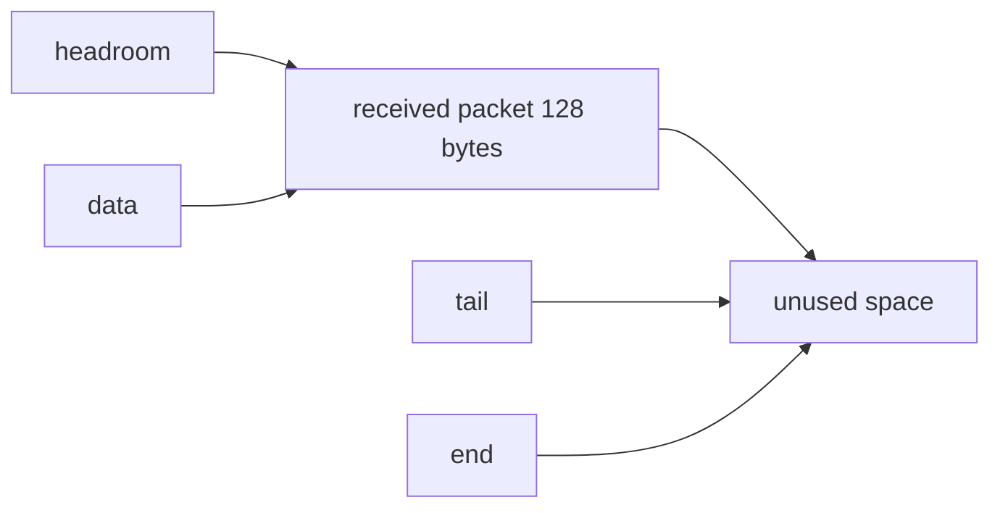
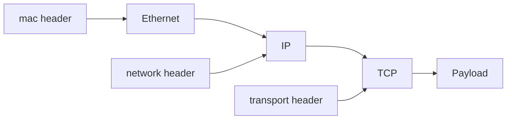
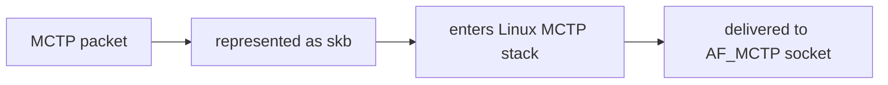
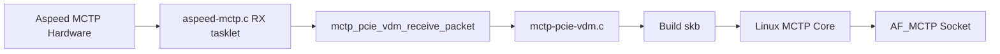
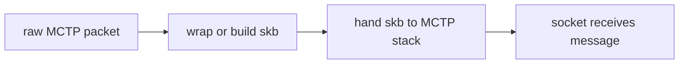
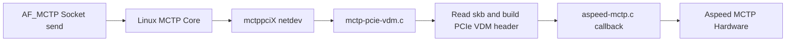

# Linux Kernel Study - Socket Buffer

<div style="background:#eaf4ff; border-left: 4px solid #5aa9e6; padding: 10px 14px; border-radius: 6px;">
這份筆記整理 Linux kernel networking 裡的 <b>Socket Buffer</b>，也就是常看到的 <code>sk_buff</code> 與 <code>skb</code>。它不是單純的一塊封包資料，而是 kernel 用來描述、搬運、修改與轉送封包的核心容器。
</div>

---

## 5.1 Socket Buffer 是什麼？

在 Linux kernel 網路子系統裡，封包從 NIC 收進來、經過 protocol stack 往上走，或從 socket 往下送到 driver，幾乎都會圍繞著 `struct sk_buff` 在移動。

可以先把它想成：

- **packet data 的載體**
- **packet metadata 的容器**
- **network stack 各層共同操作的物件**

`skb` 不只放資料本體，還會記錄很多上下文，例如：

- 這是哪個 protocol 的封包
- L2 / L3 / L4 header 在哪裡
- 目前有效資料的範圍在哪裡
- 這個封包要送去哪個 net device
- checksum、GSO、VLAN、timestamp 等狀態

<div style="background:#e8f7e8; border-left: 4px solid #6bbf73; padding: 10px 14px; border-radius: 6px;">
<code>sk_buff</code> 是 Linux kernel networking stack 用來表示「一個封包及其相關狀態」的核心資料結構。
</div>

---

## 5.3 `sk_buff` 在整體路徑上的角色

### 5.3.1 RX 路徑


driver 收到封包後，通常會：

- 準備或回收 RX buffer
- 把收到的資料掛到 `skb`
  常見會看到：`netdev_alloc_skb()`、`build_skb()`、`napi_alloc_skb()`、`skb_put()`、`skb_put_data()`
- 設定長度、protocol、checksum 狀態
  常見會看到：`skb_put()` 或 `skb_put_data()` 增加有效長度，`skb->protocol = ...`，以及 `skb->ip_summed = ...`
- 把 `skb` 往 networking stack 交上去
  常見會看到：`netif_rx()`、`netif_receive_skb()`、`napi_gro_receive()`

RX 常見其實有兩種做法：

1. **copy**
   原始資料先放在 driver 自己的 RX buffer，再複製到新的 `skb`
2. **不 copy / attach / reuse**
   讓整個 `skb` 去描述並使用那塊既有 buffer，例如 `build_skb()` 這類思路

所以不是所有 RX 都一定會 copy。像前面提到的 `mctp_pcie_vdm_receive_packet()` 就是 copy 型；高效能網卡 driver 則常會盡量減少 copy。

### 5.3.2 TX 路徑


在這條路上，kernel 會建立或修改 `skb`，逐層把 header 填進去，最後交給 driver 送出。

driver 在 TX 路徑上常見工作包括：

- 從上層收到 `skb`
- 讀取 `skb` 裡的資料長度與 header 資訊
- 視需要往前補 transport 或 link header
  常見會看到：`skb_push()`
- 處理 checksum offload、TSO、GSO 等需求
- 把資料 map 成 DMA 可用格式
- 通知 NIC 開始送出
- 送完後回收對應資源

<div style="background:#e8f7e8; border-left: 4px solid #6bbf73; padding: 10px 14px; border-radius: 6px;">
TX 和 RX 雖然都會用到 <code>struct sk_buff</code>，但兩邊的工作方向不同：RX 著重把收到的資料整理成 <code>skb</code> 交給上層；TX 著重把上層的 <code>skb</code> 加工後交給硬體，因此常操作的欄位與 helper function 也不完全一樣。
</div>

---

## 5.4 先用直覺理解 `skb` 長什麼樣

雖然 `struct sk_buff` 本身欄位很多，但初學時先抓住兩件事就很夠：

1. **`skb` 本體是描述物件**
2. **`skb` 本體主要是描述資訊，封包內容則由其中的指標去定位 data buffer**



<table>
  <thead>
    <tr>
      <th>欄位</th>
      <th>直覺意思</th>
      <th>初學時怎麼記</th>
    </tr>
  </thead>
  <tbody>
    <tr>
      <td><code>head</code></td>
      <td>整塊 data buffer 的起點</td>
      <td>這塊 packet buffer 從哪裡開始</td>
    </tr>
    <tr>
      <td><code>data</code></td>
      <td>目前有效資料的起點</td>
      <td>真正要解析的封包從哪裡開始；前面若有空間就是 headroom</td>
    </tr>
    <tr>
      <td><code>tail</code></td>
      <td>目前有效資料的結尾後一格</td>
      <td><code>data</code> 到 <code>tail</code> 之間就是有效資料</td>
    </tr>
    <tr>
      <td><code>end</code></td>
      <td>整塊 data buffer 的結尾</td>
      <td>這塊 buffer 到哪裡為止</td>
    </tr>
    <tr>
      <td><code>len</code></td>
      <td>目前這個 <code>skb</code> 代表的資料總長度</td>
      <td>這包封包目前有多長</td>
    </tr>
  </tbody>
</table>

---

## 5.5 什麼是 headroom 和 tailroom？

這是 `skb` 很重要的一塊。



### 5.5.1 headroom

`data` 前面預留但目前還沒用到的空間。

它很有用，因為封包在往下走時，常常需要在前面再補 header，例如：

- TCP payload 往下補 IP header
- IP packet 往下補 Ethernet header
- tunnel 或 encapsulation 再往前多推一層 header

這時如果前面有 headroom，就能直接把 `data` 往前移並填內容，不用每次都重配整塊記憶體。

RX 時也常會刻意設定 headroom。driver 收到封包後，可能不是讓 `data`
直接指向 buffer 最前面，而是先預留一小段空間，讓後續 stack 若需要補齊
alignment、補 metadata，或重新塞回某層 header 時比較方便。

常見概念像這樣：

```c
skb = netdev_alloc_skb(dev, rx_len + NET_IP_ALIGN);
skb_reserve(skb, NET_IP_ALIGN);
memcpy(skb_put(skb, rx_len), rx_buf, rx_len);
```

這裡 `skb_reserve()` 會把 `data` 和 `tail` 一起往後移，前面空出來的地方就是
headroom。接著 `skb_put()` 再把 `tail` 往後推，表示真正收到的封包資料長度。

如果是比較高效能的 RX path，driver 也可能用 `build_skb()`、page pool 或 DMA
buffer 直接包成 `skb`。概念仍然類似：`head` 指向整塊可用 buffer 的起點，
`data` 會被調到有效封包資料開始的位置，`data` 前面留下的空間就是 headroom。

### 5.5.2 tailroom

`tail` 後面剩餘但尚未使用的空間。

它常用來：

- 在尾端追加 payload
- 加入某些 trailer
- 組封包時逐步往後長資料

RX 時，tailroom 通常來自「配置的 buffer 比實際收到的封包長」。例如 driver
可能配置一塊 2048 bytes 的 RX buffer，但這次硬體只收到 128 bytes：



driver 會用實際收到的長度把 `tail` 設到有效資料結尾，例如透過 `skb_put(skb, len)`。
`tail` 到 `end` 之間尚未使用的空間，就是 tailroom。

所以 RX 時可以這樣記：

- `headroom`：有效封包前面保留的空間，常為了 alignment 或之後可能補 header
- `tailroom`：有效封包後面還沒用到的空間，常是因為 RX buffer 配得比實際封包大
- `len`：這次 `skb` 目前代表的有效資料長度，不等於整塊 RX buffer 大小

---

## 5.6 常見操作在做什麼？

先抓住一個重點：這些 helper 大多不是在「解析封包」，而是在移動
`data` 或 `tail`，讓 `skb` 知道目前哪一段才算有效資料。

可以先用這張速記表：

<table>
  <thead>
    <tr>
      <th>helper</th>
      <th>移動誰</th>
      <th>效果</th>
      <th>常見用途</th>
      <th>補充</th>
    </tr>
  </thead>
  <tbody>
    <tr>
      <td><code>skb_put()</code></td>
      <td><code>tail</code> 往後</td>
      <td>有效資料變長</td>
      <td>RX 放入收到的資料、尾端追加資料</td>
      <td>常見寫法是 <code>memcpy(skb_put(skb, len), rx_buf, len)</code>；<code>skb_put()</code> 回傳新增空間的起點</td>
    </tr>
    <tr>
      <td><code>skb_push()</code></td>
      <td><code>data</code> 往前</td>
      <td>前面多一段有效資料</td>
      <td>往前補 header</td>
      <td>常見於 TX，例如 payload 前面補 IP header 或 Ethernet header</td>
    </tr>
    <tr>
      <td><code>skb_pull()</code></td>
      <td><code>data</code> 往後</td>
      <td>前面一段不再算有效資料</td>
      <td>吃掉或跳過 header</td>
      <td>常見於 RX 解析，例如看完 Ethernet header 後，讓 <code>data</code> 指到下一層 header 或 payload</td>
    </tr>
    <tr>
      <td><code>skb_reserve()</code></td>
      <td><code>data</code> 和 <code>tail</code> 一起往後</td>
      <td>先空出 headroom</td>
      <td>剛配置 skb 後先預留前方空間</td>
      <td>不會增加有效資料長度；通常接著再用 <code>skb_put()</code> 放入真正資料</td>
    </tr>
  </tbody>
</table>

---

## 5.7 header pointer 為什麼重要？

network stack 不只要知道「資料在哪」，還要知道各層 header 在哪。

常見概念有：

- `mac_header`
- `network_header`
- `transport_header`

對應大致是：

- MAC header: Ethernet header
- Network header: IPv4 / IPv6 header
- Transport header: TCP / UDP header



這讓 kernel 可以很快找到對應的 header 去做：

- protocol parsing
- routing decision
- checksum handling
- port 或 address extraction
- packet rewrite

---

## 5.8 `skb` 不一定只是一整塊連續 payload

初學時很容易以為一個 `skb` 就是一塊完整連續的封包資料，但實際上 Linux 為了效率，常常不會這麼單純。

### 5.8.1 linear data

最前面的主要資料區可以是 linear 的，也就是可以直接連續存取。

### 5.8.2 fragmented data

有些資料可能放在 page fragments 或其他分散位置，由 `skb` 去描述它們。

這樣做的目的是：

- 減少 copy
- 配合 DMA 或 page-based buffer
- 提高大封包處理效率

---

## 5.9 MCTP 其實也使用 `skb`

很多人一開始會以為 `skb` 主要是給 Ethernet、IP、TCP、UDP 用的，但其實不是。只要是走 Linux kernel networking stack 的封包型協定，通常就會沿用 `sk_buff` 這套模型，**MCTP 也是其中之一**。


### 5.9.2 為什麼 socket-MCTP 也會用 `skb`？

原因其實和 TCP/IP 很像：

- kernel 需要有統一的封包容器
- 需要描述 packet data 與 packet metadata
- 需要能在 netdev、protocol stack、socket 之間傳遞

所以 MCTP 只要進入 Linux networking stack，就不會自己再發明一套完全不同的 packet object，而是沿用 `skb`。



### 5.9.3 MCTP RX 時 `skb` 怎麼用？



從 `skb` 角度看，重點是：

- 硬體先收到 PCIe VDM 上的 MCTP packet
- driver 先把 raw packet 取出來
- generic `mctp-pcie-vdm` transport 會把這包資料轉成 `skb`
- `skb` 內會帶著這包 MCTP message 的資料與 metadata
- 然後把 `skb` 往 Linux MCTP networking stack 交上去



實際上，`mctp_pcie_vdm_receive_packet()` 這段 code 就是在做這件事：

```c
int mctp_pcie_vdm_receive_packet(struct net_device *ndev)
{
	struct mctp_pcie_vdm_dev *mdev;
	struct mctp_pcie_vdm_hdr *hdr;
	struct mctp_skb_cb *cb;
	struct sk_buff *skb;
	unsigned int payload_len;
	size_t len = 0;
	void *data = NULL;
	int rc;

	if (!ndev)
		return -EINVAL;

	mdev = netdev_priv(ndev);
	rc = mdev->ops->recv_packet(mdev->dev, &data, &len);
	if (rc)
		return rc;

	rc = mctp_pcie_vdm_validate_packet(ndev, data, len, &payload_len);
	if (rc)
		goto drop;

	hdr = data;

	skb = netdev_alloc_skb(ndev, payload_len);
	if (!skb) {
		rc = -ENOMEM;
		goto drop;
	}

	skb_put_data(skb, (u8 *)data + sizeof(*hdr), payload_len);
	skb->protocol = htons(ETH_P_MCTP);
	skb_reset_network_header(skb);

	cb = __mctp_cb(skb);
	cb->halen = 0;

	dev_dstats_rx_add(ndev, payload_len);
	netif_rx(skb);

	mdev->ops->free_packet(mdev->dev, data);

	return 0;

drop:
	dev_dstats_rx_dropped(ndev);
	if (data)
		mdev->ops->free_packet(mdev->dev, data);

	return rc;
}
```

可以把這段實作拆成下面幾步看：

1. `recv_packet()` 先從下層硬體 driver 拿到一包 raw data
2. `mctp_pcie_vdm_validate_packet()` 檢查這包是不是合法的 PCIe VDM MCTP packet，並算出真正的 `payload_len`
3. `hdr = data` 表示這包 raw data 開頭是 PCIe VDM header
4. `netdev_alloc_skb(ndev, payload_len)` 配一個新的 `skb`
5. `skb_put_data(skb, (u8 *)data + sizeof(*hdr), payload_len)` 跳過 PCIe VDM header，只把後面的 MCTP payload 複製進 `skb`
6. `skb->protocol = htons(ETH_P_MCTP)` 告訴上層這是一包 MCTP 封包
7. `skb_reset_network_header(skb)` 把目前的 `skb->data` 視為 network header 起點
8. `netif_rx(skb)` 把這包 `skb` 丟進 Linux networking stack

`netif_rx(skb)` 不是直接呼叫某個 MCTP function，而是把 `skb` 交給
Linux 網路收包流程。後面大致會是：

1. `netif_rx(skb)` 把 `skb` 放進 kernel 的 RX backlog queue
2. kernel 觸發 `NET_RX_SOFTIRQ`
3. softirq 之後會跑 network RX 處理流程
4. kernel 根據 `skb->protocol` 決定這包要交給誰
5. 如果 `skb->protocol == htons(ETH_P_MCTP)`，就會交給已註冊處理
   `ETH_P_MCTP` 的 MCTP protocol handler

所以這段 code 可以理解成：driver 先把 PCIe VDM transport header 拆掉，
再把乾淨的 MCTP packet 包成 `skb`，最後透過 `netif_rx(skb)` 交給
Linux networking stack，讓 MCTP 那層繼續處理。

這裡最值得注意的是第 5 步：

- 進來的原始資料是 `PCIe VDM header + MCTP packet`
- 放進 `skb` 的不是整個 PCIe VDM frame
- 而是 **去掉 `sizeof(*hdr)` 之後的 MCTP payload**

也就是說，這段 code 的設計是：

- PCIe VDM header 在 transport 層先驗證、先拆掉
- 真正往上交給 MCTP stack 的，是乾淨的 MCTP packet

還有一個 headroom 很關鍵的點：

- 這裡用的是 `netdev_alloc_skb(ndev, payload_len)`
- 沒有先 `skb_reserve()` 額外預留 PCIe VDM header 空間
- 所以這條 RX path 的 `skb` 幾乎就是「剛好裝 payload」

這也說明了：

- **TX 路徑** 常比較需要 headroom，因為可能還要往前補 PCIe VDM header
- **RX 路徑** 常見做法是先把 transport header 拆掉，再把 payload 包成 `skb` 往上送

### 5.9.4 MCTP TX 時 `skb` 怎麼用？



從 `skb` 角度看，流程大致是：

1. user space 透過 `AF_MCTP` socket 送資料
2. Linux MCTP core 建立或整理對應的 `skb`
3. route 或 neigh 選到 `mctppciX`
4. `mctp-pcie-vdm.c` 從 `skb` 取出 MCTP message
5. transport layer 再補上 PCIe VDM transport header
6. 之後交給 Aspeed 硬體 driver 做實際送出

### 5.9.5 對 MCTP 來說，`skb` 裡裝的是什麼？

如果用概念來看，MCTP 的 `skb` 通常承載的是：

- MCTP message data
- MCTP header 相關內容
- 對應的 netdev 資訊，例如 `mctppciX`
- 封包長度、協定狀態與傳遞上下文

而到了 PCIe VDM transport 那層，還會再根據需要：

- 從 `skb` 取 payload
- 在前面補 PCIe VDM header
- 交給下層 Aspeed MCTP driver

## 5.10 `skb` 的生命週期怎麼看？


更具體一點：

1. 建立 `skb` 或把既有 buffer 包裝成 `skb`
2. 各層更新 header 與 metadata
3. 在 queue、protocol stack、driver 間傳遞
4. 最後送出完成，或被 socket 收下，或被丟棄
5. 資源被釋放或回收

---

## 5.11 初學時最容易搞混的幾件事

### 5.11.1 `socket` 和 `socket buffer` 不是同一件事

- `socket` 是通訊端抽象
- `socket buffer` 是封包資料在 kernel 裡移動時常用的容器

### 5.11.2 `skb` 會在 networking stack 各層流動

`skb` 雖然常出現在 driver 裡，但它不是 driver 專用物件。只要封包進入
Linux networking stack，後面的 netdev、protocol layer、socket layer 都可能會操作它。

這裡的 stack 不是 CPU 的 call stack，也不是一塊記憶體堆疊；它比較像
「kernel 裡一層一層處理網路封包的流程」。

可以把 networking stack 想成封包在 kernel 裡經過的一串處理層。

RX 時，封包大致是從硬體往上走：


TX 時方向相反，資料從 socket 往下走到 driver：


`skb` 就是在這些層之間被傳來傳去的封包容器。每一層可能會看或修改不同資訊：

<table>
  <thead>
    <tr>
      <th>層次</th>
      <th>常看什麼</th>
      <th>可能做什麼</th>
    </tr>
  </thead>
  <tbody>
    <tr>
      <td>driver / netdev</td>
      <td>實際封包資料、長度、device</td>
      <td>收包、送包、設定 <code>skb->dev</code>、交給上層</td>
    </tr>
    <tr>
      <td>protocol layer</td>
      <td>protocol、header 位置、checksum</td>
      <td>解析 header、決定下一層、更新 metadata</td>
    </tr>
    <tr>
      <td>socket layer</td>
      <td>payload、來源與目的資訊</td>
      <td>把資料交給對應 socket，或從 socket 建立要送出的封包</td>
    </tr>
  </tbody>
</table>

所以看到「把 `skb` 交給 networking stack」，意思通常是：driver 不再自己處理這包，
而是把它交給 kernel 的網路流程，讓後面的 protocol layer 和 socket layer 繼續處理。

### 5.11.3 `skb` 不是只有 data pointer

真正有價值的是：

- data buffer
- header 位置資訊
- protocol metadata
- device、routing、offload 狀態
