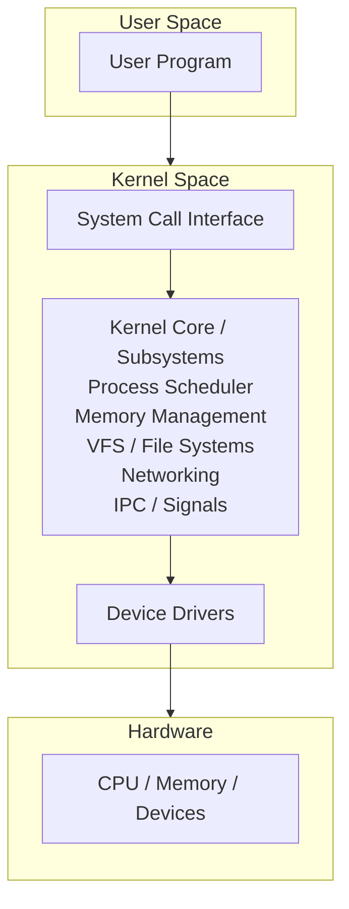
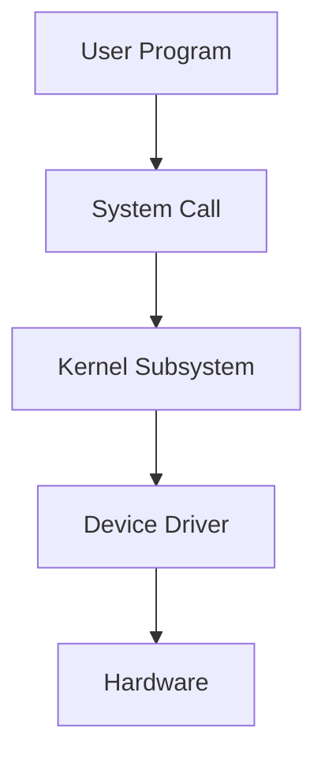
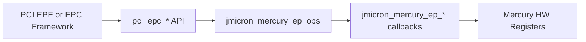
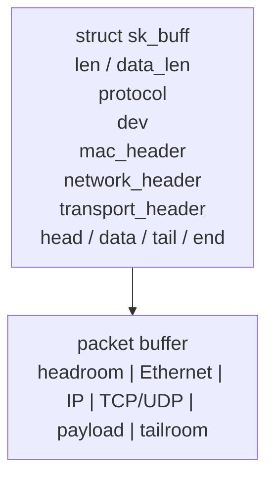
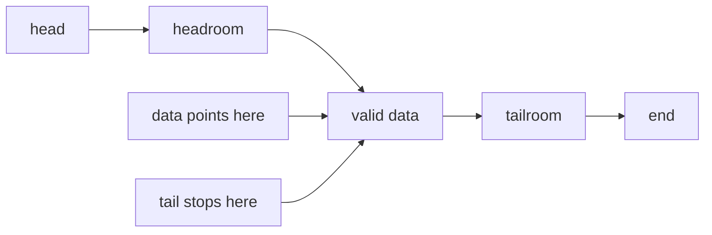
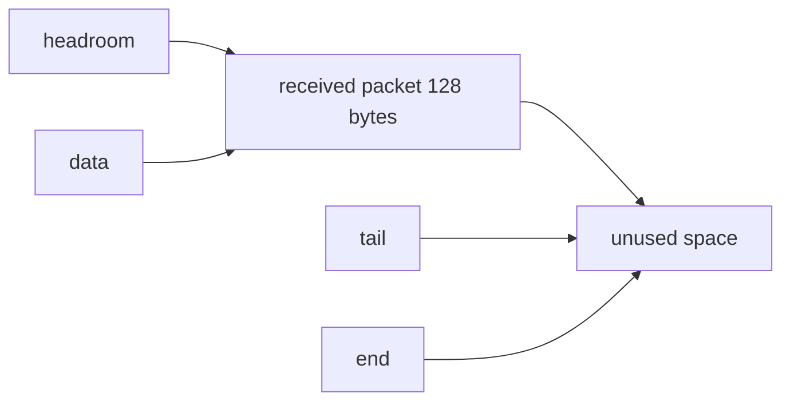
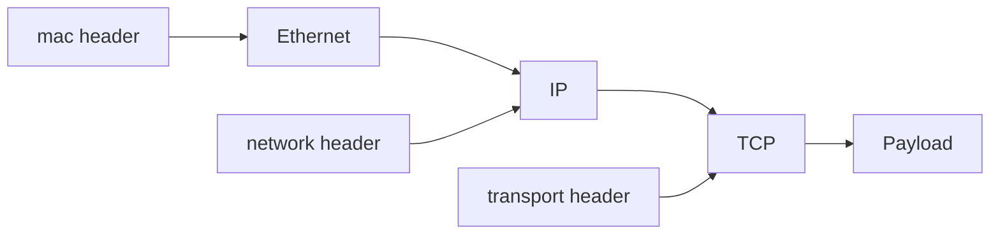
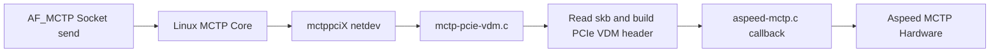
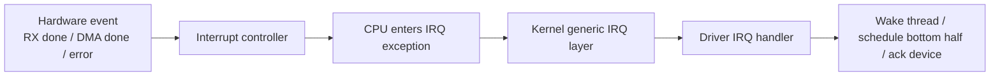

# Linux Kernel Study

<div style="background:#eaf4ff; border-left: 4px solid #5aa9e6; padding: 10px 14px; border-radius: 6px;">
本文整理 Linux kernel 的核心架構與主要子系統，從分層模型切入，逐步說明記憶體管理、行程排程、裝置驅動、檔案系統、網路子系統與中斷處理。
</div>

## 章節目錄

- [第一章：Linux kernel 的概念分層](#chapter-1)
- [第二章：Device Driver Layer 的職責](#chapter-2)
- [第三章：Driver 常用工具與 DMA 基礎](#chapter-3)
- [第四章：Linux networking stack 裡的 Socket Buffer（sk_buff）](#chapter-4)
- [第五章：Linux kernel 的 interrupt / IRQ](#chapter-5)

---

<a id="chapter-1"></a>

## 第一章：Linux kernel 的概念分層

Linux kernel 並非嚴格的分層架構；實務上，各子系統之間存在大量交互作用。為了建立整體理解，可將其概念性地分為下列層次：

1. **System Call Interface（系統呼叫介面層）**
2. **Kernel Core / Subsystems（核心功能層）**
3. **Device Driver Layer（裝置驅動層）**
4. **Hardware Layer（硬體層）**

以下為簡化架構圖：



---

### 1.1 System Call Interface

此層是 **user space** 進入 **kernel space** 的正式介面。

當應用程式需要執行下列操作時：

- 開啟檔案
- 建立行程
- 傳送網路封包
- 配置記憶體
- 操作裝置

應用程式不能直接操作硬體，必須透過 system call 進入 kernel，例如：

- `open()`
- `read()`
- `write()`
- `fork()`
- `execve()`
- `mmap()`

此層的主要職責包括：

- 提供穩定的使用者介面
- 檢查參數是否合法
- 將請求導向對應的核心子系統

---

### 1.2 Kernel Core / Subsystems

此層構成 Linux kernel 的主要邏輯，包含多個核心子系統：

#### Process Scheduler（行程排程）

負責決定：

- 選擇下一個執行的 process 或 thread
- 分配 CPU 時間
- 何時進行 context switch

Linux 是多工系統，排程器就是讓多個工作能共享 CPU 的核心機制。

#### Memory Management（記憶體管理）

負責：

- 實體記憶體與虛擬記憶體管理
- 分頁（paging）
- 配置與回收記憶體
- slab/slub allocator
- page cache

此子系統為每個 process 提供獨立的虛擬位址空間，並透過核心機制有效管理與共享實體 RAM。

#### VFS and File Systems（虛擬檔案系統與檔案系統）

Linux 支援多種檔案系統，例如：

- `ext4`
- `xfs`
- `btrfs`
- `procfs`
- `sysfs`

VFS（Virtual File System）提供統一抽象，讓上層不需要在每次存取檔案時都知道底層是哪種檔案系統。

#### Networking（網路子系統）

負責：

- socket
- TCP/IP protocol stack
- routing
- packet forwarding
- network device interaction

`send()`、`recv()` 等 socket API 最終會進入此子系統處理。

#### IPC / Signals / Synchronization

負責不同 process 或 thread 之間的協作，例如：

- pipe
- shared memory
- semaphore
- signal
- futex

這些機制是作業系統支援並行與協調的重要基礎。

---

### 1.3 Device Driver Layer

此層負責將核心抽象操作轉換為特定硬體可執行的控制流程。

例如：

- 網卡 driver
- UART driver
- I2C / SPI driver
- PCIe driver
- USB driver
- GPIO driver

driver 的角色可分為兩個方向：

- 往上，提供 kernel 可呼叫的標準介面
- 往下，操作暫存器、中斷、DMA、匯流排協定

因此，驅動程式通常會和下面幾件事強相關：

- register read/write
- interrupt handling
- DMA buffer management
- power management
- device probing and initialization

---

### 1.4 Hardware Layer

最底層為實際硬體資源，包括：

- CPU
- DRAM
- ROM / Flash
- 網卡
- 儲存裝置
- UART
- I2C / SPI 控制器
- PCIe / USB 裝置

kernel 的操作最終必須透過 driver 控制實際硬體資源。

---

<a id="chapter-1-5"></a>

## 1.5 核心分層速覽

可將上述層次整理如下：

- **System call**：使用者進入核心的入口
- **Core subsystems**：核心主要邏輯所在
- **Drivers**：把核心要求轉成硬體操作
- **Hardware**：真正被控制的裝置

一句話總結：

<div style="background:#e8f7e8; border-left: 4px solid #6bbf73; padding: 10px 14px; border-radius: 6px;">
Linux kernel 可概念性地表示為「系統呼叫介面層 -> 核心子系統層 -> 驅動程式層 -> 硬體層」。
</div>

---

<a id="chapter-2"></a>

## 第二章：Device Driver Layer 的職責

`Device Driver Layer` 負責銜接核心抽象與實際硬體，是 Linux kernel 與裝置控制邏輯之間的關鍵邊界。

前一章提到：

- `System Call Interface` 是 user space 進入 kernel 的入口
- `Kernel Core / Subsystems` 負責排程、記憶體、檔案系統、網路等主要邏輯
- `Device Driver Layer` 將核心子系統的操作落實到特定裝置

從「如何將硬體整合進 Linux 架構」的角度，可依下列主線理解：

### 2.1 硬體整合至 Linux 的主線

#### 2.1.1 宣告或偵測裝置

可能來自：

- device tree
- PCIe enumeration
- USB 枚舉

也就是先建立 `device` 描述。

#### 2.1.2 註冊 driver

例如：

- `module_platform_driver(...)`
- `pci_register_driver(...)`

這類就是把 `driver` 註冊進 kernel。

#### 2.1.3 由 kernel 完成 device 與 driver 配對

可能是：

- 名字對上
- `compatible` 對上
- Vendor ID / Device ID 對上

配對成功才會進 `probe()`。

#### 2.1.4 在 `probe()` 中初始化硬體資源

例如：

- allocate private data
- map MMIO
- init memory / IRQ / DMA
- 保存 driver state

此步驟使 driver 能控制該硬體實例。

#### 2.1.5 將裝置註冊至對應 subsystem / framework

例如：

- tty
- net
- I2C
- PCI EPC
- V4L2
- input

此步驟使 kernel 其他部分能透過標準介面使用該裝置。

#### 2.1.6 由上層透過通用介面存取裝置

例如：

- `open/read/write/ioctl`
- `pci_epc_*`
- netdev ops
- file operations

上層不直接碰硬體，而是經過 framework 再到 driver。

所以 driver 並不是獨立存在的，它通常位在：



---

### 2.2 Driver Layer 的核心角色

driver 的核心任務可概括如下：

<div style="background:#e8f7e8; border-left: 4px solid #6bbf73; padding: 10px 14px; border-radius: 6px;">
Driver 負責將 kernel 的通用介面轉換為特定硬體所需的操作序列。
</div>

例如：

- VFS 想讀檔案，最後可能會叫到 storage driver
- network stack 想送封包，最後會叫到 NIC driver
- tty subsystem 想收送字元，最後會叫到 UART driver
- I2C core 想對周邊傳輸資料，最後會叫到 I2C controller driver

換言之，kernel subsystem 定義操作語意，driver 則實作該硬體上的具體行為。

---

### 2.3 Driver 不僅是 register 存取

driver 常被簡化理解為：

- 寫 register
- 讀 register
- 開中斷

此理解並非錯誤，但範圍過窄。實務上的 driver 通常還需處理：

- 裝置初始化
- 資源配置
- 中斷處理
- DMA 設定
- power management
- error handling
- suspend / resume
- 與 kernel framework 整合

因此，driver 應視為「硬體控制邏輯」與「kernel framework 整合」的組合。

---

### 2.4 Driver 的常見工作

一般裝置驅動常見工作可分為下列類型。

#### 2.4.1 裝置探測（probe）

kernel 在開機或裝置被偵測到時，會問：

- 這個裝置是誰？
- 有沒有對應的 driver？
- driver 能不能接手？

這時通常會進到 driver 的 `probe()`。

`probe()` 常見工作可能包含：

- 取得 device tree / ACPI / PCI config 提供的資源
- 映射 MMIO register
- 申請 IRQ
- 初始化硬體
- 建立 DMA buffer
- 向 kernel 子系統註冊功能

`probe()` 可視為 driver 接手裝置時的初始化流程。

需注意，以下描述的是 `probe()` 常見職責，並不代表所有 driver 都會在同一個 `probe()` 中完成全部步驟。以 `jmicron_mercury_ep_probe()` 為例，其重點在 resource、EPC framework 與 memory window 初始化，並未直接包含 `request_irq()` 這類 IRQ 申請流程。

以下以 `jmicron_mercury_ep_probe()` 這類 `platform driver probe()` 為例拆解。

#### 2.4.1.1 配置 driver 私有資料

```c
ep = devm_kzalloc(dev, sizeof(*ep), GFP_KERNEL);
```

此處配置 `struct jmicron_mercury_ep`，用來保存這個 driver 執行期間需要的狀態，例如：

- `ep` 是 `struct jmicron_mercury_ep *ep`，也就是此 driver 的 private data 指標
- 可視為 JMicron Mercury endpoint 裝置在 kernel 中的執行期狀態集合
- `regs`
- `epc`
- `msi_cpu_addr`
- `msi_phys_addr`
- function 資訊
- `started`
- 後續初始化建立的其他資源

如果直接對照結構本身來看：

```c
struct jmicron_mercury_ep {
	struct pci_epc *epc;
	void __iomem *regs;
	void __iomem *msi_cpu_addr;
	phys_addr_t msi_phys_addr;
	struct jmicron_mercury_ep_func func[JMICRON_MERCURY_EP_NUM_PFS];
	bool started;
};
```

這些欄位大致代表：

- `epc`：這個 driver 建立出來的 PCI endpoint controller 物件
- `regs`：mapped 後的 MMIO register base，之後存取硬體 register 會靠它
- `msi_cpu_addr` / `msi_phys_addr`：和 MSI 寫入位置有關的位址資訊
- `func[]`：每個 PCI function 的設定與狀態資料
- `started`：這個 endpoint controller 目前是否已進入啟動狀態

所以 `ep` 不是單純為了暫存某一個值，而是把這個 driver 後面會反覆用到的執行期狀態集中管理起來。後面你看到：

- `ep->regs`
- `ep->epc`
- `ep->func[...]`

本質上都是在操作「這個裝置實例自己的狀態」。

`devm_kzalloc()` 的好處是這塊記憶體會綁在 `dev` 的生命週期上，之後移除裝置時可由 managed resource 機制協助回收。

#### 2.4.1.2 取得並映射 MMIO 資源

```c
res = platform_get_resource(pdev, IORESOURCE_MEM, 0);
ep->regs = devm_ioremap_resource(dev, res);
```

這段在做兩件事：

- 從 `platform_device` 取出第 0 個 `IORESOURCE_MEM`
- 把這段實體位址映射成 kernel 可以存取的 MMIO 虛擬位址

成功後，driver 就能透過 `ep->regs` 去讀寫硬體 register。

**MMIO 虛擬位址**可整理如下：

- 硬體 register 原本在某段實體位址空間裡
- CPU 不應將該實體位址直接視為一般 C 指標存取
- kernel 會透過 `ioremap` 類機制，將該硬體位址映射至 kernel address space
- 映射後拿到的那個位址，就是這裡說的 MMIO 虛擬位址

因此，`ep->regs` 雖然以指標形式出現，但它不是一般 RAM buffer 的指標，而是對應硬體 register 空間的 MMIO 位址。後續 driver 透過：

- `readl(ep->regs + offset)`
- `writel(value, ep->regs + offset)`

這類操作並非讀寫一般記憶體，而是存取裝置的 memory-mapped I/O register。


#### 2.4.1.3 建立 PCI endpoint controller

```c
epc = devm_pci_epc_create(dev, &jmicron_mercury_ep_ops);
```

這一步不是單純碰 register，而是把 driver 掛進 `PCI EPC framework`。

也就是說，這個 driver 的角色不是一般 PCI device driver，而是：

- 實作一個 PCIe endpoint controller
- 對 kernel 的 PCI endpoint framework 提供操作集合 `jmicron_mercury_ep_ops`

`jmicron_mercury_ep_ops` 是 driver 提供給 framework 的 callback table：

```c
static const struct pci_epc_ops jmicron_mercury_ep_ops = {
	.write_header = jmicron_mercury_ep_write_header,
	.set_bar = jmicron_mercury_ep_set_bar,
	.clear_bar = jmicron_mercury_ep_clear_bar,
	.set_msi = jmicron_mercury_ep_set_msi,
	.get_msi = jmicron_mercury_ep_get_msi,
	.set_msix = jmicron_mercury_ep_set_msix,
	.get_msix = jmicron_mercury_ep_get_msix,
	.raise_irq = jmicron_mercury_ep_raise_irq,
	.start = jmicron_mercury_ep_start,
	.stop = jmicron_mercury_ep_stop,
	.get_features = jmicron_mercury_ep_get_features,
};
```

意思是：

- framework 不需要知道該硬體如何設定 BAR
- framework 也不需要知道該硬體如何送出 MSI / MSI-X
- framework 只需在特定操作發生時呼叫 `ops` 中對應的 callback

例如：

- 要寫 PCI config header，就走 `write_header`
- 要配置 BAR，就走 `set_bar`
- 要觸發 interrupt，就走 `raise_irq`
- 要啟動 endpoint controller，就走 `start`

因此，此類 `ops` 結構本質上是 callback table。

可以把呼叫方向想成：



上層使用時的概念流程如下：

1. 某個 PCI endpoint function driver 或 EPC framework 想設定 BAR
2. 它呼叫 `pci_epc_set_bar(epc, func_no, epf_bar)`
3. EPC core 看到這個 `epc` 是由 `jmicron_mercury_ep_ops` 提供實作
4. 於是轉呼叫 `jmicron_mercury_ep_set_bar(...)`
5. 你的 driver 再去寫 Mercury 硬體對應的 register

同樣地，如果上層要發 MSI，中間路徑也會是：

- 上層呼叫 `pci_epc_raise_irq(...)`
- EPC core 轉到 `jmicron_mercury_ep_raise_irq(...)`
- driver 再把 MSI / MSI-X 的硬體動作完成

所以在看 `jmicron_mercury_ep_ops` 時，最重要的理解不是背欄位名稱，而是知道：

- 上層呼叫的是通用 API
- framework 透過 `ops` 做 dispatch
- 最終操作硬體的是此 driver 提供的 callback

這也呼應前述重點：

<div style="background:#e8f7e8; border-left: 4px solid #6bbf73; padding: 10px 14px; border-radius: 6px;">
Linux driver 通常不是自行實作完整垂直堆疊，而是正確接入既有 subsystem 或 framework。
</div>

#### 2.4.1.4 初始化 function 與 driver data

```c
ep->epc = epc;
for (func_no = 0; func_no < JMICRON_MERCURY_EP_NUM_PFS; func_no++) {
	ep->func[func_no].header.vendorid =
		JMICRON_MERCURY_EP_PCIE_VENDOR_ID;
	ep->func[func_no].header.subsys_vendor_id =
		JMICRON_MERCURY_EP_PCIE_VENDOR_ID;
}
epc->max_functions = JMICRON_MERCURY_EP_NUM_PFS;
epc_set_drvdata(epc, ep);
platform_set_drvdata(pdev, ep);
```

此段將 driver 內部狀態與 framework 綁定：

- `ep->epc = epc`：保存建立好的 controller
- 設定每個 function 的 PCI header 資訊
- `epc->max_functions`：告訴 framework 這個 controller 支援幾個 function
- `epc_set_drvdata()` / `platform_set_drvdata()`：把 private data 掛回 framework 物件

後續 callback 或 lifecycle 階段即可取回 `ep` 使用。

#### 2.4.1.5 初始化 controller 記憶體並通知 ready

```c
ret = jmicron_mercury_ep_init_epc_mem(pdev, ep);
if (ret)
	return ret;

pci_epc_init_notify(epc);
```

此處先完成 controller 所需的 EPC memory 初始化；成功後再呼叫 `pci_epc_init_notify(epc)`，通知 PCI endpoint framework：

- 這個 controller 已完成基本初始化
- 可以進入後續運作階段

此記憶體主要不是一般 buffer，而是 endpoint 對 host 發起寫入的 outbound window，MSI 路徑尤其常用。可整理為：

- `ep->msi_cpu_addr`：driver 這邊可操作的位址
- `ep->msi_phys_addr`：對應的實體位址，提供給硬體或 framework 使用

之後如果上層要觸發 MSI，driver 就可以利用這塊 outbound window 去完成對 host 的寫入。

上層通常不直接關心此記憶體區域，而是透過通用 API 表達「設定 MSI」或「觸發 IRQ」等操作。實際是否使用 `ep->msi_cpu_addr` / `ep->msi_phys_addr`，以及使用方式，則由 `jmicron_mercury_ep_set_msi()`、`jmicron_mercury_ep_raise_irq()` 等 driver callback 負責。

最後用 `dev_info()` 留下一筆註冊成功訊息，並回傳 `0` 表示 `probe()` 成功。

#### 2.4.2 移除裝置（remove）

當 driver 被卸載，或裝置被移除時，會做資源釋放，例如：

- 解除 IRQ
- 釋放 buffer
- 關閉硬體
- unregister 對外介面

這通常出現在 `remove()`。

#### 2.4.3 中斷處理（interrupt handling）

許多硬體不依賴持續 polling，而是在事件發生時主動通知 CPU。

例如：

- 封包收到了
- DMA 傳輸完成了
- UART 收到資料了
- 錯誤狀態發生了

driver 收到 interrupt 後，通常要：

- 讀 status register 確認原因
- 清除中斷狀態
- 搬資料或排 deferred work
- 喚醒等待中的上層流程

#### 2.4.4 資料傳輸

driver 通常要負責實際資料搬運路徑，例如：

- PIO
- DMA
- ring buffer
- descriptor queue

這在網卡、儲存、USB、PCIe 類裝置特別常見。

#### 2.4.5 對外提供操作介面

driver 不只是碰硬體，還要讓其他 kernel 元件或 user space 能使用它。

常見方式包含：

- file operations
- net_device operations
- tty operations
- sysfs attributes
- ioctl
- ethtool hooks

也就是說，driver 一邊向下控制硬體，一邊向上提供可用介面。

---

### 2.5 Driver 和 Kernel Subsystem 的關係

driver 不應被視為各自獨立的實作；Linux kernel 強調先由 framework 建立共用抽象，再由 driver 掛接具體硬體行為。

例如：

- block driver 會接到 block layer
- network driver 會接到 networking stack
- USB driver 會接到 USB core
- PCIe driver 會接到 PCI subsystem
- I2C device driver 會接到 I2C core

這樣做的好處是：

- kernel 提供共用抽象
- 多種硬體可以共用一致介面
- driver 作者不必每次都從零開始
- 上層不需要知道每顆晶片細節

因此，Linux driver 的重點通常不是自行實作完整架構，而是正確掛接既有 framework。

---

### 2.6 Platform Driver、PCI Driver、USB Driver 的差異

driver 類型通常取決於裝置的枚舉與描述方式。常見類型包括：

#### Platform driver

常見於 SoC 內建周邊，例如：

- GPIO controller
- UART controller
- I2C controller
- SPI controller

這類裝置通常不是插拔式裝置，而是晶片上本來就有，資訊多半來自：

- device tree
- ACPI

如果你看到：

```c
module_platform_driver(jmicron_mercury_ep_driver);
```

這表示這個 module 會在載入時自動把 `jmicron_mercury_ep_driver` 註冊成 platform driver；module 卸載時則自動解除註冊。

可視為：

- 將 driver 註冊至 platform bus
- 等 kernel match 到對應的 platform device
- 配對成功後呼叫此 driver 的 `probe()`

`module_platform_driver(...)` 負責註冊 driver；`probe()` 則在配對成功後接手裝置並進行初始化。

#### PCI driver

給 PCI / PCIe 裝置使用。kernel 會透過 enumeration 找到裝置，再依照：

- Vendor ID
- Device ID
- Class Code

去匹配對應 driver。

這類 driver 常碰到：

- BAR mapping
- MSI / MSI-X
- DMA
- config space

#### USB driver

給 USB 裝置使用。USB core 偵測到裝置後，會依照：

- device descriptor
- interface descriptor
- class / subclass / protocol

去匹配 driver。

這類 driver 常碰到：

- endpoint
- URB
- control / bulk / interrupt transfer

---

### 2.7 Driver 和 Module 的關係

這一節最容易混淆的地方是：`driver` 和 `module` 並不相同。

- `driver`：功能角色，也就是「負責控制某類硬體的程式」
- `module`：載入形式，也就是「這段程式如何被放進 kernel」

所以一個 driver 可以有兩種存在方式：

- `built-in`：直接編進 kernel 本體
- `module`：編成可動態載入的檔案

如果是 `module`，常見檔名就會是 `xxx.ko`。

#### `.ko` 的意義

`.ko` 是 **kernel object**，也就是 Linux kernel module 的檔案形式。

看到：

- `foo.ko`
- `usbnet.ko`
- `spi-nor.ko`

通常就表示這是一個可在系統啟動後，再由 kernel 載入的 module。

`.ko` 並非直接以一般 `gcc` 流程產生，而是透過 Linux kernel 的 build system，也就是 `kbuild`，依據 `Makefile` / `Kconfig` 規則建置。通常先產生 `.o`，再由 module build 流程輸出 `.ko`。

#### `built-in` 和 `module` 的差異

可整理為：

- `built-in`：內建於 kernel image，kernel 一開機就已經有
- `module`：可動態載入，需要時再載入

如果某個 driver 是 `module`，通常會用像下面這種方式載入：

- `modprobe xxx`
- `insmod xxx.ko`

#### 適合 built-in 的情境

如果某個 driver 是開機流程早期就會依賴的，通常比較適合做成 `built-in`。例如：

- 開機要用到的儲存控制器
- root filesystem 依賴的 driver
- 很早期就要工作的 SoC 基礎驅動

若裝置不是開機早期必需，且可在系統啟動後載入，通常可建置為 `module`。

一句話總結：

<div style="background:#e8f7e8; border-left: 4px solid #6bbf73; padding: 10px 14px; border-radius: 6px;">
driver 描述功能角色，module 描述載入形式；許多 driver 會建置為 `.ko` module，也可直接 built-in 至 kernel image。
</div>

---

### 2.8 範例：PCIe UART 裝置

以 `PCIe UART` 裝置為例，典型流程如下：

1. PCI subsystem 在 enumeration 時發現裝置
2. kernel 根據 Vendor ID / Device ID 找到對應 driver
3. driver 的 `probe()` 被呼叫
4. driver 映射 BAR、設定 IRQ、初始化 UART 硬體
5. driver 把自己註冊進 tty subsystem
6. user space 開啟 `/dev/ttySx` 類型的節點
7. `read()` / `write()` 經過 system call 進入 tty 層
8. tty 層再呼叫 UART driver 的對應操作
9. driver 最後控制硬體收送資料

此例說明：

- user space 通常不直接操作硬體
- kernel subsystem 提供中介抽象
- driver 才是最後實際操作裝置的那一層

---

### 2.9 Driver 學習重點

建議優先建立下列觀念：

- driver 的責任不只是操作 register，還包含整合 kernel framework
- driver 通常有生命週期，例如 `probe -> operate -> remove`
- driver 常和 interrupt、DMA、buffer、power state 有關
- 同一類裝置通常不會直接裸寫，而是接到對應 subsystem
- 理解 bus model 相當重要，例如 platform、PCIe、USB、I2C、SPI

一句話總結：

<div style="background:#e8f7e8; border-left: 4px solid #6bbf73; padding: 10px 14px; border-radius: 6px;">
Driver Layer 是 Linux kernel 裡最貼近硬體、但又必須同時理解 kernel 架構的一層。
</div>

---

<a id="chapter-3"></a>

## 第三章：Driver 常用工具與 DMA 基礎

<div style="background:#fff4e8; border-left: 4px solid #f0a35e; padding: 10px 14px; border-radius: 6px;">
這一章整理 driver 實作時經常碰到的幾個主題：debug 訊息、register field 操作、DMA buffer 與 streaming DMA 的基本觀念。
</div>

### 3.1 Driver debug 訊息

寫 driver 時，最常見的 debug 手段之一就是印 log。

常用介面包括：

- `printk()`
- `pr_info()`
- `pr_err()`
- `dev_info()`
- `dev_err()`
- `dev_dbg()`

#### `printk()`

這是最底層、最通用的 kernel log function，概念上近似於 kernel space 中的 `printf()`。

```c
printk(KERN_INFO "Mercury EP started\n");
```

不過在 driver 裡，現在通常更常用 `pr_*()` 或 `dev_*()` 這類包好的介面。

#### `pr_*()` 系列

這是一組比較方便的全域 log 巨集，例如：

- `pr_info()`
- `pr_warn()`
- `pr_err()`
- `pr_debug()`

```c
pr_err("failed to init Mercury EP\n");
```

這類寫法適合沒有特定 `struct device *dev` 可以掛訊息的情況。

#### `dev_*()` 系列

如果你手上有 `struct device *dev`，通常更推薦用：

- `dev_info(dev, ...)`
- `dev_warn(dev, ...)`
- `dev_err(dev, ...)`
- `dev_dbg(dev, ...)`

```c
dev_info(dev, "registered JMicron Mercury EP controller\n");
dev_err(dev, "failed to map registers\n");
dev_dbg(dev, "MSI phys addr = %pa\n", &ep->msi_phys_addr);
```

這類好處是 log 會自帶裝置脈絡，之後看訊息時比較容易知道是哪一個 device 印的。

#### 使用建議

可整理為：

- 想快速印 kernel 訊息：`pr_info()` / `pr_err()`
- 在 driver 裡而且手上有 `dev`：優先用 `dev_info()` / `dev_err()`
- 想放比較多除錯訊息：用 `dev_dbg()`

<div style="background:#e8f7e8; border-left: 4px solid #6bbf73; padding: 10px 14px; border-radius: 6px;">
driver debug 最常用的是 `pr_*()` 和 `dev_*()`；如果手上有 `struct device *dev`，通常優先用 `dev_info()`、`dev_err()`、`dev_dbg()`。
</div>

---

### 3.2 Register field 操作建議

driver 經常需要讀寫 register；實務上最容易出錯的通常不是整個 register，而是其中的 bit 或 field。

#### 單一 bit：`BIT(n)`

單一開關位元，通常用 `BIT(n)`：

```c
#define CTRL_ENABLE   BIT(0)
#define CTRL_INT_EN   BIT(3)
```

#### 連續 field：`GENMASK(h, l)`

一段連續 bit 代表模式、大小、狀態碼時，通常用 `GENMASK(high, low)`：

```c
#define CTRL_MODE_MASK   GENMASK(3, 1)
#define CTRL_SPEED_MASK  GENMASK(7, 4)
```

#### 寫入 field：`FIELD_PREP(mask, val)`

`FIELD_PREP()` 是把值準備成可以放進指定 field 的格式；它本身不會寫 register。

```c
val &= ~CTRL_MODE_MASK;
val |= FIELD_PREP(CTRL_MODE_MASK, mode);
```

#### 讀出 field：`FIELD_GET(mask, reg)`

```c
u32 mode = FIELD_GET(CTRL_MODE_MASK, val);
```

#### 自訂 `SET_FIELD()` helper

如果你自己寫筆記或專案 helper，若不希望重複手寫 `& ~mask` 與 `| FIELD_PREP(...)`，可自行封裝 helper。

<div style="background:#ffe3ee; border-left: 4px solid #e26d93; padding: 10px 14px; border-radius: 6px;">
`SET_FIELD()` 不是 Linux kernel 內建標準巨集。它是你自己額外加的 helper；看別人的 kernel code 時，還是更常看到原生的 `FIELD_PREP()` 寫法。
</div>

```c
#define SET_FIELD(reg, mask, val) \
	(((reg) & ~(mask)) | FIELD_PREP((mask), (val)))
```

```c
reg = SET_FIELD(reg, CTRL_MODE_MASK, mode);
```

若讀取也希望維持一致語意，可再封裝：

```c
#define GET_FIELD(reg, mask) \
	FIELD_GET((mask), (reg))
```

#### 可讀性較高的寫法

```c
#define REG_CTRL         0x00
#define CTRL_ENABLE      BIT(0)
#define CTRL_MODE_MASK   GENMASK(3, 1)

u32 val;

val = readl(base + REG_CTRL);
val |= CTRL_ENABLE;
val = SET_FIELD(val, CTRL_MODE_MASK, mode);
writel(val, base + REG_CTRL);
```

#### `readl()` / `writel()`：直接讀寫 MMIO register

如果 driver 已經透過 `ioremap()` 或 `devm_ioremap_resource()` 取得 register base address，手上通常會有一個 `void __iomem *base`。
此時常見的 32-bit MMIO register 讀寫 API 是：

| API | 用途 | 常見情境 |
|---|---|---|
| `readl(addr)` | 從 MMIO register 讀 32-bit 值 | 讀 status、control register |
| `writel(val, addr)` | 寫 32-bit 值到 MMIO register | 設定 control bit、trigger hardware |

```c
void __iomem *base;
u32 val;

val = readl(base + REG_CTRL);
val |= CTRL_ENABLE;
writel(val, base + REG_CTRL);
```

`readl()` / `writel()` 是直接存取 MMIO register 的方式，常見於 PCIe BAR、SoC memory-mapped register 等硬體暫存器。

<div style="background:#fff4e8; border-left: 4px solid #f0a35e; padding: 10px 14px; border-radius: 6px;">
`writel()` 的參數順序是 <b>先 value，後 address</b>：`writel(value, register_address)`。初學時很容易寫反。
</div>

#### `regmap_write()` / `regmap_read()`：透過 regmap 存取 register

有些 driver 不直接呼叫 `readl()` / `writel()`，而是透過 Linux 的 `regmap` abstraction 存取 register。
這種方式常見於 I2C、SPI、syscon、MFD，或需要統一處理 register cache、locking、endianness 的 driver。

| API | 用途 | 常見情境 |
|---|---|---|
| `regmap_read(map, reg, &val)` | 從指定 register 讀值 | 讀 chip status、revision、mode |
| `regmap_write(map, reg, val)` | 寫值到指定 register | 設定 mode、enable bit、control register |
| `regmap_update_bits(map, reg, mask, val)` | 只更新部分 bit | 修改 register field |

```c
struct regmap *map;
unsigned int val;
int ret;

ret = regmap_read(map, REG_CTRL, &val);
if (ret)
	return ret;

val |= CTRL_ENABLE;

ret = regmap_write(map, REG_CTRL, val);
if (ret)
	return ret;
```

如果只是修改某幾個 bit，通常更推薦使用 `regmap_update_bits()`：

```c
ret = regmap_update_bits(map, REG_CTRL, CTRL_ENABLE, CTRL_ENABLE);
if (ret)
	return ret;
```

可以這樣區分：

- `readl()` / `writel()`：driver 直接操作 MMIO address
- `regmap_read()` / `regmap_write()`：透過 `struct regmap *` 間接讀寫 register
- `regmap_update_bits()`：避免手動處理 read-modify-write 與 mask

#### 不建議的寫法

- 直接寫 `0x40`、`0x8000` 這種 magic number
- 到處手寫 `(val >> 4) & 0x7` 卻沒有命名 field
- 寫 register 時整顆覆蓋，卻沒有先保留其他 bit

<div style="background:#e8f7e8; border-left: 4px solid #6bbf73; padding: 10px 14px; border-radius: 6px;">
如果是 Linux driver 裡的 register field 操作，最推薦先認得 `BIT()`、`GENMASK()`、`FIELD_PREP()`、`FIELD_GET()`；如果你想讓自己寫的 code 更順手，再額外包 `SET_FIELD()`。
</div>

---

### 3.3 Non-cache / HW-coherent Buffer DMA

本節聚焦一般 driver 最常接觸的 coherent DMA buffer，也就是供 device 使用的一段 DMA 記憶體。

- non-coherent buffer 本節不討論
- 平台如何實作 coherent 語意，本節不展開
- 本節聚焦 driver 端最常直接使用的 API
#### 3.3.1 設定 address bits

driver 常見的第一個步驟是設定 DMA address mask：

- `dma_set_mask_and_coherent()`

此 API 用於告知 kernel：該 device 最多可使用幾 bit 的 DMA address。

```c
ret = dma_set_mask_and_coherent(dev, DMA_BIT_MASK(64));
if (ret)
	return ret;
```

如果硬體只支援 32-bit DMA address，就要改成 `DMA_BIT_MASK(32)`。

容易混淆的是：`dma_set_mask_and_coherent()` 設定的是 device 可使用的 DMA address 寬度，不是在設定該 device 是否 coherent。

#### 3.3.2 alloc buffer

`coherent` 講的是一致性，不是這塊 buffer 活多久。
coherent DMA buffer 的語意是：CPU 與 device 存取同一段 DMA buffer 時，雙方可觀察到一致的資料內容。

常見 API 包括：

- `dma_alloc_coherent()`
- `dma_free_coherent()`

```c
void *cpu_addr;
dma_addr_t dma_addr;

cpu_addr = dma_alloc_coherent(dev, size, &dma_addr, GFP_KERNEL);
if (!cpu_addr)
	return -ENOMEM;

/* CPU 用 cpu_addr，device 用 dma_addr */

dma_free_coherent(dev, size, cpu_addr, dma_addr);
```

這類 buffer 經常長期存在，常見用途包括：

- descriptor ring
- command queue
- device 需要反覆讀寫的 shared buffer

#### 3.3.3 實作 DMA trigger

前述步驟負責準備 DMA 可使用的 address 與 buffer；資料傳輸的啟動仍需由 driver 串接硬體 trigger 流程。

常見做法是：

1. 把 `dma_addr` 寫進裝置的 DMA address register 或 descriptor
2. 把 length、control bits 一起設定好
3. 最後寫入 start bit / kick bit / doorbell，使硬體開始 DMA

換言之，`dma_alloc_coherent()` 負責準備 coherent buffer，不負責啟動 DMA。

分工如下：

```text
dma_set_mask_and_coherent()
    -> 設定 device 可使用的 DMA address 寬度
dma_alloc_coherent()
    -> 配出 coherent DMA buffer
driver 自己的 MMIO / descriptor setup
    -> 觸發 DMA
```

<div style="background:#ffe3ee; border-left: 4px solid #e26d93; padding: 10px 14px; border-radius: 6px;">
如果平台本身不是硬體自動 coherent，那麼 architecture / platform / DMA mapping backend 就要負責把 coherent 這個語意實作出來。也就是說，driver 使用 `dma_alloc_coherent()` 時，不應該再自己決定 flush 或同步方式；這個保證應該由平台層兌現。
</div>

---

### 3.4 streaming DMA sync API

本節說明 streaming DMA。與 coherent buffer 不同，streaming buffer 不保證 CPU 與 device 自動看到一致資料；同步時機與資料所有權切換必須由 driver 依照 DMA API 規則處理。

`streaming` 這個名字不是在講非同步，而是在講：

**這塊 buffer 是沿著一次次資料傳輸流程被暫時 map、使用、sync、再 unmap。**


#### 3.4.1 Streaming DMA 的語意

可視為：

```text
CPU 這邊本來有一塊 buffer
    -> kernel 幫你轉成 device 可用的 DMA address
    -> device 拿去做一次或一段時間的 DMA
    -> CPU / device 輪流接手時，要照規則 sync
```


容易混淆的是：`streaming DMA` 通常不是透過專用 API 配置新 buffer，而是將既有的一般記憶體 buffer map 成 device 可用的 DMA address。

常見來源包括：

- `kmalloc()`
- driver 自己的 ring / queue buffer
- networking / block layer 上層交下來的 buffer

接著再用這幾個 API：

| API | 用途 | 回傳值 / 判斷方式 |
| --- | --- | --- |
| `dma_map_single()` | 把既有 buffer 轉成 device 可用的 DMA address | 回傳 `dma_addr_t`，這就是要給硬體用的 DMA address |
| `dma_unmap_single()` | 告訴 kernel 這次 streaming DMA mapping 已經用完 | 沒有回傳值 |
| `dma_mapping_error()` | 檢查 `dma_map_single()` 有沒有失敗 | 回傳 true / false，用來判斷 mapping 是否成功 |

```c
dma_addr_t dma_addr;

dma_addr = dma_map_single(dev, buf, len, DMA_TO_DEVICE);
if (dma_mapping_error(dev, dma_addr))
	return -EIO;
```

此處回傳的 `dma_addr` 即為提供給硬體使用的 DMA address。

#### 3.4.2 Trigger write DMA 注意事項

若 CPU 已準備好資料，並要求 device 讀取該資料，常見方向為：

- `DMA_TO_DEVICE`

此情境的重點是：

1. CPU 先完成 buffer 內容寫入
2. 如果此 buffer 後續仍會重複使用，必要時先做 `dma_sync_single_for_device()`
3. 把 `dma_addr`、length、control bits 寫進硬體 register 或 descriptor
4. 最後 trigger DMA

範例程式碼：

```c
dma_addr_t dma_addr;

dma_addr = dma_map_single(dev, buf, len, DMA_TO_DEVICE);
if (dma_mapping_error(dev, dma_addr))
	return -EIO;

dma_sync_single_for_device(dev, dma_addr, len, DMA_TO_DEVICE);

writel(lower_32_bits(dma_addr), regs + DMA_ADDR_LO);
writel(upper_32_bits(dma_addr), regs + DMA_ADDR_HI);
writel(len, regs + DMA_LEN);
writel(DMA_START, regs + DMA_CTRL);

/* DMA 完成後 */
dma_unmap_single(dev, dma_addr, len, DMA_TO_DEVICE);
```

筆記：

- CPU 改過內容，要交回 device 前，呼叫 `dma_sync_single_for_device()`
- CPU 沒再動過內容，通常不需要多補一次 `dma_sync_single_for_device()`

#### 3.4.3 Trigger read DMA 注意事項

如果是 device 要把資料寫回 buffer，常見方向是：

- `DMA_FROM_DEVICE`

此情境的關鍵同步點是「DMA 完成後、CPU 接手前」。

範例程式碼：

```c
dma_addr_t dma_addr;

dma_addr = dma_map_single(dev, buf, len, DMA_FROM_DEVICE);
if (dma_mapping_error(dev, dma_addr))
	return -EIO;

writel(lower_32_bits(dma_addr), regs + DMA_ADDR_LO);
writel(upper_32_bits(dma_addr), regs + DMA_ADDR_HI);
writel(len, regs + DMA_LEN);
writel(DMA_START, regs + DMA_CTRL);

/* 等 DMA 完成，例如 interrupt / polling */

dma_sync_single_for_cpu(dev, dma_addr, len, DMA_FROM_DEVICE);

/* CPU 現在開始讀 buf */

dma_unmap_single(dev, dma_addr, len, DMA_FROM_DEVICE);
```

若此 buffer 後續需交回 device 重複使用，CPU 讀取或修改後需再呼叫：

```c
dma_sync_single_for_device(dev, dma_addr, len, DMA_FROM_DEVICE);
```

#### 3.4.4 `dma_sync_single_*()` 的差異

| API | 使用時機 | 最短記法 |
| --- | --- | --- |
| `dma_sync_single_for_cpu(dev, dma_addr, size, dir)` | device 剛剛動過資料，現在 CPU 準備讀或改這塊單一 buffer | `for_cpu` = 在 CPU 接手前先同步 |
| `dma_sync_single_for_device(dev, dma_addr, size, dir)` | CPU 剛剛動過資料，現在準備把這塊單一 buffer 再交回 device | `for_device` = 在 device 接手前先同步 |


<div style="background:#e8f7e8; border-left: 4px solid #6bbf73; padding: 10px 14px; border-radius: 6px;">
`dma_sync_*()` 不負責開始 DMA，也不負責配置 DMA buffer；它是在 CPU 與 device 之間切換資料所有權時使用的同步 API。
</div>

---

### 3.5 記憶體配置方式

一般記憶體：`kmalloc()` / `kzalloc()`

若該空間僅供 driver 存放資料結構、狀態或 software queue，常見 API 包括：

- `kmalloc()`
- `kzalloc()`
- `devm_kzalloc()`

```c
struct my_priv *priv;

priv = devm_kzalloc(dev, sizeof(*priv), GFP_KERNEL);
if (!priv)
	return -ENOMEM;
```

這一類配置出來的是一般 kernel memory。
它不是 DMA API，也不保證回傳 pointer 可直接作為硬體 DMA address。

可整理為：

- `kmalloc()`：配置一塊一般記憶體
- `kzalloc()`：配置後順便清成 0
- `devm_kzalloc()`：掛在 `dev` 生命周期上，之後由 managed resource 幫忙回收

---

<a id="chapter-4"></a>

## 第四章：Linux networking stack 裡的 Socket Buffer（sk_buff）

<div style="background:#eaf4ff; border-left: 4px solid #5aa9e6; padding: 10px 14px; border-radius: 6px;">
本章整理 Linux kernel networking 中的 <b>Socket Buffer</b>，也就是常見的 <code>sk_buff</code> 與 <code>skb</code>。它不是單純的封包資料區，而是 kernel 用來描述、搬運、修改與轉送封包的核心容器。
</div>

---

### 4.1 Socket Buffer 的定義

在 Linux kernel 網路子系統裡，封包從 NIC 收進來、經過 protocol stack 往上走，或從 socket 往下送到 driver，幾乎都會圍繞著 `struct sk_buff` 在移動。

可視為：

- **packet data 的載體**
- **packet metadata 的容器**
- **network stack 各層共同操作的物件**

`skb` 不只保存資料本體，也記錄多種封包上下文，例如：

- 這是哪個 protocol 的封包
- L2 / L3 / L4 header 在哪裡
- 目前有效資料的範圍在哪裡
- 這個封包要送去哪個 net device
- checksum、GSO、VLAN、timestamp 等狀態

<div style="background:#e8f7e8; border-left: 4px solid #6bbf73; padding: 10px 14px; border-radius: 6px;">
<code>sk_buff</code> 是 Linux kernel networking stack 用來表示「一個封包及其相關狀態」的核心資料結構。
</div>

---

### 4.2 `sk_buff` 在網路路徑中的角色

#### 4.2.1 RX 路徑


driver 收到封包後，通常會：

- 準備或回收 RX buffer
- 把收到的資料掛到 `skb`
  常見會看到：`netdev_alloc_skb()`、`build_skb()`、`napi_alloc_skb()`、`skb_put()`、`skb_put_data()`
- 設定長度、protocol、checksum 狀態
  常見會看到：`skb_put()` 或 `skb_put_data()` 增加有效長度，`skb->protocol = ...`，以及 `skb->ip_summed = ...`
- 把 `skb` 往 networking stack 交上去
  常見會看到：`netif_rx()`、`netif_receive_skb()`、`napi_gro_receive()`

RX 路徑常見兩種作法：

1. **copy**
   原始資料先存放於 driver 自有 RX buffer，再複製到新的 `skb`
2. **不 copy / attach / reuse**
   讓整個 `skb` 去描述並使用那塊既有 buffer，例如 `build_skb()` 這類思路

因此，不是所有 RX 路徑都必然 copy。前述 `mctp_pcie_vdm_receive_packet()` 屬於 copy 型；高效能網卡 driver 通常會盡量減少 copy。

#### 4.2.2 TX 路徑


在這條路上，kernel 會建立或修改 `skb`，逐層把 header 填進去，最後交給 driver 送出。

driver 在 TX 路徑上常見工作包括：

- 從上層收到 `skb`
- 讀取 `skb` 裡的資料長度與 header 資訊
- 視需要往前補 transport 或 link header
  常見會看到：`skb_push()`
- 處理 checksum offload、TSO、GSO 等需求
- 把資料 map 成 DMA 可用格式
- 通知 NIC 開始送出
- 送完後回收對應資源

<div style="background:#e8f7e8; border-left: 4px solid #6bbf73; padding: 10px 14px; border-radius: 6px;">
TX 和 RX 雖然都會用到 <code>struct sk_buff</code>，但兩邊的工作方向不同：RX 著重把收到的資料整理成 <code>skb</code> 交給上層；TX 著重把上層的 <code>skb</code> 加工後交給硬體，因此常操作的欄位與 helper function 也不完全一樣。
</div>

---

### 4.3 `skb` 的基本結構

`struct sk_buff` 欄位眾多，但核心概念可先收斂為兩點：

1. **`skb` 本體是描述物件**
2. **`skb` 本體主要是描述資訊，封包內容則由其中的指標去定位 data buffer**



<table>
  <thead>
    <tr>
      <th>欄位</th>
      <th>直覺意思</th>
      <th>記憶重點</th>
    </tr>
  </thead>
  <tbody>
    <tr>
      <td><code>head</code></td>
      <td>整塊 data buffer 的起點</td>
      <td>這塊 packet buffer 從哪裡開始</td>
    </tr>
    <tr>
      <td><code>data</code></td>
      <td>目前有效資料的起點</td>
      <td>真正要解析的封包從哪裡開始；前面若有空間就是 headroom</td>
    </tr>
    <tr>
      <td><code>tail</code></td>
      <td>目前有效資料的結尾後一格</td>
      <td><code>data</code> 到 <code>tail</code> 之間就是有效資料</td>
    </tr>
    <tr>
      <td><code>end</code></td>
      <td>整塊 data buffer 的結尾</td>
      <td>這塊 buffer 到哪裡為止</td>
    </tr>
    <tr>
      <td><code>len</code></td>
      <td>目前這個 <code>skb</code> 代表的資料總長度</td>
      <td>這包封包目前有多長</td>
    </tr>
  </tbody>
</table>

---

### 4.4 Headroom 與 tailroom

這是 `skb` 結構中相當重要的概念。



#### 4.4.1 headroom

`data` 前面預留但目前還沒用到的空間。

它相當重要，因為封包往下層傳遞時，經常需要在前方補上 header，例如：

- TCP payload 往下補 IP header
- IP packet 往下補 Ethernet header
- tunnel 或 encapsulation 再往前多推一層 header

這時如果前面有 headroom，就能直接把 `data` 往前移並填內容，不用每次都重配整塊記憶體。

RX 時也常會刻意設定 headroom。driver 收到封包後，可能不是讓 `data`
直接指向 buffer 最前面，而是預留一段空間，供後續 stack 補齊
alignment、補 metadata，或重新塞回某層 header 時比較方便。

概念如下：

```c
skb = netdev_alloc_skb(dev, rx_len + NET_IP_ALIGN);
skb_reserve(skb, NET_IP_ALIGN);
memcpy(skb_put(skb, rx_len), rx_buf, rx_len);
```

這裡 `skb_reserve()` 會把 `data` 和 `tail` 一起往後移，前面空出來的地方就是
headroom。接著 `skb_put()` 再把 `tail` 往後推，表示真正收到的封包資料長度。

如果是比較高效能的 RX path，driver 也可能用 `build_skb()`、page pool 或 DMA
buffer 直接包成 `skb`。概念仍然類似：`head` 指向整塊可用 buffer 的起點，
`data` 會被調到有效封包資料開始的位置，`data` 前面留下的空間就是 headroom。

#### 4.4.2 tailroom

`tail` 後面剩餘但尚未使用的空間。

它常用來：

- 在尾端追加 payload
- 加入某些 trailer
- 組封包時逐步往後長資料

RX 時，tailroom 通常來自「配置的 buffer 比實際收到的封包長」。例如 driver
可能配置一塊 2048 bytes 的 RX buffer，但這次硬體只收到 128 bytes：



driver 會用實際收到的長度把 `tail` 設到有效資料結尾，例如透過 `skb_put(skb, len)`。
`tail` 到 `end` 之間尚未使用的空間，就是 tailroom。

RX 路徑可整理為：

- `headroom`：有效封包前面保留的空間，常為了 alignment 或之後可能補 header
- `tailroom`：有效封包後面還沒用到的空間，常是因為 RX buffer 配得比實際封包大
- `len`：這次 `skb` 目前代表的有效資料長度，不等於整塊 RX buffer 大小

---

### 4.5 常見操作的語意

核心重點是：這些 helper 大多不是在「解析封包」，而是在移動
`data` 或 `tail`，讓 `skb` 知道目前哪一段才算有效資料。

可參考下表：

<table>
  <thead>
    <tr>
      <th>helper</th>
      <th>移動誰</th>
      <th>效果</th>
      <th>常見用途</th>
      <th>補充</th>
    </tr>
  </thead>
  <tbody>
    <tr>
      <td><code>skb_put()</code></td>
      <td><code>tail</code> 往後</td>
      <td>有效資料變長</td>
      <td>RX 放入收到的資料、尾端追加資料</td>
      <td>常見寫法是 <code>memcpy(skb_put(skb, len), rx_buf, len)</code>；<code>skb_put()</code> 回傳新增空間的起點</td>
    </tr>
    <tr>
      <td><code>skb_push()</code></td>
      <td><code>data</code> 往前</td>
      <td>前面多一段有效資料</td>
      <td>往前補 header</td>
      <td>常見於 TX，例如 payload 前面補 IP header 或 Ethernet header</td>
    </tr>
    <tr>
      <td><code>skb_pull()</code></td>
      <td><code>data</code> 往後</td>
      <td>前面一段不再算有效資料</td>
      <td>吃掉或跳過 header</td>
      <td>常見於 RX 解析，例如看完 Ethernet header 後，讓 <code>data</code> 指到下一層 header 或 payload</td>
    </tr>
    <tr>
      <td><code>skb_reserve()</code></td>
      <td><code>data</code> 和 <code>tail</code> 一起往後</td>
      <td>預留 headroom</td>
      <td>配置 skb 後預留前方空間</td>
      <td>不會增加有效資料長度；通常接著再用 <code>skb_put()</code> 放入真正資料</td>
    </tr>
  </tbody>
</table>

---

### 4.6 Header pointer 的重要性

network stack 不只要知道「資料在哪」，還要知道各層 header 在哪。

常見概念有：

- `mac_header`
- `network_header`
- `transport_header`

對應大致是：

- MAC header: Ethernet header
- Network header: IPv4 / IPv6 header
- Transport header: TCP / UDP header



kernel 可藉此快速定位對應 header，用於：

- protocol parsing
- routing decision
- checksum handling
- port 或 address extraction
- packet rewrite

---

### 4.7 `skb` 不必然是單一連續 payload

`skb` 不一定只包含一段完整連續的封包資料；為了效率，Linux 允許資料分散在不同區域。

#### 4.7.1 linear data

最前面的主要資料區可以是 linear 的，也就是可以直接連續存取。

#### 4.7.2 fragmented data

有些資料可能放在 page fragments 或其他分散位置，由 `skb` 去描述它們。

這樣做的目的是：

- 減少 copy
- 配合 DMA 或 page-based buffer
- 提高大封包處理效率

---

### 4.8 MCTP 也使用 `skb`

`skb` 並非僅供 Ethernet、IP、TCP、UDP 使用。凡是走 Linux kernel networking stack 的封包型協定，通常都會沿用 `sk_buff` 模型，**MCTP 也是其中之一**。


#### 4.8.1 為什麼 socket-MCTP 也會用 `skb`？

原因與 TCP/IP 類似：

- kernel 需要有統一的封包容器
- 需要描述 packet data 與 packet metadata
- 需要能在 netdev、protocol stack、socket 之間傳遞

所以 MCTP 只要進入 Linux networking stack，就不會自己再發明一套完全不同的 packet object，而是沿用 `skb`。


#### 4.8.2 MCTP RX 時 `skb` 怎麼用？


從 `skb` 角度看，重點是：

- 硬體先收到 PCIe VDM 上的 MCTP packet
- driver 先把 raw packet 取出來
- generic `mctp-pcie-vdm` transport 會把這包資料轉成 `skb`
- `skb` 內會帶著這包 MCTP message 的資料與 metadata
- 然後把 `skb` 往 Linux MCTP networking stack 交上去


實際上，`mctp_pcie_vdm_receive_packet()` 這段 code 就是在做這件事：

```c
int mctp_pcie_vdm_receive_packet(struct net_device *ndev)
{
	struct mctp_pcie_vdm_dev *mdev;
	struct mctp_pcie_vdm_hdr *hdr;
	struct mctp_skb_cb *cb;
	struct sk_buff *skb;
	unsigned int payload_len;
	size_t len = 0;
	void *data = NULL;
	int rc;

	if (!ndev)
		return -EINVAL;

	mdev = netdev_priv(ndev);
	rc = mdev->ops->recv_packet(mdev->dev, &data, &len);
	if (rc)
		return rc;

	rc = mctp_pcie_vdm_validate_packet(ndev, data, len, &payload_len);
	if (rc)
		goto drop;

	hdr = data;

	skb = netdev_alloc_skb(ndev, payload_len);
	if (!skb) {
		rc = -ENOMEM;
		goto drop;
	}

	skb_put_data(skb, (u8 *)data + sizeof(*hdr), payload_len);
	skb->protocol = htons(ETH_P_MCTP);
	skb_reset_network_header(skb);

	cb = __mctp_cb(skb);
	cb->halen = 0;

	dev_dstats_rx_add(ndev, payload_len);
	netif_rx(skb);

	mdev->ops->free_packet(mdev->dev, data);

	return 0;

drop:
	dev_dstats_rx_dropped(ndev);
	if (data)
		mdev->ops->free_packet(mdev->dev, data);

	return rc;
}
```

可以把這段實作拆成下面幾步看：

1. `recv_packet()` 先從下層硬體 driver 拿到一包 raw data
2. `mctp_pcie_vdm_validate_packet()` 檢查這包是不是合法的 PCIe VDM MCTP packet，並算出真正的 `payload_len`
3. `hdr = data` 表示這包 raw data 開頭是 PCIe VDM header
4. `netdev_alloc_skb(ndev, payload_len)` 配一個新的 `skb`
5. `skb_put_data(skb, (u8 *)data + sizeof(*hdr), payload_len)` 跳過 PCIe VDM header，只把後面的 MCTP payload 複製進 `skb`
6. `skb->protocol = htons(ETH_P_MCTP)` 告訴上層這是一包 MCTP 封包
7. `skb_reset_network_header(skb)` 把目前的 `skb->data` 視為 network header 起點
8. `netif_rx(skb)` 把這包 `skb` 丟進 Linux networking stack

`netif_rx(skb)` 不是直接呼叫某個 MCTP function，而是把 `skb` 交給
Linux 網路收包流程。後面大致會是：

1. `netif_rx(skb)` 把 `skb` 放進 kernel 的 RX backlog queue
2. kernel 觸發 `NET_RX_SOFTIRQ`
3. softirq 之後會跑 network RX 處理流程
4. kernel 根據 `skb->protocol` 決定這包要交給誰
5. 如果 `skb->protocol == htons(ETH_P_MCTP)`，就會交給已註冊處理
   `ETH_P_MCTP` 的 MCTP protocol handler

所以這段 code 可以理解成：driver 先把 PCIe VDM transport header 拆掉，
再把乾淨的 MCTP packet 包成 `skb`，最後透過 `netif_rx(skb)` 交給
Linux networking stack，讓 MCTP 那層繼續處理。

這裡最值得注意的是第 5 步：

- 進來的原始資料是 `PCIe VDM header + MCTP packet`
- 放進 `skb` 的不是整個 PCIe VDM frame
- 而是 **去掉 `sizeof(*hdr)` 之後的 MCTP payload**

也就是說，這段 code 的設計是：

- PCIe VDM header 在 transport 層先驗證、先拆掉
- 真正往上交給 MCTP stack 的，是乾淨的 MCTP packet

還有一個 headroom 很關鍵的點：

- 這裡用的是 `netdev_alloc_skb(ndev, payload_len)`
- 沒有先 `skb_reserve()` 額外預留 PCIe VDM header 空間
- 所以這條 RX path 的 `skb` 幾乎就是「剛好裝 payload」

這也說明了：

- **TX 路徑** 常比較需要 headroom，因為可能還要往前補 PCIe VDM header
- **RX 路徑** 常見做法是先把 transport header 拆掉，再把 payload 包成 `skb` 往上送

#### 4.8.3 MCTP TX 時 `skb` 怎麼用？



從 `skb` 角度看，流程大致是：

1. user space 透過 `AF_MCTP` socket 送資料
2. Linux MCTP core 建立或整理對應的 `skb`
3. route 或 neigh 選到 `mctppciX`
4. `mctp-pcie-vdm.c` 從 `skb` 取出 MCTP message
5. transport layer 再補上 PCIe VDM transport header
6. 之後交給 Aspeed 硬體 driver 做實際送出

#### 4.8.4 對 MCTP 來說，`skb` 裡裝的是什麼？

如果用概念來看，MCTP 的 `skb` 通常承載的是：

- MCTP message data
- MCTP header 相關內容
- 對應的 netdev 資訊，例如 `mctppciX`
- 封包長度、協定狀態與傳遞上下文

而到了 PCIe VDM transport 那層，還會再根據需要：

- 從 `skb` 取 payload
- 在前面補 PCIe VDM header
- 交給下層 Aspeed MCTP driver

### 4.9 `skb` 的生命週期


更具體一點：

1. 建立 `skb` 或把既有 buffer 包裝成 `skb`
2. 各層更新 header 與 metadata
3. 在 queue、protocol stack、driver 間傳遞
4. 最後送出完成，或被 socket 收下，或被丟棄
5. 資源被釋放或回收

---

### 4.10 常見混淆點

#### 4.10.1 `socket` 和 `socket buffer` 並不相同

- `socket` 是通訊端抽象
- `socket buffer` 是封包資料在 kernel 裡移動時常用的容器

#### 4.10.2 `skb` 在 networking stack 各層傳遞

`skb` 雖然常出現在 driver 裡，但它不是 driver 專用物件。只要封包進入
Linux networking stack，後面的 netdev、protocol layer、socket layer 都可能會操作它。

這裡的 stack 不是 CPU call stack，也不是記憶體堆疊，而是指 kernel 中逐層處理網路封包的流程。

networking stack 可視為封包在 kernel 中經過的一系列處理層。

RX 時，封包大致是從硬體往上走：


TX 時方向相反，資料從 socket 往下走到 driver：


`skb` 就是在這些層之間被傳遞的封包容器。每一層可能會看或修改不同資訊：

<table>
  <thead>
    <tr>
      <th>層次</th>
      <th>關注資訊</th>
      <th>可能操作</th>
    </tr>
  </thead>
  <tbody>
    <tr>
      <td>driver / netdev</td>
      <td>實際封包資料、長度、device</td>
      <td>收包、送包、設定 <code>skb->dev</code>、交給上層</td>
    </tr>
    <tr>
      <td>protocol layer</td>
      <td>protocol、header 位置、checksum</td>
      <td>解析 header、決定下一層、更新 metadata</td>
    </tr>
    <tr>
      <td>socket layer</td>
      <td>payload、來源與目的資訊</td>
      <td>把資料交給對應 socket，或從 socket 建立要送出的封包</td>
    </tr>
  </tbody>
</table>

所以看到「把 `skb` 交給 networking stack」，意思通常是：driver 不再自己處理這包，
而是把它交給 kernel 的網路流程，讓後面的 protocol layer 和 socket layer 繼續處理。

#### 4.10.3 `skb` 不是只有 data pointer

真正有價值的是：

- data buffer
- header 位置資訊
- protocol metadata
- device、routing、offload 狀態

---

<a id="chapter-5"></a>

## 第五章：Linux kernel 的 interrupt / IRQ

<div style="background:#eefaf2; border-left: 4px solid #58b77b; padding: 10px 14px; border-radius: 6px;">
本章整理 Linux kernel interrupt 的核心概念：中斷存在的目的、IRQ handler 的職責、hard IRQ / softirq / threaded IRQ 的差異，以及 driver 實作時不同 context 的限制。
</div>

### 5.1 IRQ 術語定義

Linux 中常見相關術語包括：

- interrupt
- IRQ
- interrupt line
- interrupt handler

它們關係可整理為：

- **interrupt**：整個「硬體通知 CPU」的事件機制
- **IRQ**：通常是 kernel 裡用來識別某個中斷來源的編號或抽象資源
- **interrupt handler**：實際處理該 IRQ 的函式

例如 driver 會註冊：

```c
request_irq(irq, my_handler, 0, "mydev", dev);
```

這表示：

- 某個 `irq` 發生時
- kernel 要呼叫 `my_handler`
- `dev` 會當成 handler 的 context 傳進去

---

### 5.2 Interrupt 從硬體到 driver 的路徑



實際路徑包含更多架構細節，但主線如下：

1. 裝置發生事件
2. 裝置把中斷送到 interrupt controller
3. CPU 收到中斷，進入 kernel 的 IRQ 處理路徑
4. generic IRQ layer 找到這個 IRQ 對應的 handler
5. driver 的 handler 被呼叫
6. handler 做最小必要工作，剩下重工作延後處理

<div style="background:#fff7e8; border-left: 4px solid #f0b35c; padding: 10px 14px; border-radius: 6px;">
generic IRQ layer 可視為 kernel 統一管理 IRQ 的中介層。driver 通常不直接處理底層 CPU exception 細節，而是向 Linux IRQ framework 註冊 handler。
</div>

---

### 5.3 Top half 與 bottom half

這是 interrupt 處理中常見的一組概念。

- **top half**：最早執行的 IRQ handler，重點是短且快速
- **bottom half**：延後處理剩下工作，重點是把 hard IRQ 做短

流程可整理為：

```text
interrupt 來了
    -> top half 先處理
       - 看原因
       - 清狀態
       - 記錄必要資訊
       - 排後續工作
    -> bottom half 延後處理較重的工作
```

在 Linux 裡，bottom half 不只一種做法，常見包括：

- softirq
- tasklet
- workqueue
- threaded IRQ

這些機制並非完全相同的概念層級，但都可用於延後處理較重的工作。

---

### 5.4 hard IRQ、softirq、threaded IRQ 的差異

本節釐清幾個 interrupt 後續處理相關機制；它們目的相近，但語意與執行 context 不同。

#### 5.4.1 差異比較

| 機制 | 誰觸發第一步 | 常見撰寫者 | 主要用途 | 是否可 sleep |
| --- | --- | --- | --- | --- |
| hard IRQ | 硬體裝置 | driver 常撰寫 | 第一時間接收 interrupt | 不可以 |
| softirq | kernel code 標記 pending | 多數 driver 不直接寫 | kernel subsystem 的高效率延後處理 | 不可以 |
| threaded IRQ | 硬體 IRQ 後由 kernel 喚醒 IRQ thread | driver 常撰寫 | 把 IRQ 後半段交給 thread | 通常可處理較複雜邏輯 |
| tasklet | driver 或 kernel 排程 | 舊版 driver 常見 | 較舊的 bottom-half 機制 | 不可以 |

可概略整理為：

```text
hard IRQ
    -> 第一時間處理硬體事件，執行時間越短越好

softirq
    -> kernel subsystem 內部常用的延後處理

threaded IRQ
    -> driver 把 IRQ 後半段交給 kernel thread
```

---

#### 5.4.2 hard IRQ：第一時間處理中斷

這是最直接的中斷處理階段。

特徵通常是：

- 執行時間應短
- 不可 sleep
- 適合做最小必要處理

hard IRQ handler 常做的工作是：

- 確認是不是自己的 IRQ
- 讀 status register
- ack / clear / mask interrupt
- 記錄必要狀態
- 安排後續處理

---

#### 5.4.3 softirq：kernel 安排的延後處理

softirq 是 kernel 用來延後做某些工作的機制，常見於：

- network RX/TX
- timer
- block I/O 完成路徑

它的重點不是「變成一般 thread」，而是：

- 仍然接近核心底層路徑
- 偏向高效率、大量事件處理

這裡最容易混淆的是「誰觸發 softirq」。

- **觸發硬體中斷的是裝置**
- **觸發 softirq 的不是硬體，而是 kernel 自己把某個 softirq 標成 pending**

流程如下：

```text
硬體 IRQ 先進來
    -> hard IRQ handler 跑一小段
    -> kernel 標記某個 softirq 待處理
    -> 離開 hard IRQ 後，找合適時機跑 softirq handler
```

所以 softirq 是 kernel 內部的一種延後執行機制。

---

##### 5.4.3.1 範例：網卡收包時的 softirq 路徑

網路收包的常見流程如下。

```text
NIC 收到封包
    -> 網卡硬體拉 IRQ
    -> CPU 進入 hard IRQ handler
    -> driver/NAPI 收斂 RX 事件
    -> kernel 把 NET_RX_SOFTIRQ 標成 pending
    -> 離開 hard IRQ
    -> kernel 執行 NET_RX_SOFTIRQ
    -> softirq 再去跑較完整的 RX 處理
```

高層流程圖如下：


細部流程如下：

1. 網卡收到封包，這是**硬體事件**
2. 網卡硬體送出 IRQ，這是**硬體中斷**
3. CPU 進入 driver 的 hard IRQ handler
4. handler 通常不會在 hard IRQ context 逐包完成全部封包處理
5. handler 執行 `ack`、`mask interrupt`，並通知 kernel 此網卡有 RX 工作待處理
6. 這一步常會走到 `napi_schedule()` 一類路徑
7. `napi_schedule()` 背後會把 `NET_RX_SOFTIRQ` 標成 pending
8. hard IRQ 返回前，kernel 可能直接呼叫 `do_softirq()`
9. 若當前不適合立即完成，後續也可能由 `ksoftirqd/n` 這類 kernel thread 接手
10. `NET_RX_SOFTIRQ` 對應的 handler 接著呼叫 NAPI poll，一次處理 backlog 或 ring 中的多個封包

以觸發來源區分，可分為兩層：

- **第一層硬體 IRQ**：由裝置觸發
- **第二層 softirq 執行**：由 kernel 在軟體路徑中標記並安排執行

---

##### 5.4.3.2 driver 與 softirq 的分工

一般 driver 很少直接註冊或實作 softirq handler。softirq 多半是由 kernel subsystem 建立並管理，driver 的職責是接住硬體事件，完成必要的硬體狀態處理，再透過 subsystem API 將後續工作交給既有框架。

典型分工如下：

- driver 申請硬體 IRQ，例如 `request_irq()` 或 `request_threaded_irq()`
- IRQ handler 讀取 status register、ack / mask interrupt，並保存必要狀態
- driver 呼叫 subsystem API，讓後續處理進入對應的 deferred execution 路徑

以 networking 為例，driver 通常不自行註冊 `NET_RX_SOFTIRQ` handler，而是呼叫：

- `napi_schedule()`
- `netif_rx()`
- `napi_gro_receive()`

這些 API 會將 RX 工作導向 networking stack 既有的 softirq / NAPI 路徑。

責任邊界可整理為：

```text
driver
    -> 接收硬體 IRQ
    -> 處理必要硬體狀態
    -> 呼叫 subsystem API

kernel subsystem
    -> 標記 softirq pending
    -> 安排並執行對應 softirq handler
```

因此，driver 實作時更重要的是確認目前 API 對應的執行 context 與限制：

- 目前呼叫的 API 會將工作安排到哪個 context？
- 後續路徑是否可 sleep？
- 此路徑是否適合執行較重的工作？

---

##### 5.4.3.3 softirq 的執行時機

softirq 的執行時機不只一種，常見情況包括：

- **剛離開 hard IRQ 時立即執行**
- **若工作量過大或不適合在當前路徑完成，就交給 `ksoftirqd`**

可視為：

```text
hard IRQ 結束前
    -> 檢查是否存在 pending softirq
    -> 若存在，可能直接執行一輪 do_softirq()
    -> 若工作量過大、執行過久或需要讓出 CPU
    -> 交由 ksoftirqd 繼續處理
```

`ksoftirqd/n` 是每顆 CPU 上的 kernel thread，作用大致是：

- 當 softirq 工作量過大
- 或不適合在當前返回路徑中完成
- 由 `ksoftirqd` 接手處理剩餘 softirq 工作

因此可能觀察到：

- 某些 softirq 像是「中斷返回時直接處理」
- 某些情況則由 kernel thread 執行

這兩種觀察都可能正確，因為 softirq 的執行時機可能落在不同路徑。

---

#### 5.4.4 threaded IRQ：由 IRQ thread 處理後半段工作

threaded IRQ 是一種把 IRQ handler 拆成兩段的寫法：

- 前半段快速收斂事件
- 後半段交由 IRQ 專用的 kernel thread 執行

最常見 API 是：

```c
request_threaded_irq(irq, my_irq_handler, my_thread_fn,
                     flags, "mydev", dev);
```

常見語意如下：

- `my_irq_handler`：hard IRQ context，執行短小的前置處理
- `my_thread_fn`：IRQ thread context，做比較完整的後續工作

運作流程如下：

```text
硬體 IRQ 進來
    -> kernel 呼叫 my_irq_handler()
    -> handler 確認是自己的 interrupt
    -> handler 回傳 IRQ_WAKE_THREAD
    -> kernel 喚醒這個 IRQ 對應的 thread
    -> thread 執行 my_thread_fn()
```

所以 threaded IRQ 的重點是：

- **硬體 IRQ 還是由 device 觸發**
- **IRQ thread 由 kernel 為該 IRQ 建立並管理**
- **driver 提供的 `thread_fn` 會在該 IRQ thread 中執行**

它與 softirq 不同。

softirq 比較像是 kernel subsystem 的高效率延後處理機制，例如 networking 的 `NET_RX_SOFTIRQ`。threaded IRQ 則是 driver 將該 IRQ 的後半段工作交由 kernel thread 執行。

driver 常在這些情況選 threaded IRQ：

- IRQ 後半段工作較多，不適合放在 hard IRQ
- 後半段可能需要做比較複雜的 register 操作
- 希望 interrupt handler 結構更清楚
- 需要搭配 `IRQF_ONESHOT`，避免 thread 尚未處理完時同一 IRQ 持續重入

此模式對許多 driver 相當實用，因為它兼顧：

- interrupt 響應速度
- 後續邏輯可讀性

---

#### 5.4.5 tasklet：較舊的 bottom-half 機制

tasklet 是較舊的 bottom-half 機制，概念上建立在 softirq 之上，用於延後執行工作。

可先掌握其定位：

- 它不是一般 thread
- 它比 workqueue 更接近 interrupt/bottom-half 世界
- 某些舊 driver 仍然會看到它

<div style="background:#eaf2ff; border-left: 4px solid #6c92e8; padding: 10px 14px; border-radius: 6px;">
若目標是理解較新的 driver 架構，通常更值得先熟悉的是「hard IRQ + threaded IRQ」以及網路子系統常見的 softirq / NAPI 路徑。
</div>

---

### 5.5 哪些 context 可以 sleep

此限制非常重要。

可先整理為：

- **hard IRQ context**：不可 sleep
- **softirq / tasklet context**：不可 sleep
- **process context / workqueue / threaded IRQ**：通常才允許呼叫可能 sleep 的 API

這項限制相當重要。

許多 kernel API 可能隱含 sleep，例如：

- 等 mutex
- 等某個 completion
- 某些記憶體配置路徑
- 某些會 block 的 I/O

撰寫 interrupt 相關程式碼時，必須先確認：

- 目前處於哪一種 context？
- 這個 API 會不會 sleep？

---

### 5.6 `request_irq()` 與 `request_threaded_irq()`

#### `request_irq()`

最基本的 IRQ 註冊方式：

```c
int request_irq(unsigned int irq,
                irq_handler_t handler,
                unsigned long flags,
                const char *name,
                void *dev);
```

通常表示：

- 這個 `irq` 發生時，跑 `handler`
- `name` 方便顯示在 `/proc/interrupts`
- `dev` 是 handler 的私有 context

handler 範例如下：

```c
irqreturn_t my_irq_handler(int irq, void *data)
{
    struct my_dev *mdev = data;

    if (!device_raised_irq(mdev))
        return IRQ_NONE;

    ack_device_irq(mdev);
    schedule_work(&mdev->work);
    return IRQ_HANDLED;
}
```

`irqreturn_t` 常見回傳值：

- `IRQ_NONE`：這個中斷不是我造成的
- `IRQ_HANDLED`：這個中斷我處理了

#### `request_threaded_irq()`

若需將較重工作移至 thread function，可使用：

```c
int request_threaded_irq(unsigned int irq,
                         irq_handler_t handler,
                         irq_handler_t thread_fn,
                         unsigned long flags,
                         const char *name,
                         void *dev);
```

典型概念：

- `handler` 先快速確認與收斂事件
- `thread_fn` 再做較完整處理

例如：

```c
irqreturn_t my_irq_handler(int irq, void *data)
{
    struct my_dev *mdev = data;

    if (!device_raised_irq(mdev))
        return IRQ_NONE;

    mask_device_irq(mdev);
    return IRQ_WAKE_THREAD;
}

irqreturn_t my_irq_thread(int irq, void *data)
{
    struct my_dev *mdev = data;

    handle_rx_tx(mdev);
    clear_device_irq(mdev);
    unmask_device_irq(mdev);
    return IRQ_HANDLED;
}
```

此處增加一個重要回傳值：

- `IRQ_WAKE_THREAD`

意思是：

- 前半段 handler 已確認這個 IRQ 是自己的
- 請 kernel 喚醒後面的 IRQ thread 去做剩餘工作

---

### 5.7 常見 IRQ flag

這一節講的是 **硬體 IRQ 註冊時用的 flags**。

也就是你呼叫下面這類 API 時，傳進去的 `flags`：

```c
request_irq(...)
request_threaded_irq(...)
devm_request_irq(...)
devm_request_threaded_irq(...)
```

它不是在講 `softirq`。`softirq` 是 kernel 內部的 software deferred handling 機制，不會用這些 `IRQF_*` flags。

常見項目包括：

- `IRQF_SHARED`
- `IRQF_ONESHOT`
- `IRQF_TRIGGER_RISING`
- `IRQF_TRIGGER_FALLING`
- `IRQF_TRIGGER_HIGH`
- `IRQF_TRIGGER_LOW`

可分為三類：

| flag 類型 | 代表意思 | 常見例子 |
| --- | --- | --- |
| trigger type | 硬體中斷訊號的觸發方式 | `IRQF_TRIGGER_RISING`、`IRQF_TRIGGER_LOW` |
| shared IRQ | 該 IRQ 是否可共用 | `IRQF_SHARED` |
| threaded IRQ 控制 | threaded handler 尚未完成時如何避免重入 | `IRQF_ONESHOT` |

#### trigger type flags

這類是在描述硬體中斷訊號的觸發方式：

- `IRQF_TRIGGER_RISING`：訊號從 low 變 high 時觸發
- `IRQF_TRIGGER_FALLING`：訊號從 high 變 low 時觸發
- `IRQF_TRIGGER_HIGH`：訊號維持 high level 時觸發
- `IRQF_TRIGGER_LOW`：訊號維持 low level 時觸發

這些通常和硬體設計、interrupt controller 設定、Device Tree / ACPI 描述有關。

#### `IRQF_SHARED`：多個 device 共用同一條 IRQ

表示多個裝置可能共用同一條 IRQ。

此時 handler 必須：

- 先確認是否為自身裝置產生的中斷
- 不是就回 `IRQ_NONE`

也就是說，shared IRQ 的 handler 不能假設「IRQ 進來一定是我造成的」。

#### `IRQF_ONESHOT`：常搭配 threaded IRQ

這個 flag 常和 threaded IRQ 一起出現。

可理解為：

- 當 IRQ thread 還在處理時
- 避免同一 IRQ 在 thread 尚未完成前反覆重入

實務上常見寫法如下：

```c
request_threaded_irq(irq, my_irq_handler, my_irq_thread,
                     IRQF_ONESHOT, "mydev", dev);
```

這和 `softirq` 也沒有直接關係。它是在控制硬體 IRQ 搭配 threaded handler 時的行為。

---

### 5.8 Interrupt context 的同步觀念

interrupt 可能在任意時間發生，因此同步問題十分常見。

需先建立下列觀念：

- handler 可能和一般 process context 共享資料
- handler 可能和另一顆 CPU 上的流程並行
- 需要考慮 lock、atomic、memory ordering

常見同步工具包括：

- spinlock
- `spin_lock_irqsave()` / `spin_unlock_irqrestore()`
- atomic variable
- completion

#### 5.8.1 為什麼 interrupt handler 不能任意使用 mutex

hard IRQ handler 執行時不允許 sleep，因此不能使用可能睡眠的同步機制，例如：

- `mutex_lock()`
- `down()` / semaphore wait
- 可能等待 I/O 或 completion 的路徑

mutex 的語意是「拿不到 lock 時讓目前 task 睡眠，等 lock 可用再喚醒」。但 hard IRQ context 不是一般 task context，不能被排程器以相同方式掛起與喚醒。因此，hard IRQ handler 若需要保護共享資料，通常使用不會 sleep 的 lock。

#### 5.8.2 spinlock 的基本語意

spinlock 的語意是：如果 lock 已被持有，CPU 會忙等，直到 lock 釋放。它不會讓目前執行路徑 sleep，因此適合用於：

- hard IRQ context
- softirq / tasklet context
- 需要短時間保護共享資料的路徑

spinlock 保護的 critical section 應保持短小，避免在 lock 內執行耗時操作，例如大量資料複製、複雜迴圈、可能等待硬體完成的流程。

典型形式如下：

```c
spin_lock(&priv->lock);
/* update shared state */
spin_unlock(&priv->lock);
```

#### 5.8.3 `spin_lock_irqsave()` 解決的問題

如果同一份資料會同時被 process context 與 interrupt handler 存取，只使用 `spin_lock()` 可能不夠。

考慮下列情境：

1. process context 取得 `priv->lock`
2. 同一顆 CPU 上發生 interrupt
3. IRQ handler 也嘗試取得 `priv->lock`
4. handler 會一直 spin，但 lock 持有者正是被 interrupt 打斷的 process context

這會造成同 CPU deadlock。解法是在 process context 進入 critical section 前，暫時關閉本 CPU interrupt：

```c
unsigned long flags;

spin_lock_irqsave(&priv->lock, flags);
/* update state shared with IRQ handler */
spin_unlock_irqrestore(&priv->lock, flags);
```

`spin_lock_irqsave()` 會同時完成兩件事：

- 保存目前 interrupt enable 狀態
- 關閉本 CPU local interrupt 並取得 spinlock

`spin_unlock_irqrestore()` 則會釋放 lock，並恢復先前保存的 interrupt 狀態。

#### 5.8.4 `spin_lock_irq()` 與 `spin_lock_irqsave()` 的差異

兩者都會在取得 lock 時關閉本 CPU interrupt，但差異在於是否保存原本 interrupt 狀態：

| API | 行為 | 適用情境 |
| --- | --- | --- |
| `spin_lock_irq()` | 關閉 local interrupt 並取得 lock | 已確定呼叫前 interrupt 是 enabled |
| `spin_lock_irqsave()` | 保存 flags、關閉 local interrupt、取得 lock | 不確定目前 interrupt 狀態，較通用也較安全 |

driver 中較常見、也較保守的寫法是 `spin_lock_irqsave()`，尤其是 helper function 可能同時被不同 context 呼叫時。

#### 5.8.5 bottom half 與 `spin_lock_bh()`

如果共享資料只會被 process context 與 softirq / tasklet 存取，不一定需要關閉 hard IRQ。這時可使用 bottom-half 版本：

```c
spin_lock_bh(&priv->lock);
/* update state shared with softirq */
spin_unlock_bh(&priv->lock);
```

`spin_lock_bh()` 會停用本 CPU 的 bottom half，避免目前 process context 被 softirq 打斷後，又在同 CPU 上嘗試取得同一把 lock。

常見於 networking 相關路徑，因為網路 RX/TX deferred handling 經常與 softirq / NAPI 有關。

#### 5.8.6 atomic variable 與 lock 的取捨

若共享狀態只是簡單計數或單一 flag，可考慮 atomic operation，例如：

- `atomic_t`
- `atomic_inc()`
- `atomic_dec_and_test()`
- `test_and_set_bit()`
- `clear_bit()`

atomic operation 適合處理非常小的狀態更新，但不適合保護多個欄位之間的一致性。若需要同時更新多個欄位，或需要讓多個操作形成一個不可分割的 critical section，仍應使用 lock。

#### 5.8.7 completion 的定位

completion 常用於等待某個非同步事件完成，例如：

- process context 發出命令
- interrupt handler 收到硬體完成事件
- handler 呼叫 `complete()`
- process context 透過 `wait_for_completion()` 繼續往下走

需注意的是，`wait_for_completion()` 可能 sleep，因此通常只能在 process context 使用。interrupt handler 可以呼叫 `complete()` 通知事件完成，但不應在 hard IRQ context 等待 completion。

#### 5.8.8 常見選擇原則

核心方向如下：

- 在 interrupt/bottom-half 世界，常見的是 **spinlock**
- 會 sleep 的 lock，例如 mutex，不能直接放在 hard IRQ handler 裡
- process context 與 hard IRQ 共享資料時，優先考慮 `spin_lock_irqsave()`
- process context 與 softirq / tasklet 共享資料時，可考慮 `spin_lock_bh()`
- 單一計數或 flag 可考慮 atomic operation
- 等待硬體完成事件時，可由 process context wait completion，由 IRQ handler 呼叫 `complete()`

---

### 5.9 MSI / MSI-X 與傳統 interrupt 的差異

許多 PCIe 裝置不一定只靠傳統實體中斷線，也常用：

- MSI
- MSI-X

可概略整理為：

- 傳統方式類似透過實體中斷線通知 CPU
- MSI / MSI-X 透過裝置發起記憶體寫入來觸發中斷

對 driver 來說，常見差異會表現在：

- IRQ 取得方式不同
- 可能有多個 vector
- RX / TX / event queue 可以分開用不同 IRQ

但從「寫 handler」角度看，核心觀念還是一樣：

- 事件來了
- 確認來源
- 快速處理
- 必要時延後重工作

---

### 5.10 網路 driver 為何常使用 NAPI

當裝置事件量很高，例如網卡持續收包時，若每個封包都觸發完整 interrupt 流程，成本會過高。

所以 networking stack 常見做法是：

- interrupt 僅通知「已有封包到達」
- 先暫時關閉或抑制 RX interrupt
- 交給 NAPI poll 一次多處理一些封包
- 清空到某個程度後再重新開啟 interrupt

其核心精神與前述一致：

- interrupt 只做必要通知
- 大量資料處理不要都塞在最前面的硬中斷裡

---

### 5.11 Interrupt debug 常用資訊

#### `/proc/interrupts`

這是常用的第一個檢查點。

可用於確認：

- IRQ 編號
- 是誰在用
- 每顆 CPU 收到多少次

```text
cat /proc/interrupts
```

如果某個裝置明明應該一直有事件，但計數完全沒動，就要懷疑：

- IRQ 根本沒進來
- trigger type 錯了
- driver 沒正確申請 IRQ
- 硬體未送出 interrupt

#### kernel log

例如：

- `dmesg`
- `dev_info()`
- `dev_dbg()`
- `pr_err()`

適合確認：

- IRQ 有沒有成功申請
- handler 有沒有進來
- status register 顯示什麼

