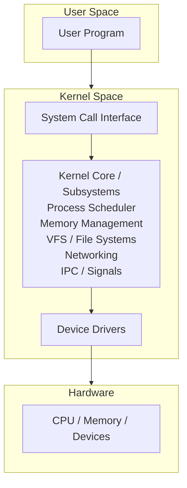
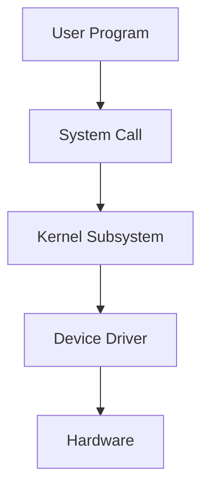
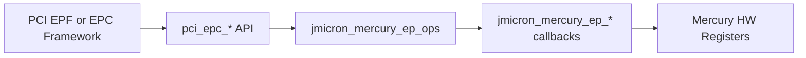
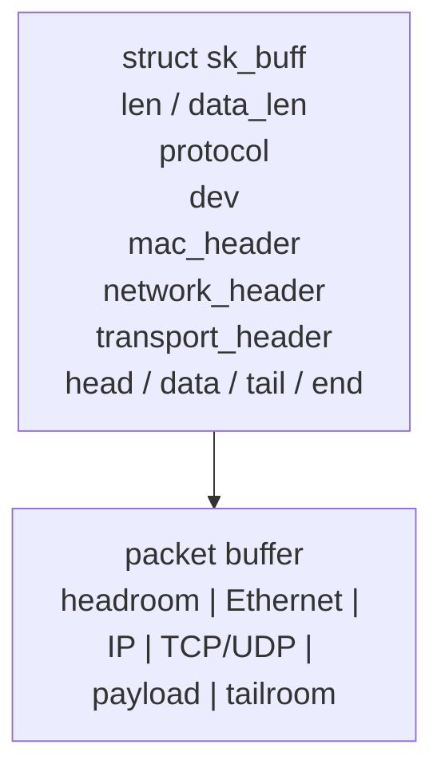
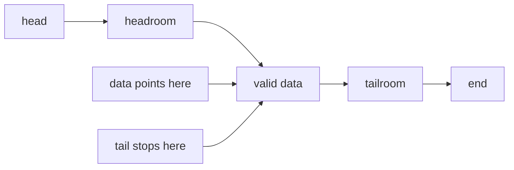
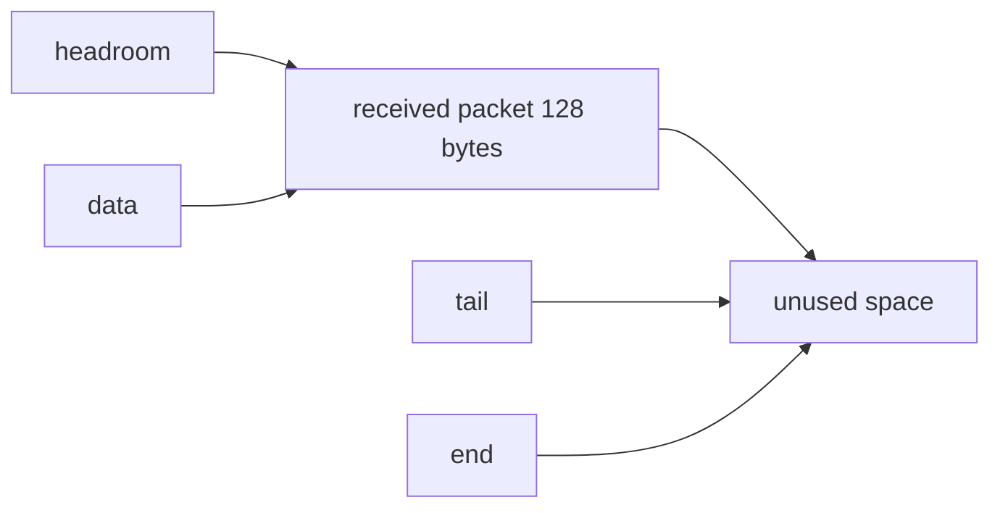
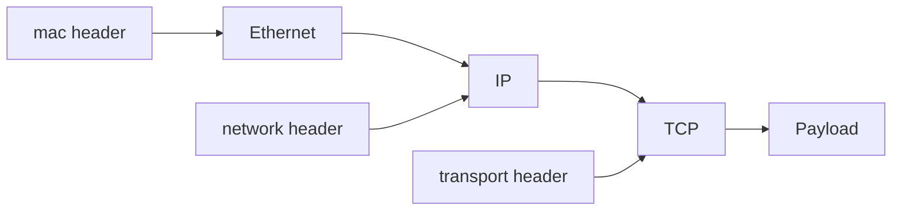
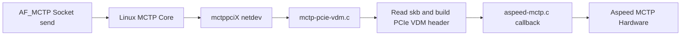
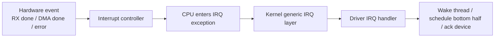

# Linux Kernel Study

<div style="background:#eaf4ff; border-left: 4px solid #5aa9e6; padding: 10px 14px; border-radius: 6px;">
這份筆記用來建立 Linux kernel 的整體觀念，先從分層架構看懂核心在做什麼，再逐步深入到記憶體管理、行程排程、裝置驅動、檔案系統與網路子系統。
</div>

## 章節目錄

- [第一章：Linux kernel 概念上分做哪幾層？](#chapter-1)
- [第二章：先看 Driver Layer 在做什麼](#chapter-2)
- [第三章：Driver 常用工具與 DMA 基礎](#chapter-3)
- [第四章：Linux networking stack 裡的 Socket Buffer（sk_buff）](#chapter-4)
- [第五章：Linux kernel 的 interrupt / IRQ](#chapter-5)

---

<a id="chapter-1"></a>

## 第一章：Linux kernel 概念上分做哪幾層？

Linux kernel 並不是完全嚴格、像教科書那樣切得很乾淨的分層系統，但在學習上，常會把它**概念性地**分成下面幾層：

1. **System Call Interface（系統呼叫介面層）**
2. **Kernel Core / Subsystems（核心功能層）**
3. **Device Driver Layer（裝置驅動層）**
4. **Hardware Layer（硬體層）**

可以先用一張簡化圖來理解：



---

### 1.1 System Call Interface

這一層是 **user space** 和 **kernel space** 之間的正式入口。

當應用程式要做下面這些事時：

- 開啟檔案
- 建立行程
- 傳送網路封包
- 配置記憶體
- 操作裝置

它不能直接碰硬體，而是透過 system call 進入 kernel，例如：

- `open()`
- `read()`
- `write()`
- `fork()`
- `execve()`
- `mmap()`

這層的重點是：

- 提供穩定的使用者介面
- 檢查參數是否合法
- 將請求導向對應的核心子系統

---

### 1.2 Kernel Core / Subsystems

這一層是 Linux kernel 的主體，也是最重要的邏輯中心。它包含多個子系統：

#### Process Scheduler（行程排程）

負責決定：

- 哪個 process 或 thread 先執行
- CPU 時間怎麼分配
- 何時進行 context switch

Linux 是多工系統，排程器就是讓多個工作能共享 CPU 的核心機制。

#### Memory Management（記憶體管理）

負責：

- 實體記憶體與虛擬記憶體管理
- 分頁（paging）
- 配置與回收記憶體
- slab/slub allocator
- page cache

它讓每個 process 看起來像有自己的記憶體空間，同時又能有效共享實體 RAM。

#### VFS and File Systems（虛擬檔案系統與檔案系統）

Linux 不只支援一種檔案系統，例如：

- `ext4`
- `xfs`
- `btrfs`
- `procfs`
- `sysfs`

VFS（Virtual File System）提供統一抽象，讓上層不需要在每次存取檔案時都知道底層是哪種檔案系統。

#### Networking（網路子系統）

負責：

- socket
- TCP/IP protocol stack
- routing
- packet forwarding
- network device interaction

像 `send()`、`recv()` 背後，都會進入這一層處理。

#### IPC / Signals / Synchronization

負責不同 process 或 thread 之間的協作，例如：

- pipe
- shared memory
- semaphore
- signal
- futex

這些機制是作業系統支援並行與協調的重要基礎。

---

### 1.3 Device Driver Layer

這一層負責把「核心的抽象操作」轉成「特定硬體看得懂的控制方式」。

例如：

- 網卡 driver
- UART driver
- I2C / SPI driver
- PCIe driver
- USB driver
- GPIO driver

driver 的角色像翻譯員：

- 往上，提供 kernel 可呼叫的標準介面
- 往下，操作暫存器、中斷、DMA、匯流排協定

因此，驅動程式通常會和下面幾件事強相關：

- register read/write
- interrupt handling
- DMA buffer management
- power management
- device probing and initialization

---

### 1.4 Hardware Layer

最底層就是真正的硬體，包括：

- CPU
- DRAM
- ROM / Flash
- 網卡
- 儲存裝置
- UART
- I2C / SPI 控制器
- PCIe / USB 裝置

kernel 本身不直接「憑空」完成工作，最終還是要透過 driver 去控制這些硬體資源。

---

<a id="chapter-1-5"></a>

## 1.5 初學者可以先怎麼記

先記住下面這個方向就很夠用了：

- **System call**：使用者進入核心的入口
- **Core subsystems**：核心真正處理事情的地方
- **Drivers**：把核心要求轉成硬體操作
- **Hardware**：真正被控制的裝置

一句話總結：

<div style="background:#e8f7e8; border-left: 4px solid #6bbf73; padding: 10px 14px; border-radius: 6px;">
Linux kernel 可以概念性看成「系統呼叫介面層 -> 核心子系統層 -> 驅動程式層 -> 硬體層」。
</div>

---

<a id="chapter-2"></a>

## 第二章：先看 Driver Layer 在做什麼

如果把 Linux kernel 想成一個分工系統，那 `Driver Layer` 就是把「核心抽象」接到「實際硬體」的那一層。

前一章提到：

- `System Call Interface` 是 user space 進入 kernel 的入口
- `Kernel Core / Subsystems` 是處理排程、記憶體、檔案系統、網路等主邏輯的地方
- `Device Driver Layer` 是把這些邏輯落到特定裝置上

如果用「我要怎麼把這顆硬體接進 Linux 既有架構」來看，可以先照下面這條主線理解：

### 2.1 把硬體接進 Linux 的主線

#### 2.1.1 先讓 Linux 知道「有這顆裝置」

可能來自：

- device tree
- PCIe enumeration
- USB 枚舉

也就是先有 `device`。

#### 2.1.2 再讓 Linux 知道「有這支 driver」

例如：

- `module_platform_driver(...)`
- `pci_register_driver(...)`

這類就是把 `driver` 註冊進 kernel。

#### 2.1.3 讓 kernel 去做 device 和 driver 的配對

可能是：

- 名字對上
- `compatible` 對上
- Vendor ID / Device ID 對上

配對成功才會進 `probe()`。

#### 2.1.4 在 `probe()` 裡把硬體資源接起來

例如：

- allocate private data
- map MMIO
- init memory / IRQ / DMA
- 保存 driver state

這一步是在做「讓這顆硬體能被 driver 控制」。

#### 2.1.5 把這顆硬體掛進對應的 subsystem / framework

例如：

- tty
- net
- I2C
- PCI EPC
- V4L2
- input

這一步是在做「讓 Linux 其他部分知道怎麼使用它」。

#### 2.1.6 之後由上層透過通用介面使用它

例如：

- `open/read/write/ioctl`
- `pci_epc_*`
- netdev ops
- file operations

上層不直接碰硬體，而是經過 framework 再到 driver。

所以 driver 並不是獨立存在的，它通常位在：



---

### 2.2 Driver Layer 的核心角色

driver 最重要的任務，可以先記成一句話：

<div style="background:#e8f7e8; border-left: 4px solid #6bbf73; padding: 10px 14px; border-radius: 6px;">
Driver 負責把 kernel 的通用介面，轉成某一顆硬體晶片真正需要的操作方式。
</div>

例如：

- VFS 想讀檔案，最後可能會叫到 storage driver
- network stack 想送封包，最後會叫到 NIC driver
- tty subsystem 想收送字元，最後會叫到 UART driver
- I2C core 想對周邊傳輸資料，最後會叫到 I2C controller driver

也就是說，很多 kernel subsystem 只定義「我要做什麼」，而 driver 負責實作「這顆硬體要怎麼做」。

---

### 2.3 Driver 不只是讀寫 register

初學時很容易把 driver 想成：

- 寫 register
- 讀 register
- 開中斷

這樣不算錯，但太窄了。實際上 driver 往往要處理更多事情：

- 裝置初始化
- 資源配置
- 中斷處理
- DMA 設定
- power management
- error handling
- suspend / resume
- 與 kernel framework 整合

所以 driver 更像是「硬體控制邏輯 + 與 kernel 生態系整合」的組合。

---

### 2.4 Driver 常見會做哪些事

以一般裝置驅動來說，常見工作包含下面幾類。

#### 2.4.1 裝置探測（probe）

kernel 在開機或裝置被偵測到時，會問：

- 這個裝置是誰？
- 有沒有對應的 driver？
- driver 能不能接手？

這時通常會進到 driver 的 `probe()`。

`probe()` 常見工作可能包含：

- 取得 device tree / ACPI / PCI config 提供的資源
- 映射 MMIO register
- 申請 IRQ
- 初始化硬體
- 建立 DMA buffer
- 向 kernel 子系統註冊功能

可以把它理解成「driver 上線時的建置流程」。

不過要注意，這裡是在講 `probe()` 常見會做的事情，不是說每支 driver 都一定會把這些步驟全部寫在同一個 `probe()` 裡。像目前這個 `jmicron_mercury_ep_probe()` 範例，重點比較放在 resource、EPC framework 與 memory window 初始化，並沒有直接出現 `request_irq()` 這類 IRQ 申請程式碼。

下面用 `jmicron_mercury_ep_probe()` 這種 `platform driver probe()` 的寫法來拆解。

#### 2.4.1.1 配置 driver 私有資料

```c
ep = devm_kzalloc(dev, sizeof(*ep), GFP_KERNEL);
```

這裡先配置 `struct jmicron_mercury_ep`，用來保存這個 driver 執行期間需要的狀態，例如：

- `ep` 是 `struct jmicron_mercury_ep *ep`，也就是這支 driver 的 private data 指標
- 可以把它理解成「這顆 JMicron Mercury endpoint 裝置在 kernel 裡的執行期狀態包」
- `regs`
- `epc`
- `msi_cpu_addr`
- `msi_phys_addr`
- function 資訊
- `started`
- 後續初始化建立的其他資源

如果直接對照結構本身來看：

```c
struct jmicron_mercury_ep {
	struct pci_epc *epc;
	void __iomem *regs;
	void __iomem *msi_cpu_addr;
	phys_addr_t msi_phys_addr;
	struct jmicron_mercury_ep_func func[JMICRON_MERCURY_EP_NUM_PFS];
	bool started;
};
```

這些欄位大致代表：

- `epc`：這個 driver 建立出來的 PCI endpoint controller 物件
- `regs`：mapped 後的 MMIO register base，之後存取硬體 register 會靠它
- `msi_cpu_addr` / `msi_phys_addr`：和 MSI 寫入位置有關的位址資訊
- `func[]`：每個 PCI function 的設定與狀態資料
- `started`：這個 endpoint controller 目前是否已進入啟動狀態

所以 `ep` 不是單純為了暫存某一個值，而是把這個 driver 後面會反覆用到的執行期狀態集中管理起來。後面你看到：

- `ep->regs`
- `ep->epc`
- `ep->func[...]`

本質上都是在操作「這個裝置實例自己的狀態」。

`devm_kzalloc()` 的好處是這塊記憶體會綁在 `dev` 的生命週期上，之後移除裝置時可由 managed resource 機制協助回收。

#### 2.4.1.2 取得並映射 MMIO 資源

```c
res = platform_get_resource(pdev, IORESOURCE_MEM, 0);
ep->regs = devm_ioremap_resource(dev, res);
```

這段在做兩件事：

- 從 `platform_device` 取出第 0 個 `IORESOURCE_MEM`
- 把這段實體位址映射成 kernel 可以存取的 MMIO 虛擬位址

成功後，driver 就能透過 `ep->regs` 去讀寫硬體 register。

這裡的 **MMIO 虛擬位址** 可以先這樣理解：

- 硬體 register 原本在某段實體位址空間裡
- CPU 不能直接把那段位址當一般 C 指標隨便存取
- kernel 會先用 `ioremap` 類機制，把那段硬體位址映射成 kernel address space 裡可用的位址
- 映射後拿到的那個位址，就是這裡說的 MMIO 虛擬位址

所以 `ep->regs` 雖然看起來像指標，但它不是一般 RAM buffer 的指標，而是「對應到硬體 register 空間」的位址。後面 driver 透過：

- `readl(ep->regs + offset)`
- `writel(value, ep->regs + offset)`

這類操作，其實不是在讀寫普通記憶體，而是在讀寫裝置的 memory-mapped I/O register。


#### 2.4.1.3 建立 PCI endpoint controller

```c
epc = devm_pci_epc_create(dev, &jmicron_mercury_ep_ops);
```

這一步不是單純碰 register，而是把 driver 掛進 `PCI EPC framework`。

也就是說，這個 driver 的角色不是一般 PCI device driver，而是：

- 實作一個 PCIe endpoint controller
- 對 kernel 的 PCI endpoint framework 提供操作集合 `jmicron_mercury_ep_ops`

這個 `jmicron_mercury_ep_ops` 可以把它想成一張「driver 提供給 framework 的能力表」：

```c
static const struct pci_epc_ops jmicron_mercury_ep_ops = {
	.write_header = jmicron_mercury_ep_write_header,
	.set_bar = jmicron_mercury_ep_set_bar,
	.clear_bar = jmicron_mercury_ep_clear_bar,
	.set_msi = jmicron_mercury_ep_set_msi,
	.get_msi = jmicron_mercury_ep_get_msi,
	.set_msix = jmicron_mercury_ep_set_msix,
	.get_msix = jmicron_mercury_ep_get_msix,
	.raise_irq = jmicron_mercury_ep_raise_irq,
	.start = jmicron_mercury_ep_start,
	.stop = jmicron_mercury_ep_stop,
	.get_features = jmicron_mercury_ep_get_features,
};
```

意思是：

- framework 不直接知道這顆硬體怎麼設 BAR
- framework 也不知道這顆硬體怎麼送 MSI / MSI-X
- framework 只知道「如果要做這件事，就呼叫 ops 裡對應的 callback」

例如：

- 要寫 PCI config header，就走 `write_header`
- 要配置 BAR，就走 `set_bar`
- 要觸發 interrupt，就走 `raise_irq`
- 要啟動 endpoint controller，就走 `start`

所以這種 `ops` 結構，本質上就是一個 callback table。

可以把呼叫方向想成：



上層真的要用時，概念上會像這樣：

1. 某個 PCI endpoint function driver 或 EPC framework 想設定 BAR
2. 它呼叫 `pci_epc_set_bar(epc, func_no, epf_bar)`
3. EPC core 看到這個 `epc` 是由 `jmicron_mercury_ep_ops` 提供實作
4. 於是轉呼叫 `jmicron_mercury_ep_set_bar(...)`
5. 你的 driver 再去寫 Mercury 硬體對應的 register

同樣地，如果上層要發 MSI，中間路徑也會是：

- 上層呼叫 `pci_epc_raise_irq(...)`
- EPC core 轉到 `jmicron_mercury_ep_raise_irq(...)`
- driver 再把 MSI / MSI-X 的硬體動作做掉

所以在看 `jmicron_mercury_ep_ops` 時，最重要的理解不是背欄位名稱，而是知道：

- 上層呼叫的是通用 API
- framework 透過 `ops` 做 dispatch
- 最後真正碰硬體的是你這支 driver 的 callback

這很能說明前面提到的重點：

<div style="background:#e8f7e8; border-left: 4px solid #6bbf73; padding: 10px 14px; border-radius: 6px;">
Linux driver 常常不是自己全包，而是要正確接上既有 subsystem 或 framework。
</div>

#### 2.4.1.4 初始化 function 與 driver data

```c
ep->epc = epc;
for (func_no = 0; func_no < JMICRON_MERCURY_EP_NUM_PFS; func_no++) {
	ep->func[func_no].header.vendorid =
		JMICRON_MERCURY_EP_PCIE_VENDOR_ID;
	ep->func[func_no].header.subsys_vendor_id =
		JMICRON_MERCURY_EP_PCIE_VENDOR_ID;
}
epc->max_functions = JMICRON_MERCURY_EP_NUM_PFS;
epc_set_drvdata(epc, ep);
platform_set_drvdata(pdev, ep);
```

這段是在把 driver 的內部狀態和 framework 綁起來：

- `ep->epc = epc`：保存建立好的 controller
- 設定每個 function 的 PCI header 資訊
- `epc->max_functions`：告訴 framework 這個 controller 支援幾個 function
- `epc_set_drvdata()` / `platform_set_drvdata()`：把 private data 掛回 framework 物件

這樣未來其他 callback 或 lifecycle 階段，就能再把 `ep` 取回來使用。

#### 2.4.1.5 初始化 controller 記憶體並通知 ready

```c
ret = jmicron_mercury_ep_init_epc_mem(pdev, ep);
if (ret)
	return ret;

pci_epc_init_notify(epc);
```

這裡先做這個 controller 所需的 EPC memory 初始化；成功後再呼叫 `pci_epc_init_notify(epc)`，通知 PCI endpoint framework：

- 這個 controller 已完成基本初始化
- 可以進入後續運作階段

這塊記憶體拿到後，主要不是當一般 buffer 用，而是當成 endpoint 往 host 方向送資料的 outbound window，特別是 MSI 很常會用到。簡單說：

- `ep->msi_cpu_addr`：driver 這邊可操作的位址
- `ep->msi_phys_addr`：對應的實體位址，提供給硬體或 framework 使用

之後如果上層要觸發 MSI，driver 就可以利用這塊 outbound window 去完成對 host 的寫入。

上層通常不會直接在意這塊記憶體本身，而是只透過通用 API 表達「我要設定 MSI」或「我要觸發 IRQ」。至於實際是否用到 `ep->msi_cpu_addr` / `ep->msi_phys_addr`，以及怎麼用，都是 `jmicron_mercury_ep_set_msi()`、`jmicron_mercury_ep_raise_irq()` 這些 driver callback 內部要處理的事。

最後用 `dev_info()` 留下一筆註冊成功訊息，並回傳 `0` 表示 `probe()` 成功。

#### 2.4.2 移除裝置（remove）

當 driver 被卸載，或裝置被移除時，會做資源釋放，例如：

- 解除 IRQ
- 釋放 buffer
- 關閉硬體
- unregister 對外介面

這通常出現在 `remove()`。

#### 2.4.3 中斷處理（interrupt handling）

很多硬體不是一直被 polling，而是事件發生時主動通知 CPU。

例如：

- 封包收到了
- DMA 傳輸完成了
- UART 收到資料了
- 錯誤狀態發生了

driver 收到 interrupt 後，通常要：

- 讀 status register 確認原因
- 清除中斷狀態
- 搬資料或排 deferred work
- 喚醒等待中的上層流程

#### 2.4.4 資料傳輸

driver 通常要負責實際資料搬運路徑，例如：

- PIO
- DMA
- ring buffer
- descriptor queue

這在網卡、儲存、USB、PCIe 類裝置特別常見。

#### 2.4.5 對外提供操作介面

driver 不只是碰硬體，還要讓其他 kernel 元件或 user space 能使用它。

常見方式包含：

- file operations
- net_device operations
- tty operations
- sysfs attributes
- ioctl
- ethtool hooks

也就是說，driver 一邊向下控制硬體，一邊向上提供可用介面。

---

### 2.5 Driver 和 Kernel Subsystem 的關係

很多新手會以為 driver 是各寫各的，但 Linux kernel 其實很重視「先進入 framework，再掛接 driver」。

例如：

- block driver 會接到 block layer
- network driver 會接到 networking stack
- USB driver 會接到 USB core
- PCIe driver 會接到 PCI subsystem
- I2C device driver 會接到 I2C core

這樣做的好處是：

- kernel 提供共用抽象
- 多種硬體可以共用一致介面
- driver 作者不必每次都從零開始
- 上層不需要知道每顆晶片細節

所以 Linux driver 的重點常常不是「自己全包」，而是「正確掛進既有 framework」。

---

### 2.6 Platform Driver、PCI Driver、USB Driver 有什麼差別

driver 會依照裝置是怎麼被發現的，分成不同型態。最常見可以先看三種：

#### Platform driver

常見於 SoC 內建周邊，例如：

- GPIO controller
- UART controller
- I2C controller
- SPI controller

這類裝置通常不是插拔式裝置，而是晶片上本來就有，資訊多半來自：

- device tree
- ACPI

如果你看到：

```c
module_platform_driver(jmicron_mercury_ep_driver);
```

這表示這個 module 會在載入時自動把 `jmicron_mercury_ep_driver` 註冊成 platform driver；module 卸載時則自動解除註冊。

可以把它理解成：

- 先把 driver 掛進 platform bus
- 等 kernel match 到對應的 platform device
- 然後才呼叫這支 driver 的 `probe()`

所以 `module_platform_driver(...)` 負責的是「註冊 driver」，而 `probe()` 負責的是「真的接手裝置後開始初始化」。

#### PCI driver

給 PCI / PCIe 裝置使用。kernel 會透過 enumeration 找到裝置，再依照：

- Vendor ID
- Device ID
- Class Code

去匹配對應 driver。

這類 driver 常碰到：

- BAR mapping
- MSI / MSI-X
- DMA
- config space

#### USB driver

給 USB 裝置使用。USB core 偵測到裝置後，會依照：

- device descriptor
- interface descriptor
- class / subclass / protocol

去匹配 driver。

這類 driver 常碰到：

- endpoint
- URB
- control / bulk / interrupt transfer

---

### 2.7 Driver 和 Module 的關係

這一節最容易混淆的地方是：`driver` 和 `module` 不是同一件事。

- `driver`：功能角色，也就是「負責控制某類硬體的程式」
- `module`：載入形式，也就是「這段程式如何被放進 kernel」

所以一個 driver 可以有兩種存在方式：

- `built-in`：直接編進 kernel 本體
- `module`：編成可動態載入的檔案

如果是 `module`，常見檔名就會是 `xxx.ko`。

#### `.ko` 是什麼

`.ko` 是 **kernel object**，也就是 Linux kernel module 的檔案形式。

看到：

- `foo.ko`
- `usbnet.ko`
- `spi-nor.ko`

通常就表示這是一個可以在系統跑起來之後，再由 kernel 載入的 module。

`.ko` 不是隨便用 `gcc` 直接編出來的，它通常是透過 Linux kernel 自己的 build system，也就是 `kbuild`，根據 `Makefile` / `Kconfig` 規則編譯出來。簡單說，就是先有 `.o`，再由 kernel 的 module build 流程產生 `.ko`。

#### `built-in` 和 `module` 怎麼理解

初學時可以先這樣記：

- `built-in`：像內建功能，kernel 一開機就已經有
- `module`：像外掛，需要時再載入

如果某個 driver 是 `module`，通常會用像下面這種方式載入：

- `modprobe xxx`
- `insmod xxx.ko`

#### 什麼情況比較適合 built-in

如果某個 driver 是開機流程早期就會依賴的，通常比較適合做成 `built-in`。例如：

- 開機要用到的儲存控制器
- root filesystem 依賴的 driver
- 很早期就要工作的 SoC 基礎驅動

反過來說，如果不是開機早期必需，而是系統跑起來後再載入也來得及，就可以做成 `module`。

一句話總結：

<div style="background:#e8f7e8; border-left: 4px solid #6bbf73; padding: 10px 14px; border-radius: 6px;">
driver 是「做什麼」，module 是「怎麼載入」；很多 driver 會做成 `.ko` module，但也可以直接 built-in 到 kernel 裡。
</div>

---

### 2.8 用一個具體例子來看

假設今天是 `PCIe UART` 裝置，大致流程可以這樣想：

1. PCI subsystem 在 enumeration 時發現裝置
2. kernel 根據 Vendor ID / Device ID 找到對應 driver
3. driver 的 `probe()` 被呼叫
4. driver 映射 BAR、設定 IRQ、初始化 UART 硬體
5. driver 把自己註冊進 tty subsystem
6. user space 開啟像 `/dev/ttySx` 這樣的節點
7. `read()` / `write()` 經過 system call 進入 tty 層
8. tty 層再呼叫 UART driver 的對應操作
9. driver 最後控制硬體收送資料

這個例子很能說明：

- user space 很少直接面對硬體
- kernel subsystem 提供中介抽象
- driver 才是最後真的操作裝置的那一層

---

### 2.9 初學 driver 時最值得先建立的觀念

先把下面幾件事記熟，後面學 driver 會順很多：

- driver 的責任不只是操作 register，還包含整合 kernel framework
- driver 通常有生命週期，例如 `probe -> operate -> remove`
- driver 常和 interrupt、DMA、buffer、power state 有關
- 同一類裝置通常不會直接裸寫，而是接到對應 subsystem
- 看懂 bus 是什麼很重要，例如 platform、PCIe、USB、I2C、SPI

一句話總結：

<div style="background:#e8f7e8; border-left: 4px solid #6bbf73; padding: 10px 14px; border-radius: 6px;">
Driver Layer 是 Linux kernel 裡最貼近硬體、但又必須同時理解 kernel 架構的一層。
</div>

---

<a id="chapter-3"></a>

## 第三章：Driver 常用工具與 DMA 基礎

<div style="background:#fff4e8; border-left: 4px solid #f0a35e; padding: 10px 14px; border-radius: 6px;">
這一章整理 driver 實作時很常碰到的幾個主題：debug 訊息、register field 操作、DMA buffer 與 streaming DMA 的基本觀念。
</div>

### 3.1 Driver 怎麼印 debug 訊息

寫 driver 時，最常見的 debug 手段之一就是印 log。

初學先記這幾個最常用的就夠了：

- `printk()`
- `pr_info()`
- `pr_err()`
- `dev_info()`
- `dev_err()`
- `dev_dbg()`

#### `printk()`

這是最底層、最通用的 kernel log function，概念上很像 kernel world 的 `printf()`。

```c
printk(KERN_INFO "Mercury EP started\n");
```

不過在 driver 裡，現在通常更常用 `pr_*()` 或 `dev_*()` 這類包好的介面。

#### `pr_*()` 系列

這是一組比較方便的全域 log 巨集，例如：

- `pr_info()`
- `pr_warn()`
- `pr_err()`
- `pr_debug()`

```c
pr_err("failed to init Mercury EP\n");
```

這類寫法適合沒有特定 `struct device *dev` 可以掛訊息的情況。

#### `dev_*()` 系列

如果你手上有 `struct device *dev`，通常更推薦用：

- `dev_info(dev, ...)`
- `dev_warn(dev, ...)`
- `dev_err(dev, ...)`
- `dev_dbg(dev, ...)`

```c
dev_info(dev, "registered JMicron Mercury EP controller\n");
dev_err(dev, "failed to map registers\n");
dev_dbg(dev, "MSI phys addr = %pa\n", &ep->msi_phys_addr);
```

這類好處是 log 會自帶裝置脈絡，之後看訊息時比較容易知道是哪一個 device 印的。

#### 初學先怎麼選

可以先這樣記：

- 想快速印 kernel 訊息：`pr_info()` / `pr_err()`
- 在 driver 裡而且手上有 `dev`：優先用 `dev_info()` / `dev_err()`
- 想放比較多除錯訊息：用 `dev_dbg()`

<div style="background:#e8f7e8; border-left: 4px solid #6bbf73; padding: 10px 14px; border-radius: 6px;">
driver debug 最常用的是 `pr_*()` 和 `dev_*()`；如果手上有 `struct device *dev`，通常優先用 `dev_info()`、`dev_err()`、`dev_dbg()`。
</div>

---

### 3.2 register field 操作推薦用哪些

driver 很常需要讀寫 register，但實務上真正容易出錯的，常常不是整顆 register，而是其中某一個 bit 或某一段 field。

#### 單一 bit：`BIT(n)`

單一開關位元，通常用 `BIT(n)`：

```c
#define CTRL_ENABLE   BIT(0)
#define CTRL_INT_EN   BIT(3)
```

#### 連續 field：`GENMASK(h, l)`

一段連續 bit 代表模式、大小、狀態碼時，通常用 `GENMASK(high, low)`：

```c
#define CTRL_MODE_MASK   GENMASK(3, 1)
#define CTRL_SPEED_MASK  GENMASK(7, 4)
```

#### 寫入 field：`FIELD_PREP(mask, val)`

`FIELD_PREP()` 是把值準備成可以放進指定 field 的格式；它本身不會寫 register。

```c
val &= ~CTRL_MODE_MASK;
val |= FIELD_PREP(CTRL_MODE_MASK, mode);
```

#### 讀出 field：`FIELD_GET(mask, reg)`

```c
u32 mode = FIELD_GET(CTRL_MODE_MASK, val);
```

#### 如果你自己比較習慣 `SET_FIELD()`

如果你自己寫筆記或專案 helper，覺得每次手寫 `& ~mask` 和 `| FIELD_PREP(...)` 很煩，也可以自己包一層。

<div style="background:#ffe3ee; border-left: 4px solid #e26d93; padding: 10px 14px; border-radius: 6px;">
`SET_FIELD()` 不是 Linux kernel 內建標準巨集。它是你自己額外加的 helper；看別人的 kernel code 時，還是更常看到原生的 `FIELD_PREP()` 寫法。
</div>

```c
#define SET_FIELD(reg, mask, val) \
	(((reg) & ~(mask)) | FIELD_PREP((mask), (val)))
```

```c
reg = SET_FIELD(reg, CTRL_MODE_MASK, mode);
```

如果你希望讀取時也維持同樣語意，可以再自己包：

```c
#define GET_FIELD(reg, mask) \
	FIELD_GET((mask), (reg))
```

#### 一個常見、可讀性高的寫法

```c
#define REG_CTRL         0x00
#define CTRL_ENABLE      BIT(0)
#define CTRL_MODE_MASK   GENMASK(3, 1)

u32 val;

val = readl(base + REG_CTRL);
val |= CTRL_ENABLE;
val = SET_FIELD(val, CTRL_MODE_MASK, mode);
writel(val, base + REG_CTRL);
```

#### 不太推薦的寫法

- 直接寫 `0x40`、`0x8000` 這種 magic number
- 到處手寫 `(val >> 4) & 0x7` 卻沒有命名 field
- 寫 register 時整顆覆蓋，卻沒有先保留其他 bit

<div style="background:#e8f7e8; border-left: 4px solid #6bbf73; padding: 10px 14px; border-radius: 6px;">
如果是 Linux driver 裡的 register field 操作，最推薦先認得 `BIT()`、`GENMASK()`、`FIELD_PREP()`、`FIELD_GET()`；如果你想讓自己寫的 code 更順手，再額外包 `SET_FIELD()`。
</div>

---

### 3.3 Non-cache or HW-coherent Buffer DMA

這一節先只看一般使用情況下最常碰到的 coherent DMA buffer，也就是給 device 使用的一塊完整連續空間。

- non-coherent buffer 先不在這一節討論
- 平台到底是怎麼把 coherent 語意實作出來的，也先不在這一節展開
- 這裡先專心看 driver 端最常直接接觸到的 API
#### 3.3.1 設定 address bits

很多 driver 會先看到：

- `dma_set_mask_and_coherent()`

它是在告訴 kernel：這顆 device 最多能使用幾 bit 的 DMA address。

```c
ret = dma_set_mask_and_coherent(dev, DMA_BIT_MASK(64));
if (ret)
	return ret;
```

如果硬體只支援 32-bit DMA address，就要改成 `DMA_BIT_MASK(32)`。

這裡也很容易誤會：
`dma_set_mask_and_coherent()` 設的是這顆 device 能使用多寬的 DMA address，不是在設定它是不是 coherent。

#### 3.3.2 alloc buffer

`coherent` 講的是一致性，不是這塊 buffer 活多久。
可以先理解成：CPU 和 device 看同一塊 DMA buffer 時，彼此看到的內容會自動保持一致。

如果你需要這種 buffer，常見就是：

- `dma_alloc_coherent()`
- `dma_free_coherent()`

```c
void *cpu_addr;
dma_addr_t dma_addr;

cpu_addr = dma_alloc_coherent(dev, size, &dma_addr, GFP_KERNEL);
if (!cpu_addr)
	return -ENOMEM;

/* CPU 用 cpu_addr，device 用 dma_addr */

dma_free_coherent(dev, size, cpu_addr, dma_addr);
```

這類 buffer 常常剛好也會長期存在，所以常見於：

- descriptor ring
- command queue
- device 需要反覆讀寫的 shared buffer

#### 3.3.3 實做自己的 DMA trigger

前面兩步是在準備 DMA 能使用的 address 和 buffer；真正開始搬資料，通常還是要靠 driver 自己去接硬體的 trigger 流程。

常見做法是：

1. 把 `dma_addr` 寫進裝置的 DMA address register 或 descriptor
2. 把 length、control bits 一起設定好
3. 最後寫 start bit / kick bit / doorbell，讓硬體真的開始 DMA

也就是說，`dma_alloc_coherent()` 負責的是「準備好 coherent buffer」，不是「直接開始 DMA」。

可以先把分工想成：

```text
dma_set_mask_and_coherent()
    -> 這顆 device 可以用多寬的 DMA address
dma_alloc_coherent()
    -> 配出 coherent DMA buffer
driver 自己的 MMIO / descriptor setup
    -> 真的 trigger DMA
```

<div style="background:#ffe3ee; border-left: 4px solid #e26d93; padding: 10px 14px; border-radius: 6px;">
如果平台本身不是硬體自動 coherent，那麼 architecture / platform / DMA mapping backend 就要負責把 coherent 這個語意實作出來。也就是說，driver 使用 `dma_alloc_coherent()` 時，不應該再自己決定 flush 或同步方式；這個保證應該由平台層兌現。
</div>

---

### 3.4 streaming DMA sync API

這一節開始才看 streaming DMA 世界。
和前面的 coherent buffer 不一樣，streaming buffer 的資料同步不是自動保證的；CPU 和 device 之間什麼時候要同步、什麼時候要交還控制權，要靠 driver 依照 DMA API 規則去處理。

`streaming` 這個名字不是在講非同步，而是在講：

**這塊 buffer 是沿著一次次資料傳輸流程被暫時 map、使用、sync、再 unmap。**


#### 3.4.1 streaming DMA 是什麼

可以先把它想成：

```text
CPU 這邊本來有一塊 buffer
    -> kernel 幫你轉成 device 可用的 DMA address
    -> device 拿去做一次或一段時間的 DMA
    -> CPU / device 輪流接手時，要照規則 sync
```


這裡最容易誤會的一點是：
`streaming DMA` 通常不是先用專門 API 去配置一塊新 buffer；很多時候是你本來就有一塊一般記憶體 buffer，然後把它 map 成 DMA 可用。

常見會看到：

- `kmalloc()`
- driver 自己的 ring / queue buffer
- networking / block layer 上層交下來的 buffer

接著再用這幾個 API：

| API | 用途 | 回傳值 / 判斷方式 |
| --- | --- | --- |
| `dma_map_single()` | 把既有 buffer 轉成 device 可用的 DMA address | 回傳 `dma_addr_t`，這就是要給硬體用的 DMA address |
| `dma_unmap_single()` | 告訴 kernel 這次 streaming DMA mapping 已經用完 | 沒有回傳值 |
| `dma_mapping_error()` | 檢查 `dma_map_single()` 有沒有失敗 | 回傳 true / false，用來判斷 mapping 是否成功 |

```c
dma_addr_t dma_addr;

dma_addr = dma_map_single(dev, buf, len, DMA_TO_DEVICE);
if (dma_mapping_error(dev, dma_addr))
	return -EIO;
```

這裡回傳的 `dma_addr`，就是要給硬體用的 DMA address。

#### 3.4.2 trigger write DMA 要注意什麼

如果是 CPU 準備好資料，要叫 device 去把資料讀走，常見方向是：

- `DMA_TO_DEVICE`

這種情況最重要的是：

1. CPU 先把 buffer 內容寫好
2. 如果這塊 buffer 之後還會重複拿來用，必要時先做 `dma_sync_single_for_device()`
3. 把 `dma_addr`、length、control bits 寫進硬體 register 或 descriptor
4. 最後 trigger DMA

sample code ：

```c
dma_addr_t dma_addr;

dma_addr = dma_map_single(dev, buf, len, DMA_TO_DEVICE);
if (dma_mapping_error(dev, dma_addr))
	return -EIO;

dma_sync_single_for_device(dev, dma_addr, len, DMA_TO_DEVICE);

writel(lower_32_bits(dma_addr), regs + DMA_ADDR_LO);
writel(upper_32_bits(dma_addr), regs + DMA_ADDR_HI);
writel(len, regs + DMA_LEN);
writel(DMA_START, regs + DMA_CTRL);

/* DMA 完成後 */
dma_unmap_single(dev, dma_addr, len, DMA_TO_DEVICE);
```

筆記：

- CPU 改過內容，要交回 device 前，呼叫 `dma_sync_single_for_device()`
- CPU 沒再動過內容，通常不需要多補一次 `dma_sync_single_for_device()`

#### 3.4.3 trigger read DMA 要注意什麼

如果是 device 要把資料寫回 buffer，常見方向是：

- `DMA_FROM_DEVICE`

這時候比較重要的是「DMA 完成後，CPU 接手前」那個同步點。

sample code ：

```c
dma_addr_t dma_addr;

dma_addr = dma_map_single(dev, buf, len, DMA_FROM_DEVICE);
if (dma_mapping_error(dev, dma_addr))
	return -EIO;

writel(lower_32_bits(dma_addr), regs + DMA_ADDR_LO);
writel(upper_32_bits(dma_addr), regs + DMA_ADDR_HI);
writel(len, regs + DMA_LEN);
writel(DMA_START, regs + DMA_CTRL);

/* 等 DMA 完成，例如 interrupt / polling */

dma_sync_single_for_cpu(dev, dma_addr, len, DMA_FROM_DEVICE);

/* CPU 現在開始讀 buf */

dma_unmap_single(dev, dma_addr, len, DMA_FROM_DEVICE);
```

如果這塊 buffer 之後還要再交回 device 重複使用，CPU 改完或看完之後，要再補：

```c
dma_sync_single_for_device(dev, dma_addr, len, DMA_FROM_DEVICE);
```

#### 3.4.4 `dma_sync_single_*()` 兩隻怎麼分

| API | 什麼時候用 | 最短記法 |
| --- | --- | --- |
| `dma_sync_single_for_cpu(dev, dma_addr, size, dir)` | device 剛剛動過資料，現在 CPU 準備讀或改這塊單一 buffer | `for_cpu` = 在 CPU 接手前先同步 |
| `dma_sync_single_for_device(dev, dma_addr, size, dir)` | CPU 剛剛動過資料，現在準備把這塊單一 buffer 再交回 device | `for_device` = 在 device 接手前先同步 |


<div style="background:#e8f7e8; border-left: 4px solid #6bbf73; padding: 10px 14px; border-radius: 6px;">
看 `dma_sync_*()` 時，先不要把它想成「開始 DMA」或「配置 DMA」。最穩的理解是：這是在 CPU 和 device 之間切換資料控制權時用的同步 API。
</div>

---

### 3.5 怎麼 alloc 一塊空間

一般記憶體：`kmalloc()` / `kzalloc()`

如果這塊空間只是給 driver 自己放資料結構、狀態、software queue，最常見就是：

- `kmalloc()`
- `kzalloc()`
- `devm_kzalloc()`

```c
struct my_priv *priv;

priv = devm_kzalloc(dev, sizeof(*priv), GFP_KERNEL);
if (!priv)
	return -ENOMEM;
```

這一類配置出來的是一般 kernel memory。
它不是 DMA API，也不保證你可以直接把這個 pointer 丟給硬體當 DMA address。

可以先這樣記：

- `kmalloc()`：配置一塊一般記憶體
- `kzalloc()`：配置後順便清成 0
- `devm_kzalloc()`：掛在 `dev` 生命周期上，之後由 managed resource 幫忙回收

---

<a id="chapter-4"></a>

## 第四章：Linux networking stack 裡的 Socket Buffer（sk_buff）

<div style="background:#eaf4ff; border-left: 4px solid #5aa9e6; padding: 10px 14px; border-radius: 6px;">
這份筆記整理 Linux kernel networking 裡的 <b>Socket Buffer</b>，也就是常看到的 <code>sk_buff</code> 與 <code>skb</code>。它不是單純的一塊封包資料，而是 kernel 用來描述、搬運、修改與轉送封包的核心容器。
</div>

---

### 4.1 Socket Buffer 是什麼？

在 Linux kernel 網路子系統裡，封包從 NIC 收進來、經過 protocol stack 往上走，或從 socket 往下送到 driver，幾乎都會圍繞著 `struct sk_buff` 在移動。

可以先把它想成：

- **packet data 的載體**
- **packet metadata 的容器**
- **network stack 各層共同操作的物件**

`skb` 不只放資料本體，還會記錄很多上下文，例如：

- 這是哪個 protocol 的封包
- L2 / L3 / L4 header 在哪裡
- 目前有效資料的範圍在哪裡
- 這個封包要送去哪個 net device
- checksum、GSO、VLAN、timestamp 等狀態

<div style="background:#e8f7e8; border-left: 4px solid #6bbf73; padding: 10px 14px; border-radius: 6px;">
<code>sk_buff</code> 是 Linux kernel networking stack 用來表示「一個封包及其相關狀態」的核心資料結構。
</div>

---

### 4.2 `sk_buff` 在整體路徑上的角色

#### 4.2.1 RX 路徑


driver 收到封包後，通常會：

- 準備或回收 RX buffer
- 把收到的資料掛到 `skb`
  常見會看到：`netdev_alloc_skb()`、`build_skb()`、`napi_alloc_skb()`、`skb_put()`、`skb_put_data()`
- 設定長度、protocol、checksum 狀態
  常見會看到：`skb_put()` 或 `skb_put_data()` 增加有效長度，`skb->protocol = ...`，以及 `skb->ip_summed = ...`
- 把 `skb` 往 networking stack 交上去
  常見會看到：`netif_rx()`、`netif_receive_skb()`、`napi_gro_receive()`

RX 常見其實有兩種做法：

1. **copy**
   原始資料先放在 driver 自己的 RX buffer，再複製到新的 `skb`
2. **不 copy / attach / reuse**
   讓整個 `skb` 去描述並使用那塊既有 buffer，例如 `build_skb()` 這類思路

所以不是所有 RX 都一定會 copy。像前面提到的 `mctp_pcie_vdm_receive_packet()` 就是 copy 型；高效能網卡 driver 則常會盡量減少 copy。

#### 4.2.2 TX 路徑


在這條路上，kernel 會建立或修改 `skb`，逐層把 header 填進去，最後交給 driver 送出。

driver 在 TX 路徑上常見工作包括：

- 從上層收到 `skb`
- 讀取 `skb` 裡的資料長度與 header 資訊
- 視需要往前補 transport 或 link header
  常見會看到：`skb_push()`
- 處理 checksum offload、TSO、GSO 等需求
- 把資料 map 成 DMA 可用格式
- 通知 NIC 開始送出
- 送完後回收對應資源

<div style="background:#e8f7e8; border-left: 4px solid #6bbf73; padding: 10px 14px; border-radius: 6px;">
TX 和 RX 雖然都會用到 <code>struct sk_buff</code>，但兩邊的工作方向不同：RX 著重把收到的資料整理成 <code>skb</code> 交給上層；TX 著重把上層的 <code>skb</code> 加工後交給硬體，因此常操作的欄位與 helper function 也不完全一樣。
</div>

---

### 4.3 先用直覺理解 `skb` 長什麼樣

雖然 `struct sk_buff` 本身欄位很多，但初學時先抓住兩件事就很夠：

1. **`skb` 本體是描述物件**
2. **`skb` 本體主要是描述資訊，封包內容則由其中的指標去定位 data buffer**



<table>
  <thead>
    <tr>
      <th>欄位</th>
      <th>直覺意思</th>
      <th>初學時怎麼記</th>
    </tr>
  </thead>
  <tbody>
    <tr>
      <td><code>head</code></td>
      <td>整塊 data buffer 的起點</td>
      <td>這塊 packet buffer 從哪裡開始</td>
    </tr>
    <tr>
      <td><code>data</code></td>
      <td>目前有效資料的起點</td>
      <td>真正要解析的封包從哪裡開始；前面若有空間就是 headroom</td>
    </tr>
    <tr>
      <td><code>tail</code></td>
      <td>目前有效資料的結尾後一格</td>
      <td><code>data</code> 到 <code>tail</code> 之間就是有效資料</td>
    </tr>
    <tr>
      <td><code>end</code></td>
      <td>整塊 data buffer 的結尾</td>
      <td>這塊 buffer 到哪裡為止</td>
    </tr>
    <tr>
      <td><code>len</code></td>
      <td>目前這個 <code>skb</code> 代表的資料總長度</td>
      <td>這包封包目前有多長</td>
    </tr>
  </tbody>
</table>

---

### 4.4 什麼是 headroom 和 tailroom？

這是 `skb` 很重要的一塊。



#### 4.4.1 headroom

`data` 前面預留但目前還沒用到的空間。

它很有用，因為封包在往下走時，常常需要在前面再補 header，例如：

- TCP payload 往下補 IP header
- IP packet 往下補 Ethernet header
- tunnel 或 encapsulation 再往前多推一層 header

這時如果前面有 headroom，就能直接把 `data` 往前移並填內容，不用每次都重配整塊記憶體。

RX 時也常會刻意設定 headroom。driver 收到封包後，可能不是讓 `data`
直接指向 buffer 最前面，而是先預留一小段空間，讓後續 stack 若需要補齊
alignment、補 metadata，或重新塞回某層 header 時比較方便。

常見概念像這樣：

```c
skb = netdev_alloc_skb(dev, rx_len + NET_IP_ALIGN);
skb_reserve(skb, NET_IP_ALIGN);
memcpy(skb_put(skb, rx_len), rx_buf, rx_len);
```

這裡 `skb_reserve()` 會把 `data` 和 `tail` 一起往後移，前面空出來的地方就是
headroom。接著 `skb_put()` 再把 `tail` 往後推，表示真正收到的封包資料長度。

如果是比較高效能的 RX path，driver 也可能用 `build_skb()`、page pool 或 DMA
buffer 直接包成 `skb`。概念仍然類似：`head` 指向整塊可用 buffer 的起點，
`data` 會被調到有效封包資料開始的位置，`data` 前面留下的空間就是 headroom。

#### 4.4.2 tailroom

`tail` 後面剩餘但尚未使用的空間。

它常用來：

- 在尾端追加 payload
- 加入某些 trailer
- 組封包時逐步往後長資料

RX 時，tailroom 通常來自「配置的 buffer 比實際收到的封包長」。例如 driver
可能配置一塊 2048 bytes 的 RX buffer，但這次硬體只收到 128 bytes：



driver 會用實際收到的長度把 `tail` 設到有效資料結尾，例如透過 `skb_put(skb, len)`。
`tail` 到 `end` 之間尚未使用的空間，就是 tailroom。

所以 RX 時可以這樣記：

- `headroom`：有效封包前面保留的空間，常為了 alignment 或之後可能補 header
- `tailroom`：有效封包後面還沒用到的空間，常是因為 RX buffer 配得比實際封包大
- `len`：這次 `skb` 目前代表的有效資料長度，不等於整塊 RX buffer 大小

---

### 4.5 常見操作在做什麼？

先抓住一個重點：這些 helper 大多不是在「解析封包」，而是在移動
`data` 或 `tail`，讓 `skb` 知道目前哪一段才算有效資料。

可以先用這張速記表：

<table>
  <thead>
    <tr>
      <th>helper</th>
      <th>移動誰</th>
      <th>效果</th>
      <th>常見用途</th>
      <th>補充</th>
    </tr>
  </thead>
  <tbody>
    <tr>
      <td><code>skb_put()</code></td>
      <td><code>tail</code> 往後</td>
      <td>有效資料變長</td>
      <td>RX 放入收到的資料、尾端追加資料</td>
      <td>常見寫法是 <code>memcpy(skb_put(skb, len), rx_buf, len)</code>；<code>skb_put()</code> 回傳新增空間的起點</td>
    </tr>
    <tr>
      <td><code>skb_push()</code></td>
      <td><code>data</code> 往前</td>
      <td>前面多一段有效資料</td>
      <td>往前補 header</td>
      <td>常見於 TX，例如 payload 前面補 IP header 或 Ethernet header</td>
    </tr>
    <tr>
      <td><code>skb_pull()</code></td>
      <td><code>data</code> 往後</td>
      <td>前面一段不再算有效資料</td>
      <td>吃掉或跳過 header</td>
      <td>常見於 RX 解析，例如看完 Ethernet header 後，讓 <code>data</code> 指到下一層 header 或 payload</td>
    </tr>
    <tr>
      <td><code>skb_reserve()</code></td>
      <td><code>data</code> 和 <code>tail</code> 一起往後</td>
      <td>先空出 headroom</td>
      <td>剛配置 skb 後先預留前方空間</td>
      <td>不會增加有效資料長度；通常接著再用 <code>skb_put()</code> 放入真正資料</td>
    </tr>
  </tbody>
</table>

---

### 4.6 header pointer 為什麼重要？

network stack 不只要知道「資料在哪」，還要知道各層 header 在哪。

常見概念有：

- `mac_header`
- `network_header`
- `transport_header`

對應大致是：

- MAC header: Ethernet header
- Network header: IPv4 / IPv6 header
- Transport header: TCP / UDP header



這讓 kernel 可以很快找到對應的 header 去做：

- protocol parsing
- routing decision
- checksum handling
- port 或 address extraction
- packet rewrite

---

### 4.7 `skb` 不一定只是一整塊連續 payload

初學時很容易以為一個 `skb` 就是一塊完整連續的封包資料，但實際上 Linux 為了效率，常常不會這麼單純。

#### 4.7.1 linear data

最前面的主要資料區可以是 linear 的，也就是可以直接連續存取。

#### 4.7.2 fragmented data

有些資料可能放在 page fragments 或其他分散位置，由 `skb` 去描述它們。

這樣做的目的是：

- 減少 copy
- 配合 DMA 或 page-based buffer
- 提高大封包處理效率

---

### 4.8 MCTP 其實也使用 `skb`

很多人一開始會以為 `skb` 主要是給 Ethernet、IP、TCP、UDP 用的，但其實不是。只要是走 Linux kernel networking stack 的封包型協定，通常就會沿用 `sk_buff` 這套模型，**MCTP 也是其中之一**。


#### 4.8.1 為什麼 socket-MCTP 也會用 `skb`？

原因其實和 TCP/IP 很像：

- kernel 需要有統一的封包容器
- 需要描述 packet data 與 packet metadata
- 需要能在 netdev、protocol stack、socket 之間傳遞

所以 MCTP 只要進入 Linux networking stack，就不會自己再發明一套完全不同的 packet object，而是沿用 `skb`。


#### 4.8.2 MCTP RX 時 `skb` 怎麼用？


從 `skb` 角度看，重點是：

- 硬體先收到 PCIe VDM 上的 MCTP packet
- driver 先把 raw packet 取出來
- generic `mctp-pcie-vdm` transport 會把這包資料轉成 `skb`
- `skb` 內會帶著這包 MCTP message 的資料與 metadata
- 然後把 `skb` 往 Linux MCTP networking stack 交上去


實際上，`mctp_pcie_vdm_receive_packet()` 這段 code 就是在做這件事：

```c
int mctp_pcie_vdm_receive_packet(struct net_device *ndev)
{
	struct mctp_pcie_vdm_dev *mdev;
	struct mctp_pcie_vdm_hdr *hdr;
	struct mctp_skb_cb *cb;
	struct sk_buff *skb;
	unsigned int payload_len;
	size_t len = 0;
	void *data = NULL;
	int rc;

	if (!ndev)
		return -EINVAL;

	mdev = netdev_priv(ndev);
	rc = mdev->ops->recv_packet(mdev->dev, &data, &len);
	if (rc)
		return rc;

	rc = mctp_pcie_vdm_validate_packet(ndev, data, len, &payload_len);
	if (rc)
		goto drop;

	hdr = data;

	skb = netdev_alloc_skb(ndev, payload_len);
	if (!skb) {
		rc = -ENOMEM;
		goto drop;
	}

	skb_put_data(skb, (u8 *)data + sizeof(*hdr), payload_len);
	skb->protocol = htons(ETH_P_MCTP);
	skb_reset_network_header(skb);

	cb = __mctp_cb(skb);
	cb->halen = 0;

	dev_dstats_rx_add(ndev, payload_len);
	netif_rx(skb);

	mdev->ops->free_packet(mdev->dev, data);

	return 0;

drop:
	dev_dstats_rx_dropped(ndev);
	if (data)
		mdev->ops->free_packet(mdev->dev, data);

	return rc;
}
```

可以把這段實作拆成下面幾步看：

1. `recv_packet()` 先從下層硬體 driver 拿到一包 raw data
2. `mctp_pcie_vdm_validate_packet()` 檢查這包是不是合法的 PCIe VDM MCTP packet，並算出真正的 `payload_len`
3. `hdr = data` 表示這包 raw data 開頭是 PCIe VDM header
4. `netdev_alloc_skb(ndev, payload_len)` 配一個新的 `skb`
5. `skb_put_data(skb, (u8 *)data + sizeof(*hdr), payload_len)` 跳過 PCIe VDM header，只把後面的 MCTP payload 複製進 `skb`
6. `skb->protocol = htons(ETH_P_MCTP)` 告訴上層這是一包 MCTP 封包
7. `skb_reset_network_header(skb)` 把目前的 `skb->data` 視為 network header 起點
8. `netif_rx(skb)` 把這包 `skb` 丟進 Linux networking stack

`netif_rx(skb)` 不是直接呼叫某個 MCTP function，而是把 `skb` 交給
Linux 網路收包流程。後面大致會是：

1. `netif_rx(skb)` 把 `skb` 放進 kernel 的 RX backlog queue
2. kernel 觸發 `NET_RX_SOFTIRQ`
3. softirq 之後會跑 network RX 處理流程
4. kernel 根據 `skb->protocol` 決定這包要交給誰
5. 如果 `skb->protocol == htons(ETH_P_MCTP)`，就會交給已註冊處理
   `ETH_P_MCTP` 的 MCTP protocol handler

所以這段 code 可以理解成：driver 先把 PCIe VDM transport header 拆掉，
再把乾淨的 MCTP packet 包成 `skb`，最後透過 `netif_rx(skb)` 交給
Linux networking stack，讓 MCTP 那層繼續處理。

這裡最值得注意的是第 5 步：

- 進來的原始資料是 `PCIe VDM header + MCTP packet`
- 放進 `skb` 的不是整個 PCIe VDM frame
- 而是 **去掉 `sizeof(*hdr)` 之後的 MCTP payload**

也就是說，這段 code 的設計是：

- PCIe VDM header 在 transport 層先驗證、先拆掉
- 真正往上交給 MCTP stack 的，是乾淨的 MCTP packet

還有一個 headroom 很關鍵的點：

- 這裡用的是 `netdev_alloc_skb(ndev, payload_len)`
- 沒有先 `skb_reserve()` 額外預留 PCIe VDM header 空間
- 所以這條 RX path 的 `skb` 幾乎就是「剛好裝 payload」

這也說明了：

- **TX 路徑** 常比較需要 headroom，因為可能還要往前補 PCIe VDM header
- **RX 路徑** 常見做法是先把 transport header 拆掉，再把 payload 包成 `skb` 往上送

#### 4.8.3 MCTP TX 時 `skb` 怎麼用？



從 `skb` 角度看，流程大致是：

1. user space 透過 `AF_MCTP` socket 送資料
2. Linux MCTP core 建立或整理對應的 `skb`
3. route 或 neigh 選到 `mctppciX`
4. `mctp-pcie-vdm.c` 從 `skb` 取出 MCTP message
5. transport layer 再補上 PCIe VDM transport header
6. 之後交給 Aspeed 硬體 driver 做實際送出

#### 4.8.4 對 MCTP 來說，`skb` 裡裝的是什麼？

如果用概念來看，MCTP 的 `skb` 通常承載的是：

- MCTP message data
- MCTP header 相關內容
- 對應的 netdev 資訊，例如 `mctppciX`
- 封包長度、協定狀態與傳遞上下文

而到了 PCIe VDM transport 那層，還會再根據需要：

- 從 `skb` 取 payload
- 在前面補 PCIe VDM header
- 交給下層 Aspeed MCTP driver

### 4.9 `skb` 的生命週期怎麼看？


更具體一點：

1. 建立 `skb` 或把既有 buffer 包裝成 `skb`
2. 各層更新 header 與 metadata
3. 在 queue、protocol stack、driver 間傳遞
4. 最後送出完成，或被 socket 收下，或被丟棄
5. 資源被釋放或回收

---

### 4.10 初學時最容易搞混的幾件事

#### 4.10.1 `socket` 和 `socket buffer` 不是同一件事

- `socket` 是通訊端抽象
- `socket buffer` 是封包資料在 kernel 裡移動時常用的容器

#### 4.10.2 `skb` 會在 networking stack 各層流動

`skb` 雖然常出現在 driver 裡，但它不是 driver 專用物件。只要封包進入
Linux networking stack，後面的 netdev、protocol layer、socket layer 都可能會操作它。

這裡的 stack 不是 CPU 的 call stack，也不是一塊記憶體堆疊；它比較像
「kernel 裡一層一層處理網路封包的流程」。

可以把 networking stack 想成封包在 kernel 裡經過的一串處理層。

RX 時，封包大致是從硬體往上走：


TX 時方向相反，資料從 socket 往下走到 driver：


`skb` 就是在這些層之間被傳來傳去的封包容器。每一層可能會看或修改不同資訊：

<table>
  <thead>
    <tr>
      <th>層次</th>
      <th>常看什麼</th>
      <th>可能做什麼</th>
    </tr>
  </thead>
  <tbody>
    <tr>
      <td>driver / netdev</td>
      <td>實際封包資料、長度、device</td>
      <td>收包、送包、設定 <code>skb->dev</code>、交給上層</td>
    </tr>
    <tr>
      <td>protocol layer</td>
      <td>protocol、header 位置、checksum</td>
      <td>解析 header、決定下一層、更新 metadata</td>
    </tr>
    <tr>
      <td>socket layer</td>
      <td>payload、來源與目的資訊</td>
      <td>把資料交給對應 socket，或從 socket 建立要送出的封包</td>
    </tr>
  </tbody>
</table>

所以看到「把 `skb` 交給 networking stack」，意思通常是：driver 不再自己處理這包，
而是把它交給 kernel 的網路流程，讓後面的 protocol layer 和 socket layer 繼續處理。

#### 4.10.3 `skb` 不是只有 data pointer

真正有價值的是：

- data buffer
- header 位置資訊
- protocol metadata
- device、routing、offload 狀態

---

<a id="chapter-5"></a>

## 第五章：Linux kernel 的 interrupt / IRQ

<div style="background:#eefaf2; border-left: 4px solid #58b77b; padding: 10px 14px; border-radius: 6px;">
這一章整理 Linux kernel 裡的 interrupt 基本觀念：CPU 為什麼需要中斷、IRQ handler 在做什麼、為什麼又會分成 hard IRQ、softirq、threaded IRQ，以及 driver 實作時哪些事情可以在中斷裡做、哪些不能做。
</div>

### 5.1 IRQ 這個字到底在講什麼？

在 Linux 裡，你很常同時看到：

- interrupt
- IRQ
- interrupt line
- interrupt handler

它們關係可以先這樣記：

- **interrupt**：整個「硬體通知 CPU」的事件機制
- **IRQ**：通常是 kernel 裡用來識別某個中斷來源的編號或抽象資源
- **interrupt handler**：真的被呼叫來處理這個 IRQ 的函式

例如 driver 會註冊：

```c
request_irq(irq, my_handler, 0, "mydev", dev);
```

這表示：

- 某個 `irq` 發生時
- kernel 要呼叫 `my_handler`
- `dev` 會當成 handler 的 context 傳進去

---

### 5.2 interrupt 從硬體到 driver，大致怎麼走？



實際上，中間細節很多，但學習上先抓這條主線就夠：

1. 裝置發生事件
2. 裝置把中斷送到 interrupt controller
3. CPU 收到中斷，進入 kernel 的 IRQ 處理路徑
4. generic IRQ layer 找到這個 IRQ 對應的 handler
5. driver 的 handler 被呼叫
6. handler 做最小必要工作，剩下重工作延後處理

<div style="background:#fff7e8; border-left: 4px solid #f0b35c; padding: 10px 14px; border-radius: 6px;">
初學時先把 generic IRQ layer 想成「kernel 幫大家統一管理 IRQ 的中介層」就好。driver 通常不直接碰最底層 CPU exception 細節，而是向 Linux IRQ framework 註冊 handler。
</div>

---

### 5.3 top half 和 bottom half 怎麼理解？

這是學 interrupt 最常見的一組概念。

- **top half**：最先跑的 IRQ handler，重點是快
- **bottom half**：延後處理剩下工作，重點是把 hard IRQ 做短

可以先這樣想：

```text
interrupt 來了
    -> top half 先接住
       - 看原因
       - 清狀態
       - 記錄必要資訊
       - 排後續工作
    -> bottom half 再慢慢做比較重的事情
```

在 Linux 裡，bottom half 不只一種做法，常見包括：

- softirq
- tasklet
- workqueue
- threaded IRQ

它們不是完全同一層概念，但都可以拿來達成「把重工作延後」這件事。

---

### 5.4 hard IRQ、softirq、threaded IRQ 差在哪？

這一節先把幾個名詞分清楚。它們都和 interrupt 後續處理有關，但不是同一種東西。

#### 5.4.1 先用一張表抓差異

| 機制 | 誰觸發第一步 | 誰通常會寫到 | 主要用途 | 可不可以 sleep |
| --- | --- | --- | --- | --- |
| hard IRQ | 硬體裝置 | driver 很常寫 | 第一時間接住 interrupt | 不可以 |
| softirq | kernel code 標記 pending | 多數 driver 不直接寫 | kernel subsystem 的高效率延後處理 | 不可以 |
| threaded IRQ | 硬體 IRQ 後由 kernel 喚醒 IRQ thread | driver 很常寫 | 把 IRQ 後半段交給 thread | 通常比較可以做複雜事 |
| tasklet | driver 或 kernel 排程 | 舊 driver 可能看到 | 較舊的 bottom-half 機制 | 不可以 |

最常用的直覺是：

```text
hard IRQ
    -> 先接住硬體事件，越短越好

softirq
    -> kernel subsystem 內部常用的延後處理

threaded IRQ
    -> driver 把 IRQ 後半段交給 kernel thread
```

---

#### 5.4.2 hard IRQ：第一時間接住中斷

這是最直接的中斷處理階段。

特徵通常是：

- 跑得很快
- 不能隨便睡眠
- 適合做最小必要處理

hard IRQ handler 常做的事情是：

- 確認是不是自己的 IRQ
- 讀 status register
- ack / clear / mask interrupt
- 記錄必要狀態
- 安排後續處理

---

#### 5.4.3 softirq：kernel 自己排的延後處理

softirq 是 kernel 用來延後做某些工作的機制，常見於：

- network RX/TX
- timer
- block I/O 完成路徑

它的重點不是「變成一般 thread」，而是：

- 仍然很靠近核心底層
- 偏向高效率、大量事件處理

這裡最容易搞混的是「誰觸發 softirq」。

- **觸發硬體中斷的是裝置**
- **觸發 softirq 的不是硬體，而是 kernel 自己把某個 softirq 標成 pending**

流程可以先這樣想：

```text
硬體 IRQ 先進來
    -> hard IRQ handler 跑一小段
    -> kernel 標記某個 softirq 待處理
    -> 離開 hard IRQ 後，找合適時機跑 softirq handler
```

所以 softirq 是 kernel 內部的一種延後執行機制。

---

##### 5.4.3.1 sample：網卡收包時 softirq 怎麼跑？

例如網路收包常見流程可以這樣看。

```text
NIC 收到封包
    -> 網卡硬體拉 IRQ
    -> CPU 進入 hard IRQ handler
    -> driver/NAPI 先把 RX 事件收下來
    -> kernel 把 NET_RX_SOFTIRQ 標成 pending
    -> 離開 hard IRQ
    -> kernel 執行 NET_RX_SOFTIRQ
    -> softirq 再去跑較完整的 RX 處理
```

高層流程圖如下：


把這條路拆細一點看：

1. 網卡真的收到封包，這是**硬體事件**
2. 網卡硬體送出 IRQ，這是**硬體中斷**
3. CPU 進入 driver 的 hard IRQ handler
4. handler 通常不會在這裡一包一包慢慢處理全部封包
5. handler 做 `ack`、`mask interrupt`，並告訴 kernel「這個網卡有 RX 工作要做」
6. 這一步常會走到 `napi_schedule()` 一類路徑
7. `napi_schedule()` 背後會把 `NET_RX_SOFTIRQ` 標成 pending
8. 等 hard IRQ 快結束時，kernel 可能直接呼叫 `do_softirq()`
9. 如果目前不適合立即跑完，之後也可能由 `ksoftirqd/n` 這種 kernel thread 接手
10. 接著 `NET_RX_SOFTIRQ` 對應的處理函式開始跑，再去呼叫 NAPI poll，把 backlog 或 ring 裡的多包封包一次處理掉

從「誰觸發」來看，其實分成兩層：

- **第一層硬體 IRQ**：由裝置觸發
- **第二層 softirq 執行**：由 kernel 在軟體路徑中標記並安排執行

---

##### 5.4.3.2 driver 作者通常會不會自己寫 softirq？

通常不會。

大多數 driver 作者比較常做的是：

- 申請硬體 IRQ：`request_irq()` 或 `request_threaded_irq()`
- 在 IRQ handler 裡快速處理硬體事件
- 呼叫某個 kernel subsystem API，把後續工作交出去

真正的 softirq handler 通常是 kernel subsystem 早就註冊好的。以 networking 為例，driver 通常不會自己註冊 `NET_RX_SOFTIRQ`，而是呼叫像：

- `napi_schedule()`
- `netif_rx()`
- `napi_gro_receive()`

這些 API 內部再把工作導向 networking stack 的 softirq / NAPI 路徑。

所以可以先這樣記：

```text
driver 寫的 code
    -> 接住硬體 IRQ
    -> 快速處理必要狀態
    -> 呼叫 framework API

kernel subsystem 做的事
    -> 標記 softirq pending
    -> 之後執行對應 softirq handler
```

也就是說，對一般 driver 來說，重點不是「我要自己寫 softirq」，而是：

- 我現在呼叫的 API 會把工作丟到哪個 context？
- 後面能不能 sleep？
- 這條路徑適不適合做重工作？

---

##### 5.4.3.3 softirq 什麼時候真的開始跑？

這也不是固定只有一種情況。常見可以先記兩個：

- **剛離開 hard IRQ 時就順手跑**
- **如果事情很多或不適合當下跑完，就交給 `ksoftirqd`**

可以把它想成：

```text
hard IRQ 結束前
    -> 看看有沒有 pending softirq
    -> 有的話，可能直接跑一輪 do_softirq()
    -> 如果太忙、太久、需要讓出 CPU
    -> 交給 ksoftirqd 繼續跑
```

`ksoftirqd/n` 是每顆 CPU 上的一個 kernel thread，作用大致是：

- 當 softirq 工作很多
- 或不適合一直在當前返回路徑裡做完
- 就由 `ksoftirqd` 幫忙把剩下的 softirq 工作跑掉

所以你有時會看到：

- 某些 softirq 像是「中斷返回時直接處理」
- 某些又像是「怎麼變成 kernel thread 在跑」

這兩個觀察都可能是對的，因為 softirq 的執行時機本來就可能落在不同路徑。

---

#### 5.4.4 threaded IRQ：driver 常用的 IRQ 後半段 thread

threaded IRQ 是一種把 IRQ handler 拆成兩段的寫法：

- 前半段先快速處理
- 後半段交給一個 IRQ 專用的 kernel thread 跑

最常見 API 是：

```c
request_threaded_irq(irq, my_irq_handler, my_thread_fn,
                     flags, "mydev", dev);
```

常見理解方式是：

- `my_irq_handler`：hard IRQ context，先做很短的前置處理
- `my_thread_fn`：IRQ thread context，做比較完整的後續工作

它的運行方式大概是：

```text
硬體 IRQ 進來
    -> kernel 呼叫 my_irq_handler()
    -> handler 確認是自己的 interrupt
    -> handler 回傳 IRQ_WAKE_THREAD
    -> kernel 喚醒這個 IRQ 對應的 thread
    -> thread 跑 my_thread_fn()
```

所以 threaded IRQ 的重點是：

- **硬體 IRQ 還是由 device 觸發**
- **IRQ thread 是 kernel 幫這個 IRQ 建立 / 管理的**
- **你寫的 `thread_fn` 會在那個 IRQ thread 裡執行**

它和 softirq 不一樣。

softirq 比較像是 kernel subsystem 的高效率延後處理機制，例如 networking 的 `NET_RX_SOFTIRQ`。threaded IRQ 則比較像是 driver 自己把「這個 IRQ 的後半段」交給 kernel thread 執行。

driver 常在這些情況選 threaded IRQ：

- IRQ 後半段工作比較多，不想塞在 hard IRQ
- 後半段可能需要做比較複雜的 register 操作
- 想讓 interrupt handler 結構清楚一點
- 需要搭配 `IRQF_ONESHOT` 避免 thread 還沒處理完時同一個 IRQ 又一直進來

這種模式對很多 driver 很實用，因為它兼顧：

- interrupt 響應速度
- 後續邏輯可讀性

---

#### 5.4.5 tasklet：較舊的 bottom-half 機制

tasklet 也是一種較舊、常見過的 bottom-half 機制。概念上它建立在 softirq 之上，用來把工作延後執行。

學習上可以先知道它的定位就好：

- 它不是一般 thread
- 它比 workqueue 更接近 interrupt/bottom-half 世界
- 某些舊 driver 仍然會看到它

<div style="background:#eaf2ff; border-left: 4px solid #6c92e8; padding: 10px 14px; border-radius: 6px;">
如果你現在是在學新的 driver 架構，通常更值得先熟悉的是「hard IRQ + threaded IRQ」以及網路子系統常見的 softirq / NAPI 路徑。
</div>

---

### 5.5 哪些 context 可以 sleep，哪些不行？

這一點非常重要。

先粗略記：

- **hard IRQ context**：不要睡眠
- **softirq / tasklet context**：也不要睡眠
- **process context / workqueue / threaded IRQ**：通常才比較可能做會睡眠的事

為什麼這麼重要？

因為很多 kernel API 其實隱含可能睡眠，例如：

- 等 mutex
- 等某個 completion
- 某些記憶體配置路徑
- 某些會 block 的 I/O

所以寫 interrupt 相關 code 時，常常第一個要先問自己：

- 我現在是在什麼 context？
- 這個 API 會不會 sleep？

---

### 5.6 `request_irq()` 和 `request_threaded_irq()` 怎麼看？

#### `request_irq()`

最基本的 IRQ 註冊方式：

```c
int request_irq(unsigned int irq,
                irq_handler_t handler,
                unsigned long flags,
                const char *name,
                void *dev);
```

通常表示：

- 這個 `irq` 發生時，跑 `handler`
- `name` 方便顯示在 `/proc/interrupts`
- `dev` 是 handler 的私有 context

handler 長得像：

```c
irqreturn_t my_irq_handler(int irq, void *data)
{
    struct my_dev *mdev = data;

    if (!device_raised_irq(mdev))
        return IRQ_NONE;

    ack_device_irq(mdev);
    schedule_work(&mdev->work);
    return IRQ_HANDLED;
}
```

`irqreturn_t` 常見回傳值：

- `IRQ_NONE`：這個中斷不是我造成的
- `IRQ_HANDLED`：這個中斷我處理了

#### `request_threaded_irq()`

如果你希望把較重工作放到 thread function，可以用：

```c
int request_threaded_irq(unsigned int irq,
                         irq_handler_t handler,
                         irq_handler_t thread_fn,
                         unsigned long flags,
                         const char *name,
                         void *dev);
```

典型概念：

- `handler` 先快速確認與收斂事件
- `thread_fn` 再做較完整處理

例如：

```c
irqreturn_t my_irq_handler(int irq, void *data)
{
    struct my_dev *mdev = data;

    if (!device_raised_irq(mdev))
        return IRQ_NONE;

    mask_device_irq(mdev);
    return IRQ_WAKE_THREAD;
}

irqreturn_t my_irq_thread(int irq, void *data)
{
    struct my_dev *mdev = data;

    handle_rx_tx(mdev);
    clear_device_irq(mdev);
    unmask_device_irq(mdev);
    return IRQ_HANDLED;
}
```

這裡多了一個很重要的回傳值：

- `IRQ_WAKE_THREAD`

意思是：

- 前半段 handler 已確認這個 IRQ 是自己的
- 請 kernel 喚醒後面的 IRQ thread 去做剩餘工作

---

### 5.7 常見 IRQ flag 可以先認識哪些？

這一節講的是 **硬體 IRQ 註冊時用的 flags**。

也就是你呼叫下面這類 API 時，傳進去的 `flags`：

```c
request_irq(...)
request_threaded_irq(...)
devm_request_irq(...)
devm_request_threaded_irq(...)
```

它不是在講 `softirq`。`softirq` 是 kernel 內部的 software deferred handling 機制，不會用這些 `IRQF_*` flags。

初學先知道幾個常看到的就夠了：

- `IRQF_SHARED`
- `IRQF_ONESHOT`
- `IRQF_TRIGGER_RISING`
- `IRQF_TRIGGER_FALLING`
- `IRQF_TRIGGER_HIGH`
- `IRQF_TRIGGER_LOW`

可以先分成三類看：

| flag 類型 | 代表意思 | 常見例子 |
| --- | --- | --- |
| trigger type | 硬體中斷訊號怎麼觸發 | `IRQF_TRIGGER_RISING`、`IRQF_TRIGGER_LOW` |
| shared IRQ | 這條 IRQ 可不可以共用 | `IRQF_SHARED` |
| threaded IRQ 控制 | threaded handler 還沒跑完時怎麼避免重入 | `IRQF_ONESHOT` |

#### trigger type flags

這類是在描述硬體中斷訊號的觸發方式：

- `IRQF_TRIGGER_RISING`：訊號從 low 變 high 時觸發
- `IRQF_TRIGGER_FALLING`：訊號從 high 變 low 時觸發
- `IRQF_TRIGGER_HIGH`：訊號維持 high level 時觸發
- `IRQF_TRIGGER_LOW`：訊號維持 low level 時觸發

這些通常和硬體設計、interrupt controller 設定、Device Tree / ACPI 描述有關。

#### `IRQF_SHARED`：多個 device 共用同一條 IRQ

表示多個裝置可能共用同一條 IRQ。

這時 handler 很重要的一件事就是：

- 先確認是不是自己的中斷
- 不是就回 `IRQ_NONE`

也就是說，shared IRQ 的 handler 不能假設「IRQ 進來一定是我造成的」。

#### `IRQF_ONESHOT`：常搭配 threaded IRQ

這個 flag 常和 threaded IRQ 一起出現。

可以先理解成：

- 當 IRQ thread 還在處理時
- 不要讓同一個 IRQ 反覆進來把事情攪亂

實務上很常看到：

```c
request_threaded_irq(irq, my_irq_handler, my_irq_thread,
                     IRQF_ONESHOT, "mydev", dev);
```

這和 `softirq` 也沒有直接關係。它是在控制硬體 IRQ 搭配 threaded handler 時的行為。

---

### 5.8 interrupt context 常搭配哪些同步觀念？

因為 interrupt 可能在任何時間打進來，所以同步問題很常見。

初學先建立這幾個觀念：

- handler 可能和一般 process context 共享資料
- handler 可能和另一顆 CPU 上的流程並行
- 需要考慮 lock、atomic、memory ordering

所以你會常看到：

- spinlock
- `spin_lock_irqsave()` / `spin_unlock_irqrestore()`
- atomic variable
- completion

這裡先抓大方向就好：

- 在 interrupt/bottom-half 世界，常見的是 **spinlock**
- 會睡眠的 lock，例如 mutex，通常不適合直接放在 hard IRQ 裡

---

### 5.9 MSI / MSI-X 和傳統 interrupt 有什麼差別？

很多 PCIe 裝置不一定只靠傳統實體中斷線，也常用：

- MSI
- MSI-X

它們的直覺理解可以先記成：

- 傳統方式比較像一條實體中斷線在通知 CPU
- MSI / MSI-X 比較像裝置透過記憶體寫入方式觸發中斷

對 driver 來說，常見差異會表現在：

- IRQ 取得方式不同
- 可能有多個 vector
- RX / TX / event queue 可以分開用不同 IRQ

但從「寫 handler」角度看，核心觀念還是一樣：

- 事件來了
- 確認來源
- 快速處理
- 必要時延後重工作

---

### 5.10 網路 driver 為什麼很常提到 NAPI？

如果裝置事件很多，例如網卡不停收包，單純每包都走完整 interrupt 流程，成本會很高。

所以 networking stack 常見做法是：

- interrupt 先通知「有包到了」
- 先暫時關閉或抑制 RX interrupt
- 交給 NAPI poll 一次多處理一些封包
- 清空到某個程度後再重新開啟 interrupt

這背後精神其實和前面一樣：

- interrupt 只做必要通知
- 大量資料處理不要都塞在最前面的硬中斷裡

---

### 5.11 debug interrupt 問題時，常看哪些東西？

#### `/proc/interrupts`

這是很常用的第一站。

它可以幫你看：

- IRQ 編號
- 是誰在用
- 每顆 CPU 收到多少次

```text
cat /proc/interrupts
```

如果某個裝置明明應該一直有事件，但計數完全沒動，就要懷疑：

- IRQ 根本沒進來
- trigger type 錯了
- driver 沒正確申請 IRQ
- 硬體沒真的送出 interrupt

#### kernel log

例如：

- `dmesg`
- `dev_info()`
- `dev_dbg()`
- `pr_err()`

很適合確認：

- IRQ 有沒有成功申請
- handler 有沒有進來
- status register 顯示什麼

