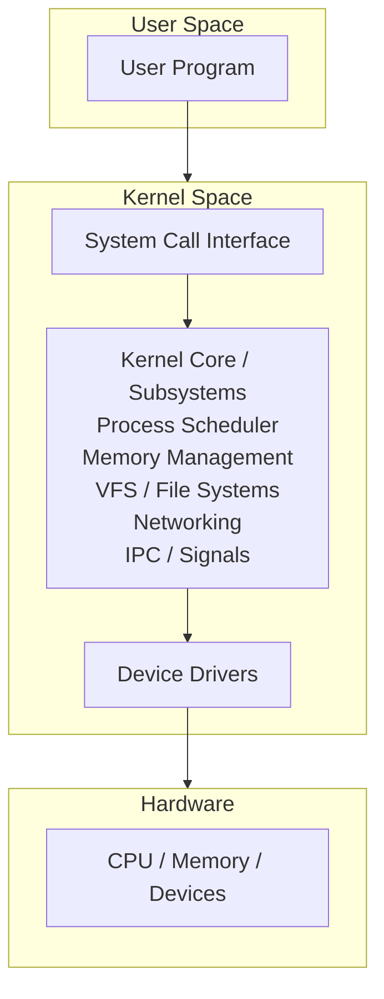
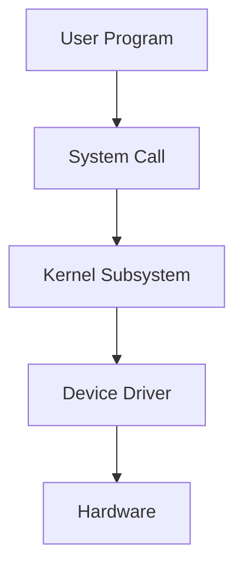
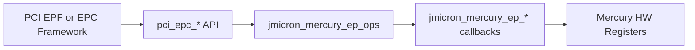

# Linux Kernel Study

<div style="background:#eaf4ff; border-left: 4px solid #5aa9e6; padding: 10px 14px; border-radius: 6px;">
這份筆記用來建立 Linux kernel 的整體觀念，先從分層架構看懂核心在做什麼，再逐步深入到記憶體管理、行程排程、裝置驅動、檔案系統與網路子系統。
</div>

---

## 第一章：Linux kernel 概念上分做哪幾層？

Linux kernel 並不是完全嚴格、像教科書那樣切得很乾淨的分層系統，但在學習上，常會把它**概念性地**分成下面幾層：

1. **System Call Interface（系統呼叫介面層）**
2. **Kernel Core / Subsystems（核心功能層）**
3. **Device Driver Layer（裝置驅動層）**
4. **Hardware Layer（硬體層）**

可以先用一張簡化圖來理解：



---

### 1.1 System Call Interface

這一層是 **user space** 和 **kernel space** 之間的正式入口。

當應用程式要做下面這些事時：

- 開啟檔案
- 建立行程
- 傳送網路封包
- 配置記憶體
- 操作裝置

它不能直接碰硬體，而是透過 system call 進入 kernel，例如：

- `open()`
- `read()`
- `write()`
- `fork()`
- `execve()`
- `mmap()`

這層的重點是：

- 提供穩定的使用者介面
- 檢查參數是否合法
- 將請求導向對應的核心子系統

---

### 1.2 Kernel Core / Subsystems

這一層是 Linux kernel 的主體，也是最重要的邏輯中心。它包含多個子系統：

#### Process Scheduler（行程排程）

負責決定：

- 哪個 process 或 thread 先執行
- CPU 時間怎麼分配
- 何時進行 context switch

Linux 是多工系統，排程器就是讓多個工作能共享 CPU 的核心機制。

#### Memory Management（記憶體管理）

負責：

- 實體記憶體與虛擬記憶體管理
- 分頁（paging）
- 配置與回收記憶體
- slab/slub allocator
- page cache

它讓每個 process 看起來像有自己的記憶體空間，同時又能有效共享實體 RAM。

#### VFS and File Systems（虛擬檔案系統與檔案系統）

Linux 不只支援一種檔案系統，例如：

- `ext4`
- `xfs`
- `btrfs`
- `procfs`
- `sysfs`

VFS（Virtual File System）提供統一抽象，讓上層不需要在每次存取檔案時都知道底層是哪種檔案系統。

#### Networking（網路子系統）

負責：

- socket
- TCP/IP protocol stack
- routing
- packet forwarding
- network device interaction

像 `send()`、`recv()` 背後，都會進入這一層處理。

#### IPC / Signals / Synchronization

負責不同 process 或 thread 之間的協作，例如：

- pipe
- shared memory
- semaphore
- signal
- futex

這些機制是作業系統支援並行與協調的重要基礎。

---

### 1.3 Device Driver Layer

這一層負責把「核心的抽象操作」轉成「特定硬體看得懂的控制方式」。

例如：

- 網卡 driver
- UART driver
- I2C / SPI driver
- PCIe driver
- USB driver
- GPIO driver

driver 的角色像翻譯員：

- 往上，提供 kernel 可呼叫的標準介面
- 往下，操作暫存器、中斷、DMA、匯流排協定

因此，驅動程式通常會和下面幾件事強相關：

- register read/write
- interrupt handling
- DMA buffer management
- power management
- device probing and initialization

---

### 1.4 Hardware Layer

最底層就是真正的硬體，包括：

- CPU
- DRAM
- ROM / Flash
- 網卡
- 儲存裝置
- UART
- I2C / SPI 控制器
- PCIe / USB 裝置

kernel 本身不直接「憑空」完成工作，最終還是要透過 driver 去控制這些硬體資源。

---

## 1.5 初學者可以先怎麼記

先記住下面這個方向就很夠用了：

- **System call**：使用者進入核心的入口
- **Core subsystems**：核心真正處理事情的地方
- **Drivers**：把核心要求轉成硬體操作
- **Hardware**：真正被控制的裝置

一句話總結：

<div style="background:#e8f7e8; border-left: 4px solid #6bbf73; padding: 10px 14px; border-radius: 6px;">
Linux kernel 可以概念性看成「系統呼叫介面層 -> 核心子系統層 -> 驅動程式層 -> 硬體層」。
</div>

---

## 第二章：先看 Driver Layer 在做什麼

如果把 Linux kernel 想成一個分工系統，那 `Driver Layer` 就是把「核心抽象」接到「實際硬體」的那一層。

前一章提到：

- `System Call Interface` 是 user space 進入 kernel 的入口
- `Kernel Core / Subsystems` 是處理排程、記憶體、檔案系統、網路等主邏輯的地方
- `Device Driver Layer` 是把這些邏輯落到特定裝置上

如果用「我要怎麼把這顆硬體接進 Linux 既有架構」來看，可以先照下面這條主線理解：

### 2.1 把硬體接進 Linux 的主線

#### 2.1.1 先讓 Linux 知道「有這顆裝置」

可能來自：

- device tree
- PCIe enumeration
- USB 枚舉

也就是先有 `device`。

#### 2.1.2 再讓 Linux 知道「有這支 driver」

例如：

- `module_platform_driver(...)`
- `pci_register_driver(...)`

這類就是把 `driver` 註冊進 kernel。

#### 2.1.3 讓 kernel 去做 device 和 driver 的配對

可能是：

- 名字對上
- `compatible` 對上
- Vendor ID / Device ID 對上

配對成功才會進 `probe()`。

#### 2.1.4 在 `probe()` 裡把硬體資源接起來

例如：

- allocate private data
- map MMIO
- init memory / IRQ / DMA
- 保存 driver state

這一步是在做「讓這顆硬體能被 driver 控制」。

#### 2.1.5 把這顆硬體掛進對應的 subsystem / framework

例如：

- tty
- net
- I2C
- PCI EPC
- V4L2
- input

這一步是在做「讓 Linux 其他部分知道怎麼使用它」。

#### 2.1.6 之後由上層透過通用介面使用它

例如：

- `open/read/write/ioctl`
- `pci_epc_*`
- netdev ops
- file operations

上層不直接碰硬體，而是經過 framework 再到 driver。

所以 driver 並不是獨立存在的，它通常位在：



---

### 2.2 Driver Layer 的核心角色

driver 最重要的任務，可以先記成一句話：

<div style="background:#e8f7e8; border-left: 4px solid #6bbf73; padding: 10px 14px; border-radius: 6px;">
Driver 負責把 kernel 的通用介面，轉成某一顆硬體晶片真正需要的操作方式。
</div>

例如：

- VFS 想讀檔案，最後可能會叫到 storage driver
- network stack 想送封包，最後會叫到 NIC driver
- tty subsystem 想收送字元，最後會叫到 UART driver
- I2C core 想對周邊傳輸資料，最後會叫到 I2C controller driver

也就是說，很多 kernel subsystem 只定義「我要做什麼」，而 driver 負責實作「這顆硬體要怎麼做」。

---

### 2.3 Driver 不只是讀寫 register

初學時很容易把 driver 想成：

- 寫 register
- 讀 register
- 開中斷

這樣不算錯，但太窄了。實際上 driver 往往要處理更多事情：

- 裝置初始化
- 資源配置
- 中斷處理
- DMA 設定
- power management
- error handling
- suspend / resume
- 與 kernel framework 整合

所以 driver 更像是「硬體控制邏輯 + 與 kernel 生態系整合」的組合。

---

### 2.4 Driver 常見會做哪些事

以一般裝置驅動來說，常見工作包含下面幾類。

#### 2.4.1 裝置探測（probe）

kernel 在開機或裝置被偵測到時，會問：

- 這個裝置是誰？
- 有沒有對應的 driver？
- driver 能不能接手？

這時通常會進到 driver 的 `probe()`。

`probe()` 常見工作可能包含：

- 取得 device tree / ACPI / PCI config 提供的資源
- 映射 MMIO register
- 申請 IRQ
- 初始化硬體
- 建立 DMA buffer
- 向 kernel 子系統註冊功能

可以把它理解成「driver 上線時的建置流程」。

不過要注意，這裡是在講 `probe()` 常見會做的事情，不是說每支 driver 都一定會把這些步驟全部寫在同一個 `probe()` 裡。像目前這個 `jmicron_mercury_ep_probe()` 範例，重點比較放在 resource、EPC framework 與 memory window 初始化，並沒有直接出現 `request_irq()` 這類 IRQ 申請程式碼。

下面用 `jmicron_mercury_ep_probe()` 這種 `platform driver probe()` 的寫法來拆解。

#### 2.4.1.1 配置 driver 私有資料

```c
ep = devm_kzalloc(dev, sizeof(*ep), GFP_KERNEL);
```

這裡先配置 `struct jmicron_mercury_ep`，用來保存這個 driver 執行期間需要的狀態，例如：

- `ep` 是 `struct jmicron_mercury_ep *ep`，也就是這支 driver 的 private data 指標
- 可以把它理解成「這顆 JMicron Mercury endpoint 裝置在 kernel 裡的執行期狀態包」
- `regs`
- `epc`
- `msi_cpu_addr`
- `msi_phys_addr`
- function 資訊
- `started`
- 後續初始化建立的其他資源

如果直接對照結構本身來看：

```c
struct jmicron_mercury_ep {
	struct pci_epc *epc;
	void __iomem *regs;
	void __iomem *msi_cpu_addr;
	phys_addr_t msi_phys_addr;
	struct jmicron_mercury_ep_func func[JMICRON_MERCURY_EP_NUM_PFS];
	bool started;
};
```

這些欄位大致代表：

- `epc`：這個 driver 建立出來的 PCI endpoint controller 物件
- `regs`：mapped 後的 MMIO register base，之後存取硬體 register 會靠它
- `msi_cpu_addr` / `msi_phys_addr`：和 MSI 寫入位置有關的位址資訊
- `func[]`：每個 PCI function 的設定與狀態資料
- `started`：這個 endpoint controller 目前是否已進入啟動狀態

所以 `ep` 不是單純為了暫存某一個值，而是把這個 driver 後面會反覆用到的執行期狀態集中管理起來。後面你看到：

- `ep->regs`
- `ep->epc`
- `ep->func[...]`

本質上都是在操作「這個裝置實例自己的狀態」。

`devm_kzalloc()` 的好處是這塊記憶體會綁在 `dev` 的生命週期上，之後移除裝置時可由 managed resource 機制協助回收。

#### 2.4.1.2 取得並映射 MMIO 資源

```c
res = platform_get_resource(pdev, IORESOURCE_MEM, 0);
ep->regs = devm_ioremap_resource(dev, res);
```

這段在做兩件事：

- 從 `platform_device` 取出第 0 個 `IORESOURCE_MEM`
- 把這段實體位址映射成 kernel 可以存取的 MMIO 虛擬位址

成功後，driver 就能透過 `ep->regs` 去讀寫硬體 register。

這裡的 **MMIO 虛擬位址** 可以先這樣理解：

- 硬體 register 原本在某段實體位址空間裡
- CPU 不能直接把那段位址當一般 C 指標隨便存取
- kernel 會先用 `ioremap` 類機制，把那段硬體位址映射成 kernel address space 裡可用的位址
- 映射後拿到的那個位址，就是這裡說的 MMIO 虛擬位址

所以 `ep->regs` 雖然看起來像指標，但它不是一般 RAM buffer 的指標，而是「對應到硬體 register 空間」的位址。後面 driver 透過：

- `readl(ep->regs + offset)`
- `writel(value, ep->regs + offset)`

這類操作，其實不是在讀寫普通記憶體，而是在讀寫裝置的 memory-mapped I/O register。


#### 2.4.1.3 建立 PCI endpoint controller

```c
epc = devm_pci_epc_create(dev, &jmicron_mercury_ep_ops);
```

這一步不是單純碰 register，而是把 driver 掛進 `PCI EPC framework`。

也就是說，這個 driver 的角色不是一般 PCI device driver，而是：

- 實作一個 PCIe endpoint controller
- 對 kernel 的 PCI endpoint framework 提供操作集合 `jmicron_mercury_ep_ops`

這個 `jmicron_mercury_ep_ops` 可以把它想成一張「driver 提供給 framework 的能力表」：

```c
static const struct pci_epc_ops jmicron_mercury_ep_ops = {
	.write_header = jmicron_mercury_ep_write_header,
	.set_bar = jmicron_mercury_ep_set_bar,
	.clear_bar = jmicron_mercury_ep_clear_bar,
	.set_msi = jmicron_mercury_ep_set_msi,
	.get_msi = jmicron_mercury_ep_get_msi,
	.set_msix = jmicron_mercury_ep_set_msix,
	.get_msix = jmicron_mercury_ep_get_msix,
	.raise_irq = jmicron_mercury_ep_raise_irq,
	.start = jmicron_mercury_ep_start,
	.stop = jmicron_mercury_ep_stop,
	.get_features = jmicron_mercury_ep_get_features,
};
```

意思是：

- framework 不直接知道這顆硬體怎麼設 BAR
- framework 也不知道這顆硬體怎麼送 MSI / MSI-X
- framework 只知道「如果要做這件事，就呼叫 ops 裡對應的 callback」

例如：

- 要寫 PCI config header，就走 `write_header`
- 要配置 BAR，就走 `set_bar`
- 要觸發 interrupt，就走 `raise_irq`
- 要啟動 endpoint controller，就走 `start`

所以這種 `ops` 結構，本質上就是一個 callback table。

可以把呼叫方向想成：



上層真的要用時，概念上會像這樣：

1. 某個 PCI endpoint function driver 或 EPC framework 想設定 BAR
2. 它呼叫 `pci_epc_set_bar(epc, func_no, epf_bar)`
3. EPC core 看到這個 `epc` 是由 `jmicron_mercury_ep_ops` 提供實作
4. 於是轉呼叫 `jmicron_mercury_ep_set_bar(...)`
5. 你的 driver 再去寫 Mercury 硬體對應的 register

同樣地，如果上層要發 MSI，中間路徑也會是：

- 上層呼叫 `pci_epc_raise_irq(...)`
- EPC core 轉到 `jmicron_mercury_ep_raise_irq(...)`
- driver 再把 MSI / MSI-X 的硬體動作做掉

所以在看 `jmicron_mercury_ep_ops` 時，最重要的理解不是背欄位名稱，而是知道：

- 上層呼叫的是通用 API
- framework 透過 `ops` 做 dispatch
- 最後真正碰硬體的是你這支 driver 的 callback

這很能說明前面提到的重點：

<div style="background:#e8f7e8; border-left: 4px solid #6bbf73; padding: 10px 14px; border-radius: 6px;">
Linux driver 常常不是自己全包，而是要正確接上既有 subsystem 或 framework。
</div>

#### 2.4.1.4 初始化 function 與 driver data

```c
ep->epc = epc;
for (func_no = 0; func_no < JMICRON_MERCURY_EP_NUM_PFS; func_no++) {
	ep->func[func_no].header.vendorid =
		JMICRON_MERCURY_EP_PCIE_VENDOR_ID;
	ep->func[func_no].header.subsys_vendor_id =
		JMICRON_MERCURY_EP_PCIE_VENDOR_ID;
}
epc->max_functions = JMICRON_MERCURY_EP_NUM_PFS;
epc_set_drvdata(epc, ep);
platform_set_drvdata(pdev, ep);
```

這段是在把 driver 的內部狀態和 framework 綁起來：

- `ep->epc = epc`：保存建立好的 controller
- 設定每個 function 的 PCI header 資訊
- `epc->max_functions`：告訴 framework 這個 controller 支援幾個 function
- `epc_set_drvdata()` / `platform_set_drvdata()`：把 private data 掛回 framework 物件

這樣未來其他 callback 或 lifecycle 階段，就能再把 `ep` 取回來使用。

#### 2.4.1.5 初始化 controller 記憶體並通知 ready

```c
ret = jmicron_mercury_ep_init_epc_mem(pdev, ep);
if (ret)
	return ret;

pci_epc_init_notify(epc);
```

這裡先做這個 controller 所需的 EPC memory 初始化；成功後再呼叫 `pci_epc_init_notify(epc)`，通知 PCI endpoint framework：

- 這個 controller 已完成基本初始化
- 可以進入後續運作階段

這塊記憶體拿到後，主要不是當一般 buffer 用，而是當成 endpoint 往 host 方向送資料的 outbound window，特別是 MSI 很常會用到。簡單說：

- `ep->msi_cpu_addr`：driver 這邊可操作的位址
- `ep->msi_phys_addr`：對應的實體位址，提供給硬體或 framework 使用

之後如果上層要觸發 MSI，driver 就可以利用這塊 outbound window 去完成對 host 的寫入。

上層通常不會直接在意這塊記憶體本身，而是只透過通用 API 表達「我要設定 MSI」或「我要觸發 IRQ」。至於實際是否用到 `ep->msi_cpu_addr` / `ep->msi_phys_addr`，以及怎麼用，都是 `jmicron_mercury_ep_set_msi()`、`jmicron_mercury_ep_raise_irq()` 這些 driver callback 內部要處理的事。

最後用 `dev_info()` 留下一筆註冊成功訊息，並回傳 `0` 表示 `probe()` 成功。

#### 2.4.2 移除裝置（remove）

當 driver 被卸載，或裝置被移除時，會做資源釋放，例如：

- 解除 IRQ
- 釋放 buffer
- 關閉硬體
- unregister 對外介面

這通常出現在 `remove()`。

#### 2.4.3 中斷處理（interrupt handling）

很多硬體不是一直被 polling，而是事件發生時主動通知 CPU。

例如：

- 封包收到了
- DMA 傳輸完成了
- UART 收到資料了
- 錯誤狀態發生了

driver 收到 interrupt 後，通常要：

- 讀 status register 確認原因
- 清除中斷狀態
- 搬資料或排 deferred work
- 喚醒等待中的上層流程

#### 2.4.4 資料傳輸

driver 通常要負責實際資料搬運路徑，例如：

- PIO
- DMA
- ring buffer
- descriptor queue

這在網卡、儲存、USB、PCIe 類裝置特別常見。

#### 2.4.5 對外提供操作介面

driver 不只是碰硬體，還要讓其他 kernel 元件或 user space 能使用它。

常見方式包含：

- file operations
- net_device operations
- tty operations
- sysfs attributes
- ioctl
- ethtool hooks

也就是說，driver 一邊向下控制硬體，一邊向上提供可用介面。

---

### 2.5 Driver 和 Kernel Subsystem 的關係

很多新手會以為 driver 是各寫各的，但 Linux kernel 其實很重視「先進入 framework，再掛接 driver」。

例如：

- block driver 會接到 block layer
- network driver 會接到 networking stack
- USB driver 會接到 USB core
- PCIe driver 會接到 PCI subsystem
- I2C device driver 會接到 I2C core

這樣做的好處是：

- kernel 提供共用抽象
- 多種硬體可以共用一致介面
- driver 作者不必每次都從零開始
- 上層不需要知道每顆晶片細節

所以 Linux driver 的重點常常不是「自己全包」，而是「正確掛進既有 framework」。

---

### 2.6 Platform Driver、PCI Driver、USB Driver 有什麼差別

driver 會依照裝置是怎麼被發現的，分成不同型態。最常見可以先看三種：

#### Platform driver

常見於 SoC 內建周邊，例如：

- GPIO controller
- UART controller
- I2C controller
- SPI controller

這類裝置通常不是插拔式裝置，而是晶片上本來就有，資訊多半來自：

- device tree
- ACPI

如果你看到：

```c
module_platform_driver(jmicron_mercury_ep_driver);
```

這表示這個 module 會在載入時自動把 `jmicron_mercury_ep_driver` 註冊成 platform driver；module 卸載時則自動解除註冊。

可以把它理解成：

- 先把 driver 掛進 platform bus
- 等 kernel match 到對應的 platform device
- 然後才呼叫這支 driver 的 `probe()`

所以 `module_platform_driver(...)` 負責的是「註冊 driver」，而 `probe()` 負責的是「真的接手裝置後開始初始化」。

#### PCI driver

給 PCI / PCIe 裝置使用。kernel 會透過 enumeration 找到裝置，再依照：

- Vendor ID
- Device ID
- Class Code

去匹配對應 driver。

這類 driver 常碰到：

- BAR mapping
- MSI / MSI-X
- DMA
- config space

#### USB driver

給 USB 裝置使用。USB core 偵測到裝置後，會依照：

- device descriptor
- interface descriptor
- class / subclass / protocol

去匹配 driver。

這類 driver 常碰到：

- endpoint
- URB
- control / bulk / interrupt transfer

---

### 2.7 Driver 和 Module 的關係

這一節最容易混淆的地方是：`driver` 和 `module` 不是同一件事。

- `driver`：功能角色，也就是「負責控制某類硬體的程式」
- `module`：載入形式，也就是「這段程式如何被放進 kernel」

所以一個 driver 可以有兩種存在方式：

- `built-in`：直接編進 kernel 本體
- `module`：編成可動態載入的檔案

如果是 `module`，常見檔名就會是 `xxx.ko`。

#### `.ko` 是什麼

`.ko` 是 **kernel object**，也就是 Linux kernel module 的檔案形式。

看到：

- `foo.ko`
- `usbnet.ko`
- `spi-nor.ko`

通常就表示這是一個可以在系統跑起來之後，再由 kernel 載入的 module。

`.ko` 不是隨便用 `gcc` 直接編出來的，它通常是透過 Linux kernel 自己的 build system，也就是 `kbuild`，根據 `Makefile` / `Kconfig` 規則編譯出來。簡單說，就是先有 `.o`，再由 kernel 的 module build 流程產生 `.ko`。

#### `built-in` 和 `module` 怎麼理解

初學時可以先這樣記：

- `built-in`：像內建功能，kernel 一開機就已經有
- `module`：像外掛，需要時再載入

如果某個 driver 是 `module`，通常會用像下面這種方式載入：

- `modprobe xxx`
- `insmod xxx.ko`

#### 什麼情況比較適合 built-in

如果某個 driver 是開機流程早期就會依賴的，通常比較適合做成 `built-in`。例如：

- 開機要用到的儲存控制器
- root filesystem 依賴的 driver
- 很早期就要工作的 SoC 基礎驅動

反過來說，如果不是開機早期必需，而是系統跑起來後再載入也來得及，就可以做成 `module`。

一句話總結：

<div style="background:#e8f7e8; border-left: 4px solid #6bbf73; padding: 10px 14px; border-radius: 6px;">
driver 是「做什麼」，module 是「怎麼載入」；很多 driver 會做成 `.ko` module，但也可以直接 built-in 到 kernel 裡。
</div>

---

### 2.8 用一個具體例子來看

假設今天是 `PCIe UART` 裝置，大致流程可以這樣想：

1. PCI subsystem 在 enumeration 時發現裝置
2. kernel 根據 Vendor ID / Device ID 找到對應 driver
3. driver 的 `probe()` 被呼叫
4. driver 映射 BAR、設定 IRQ、初始化 UART 硬體
5. driver 把自己註冊進 tty subsystem
6. user space 開啟像 `/dev/ttySx` 這樣的節點
7. `read()` / `write()` 經過 system call 進入 tty 層
8. tty 層再呼叫 UART driver 的對應操作
9. driver 最後控制硬體收送資料

這個例子很能說明：

- user space 很少直接面對硬體
- kernel subsystem 提供中介抽象
- driver 才是最後真的操作裝置的那一層

---

### 2.9 初學 driver 時最值得先建立的觀念

先把下面幾件事記熟，後面學 driver 會順很多：

- driver 的責任不只是操作 register，還包含整合 kernel framework
- driver 通常有生命週期，例如 `probe -> operate -> remove`
- driver 常和 interrupt、DMA、buffer、power state 有關
- 同一類裝置通常不會直接裸寫，而是接到對應 subsystem
- 看懂 bus 是什麼很重要，例如 platform、PCIe、USB、I2C、SPI

一句話總結：

<div style="background:#e8f7e8; border-left: 4px solid #6bbf73; padding: 10px 14px; border-radius: 6px;">
Driver Layer 是 Linux kernel 裡最貼近硬體、但又必須同時理解 kernel 架構的一層。
</div>

---

## 第三章：Driver 常用除錯與 register field 操作

<div style="background:#fff4e8; border-left: 4px solid #f0a35e; padding: 10px 14px; border-radius: 6px;">
這一章整理兩個實作時很常碰到的小工具：一個是 driver debug 訊息怎麼印，另一個是 register field 怎麼寫得清楚又不容易錯。
</div>

### 3.1 Driver 怎麼印 debug 訊息

寫 driver 時，最常見的 debug 手段之一就是印 log。

初學先記這幾個最常用的就夠了：

- `printk()`
- `pr_info()`
- `pr_err()`
- `dev_info()`
- `dev_err()`
- `dev_dbg()`

#### `printk()`

這是最底層、最通用的 kernel log function，概念上很像 kernel world 的 `printf()`。

```c
printk(KERN_INFO "Mercury EP started\n");
```

不過在 driver 裡，現在通常更常用 `pr_*()` 或 `dev_*()` 這類包好的介面。

#### `pr_*()` 系列

這是一組比較方便的全域 log 巨集，例如：

- `pr_info()`
- `pr_warn()`
- `pr_err()`
- `pr_debug()`

```c
pr_err("failed to init Mercury EP\n");
```

這類寫法適合沒有特定 `struct device *dev` 可以掛訊息的情況。

#### `dev_*()` 系列

如果你手上有 `struct device *dev`，通常更推薦用：

- `dev_info(dev, ...)`
- `dev_warn(dev, ...)`
- `dev_err(dev, ...)`
- `dev_dbg(dev, ...)`

```c
dev_info(dev, "registered JMicron Mercury EP controller\n");
dev_err(dev, "failed to map registers\n");
dev_dbg(dev, "MSI phys addr = %pa\n", &ep->msi_phys_addr);
```

這類好處是 log 會自帶裝置脈絡，之後看訊息時比較容易知道是哪一個 device 印的。

#### 初學先怎麼選

可以先這樣記：

- 想快速印 kernel 訊息：`pr_info()` / `pr_err()`
- 在 driver 裡而且手上有 `dev`：優先用 `dev_info()` / `dev_err()`
- 想放比較多除錯訊息：用 `dev_dbg()`

<div style="background:#e8f7e8; border-left: 4px solid #6bbf73; padding: 10px 14px; border-radius: 6px;">
driver debug 最常用的是 `pr_*()` 和 `dev_*()`；如果手上有 `struct device *dev`，通常優先用 `dev_info()`、`dev_err()`、`dev_dbg()`。
</div>

---

### 3.2 register field 操作推薦用哪些

driver 很常需要讀寫 register，但實務上真正容易出錯的，常常不是整顆 register，而是其中某一個 bit 或某一段 field。

#### 單一 bit：`BIT(n)`

單一開關位元，通常用 `BIT(n)`：

```c
#define CTRL_ENABLE   BIT(0)
#define CTRL_INT_EN   BIT(3)
```

#### 連續 field：`GENMASK(h, l)`

一段連續 bit 代表模式、大小、狀態碼時，通常用 `GENMASK(high, low)`：

```c
#define CTRL_MODE_MASK   GENMASK(3, 1)
#define CTRL_SPEED_MASK  GENMASK(7, 4)
```

#### 寫入 field：`FIELD_PREP(mask, val)`

`FIELD_PREP()` 是把值準備成可以放進指定 field 的格式；它本身不會寫 register。

```c
val &= ~CTRL_MODE_MASK;
val |= FIELD_PREP(CTRL_MODE_MASK, mode);
```

#### 讀出 field：`FIELD_GET(mask, reg)`

```c
u32 mode = FIELD_GET(CTRL_MODE_MASK, val);
```

#### 如果你自己比較習慣 `SET_FIELD()`

如果你自己寫筆記或專案 helper，覺得每次手寫 `& ~mask` 和 `| FIELD_PREP(...)` 很煩，也可以自己包一層。

<div style="background:#ffe3ee; border-left: 4px solid #e26d93; padding: 10px 14px; border-radius: 6px;">
`SET_FIELD()` 不是 Linux kernel 內建標準巨集。它是你自己額外加的 helper；看別人的 kernel code 時，還是更常看到原生的 `FIELD_PREP()` 寫法。
</div>

```c
#define SET_FIELD(reg, mask, val) \
	(((reg) & ~(mask)) | FIELD_PREP((mask), (val)))
```

```c
reg = SET_FIELD(reg, CTRL_MODE_MASK, mode);
```

如果你希望讀取時也維持同樣語意，可以再自己包：

```c
#define GET_FIELD(reg, mask) \
	FIELD_GET((mask), (reg))
```

#### 一個常見、可讀性高的寫法

```c
#define REG_CTRL         0x00
#define CTRL_ENABLE      BIT(0)
#define CTRL_MODE_MASK   GENMASK(3, 1)

u32 val;

val = readl(base + REG_CTRL);
val |= CTRL_ENABLE;
val = SET_FIELD(val, CTRL_MODE_MASK, mode);
writel(val, base + REG_CTRL);
```

#### 不太推薦的寫法

- 直接寫 `0x40`、`0x8000` 這種 magic number
- 到處手寫 `(val >> 4) & 0x7` 卻沒有命名 field
- 寫 register 時整顆覆蓋，卻沒有先保留其他 bit

<div style="background:#e8f7e8; border-left: 4px solid #6bbf73; padding: 10px 14px; border-radius: 6px;">
如果是 Linux driver 裡的 register field 操作，最推薦先認得 `BIT()`、`GENMASK()`、`FIELD_PREP()`、`FIELD_GET()`；如果你想讓自己寫的 code 更順手，再額外包 `SET_FIELD()`。
</div>
