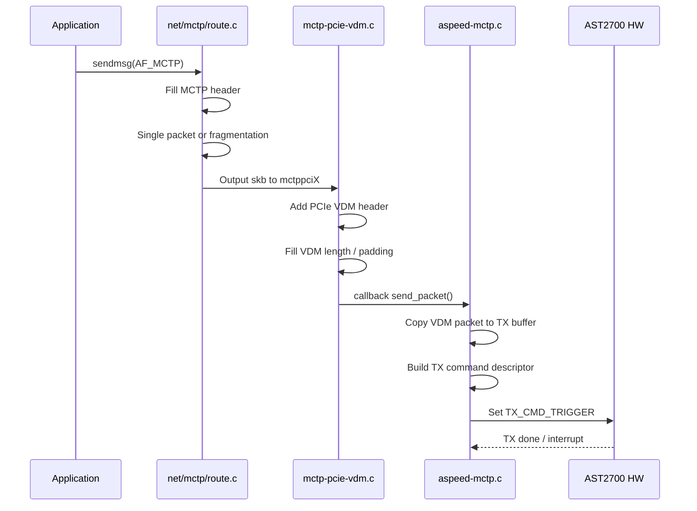
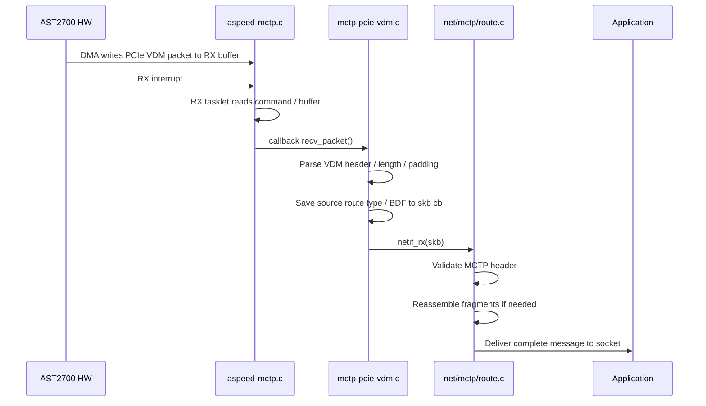

# AST2700 MCTP TX/RX Code Flow

## Scope

本文件只整理 AST2700 上 **kernel socket-MCTP / PCIe VDM netdev** 路徑：


重點結論：

- **MCTP message layer**：`net/mctp/route.c`
  - MCTP header
  - `SOM` / `EOM` / `seq`
  - TX fragmentation
  - RX reassembly
- **PCIe VDM transport layer**：`drivers/net/mctp/mctp-pcie-vdm.c`
  - PCIe VDM header
  - route type / Target BDF / Requester BDF
  - VDM length / padding
- **AST2700 HW control layer**：`drivers/soc/aspeed/aspeed-mctp.c`
  - DMA buffer
  - TX/RX command ring
  - register trigger / status
  - interrupt

> AST2700 HW 負責 PCIe VDM packet transport / DMA，不負責 MCTP message fragmentation 或 reassembly。

## HW Init / Register Setup

File: `drivers/soc/aspeed/aspeed-mctp.c`

Functions / 函式：`aspeed_mctp_channels_init()`, `aspeed_mctp_tx_chan_init()`, `aspeed_mctp_rx_chan_init()`, `aspeed_mctp_rx_trigger()`

```c
static void aspeed_mctp_channels_init(struct aspeed_mctp *priv)
{
	aspeed_mctp_rx_chan_init(&priv->rx);
	aspeed_mctp_tx_chan_init(&priv->tx);
}
```

TX command buffer base address 設定：

```c
regmap_write(priv->map, ASPEED_MCTP_TX_BUF_ADDR, tx->cmd.dma_handle);
if (priv->match_data->dma_need_64bits_width)
	regmap_write(priv->map, ASPEED_MCTP_TX_BUF_HI_ADDR,
		     upper_32_bits(tx->cmd.dma_handle));
```

RX command / buffer setup（注意：以下兩段分屬不同函式，這裡為了說明合併呈現）：

```c
/* --- 在 aspeed_mctp_rx_chan_init() 內 --- */
#define RX_PACKET_COUNT		96

/* 預設 priv->rx_packet_count = RX_PACKET_COUNT */
u32 hw_rx_count = priv->rx_packet_count;

/* AST2700 使用 64-bit DMA，所以 rx_runaway_wa.enable = false */
regmap_write(priv->map, ASPEED_MCTP_RX_BUF_SIZE, hw_rx_count);

/* --- 在 aspeed_mctp_rx_trigger() 內 */
regmap_write(priv->map, ASPEED_MCTP_RX_BUF_ADDR,
	     rx->cmd.dma_handle);
if (priv->match_data->dma_need_64bits_width)
	regmap_write(priv->map, ASPEED_MCTP_RX_BUF_HI_ADDR,
		     upper_32_bits(rx->cmd.dma_handle));
regmap_write(priv->map, ASPEED_MCTP_RX_BUF_WR_PTR, 0);
```

說明：

- `ASPEED_MCTP_RX_BUF_SIZE` 由 `aspeed_mctp_rx_chan_init()` 設定。
- `ASPEED_MCTP_RX_BUF_ADDR` / `RX_BUF_HI_ADDR` / `RX_BUF_WR_PTR = 0` 由 `aspeed_mctp_rx_trigger()` 設定，不是 `rx_chan_init()`。

- `ASPEED_MCTP_TX_BUF_ADDR`: `MCTP04`
- `ASPEED_MCTP_TX_BUF_HI_ADDR`: `MCTP30`
- `ASPEED_MCTP_RX_BUF_ADDR`: `MCTP08`
- `ASPEED_MCTP_RX_BUF_HI_ADDR`: `MCTP20`
- `ASPEED_MCTP_RX_BUF_SIZE`: `0x024`
- `hw_rx_count` 預設 `96`，代表可接收 `96` 筆 PCIe VDM，可透過 device tree `aspeed,rx-packet-count` 修改。


## TX Code Flow



### TX Step 1: Linux MCTP core builds MCTP header

File: `net/mctp/route.c`

Function: `mctp_local_output()`

```c
hdr = mctp_hdr(skb);
hdr->ver = 1;
hdr->dest = daddr;
hdr->src = saddr;

if (skb->len + sizeof(struct mctp_hdr) <= mtu) {
	hdr->flags_seq_tag = MCTP_HDR_FLAG_SOM |
		MCTP_HDR_FLAG_EOM | tag;
	/* dst 代表已查找到的 MCTP route。 */
	rc = dst->output(dst, skb);
} else {
	rc = mctp_do_fragment_route(dst, skb, mtu, tag);
}
```

說明：

- `hdr->ver / dest / src` 是 MCTP transport header。
- message 未超過 MTU 時，直接設定 `SOM | EOM | tag`。
- message 超過 MTU 時，進入 `mctp_do_fragment_route()` 做 software fragmentation。

### TX Step 2: Fragment path sets SOM / EOM / seq

File: `net/mctp/route.c`

Function: `mctp_do_fragment_route()`

```c
hdr2 = mctp_hdr(skb2);
hdr2->ver = hdr->ver;
hdr2->dest = hdr->dest;
hdr2->src = hdr->src;
hdr2->flags_seq_tag = tag &
	(MCTP_HDR_TAG_MASK | MCTP_HDR_FLAG_TO);

if (pos == 0)
	hdr2->flags_seq_tag |= MCTP_HDR_FLAG_SOM;

if (pos + size == skb->len)
	hdr2->flags_seq_tag |= MCTP_HDR_FLAG_EOM;

hdr2->flags_seq_tag |= seq << MCTP_HDR_SEQ_SHIFT;
```

說明：

- 第一個 fragment 設定 `SOM`。
- 最後一個 fragment 設定 `EOM`。
- 每個 fragment 設定 `seq`。
- 這些欄位由 Linux MCTP core 設定，不是 AST2700 HW 設定。

### TX Step 3: PCIe VDM driver creates PCIe Medium-Specific Header

File: `drivers/net/mctp/mctp-pcie-vdm.c`

Function: `mctp_pcie_vdm_hdr_create()`

```c
struct mctp_pcie_vdm_hdr *hdr =
	(struct mctp_pcie_vdm_hdr *)skb_push(skb, sizeof(*hdr));

memcpy(hdr, &mctp_pcie_vdm_hdr_template, sizeof(*hdr));
if (daddr) {
	memcpy(dest_addr, (u8 *)daddr, sizeof(dest_addr));
	hdr->route_type |= dest_addr[0] & GENMASK(2, 0);
	hdr->pci_target_id = dest_addr[1] << 8 | dest_addr[2];
}

if (saddr)
	hdr->pci_req_id = *(u16 *)saddr;
```

說明：

- PCIe VDM header 在 `mctp-pcie-vdm.c` 建立。
- `daddr` 提供 route type 與 target BDF。
- `saddr` 提供 requester BDF。

### TX Step 4: PCIe VDM driver fills length / padding and sends to ASPEED driver

File: `drivers/net/mctp/mctp-pcie-vdm.c`

Function: `mctp_pcie_vdm_xmit()`

```c
payload_len_dw = (ALIGN(skb->len, sizeof(u32)) -
		  MCTP_PCIE_VDM_HDR_SIZE) / sizeof(u32);
payload_len_byte = skb->len - MCTP_PCIE_VDM_HDR_SIZE;

hdr->length = payload_len_dw;
hdr->tag_pad_len =
	ALIGN(payload_len_byte, sizeof(u32)) - payload_len_byte;

MCTP_PCIE_SWAP_NET_ENDIAN((u32 *)hdr,
			  sizeof(struct mctp_pcie_vdm_hdr) / sizeof(u32));

rc = vdm_dev->callback_ops->send_packet(vdm_dev->dev, skb->data,
					payload_len_dw * sizeof(u32));
```

說明：

- VDM packet length、padding、endian conversion 由 `mctp-pcie-vdm.c` 處理。
- 完成後透過 `send_packet()` callback 交給 `aspeed-mctp.c`。

### TX Step 5: ASPEED driver copies full VDM packet into TX path

File: `drivers/soc/aspeed/aspeed-mctp.c`

Function: `aspeed_mctp_pcie_vdm_op_send_pkt()`

```c
memcpy((u8 *)&packet->data.hdr, data, PCIE_VDM_HDR_SIZE);
memcpy((u8 *)&packet->data.payload, data + PCIE_VDM_HDR_SIZE, size);
packet->size = (size + PCIE_VDM_HDR_SIZE);

rc = aspeed_mctp_send_packet(priv->default_client, packet);
```

說明：

- `aspeed-mctp.c` 收到的是已包含 PCIe VDM header 的 packet。
- 這裡只把 packet 放進 ASPEED MCTP TX queue。
- 沒有建立 MCTP header，也沒有做 MCTP fragmentation。

### TX Step 6: AST2700 TX descriptor uses DMA address and packet size

File: `drivers/soc/aspeed/aspeed-mctp.c`

Function: `aspeed_mctp_emit_tx_cmd()`

```c
aspeed_mctp_swap_pcie_vdm_hdr(&packet->data);

if (priv->match_data->vdm_hdr_direct_xfer) {
	offset = tx->wr_ptr * sizeof(packet->data);
	memcpy((u8 *)tx->data.vaddr + offset, &packet->data,
	       sizeof(packet->data));

	tx_cmd_g7->tx_lo = TX_PACKET_SIZE(packet_sz_dw);
	tx_cmd_g7->tx_mid = TX_RESERVED_1;
	tx_cmd_g7->tx_mid |= ((tx->data.dma_handle + offset) &
			      GENMASK(31, 4));
	tx_cmd_g7->tx_hi = upper_32_bits((tx->data.dma_handle + offset));
}
```

說明：

- AST2700 TX command 主要描述 packet size 與 DMA address。
- `vdm_hdr_direct_xfer = true` 表示 AST2700 path 傳完整 VDM packet。
- 這是 packet transport / DMA 層級，不是 message layer。

### TX Step 7: Driver programs TX command count and triggers HW TX

File: `drivers/soc/aspeed/aspeed-mctp.c`

Function: `aspeed_mctp_tx_trigger()`

```c
if (priv->match_data->fifo_auto_surround)
	regmap_write(priv->map, ASPEED_MCTP_TX_BUF_WR_PTR, tx->wr_ptr);

regmap_update_bits(priv->map, ASPEED_MCTP_CTRL, TX_CMD_TRIGGER,
		   TX_CMD_TRIGGER);
ret = regmap_read_poll_timeout_atomic(priv->map, ASPEED_MCTP_CTRL,
				      ctrl_val,
				      !(ctrl_val & TX_CMD_TRIGGER), 0,
				      1000000);
```

說明：


- Driver 準備好 TX descriptor 後設定 `MCTP00[0] / TX_CMD_TRIGGER`。
- HW 依 TX command / DMA address 送出 packet。
- `ASPEED_MCTP_TX_BUF_WR_PTR`: `MCTP3C`

### TX Datasheet Mapping

Datasheet `37.5.1 Send Packet`：

```text
1. Set proper address to MCTP04 or MCTP30.
2. Prepare command to address set to MCTP04 or MCTP30 one by one.
   - Prepare PCIe Medium-Specific Header to Data Address.
   - Prepare following MCTP Transport Header.
   - Prepare following MCTP Packet Payload.
3. Program MCTP3C for the number of TX commands filled in previous step.
4. Set MCTP00[0] to 1 to trigger TX.
5. Waiting transaction complete.
```

對應關係：

| Datasheet | Code layer | 說明 |
| --- | --- | --- |
| `MCTP04 / MCTP30` | `ASPEED_MCTP_TX_BUF_ADDR / ASPEED_MCTP_TX_BUF_HI_ADDR` | TX channel init 設定 command buffer DMA address |
| `MCTP3C` | `ASPEED_MCTP_TX_BUF_WR_PTR` | TX command count / write pointer |
| PCIe Medium-Specific Header | `mctp-pcie-vdm.c` | 建立 PCIe VDM header |
| MCTP Transport Header | `net/mctp/route.c` | 建立 MCTP header |
| MCTP Packet Payload | `net/mctp/route.c` | message payload / fragment payload |
| TX command / address | `aspeed-mctp.c` | DMA address、packet size |
| `MCTP00[0]` | `TX_CMD_TRIGGER` | 觸發 HW TX |

## RX Code Flow



### RX Step 1: HW triggers RX interrupt and driver schedules RX tasklet

File: `drivers/soc/aspeed/aspeed-mctp.c`

Function: `aspeed_mctp_irq_handler()`

```c
regmap_read(priv->map, ASPEED_MCTP_INT_STS, &status);
regmap_write(priv->map, ASPEED_MCTP_INT_STS, status);

if (status & RX_CMD_RECEIVE_INT) {
	tasklet_hi_schedule(&priv->rx.tasklet);
	handled |= RX_CMD_RECEIVE_INT;
}

if (status & RX_CMD_NO_MORE_INT) {
	priv->rx.stopped = true;
	tasklet_hi_schedule(&priv->rx.tasklet);
	handled |= RX_CMD_NO_MORE_INT;
}
```

說明：

- HW 收到 PCIe VDM packet 後寫入 RX buffer，並觸發 RX interrupt。
- `RX_CMD_RECEIVE_INT`: HW 已寫入 RX packet，通知 driver 取資料。
- `RX_CMD_NO_MORE_INT`: RX ring 沒有可用 command / buffer slot，driver 會標記 `rx.stopped`，先消耗 RX ring 後再重新 enable RX。

### RX Step 2: RX tasklet collects packet from ASPEED RX buffer

File: `drivers/soc/aspeed/aspeed-mctp.c`

Function: `aspeed_mctp_rx_tasklet()`

```c
regmap_write(priv->map, ASPEED_MCTP_RX_BUF_RD_PTR, UPDATE_RX_RD_PTR);

rx_full = rx->stopped;
rx_buf = (struct mctp_pcie_packet_data *)rx->data.vaddr;
hdr = (u32 *)&rx_buf[rx->wr_ptr];

while (*hdr != 0) {
	rx_packet = aspeed_mctp_packet_alloc(GFP_ATOMIC);
	memcpy(&rx_packet->data, hdr, sizeof(rx_packet->data));

	aspeed_mctp_swap_pcie_vdm_hdr(&rx_packet->data);
	aspeed_mctp_dispatch_packet(priv, rx_packet);

	*hdr = 0;
	rx->wr_ptr = (rx->wr_ptr + 1) % rx->buffer_count;
	hdr = (u32 *)&rx_buf[rx->wr_ptr];
}

regmap_read(priv->map, ASPEED_MCTP_RX_BUF_RD_PTR, &hw_read_ptr);
hw_read_ptr &= RX_BUF_RD_PTR_MASK;
regmap_write(priv->map, ASPEED_MCTP_RX_BUF_WR_PTR, hw_read_ptr);
```

說明：

- `hdr` 指向目前 `rx->wr_ptr` 對應的 RX buffer slot 開頭。
- `while (*hdr != 0)` 會處理目前 RX ring 裡已收到的 packet，直到遇到空 slot。
- `memcpy(&rx_packet->data, hdr, sizeof(rx_packet->data))` 是 RX 第一段 copy（Copy A）：把 HW DMA 寫進 ring slot（`rx->data.vaddr`）的資料，copy 到一個 `kmem_cache` 配置的 `rx_packet`。先 copy 出來的原因：copy 完立刻把 slot 清掉 (`*hdr = 0`) 還給 HW，`rx_packet` 有獨立生命週期、可丟進 `rx_queue` 排隊，不必卡住 DMA ring。
- 每個 `rx_packet->data` 包含 `16-byte PCIe VDM header` + MCTP data / payload。
- `aspeed_mctp_dispatch_packet()` 將 `rx_packet` 放進 client 的 `rx_queue`，並喚醒等待者。
- `ASPEED_MCTP_RX_BUF_RD_PTR`: `MCTP28`
- `ASPEED_MCTP_RX_BUF_WR_PTR`: `MCTP2C`
- `UPDATE_RX_RD_PTR` 設定 `MCTP28[31]`，要求 HW snapshot `MCTP28[11:0]`。
- `RX_BUF_RD_PTR_MASK` 只保留 read pointer 欄位。
- 最後寫回 `ASPEED_MCTP_RX_BUF_WR_PTR`，通知 HW RX buffer slot 已釋放。

### RX Step 3: PCIe VDM driver gets packet, parses VDM header, and builds skb

File: `drivers/net/mctp/mctp-pcie-vdm.c`

RX handler:

```c
packet = vdm_dev->callback_ops->recv_packet(vdm_dev->dev);

while (!IS_ERR(packet)) {
	MCTP_PCIE_SWAP_LITTLE_ENDIAN((u32 *)packet,
				     sizeof(struct mctp_pcie_vdm_hdr) / sizeof(u32));
	vdm_hdr = (struct mctp_pcie_vdm_hdr *)packet;

	len = vdm_hdr->length * sizeof(u32) -
		vdm_hdr->tag_pad_len;
	skb = netdev_alloc_skb(ndev, len);

	skb->protocol = htons(ETH_P_MCTP);
	skb_put_data(skb, &packet[sizeof(struct mctp_pcie_vdm_hdr)], len);
```

說明：

- `recv_packet()` callback 會呼叫 ASPEED driver 的 `aspeed_mctp_pcie_vdm_op_recv_pkt()`，從 `default_client->rx_queue` 取出 packet。
- `packet` 內容包含 `16-byte PCIe VDM header` + MCTP data / payload。
- `mctp-pcie-vdm.c` 解析 VDM header，計算 length / padding。
- `skb_put_data()` 從 `&packet[sizeof(struct mctp_pcie_vdm_hdr)]`（offset 12）開始複製到skb，所以**去掉前面 12-byte 的 PCIe VDM medium header**（TLP DW0：fmt/type/tc/attr/length、msg_code、tag/pad、requester BDF、vendor ID、target BDF），**保留 4-byte MCTP transport header（ver/dest/src/flags_seq_tag）+ payload** 到 skb。
- `skb` 是 Linux network stack 傳遞 packet 的 buffer，後面會交給 `netif_rx()`。

### RX Step 4: PCIe VDM driver stores source metadata and injects skb

File: `drivers/net/mctp/mctp-pcie-vdm.c`

RX handler:

```c
cb = __mctp_cb(skb);
cb->halen = 3; // route type | bdf address
cb->haddr[0] = vdm_hdr->route_type & GENMASK(2, 0);
cb->haddr[1] = vdm_hdr->pci_req_id >> 8;
cb->haddr[2] = vdm_hdr->pci_req_id & 0xFF;

net_status = netif_rx(skb);
```

說明：

- RX source route type / requester BDF 由 PCIe VDM header 解析出來。
- `cb->haddr[]` 記錄來源 PCIe route type / requester BDF，可作為回覆時的目的硬體位址。
- `netif_rx()` 將 skb 送進 Linux MCTP core。

### RX Step 5: Linux MCTP core performs fragment reassembly

File: `net/mctp/route.c`

Functions: `mctp_dst_input()`, `mctp_frag_queue()`


```c
/* grab header, advance data ptr */
mh = mctp_hdr(skb);
netid = mctp_cb(skb)->net;
skb_pull(skb, sizeof(struct mctp_hdr));

flags = mh->flags_seq_tag & (MCTP_HDR_FLAG_SOM | MCTP_HDR_FLAG_EOM);
key = mctp_lookup_key(net, skb, netid, mh->src, &f);

if (flags & MCTP_HDR_FLAG_SOM) {
	if (flags & MCTP_HDR_FLAG_EOM) {
		/* single-packet message */
		rc = sock_queue_rcv_skb(&msk->sk, skb);
		goto out_unlock;
	}

	/* first fragment: create/use reassembly key */
	mctp_frag_queue(key, skb);
	skb = NULL;

} else if (key) {
	/* continuation fragment */
	rc = mctp_frag_queue(key, skb);
	skb = NULL;

	if (flags & MCTP_HDR_FLAG_EOM) {
		/* last fragment: deliver reassembled message */
		rc = sock_queue_rcv_skb(key->sk, key->reasm_head);
		key->reasm_head = NULL;
	}
}
```

說明：

- `skb_pull(skb, sizeof(struct mctp_hdr))` 是 header / payload 分離點：把 `skb->data` 指標往後推 4 bytes（ver/dest/src/flags_seq_tag），之後 `skb->data` 指到 MCTP message body（第一個 byte 是 message type）。它只移動 data 指標、不清底層記憶體，所以 pull 之後仍可用先取好的 `mh->src` / `mh->flags_seq_tag` 做 lookup 與 reassembly；EID/tag 被讀出保留給 routing，但已不在 payload 範圍。
- 分離發生在 reassembly 之前，每個 fragment 各自 pull 掉自己的 4-byte header，所以組出的 `reasm_head` 是純 payload 串接。
- `SOM | EOM` 代表 single-packet message，直接送進 socket。
- 只有 `SOM` 沒有 `EOM` 時，Linux MCTP core 會開始 reassembly，並用 key 追蹤同一個 message。
- 中間 fragment 會進 `mctp_frag_queue()`，接到 `key->reasm_head`。
- 收到 `EOM` 後，才把 `key->reasm_head` 送進 socket。
- 完整 MCTP message 最後進入 AF_MCTP socket，由 userspace daemon（例如 `mctpd` / `pldmd`）透過 `recvmsg()` 接手。

## EID Filter

`MATCHING_EID` 是 single-EID HW filter。

File: `drivers/soc/aspeed/aspeed-mctp.c`

```c
#define ASPEED_MCTP_EID		0x014
#define  MCTP_EID		GENMASK(7, 0)
```

```c
if (filter.enable) {
	regmap_update_bits(priv->map, ASPEED_MCTP_EID,
			   MCTP_EID, filter.eid);
	regmap_update_bits(priv->map, ASPEED_MCTP_CTRL,
			   MATCHING_EID, MATCHING_EID);
} else {
	regmap_update_bits(priv->map, ASPEED_MCTP_CTRL,
			   MATCHING_EID, 0);
}
```

Datasheet：

> Only accept packet whose MCTP Destination EID matches MCTP14[7:0]

說明：

- `MCTP14[7:0]` = `ASPEED_MCTP_EID[7:0]`。
- register 只放一個 destination EID value。
- 目前 code 沒看到 AST2700 MCTP HW 支援 multi-EID filter table。

## Final Summary

AST2700 MCTP HW 處理 PCIe VDM packet transport、DMA、TX/RX command；MCTP message header、fragmentation、reassembly 由 Linux MCTP software stack 處理。

<div style="break-before: page; page-break-before: always;"></div>

## MCTP PCIe Discovery 與 Intel OOB-MSM Bus Owner / Proxy

本節說明下列問題：

- BMC 在一開始不知道 Endpoint BDF 時，如何執行 MCTP Endpoint Discovery。
- Intel OOB-MSM 在 bus-owner / bus-owner-proxy mode 下扮演的角色。
- BIOS 提供哪些 PCIe routing 資訊，以及哪些行為無法只靠 BIOS source code 證實。

### 1. 第一次 Endpoint Discovery 不需要目的 BDF

MCTP over PCIe VDM 的完整 discovery 從 PCIe broadcast 開始，而不是先對特定 BDF 傳送：

| 階段 | PCIe routing | Destination EID | BDF 使用方式 |
|---|---|---:|---|
| `Prepare for Endpoint Discovery Request` | Broadcast from Root Complex | `0xFF` | 不需要目的 BDF |
| `Endpoint Discovery Request` | Broadcast from Root Complex | `0xFF` | 不需要目的 BDF |
| `Endpoint Discovery Response` | Route to Root Complex | Bus Owner EID | response 的 PCIe Requester ID 帶出來源 BDF |
| `Set Endpoint ID Request` | Route by ID | Null 或既有 EID | 使用前一步學到的 BDF 定向傳送 |

因此 Bus Owner 的基本流程是：

1. 對 PCIe hierarchy 發出 broadcast discovery。
2. Endpoint 以 Route-to-Root-Complex response 回覆。
3. Bus Owner 從 response 的 PCIe Requester ID 取得 `Bus:Device.Function`。
4. Bus Owner 再用 Route-by-ID 對該 BDF 傳送 `Set Endpoint ID`。
5. 建立自己的 `EID <-> Segment:BDF` mapping。

規格來源：DMTF `DSP0238 - MCTP PCIe VDM Transport Binding Specification`，章節 `Full PCIe MCTP Endpoint Discovery`。

### 2. AST2700 Linux driver 如何保留來源 BDF

File: `drivers/net/mctp/mctp-pcie-vdm.c`

```c
cb = __mctp_cb(skb);
cb->halen = 3; // route type | bdf address
cb->haddr[0] = vdm_hdr->route_type & GENMASK(2, 0);
cb->haddr[1] = vdm_hdr->pci_req_id >> 8;
cb->haddr[2] = vdm_hdr->pci_req_id & 0xFF;
```

說明：

- `vdm_hdr->pci_req_id` 是 RX PCIe VDM header 中的 Requester ID。
- Linux driver 將 route type 與 Requester BDF 保存到 `skb` control block。
- userspace Bus Owner 若要建立 `EID <-> BDF` mapping，必須能取得這份來源 physical-address metadata，而不只是 MCTP Source EID。

### 3. BIOS 提供的是 PCIe fabric routing，不是完整 Endpoint BDF 清單

Birch Stream BIOS 會把 CPU socket、PCI Segment、Root Bus 與 Bus Range 寫入 OOB-MSM，使 MCTP traffic 能跨越 Intel IIO hierarchy。

File: `Intel/ServerSiliconPkg/Upi/Library/UncoreLib/ChipGnrSrf/UncoreLib.c`

Function: `UpdateCpuBusAndMctpEidOnMsm()`

```c
InitCpuRootBusNumber (KtiInternalGlobal, Index,
                      RootBus, &RootBusEnableBitMap);

OobSetCpuBusNoEntries (Index, RootBus);

OobSetSocketBusRange (
    Index,
    KtiVar->CpuInfo[Index].CpuRes.BusBase,
    KtiVar->CpuInfo[Index].CpuRes.BusLimit,
    KtiVar->CpuInfo[Index].CpuRes.PciSegment);

OobSetEid (Index, MctpEid);
OobSetMctpTargetNodeId (Index, MmcfgTgtList);
```

這些資料讓 OOB-MSM 知道：

- 某個 PCI Segment / Bus Range 屬於哪個 socket。
- Route-by-ID request 應送往哪個 Intel node / IIO hierarchy。
- Route-to-Root-Complex response 應回到哪個 OOB-MSM instance。

但目前沒有看到 BIOS 將所有 PCIe Endpoint 整理成 `VID:DID + Segment:BDF + parent bridge` 清單後傳給 BMC。

### 4. Route-to-RC 訊息確實會先進入 OOB-MSM

File: `Intel/ServerSiliconPkg/Upi/Library/UncoreLib/ChipGnrSrf/UncoreLib.c`

```c
// routing to OOBMSM always
RrcToPch = 0;

IioSetSadTargets (
    SocId,
    Index,
    KtiInternalGlobal->SbspSoc,
    IIO_STACK0,
    IIO_STACK0,
    (SOCKET_LOCAL_5BITS_NID_MSB | KtiVar->OutLegacyVgaStack),
    RrcToPch,
    KtiVar->OutLegacyVgaSoc,
    KtiVar->OutLegacyVgaStack);
```

`IioIpInterface.h` 對 `RrcToPch` 的定義為：

- `0`: Route-to-RC message 導向 OOB-MSM。
- `1`: Route-to-RC message 導向 PCH。

硬體 register 也提供相關控制欄位：

File: `Intel/ServerSiliconPkg/Include/Registers/GnrSrf/IIO_DFX_VTD.h`

```c
UINT32 disable_1pkt_rrc_to_oob : 1;
// Disable 1 packet flow for routing MCTP RRC to OOBMSM

UINT32 enb_inline_rrc2rid : 1;
// Convert MCTP RRC to RID to route to OOBMSM
```

這些 source code 可以支持以下結論：Endpoint 的 Route-to-RC discovery response / notify 有一條進入 OOB-MSM 的 hardware path。

### 5. OOB-MSM 的三種角色

File: `Intel/ServerSiliconPkg/Library/OobMsm/OobIpLib/ChipGen3/OobCommon.c`

Function: `OobSetMctpBusOwner()`

| Mode value | OOB-MSM 角色 | Discovery response 的處理者 |
|---:|---|---|
| `0` | MCTP Bridge Mode | 轉送至上層 Bus Owner |
| `1` | MCTP Bus Owner Mode | OOB-MSM 自己處理 discovery |
| `2` | MCTP Bus Owner Proxy Mode | OOB-MSM 代表外部 Bus Owner 執行或代理 discovery |

```c
Data32 &= 0xFFFFFFFC;
Data32 |= (UINT32)BusOwner;
UsraCsrWrite (SocId, 0,
              MSM_SCRATCH_PAD_DISCMSM_SCRATCH_PAD_DISC_MSM_PMON_REG,
              Data32);
```

在外部 ASPEED BMC 是 logical Bus Owner 的架構中，OOB-MSM 應使用 bridge 或 bus-owner-proxy 角色，而不是把 OOB-MSM bus-owner mode 直接等同於 ASPEED BMC bus owner。

### 6. BIOS 將 ASPEED BMC BDF 設成允許存取 OOB-MSM MCTP service

PCI enumeration 完成後，`OobMsmDxe` 搜尋指定的 BMC `VID:DID`，取得 ASPEED 的 post-enumeration `Segment:Bus:Device.Function`。

File: `Intel/ServerSiliconPkg/Universal/Dxe/OobMsmDxe/OobMsmDxe.c`

```c
if (VidDid == BmcVidDid) {
	Status = PciIo->GetLocation(PciIo, &Seg, &Bus, &Dev, &Fun);
	...
}

OobSetMctpAllowDevice0(SocketId,
                       (UINT8)Seg,
                       (UINT8)Bus,
                       (UINT8)Dev,
                       (UINT8)Fun);
```

`MCTP_ALLOW_0` register 的說明為：允許指定的 OEM device 存取 OOB-MSM MCTP services，並由 OOB-MSM firmware 用於 MCTP discovery。

這個 BDF 是 **ASPEED BMC 自己的 BDF**，用途是 authorization / routing endpoint identification；它不是其他 MCTP Endpoint 的 topology table。

### 7. 能從 BIOS source 證實的範圍

目前 source code 可以證實：

- BIOS 將 Root Bus、Bus Range、PCI Segment、MCTP EID 與 target node 寫進 OOB-MSM。
- Intel IIO 將 MCTP Route-to-RC traffic 導向 OOB-MSM。
- OOB-MSM 支援 bridge、bus-owner 與 bus-owner-proxy mode。
- BIOS 將 ASPEED BMC BDF 寫入 `MCTP_ALLOW_0`，允許它存取 OOB-MSM MCTP service。
- AST2700 Linux RX path 能從 PCIe VDM header 擷取 Requester ID，並保存來源 BDF metadata。

目前 source code **無法單獨證實**：

- OOB-MSM 是否將原始 PCIe VDM packet transparent-forward 給 ASPEED BMC。
- OOB-MSM 是否終止原始 VDM，再用另一個 message / mailbox / shared-memory format 交給 BMC。
- 轉送時是否完整保留原始 Requester ID，以及 AST2700 最終看到的 `pci_req_id` 是否就是原 Endpoint BDF。
- `enb_inline_rrc2rid` 在實際平台的最終值；目前 register definition 能證明此能力存在，但本次檢查未找到一般 PCIe discovery path 明確設定此 bit 的程式。

這部分通常屬於 OOB-MSM embedded firmware 或 silicon RTL，不在 BIOS source code 內。

### 8. 實機驗證重點

若要確認 proxy mode 是否真的把 discovery response / notify 與來源 BDF 交給 ASPEED BMC，應在 AST2700 RX path 驗證：

1. BMC 發出 `Prepare for Endpoint Discovery` / `Endpoint Discovery` broadcast。
2. Endpoint 回覆 Route-to-RC response。
3. AST2700 `mctp-pcie-vdm.c` 是否收到 response。
4. `vdm_hdr->route_type` 是否符合預期。
5. `vdm_hdr->pci_req_id` 是否等於原 Endpoint 的 post-enumeration BDF，而不是 OOB-MSM 自己的 BDF。
6. userspace Bus Owner 是否以該 BDF 建立 neighbour / route，並成功送出 Route-by-ID `Set Endpoint ID`。

### 9. 與 PMON Discovery Table 的邊界

`OobMsmPmonProgamDiscoveryTable()` 建立的是 Intel PMON / telemetry unit 的 discovery address table。它會使用 Root Bus、BDF 或 MMIO BAR 產生 counter/control address，但不等於 MCTP Endpoint discovery table，也不提供完整的 `MCTP EID <-> PCIe BDF` mapping。

因此 MCTP Bus Owner 的 Endpoint discovery 問題應追蹤：

- `OobSetMctpBusOwner()`
- `OobSetCpuBusNoEntries()`
- `OobSetSocketBusRange()`
- `IioSetSadTargets()` / `RrcToPch`
- `MCTP_ALLOW_0`
- AST2700 `mctp-pcie-vdm.c` 的 `pci_req_id`

而不是從 PMON discovery table 推導 MCTP topology。

## 附錄:自製 mctp_vdm_test 與開源 MCTP 工具的差異

### 開源工具現況

目前 MCTP 生態的開源工具大致分三類,但**沒有一個是「針對特定 endpoint 的端對端符合性 / 迴歸測試(conformance / regression)」**:

| 工具 | 定位 | 為何不夠用 |
|---|---|---|
| `mctp`(code-construct) | link/route/neigh/address **設定**工具 | 只負責配置,不做測試;不會驗「UUID 必須等於 X、routing table BDF 必須是 0x10」 |
| `mctpd` + `busctl` D-Bus API | bus owner **守護程序** | 是被測對象本身,不是測試 |
| `libmctp` | 實作 MCTP 的**函式庫** | 給韌體/endpoint 用,不是 host 端驗證工具 |
| `pldmtool` / `nvme-mi` | **上層應用**協定 | 跨在 MCTP 之上,不驗 transport / control plane |

開源工具能做的是「設定」和「送單一指令」,做不到「自動驗證一整套預期狀態」。

### 為什麼需要自己開發

1. **傳輸層是客製的 Mercury PCIe VDM**
   我們的路徑是「Linux MCTP stack → mctp-pcie-vdm 共用 framing → Mercury VDM controller MMIO 程式介面 → QEMU Mercury 模型」。RC-side controller programming、`discovery_notify` sysfs 觸發、BDF→EID 對應,這些是我們自己的 kernel driver(`mctp-mercury-pcie-vdm`)+ QEMU 模型才有的東西,通用工具完全不認得。

2. **要測的是我們自己加的 bus owner 行為**
   RC broadcast discovery、Discovery Notify hot-plug handler、從 null EID 的冷配號 —— 這些是我們對 mctpd 打的 patch,upstream 沒有任何測試覆蓋。

3. **符合性(conformance)驗證 —— 比對固定預期值**
   工具會主動比對固定預期值:UUID = `152d0008-...`、version table、vendor ID = DMTF `0x1ab4`、routing table 的 BDF / binding、配出的 EID(8/10/11/12)、封包計數。不是「指令有回應就算過」,而是「回應內容必須完全吻合這顆硬體」。

4. **Error-path 測試需要刻意送壞封包**
   故意送過短 / 錯誤 message type 的 control request,驗 endpoint 回正確的 completion code(`INVALID_LEN` / `UNSUP` / `MSG_TYPE_UNSUP`)。設定型工具不會幫你構造非法封包。

5. **部署環境受限**
   guest 是精簡 initramfs,沒有套件管理、沒有 python。需要單一靜態 binary,透過 raw NVMe image 固定 offset 帶進去再用 `dd` 抽出。開源測試套件的相依太重,進不去。

6. **整合式 regression**
   一次跑完「transport + kernel stack + mctpd + route/neigh/address 狀態 + systemd unit 狀態 + 封包計數」的驗證;搭配 python harness 對每種拓樸(0/1/2/4 endpoint)獨立開機 QEMU 跑,可進 CI。

### 定位:互補,不是取代

值得注意的是,自製工具**並沒有重造輪子**——它仍然 shell out 去呼叫 `mctp route/neigh show`、`busctl`,並依賴 `mctpd` 當 bus owner。它做的是開源工具不做的那一層:**把零散的設定指令組成對特定硬體的自動化驗證,並斷言預期結果**。

---

## 附錄 A:Static EID 的規範定義(DSP0236)

整理自 DMTF DSP0236。分兩個面向:endpoint 端的 **runtime 行為**(Set Endpoint ID 命令說明),與 **routing / EID pool 配置**面向(§8.17.2)。

### A.1 Set Endpoint ID 對 static EID 的行為(命令說明段)

原文重點(規範原話為 `shall`,屬強制):

- `Set Endpoint ID` 命令的行為**不因 endpoint 是否使用 static EID 而改變**;唯一差別是初始值。
- endpoint 若有 static EID,就把它當成 **initial "default" EID value**(起手預設值)。
- endpoint **不**把這個初始值視為「已由另一個 bus owner assign」。
- 因此 endpoint `shall` **接受「第一條收到該命令的 bus」的 EID 配號**,並 `shall` 把該 bus **記成此 EID 的 originating bus**,供後續的 Set Endpoint ID 命令使用。

> 結論:static EID = 起手預設值,而非「已配號」。第一個 bus owner 的 Set Endpoint ID **依規範必接受**,並被 track 成 originating bus。這與「是否 static」無關的拒絕(Assignment Status = Rejected)是不同情境,不應與 static EID 綁定。

### A.2 Static EID 與 static EID pool 的配置規範(§8.17.2)

**誰必須要 static EID**

- **只有最頂層 bus owner** 必須有 static EID(其上無人能透過 MCTP 幫它配號)。
- 最頂層的 **bridge** 需要一個 static EID **pool**;非頂層者由上層 bus owner 動態分配。
- 其餘裝置預設由 bus owner 動態配號。
- 除頂層 bus owner 外,bridges / bus owners **不被要求**支援 static EID。

**其他裝置使用 static EID(允許,但屬 very simple network 的特例)**

- 支援 static EID 的 endpoint,`shall` **同時支援被動態配號**。
- 使用 static EID 的 endpoint,`shall` 搭配一個**被設定成認得該 static EID 的 bus owner**。
- 從頂層 bus owner 到 endpoint,整條 hierarchy 的路由 `shall` **可設定**以支援 static EID 路由資訊。
- 反向不成立:bus owner 使用 static EID,**不要求**其下裝置也用 static EID。
- static EID 預設值的配置方式 **out of scope**(規範不定義)。

**MCTP 對 static EID「不提供」的機制(line 1094–1110)**

| 面向 | 規範敘述 |
|---|---|
| Discovery | 未定義讓 bridge/bus owner **discover 並把 static EID 納入 routing** 的機制 → static EID 路由只能 out-of-band 設定 |
| Override | 未定義 force-override static EID 路由項;`Allocate Endpoint IDs` / `Routing Information Update` **只作用於 dynamic EID** |
| 物理位址 | static EID **不支援**搭配 dynamic physical address(必配 static 實體位址) |
| EID pool | bridge 可混用 static / dynamic pool,但**只有 dynamic pool 透過 `Allocate Endpoint IDs` 取得**;static pool 如何設定、如何選用皆未定義,亦**無機制讀取** bridge 的 static pool |
| 配額 | 未定義考量 static 指派的 pool 分配機制;bridge **不能**要求分配特定一組 EID |
| 純靜態 | bridge / bus owner **可**被設定成只使用 static EID |

---

## 附錄 B:MCTP 64-byte Baseline Transmission Unit(PCIe VDM 與 I2C/SMBus)

### B.1 64 bytes 是 payload,不含 header

DMTF DSP0236 定義的 **baseline transmission unit = 64 bytes**,指的是 **MCTP packet payload**(封包資料段),**不包含**:

- 4-byte 的 MCTP transport header
- 各介質專屬的 medium header / trailer(PCIe VDM header、I2C slave address / PEC 等)

所以一個 baseline MCTP packet 在「MCTP 層」是 **4 (header) + 64 (payload) = 68 bytes**,再外加各介質框架。這 64 bytes 之所以固定,正是因為它是**與介質無關**的部分——不管跑在 PCIe VDM 還是 I2C/SMBus 上都一樣;各介質不同的只是外層那圈 header / trailer。

> 重點:當 `SOM = 1`(第一個 packet)時,payload 的**第 1 個 byte 是 Message Type**(IC bit + 7-bit message type),這個 byte 算在 64 bytes payload **裡面**,不是額外 header。這對應本文 RX Step 5 的 `skb_pull(skb, sizeof(struct mctp_hdr))` 之後,`skb->data` 指到的 message body 第一個 byte。

### B.2 MCTP transport header(4 bytes,所有 binding 共用)

此 4-byte header 由 DSP0236 定義,**與介質無關**——PCIe VDM、I2C/SMBus、USB、Serial、KCS 等所有 binding 都一模一樣。對應本文 `struct mctp_hdr`(`ver` / `dest` / `src` / `flags_seq_tag`),由 `net/mctp/route.c` 建立。

| Byte | 欄位 |
|---|---|
| 0 | `[Rsvd 4b][Hdr Version 4b]` |
| 1 | Destination EID |
| 2 | Source EID |
| 3 | `[SOM 1b][EOM 1b][Pkt Seq 2b][TO 1b][Msg Tag 3b]` |

因此 bridge 在做 PCIe ↔ I2C 轉換時,只需重做最外圈的 medium header,中間的 transport header + payload 原封不動搬過去即可。

### B.3 PCIe 介面(MCTP over PCIe VDM, DSP0238)

由外而內(TX 順序);64 bytes 只算最內層 payload:

| 層 | 內容 | 是否算進 64 bytes |
|---|---|:---:|
| Medium header | PCIe VDM Header(16 bytes / 4 DW):Route-by-ID、MCTP VDM code、PCI Vendor ID = `0x1AB4`(DMTF)、Pad Length | ❌ |
| Transport header | MCTP Transport Header(4 bytes) | ❌ |
| Payload | MCTP Message Payload ≤ 64 bytes(`SOM=1` 時第 1 個 byte = Message Type) | ✅ |
| Medium trailer | PCIe LCRC(由 PCIe 層處理) | ❌ |

> 註:本文 RX Step 3 提到 driver 從 `packet` offset **12** 開始複製到 skb(去掉 medium header,保留 4-byte MCTP header + payload)。這裡的 12 是 `struct mctp_pcie_vdm_hdr` 在 driver 內的 header 大小(TLP DW0 + msg_code + tag/pad + requester BDF + vendor ID + target BDF);而 DSP0238 規格上完整 PCIe VDM medium header 為 16 bytes(4 DW)。兩者差異在於 driver 的 header struct 邊界與 skb 攜帶欄位的切法,不影響「64 bytes = payload」這個結論。

### B.4 I2C/SMBus 介面(MCTP over SMBus, DSP0237)

| 層 | 內容 | 是否算進 64 bytes |
|---|---|:---:|
| Medium header | Dest Slave Addr(1B)、Command Code = `0x0F`(MCTP, 1B)、Byte Count(1B)、Source Slave Addr(1B) | ❌ |
| Transport header | MCTP Transport Header(4 bytes) | ❌ |
| Payload | MCTP Message Payload ≤ 64 bytes(`SOM=1` 時第 1 個 byte = Message Type) | ✅ |
| Medium trailer | PEC(1B, Packet Error Check) | ❌ |

可以看到 transport header + payload 兩層和 B.3 完全相同,只有最外圈 medium header/trailer 不一樣。

### B.5 對照表

| 項目 | 是否算進 64 bytes |
|---|:---:|
| Message Type byte(payload 第 1 個 byte) | ✅ 算 |
| MCTP Transport Header (4B) | ❌ 不算 |
| PCIe VDM Header / I2C addr + PEC | ❌ 不算 |

**核心概念**:64 bytes 是刻意設計成介質無關的共同分母。超過 64 bytes 的訊息會被切成多個 packet(靠 SOM / EOM / Pkt Seq 做 fragmentation / reassembly,見本文 TX Step 2 與 RX Step 5),每個 packet 的 payload 最多 64 bytes。
