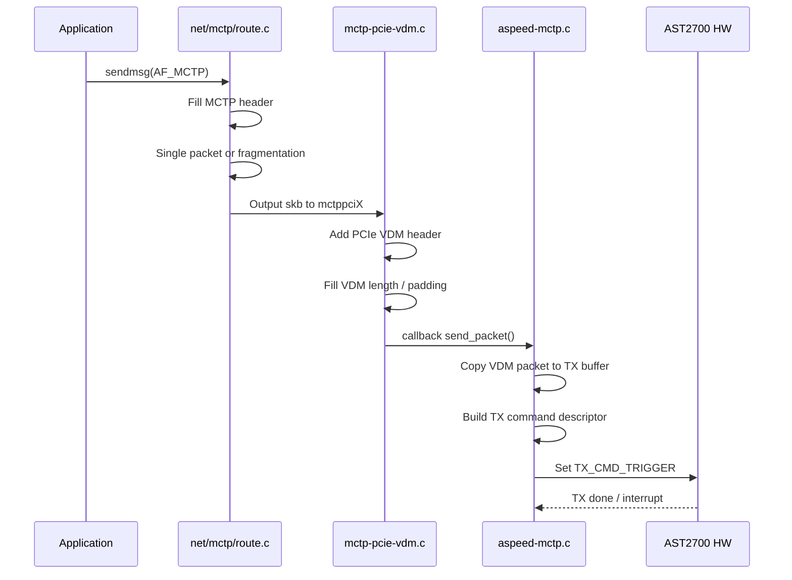
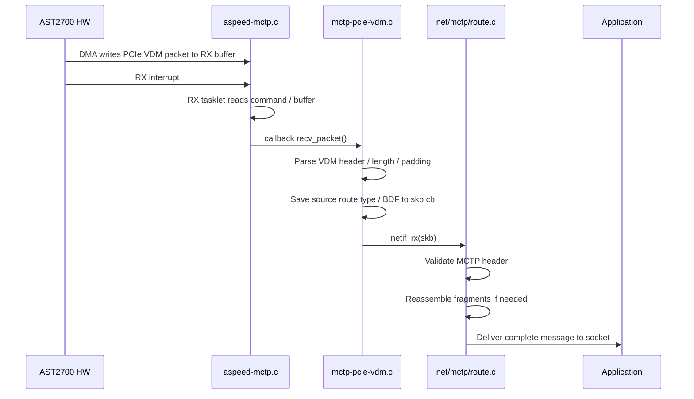

# AST2700 MCTP TX/RX Code Flow

## Scope

本文件只整理 AST2700 上 **kernel socket-MCTP / PCIe VDM netdev** 路徑：


重點結論：

- **MCTP message layer**：`net/mctp/route.c`
  - MCTP header
  - `SOM` / `EOM` / `seq`
  - TX fragmentation
  - RX reassembly
- **PCIe VDM transport layer**：`drivers/net/mctp/mctp-pcie-vdm.c`
  - PCIe VDM header
  - route type / Target BDF / Requester BDF
  - VDM length / padding
- **AST2700 HW control layer**：`drivers/soc/aspeed/aspeed-mctp.c`
  - DMA buffer
  - TX/RX command ring
  - register trigger / status
  - interrupt

> AST2700 HW 負責 PCIe VDM packet transport / DMA，不負責 MCTP message fragmentation 或 reassembly。

## HW Init / Register Setup

File: `drivers/soc/aspeed/aspeed-mctp.c`

Functions / 函式：`aspeed_mctp_channels_init()`, `aspeed_mctp_tx_chan_init()`, `aspeed_mctp_rx_chan_init()`, `aspeed_mctp_rx_trigger()`

```c
static void aspeed_mctp_channels_init(struct aspeed_mctp *priv)
{
	aspeed_mctp_rx_chan_init(&priv->rx);
	aspeed_mctp_tx_chan_init(&priv->tx);
}
```

TX command buffer base address 設定：

```c
regmap_write(priv->map, ASPEED_MCTP_TX_BUF_ADDR, tx->cmd.dma_handle);
if (priv->match_data->dma_need_64bits_width)
	regmap_write(priv->map, ASPEED_MCTP_TX_BUF_HI_ADDR,
		     upper_32_bits(tx->cmd.dma_handle));
```

RX command / buffer setup：

```c
#define RX_PACKET_COUNT		96

/* 預設 priv->rx_packet_count = RX_PACKET_COUNT */
u32 hw_rx_count = priv->rx_packet_count;

/* AST2700 使用 64-bit DMA，所以 rx_runaway_wa.enable = false */
regmap_write(priv->map, ASPEED_MCTP_RX_BUF_SIZE, hw_rx_count);

regmap_write(priv->map, ASPEED_MCTP_RX_BUF_ADDR,
	     rx->cmd.dma_handle);
if (priv->match_data->dma_need_64bits_width)
	regmap_write(priv->map, ASPEED_MCTP_RX_BUF_HI_ADDR,
		     upper_32_bits(rx->cmd.dma_handle));
regmap_write(priv->map, ASPEED_MCTP_RX_BUF_WR_PTR, 0);
```

說明：

- `ASPEED_MCTP_TX_BUF_ADDR`: `MCTP04`
- `ASPEED_MCTP_TX_BUF_HI_ADDR`: `MCTP30`
- `ASPEED_MCTP_RX_BUF_ADDR`: `MCTP08`
- `ASPEED_MCTP_RX_BUF_HI_ADDR`: `MCTP20`
- `ASPEED_MCTP_RX_BUF_SIZE`: `0x024`
- `hw_rx_count` 預設 `96`，代表可接收 `96` 筆 PCIe VDM，可透過 device tree `aspeed,rx-packet-count` 修改。


## TX Code Flow



### TX Step 1: Linux MCTP core builds MCTP header

File: `net/mctp/route.c`

Function: `mctp_local_output()`

```c
hdr = mctp_hdr(skb);
hdr->ver = 1;
hdr->dest = daddr;
hdr->src = saddr;

if (skb->len + sizeof(struct mctp_hdr) <= mtu) {
	hdr->flags_seq_tag = MCTP_HDR_FLAG_SOM |
		MCTP_HDR_FLAG_EOM | tag;
	/* dst 代表已查找到的 MCTP route。 */
	rc = dst->output(dst, skb);
} else {
	rc = mctp_do_fragment_route(dst, skb, mtu, tag);
}
```

說明：

- `hdr->ver / dest / src` 是 MCTP transport header。
- message 未超過 MTU 時，直接設定 `SOM | EOM | tag`。
- message 超過 MTU 時，進入 `mctp_do_fragment_route()` 做 software fragmentation。

### TX Step 2: Fragment path sets SOM / EOM / seq

File: `net/mctp/route.c`

Function: `mctp_do_fragment_route()`

```c
hdr2 = mctp_hdr(skb2);
hdr2->ver = hdr->ver;
hdr2->dest = hdr->dest;
hdr2->src = hdr->src;
hdr2->flags_seq_tag = tag &
	(MCTP_HDR_TAG_MASK | MCTP_HDR_FLAG_TO);

if (pos == 0)
	hdr2->flags_seq_tag |= MCTP_HDR_FLAG_SOM;

if (pos + size == skb->len)
	hdr2->flags_seq_tag |= MCTP_HDR_FLAG_EOM;

hdr2->flags_seq_tag |= seq << MCTP_HDR_SEQ_SHIFT;
```

說明：

- 第一個 fragment 設定 `SOM`。
- 最後一個 fragment 設定 `EOM`。
- 每個 fragment 設定 `seq`。
- 這些欄位由 Linux MCTP core 設定，不是 AST2700 HW 設定。

### TX Step 3: PCIe VDM driver creates PCIe Medium-Specific Header

File: `drivers/net/mctp/mctp-pcie-vdm.c`

Function: `mctp_pcie_vdm_hdr_create()`

```c
struct mctp_pcie_vdm_hdr *hdr =
	(struct mctp_pcie_vdm_hdr *)skb_push(skb, sizeof(*hdr));

memcpy(hdr, &mctp_pcie_vdm_hdr_template, sizeof(*hdr));
if (daddr) {
	memcpy(dest_addr, (u8 *)daddr, sizeof(dest_addr));
	hdr->route_type |= dest_addr[0] & GENMASK(2, 0);
	hdr->pci_target_id = dest_addr[1] << 8 | dest_addr[2];
}

if (saddr)
	hdr->pci_req_id = *(u16 *)saddr;
```

說明：

- PCIe VDM header 在 `mctp-pcie-vdm.c` 建立。
- `daddr` 提供 route type 與 target BDF。
- `saddr` 提供 requester BDF。

### TX Step 4: PCIe VDM driver fills length / padding and sends to ASPEED driver

File: `drivers/net/mctp/mctp-pcie-vdm.c`

Function: `mctp_pcie_vdm_xmit()`

```c
payload_len_dw = (ALIGN(skb->len, sizeof(u32)) -
		  MCTP_PCIE_VDM_HDR_SIZE) / sizeof(u32);
payload_len_byte = skb->len - MCTP_PCIE_VDM_HDR_SIZE;

hdr->length = payload_len_dw;
hdr->tag_pad_len =
	ALIGN(payload_len_byte, sizeof(u32)) - payload_len_byte;

MCTP_PCIE_SWAP_NET_ENDIAN((u32 *)hdr,
			  sizeof(struct mctp_pcie_vdm_hdr) / sizeof(u32));

rc = vdm_dev->callback_ops->send_packet(vdm_dev->dev, skb->data,
					payload_len_dw * sizeof(u32));
```

說明：

- VDM packet length、padding、endian conversion 由 `mctp-pcie-vdm.c` 處理。
- 完成後透過 `send_packet()` callback 交給 `aspeed-mctp.c`。

### TX Step 5: ASPEED driver copies full VDM packet into TX path

File: `drivers/soc/aspeed/aspeed-mctp.c`

Function: `aspeed_mctp_pcie_vdm_op_send_pkt()`

```c
memcpy((u8 *)&packet->data.hdr, data, PCIE_VDM_HDR_SIZE);
memcpy((u8 *)&packet->data.payload, data + PCIE_VDM_HDR_SIZE, size);
packet->size = (size + PCIE_VDM_HDR_SIZE);

rc = aspeed_mctp_send_packet(priv->default_client, packet);
```

說明：

- `aspeed-mctp.c` 收到的是已包含 PCIe VDM header 的 packet。
- 這裡只把 packet 放進 ASPEED MCTP TX queue。
- 沒有建立 MCTP header，也沒有做 MCTP fragmentation。

### TX Step 6: AST2700 TX descriptor uses DMA address and packet size

File: `drivers/soc/aspeed/aspeed-mctp.c`

Function: `aspeed_mctp_emit_tx_cmd()`

```c
aspeed_mctp_swap_pcie_vdm_hdr(&packet->data);

if (priv->match_data->vdm_hdr_direct_xfer) {
	offset = tx->wr_ptr * sizeof(packet->data);
	memcpy((u8 *)tx->data.vaddr + offset, &packet->data,
	       sizeof(packet->data));

	tx_cmd_g7->tx_lo = TX_PACKET_SIZE(packet_sz_dw);
	tx_cmd_g7->tx_mid |= ((tx->data.dma_handle + offset) &
			      GENMASK(31, 4));
	tx_cmd_g7->tx_hi = upper_32_bits((tx->data.dma_handle + offset));
}
```

說明：

- AST2700 TX command 主要描述 packet size 與 DMA address。
- `vdm_hdr_direct_xfer = true` 表示 AST2700 path 傳完整 VDM packet。
- 這是 packet transport / DMA 層級，不是 message layer。

### TX Step 7: Driver programs TX command count and triggers HW TX

File: `drivers/soc/aspeed/aspeed-mctp.c`

Function: `aspeed_mctp_tx_trigger()`

```c
if (priv->match_data->fifo_auto_surround)
	regmap_write(priv->map, ASPEED_MCTP_TX_BUF_WR_PTR, tx->wr_ptr);

regmap_update_bits(priv->map, ASPEED_MCTP_CTRL, TX_CMD_TRIGGER,
		   TX_CMD_TRIGGER);
ret = regmap_read_poll_timeout_atomic(priv->map, ASPEED_MCTP_CTRL,
				      ctrl_val,
				      !(ctrl_val & TX_CMD_TRIGGER), 0,
				      1000000);
```

說明：


- Driver 準備好 TX descriptor 後設定 `MCTP00[0] / TX_CMD_TRIGGER`。
- HW 依 TX command / DMA address 送出 packet。
- `ASPEED_MCTP_TX_BUF_WR_PTR`: `MCTP3C`

### TX Datasheet Mapping

Datasheet `37.5.1 Send Packet`：

```text
1. Set proper address to MCTP04 or MCTP30.
2. Prepare command to address set to MCTP04 or MCTP30 one by one.
   - Prepare PCIe Medium-Specific Header to Data Address.
   - Prepare following MCTP Transport Header.
   - Prepare following MCTP Packet Payload.
3. Program MCTP3C for the number of TX commands filled in previous step.
4. Set MCTP00[0] to 1 to trigger TX.
5. Waiting transaction complete.
```

對應關係：

| Datasheet | Code layer | 說明 |
| --- | --- | --- |
| `MCTP04 / MCTP30` | `ASPEED_MCTP_TX_BUF_ADDR / ASPEED_MCTP_TX_BUF_HI_ADDR` | TX channel init 設定 command buffer DMA address |
| `MCTP3C` | `ASPEED_MCTP_TX_BUF_WR_PTR` | TX command count / write pointer |
| PCIe Medium-Specific Header | `mctp-pcie-vdm.c` | 建立 PCIe VDM header |
| MCTP Transport Header | `net/mctp/route.c` | 建立 MCTP header |
| MCTP Packet Payload | `net/mctp/route.c` | message payload / fragment payload |
| TX command / address | `aspeed-mctp.c` | DMA address、packet size |
| `MCTP00[0]` | `TX_CMD_TRIGGER` | 觸發 HW TX |

## RX Code Flow



### RX Step 1: HW triggers RX interrupt and driver schedules RX tasklet

File: `drivers/soc/aspeed/aspeed-mctp.c`

Function: `aspeed_mctp_irq_handler()`

```c
regmap_read(priv->map, ASPEED_MCTP_INT_STS, &status);
regmap_write(priv->map, ASPEED_MCTP_INT_STS, status);

if (status & RX_CMD_RECEIVE_INT) {
	tasklet_hi_schedule(&priv->rx.tasklet);
	handled |= RX_CMD_RECEIVE_INT;
}

if (status & RX_CMD_NO_MORE_INT) {
	priv->rx.stopped = true;
	tasklet_hi_schedule(&priv->rx.tasklet);
	handled |= RX_CMD_NO_MORE_INT;
}
```

說明：

- HW 收到 PCIe VDM packet 後寫入 RX buffer，並觸發 RX interrupt。
- `RX_CMD_RECEIVE_INT`: HW 已寫入 RX packet，通知 driver 取資料。
- `RX_CMD_NO_MORE_INT`: RX ring 沒有可用 command / buffer slot，driver 會標記 `rx.stopped`，先消耗 RX ring 後再重新 enable RX。

### RX Step 2: RX tasklet collects packet from ASPEED RX buffer

File: `drivers/soc/aspeed/aspeed-mctp.c`

Function: `aspeed_mctp_rx_tasklet()`

```c
regmap_write(priv->map, ASPEED_MCTP_RX_BUF_RD_PTR, UPDATE_RX_RD_PTR);

rx_full = rx->stopped;
rx_buf = (struct mctp_pcie_packet_data *)rx->data.vaddr;
hdr = (u32 *)&rx_buf[rx->wr_ptr];

while (*hdr != 0) {
	rx_packet = aspeed_mctp_packet_alloc(GFP_ATOMIC);
	memcpy(&rx_packet->data, hdr, sizeof(rx_packet->data));

	aspeed_mctp_swap_pcie_vdm_hdr(&rx_packet->data);
	aspeed_mctp_dispatch_packet(priv, rx_packet);

	*hdr = 0;
	rx->wr_ptr = (rx->wr_ptr + 1) % rx->buffer_count;
	hdr = (u32 *)&rx_buf[rx->wr_ptr];
}

regmap_read(priv->map, ASPEED_MCTP_RX_BUF_RD_PTR, &hw_read_ptr);
hw_read_ptr &= RX_BUF_RD_PTR_MASK;
regmap_write(priv->map, ASPEED_MCTP_RX_BUF_WR_PTR, hw_read_ptr);
```

說明：

- `hdr` 指向目前 `rx->wr_ptr` 對應的 RX buffer slot 開頭。
- `while (*hdr != 0)` 會處理目前 RX ring 裡已收到的 packet，直到遇到空 slot。
- 每個 `rx_packet->data` 包含 `16-byte PCIe VDM header` + MCTP data / payload。
- `aspeed_mctp_dispatch_packet()` 將 `rx_packet` 放進 client 的 `rx_queue`，並喚醒等待者。
- `ASPEED_MCTP_RX_BUF_RD_PTR`: `MCTP28`
- `ASPEED_MCTP_RX_BUF_WR_PTR`: `MCTP2C`
- `UPDATE_RX_RD_PTR` 設定 `MCTP28[31]`，要求 HW snapshot `MCTP28[11:0]`。
- `RX_BUF_RD_PTR_MASK` 只保留 read pointer 欄位。
- 最後寫回 `ASPEED_MCTP_RX_BUF_WR_PTR`，通知 HW RX buffer slot 已釋放。

### RX Step 3: PCIe VDM driver gets packet, parses VDM header, and builds skb

File: `drivers/net/mctp/mctp-pcie-vdm.c`

RX handler:

```c
packet = vdm_dev->callback_ops->recv_packet(vdm_dev->dev);

while (!IS_ERR(packet)) {
	MCTP_PCIE_SWAP_LITTLE_ENDIAN((u32 *)packet,
				     sizeof(struct mctp_pcie_vdm_hdr) / sizeof(u32));
	vdm_hdr = (struct mctp_pcie_vdm_hdr *)packet;

	len = vdm_hdr->length * sizeof(u32) -
		vdm_hdr->tag_pad_len;
	skb = netdev_alloc_skb(ndev, len);

	skb->protocol = htons(ETH_P_MCTP);
	skb_put_data(skb, &packet[sizeof(struct mctp_pcie_vdm_hdr)], len);
```

說明：

- `recv_packet()` callback 會呼叫 ASPEED driver 的 `aspeed_mctp_pcie_vdm_op_recv_pkt()`，從 `default_client->rx_queue` 取出 packet。
- `packet` 內容包含 `16-byte PCIe VDM header` + MCTP data / payload。
- `mctp-pcie-vdm.c` 解析 VDM header，計算 length / padding。
- `skb_put_data()` 只放 VDM header 後面的 MCTP packet data 到 skb。
- `skb` 是 Linux network stack 傳遞 packet 的 buffer，後面會交給 `netif_rx()`。

### RX Step 4: PCIe VDM driver stores source metadata and injects skb

File: `drivers/net/mctp/mctp-pcie-vdm.c`

RX handler:

```c
cb = __mctp_cb(skb);
cb->halen = 3; // route type | bdf address
cb->haddr[0] = vdm_hdr->route_type & GENMASK(2, 0);
cb->haddr[1] = vdm_hdr->pci_req_id >> 8;
cb->haddr[2] = vdm_hdr->pci_req_id & 0xFF;

net_status = netif_rx(skb);
```

說明：

- RX source route type / requester BDF 由 PCIe VDM header 解析出來。
- `cb->haddr[]` 記錄來源 PCIe route type / requester BDF，可作為回覆時的目的硬體位址。
- `netif_rx()` 將 skb 送進 Linux MCTP core。

### RX Step 5: Linux MCTP core performs fragment reassembly

File: `net/mctp/route.c`

Functions: `mctp_route_input()`, `mctp_frag_queue()`

```c
flags = mh->flags_seq_tag & (MCTP_HDR_FLAG_SOM | MCTP_HDR_FLAG_EOM);
key = mctp_lookup_key(net, skb, netid, mh->src, &f);

if (flags & MCTP_HDR_FLAG_SOM) {
	if (flags & MCTP_HDR_FLAG_EOM) {
		/* single-packet message */
		rc = sock_queue_rcv_skb(&msk->sk, skb);
		goto out_unlock;
	}

	/* first fragment: create/use reassembly key */
	mctp_frag_queue(key, skb);
	skb = NULL;

} else if (key) {
	/* continuation fragment */
	rc = mctp_frag_queue(key, skb);
	skb = NULL;

	if (flags & MCTP_HDR_FLAG_EOM) {
		/* last fragment: deliver reassembled message */
		rc = sock_queue_rcv_skb(key->sk, key->reasm_head);
		key->reasm_head = NULL;
	}
}
```

說明：

- `SOM | EOM` 代表 single-packet message，直接送進 socket。
- 只有 `SOM` 沒有 `EOM` 時，Linux MCTP core 會開始 reassembly，並用 key 追蹤同一個 message。
- 中間 fragment 會進 `mctp_frag_queue()`，接到 `key->reasm_head`。
- 收到 `EOM` 後，才把 `key->reasm_head` 送進 socket。
- 完整 MCTP message 最後進入 AF_MCTP socket，由 userspace daemon（例如 `mctpd` / `pldmd`）透過 `recvmsg()` 接手。

## EID Filter

`MATCHING_EID` 是 single-EID HW filter。

File: `drivers/soc/aspeed/aspeed-mctp.c`

```c
#define ASPEED_MCTP_EID		0x014
#define  MCTP_EID		GENMASK(7, 0)
```

```c
if (filter.enable) {
	regmap_update_bits(priv->map, ASPEED_MCTP_EID,
			   MCTP_EID, filter.eid);
	regmap_update_bits(priv->map, ASPEED_MCTP_CTRL,
			   MATCHING_EID, MATCHING_EID);
} else {
	regmap_update_bits(priv->map, ASPEED_MCTP_CTRL,
			   MATCHING_EID, 0);
}
```

Datasheet：

> Only accept packet whose MCTP Destination EID matches MCTP14[7:0]

說明：

- `MCTP14[7:0]` = `ASPEED_MCTP_EID[7:0]`。
- register 只放一個 destination EID value。
- 目前 code 沒看到 AST2700 MCTP HW 支援 multi-EID filter table。

## Final Summary

AST2700 MCTP HW 處理 PCIe VDM packet transport、DMA、TX/RX command；MCTP message header、fragmentation、reassembly 由 Linux MCTP software stack 處理。
