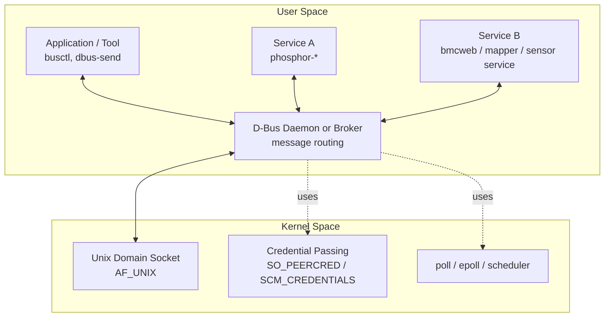
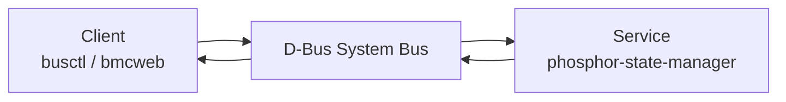
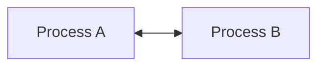
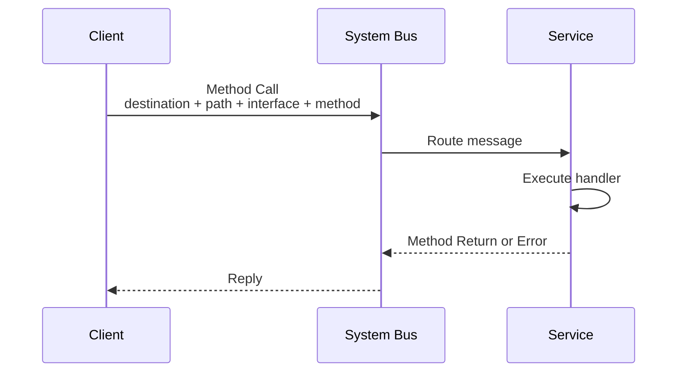
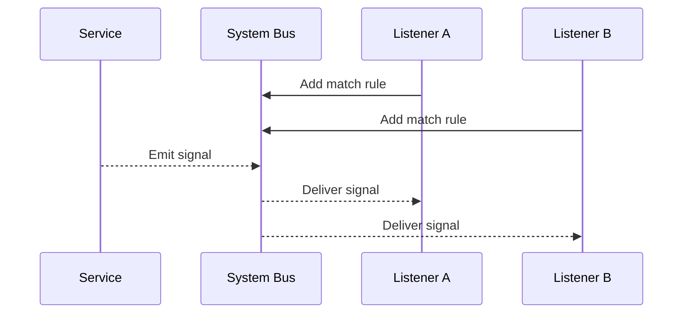
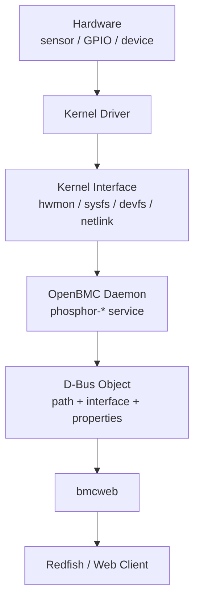
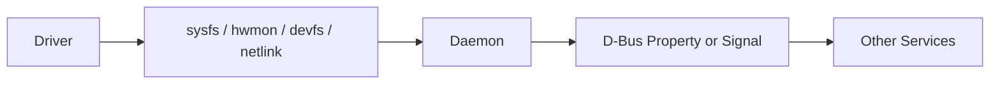

# Linux Kernel Study - D-Bus

<div style="background:#eaf4ff; border-left: 4px solid #5aa9e6; padding: 10px 14px; border-radius: 6px;">
<b>D-Bus</b> 是 Linux user space 常見的 IPC 機制，嚴格來說它不是 kernel subsystem；kernel 只提供 Unix domain socket、credential、poll/epoll 等基礎能力。對 OpenBMC 來說，D-Bus 是 phosphor services 之間交換狀態、事件與控制命令的主要骨架。
</div>

## 章節目錄

- [1. D-Bus 在 Linux 架構中的位置](#1-d-bus-在-linux-架構中的位置)
- [2. D-Bus 的核心概念](#2-d-bus-的核心概念)
- [3. D-Bus message 與 signature](#3-d-bus-message-與-signature)
- [4. Message Bus 與 Direct Peer-to-Peer](#4-message-bus-與-direct-peer-to-peer)
- [5. 呼叫流程與訊息型態](#5-呼叫流程與訊息型態)
- [6. OpenBMC 與 D-Bus](#6-openbmc-與-d-bus)
- [7. Kernel 角度如何理解 D-Bus](#7-kernel-角度如何理解-d-bus)
- [8. 常用工具與 debug 指令](#8-常用工具與-debug-指令)
- [9. 實務排查方向](#9-實務排查方向)

---

## 1. D-Bus 在 Linux 架構中的位置

D-Bus 是一種 **Inter-Process Communication（IPC，行程間通訊）** 機制。IPC 指的是不同 process 之間交換資料、傳遞事件或提出服務請求的通訊方式。

在 Linux 架構中，D-Bus 位於 **user space IPC** 這一層。它不是 kernel subsystem，也不是 driver API；kernel 只提供 Unix domain socket、credential、poll/epoll、scheduler 等基礎能力，D-Bus daemon 或 broker 則在 user space 負責訊息路由、服務命名與 policy 控制。

它的重要定位是：

- D-Bus 是 **user space IPC framework**。
- D-Bus daemon 或 broker 負責做 message routing。
- kernel 不理解 D-Bus message 的語意。
- kernel 只提供 transport 所需的基礎機制，例如 `AF_UNIX` socket。

### 1.1 IPC 定位與適用情境

D-Bus 適合用在 **控制面（control plane）** 與 **管理面（management plane）** 的通訊，例如查詢系統狀態、要求服務執行動作、或通知狀態變更。它不適合放在高速資料路徑中搬運大量 payload。

| 適合使用 D-Bus 的情境 | 說明 |
|:--|:--|
| 查詢另一個 service 的狀態 | 例如 `bmcweb` 讀取 host power state 或 sensor property |
| 要求另一個 service 執行管理動作 | 例如要求 host power on/off、建立 log entry、更新 inventory |
| 狀態變更需要通知多個 listener | 例如 `PropertiesChanged`、sensor value changed、host state changed |
| 系統由多個長駐 daemon 組成 | 每個 daemon 負責一個領域，透過 system bus 協作 |
| 需要穩定的服務命名與權限控管 | 透過 well-known name、bus policy 與 peer credential 管理存取 |
| 需要標準化的物件模型 | 以 object path、interface、property 建模平台狀態 |

不適合優先使用 D-Bus 的情境：

| 情境 | 較常見的替代方式 |
|:--|:--|
| kernel driver 與 user space 交換底層資料 | `sysfs`、`ioctl`、`netlink`、`devfs`、`mmap` |
| 大量或低延遲資料傳輸 | shared memory、Unix domain socket、`mmap` |
| 網路封包資料路徑 | kernel networking stack、socket API |
| 跨主機 API | HTTP、Redfish、gRPC、TCP socket |

<div style="background:#eef7fb; border-left: 4px solid #57a6c7; padding: 10px 14px; border-radius: 6px;">
<b>專業定位：</b>D-Bus 應被視為本機 user-space services 之間的結構化 IPC，主要承載管理語意與狀態同步；它不是 kernel driver 的直接通訊介面，也不是高吞吐量資料傳輸機制。
</div>

### 1.2 架構位置圖



<div style="background:#fff7e6; border-left: 4px solid #f0a35e; padding: 10px 14px; border-radius: 6px;">
<b>學 kernel 時要特別分清楚：</b>D-Bus 看起來像系統裡的核心通道，但它不是 kernel API。driver 通常不直接發 D-Bus；driver 透過 sysfs、devfs、netlink、ioctl、eventfd、udev event 等方式暴露資訊，再由 user-space daemon 轉成 D-Bus 物件與屬性。
</div>

---

## 2. D-Bus 的核心概念

D-Bus 的全名是 **Desktop Bus**，原本常見於 Linux desktop，用來讓不同 user-space process 互相溝通。後來在 embedded Linux、systemd、OpenBMC 裡也被大量使用。

D-Bus 的特色是把 process 之間的互動整理成具名服務、物件、介面、方法、屬性與訊號，因此適合用來描述系統管理語意。

### 2.1 基本物件模型

D-Bus 把 process 之間的互動整理成幾個固定概念。

| 概念 | 說明 | 範例 |
|:--|:--|:--|
| **Bus** | 訊息匯流排，負責轉送訊息 | system bus、session bus |
| **Connection** | process 連到 bus 後形成的連線 | `:1.42` |
| **Well-known name** | 穩定服務名稱 | `xyz.openbmc_project.State.Host` |
| **Unique name** | bus 分配的暫時名稱 | `:1.87` |
| **Object path** | 服務內部物件位置 | `/xyz/openbmc_project/state/host0` |
| **Interface** | 物件支援的一組方法、屬性、訊號 | `xyz.openbmc_project.State.Host` |
| **Method** | 可被呼叫的動作 | `SetHostTransition` |
| **Property** | 可讀寫的狀態 | `CurrentHostState` |
| **Signal** | 非同步事件通知 | `PropertiesChanged` |

### 2.2 System Bus 與 Session Bus

Linux 常見兩種 bus：

- **system bus**：系統服務使用，OpenBMC 大多使用這個。
- **session bus**：桌面登入 session 使用，embedded 系統通常較少碰到。

OpenBMC 上常見的 D-Bus socket 位置：

```bash
/run/dbus/system_bus_socket
```

### 2.3 Well-known name 與 Unique name

一個 service 連上 bus 後，bus 會分配 unique name，例如：

```text
:1.23
```

service 也可以註冊 well-known name，讓其他 process 用穩定名稱找到它，例如：

```text
xyz.openbmc_project.Logging
xyz.openbmc_project.ObjectMapper
```

<div style="background:#edf7ed; border-left: 4px solid #67b26f; padding: 10px 14px; border-radius: 6px;">
debug 時通常先找 <b>well-known name</b>，再看它背後目前對應到哪個 <b>unique name</b>。service restart 後 unique name 會變，但 well-known name 應該仍維持穩定。
</div>

---

## 3. D-Bus message 與 signature

D-Bus 不是單一固定的 C `struct`，也不是只有一種固定 payload 的封包。較精確的定義是：**D-Bus 是一套 user-space IPC protocol、message format 與 service/object model**。

D-Bus 傳遞的基本單位是 **message**。message 有規範化的外層格式，body 則依照 type signature 進行序列化，因此內容可以隨 method、property 或 signal 的介面定義而變化。

```text
D-Bus message
├─ Header：固定規範的控制資訊
│  ├─ message type
│  ├─ serial number
│  ├─ destination
│  ├─ sender
│  ├─ object path
│  ├─ interface
│  ├─ member
│  └─ signature
└─ Body：依照 signature 編碼的參數資料
```

常見 signature 範例：

| Signature | 型別意義 |
|:--|:--|
| `s` | string |
| `b` | boolean |
| `i` | signed 32-bit integer |
| `u` | unsigned 32-bit integer |
| `x` | signed 64-bit integer |
| `t` | unsigned 64-bit integer |
| `a...` | array |
| `v` | variant |
| `a{sv}` | dictionary，key 是 string，value 是 variant |

例如一個 method call 可能包含：

```text
destination = xyz.openbmc_project.State.Host
path        = /xyz/openbmc_project/state/host0
interface   = xyz.openbmc_project.State.Host
member      = RequestedHostTransition
signature   = s
body        = "xyz.openbmc_project.State.Host.Transition.On"
```

其中 `signature = s` 表示 body 內的參數是一個 string。

### 3.1 固定的是協定，可變的是介面內容

D-Bus protocol 本身有明確規範，包括 message header、type system、marshalling、alignment、message type、object path 與 interface 命名規則。可變的是每個 service 實際暴露哪些 object、interface、method、property 與 signal。

這點可以類比成：

```text
TCP/IP 與 HTTP 有固定協定規則，
但每個 HTTP service 的 path、method 與 body schema 由服務自行定義。

D-Bus 也有固定 message format 與 type system，
但每個 D-Bus service 的 object tree 與 interface contract 由服務自行定義。
```

### 3.2 傳送與 decode 通常不是主要關注點

D-Bus message 的傳送、序列化與反序列化通常由 D-Bus library 和 bus daemon / broker 處理。應用程式大多不需要手動組 header、計算 alignment、或直接解析 byte stream。

常見流程如下：

```text
application code
  ↓
sdbusplus / sd-bus / libdbus
  ↓
serialize / deserialize
  ↓
Unix domain socket
  ↓
dbus-daemon / dbus-broker
  ↓
receiver library
  ↓
dispatch 到 method handler / signal callback
```

D-Bus 也不要求一定要用專門 thread 傳送訊息。常見實作是把 D-Bus connection 的 socket fd 整合進 event loop，例如 `poll`、`epoll`、`sd-event`、GLib main loop 或 Boost.Asio。是否使用獨立 worker thread 是程式架構選擇，不是 D-Bus protocol 的要求。

<div style="background:#f4ecff; border-left: 4px solid #8d6adf; padding: 10px 14px; border-radius: 6px;">
<b>工程重點：</b>使用或 debug D-Bus 時，優先確認 service name、object path、interface、method / property / signal 與 signature 是否正確；thread、encode、decode 通常屬於 library 與 runtime 實作細節。
</div>

---

## 4. Message Bus 與 Direct Peer-to-Peer

D-Bus 可以有兩種溝通模式。

### 4.1 Message Bus 模式

最常見的是所有 process 都連到同一個 bus，由 bus daemon 或 broker 幫忙轉送。



這種模式的好處是：

- client 不需要知道 service 的 process id。
- bus 可以管理 name ownership。
- bus 可以套用 policy。
- service 可以廣播 signal 給多個 listener。

### 4.2 Direct Peer-to-Peer 模式

兩個 process 也可以直接用 D-Bus protocol 溝通，不經過 central bus。



但在 system service 與 OpenBMC 實務上，主要還是 system bus 模式。

---

## 5. 呼叫流程與訊息型態

D-Bus 訊息主要分成四類：

| 訊息型態 | 方向 | 用途 |
|:--|:--|:--|
| **Method Call** | client 到 service | 要求執行某個動作 |
| **Method Return** | service 到 client | 回傳 method 結果 |
| **Error** | service 到 client | 回傳錯誤 |
| **Signal** | service 廣播 | 通知事件或狀態變化 |

### 5.1 Method Call 流程



一個 method call 通常需要指定：

- destination service name
- object path
- interface
- method name
- argument signature
- argument values

### 5.2 Signal 流程



signal 是非同步通知，常用於：

- property changed
- sensor value updated
- host state changed
- log entry created
- device inventory changed

---

## 6. OpenBMC 與 D-Bus

OpenBMC 把大量系統狀態建模成 D-Bus objects。這讓不同 daemon 可以用一致方式讀取與修改狀態。

### 6.1 OpenBMC 常見 D-Bus 角色

| 角色 | 說明 |
|:--|:--|
| `phosphor-*` service | 提供平台管理功能，例如 state、logging、sensors |
| `bmcweb` | Redfish / Web API 層，常透過 D-Bus 讀取後端狀態 |
| `ObjectMapper` | 協助查詢某個 object path 由哪個 service 提供 |
| `systemd` | 啟動與監控 services，也可和 D-Bus 整合 |
| `sdbusplus` | OpenBMC 常用的 C++ D-Bus library |

### 6.2 OpenBMC 典型資料路徑

以下是很常見的 BMC user-space 資料流：kernel driver 暴露硬體資料，daemon 讀取後轉成 D-Bus 屬性，最後由上層 API 提供出去。



<div style="background:#f4ecff; border-left: 4px solid #8d6adf; padding: 10px 14px; border-radius: 6px;">
OpenBMC 的重點不是讓 kernel driver 直接懂 Redfish 或 D-Bus，而是讓 driver 提供穩定的 kernel interface，再由 user-space service 把硬體狀態整理成平台管理語意。
</div>

### 6.3 ObjectMapper 的用途

OpenBMC 系統裡 object 很多，client 不一定知道某個 object 由哪個 service 擁有。`ObjectMapper` 可以回答：

- 哪些 service 提供某個 object path？
- 某個 subtree 底下有哪些 objects？
- 某個 object 支援哪些 interfaces？

常見 service name：

```text
xyz.openbmc_project.ObjectMapper
```

---

## 7. Kernel 角度如何理解 D-Bus

從 kernel study 的角度，D-Bus 可以被放在 IPC 與 user-space service architecture 這一層理解。

### 7.1 Kernel 提供的底層能力

| Kernel 能力 | D-Bus 如何使用 |
|:--|:--|
| Unix domain socket | process 透過 local socket 連到 bus |
| credential passing | bus 可知道 peer 的 uid、gid、pid |
| scheduler | process 收送訊息仍由 kernel 排程 |
| poll / epoll | bus daemon 監聽多個 client connection |
| LSM / permission | 可和系統安全機制一起形成存取限制 |

D-Bus protocol 本身的內容，例如 object path、interface、method、signal，都是 user-space 規則。

### 7.2 Driver 與 D-Bus 的邊界

driver 通常負責：

- 初始化硬體。
- 處理 interrupt。
- 提供 character device、sysfs、hwmon、input、network、MCTP socket 等 kernel interface。
- 把硬體事件轉成 kernel 可見的狀態或事件。

user-space daemon 通常負責：

- 讀取 kernel interface。
- 實作 platform policy。
- 把資料轉成 D-Bus object。
- 發出 signal 或更新 property。



---

## 8. 常用工具與 debug 指令

### 8.1 列出 system bus 上的服務

```bash
busctl list
```

只看 OpenBMC 相關服務：

```bash
busctl list | grep xyz.openbmc_project
```

### 8.2 查看 object tree

```bash
busctl tree xyz.openbmc_project.ObjectMapper
```

查看某個服務：

```bash
busctl tree xyz.openbmc_project.Logging
```

### 8.3 introspect 物件

```bash
busctl introspect xyz.openbmc_project.Logging \
  /xyz/openbmc_project/logging
```

introspect 可以看到：

- object 支援哪些 interfaces
- 有哪些 methods
- 有哪些 properties
- 有哪些 signals

### 8.4 讀取 property

```bash
busctl get-property \
  xyz.openbmc_project.State.Host \
  /xyz/openbmc_project/state/host0 \
  xyz.openbmc_project.State.Host \
  CurrentHostState
```

### 8.5 呼叫 method

```bash
busctl call \
  xyz.openbmc_project.ObjectMapper \
  /xyz/openbmc_project/object_mapper \
  xyz.openbmc_project.ObjectMapper \
  GetObject \
  sas \
  /xyz/openbmc_project/logging \
  0
```

### 8.6 監看訊息

```bash
busctl monitor
```

或使用：

```bash
dbus-monitor --system
```

監看特定 interface 或 signal 時，可以加 match rule；實務上先用寬鬆條件確認事件存在，再逐步縮小範圍。

---

## 9. 實務排查方向

### 9.1 Service 不存在

現象：

- `The name ... was not provided by any .service files`
- `ServiceUnknown`

檢查方向：

- service 是否啟動：`systemctl status <service>`
- service 是否 crash：`journalctl -u <service>`
- well-known name 是否註冊：`busctl list`
- systemd unit 的 `BusName=` 是否正確。

### 9.2 Object path 不存在

現象：

- `UnknownObject`
- introspect 找不到指定 path。

檢查方向：

- 用 `busctl tree <service>` 確認 object path。
- 用 `ObjectMapper.GetSubTree` 找物件。
- 檢查 daemon 是否因硬體或設定缺失而沒有建立 object。

### 9.3 Interface 或 property 不存在

現象：

- `UnknownInterface`
- `UnknownProperty`

檢查方向：

- 用 `busctl introspect` 看實際 interface。
- 確認 YAML interface 定義與程式碼版本是否一致。
- 確認 image 裡的 phosphor service 版本。

### 9.4 Method call timeout

現象：

- client 等不到回覆。
- `Connection timed out`

檢查方向：

- service event loop 是否卡住。
- method handler 是否做了 blocking I/O。
- kernel interface 是否卡在 read/write/ioctl。
- bus daemon 是否負載過高。

### 9.5 權限或 policy 問題

現象：

- `AccessDenied`
- root 可以呼叫，一般 user 不行。

檢查方向：

- D-Bus policy 設定。
- 呼叫端 uid/gid。
- systemd service user。
- 是否透過 bmcweb 或其他中介 service 呼叫。

<div style="background:#eef7fb; border-left: 4px solid #57a6c7; padding: 10px 14px; border-radius: 6px;">
<b>整理心法：</b>遇到 D-Bus 問題時，先確認 service name，再確認 object path，再確認 interface 與 member，最後才深入 method handler 或 kernel interface。大多數問題都能在這四層定位。
</div>

---

## 可整合回 Kernel Study 的位置

建議將本章放在 **Linux kernel 的 IPC / user-space interface** 相關段落之後，或放在 OpenBMC 補充章節中。

推薦整合標題：

```text
第六章：D-Bus 與 Linux user-space IPC
```

整合時可以保留本文的重點：

- D-Bus 不是 kernel subsystem。
- kernel 提供 transport 與 process 基礎能力。
- OpenBMC 用 D-Bus 把硬體管理狀態建模成 objects、interfaces、properties、signals。
- driver 與 D-Bus 中間通常隔著 user-space daemon。
