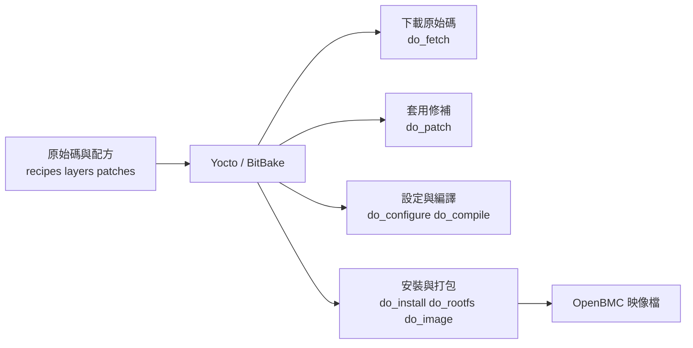
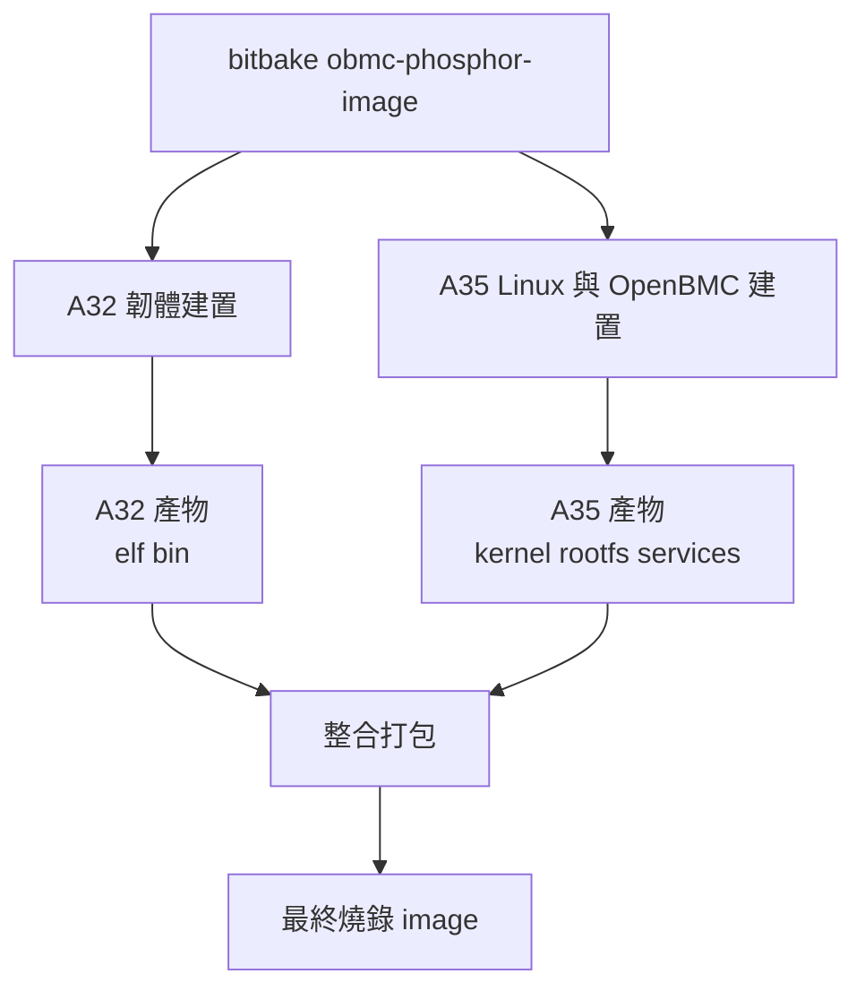

# OpenBMC 開發環境與工具

> 本文件整理 OpenBMC 開發環境與常用工具，涵蓋 `Yocto`、`BitBake`、交叉編譯、QEMU、`ConfigFS`、`Kconfig` 與 `Makefile`。重點在於各工具的定位、彼此的協作關係，以及實際開發流程中的使用時機。

---

## 目錄

- [1. OpenBMC 建置全貌](#1-openbmc-建置全貌)
- [2. Yocto 與 BitBake 的定位](#2-yocto-與-bitbake-的定位)
- [3. 編譯前的環境準備](#3-編譯前的環境準備)
- [4. AST2700 的異質交叉編譯觀念](#4-ast2700-的異質交叉編譯觀念)
- [5. QEMU 模擬與除錯實務](#5-qemu-模擬與除錯實務)
- [6. ConfigFS：以檔案系統介面操作核心物件](#6-configfs用檔案系統外觀操作核心)
- [7. Kconfig 與 Makefile 的協作關係](#7-kconfig-與-makefile-的協作關係)

---

## 1. OpenBMC 建置全貌

OpenBMC 不是單純把一個應用程式編成執行檔，而是要一路產出：

- Bootloader，例如 `U-Boot`
- 安全韌體，例如 `TF-A`
- Linux Kernel
- Root File System
- 各種 BMC user-space 服務，例如 `bmcweb`、`phosphor-*`
- 最後可燒錄到 SPI Flash 的整包 image

整體建置流程如下：



---

## 2. Yocto 與 BitBake 的定位

### Yocto 的定位

`Yocto Project` 是 Linux Foundation 旗下的開源專案，用來建立嵌入式 Linux 發行版。它提供：

- 建置框架
- metadata 格式
- layer 機制
- cross toolchain 產生流程
- 可重複建置的工作模式

它不是單一 `.bat` 或 shell script，而是一套由 metadata 驅動的發行版建置平台。

### BitBake 的定位

`BitBake` 是 Yocto 的任務引擎。常見指令如下：

```bash
bitbake obmc-phosphor-image
```

它不是單純依序執行命令，而是負責：

1. 讀 recipe 與設定
2. 算出依賴圖
3. 決定哪些 task 要跑
4. 平行執行可並行的工作
5. 使用快取避免重編

### 簡要區分

- `Yocto`：整個建置生態與方法論
- `BitBake`：實際執行配方與任務的引擎

### Layer 的定位

Yocto 最重要的概念之一就是 layer。每一層負責不同範圍：

| Layer 類型 | 典型內容 |
|:--|:--|
| `meta-phosphor` | OpenBMC 共通框架與服務 |
| `meta-aspeed` | ASPEED SoC/BSP 相關內容 |
| `meta-<vendor>` | 系統廠共用客製化 |
| `meta-<board>` | 特定機種、特定板子的設定 |

這種分層設計讓開發者能在自有 layer 中覆寫或追加設定，而不需直接修改上游原始碼。

### `.bb` 與 `.bbappend` 的差異

在 Yocto 中，最常見的兩種 metadata 檔案是 `.bb` 與 `.bbappend`。

| 檔案類型 | 用途 |
|:--|:--|
| `.bb` | 定義一個 recipe，也就是套件的取得、patch、編譯與安裝流程 |
| `.bbappend` | 對既有 recipe 做追加或覆寫，不直接改原本那份 `.bb` |

可整理為：

- `.bb`：原始 recipe
- `.bbappend`：針對既有 recipe 的追加或覆寫

### `.bb` 的常見內容

一個 `.bb` 通常會描述：

- 套件名稱與版本
- 原始碼從哪裡抓
- 要套哪些 patch
- 相依哪些套件
- configure / compile / install 流程
- 最後安裝哪些檔案到 image

例如常會看到這類內容：

```conf
DESCRIPTION = "Example package"
LICENSE = "MIT"
SRC_URI = "git://example.com/project.git;branch=main"
S = "${WORKDIR}/git"

DEPENDS += "openssl"
```

BitBake 會依據這些內容去產生對應 task，例如 `do_fetch`、`do_patch`、`do_compile`、`do_install`。

### `.bbappend` 的常見內容

當上游已有某個 recipe，而平台需要追加設定或 patch 時，通常不直接修改原始 `.bb`，而是在自有 layer 中新增 `.bbappend`。

常見用途有：

- 追加 patch
- 補 device tree 檔案
- 改安裝內容
- 加入額外相依
- 覆寫某些變數

例如：

```conf
FILESEXTRAPATHS:prepend := "${THISDIR}/files:"
SRC_URI += "file://0001-fix-board-init.patch"
```

這表示：保留原 recipe，本 layer 額外再補一個 patch 進去。

### `.bbappend` 的重要性

`.bbappend` 是 OpenBMC / Yocto 客製化的常見做法，主要優點包括：

- 不必直接改上游 layer
- 上游更新時比較容易跟進
- 客製內容集中在自己的 layer，比較好維護
- 同一份上游 recipe 可由不同 board layer 各自追加設定

### 簡要區分

- `.bb`：定義套件原始建置流程
- `.bbappend`：在不改上游 recipe 的前提下，替它加料或微調

---

## 3. 編譯前的環境準備

`bitbake` 通常不是建置流程的起點，而是環境、layer 與 machine 設定完成後的執行步驟。前置環境準備會直接影響建置是否穩定。

### 3.1 載入環境

常見做法是執行專案提供的初始化腳本，例如：

```bash
. setup ast2700-default
```

或是較標準的 Yocto 形式：

```bash
export TEMPLATECONF=meta-xxx/conf/templates/default
source oe-init-build-env build
```

這一步通常會完成：

- 建立 `build/` 工作目錄
- 匯入 BitBake/Yocto 需要的環境變數
- 準備 `conf/` 下的設定檔

### 3.2 `bblayers.conf`

`build/conf/bblayers.conf` 決定這次建置要載入哪些 layer。

BitBake 啟動並解析環境時會讀取此檔案。換言之，執行：

```bash
bitbake obmc-phosphor-image
```

BitBake 需要先透過 `bblayers.conf` 得知 recipes、append、classes 與 machine 設定所在的 layer。

最重要的內容通常是 `BBLAYERS`，例如：

```conf
BBLAYERS ?= " \
  /path/to/poky/meta \
  /path/to/poky/meta-poky \
  /path/to/openbmc/meta-phosphor \
  /path/to/openbmc/meta-aspeed \
  /path/to/meta-myboard \
"
```

此檔案可視為本次建置的資料來源清單。

`bblayers.conf` 主要提供的資訊包括：

- 要載入哪些 layer
- 每個 layer 的實體路徑
- BitBake 可在哪些 layer 搜尋 `.bb` recipes
- BitBake 可在哪些 layer 搜尋 `.bbappend`
- 哪些 machine、distro、class、patch 與設定片段有機會被看到

它最實際的作用是：

- 決定哪些 recipe 看得見
- 決定哪些 `.bbappend` 會生效
- 決定自有 board layer 是否已納入建置環境
- 決定 `MACHINE` 對應內容能不能被找到

如果缺 layer，常見症狀是：

- 找不到 recipe
- 找不到 machine 設定
- append 沒有生效

可簡要整理為：

- `bblayers.conf`：告訴 BitBake「去哪裡找東西」
- `local.conf`：描述本次 build 的 machine、parallelism、下載目錄與快取設定

### 3.3 `local.conf`

`build/conf/local.conf` 是 build machine 的本地建置設定。常見項目包括：

| 參數 | 用途 |
|:--|:--|
| `MACHINE` | 指定這次要替哪一塊板子建置，例如選哪份 machine 設定、device tree、kernel 設定與 image 組合 |
| `DL_DIR` | 指定下載快取目錄，集中存放 `do_fetch` 抓回來的原始碼、壓縮檔與 git mirror，避免每次換 build 目錄都重新下載 |
| `SSTATE_DIR` | 指定 shared state cache 目錄，保存可重用的中間建置成果，讓沒變動的 recipe 不必每次從頭重編 |
| `BB_NUMBER_THREADS` | 控制 BitBake 可同時執行多少個 task，影響整體平行建置效率 |
| `PARALLEL_MAKE` | 傳給底層編譯器的平行編譯參數，例如 `make -j` 的行為，影響單一 recipe 的編譯速度 |

其中 `DL_DIR` 與 `SSTATE_DIR` 特別重要，它們不是編譯指令，而是 Yocto 建置時最關鍵的兩個快取目錄：

- `DL_DIR`：保存下載回來的 source
- `SSTATE_DIR`：保存可重用的 shared state 建置成果

如果這兩個目錄沒有妥善規劃，常見結果就是：

- 每次重建 build 目錄都重新下載大量原始碼
- 小幅修改後仍需長時間重新建置
- 不同 build 目錄或不同使用者之間無法共享快取成果

### 3.4 常見修改入口

OpenBMC 專案裡，常見的客製方式不是直接改上游，而是：

- 在自己的 layer 新增 recipe
- 寫 `.bbappend`
- 加 patch
- 覆寫 device tree
- 調整 kernel config

例如：

```text
meta-myboard/
  recipes-kernel/
    linux/
      linux-aspeed_%.bbappend
      files/
        0001-my-fix.patch
        ast2700-myboard.dts
```

---

## 4. AST2700 的異質交叉編譯觀念

AST2700 不是「三顆 CPU 就要手動編三次」的意思，而是「建置系統要替不同 CPU 類型安排不同 toolchain 與產物」。

### 4.1 核心觀念

- `Cortex-A35`：64-bit，通常跑 Linux
- `Cortex-A32`：32-bit，常見用於 RTOS 或 bare-metal 任務

所以會牽涉不同交叉編譯器，例如：

- `aarch64-linux-gnu-gcc`
- `arm-none-eabi-gcc`

### 4.2 建置流程由 Yocto 管理

一般情況下，開發者仍只需執行主要建置命令，例如：

```bash
bitbake obmc-phosphor-image
```

接著由 Yocto/BitBake 自動安排：



### 4.3 開機後的連接方式

典型流程是：

1. A35 端 Linux 完成開機
2. Linux 從檔案系統找 A32 韌體
3. 透過 `remoteproc` 載入到指定記憶體
4. 啟動 A32 核心執行對應工作

所以「多核心、多架構」在建置時是多套產物，在使用者操作上通常還是一套整合流程。

---

## 5. QEMU 模擬與除錯實務

QEMU 常用於驗證 boot flow、console、服務啟動與基本行為。

### 基本流程

1. 啟動 QEMU 後，觀察 `char device redirected to /dev/pts/X`
2. 用 `tio /dev/pts/X` 連上虛擬序列埠
3. 若 QEMU 停在等待狀態，在 QEMU 視窗輸入 `c`
4. 使用 `root / 0penBmc` 登入

### 適合使用 QEMU 驗證的項目

- 開機流程是否正常
- systemd 服務是否起得來
- 基本 shell / log 行為
- 某些 user-space 程式是否能運作

### QEMU 不適合驗證的項目

- 真實 SoC 周邊時序
- 實體 PCIe/I2C/GPIO 細節
- 板級硬體互動問題

---

## 6. ConfigFS：以檔案系統介面操作核心物件

`ConfigFS` 提供類似檔案系統的操作介面，但其目的不是儲存資料，而是將核心物件與控制介面呈現為目錄與檔案。

### 6.1 它和 ext4 / NTFS 的差別

| 項目 | ext4 / NTFS | ConfigFS |
|:--|:--|:--|
| 主要目的 | 儲存資料 | 操作核心物件 |
| 資料位置 | 磁碟 | RAM |
| 重開機後 | 保留 | 消失 |
| 建立 `mkdir` 的效果 | 建空目錄 | 建立核心中的一個物件 |

### 6.2 PCIe Endpoint 中的使用方式

把 ConfigFS 想成「控制面板」最容易理解：

- `mkdir`：新增一個功能物件
- `echo ... > vendorid`：改這個物件的屬性
- `echo 1 > start`：通知核心啟動對應硬體流程

### 6.3 指令背後的核心行為

```bash
mkdir /sys/kernel/config/pci_ep/functions/pci_epf_test/func1
```

這不是單純建資料夾，而是要求 kernel 建立一個 PCIe EP function 物件。

```bash
echo 0x1987 > vendorid
```

這不是寫文字到普通檔案，而是在改核心裡裝置結構的欄位值。

```bash
echo 1 > start
```

這通常會觸發核心 callback，使 EP controller 進入實際運作流程。

### 6.4 開發注意事項

ConfigFS 表面上是檔案 I/O 操作，本質上則是透過 VFS 觸發核心邏輯。

---

## 7. Kconfig 與 Makefile 的協作關係

Linux kernel 與許多 OpenBMC 底層元件的建置，都依賴 `Kconfig` 與 `Makefile` 的組合。

### 基本分工

- `Kconfig`：定義可選功能與相依關係
- `make menuconfig`：提供互動式設定介面
- `.config`：最後的設定結果
- `Makefile`：依據 `.config` 決定哪些檔案要編譯

### 分工模型

| 元件 | 比喻 |
|:--|:--|
| `Kconfig` | 菜單 |
| `make menuconfig` | 點餐過程 |
| `.config` | 訂單 |
| `Makefile` | 廚房照單出菜 |

### 實際關係

如果某功能在 `.config` 裡是：

```text
CONFIG_MCTP=y
```

那對應 `Makefile` 可能會有：

```make
obj-$(CONFIG_MCTP) += mctp.o
```

意思是：只有在這個功能被打開時，`mctp.o` 才會被納入編譯。

---

## 總結

- `Yocto` 是建置平台，`BitBake` 是任務引擎。
- OpenBMC 建置不是單一程式編譯，而是完整韌體映像的組裝流程。
- AST2700 屬於異質多核心平台，但通常仍由同一套建置流程統一產出。
- `DL_DIR` 與 `SSTATE_DIR` 影響下載重用、建置快取與整體開發效率。
- `ConfigFS` 看似檔案系統，實際上是核心控制介面。
- `Kconfig` 決定可選功能，`Makefile` 決定實際編譯目標。
