# ⚡ PCIe 協定與韌體開發核心

> 本文件摘錄自《AST2700 PCIe 韌體開發與 OpenBMC 實務手冊》第二章，涵蓋 PCIe 封包結構、配置空間實務、鏈路建立與枚舉流程、Doorbell / MSI-X / SQ-CQ 通訊機制，以及 Multi-Function Device 宣告方式。適用於 AST2700 PCIe 韌體工程師參考。

---

## 目錄

- [1.1 PCIe 封包封裝結構](#11-pcie-封包封裝結構-tlp-encapsulation)
- [1.2 配置空間實務](#12-配置空間-configuration-space-實務)
- [1.3 PCIe 虛擬 USB：xHCI 控制器架構](#13-pcie-虛擬-usb：xhci-控制器架構-usb-over-pcie)
- [1.4 實務總結：鍵盤與 USB 存取場景對照表](#14-實務總結：鍵盤與-usb-存取場景對照表)
- [1.5 PCIe 鏈路建立與系統枚舉流程](#15-pcie-鏈路建立與系統枚舉流程-link-training--enumeration)
  - [1.5.1 韌體介入時機](#151-韌體介入)
  - [1.5.2 Doorbell 機制](#152-doorbell-機制)
  - [1.5.3 中斷機制（INTx / MSI / MSI-X）](#153-pcie-中斷機制intx--msi--msi-x)
  - [1.5.4 SQ / CQ 佇列機制](#154-sq--cq-佇列機制submission-queue--completion-queue)
  - [1.5.5 Mailbox 機制](#155-mailbox-機制信箱通訊)
  - [1.5.6 MMBI 機制 (Memory-Mapped BMC Interface)](#156-mmbi-機制-memory-mapped-bmc-interface)
  - [1.5.7 MCTP over PCIe VDM 機制](#157-mctp-over-pcie-vdm-機制)
  - [1.5.8 Msg TLP (訊息封包) 深度解析](#158-msg-tlp-訊息封包-深度解析)
- [1.6 Multi-Function Device (MFD) 機制](#16-multi-function-device-mfd-機制)
- [1.7 附錄：xHCI Doorbell Array（USB 規範的門鈴機制）](#17-附錄xhci-doorbell-arrayusb-規範的門鈴機制)

---

### 1.1 PCIe 封包封裝結構 (TLP Encapsulation)

| 層級              | 動作 (封裝內容)              | 主要目的                                      |
| ----------------- | ---------------------------- | --------------------------------------------- |
| Transaction Layer | TLP Header (+ ECRC)          | 定義目標地址、操作類型、長度等。              |
| Data Link Layer   | Sequence Number + LCRC       | 確保順序、重傳機制 (ACK/NAK) 與鏈結層校驗。   |
| Physical Layer    | Framing Tokens / Sync Header | 標記封包起訖點，進行 128b/130b 編碼 (Gen 4)。 |

### 1.2 配置空間 (Configuration Space) 實務

AST2700 作為 Endpoint (EP)，使用 Type 0 Configuration Space Header。韌體開發者需重點關注以下寄存器：

* **Command Register (Offset 04h)**：
  * Bit 1 (Memory Space Enable)：開啟對 Memory 地址的響應。
  * Bit 2 (Bus Master Enable)：允許設備主動發起 DMA（對 KVM 影像傳輸至關重要）。
* **Capabilities Linked List**：
  * 起點位於 Offset 34h。
  * 採用 ID + Next Pointer 的串列結構，具備極高的擴充性。
  * 常見 ID：01h (Power Management), 05h (MSI), 11h (MSI-X), 10h (PCI Express Capability)。

### 1.3 PCIe 虛擬 USB：xHCI 控制器架構 (USB over PCIe)

在進階的伺服器與 DC-SCM 架構中，為了節省 BMC 到主機板 (HPM) 的實體 USB 走線，硬體工程師會採用「透過 PCIe 虛擬化 USB」的策略。這個技術的核心，就是讓 BMC 晶片透過 PCIe 通道假裝自己是一張 **xHCI (eXtensible Host Controller Interface)** 擴充卡。

#### 1.3.1 xHCI 核心觀念
**xHCI** 是由 Intel 主導制定的 USB 3.0 主機控制器標準規範（向下相容 USB 2.0/1.1）。
在傳統架構中，xHCI 邏輯通常位於 CPU 的 PCH (南橋) 內。而在「USB over PCIe」的高階架構中，**AST2700 (BMC) 將透過設定自身的 PCIe Endpoint (EP)**，主動向伺服器的 CPU 宣稱：「我這裡有一顆外接的 xHCI USB 控制器」。

#### 1.3.2 虛擬 USB 的運作流程
當伺服器開機，CPU (Host) 啟動 PCIe 硬體枚舉 (Enumeration) 時，這個「指鹿為馬」的過程如下：

1. **PCIe 認親 (Enumeration)**：CPU 掃描 PCIe Bus，在 AST2700 端點上發現新裝置。讀取其 Configuration Space 時，會看到 `Class Code` 標示為 `0C0330` (這在國際標準中代表 USB 3.0 xHCI Controller)。
2. **載入通用驅動**：Host 作業系統 (Windows/Linux) 收到這組 Code，完全不會懷疑，直接掛載系統內建的標準 xHCI 驅動程式。此時，實體上根本沒有任何真正的 USB 電子訊號產生，一切的資料溝通都是透過打散的 PCIe TLP 封包傳輸。
3. **BMC 軟體餵資料 (Virtual Media / KVM)**：這時 BMC 內部的 Linux 系統，會將管理員在 Web UI 上的滑鼠點擊，或是掛載的 `.iso` 重灌映像檔，轉換成符合 xHCI 規範的資料結構 (如 Transfer Rings)，轉包給 PCIe 控制器拋給 Host CPU。
4. **Host 完美受騙**：Host CPU 收到了標準的 xHCI 資料流，便以為真的有人在主機的 USB 孔插上了一把實體鍵盤與一台隨身碟（這正是遠端 KVM 與虛擬媒體底層的魔法）。

#### 1.3.3 架構優缺點與開發地雷
* ✅ **絕對優勢 (省腳位與集中傳輸)**：移除了主機板上超容易受雜訊干擾的實體 USB 銅線 (D+/D-)，也省下了 DC-SCM 金手指上的專屬腳位，全部收斂交由高頻寬、自帶強大糾錯機制的 PCIe 高速公路來統一運送。
* ⚠️ **開發地雷 (ASPM 省電與斷線風險)**：既然 USB 依附在 PCIe 上，那「皮之不存，毛將焉附」。只要主機的作業系統因為省電策略啟動了 PCIe 的休眠模式 (如 `ASPM L1` 狀態)，或者發生了瞬斷的 PCIe 鏈路重置 (Link Reset)，Host 的 xHCI 驅動就會立刻判定「USB 擴充卡已被拔除」，導致遠端重建的虛擬光碟或正在移動的滑鼠**瞬間全數斷線**！這是韌體開發工程師處理 PCIe 電源管理時最頭痛的難關，必須特別透過設定去禁用或穩住 ASPM 的狀態。

#### 1.3.4 BMC 本機「自用」實體 USB 與 NVMe 儲存
有時候，工程師會在 SCM 板卡 (BMC 所在環境) 上預留實體的 USB 埠或是 M.2 插槽。如果這個設計是為了讓 **BMC 自己專用**（例如：資料中心需要讓 BMC 儲存海量的 Debug 日誌，或是用作 BMC 的多版本快照備份），而完全不需要交給 Host Server 讀取呢？

BMC 此時的行為類似一台標準的桌上型電腦：

1. **若插上實體 USB 隨身碟 (AST2700 擔任 USB Host / xHCI)**：
   AST2700 晶片內部本身就整合了 **USB Host Controller (其高階控制器亦相容 xHCI 規範)**。此時主機板上的實體 USB 腳位是直接走原生線路進到 AST2700 的 SoC 內。BMC 內部的 Linux 系統會直接掛載標準的 `xhci-hcd` (或 ehci/uhci) 核心驅動程式，主動去「枚舉 Enumeration」這張剛剛插入的隨身碟，並將它掛載到自己的檔案系統裡（如 `/dev/sda`）。
   > **重點**：整個存取過程完全都是在 SCM 卡內部消化，沒有使用到任何對外的 PCIe 金手指通道，Host Server 也完全不知道這顆隨身碟的存在。

2. **若插上實體 NVMe SSD (AST2700 擔任 PCIe RC)**：
   如果是把極高速的 NVMe SSD 插在 SCM 板上的 M.2 槽給 BMC 專用。此時韌體開發者必須將 AST2700 晶片上對應該 M.2 插槽的 PCIe 控制器設定為 **RC (Root Complex)** 模式（自己當老大）。只要鏈路訓練 (Link Training) 成功，BMC 內部的 Linux 就會啟動標準的 NVMe 磁碟驅動，將這顆 SSD 掛載成 `/dev/nvme0n1`，讓 BMC 獲得巨大的儲存吞吐能力。這也完美呼應了「場景二」所提的 Local RC 合規設計。

### 1.4 實務總結：鍵盤與 USB 存取場景對照表

綜合上述 PCIe 架構與實體線路設計，我們可以用最常見的「鍵盤敲擊」作為例子，歸納在四種不同的維護場景下，訊號到底經歷了什麼轉譯路徑，以及到底誰才是真正的 USB Host：

| 場景 | 鍵盤實體在哪？ | 誰是 USB 主人 (Host)？ | 數據路徑 (核心流程) | 需經過 PCIe 嗎？ |
| :--- | :--- | :--- | :--- | :--- |
| **1. 遠端 KVM (管 HPM)** | 維護者的外部電腦 | HPM (主機 CPU) | 網路 → BMC CPU → vhub 虛擬打包 → **PCIe 隧道** → HPM | **是** |
| **2. 主機本地 (管 HPM)** | 插在伺服器前方主機埠 | HPM (主機 CPU) | 實體埠 → 主機板 PCH 晶片 xHCI → 主機 CPU | 否 |
| **3. BMC 遠端 (管 BMC)** | 維護者的外部電腦 | 無 (純網路數據封包) | 網路 → BMC 實體網卡 → AXI 內部匯流排 → BMC CPU | 否 |
| **4. BMC 本地 (管 BMC)** | 插在伺服器 BMC 專用埠 | BMC (AST2700) | 實體埠 → BMC 內建 xHCI → AXI 內部匯流排 → BMC CPU | 否 |

### 1.5 PCIe 鏈路建立與系統枚舉流程 (Link Training & Enumeration)


#### 第一階段：硬體相見歡 ── 鏈路訓練 (LTSSM)
這是純硬體的底層交涉，**此時作業系統 (OS) 毫不知情，完全沒有介入**。兩邊的晶片會依賴內建的硬體狀態機 (LTSSM) 在短短幾毫秒內搞定連線。

##### LTSSM 完整狀態機

**LTSSM（Link Training and Status State Machine）** 是 PCIe 規範定義的有限狀態機，負責管理一條 PCIe 鏈路從「完全沒有訊號」到「穩定傳輸資料」，以及之後所有省電與錯誤恢復的完整生命週期。以下是 11 個主要 State 的完整說明：

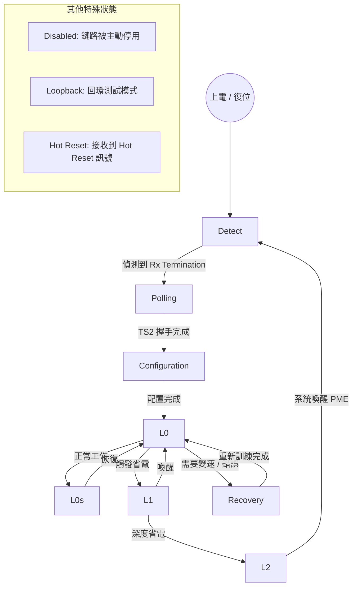

---

**各 State 詳細說明**

**① Detect（實體偵測）**

這是 LTSSM 的起始狀態，也是系統上電或任何重置後必定回到的起點。

- **進入條件**：上電復位、Hot Reset、或從 L2 喚醒
- **運作方式**：Downstream Port（Host 側）在差分對（Differential Pair）上週期性施加一個微弱的直流偏壓，然後偵測電流是否有被牽引。若 Upstream Port（EP 側）的 **Rx Termination 電阻**（通常 50 Ω）存在，則電壓會明顯下降，Host 從而確認「對端存在」。
- **超時行為**：若超過 12 ms 仍未偵測到任何反應，LTSSM 會在 Detect 狀態中等待，持續送測試訊號。

**② Polling（輪詢同步）**

兩端確認實體存在後，開始進行「初次握手」，目的是對齊時脈並完成最基本的位元同步。

- **Polling.Active**：雙方以 Gen1（2.5 Gbps）速率持續發送 **TS1 有序集（Ordered Sets）**，直到接收方偵測到 8 個連續的 TS1，確認 Bit Lock（位元鎖定）。
- **Polling.Compliance**：如果在一定時間內無法完成，某一側會進入 Compliance 模式（發送固定訊號），供工程師用示波器觀察 Eye Diagram，這是 SI（Signal Integrity）除錯的重要入口。
- **Polling.Configuration**：雙方改發 **TS2**，收到 8 個連續 TS2 後確認 Symbol Lock，準備進入 Configuration。

**③ Configuration（鏈路配置）**

這個狀態負責協商最終的實體連線參數。

- **Lane Number 協商**：RC 端先分配 Lane 編號（Lane 0 ~ Lane N-1），EP 回傳確認。如果某條 Lane 訊號太差，雙方可以協商降寬（例如 x8 降為 x4）。
- **Lane Reversal**：若 PCIe 走線為了 PCB 佈線方便做了鏡像翻轉，Configuration 狀態中的協商可以自動修正，無需額外韌體介入。
- **Link Number 確認**：分配最終的 Link 識別編號。
- **完成**：雙方交換最終的 TS2 確認，進入 L0。

**④ L0（正常工作）**

這是唯一可以傳送 TLP（Transaction Layer Packet）與 DLLP（Data Link Layer Packet）的狀態，也是整個 PCIe 系統的「工作模式」。

- **TLP 傳輸**：所有的 Memory Read/Write、Config Read/Write、Completion 封包都在此狀態流通。
- **Flow Control**：透過 UpdateFC DLLP 持續更新兩端的緩衝區剩餘空間。
- **心跳機制**：若鏈路上一段時間沒有 TLP，DLL 層會自動發送 **SKP Ordered Sets** 來維持同步與補償時脈偏差。

**⑤ Recovery（恢復 / 重訓練）**

這是 L0 的「緊急出口」，當需要改變速率、修復通訊錯誤，或從省電狀態快速喚醒時，都會先進入 Recovery。

- **觸發條件**：
  - 從 L0s / L1 喚醒回到 L0
  - 需要升速（如 Gen1 → Gen4）
  - 接收到過多的 CRC 錯誤（超過閾值）
  - 軟體寫入 `Retrain Link` 位元（韌體除錯常用）
- **Recovery.RcvrLock**：重新發 TS1，嘗試重新獲得 Bit Lock / Symbol Lock。
- **Recovery.Equalization**（Gen3 / Gen4 新增）：協商 Tx 等化參數（Preset / Coefficient），是 Gen3+ 速率能否穩定訓練成功的關鍵。如果 EQ 協商失敗，鏈路會降速重試。
- **回到 L0 或降速**：成功則進入 L0；若多次失敗則降一個速率等級重來（Gen4 → Gen3 → Gen2 → Gen1）。

**⑥ L0s（淺層省電）**

一種極快速切換的省電模式，延遲極低（恢復時間 < 1 μs）。

- **適用場景**：鏈路有資料但偶發空閒（Burst Traffic）的場景。
- **機制**：Transmitter 進入 Electrical Idle，Receiver 保持監聽。任一端需要發送 TLP 時，立即送出 FTS（Fast Training Sequence）喚醒對方，然後回到 L0。
- **注意**：L0s 是 **可選的（Optional）**，不是所有 PCIe 裝置都必須支援。

**⑦ L1（中度省電）**

比 L0s 更深的省電模式，功耗更低，但恢復時間較長（約 2~100 μs）。

- **觸發方式**：由 PM（Power Management）協議協商觸發，或 ASPM（Active-State Power Management）機制自動觸發。兩端都同意後才能進入。
- **子狀態**：
  - **L1.1**（如果支援 CLKREQ# 訊號）：關閉 Common Clock，進一步降低功耗。
  - **L1.2**（如果支援）：關閉 PLL 電路，達到最大省電效果，但喚醒時間也最長（約 100 μs）。
- **韌體開發警告**：在 AST2700 / DC-SCM 的 xHCI over PCIe 架構下，L1.2 的啟用是虛擬 USB 斷線的最常見元兇！需要在 ACPI / PCIe 驅動層面謹慎設定。

**⑧ L2（深層省電）**

主電源準備關閉前的狀態，僅保留少量輔助電（Vaux）維持 PME（Power Management Event）喚醒能力。

- **進入**：Host 通過軟體 PM 流程（如 ACPI S3/S4/S5）通知裝置進入 L2。
- **退出**：裝置發出 PME 事件（如按下電源鍵），LTSSM 從 Detect 重新開始完整訓練流程。

**⑨ Disabled（停用）**

鏈路被主動停用的狀態。在以下情況會進入：

- 軟體寫入 Link Disable 位元
- Crosslink 配置需要
- 從 Configuration 或 Recovery 失敗後達到最大重試次數

**⑩ Loopback（回環）**

特殊的測試/診斷模式。Downstream Port 成為 Loopback Master，Upstream Port 將所有收到的位元原封不動地反射回去，供工程師在 Master 端量測 BER（Bit Error Rate）與 Eye Diagram。

**⑪ Hot Reset（熱重置）**

當 Downstream Port 需要對 EP 進行重置（例如韌體 Recovery、OS 驅動重載），會觸發此狀態。EP 收到 Hot Reset 訊號後，所有內部狀態恢復到初始值，然後從 Detect 重新開始訓練。

---

**省電狀態層次總覽**

| 狀態 | 別名 | 恢復時間 | 功耗 | PHY 狀態 | 備註 |
|:--|:--|:--|:--|:--|:--|
| **L0** | Active | — | 最高 | 全開 | 唯一可傳 TLP 的狀態 |
| **L0s** | Standby | < 1 μs | 略低 | Tx 電氣空閒 | 可選，非強制 |
| **L1** | Suspend | 2~100 μs | 低 | 雙向電氣空閒 | ASPM 管理 |
| **L1.1** | — | ~10 μs | 更低 | PLL 開，Clock 關 | 需 CLKREQ# 支援 |
| **L1.2** | — | ~100 μs | 最低（非 L2）| PLL 關 | ⚠️ USB/BMC 斷線風險 |
| **L2** | Sleep | 10 ms+ | 趨近於零 | 幾乎全關 | 僅 Vaux 存活 |

---

**韌體 Debug 常用觀察點**

| 現象 | 最可能的 LTSSM 卡住位置 | 建議排查方向 |
|:--|:--|:--|
| 完全無 Link | Detect | 確認 Rx Termination、電源、LTSSM Enable 位元 |
| Link 停在 Gen1，無法升速 | Recovery.Equalization | 調整 Tx EQ Preset / Coefficient，確認 PCB 佈線損耗 |
| Link 頻繁掉線 | L0 → Recovery → L0 循環 | 查 AER 暫存器、LCRC 錯誤計數、重新調整 Tx 驅動強度 |
| USB 虛擬裝置隨機斷線 | L0 → L1.2 → Detect | 停用 ASPM L1.2（在 OS 或 BIOS 設定中禁用） |
| EP 無法被 Host 識別 | Polling / Configuration | 確認 TS1/TS2 是否有正確回應，檢查 PHY 初始化順序 |

1. **Detect (實體偵測)**：Host (伺服器 CPU) 會從金手指定期送出微弱的測試電訊號。如果另一端有插上設備 (如 AST2700)，因為晶片內部有硬體終端電阻 (Rx Termination)，Host 就會感覺到電流牽引，確認「實體上有人插上來了」。
2. **Polling (同步與打招呼)**：雙方開始瘋狂發送稱為 `TS1/TS2` 的訓練序列，目的是讓兩邊接收器的時鐘對齊 (Bit Lock / Symbol Lock)。
3. **Configuration (協商車道)**：雙方開始協商：「你有幾條車道？(Link Width)」、「你的通道訊號要不要反轉？(Lane Reversal)」。最後可能妥協決定：「好，我們降級用 x4 寬度來跑」。
4. **Recovery (飆速談判)**：預設大家剛認識都會先用最安全的 Gen1 (2.5 GT/s) 速度溝通。如果兩邊交換條件後發現雙方都支援 Gen4，就會在這裡切換電壓與頻率重練，把速度往上拉到 Gen4 (16 GT/s)。
5. **L0 State (連線開通)**：綠燈亮起！這代表硬體高速公路已全面開通，可以開始雙向傳送正式的 TLP 封包了。（如果在這邊卡住了，硬體 debug 也就是我們口中常說的 `Link Down`，這時候連軟體都不用看了，請硬體工程師先去查波形圖跟 PHY 參數設定）。


#### 第二階段：系統枚舉 (Enumeration)
硬體高速公路開通後，接下來就是 Host 端 BIOS 或是作業系統 (OS) 起床，開始沿著公路查戶口的時候了。這階段全靠 TLP 封包溝通。

1. **CFG Read**：Host OS 會發出唯一的 `Configuration Read TLP` 封包，掃描 PCIe 匯流排上的所有樹狀節點 (Bus, Device, Function)。
2. **Vendor ID / Device ID**：當 OS 點名掃到 AST2700 時，它必須回報自己的出廠身分證字號（例如 ASPEED 的原廠 Vendor ID 是 `0x1A03`）。如果 OS 讀到的是 `0xFFFF`，就代表這個插槽是空的。
3. **讀取 BARs**：OS 接著看該裝置填好的 `Base Address Registers (BAR)`，OS 會問：「你需要多大的記憶體空間來當作軟體對話的地盤？」。AST2700 (如設定為 VGA) 可能回答：「請給我 64MB」。
4. **MMIO 映射**：OS 聽完請求後，會從伺服器的系統實體記憶體池 (Physical Address Space) 中，切一塊真實的連續位址範圍，把它配給 AST2700，並把這個範圍寫回 AST2700 的 BAR 裡面。從此以後，Host CPU 軟體只要往這個記憶體位址寫資料，訊號就會自動被轉成 TLP 封包穿過 PCIe 公路直達 AST2700，這就是 **MMIO (Memory Mapped I/O)** 的精髓。
5. **Class Code**：最後，OS 看到你的配置空間身分證上頭寫著 `0C0330` (我是一張 xHCI USB 控制器)，就會從 Linux kernel 中自動喚醒相對應的驅動程式。此時，你的裝置才真正「活生生」地出現在系統裡！

#### 1.5.1 韌體介入

韌體開發在 PCIe 的整個生命週期中，負有三個極度關鍵的「介入時機」：

* **時機一：跑 LTSSM 之前 (PRE-LTSSM)**
  在硬體狀態機開始 Detect 之前，也就是 BMC 剛通電的第一秒，U-Boot (Bootloader) 或是極早期的 Kernel 初始化代碼就必須動手：
  * **設定 PHY 實體層參數**：你要先告訴硬體，現在的參考時鐘架構是什麼 (SRIS 或 SSC)？訊號的 Tx/Rx 預強波 (Equalization) 係數是多少？
  * **填寫配置空間 (Configuration Space)**：前一節提到的 Vendor ID、Device ID、BAR 空間大小乃至於 Class Code，通通都是要在硬體開始連線前，由韌體**預先寫入** AST2700 的 PCIe 暫存器裡的！(否則等一下 Host OS 查戶口會查出一張白紙)。
  * **扣下扳機 (Enable LTSSM)**：這點最重要！只要韌體工程師沒有去設定打開晶片內的 `LTSSM Enable` 控制位元，不管你金手指插得多緊，硬體的狀態機永遠都不會啟動。

* **時機二：LTSSM 卡關時 (Recovery / Link Down)**
  如果硬體打招呼失敗 (例如波形太爛卡在 Polling 迴圈、或是速度死活上不去 Gen4 掉回 Gen1)，高階的 BMC 韌體會設定抓取「Link Down」或「AER (Advanced Error Reporting)」的中斷訊號。此時韌體可以強制介入，切換不同的訊號補償參數 (Tx EQ)，然後手動戳一下 `Retrain Link` 暫存器，逼迫硬體狀態機「洗牌重練」。

* **時機三：L0 建立之後 (Active Phase)**
  這才是大家最熟知的正常階段。當進入 L0 且 Host OS 枚舉完成後，韌體的重點就會轉而操作 Mailbox (信箱中斷)、Doorbell (門鈴機制) 以及驅動大量的 DMA 引擎來進行高速的跨板資料搬運。

#### 1.5.2 Doorbell 機制

> [!IMPORTANT]
> **Doorbell 並非 PCIe 規範強制定義的標準機制。**
> 它是裝置廠商在自己的 BAR 空間中自行實作的「私有設計模式」，PCIe 規格書中找不到「Doorbell Register」這個欄位定義。只有特定類別的高性能 PCIe 裝置才會提供這個機制。

**哪些裝置有 Doorbell？**

Doorbell 機制通常出現在需要頻繁、高效率「Host ↔ EP 通知」的裝置上：

| 裝置類型 | 是否有 Doorbell | 說明 |
|:--|:--|:--|
| **NVMe SSD** | ✅ 有（規範強制） | NVMe 規格明確定義了 SQ/CQ Doorbell 暫存器的位置與格式，是 NVMe 協定的核心 |
| **RDMA 網卡（InfiniBand / RoCE）** | ✅ 有（廠商實作） | 用於 Work Queue 的提交通知，效能極關鍵 |
| **GPU（NVIDIA / AMD）** | ✅ 有（廠商私有） | 用於命令佇列提交，驅動程式直接操作 |
| **BMC EP（如 AST2700）** | ✅ 有（廠商實作） | 用於 Host 通知 BMC 有新管理命令待處理 |
| **一般 PCIe 網路卡（1G/10G NIC）** | ⚠️ 視廠商而定 | 部分有類似的 Tx Doorbell，部分使用 polling 或 MSI 輪詢 |
| **USB 控制器（xHCI over PCIe）** | ❌ 通常沒有 | 使用 xHCI 規範定義的 Doorbell Array（屬於 USB 規格，非 PCIe Doorbell）|
| **簡單的 PCIe GPIO / UART 擴充卡** | ❌ 沒有 | 只有基本的 MMIO 暫存器，Host 直接讀寫，不需要通知機制 |

> [!NOTE]
> **xHCI 的 Doorbell Array** 是 USB 3.0 規範（非 PCIe 規範）定義的機制，雖然名稱相同、概念相近，但兩者是獨立的不同規格。

**沒有 Doorbell 的裝置怎麼辦？**

對於不支援 Doorbell 的裝置，Host 與 EP 之間的同步通知通常改用以下替代方式：

1. **Polling（輪詢）**：Host 或 EP 定期主動讀取對方的狀態暫存器，確認是否有新任務。實作最簡單，但 CPU 佔用率高，不適合高頻操作。
2. **純 MSI-X 驅動**：EP 完成工作後直接發 MSI-X 中斷通知 Host；Host 沒有傳統意義的「按門鈴」動作，改用直接寫入 Command Register 或 Control Register 來觸發 EP 動作。
3. **Shared Memory Flag**：Host 和 EP 約定一塊共用記憶體區域，利用特定 Flag 欄位作為「虛擬門鈴」，再搭配定期輪詢或 MSI-X 觸發掃描。

---

**Doorbell（門鈴）** 是一種輕量級的「通知」機制，其本質是一個由 Endpoint（EP）對外暴露的特殊 MMIO 暫存器。就像字面意義一樣——Host 把資料準備好之後，對著 EP 按一下門鈴，告知 EP「東西放好了，請開門來拿」。


**運作原理**

Doorbell 機制的核心是一個寫入觸發流程：

1. **Host 準備資料**：Host CPU 或 DMA 引擎把要傳送的資料寫入雙方事先約定好的共享記憶體區域（通常由 EP 透過 BAR 映射對外提供）。
2. **Host 按門鈴**：Host 對 EP 的 Doorbell 暫存器執行一次 **MMIO Write**（Memory-Mapped Write TLP）。這個寫入動作本身攜帶的值通常代表「是哪個任務/佇列已就緒」的索引編號。
3. **EP 收到中斷**：EP（例如 AST2700）的硬體邏輯偵測到 Doorbell 暫存器被寫入，即觸發內部中斷，喚醒韌體中對應的 ISR（中斷服務程序）。
4. **EP 取走資料**：韌體從中斷中得知哪個佇列有資料，發起 DMA 或 MMIO Read 把資料搬走，並清除 Doorbell 暫存器。

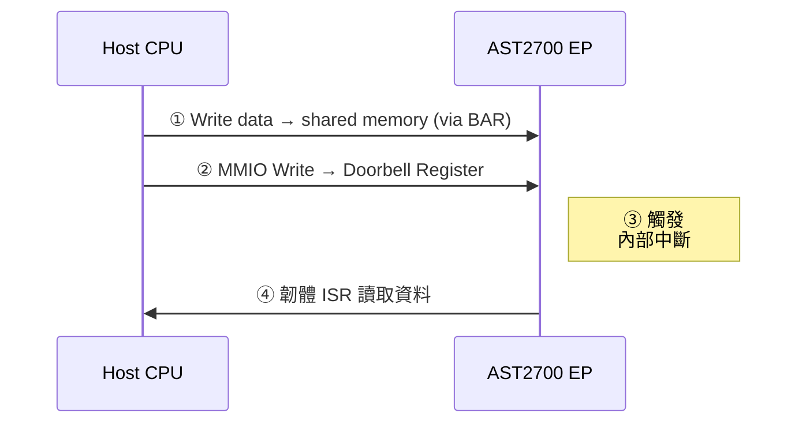

**Doorbell 的方向性**

Doorbell 機制本質上是**雙向的**，但需要兩套獨立的暫存器：

| 方向              | 實作方式                                           | 觸發目標         |
| :---------------- | :------------------------------------------------- | :--------------- |
| **Host → EP**     | EP 暴露 Doorbell 暫存器於 BAR 空間，Host 直接寫入 | EP 韌體 ISR      |
| **EP → Host**     | EP 發送 **MSI / MSI-X 中斷**（PCIe 標準中斷機制） | Host 驅動程式    |

> ⚠️ **注意**：EP 無法直接寫入 Host 側的記憶體來按門鈴，因此 EP 通知 Host 的標準做法是改用 **MSI-X（Message Signaled Interrupts Extended）**，這是 PCIe 規範中 EP 主動通知 Host 的正式機制，效果等同於反向的「門鈴」。

**Doorbell vs. Mailbox 的差異**

這兩個詞在韌體開發中常一起出現，但角色不同：

| 特性       | Doorbell（門鈴）                      | Mailbox（信箱）                             |
| :--------- | :------------------------------------ | :------------------------------------------ |
| **功能**   | 純「通知」訊號，告知對方「有事發生」  | 承載「內容」，用於傳遞少量控制指令或狀態值  |
| **資料量** | 極小（通常 1~4 Bytes，僅含佇列索引）  | 較大（數十到數百 Bytes 的結構化命令）        |
| **類比**   | 按門鈴                                | 在信箱裡放一封信                            |
| **常見用法** | 通知 DMA 佇列已填滿，請開始傳輸       | 傳遞 PCIe 管理命令（如重置、查詢狀態）      |

**AST2700 韌體開發實務**

在 AST2700 的 EP 韌體實作中，Doorbell 暫存器通常會被映射在 **BAR0** 的特定偏移地址，韌體需要完成以下設定：

1. **IRQ 映射**：在 EP 韌體初始化時，將 Doorbell 暫存器的寫入事件綁定到對應的中斷向量。
2. **ISR 實作**：中斷服務程序需讀取 Doorbell 暫存器的值，根據值的內容（佇列索引）決定要處理哪個工作。
3. **清除機制**：ISR 處理完後必須**顯式清除（Clear）** Doorbell 暫存器，否則硬體可能持續觸發重複中斷。

#### 1.5.3 PCIe 中斷機制（INTx / MSI / MSI-X）

PCIe 定義了三種 EP 通知 Host 的中斷方式，從舊到新依序演進。理解三者的差異，是韌體工程師設定中斷路由與撰寫 ISR 的基礎。

##### (A) INTx — 傳統虛擬中斷線（Legacy）

在傳統 PCI 時代，實體中斷線（INTA#、INTB#、INTC#、INTD#）是實際存在於金手指上的電氣訊號。進入 PCIe 後，硬體線路消失了，但為了向後相容，PCIe 保留了「模擬」這條中斷線的機制——透過一種叫做 **Assert_INTx / Deassert_INTx** 的特殊 TLP 封包，在 PCIe 鏈路上假裝仍然有線路被拉低。

* **優點**：相容性最佳，無須任何韌體設定。
* **缺點**：共享中斷（多個 EP 可能共用同一條 INTx），Host 端需輪詢判斷中斷來源，效率差。SR-IOV 與 MSI-X 環境下可能被強制禁用。
* **設定方式**：在 EP 的 Command Register（Offset `04h`）Bit 10（Interrupt Disable）**清零**即可啟用。

##### (B) MSI — 訊息式中斷

**MSI（Message Signaled Interrupts）** 是 PCIe 推薦的標準中斷方式。EP 不再拉電位，而是在需要發出中斷時，向 Host 端寫入一筆特定的 Memory Write TLP，Host 根據寫入的目標位址與資料值辨識中斷來源。

**運作原理：**

1. **Host OS 分配**：枚舉時，Host OS 從 MSI Capability Structure 中讀取 EP 需要幾個中斷向量（最多 32 個），並將對應的 **目標記憶體位址** 與 **資料值** 寫回 EP 的配置空間。
2. **EP 觸發**：EP 需要中斷時，直接發出一筆 Memory Write TLP，寫入 Host 指定的位址與資料。
3. **Host 處理**：Host 的中斷控制器（如 APIC）收到這筆寫入，對應觸發 CPU 的 IRQ 處理程序。

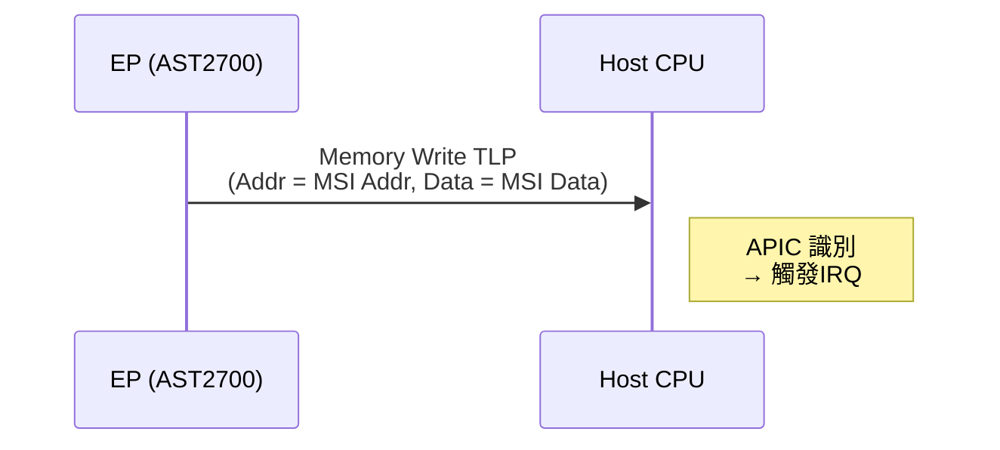

* **優點**：無共享問題，Host OS 自動管理向量分配。
* **限制**：每個 Function 最多 **32 個中斷向量**；不支援 Per-vector Masking（無法個別屏蔽某一個向量）。

##### (C) MSI-X — 擴充訊息式中斷（推薦）

**MSI-X（Message Signaled Interrupts Extended）** 是 MSI 的強化版本，也是現代高性能 PCIe 設備（如 NVMe SSD、高速網卡）的標準選擇。

與 MSI 的核心差異：

| 特性               | MSI                              | MSI-X                                       |
| :----------------- | :------------------------------- | :------------------------------------------ |
| **最大向量數**     | 32                               | **2048**                                    |
| **向量表位置**     | 存放於配置空間（有限）           | 存放於 **BAR 空間**（MSI-X Table，彈性大）  |
| **Per-vector Mask**| ❌ 不支援                        | ✅ 每個向量可獨立 Mask/Unmask               |
| **Pending Bit Array (PBA)** | ❌               | ✅ 可查詢哪些中斷正在等待處理              |

**MSI-X Table 結構：**

MSI-X 的向量表存放在 EP 的某個 BAR 空間中，每個 Entry 固定 16 Bytes：

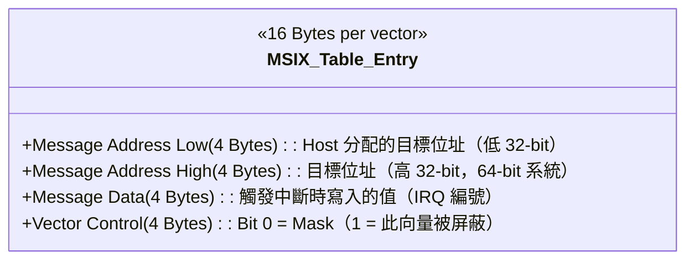

**三種中斷機制總覽比較**

| 特性               | INTx（傳統）         | MSI(MSI Legacy)      | MSI-X（推薦）         |
| :----------------- | :------------------- | :------------------- | :-------------------- |
| **實現方式**       | 虛擬電位拉低 TLP     | Memory Write TLP     | Memory Write TLP      |
| **最大向量數**     | 4（A/B/C/D）         | 32                   | 2048                  |
| **是否共享**       | 可能共享             | 不共享               | 不共享                |
| **Per-vector Mask**| ❌                   | ❌                   | ✅                    |
| **配置空間 Cap ID**| 無（預設行為）       | `05h`                | `11h`                 |
| **適用場景**       | 舊裝置相容           | 一般 EP 裝置         | NVMe、高速網卡、AST2700 |

> 💡 **韌體開發慣例**：現代 EP 韌體通常在配置空間同時宣告 MSI 與 MSI-X Capability，讓 Host OS 自行選擇最佳方式。Host 在枚舉時，如果偵測到 MSI-X 支援，通常會**優先使用 MSI-X**，並停用 MSI 與 INTx。

**AST2700 韌體開發實務**

在 AST2700 EP 韌體中設定 MSI-X 的典型流程：

1. **宣告 Capability**：在配置空間的 Capabilities Linked List 中加入 MSI-X Capability Structure（Cap ID = `11h`），填寫需要的向量數（Table Size）、MSI-X Table 在哪個 BAR 及偏移量、PBA 位置。
2. **等待 Host 填表**：Host OS 枚舉後會自動將 Message Address 與 Message Data 填入 MSI-X Table 的每個 Entry。
3. **觸發中斷**：EP 韌體需要通知 Host 時，直接由硬體發出對應 Entry 定義的 Memory Write TLP。大多數 SoC 會提供一個「Write-to-trigger」的控制暫存器，韌體只需寫入對應的向量編號即可。
4. **Mask 控制**：在某些情況下（如初始化未完成），韌體可透過設定 Vector Control 的 Bit 0 暫時屏蔽特定向量，避免 Host 提前收到中斷。

#### 1.5.4 SQ / CQ 佇列機制（Submission Queue / Completion Queue）

SQ/CQ 是 PCIe 裝置（尤其是 NVMe 儲存控制器）實現**高效非同步 I/O** 的核心資料結構。它將前幾節提到的 **Doorbell（通知 EP）** 與 **MSI-X（通知 Host）** 串接在一起，構成一個完整的請求—回應迴圈。

**設計理念**

傳統 I/O 介面（如 AHCI/SATA）採用「同步、單佇列」模型：Host 發一個命令，等 EP 完成後再發下一個，效率受限於往返延遲。SQ/CQ 引入了**非同步、多佇列**模型：Host 可以一次批次丟入多個命令，EP 並行處理，完成後各自回報，完全解耦了提交與完成的時序。

**核心資料結構**

SQ 和 CQ 都是存放在 **Host 記憶體**中的環形緩衝區（Ring Buffer），由 EP 透過 DMA 存取：

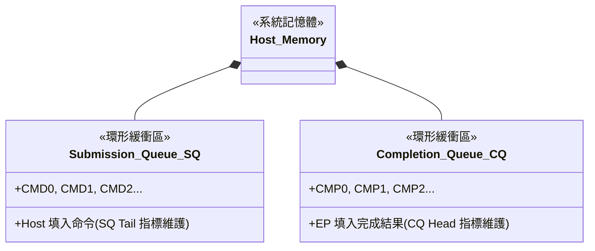

**指標分工：**

| 指標 | 全名 | 維護方 | 位置 |
|:--|:--|:--|:--|
| **SQ Tail** | SQ 尾指標 | **Host** | EP 的 Doorbell 暫存器 |
| **SQ Head** | SQ 頭指標 | **EP** | EP 內部 |
| **CQ Head** | CQ 頭指標 | **Host** | EP 的 Doorbell 暫存器 |
| **CQ Tail** | CQ 尾指標 | **EP** | EP 內部 |

**完整的一次 I/O 請求流程**

以下以 NVMe 讀取命令為例，展示 SQ/CQ 如何與 Doorbell、DMA、MSI-X 協作：

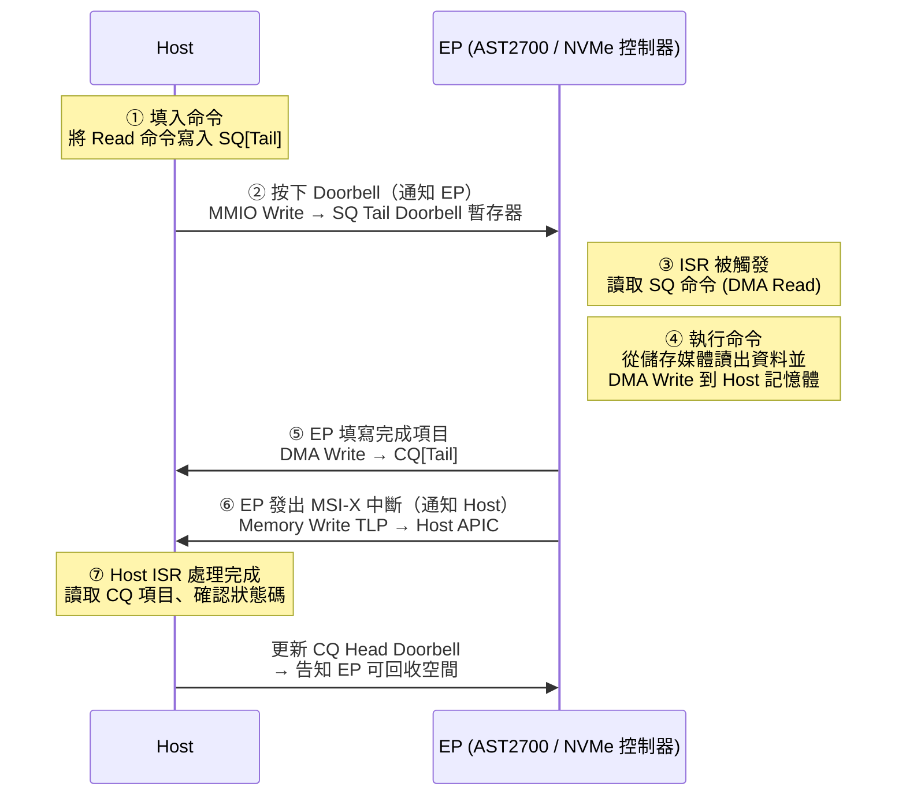

**多佇列帶來的並行優勢**

SQ/CQ 機制最強大之處在於支援**多組佇列對**。以 NVMe 為例，一個控制器可以有：

| 佇列類型 | 數量 | 用途 |
|:--|:--|:--|
| **Admin SQ/CQ**（管理佇列） | 固定各 1 組 | 傳遞控制命令（建立 I/O 佇列、識別裝置等） |
| **I/O SQ/CQ**（資料佇列） | 最多 65535 組 | 每個 CPU Core 或執行緒可獨佔一組，消除鎖競爭 |

每個 SQ 可以對應到一個獨立的 MSI-X 向量，使各 CPU Core 的 I/O 完成中斷互不干擾，實現真正的線性效能擴展。

> 💡 **為什麼 SQ Head 指標也要告訴 Host？**
> EP 在每次填寫 CQ 完成項目時，會把最新的 **SQ Head** 值一起夾帶在 CQ Entry 裡回傳給 Host。Host 收到後更新 SQ Head，才知道 EP 已消費掉哪些命令、SQ 環形緩衝區中哪些空間可以被覆寫重用，避免 Host 覆蓋 EP 尚未讀取的命令。

**與 Doorbell / MSI-X 的整合關係**

```
Doorbell（Host → EP）：Host 更新 SQ Tail 時使用
                       Host 更新 CQ Head 時使用（釋放 CQ 空間）

MSI-X（EP → Host）：  EP 填完 CQ Entry 後，觸發對應向量通知 Host
                       一個 I/O 佇列通常綁定一個獨立的 MSI-X 向量
```

**在 AST2700 / BMC 韌體開發中的應用**

AST2700 在 DC-SCM 架構中主要扮演 EP 角色，SQ/CQ 的典型應用場景有：

1. **虛擬 NVMe（vNVMe）模擬**：AST2700 韌體模擬一顆 NVMe 控制器，Host 端的 NVMe 驅動透過標準 SQ/CQ 機制下達 I/O 請求，韌體解析命令後從 BMC 本地 eMMC/SPI Flash 取資料，再透過 DMA 回填到 Host 記憶體。
2. **高速 Mailbox 通道擴充**：對於需要高吞吐量的跨板管理命令流，可設計輕量化的自訂 SQ/CQ 結構，取代單一 Mailbox 暫存器，允許同時在途（in-flight）多筆管理請求而不需等待前一筆完成。

#### 1.5.5 Mailbox 機制（信箱通訊）

> [!IMPORTANT]
> **Mailbox 不是 PCIe 規範定義的標準機制。**
> 與 Doorbell 相同，Mailbox 是廠商在自己的 BAR 空間（或廠商特定的 PCIe 能力擴充區域）中自行實作的「私有設計模式」，PCIe 規格書中並無此欄位定義。Mailbox 在 BMC/伺服器管理領域（如 ASPEED、Nuvoton 晶片）中極為常見，是 Host 與 BMC 之間交換管理命令的主要低速通道。

**Mailbox 的定義與核心概念**

Mailbox（信箱）是一組固定大小的 **共用暫存器（Shared Registers）**，Host 與 BMC 各自可讀、可寫其中的某些欄位，用來在不啟動 DMA、不需要大型緩衝區的前提下，交換少量的結構化控制訊息（如管理命令、狀態回報、韌體版本查詢等）。

**類比**：Doorbell 是「按門鈴告訴對方有包裹」；Mailbox 是「在信箱裡放一封信（帶內容的命令封包）」。實務上，兩者往往搭配使用：Host 把命令寫入 Mailbox，再按 Doorbell 通知 BMC 去讀。

---

**Mailbox 的資料結構**

Mailbox 通常以固定大小的暫存器組形式存在於 EP 的 BAR 空間中。以 AST2700 / AST2600 系列為例，一個典型的 Mailbox 佈局如下：

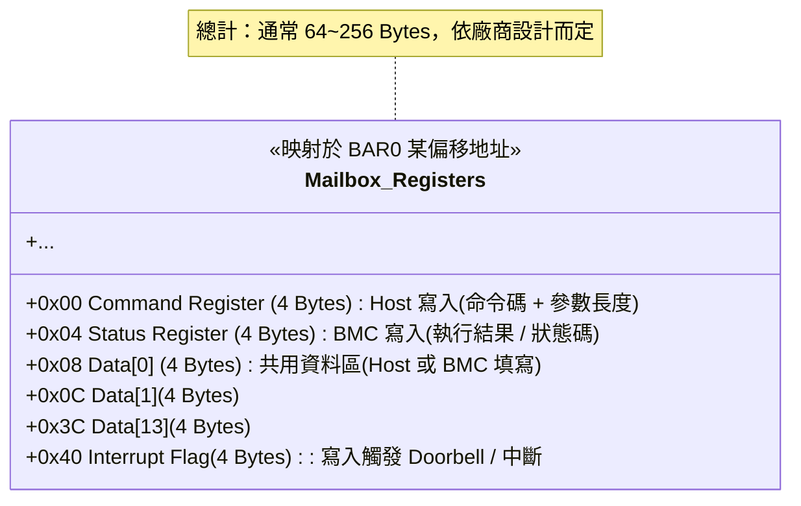

> [!NOTE]
> AST2600 硬體上直接內建了一組 **Hardware Mailbox（HW Mailbox）** 暫存器（共 32 個 32-bit 暫存器，總計 128 Bytes），並提供對應的硬體中斷訊號，可讓 Host（x86 CPU）與 BMC 直接透過硬體訊號互相通知，無需完整的 PCIe TLP 往返。

---

**Mailbox 雙向通訊完整流程**

以 Host 發送一條「查詢 BMC 韌體版本」管理命令為例：

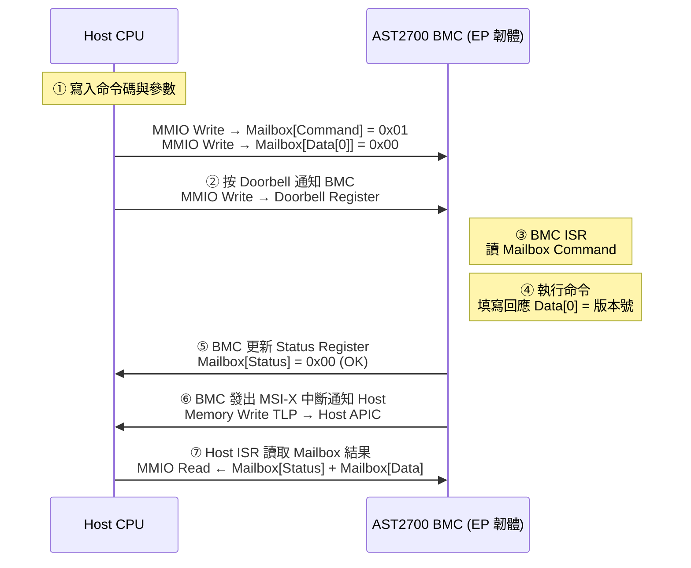

---

**Mailbox vs. Doorbell 差異完整對照**

| 特性               | Doorbell（門鈴）                          | Mailbox（信箱）                                   |
| :----------------- | :---------------------------------------- | :------------------------------------------------ |
| **核心功能**       | 純「通知」訊號，不攜帶業務資料            | 承載結構化「內容」，傳遞命令與回應資料            |
| **資料量**         | 極小（1~4 Bytes，僅含佇列索引或通知碼）   | 較大（64~256 Bytes 的命令封包）                   |
| **暫存器數量**     | 通常 1~N 個寫觸發暫存器                   | 多個欄位組成的暫存器陣列（Command/Status/Data）   |
| **讀寫分工**       | Host 寫入、EP 清除                        | Host 寫 Command/Data；EP 寫 Status/Data           |
| **使用時機**       | 通知 DMA 佇列更新、通知命令可取用         | 傳遞 IPMI OEM 命令、韌體更新請求、狀態查詢        |
| **搭配使用**       | 常與 Mailbox 搭配：先寫信箱、再按門鈴     | 常與 Doorbell + MSI-X 搭配構成完整通訊迴圈        |
| **類比**           | 按門鈴                                    | 在信箱裡放一封信                                  |

---

**Mailbox 與其他通訊機制的定位比較**

| 機制          | 典型資料量      | 延遲     | 適用場景                             |
| :------------ | :-------------- | :------- | :----------------------------------- |
| **Mailbox**   | 64~256 Bytes    | 低       | 管理命令、韌體狀態查詢、OEM 擴充指令 |
| **Doorbell**  | 1~4 Bytes       | 極低     | 佇列更新通知、事件觸發信號           |
| **DMA**       | KB ~ GB         | 高吞吐   | KVM 影像、Virtual Media 資料流       |
| **SQ/CQ**     | 命令 64 Bytes/筆| 非同步   | NVMe I/O 命令、高吞吐儲存存取        |
| **MSI-X**     | 無資料（純中斷）| 極低     | EP → Host 方向的非同步事件通知       |

---

**AST2700 Mailbox 韌體開發實務**

在 AST2700 的 EP 韌體中，Mailbox 的完整設定流程如下：

1. **BAR 空間規劃**：在 PCIe 配置空間初始化時，將 Mailbox 暫存器區塊配置在 BAR0（或 BAR2）的固定偏移地址。Host OS 枚舉後即可透過 MMIO 直接存取。

2. **中斷綁定**：
   - **Host → BMC 方向**：將 Doorbell 暫存器（通常緊鄰 Mailbox 區塊）的寫入事件綁定至 BMC 內部 IRQ，觸發 `mailbox_isr()`。
   - **BMC → Host 方向**：BMC 完成命令後，透過 MSI-X 控制暫存器觸發對應向量，通知 Host 驅動讀取結果。

3. **ISR 實作要點**：
   ```c
   void mailbox_isr(void) {
       uint32_t cmd = mmio_read32(MAILBOX_BASE + CMD_REG);
       uint32_t data0 = mmio_read32(MAILBOX_BASE + DATA0_REG);

       switch (cmd & 0xFF) {          // 低 8-bit 為命令碼
           case CMD_GET_FW_VER:
               mmio_write32(MAILBOX_BASE + DATA0_REG, FW_VERSION);
               mmio_write32(MAILBOX_BASE + STATUS_REG, STATUS_OK);
               break;
           case CMD_RESET:
               schedule_reset();      // 排程重置，不在 ISR 中直接執行
               mmio_write32(MAILBOX_BASE + STATUS_REG, STATUS_PENDING);
               break;
           default:
               mmio_write32(MAILBOX_BASE + STATUS_REG, STATUS_ERR_UNKNOWN);
       }

       clear_doorbell();              // 清除 Doorbell 中斷旗標
       trigger_msix(MSIX_VEC_MAILBOX);// 發 MSI-X 通知 Host 讀取結果
   }
   ```

4. **原子性保護**：由於 Mailbox 暫存器可被 Host 與 BMC 雙方存取，需確保命令寫入與 Doorbell 觸發之間的原子性。BMC 韌體應在 ISR 中第一時間讀取並鎖定 Mailbox 內容，避免 Host 在 BMC 處理期間覆寫資料。

5. **逾時處理（Timeout）**：Host 驅動程式發出命令後，應設定一個 Watchdog 計時器（通常 100 ms ~ 1 s）。若 BMC 未在期限內回應（Status 仍為 BUSY），Host 可記錄錯誤並選擇重試或上報。

> ⚠️ **開發警告**：Mailbox 暫存器的存取是透過 PCIe MMIO（TLP）完成的，因此所有對 Mailbox 的讀寫都必須在 **L0 狀態**下進行。若 PCIe 鏈路因 ASPM 進入 L1/L2 狀態，Host 對 Mailbox 的寫入將被擱置，直到鏈路恢復——這是 Mailbox 通訊在低功耗環境中的常見陷阱。

---

#### 1.5.6 MMBI 機制 (Memory-Mapped BMC Interface)

> [!NOTE]
> 隨著伺服器架構演進，DMTF（Distributed Management Task Force）定義了 **MMBI (Memory-Mapped BMC Interface)** 規範（DSP0282）與 **MCTP over MMBI** 傳輸綁定規範（DSP0284），試圖用一個業界標準來統一各家廠商自定義的 Doorbell 與 Mailbox 機制。

**MMBI 的核心概念**

MMBI 是一種基於共享記憶體（Shared Memory）的高速通訊介面，通常透過 **PCIe BAR** 或是 eSPI 介面將 BMC 的部分記憶體空間映射給 Host (主機 CPU) 存取。它的目標是為 Host 與 BMC 之間提供一個標準化的「帶內（In-band）」通訊通道，用來取代或輔助傳統速度較慢的 KCS (Keyboard Controller Style) 或 IPMI over SMBus/I2C。

**通訊架構與特徵**

MMBI 嚴格規範了暫存器佈局與通訊行為：

1. **標準化暫存器映射**：Host 透過存取 MMBI 的標準化暫存器（如 Control Register、Status Register）來了解 BMC 支援的能力與緩衝區位址。
2. **Tx / Rx 緩衝區**：定義了明確的傳送（Tx）與接收（Rx）緩衝區結構，用於傳遞較大的資料封包。
3. **MCTP 載體**：在現代 OpenBMC 架構中，MMBI 最重要的角色是作為 **MCTP (Management Component Transport Protocol)** 的底層傳輸通道（MCTP over MMBI）。這讓 PLDM、NVMe-MI 或 SPDM 等高層次協議封包能以前所未有的速度在 Host 與 BMC 間穿梭。

**MMBI vs. 傳統 Mailbox 的比較**

| 比較項目 | 傳統 Mailbox (如 ASPEED HW Mailbox) | MMBI (Memory-Mapped BMC Interface) |
| :--- | :--- | :--- |
| **標準化程度** | 廠商私有設計（Proprietary） | **DMTF 業界標準** (DSP0282/DSP0284) |
| **通用驅動** | 需要廠商提供專屬 Host 驅動或依賴客製化軟體 | 可使用 Linux 內建或泛用型 MCTP MMBI 驅動 |
| **承載協議** | 通常為 IPMI OEM 指令或裸資料 | 專為承載 **MCTP** 與進階管理協定設計 |
| **擴充性** | 受限於硬體暫存器數量（如 128 Bytes） | 透過記憶體映射，可彈性規劃更大的環形緩衝區 |

**在 AST2700 / OpenBMC 的實務應用**

在 AST2700 PCIe 韌體與 OpenBMC 環境中，開發者會面臨以下 MMBI 的設計與設定：

1. **PCIe Endpoint 配置**：韌體需要分配一塊 BAR 空間（例如 BAR1 或 BAR2）專門作為 MMBI 的共享記憶體區域。
2. **硬體中斷映射**：將 MMBI 規範中定義的 Host-to-BMC 中斷綁定到 AST2700 的內部中斷，並將 BMC-to-Host 中斷綁定至 MSI/MSI-X 向量。
3. **MCTP Daemon 整合**：在 OpenBMC 內部，這塊共享記憶體將由 `mctpd` 或專屬的 MMBI 驅動（如 `mctp-mmbi`）接管，將來自 PCIe 的訊號轉換為標準的 MCTP 封包，供上層的 PLDM 或 Redfish 服務使用。

---

#### 1.5.7 MCTP over PCIe VDM 機制

**MCTP (Management Component Transport Protocol)** 是伺服器內部網管元件溝通的標準語言。在 PCIe 環境下，MCTP 經常透過 **VDM (Vendor Defined Message)** 封包來傳輸，稱為 **MCTP over PCIe VDM**。這也是 DC-SCM 架構下 Host 與 BMC 之間最主流的高速管理通道。

**為什麼要用 VDM 傳輸 MCTP？**
PCIe 的 TLP 封包類型中，除了常見的 Memory Read/Write 之外，還有一種 Msg (Message) TLP。VDM 是一種特殊的 Msg TLP，允許設備廠商自定義封包內容。利用 VDM 傳輸 MCTP 有以下絕對優勢：
1. **不佔用 BAR 空間**：不需要像 Doorbell 或 Mailbox 那樣映射實體記憶體位置，完全透過獨立的訊息通道傳輸。
2. **穿透性極強**：VDM 封包的 Route 機制可以輕易穿過 PCIe Switch，實現 Root Complex 與多個 Endpoint 之間，甚至是 **EP 與 EP 之間的點對點直接通訊**。
3. **帶內高速傳輸**：相較於 I2C/SMBus 等慢速介面，PCIe VDM 提供了極高的頻寬，對傳輸大型的 SPDM 憑證或 PLDM 韌體更新包非常有利。

**MCTP over VDM 封裝結構**
當一筆 MCTP 訊息透過 PCIe VDM 傳送時，其封包結構宛如俄羅斯娃娃：

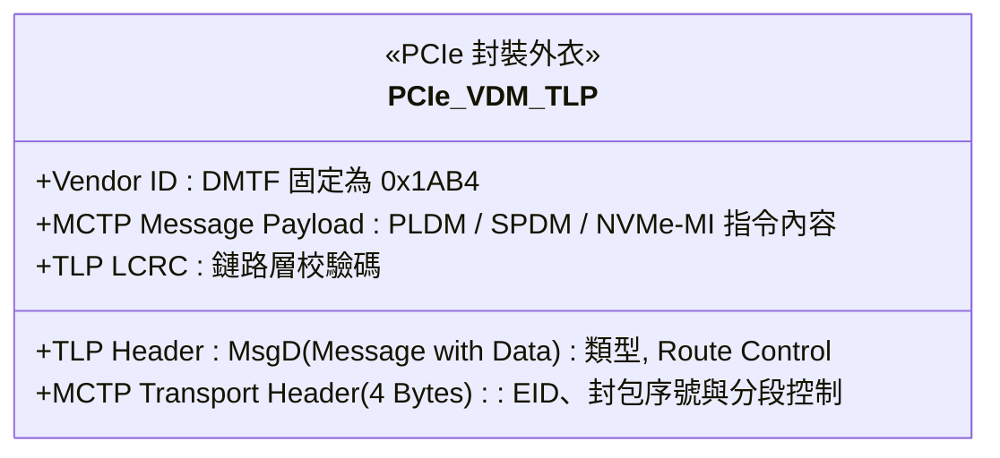

**在 AST2700 韌體中的實作重點：**
在 AST2700 韌體開發中，處理 MCTP over VDM 需要留意以下環節：
1. **VDM 控制器啟用**：AST2700 內建了硬體層級的 MCTP/VDM 控制器，韌體需設定將其綁定至對應的 PCIe Function，並確保配置空間的 VDM Enable 位元已開啟。
2. **EID 動態分配**：端點 ID (Endpoint ID) 是 MCTP 的網址。AST2700 啟動後，需透過 MCTP Control Message 向 Host 端的 Bus Owner 請求分配專屬的 EID。
3. **收發與中斷處理**：當 AST2700 硬體收到目標為自己 EID 的 VDM 封包時，會將 Payload 放入內部 FIFO 並觸發中斷。韌體 ISR 需快速將資料取出，轉交給 OpenBMC 的 `mctpd` 服務進行高階協議解析。

---

#### 1.5.8 Msg TLP (訊息封包) 深度解析

在 PCIe 協定中，**Msg TLP（Message Transaction Layer Packet，訊息封包）** 是一種非常特殊且重要的封包類型。

如果說 Memory Read/Write TLP 是用來「搬運實際的資料」，那麼 **Msg TLP 就是用來「傳遞系統事件與控制訊號」的虛擬實體線**。

##### 1. Msg TLP 的存在意義：虛擬化實體線路

在早期的傳統 PCI 時代，主機板上的插槽有許多專屬的實體腳位，用來傳遞特定訊號，例如：
*   實體中斷線（INTA#, INTB#...）
*   錯誤回報線（SERR#, PERR#）
*   電源管理訊號線（PME#）

到了 PCIe 時代，為了大幅減少實體接腳數量（改走高速序列傳輸），PCIe 協定把這些「實體線路的電位變化」，全部打包成數位化的網路封包來傳送——這種封包就是 **Msg TLP**。

##### 2. Msg TLP 的兩大類型

根據是否攜帶額外資料，Msg TLP 分為兩種：
*   **Msg (Message without Data)**：純通知訊號，不帶 Payload。封包只有 16 Bytes 的 Header。
*   **MsgD (Message with Data)**：除了通知外，還夾帶實質資料。封包由 16 Bytes Header + Payload 構成。

##### 3. Msg TLP 的路由方式 (Routing)

一般的 Memory TLP 是靠「記憶體位址 (Address)」來決定怎麼走；但 Msg TLP 通常沒有記憶體位址，它依靠 TLP Header 中的 **Route Control (路由控制)** 欄位來決定去向。常見的路由方式有：
1.  **Route to Root Complex**：不管在哪，直接往上發給 CPU (最常見於錯誤回報)。
2.  **Broadcast from RC**：由 CPU 往下廣播給全系統的所有設備。
3.  **Local / Implicit**：只發送給相鄰的 PCIe Switch 或設備。
4.  **Route by ID**：精準指定目標設備的 Bus / Device / Function (BDF) 進行點對點傳送。

##### 4. 常見的 Msg TLP 種類 (Message Codes)

Msg TLP 的 Header 中有一個 **Message Code (8-bit)** 欄位，用來定義這個封包到底代表什麼事件。常見的群組包含：

| 訊息類別 | 典型 Message Code | 說明 |
| :--- | :--- | :--- |
| **傳統中斷 (INTx)** | `Assert_INTA` / `Deassert_INTA` | 模擬傳統 PCI 的實體中斷線拉低與放開。 |
| **電源管理 (PM)** | `PM_PME`, `PME_Turn_Off` | 設備喚醒主機，或主機通知設備準備斷電。 |
| **錯誤回報 (Error)**| `ERR_COR`, `ERR_FATAL` | 設備通知 Root Complex 發生了可糾正或致命的硬體錯誤。 |
| **熱插拔 (Hot-Plug)**| `Attention_Button_Pressed` | 通知系統有人按下了 PCIe 插槽旁的退出按鈕。 |
| **自定義訊息 (VDM)** | `0x7E` (Type 0) / `0x7F` (Type 1) | **Vendor Defined Message (廠商自定義訊息)**。 |

---

##### 5. 與 AST2700 / BMC 開發最相關的 Msg TLP：VDM

對於負責 OpenBMC 與 AST2700 韌體開發的工程師來說，最需要關注的 Msg TLP 就是 **VDM (Vendor Defined Message, Msg Code = `0x7E` / `0x7F`)**。

如同您在文件中 `1.5.7 MCTP over PCIe VDM 機制` 區塊所看到的，VDM 賦予了 PCIe 極大的擴充彈性：
1.  **不吃 BAR 空間**：BMC 不需要映射任何 Host 的實體記憶體，就能透過 VDM 封包直接與 Host 對話。
2.  **強大的穿透力**：因為 VDM 可以使用 "Route by ID"（指定 BDF），所以 AST2700 (BMC) 可以直接發送 VDM Msg TLP 穿過 PCIe Switch，**精準命中插在主機板上的另一張 NVMe 網卡或 GPU**，進行直接的網管控制（MCTP 協議），完全不需要 Host CPU 軟體的介入。

**總結來說**：
Msg TLP 是 PCIe 高速公路上的「警車、救護車與郵務車」，它們不搬運一般應用程式的記憶體資料，而是負責維持整個 PCIe 系統底層運作（報錯、省電、中斷）以及傳遞高階管理指令（如 VDM/MCTP）的關鍵機制。

---

### 1.6 Multi-Function Device (MFD) 機制

#### 1.6.1 設備如何宣告自己是 MFD：Header Type Register

在 PCIe Configuration Space 的固定 64 Byte Header 中，偏移量 **`0x0E`** 的位置是 **Header Type Register**（8-bit）。這個暫存器被切成兩個欄位：

| 位元範圍 | 欄位名稱                | 說明                                               |
| :------- | :---------------------- | :------------------------------------------------- |
| Bit 7    | **Multi-Function 旗標** | **1** = Multi-Function Device；**0** = Single-Function |
| Bit 6:0  | Header Layout Type      | `0x00` = Type 0（Endpoint）；`0x01` = Type 1（Bridge） |

**韌體只需要在 Configuration Space 初始化時，將 Bit 7 設為 1，Host 即可識別為 MFD。**

> ⚠️ **開發注意**：軟體在判斷 Header Type（Type 0 / Type 1）時，必須先用 `& 0x7F` 把 Bit 7 遮罩掉，才能正確讀出 Layout Type，避免誤判。

一個典型的 MFD 範例如下所示，三個 Function 共享同一個 Device Number：

```
Bus 0, Device 3, Function 0  ←  Header Type Bit7 = 1 → MFD 旗標
Bus 0, Device 3, Function 1  ←  另一個獨立功能 (e.g., Audio)
Bus 0, Device 3, Function 2  ←  又一個功能 (e.g., USB)
```

#### 1.6.2 Host 如何得知有幾個 Function：暴力掃描

Host 並**不**靠一個「Function 數量暫存器」來得知答案，而是透過 **逐一探測 (Brute-force Scanning)** 的方式確認。

**DeviceID 欄位結構**

在 CfgRd0 TLP Header 中，DeviceID 包含三個子欄位：

```
DeviceID = Bus[7:0] : Device[4:0] : Function[2:0]
```

Host 只需改變低 3-bit 的 Function Number，即可依序對同一個 Device 下的 Function 0 ~ 7 發送 **Configuration Read Request**：

| 目標       | DeviceID  |
| :--------- | :-------- |
| Function 0 | 001:00:**0** |
| Function 1 | 001:00:**1** |
| Function 2 | 001:00:**2** |
| …          | …         |
| Function 7 | 001:00:**7** |

**判斷依據：Vendor ID 是否有效**

Host 讀取每個 Function 的 **Vendor ID (Offset 00h)**：

* **非 `0xFFFF`**：Function 存在，繼續讀取並初始化該 Function。
* **`0xFFFF`**：無硬體回應，該 Function 不存在，跳過。

**掃描邏輯虛擬碼（Pseudo Code）**

```c
// 讀取 Function 0
if (Read_HeaderType(Func0) & 0x80) {   // Bit 7 = 1，是 MFD
    for (int func = 1; func < 8; func++) {
        uint16_t vid = Read_VendorID(func);
        if (vid != 0xFFFF) {
            Initialize_Function(func);  // 發現並初始化
        }
        // 0xFFFF → 此 Function 不存在，繼續下一個
    }
} else {
    // Single-Function Device，不掃 Func 1~7
}
```

> 💡 **ARI 延伸**：在支援 **ARI (Alternative Routing-ID Interpretation)** 的設備（如 SR-IOV 虛擬化場景）中，一個 Device 可突破 8 個 Function 的限制，擴展至最多 **256 個 Function**。此時 Host 透過 Capability 串列中的 **Next Function Pointer** 來鏈式尋找，而非線性掃描 0~7。

---

## 1.7 附錄：xHCI Doorbell Array（USB 規範的門鈴機制）

在 `1.5.2` 節中提到，**xHCI 的 Doorbell Array 並非 PCIe Doorbell**，兩者雖然名稱與概念相近，卻是完全獨立的規格。本節針對 xHCI Doorbell Array 進行完整說明，特別適用於理解 AST2700 虛擬 xHCI 控制器的韌體設計。

---

### 1.7.1 xHCI Doorbell Array 的規範背景

**xHCI（eXtensible Host Controller Interface）** 是 Intel 主導制定的 USB 3.x 主機控制器規範，向下相容 USB 2.0/1.1。xHCI 的 Doorbell Array 是規範中**明確定義**的一組通知暫存器，用來讓 **xHCI 驅動程式（軟體）** 通知 **xHCI 控制器硬體**：「某個佇列有新工作進來了，請去處理」。

> [!IMPORTANT]
> xHCI Doorbell Array 存在於 **xHCI 控制器的 MMIO 暫存器空間**中，是 USB 規格書（Intel xHCI Spec）定義的欄位，與 PCIe 規格書完全無關。無論這顆 xHCI 控制器是實體晶片還是 AST2700 模擬出來的虛擬裝置，都必須遵循相同的 Doorbell 暫存器佈局。

---

### 1.7.2 Doorbell Array 在 xHCI 記憶體空間中的位置

xHCI 控制器對外暴露的 MMIO 空間（透過 PCIe BAR 映射）被分為三個主要區域：

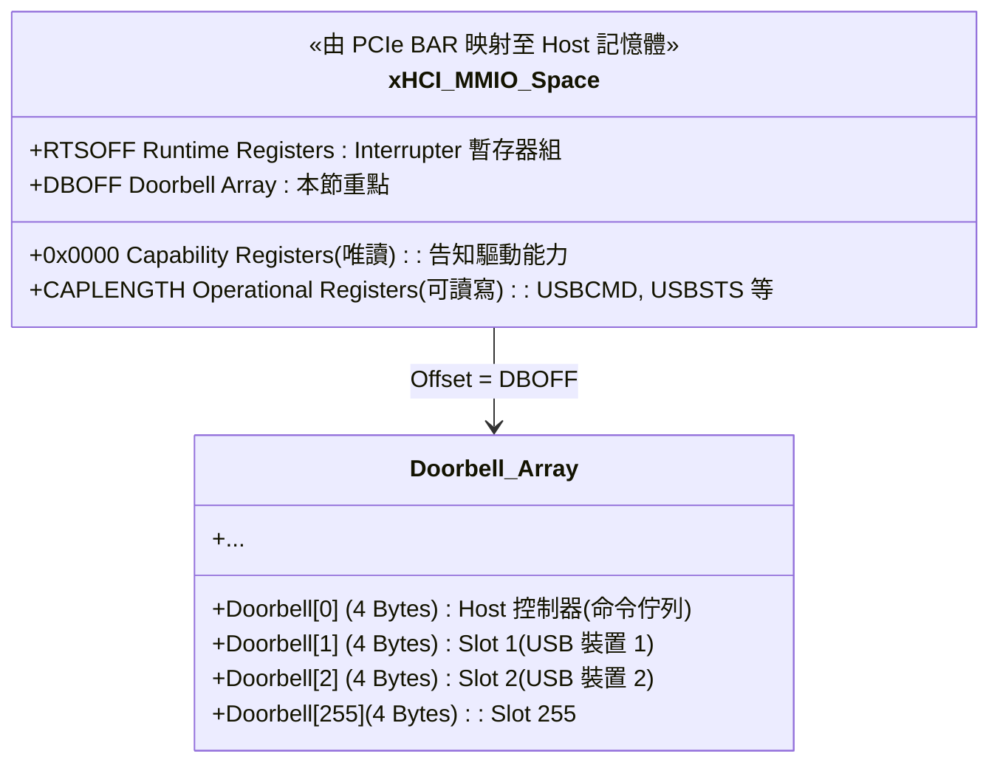

**DBOFF**（Doorbell Offset Register）：位於 Capability Registers 中，儲存 Doorbell Array 相對於 MMIO 基底位址的偏移量（4 Bytes 對齊）。驅動程式在初始化時讀取此值，才知道 Doorbell Array 放在哪裡。

---

### 1.7.3 Doorbell Register 資料結構（每個 4 Bytes）

每個 Doorbell Register 是一個 32-bit 的寫入觸發暫存器：

```
Bit 31:16  Stream ID   (16 bits) ── 串流 ID（用於 USB 3.x SuperSpeed Stream）
Bit 15:8   Reserved    (8 bits)  ── 保留，必須寫 0
Bit 7:0    DB Target   (8 bits)  ── 端點索引（Endpoint Target）
```

**Doorbell[0]（索引 0）— Host Controller Doorbell**

這個是「控制器自己的門鈴」，驅動程式用來通知控制器「Command Ring 上有新命令」。
- Bits 7:0 必須寫入 `0`（固定值）
- Bits 31:16 保留，寫 `0`

**Doorbell[1] ~ Doorbell[255]（索引 1~255）— Slot Doorbell**

每個 USB 裝置對應一個 Slot（由 Enable Slot 命令分配），每個 Slot 最多可有 31 個端點（Endpoint）。
- **Bits 7:0（DB Target）**：指定要通知的端點編號：
  - `0` = 控制端點（EP0，Bi-directional）
  - `1` = EP1 OUT，`2` = EP1 IN，`3` = EP2 OUT，`4` = EP2 IN，最大 `31`
- **Bits 31:16（Stream ID）**：針對 USB 3.x 的 Stream 協定，指定目標 Stream 編號（不用 Stream 則填 `0`）。

---

### 1.7.4 xHCI 驅動的完整通知流程

以驅動程式傳送 USB Bulk OUT 傳輸為例：

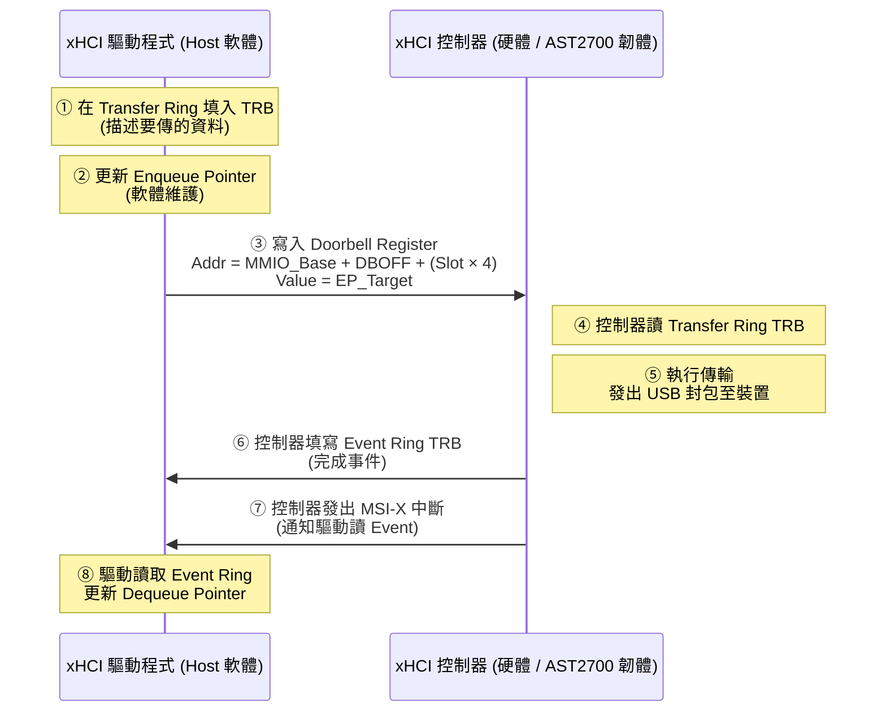

> 💡 **關鍵觀察**：步驟 ③（驅動寫 Doorbell）= Host 按 Doorbell 通知 EP；步驟 ⑦（控制器發 MSI-X）= EP 用 MSI-X 通知 Host。兩個方向構成一次完整的 xHCI 傳輸迴圈。

---

### 1.7.5 xHCI Doorbell Array vs. PCIe Doorbell 差異對照

| 特性 | xHCI Doorbell Array | PCIe Doorbell（廠商自定）|
|:--|:--|:--|
| **規範來源** | USB xHCI 規格書（Intel 制定）| PCIe 規格書中**無定義**，為廠商私有設計 |
| **強制性** | **強制**，所有 xHCI 控制器都必須實作 | 可選，只有特定裝置才有 |
| **暫存器位置** | MMIO 空間中固定由 DBOFF 指向 | 廠商自行決定在 BAR 空間的偏移 |
| **通知對象** | xHCI 控制器硬體（告知有 TRB 待處理）| PCIe EP 韌體（告知有資料或命令）|
| **索引意義** | Slot 編號 + 端點編號 | 廠商定義（通常是佇列索引）|
| **在 AST2700 的角色** | 模擬 xHCI 時必須正確回應這些寫入 | 作為 PCIe EP 時暴露給 Host 的私有暫存器 |

---

### 1.7.6 對 AST2700 虛擬 xHCI 韌體的意義

當 AST2700 透過 PCIe 對 Host 呈現一顆 **虛擬 xHCI 控制器**（Class Code = `0C0330`）時，韌體必須在 BAR 空間中完整模擬 xHCI 規範定義的暫存器佈局，包括 Doorbell Array：

1. **DBOFF 設定**：在 Capability Registers 中正確填寫 Doorbell Array 的偏移量，讓 xHCI 驅動程式能找到正確位址。

2. **Doorbell 寫入攔截**：Host 的 xHCI 驅動對 Doorbell Array 執行 MMIO Write 時，AST2700 的 PCIe 控制器觸發內部中斷，ISR 需要：
   - 解析寫入值（Slot 索引 + Endpoint Target + Stream ID）
   - 從對應的 Transfer Ring 取出 TRB
   - 執行 USB 虛擬傳輸（Virtual Hub、Virtual Mass Storage 等）

3. **Event Ring 回寫**：傳輸完成後，韌體將 Completion TRB 寫入 Event Ring，發出 MSI-X 中斷通知 Host 驅動讀取結果。

這整個流程就是 AST2700 實現 **KVM 鍵鼠** 和 **Virtual Media（虛擬光碟）** 功能的底層機制。

---
> 📌 本文件整合自開發者筆記與技術對話紀錄，適用於 AST2700 PCIe 韌體工程師參考。
