# PCIe 協定與韌體開發核心

> 本文件整理 AST2700 PCIe 韌體開發與 OpenBMC 實務中常見的核心議題，涵蓋 PCIe 封包結構、PCIe Configuration Space、鏈路建立與枚舉流程、Doorbell / MSI-X / SQ-CQ 通訊機制，以及 Multi-Function Device 宣告方式。適用於 AST2700 PCIe 韌體與 BMC 系統開發參考。

---

## 目錄

- [一、PCIe 基礎封裝與 Configuration Space](#一pcie-基礎封裝與-configuration-space)
  - [1.1 PCIe 封包封裝結構](#11-pcie-封包封裝結構-tlp-encapsulation)
    - [1.1.1 一般 TLP Header 大小](#111-一般-tlp-header-大小)
    - [1.1.2 Non-Flit and Flit modes](#112-non-flit-and-flit-modes)
    - [1.1.3 MCTP over PCIe VDM 封裝](#113-mctp-over-pcie-vdm-封裝)
  - [1.2 PCIe Configuration Space 實務](#12-pcie-configuration-space-實務)
    - [1.2.4 MMIO Read / Write 與 Inbound / Outbound](#124-mmio-read--write-與-inbound--outbound)
  - [1.3 PCIe 中斷機制（INTx / MSI / MSI-X）](#13-pcie-中斷機制intx--msi--msi-x)
- [二、PCIe 鏈路、枚舉與生命週期管理](#二pcie-鏈路枚舉與生命週期管理)
  - [2.1 PCIe 鏈路建立與系統枚舉流程](#21-pcie-鏈路建立與系統枚舉流程-link-training--enumeration)
  - [2.2 PCIe Power Saving](#22-pcie-power-saving)
  - [2.3 PCIe Reset 機制](#23-pcie-reset-機制)
  - [2.4 韌體介入時機](#24-韌體介入時機)
- [三、Host/BMC 通訊機制與 TLP 行為](#三hostbmc-通訊機制與-tlp-行為)
  - [3.1 Doorbell 機制](#31-doorbell-機制)
  - [3.2 SQ / CQ 佇列機制](#32-sq--cq-佇列機制submission-queue--completion-queue)
  - [3.3 Mailbox 機制](#33-mailbox-機制信箱通訊)
  - [3.4 MMBI 機制](#34-mmbi-機制-memory-mapped-buffer-interface)
  - [3.5 MCTP over PCIe VDM 機制](#35-mctp-over-pcie-vdm-機制)
  - [3.6 Msg TLP 解析](#36-msg-tlp-訊息封包-解析)
  - [3.7 TLP Ordering Rules（排序規則）](#37-tlp-ordering-rules排序規則)
  - [3.8 Completion 與錯誤回應](#38-completion-與錯誤回應completion-status--timeout)
- [四、PCIe RC / EP 模式與多功能裝置](#四pcie-rc--ep-模式與多功能裝置)
  - [4.1 PCIe Root Complex 模式](#41-pcie-root-complex-模式)
  - [4.2 PCIe Endpoint 模式（Linux PCI Endpoint Framework）](#42-pcie-endpoint-模式linux-pci-endpoint-framework)
  - [4.3 Multi-Function Device (MFD) 機制](#43-multi-function-device-mfd-機制)
- [五、PCIe 虛擬 USB 與 xHCI](#五pcie-虛擬-usb-與-xhci)
  - [5.1 PCIe 虛擬 USB：xHCI 控制器架構](#51-pcie-虛擬-usbxhci-控制器架構-usb-over-pcie)
  - [5.2 實務總結：鍵盤與 USB 存取場景對照表](#52-實務總結鍵盤與-usb-存取場景對照表)
- [六、附錄：xHCI Doorbell Array](#六附錄xhci-doorbell-arrayusb-規範的門鈴機制)
  - [6.7 KVM 鍵鼠事件與 xHCI 資料路徑分界](#67-kvm-鍵鼠事件與-xhci-資料路徑分界)

---

## 一、PCIe 基礎封裝與 Configuration Space

### 1.1 PCIe 封包封裝結構 (TLP Encapsulation)

PCIe 封包由 Transaction Layer 產生 TLP，再由 Data Link Layer 與 Physical Layer 補上鏈路傳輸所需資訊。

| 層級 | 封裝內容 | 主要目的 |
| :--- | :--- | :--- |
| Transaction Layer | TLP Header、Data Payload、Optional ECRC | 定義封包類型、路由、長度與實際承載資料。 |
| Data Link Layer | Sequence Number、LCRC、ACK/NAK | 提供鏈路層排序、錯誤偵測與重傳。 |
| Physical Layer | Framing、Ordered Set、Encoding | 將資料轉成實體 link 上可傳輸的 bit stream。 |

#### 1.1.1 一般 TLP Header 大小

`1 DW = 4 Bytes`。TLP Header 依 `Fmt` 與 `Type` 欄位決定格式，常見為 `3 DW` 或 `4 DW`。

| Header 格式 | 大小 | 常見用途 |
| :---: | :---: | :--- |
| `3 DW` | 12 Bytes | 32-bit Address Memory TLP、Configuration TLP、Completion TLP |
| `4 DW` | 16 Bytes | 64-bit Address Memory TLP、Message / MsgD、Vendor Defined Message |

以 Memory Request 為例：

| DW | 3 DW Header | 4 DW Header |
| :---: | :--- | :--- |
| DW0 | `Fmt`、`Type`、`TC`、`Attr`、`Length` 等共通欄位 | `Fmt`、`Type`、`TC`、`Attr`、`Length` 等共通欄位 |
| DW1 | `Requester ID`、`Tag`、`First DW BE`、`Last DW BE` | `Requester ID`、`Tag`、`First DW BE`、`Last DW BE` |
| DW2 | Address `[31:2]` | Address `[63:32]` |
| DW3 | 無 | Address `[31:2]` |

**TLP Header 共通欄位（DW0 / DW1）**

DW0 與 DW1 是大多數 TLP 共用的欄位，也是韌體除錯時最常觀察的部分：

| 欄位 | 位置 | 說明 |
| :--- | :---: | :--- |
| `Fmt[2:0]` | DW0 | 決定 Header 大小與有無 data：`000b`=3DW 無 data、`001b`=4DW 無 data、`010b`=3DW 帶 data、`011b`=4DW 帶 data。`Msg` 與 `MsgD` 即由此區分。 |
| `Type[4:0]` | DW0 | 與 `Fmt` 共同決定 TLP 類型（`MRd` / `MWr` / `Cfg` / `Cpl` / `Msg` 等）。 |
| `TC[2:0]` | DW0 | Traffic Class，配合 Virtual Channel 做服務品質分流，一般資料多走 TC0。 |
| `Attr` | DW0 | 包含 `RO`（Relaxed Ordering）、`NS`（No Snoop）、`IDO`，影響排序與 cache coherency。 |
| `TD` | DW0 | 是否附帶 ECRC（TLP Digest）。 |
| `EP` | DW0 | Poisoned TLP 標記，表示 payload 已知含錯。 |
| `Length[9:0]` | DW0 | payload 長度，以 DW 為單位；`0` 代表 1024 DW，對應最大 4 KB payload。 |
| `Requester ID` | DW1 | 發起者 BDF，Completion 依此 ID 做 routing 回送。 |
| `Tag` | DW1 | Non-Posted request 的識別碼，用來配對回傳的 Completion。 |
| `First / Last DW BE` | DW1 | Byte Enable，標示第一個與最後一個 DW 中哪些 byte 有效。 |

> **韌體重點**：`Fmt` 決定 3DW/4DW 與有無 payload，是解析任何 TLP 的第一步；`Tag` 加上 `Requester ID` 則是追查 Non-Posted（如 `MRd`）有沒有收到對應 Completion 的關鍵。

#### 1.1.2 Non-Flit and Flit modes

PCIe 封包在 link 上實際傳輸時，可分成 **Non-Flit Mode** 與 **Flit Mode** 兩種封裝模型。兩者的 Transaction Layer 語意仍以 TLP 為核心，但 Data Link / Physical Layer 對「封包邊界、CRC、重傳與錯誤修正」的處理方式不同。

> **精確說法**：PCIe 5.0 以前的 Base Specification 使用 Non-Flit Mode。Flit Mode 是 PCIe 6.0 引入的模式，`64.0 GT/s` PAM4 必須使用 Flit Mode；PCIe 6.x 裝置在較低 link speed 下也可支援 Flit Mode。因此不要只用「目前跑 Gen 幾速度」判斷，而要看裝置/鏈路是否進入 Flit Mode。

| 模式 | 規格 / link operation | 傳輸單位 | 封包特徵 | 韌體觀察重點 |
| :--- | :---: | :--- | :--- | :--- |
| **Non-Flit Mode** | PCIe 1.0 ~ 5.0 的傳統模式；PCIe 6.x 也保留相容操作 | Variable-size TLP / DLLP | TLP 與 DLLP 以可變長度封包在 link 上傳送，Data Link Layer 使用 Sequence Number、LCRC、ACK/NAK 做鏈路可靠性。 | Firmware / driver 通常直接以 TLP 類型、BAR、MSI-X、VDM 等角度理解資料流。 |
| **Flit Mode** | PCIe 6.0 引入；`64.0 GT/s` PAM4 必要，且 PCIe 6.x 可在所有 link speeds 支援 | Fixed-size 256-byte FLIT | 多個 TLP / DLLP 可被打包進固定大小 FLIT，搭配 FEC、CRC 與新的鏈路層處理以適應 PAM4 高速傳輸。 | 上層仍看 TLP 語意，但硬體 trace / analyzer 會看到 FLIT 邊界與 padding。 |

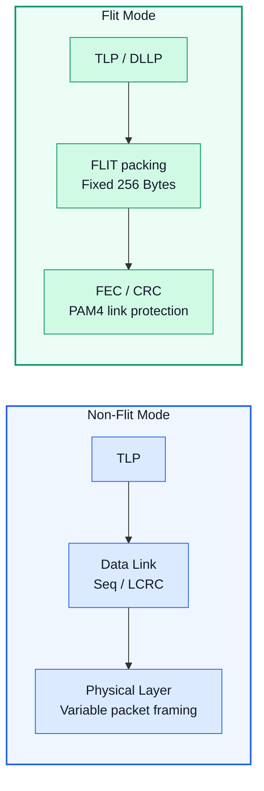
```mermaid
flowchart LR
    subgraph NF["Non-Flit Mode"]
        A1["TLP"] --> B1["Data Link<br/>Seq / LCRC"]
        B1 --> C1["Physical Layer<br/>Variable packet framing"]
    end

    subgraph FM["Flit Mode"]
        A2["TLP / DLLP"] --> B2["FLIT packing<br/>Fixed 256 Bytes"]
        B2 --> C2["FEC / CRC<br/>PAM4 link protection"]
    end

    style NF fill:#eff6ff,stroke:#2563eb,stroke-width:2px,color:#111827
    style FM fill:#ecfdf5,stroke:#059669,stroke-width:2px,color:#111827
    style A1 fill:#dbeafe,stroke:#2563eb,color:#111827
    style B1 fill:#dbeafe,stroke:#2563eb,color:#111827
    style C1 fill:#dbeafe,stroke:#2563eb,color:#111827
    style A2 fill:#d1fae5,stroke:#059669,color:#111827
    style B2 fill:#d1fae5,stroke:#059669,color:#111827
    style C2 fill:#d1fae5,stroke:#059669,color:#111827
```

**Non-Flit Mode 重點**

- **封包長度可變**：Memory Read / Write、Configuration、Completion、Message / VDM 等 TLP 依 header、payload 與 digest 大小形成不同長度。
- **DLLP 獨立存在**：ACK、NAK、Flow Control Update 等 DLLP 可與 TLP 分開傳送。
- **鏈路層重傳清楚**：Sequence Number、LCRC、Replay Buffer 是分析傳統 Non-Flit link 問題時常見的觀察點。
- **AST2700 / BMC 實務**：目前多數韌體開發情境仍以 Non-Flit 的 TLP 語意為主，例如 BAR MMIO、MSI-X、Doorbell、MCTP over PCIe VDM。

**Flit Mode 重點**

- **固定 256 Bytes 邊界**：FLIT 是 PCIe 6.0 引入的傳輸單位，TLP 可能跨 FLIT，也可能多個小 TLP 共用一個 FLIT。
- **為 PAM4 設計**：PCIe 6.0 使用 PAM4 提高傳輸率，但 bit error rate 較高，因此導入 FEC 與更適合固定區塊處理的 FLIT 封裝。
- **上層語意不變**：Software / firmware 看到的仍是 Memory TLP、Completion TLP、Msg TLP 等交易語意；差異主要在 controller、PHY 與 analyzer 觀察層。
- **除錯方式改變**：若使用 PCIe analyzer 觀察 Gen6 link，需要同時理解 FLIT、FEC、CRC、padding 與 TLP 解包結果，不能只用傳統可變長度 TLP 邊界來判斷。

| 開發問題 | Non-Flit 思考方式 | Flit 思考方式 |
| :--- | :--- | :--- |
| BAR MMIO write 為何沒進 EP？ | 檢查 Memory Write TLP、L0、BAR enable、Memory Space Enable。 | 上層檢查相同，但 analyzer 需確認 TLP 是否被正確 pack / unpack 到 FLIT。 |
| MSI-X 中斷沒送達 | 檢查 MSI-X Table、Bus Master Enable、Memory Write TLP 是否發出。 | TLP 語意相同，再加看 FLIT-level error / retry / FEC 狀態。 |
| MCTP VDM timeout | 檢查 MsgD TLP routing、BDF、link state、completion/timeout policy。 | 同樣檢查 VDM TLP，低階 trace 需從 FLIT 中解出 MsgD。 |

> **韌體判斷原則**：Non-Flit / Flit 是 link-layer 傳輸封裝差異，不是 BAR、MSI-X、MCTP 或 Configuration Space 的軟體模型差異。寫 driver 或 firmware 時，先把 TLP 語意處理正確；遇到 PCIe 6.0 / Gen6 硬體或 analyzer trace 時，再往 FLIT 層追查。

#### 1.1.3 MCTP over PCIe VDM 封裝

MCTP over PCIe VDM 使用 PCIe `MsgD` / Vendor Defined Message 承載 MCTP。封包格式如下：

<table>
  <tr>
    <th style="text-align:center;">Offset</th>
    <th style="text-align:center;">區塊</th>
    <th style="text-align:center;">大小</th>
    <th style="text-align:center;">主要欄位</th>
  </tr>
  <tr style="background:#dbeafe;">
    <td style="text-align:center;">Byte 0</td>
    <td><strong>PCIe Medium-Specific Header</strong></td>
    <td style="text-align:center;">4 Bytes</td>
    <td>Type、TC、OHC、TS、Attr、Length</td>
  </tr>
  <tr style="background:#dbeafe;">
    <td style="text-align:center;">Byte 4</td>
    <td><strong>PCIe Medium-Specific Header</strong></td>
    <td style="text-align:center;">4 Bytes</td>
    <td>PCI Requester ID、Pad Len、MCTP VDM Code、Message Code = Vendor Defined</td>
  </tr>
  <tr style="background:#dbeafe;">
    <td style="text-align:center;">Byte 8</td>
    <td><strong>PCIe Medium-Specific Header</strong></td>
    <td style="text-align:center;">4 Bytes</td>
    <td>PCI Target ID 或 reserved、Vendor ID = 0x1AB4</td>
  </tr>
  <tr style="background:#dcfce7;">
    <td style="text-align:center;">Byte 12</td>
    <td><strong>MCTP Transport Header</strong></td>
    <td style="text-align:center;">4 Bytes</td>
    <td>Rsvd、Header Version、Destination EID、Source EID、SOM/EOM/PktSeq/TO/Msg Tag</td>
  </tr>
  <tr style="background:#fef3c7;">
    <td style="text-align:center;">Byte 16</td>
    <td><strong>MCTP Packet Payload</strong></td>
    <td style="text-align:center;">Variable</td>
    <td>IC、Message Type、MCTP Message Header、MCTP Message Data</td>
  </tr>
  <tr style="background:#f3f4f6;">
    <td style="text-align:center;">Tail</td>
    <td><strong>Optional Trailer</strong></td>
    <td style="text-align:center;">Variable</td>
    <td>Message Integrity Check、Padding、Optional TLP Digest / ECRC</td>
  </tr>
</table>

| 顏色 | 對應區塊 |
| :---: | :--- |
| <span style="display:inline-block;width:48px;height:14px;background:#dbeafe;border:1px solid #93c5fd;"></span> | PCIe / TLP medium-specific header |
| <span style="display:inline-block;width:48px;height:14px;background:#dcfce7;border:1px solid #86efac;"></span> | MCTP Transport Header |
| <span style="display:inline-block;width:48px;height:14px;background:#fef3c7;border:1px solid #facc15;"></span> | MCTP Message Header / Payload |
| <span style="display:inline-block;width:48px;height:14px;background:#f3f4f6;border:1px solid #d1d5db;"></span> | Optional trailer / digest |

`Byte 0 ~ Byte 11` 為 PCIe medium-specific 欄位，`Byte 12 ~ Byte 15` 為 MCTP Transport Header，MCTP message payload 從 `Byte 16` 開始。

**Type and Routing（5 bits）欄位**

PCIe Medium-Specific Header 的 `Type[4:0]` 同時表示這是一筆 **Message TLP**，以及 Switch 應採用哪種 Message routing：

| Type bit | 名稱 | MCTP over PCIe VDM 定義 |
| :---: | :--- | :--- |
| `[4:3]` | Message Type | 固定設為 `10b`，表示 PCIe Message。 |
| `[2:0]` | PCI Message Routing（`r2:r1:r0`） | 指定 Message TLP 在 PCIe fabric 中的路由方式。 |

| `Type[2:0]` | 完整 `Type[4:0]` | Routing 名稱 | 路由方向 / 用途 |
| :---: | :---: | :--- | :--- |
| `000b` | `10000b` | **Route to Root Complex** | Endpoint 沿 Upstream 方向將訊息送往 RC-side path。 |
| `010b` | `10010b` | **Route by ID** | 使用 PCI Target ID（BDF）送到指定 PCIe Function。 |
| `011b` | `10011b` | **Broadcast from Root Complex** | Root Complex 將訊息向 PCIe hierarchy 的 Downstream branches 廣播。 |

> **MCTP 限制：** MCTP over PCIe VDM 只支援上述三種 routing value；其他 `Type[2:0]` 值不支援。`Msg` 與 `MsgD` 是否攜帶 data payload 則由 TLP 的 `Fmt` 欄位區分，不是由這 3 個 routing bits 決定。

**常見 TLP 類型速查**

| TLP 類型 | 說明 |
| :--- | :--- |
| `Memory Read, MRd` | 讀 `Memory Space`，需要 `Completion` 回應。 |
| `Memory Write, MWr` | 寫 `Memory Space`，通常是 `Posted`，不需要 `Completion`。 |
| `I/O Read / I/O Write` | `Legacy I/O Space`，用在較舊相容設計，現代系統較少用。 |
| `Configuration Read / Write Type 0` | 設定同一個 Bus 上的 Endpoint。 |
| `Configuration Read / Write Type 1` | 經過 Bridge/Switch 往下游 Bus 做 Configuration。 |
| `Message, Msg` | 傳遞中斷、PM、Hot-Plug、Error 等訊息；`VDM (Vendor Defined Message)` 也屬於此類。 |
| `Message with Data, MsgD` | `Message` 類型，但會額外攜帶資料 payload；`MCTP over PCIe VDM` 常見使用此類。 |
| `Completion, Cpl` | 回應 Read / Config / I/O 等 `Non-Posted Request`，不帶資料。 |
| `Completion with Data, CplD` | `Completion` 且帶回資料，例如 `Memory Read` 的回傳資料。 |
| `AtomicOp` | 原子操作，例如 `FetchAdd`、`Swap`、`CAS`，常見於高階 PCIe 裝置。 |

### 1.2 PCIe Configuration Space 實務

PCIe Configuration Space 是 Host 認識裝置的標準資訊區。系統枚舉時，Root Complex 會送出 Configuration Read / Write TLP，讀取每個 Function 的 Vendor ID、Device ID、Class Code、BAR 與 Capability List，藉此判斷裝置身分、配置 MMIO 空間，並載入對應驅動。

AST2700 作為 Endpoint (EP) 時，對 Host 呈現的是 **Type 0 Configuration Space Header**。Type 0 用於一般 Endpoint；Type 1 則用於 PCIe Bridge / Switch Port。

#### 1.2.1 Configuration Space 存取機制（ECAM）

Host CPU 不能直接對 Configuration Space 下 load/store，必須透過 **ECAM（Enhanced Configuration Access Mechanism）** 把存取轉成 Configuration Read / Write TLP。ECAM 將整個 Configuration Space 平坦映射到一段 MMIO，CPU 直接以記憶體位址存取，每個 Function 提供完整 4 KB，是存取 Extended Configuration Space 的標準方式。

**ECAM 位址計算**

ECAM 把 `Bus / Device / Function / Register` 編碼進實體位址：

```text
Address = ECAM_Base
        + (Bus      << 20)
        + (Device   << 15)
        + (Function << 12)
        + Register_Offset
```

每個 Function 佔 `4 KB`（`1 << 12`），每個 Device 最多 8 個 Function，每條 Bus 最多 32 個 Device。CPU 對該位址讀寫時，Root Complex 會自動轉成 Configuration Read / Write TLP 送到目標 Function。

**256 Bytes vs 4 KB**

| 範圍 | 名稱 | 內容 |
| :--- | :--- | :--- |
| `00h ~ FFh`（256 B） | PCI Compatible Config Space | Type 0/1 Header（Vendor/Device ID、Command、BAR…）與 `34h` 起的 standard Capability List。 |
| `100h ~ FFFh`（至 4 KB） | PCIe Extended Config Space | Extended Capability（AER、SR-IOV、DSN、ACS 等），只能透過 ECAM 存取。 |

> **AST2700 EP 實務**：若要讓 Host 看到 AER、SR-IOV 等進階能力，韌體必須讓 EP 支援 4 KB Extended Config Space，且平台 ECAM 區段要涵蓋該 BDF；只靠 legacy `CF8/CFC` 無法觸及 `100h` 以後的 Extended Capability。

#### 1.2.2 Host 枚舉時會看什麼

| 欄位 | 作用 | 對 AST2700 EP 的意義 |
| :--- | :--- | :--- |
| Vendor ID / Device ID | 標識廠商與裝置 | 讓 Host 辨識這是特定 ASPEED / 平台裝置。 |
| Class Code | 宣告裝置類型 | 決定 Host 可能載入哪一類驅動，例如 xHCI、NVMe 或 vendor-specific driver。 |
| Header Type | 宣告 header 格式 | Endpoint 使用 Type 0；若 Bit 7 設為 1，表示 Multi-Function Device。 |
| BAR0 ~ BAR5 | 宣告 MMIO / I/O 視窗需求 | Host 依 BAR 大小配置位址，之後可透過 Memory TLP 存取 EP 內部資源。 |
| Capability Pointer | 指向標準 capability linked list | Host 由此找到 MSI、MSI-X、PCIe Capability、Power Management 等能力。 |
| Interrupt Pin / Line | 傳統 INTx 相容欄位 | 現代 PCIe 裝置多使用 MSI / MSI-X，但仍可能保留相容資訊。 |

#### 1.2.3 BAR 與 MMIO 映射

BAR (Base Address Register) 用來告訴 Host：「這個 Endpoint 需要多少 MMIO 空間」。枚舉時 Host 會先探測 BAR 大小，再分配系統實體位址，最後寫回 BAR。

**BAR 低位元結構**

BAR 的低位元不是位址，而是描述這個視窗的屬性；Host 在 sizing 時會先遮罩掉這些 bit：

| Bit | 名稱 | 說明 |
| :---: | :--- | :--- |
| Bit 0 | Memory / I/O Space | `0`=Memory BAR、`1`=I/O BAR。現代 PCIe Endpoint 多用 Memory BAR。 |
| Bit[2:1] | Type | `00b`=32-bit BAR；`10b`=64-bit BAR，會吃掉相鄰的下一個 BAR 當作高 32-bit。 |
| Bit 3 | Prefetchable | `1` 表示此區無讀取副作用、可被 Host 預取與 write-combine，常見於 frame buffer。 |
| Bit[n:4] | Base Address | 實際位址欄位；sizing 時保持為 `0` 的最低位元數即代表所需空間大小。 |

> **韌體重點**：一個 64-bit BAR 會佔用兩個連續 slot（如 BAR0 + BAR1），因此 BAR0~BAR5 實際能宣告的視窗數量會變少。BAR 大小與 alignment 必須是 2 的次方，這也是 sizing 能用「回傳值中低位元 `0` 的個數」推算空間大小的前提。

完成 BAR 配置後，Host CPU 對該 MMIO 位址的讀寫會被 Root Complex 轉成 PCIe Memory Read / Write TLP，送到 AST2700 Endpoint。BAR 對應的 MMIO 空間就是 Host driver 操作裝置暫存器、佇列與中斷表的主要入口。

不同裝置類型會在 BAR MMIO 中放置不同內容：對 **xHCI** 這類標準控制器，BAR 內的 Capability / Operational / Runtime Registers 與 Doorbell Array 由 xHCI 規範定義；對支援 **MSI-X** 的 PCIe 裝置，MSI-X Table / PBA 由 PCIe capability 指定所在 BAR 與 offset；對 vendor-specific 裝置，Mailbox、Queue Register 或私有 Doorbell 則由廠商規格自行定義。

#### 1.2.4 MMIO Read / Write 與 Inbound / Outbound

MMIO 的本質是 **CPU 對某段實體位址執行 load/store，但該位址背後不是 DRAM，而是 PCIe BAR 或 controller 轉譯視窗**。PCIe controller 會把這些存取轉成 Memory TLP；方向則要以「站在哪個 PCIe controller 觀察」來判斷。

| 操作 | PCIe TLP | 是否需要回應 | 常見用途 | 韌體觀察重點 |
| :--- | :--- | :---: | :--- | :--- |
| **MMIO Read** | `Memory Read (MRd)` | 需要 `Completion with Data (CplD)` | 讀狀態暫存器、capability、read pointer、doorbell 狀態。 | 延遲較敏感；若 link、BAR、Memory Space Enable 或 completion path 有問題，CPU 端常看到 timeout 或讀回錯誤值。 |
| **MMIO Write** | `Memory Write (MWr)` | 通常是 `Posted`，不等 completion | 寫控制暫存器、doorbell、write pointer、MSI/MSI-X。 | 寫入不代表對端軟體已處理；需注意 ordering、write flush、interrupt 與狀態回讀。 |

**Inbound / Outbound 是相對於 PCIe controller 的 address translation 方向：**

| AST2700 角色 | 方向 | 交易例子 | 位址轉譯意義 |
| :--- | :---: | :--- | :--- |
| **AST2700 作為 EP** | **Inbound** | Host 對 AST2700 BAR 做 MMIO read/write。 | PCIe link 進來的 Memory TLP 命中 EP BAR，被轉成 AST2700 內部暫存器或 SRAM / buffer 存取。 |
| **AST2700 作為 EP** | **Outbound** | AST2700 bus master / DMA 寫 Host memory，或送 MSI/MSI-X Memory Write。 | AST2700 主動發起 PCIe Memory TLP，目標是 Host 分配的 system memory 或 MSI/MSI-X address。 |
| **AST2700 作為 RC** | **Outbound** | BMC CPU/driver 存取下游 Endpoint BAR，例如 `ioremap()` 後讀寫裝置暫存器。 | AST2700 RC 將 BMC 端 MMIO window 轉成往下游 PCIe hierarchy 的 Memory Read / Write TLP。 |
| **AST2700 作為 RC** | **Inbound** | 下游 Endpoint DMA 寫回 BMC memory。 | 下游裝置發出的 Memory TLP 進入 AST2700 RC，需被轉到 BMC memory；通常牽涉 inbound region、DMA mask 或 IOMMU policy。 |

**Host 分配 system memory 的位置與流程**

PCIe Endpoint 不能自己「分配」Host DRAM。Host system memory 是由 **Host OS / Host driver** 依資料路徑需求配置，再把可供 device 使用的 **DMA address** 或 descriptor 位址告訴 Endpoint。對 AST2700 EP 來說，它看到的是 Host driver 寫進 BAR register、queue descriptor、command descriptor 或 MSI/MSI-X table 的 address，不是直接參與 Host 記憶體配置。

| 記憶體 / 位址類型 | 誰分配 | 分配結果放在哪裡 | AST2700 / EP 如何使用 |
| :--- | :--- | :--- | :--- |
| **BAR MMIO address** | Host PCI core enumeration | Host 將分配的 base address 寫回 EP 的 BAR。 | Host CPU 對此 address 做 MMIO read/write；EP inbound BAR logic 接收 Memory TLP。 |
| **DMA coherent buffer** | Host driver，例如 Linux `dma_alloc_coherent()` | Driver 取得 CPU virtual address 與 DMA address。 | Driver 把 DMA address 寫入 EP register 或 descriptor；EP 用 Bus Master DMA 讀寫該 buffer。 |
| **Streaming DMA buffer** | Host driver，例如 Linux `dma_map_single()` / `dma_map_page()` | Driver 將既有 buffer map 成 DMA address，完成後 unmap。 | 常用於一次性資料傳輸；EP 依 descriptor 中的 DMA address 搬資料。 |
| **SQ / CQ ring** | Host driver | Queue memory 建好後，把 SQ/CQ base address、size、doorbell offset 等設定給 EP。 | EP DMA read SQ command，DMA write CQ completion，再用 MSI/MSI-X 通知 Host。 |
| **MSI / MSI-X target address** | Host OS interrupt/MSI framework | MSI capability 或 MSI-X table 中的 Message Address / Message Data。 | EP 發 Memory Write TLP 到該 address；這是中斷投遞，不是一般資料 buffer。 |

典型流程是：Host driver 配置 DMA buffer 或 queue memory → 取得 device 可見的 DMA address → 透過 BAR MMIO 或 queue descriptor 把 address 交給 EP → EP 在 `Bus Master Enable` 開啟後發起 Memory Read / Write TLP → 傳輸完成後用 status、CQ entry 或 MSI/MSI-X 回報。若系統有 IOMMU，EP 使用的 DMA address 通常是 IOVA，不一定等於 Host DRAM 的實體位址。

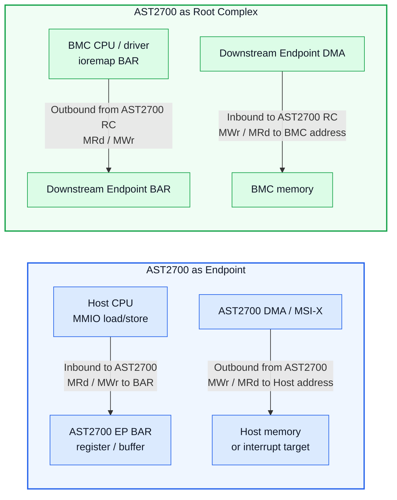
```mermaid
flowchart LR
    subgraph EP_MODE["AST2700 as Endpoint"]
        H1["Host CPU<br/>MMIO load/store"] -->|Inbound to AST2700<br/>MRd / MWr to BAR| E1["AST2700 EP BAR<br/>register / buffer"]
        E2["AST2700 DMA / MSI-X"] -->|Outbound from AST2700<br/>MWr / MRd to Host address| H2["Host memory<br/>or interrupt target"]
    end

    subgraph RC_MODE["AST2700 as Root Complex"]
        B1["BMC CPU / driver<br/>ioremap BAR"] -->|Outbound from AST2700 RC<br/>MRd / MWr| D1["Downstream Endpoint BAR"]
        D2["Downstream Endpoint DMA"] -->|Inbound to AST2700 RC<br/>MWr / MRd to BMC address| B2["BMC memory"]
    end

    style EP_MODE fill:#eff6ff,stroke:#2563eb,stroke-width:2px,color:#111827
    style RC_MODE fill:#f0fdf4,stroke:#16a34a,stroke-width:2px,color:#111827
    style H1 fill:#dbeafe,stroke:#2563eb,color:#111827
    style E1 fill:#dbeafe,stroke:#2563eb,color:#111827
    style E2 fill:#dbeafe,stroke:#2563eb,color:#111827
    style H2 fill:#dbeafe,stroke:#2563eb,color:#111827
    style B1 fill:#dcfce7,stroke:#16a34a,color:#111827
    style D1 fill:#dcfce7,stroke:#16a34a,color:#111827
    style D2 fill:#dcfce7,stroke:#16a34a,color:#111827
    style B2 fill:#dcfce7,stroke:#16a34a,color:#111827
```

> **判斷口訣**：CPU 端看到的是 MMIO address；PCIe link 上看到的是 Memory Read / Write TLP；controller 端要確認的是 inbound / outbound window 是否把 PCIe address 與本地 bus address 正確互轉。`Memory Space Enable` 影響 BAR MMIO 是否可被回應，`Bus Master Enable` 影響裝置能否主動發起 DMA 或 MSI/MSI-X Memory Write。

#### 1.2.5 Command Register

`Command Register` 位於 Type 0 Header offset `04h`，控制裝置是否能回應特定類型的存取。

| Bit | 名稱 | 作用 |
| :---: | :--- | :--- |
| Bit 0 | I/O Space Enable | 允許裝置回應 I/O Space 存取；現代 PCIe Endpoint 較少使用。 |
| Bit 1 | Memory Space Enable | 允許裝置回應 BAR 對應的 MMIO Memory 存取。若未啟用，Host 對 BAR 的 Memory TLP 不應被裝置正常處理。 |
| Bit 2 | Bus Master Enable | 允許裝置主動發起 Memory Read / Write，例如 DMA 寫回 Host memory 或送出 MSI/MSI-X Memory Write。 |

對 AST2700 這類 BMC Endpoint 來說，`Memory Space Enable` 決定 Host 能不能操作 BAR；`Bus Master Enable` 則影響 DMA、MSI/MSI-X 與主動推送資料能力。

#### 1.2.6 Capability Linked List

標準 capability list 的起點在 Type 0 Header offset `34h`。每個 capability 由 `Capability ID` 與 `Next Pointer` 串接，Host 會沿著 linked list 探索裝置支援的功能。

| Capability ID | 名稱 | 實務用途 |
| :---: | :--- | :--- |
| `0x01` | Power Management | 電源狀態、PME、D-state 管理。 |
| `0x05` | MSI | Message Signaled Interrupts，使用 Memory Write TLP 送中斷。 |
| `0x10` | PCI Express Capability | PCIe 裝置、Link、Slot 與錯誤相關能力。 |
| `0x11` | MSI-X | 多向量中斷，常用於高效能 queue 或多功能裝置。 |

因此，Configuration Space 可視為 Endpoint 對 Host 的「自我描述」。AST2700 韌體或 EPF driver 若要模擬 xHCI、vendor-specific 管理介面或多功能裝置，核心工作就是正確準備這些欄位，讓 Host 枚舉、映射與驅動載入流程都能成立。

### 1.3 PCIe 中斷機制（INTx / MSI / MSI-X）

PCIe 定義了三種 EP 通知 Host 的中斷方式，從舊到新依序演進。理解三者的差異，是韌體工程師設定中斷路由與撰寫 ISR 的基礎。MSI / MSI-X 的能力宣告就在前一節 1.2.6 的 Capability List（`0x05` / `0x11`），實際投遞則靠第 1.1 節的 TLP——因此把它放在基礎章節，作為後續各種通訊機制（Doorbell、SQ/CQ、Mailbox、MMBI 都靠 MSI-X 通知 Host）的前置基礎。

##### (A) INTx — 傳統虛擬中斷線（Legacy）

在傳統 PCI 架構中，實體中斷線（INTA#、INTB#、INTC#、INTD#）是實際存在於連接器上的電氣訊號。進入 PCIe 後，實體中斷線不再以相同形式存在；為了向後相容，PCIe 透過 **Assert_INTx / Deassert_INTx** TLP 模擬傳統 INTx 中斷語意。

* **優點**：相容性最佳，無須任何韌體設定。
* **缺點**：共享中斷（多個 EP 可能共用同一條 INTx），Host 端需輪詢判斷中斷來源，效率差。SR-IOV 與 MSI-X 環境下可能被強制禁用。
* **設定方式**：在 EP 的 Command Register（Offset `04h`）Bit 10（Interrupt Disable）**清零**即可啟用。

##### (B) MSI — 訊息式中斷

**MSI（Message Signaled Interrupts）** 是 PCIe 推薦的標準中斷方式。EP 不再拉電位，而是在需要發出中斷時，向 Host 端寫入一筆特定的 Memory Write TLP，Host 根據寫入的目標位址與資料值辨識中斷來源。

**運作原理：**

1. **Host OS 分配**：枚舉時，Host OS 從 MSI Capability Structure 中讀取 EP 需要幾個中斷向量（最多 32 個），並將對應的 **目標記憶體位址** 與 **資料值** 寫回 EP 的 PCIe Configuration Space。
2. **EP 觸發**：EP 需要中斷時，直接發出一筆 Memory Write TLP，寫入 Host 指定的位址與資料。
3. **Host 處理**：Host 的中斷控制器（如 APIC）收到這筆寫入，對應觸發 CPU 的 IRQ 處理程序。

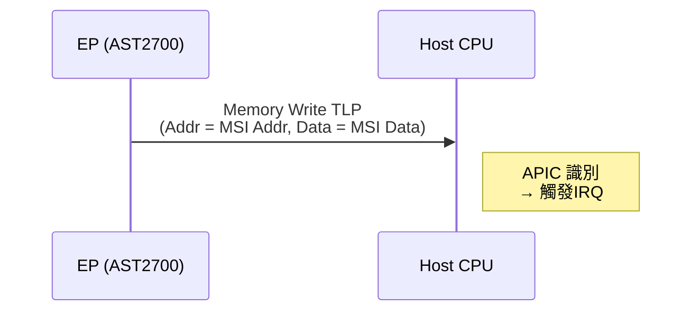
```mermaid
sequenceDiagram
    participant EP as EP (AST2700)
    participant Host as Host CPU

    EP->>Host: Memory Write TLP<br/>(Addr = MSI Addr, Data = MSI Data)
    Note right of Host: APIC 識別<br/>→ 觸發IRQ
```

* **優點**：無共享問題，Host OS 自動管理向量分配。
* **限制**：每個 Function 最多 **32 個中斷向量**；不支援 Per-vector Masking（無法個別屏蔽某一個向量）。

##### (C) MSI-X — 擴充訊息式中斷（推薦）

**MSI-X（Message Signaled Interrupts Extended）** 是 MSI 的強化版本，也是現代高性能 PCIe 設備（如 NVMe SSD、高速網卡）的標準選擇。

與 MSI 的核心差異：

| 特性               | MSI                              | MSI-X                                       |
| :----------------- | :------------------------------- | :------------------------------------------ |
| **最大向量數**     | 32                               | **2048**                                    |
| **向量表位置**     | 存放於 PCIe Configuration Space（有限） | 存放於 **BAR 空間**（MSI-X Table，彈性大）  |
| **Per-vector Mask**| ❌ 不支援                        | ✅ 每個向量可獨立 Mask/Unmask               |
| **Pending Bit Array (PBA)** | ❌               | ✅ 可查詢哪些中斷正在等待處理              |

**MSI-X Table 結構：**

MSI-X 的向量表存放在 EP 的某個 BAR 空間中，每個 Entry 固定 16 Bytes：

| Offset | 欄位 | 大小 | 主要用途 | 誰負責填寫 / 控制 |
| :--- | :--- | :--- | :--- | :--- |
| `+0x00` | `Message Address Low` | 4 Bytes | MSI-X Memory Write 的目標位址低 32-bit | `Host/OS` 分配並寫入 |
| `+0x04` | `Message Address High` | 4 Bytes | 目標位址高 32-bit | `Host/OS` 分配並寫入 |
| `+0x08` | `Message Data` | 4 Bytes | 送出中斷時要一起寫入的資料值 | `Host/OS` 分配並寫入 |
| `+0x0C` | `Vector Control` | 4 Bytes | 控制這個 vector 是否暫時被遮罩 | `Host/OS` 或韌體依需求控制 |

一個 MSI-X Entry 可視為：

- `Address`：中斷要寫到 Host 哪裡
- `Data`：寫入的資料內容
- `Mask`：此 vector 目前是否允許送出

其中最常關注的控制位是：

- `Vector Control[0] = Mask Bit`
- `0`：此 vector 可送出中斷
- `1`：此 vector 被屏蔽，暫時不送

實際觸發時，EP 並不是去改這張表，而是：

1. 讀出該 Entry 已經被 Host 填好的 `Address/Data`
2. 硬體送出一筆 `Memory Write TLP`
3. 寫到對應的 Host 中斷目標位址，完成 MSI-X 通知

**三種中斷機制總覽比較**

| 特性               | INTx（傳統）         | MSI(MSI Legacy)      | MSI-X（推薦）         |
| :----------------- | :------------------- | :------------------- | :-------------------- |
| **實現方式**       | 虛擬電位拉低 TLP     | Memory Write TLP     | Memory Write TLP      |
| **最大向量數**     | 4（A/B/C/D）         | 32                   | 2048                  |
| **是否共享**       | 可能共享             | 不共享               | 不共享                |
| **Per-vector Mask**| ❌                   | ❌                   | ✅                    |
| **PCIe Configuration Space Cap ID**| 無（預設行為）       | `05h`                | `11h`                 |
| **適用場景**       | 舊裝置相容           | 一般 EP 裝置         | NVMe、高速網卡、AST2700 |

> 💡 **韌體開發慣例**：現代 EP 韌體通常在 PCIe Configuration Space 中同時宣告 MSI 與 MSI-X Capability，讓 Host OS 自行選擇最佳方式。Host 在枚舉時，如果偵測到 MSI-X 支援，通常會**優先使用 MSI-X**，並停用 MSI 與 INTx。

**Host 如何判斷 EP 支援 MSI 或 MSI-X**

Host 是在 **PCI Configuration Space** 中檢查 **Capabilities Linked List**：

1. **先看 Header Status Register**：Host 讀取 PCI Header 的 `Status Register`，確認 `Capabilities List` bit 是否為 1。若此 bit 未設起，代表沒有標準 capability linked list 可走訪。
2. **找到第一個 Capability Pointer**：對一般 Type 0 Header 而言，Host 會從 offset `34h` 讀出第一個 capability 的 pointer。
3. **沿著 linked list 逐項走訪**：每個 capability 結構前 2 Bytes 包含：
   - `Capability ID`
   - `Next Capability Pointer`
4. **依 Capability ID 判斷支援項目**：
   - `05h` = **MSI Capability**
   - `11h` = **MSI-X Capability**
5. **據此決定可用中斷模式**：
   - 只有 `05h`：表示 EP 支援 MSI
   - 只有 `11h`：表示 EP 支援 MSI-X
   - `05h` 與 `11h` 都有：表示兩者都支援，現代 OS/driver 通常優先選 MSI-X
   - 兩者都沒有：退回使用傳統 `INTx`

此流程可整理為：

- **Configuration Space 負責宣告能力**
- **BAR 空間負責放運作時資料結構**

因此：

- `MSI` 的能力與寄存器欄位直接放在 `MSI Capability` 裡
- `MSI-X` 的能力宣告放在 `MSI-X Capability` 裡，但真正的 **MSI-X Table** 則位於某個 `BAR` 指向的 MMIO 空間

> ⚠️ **支援不等於啟用**：Host 看到 `05h` 或 `11h`，只代表該 EP **有能力**使用 MSI / MSI-X；真正進入工作狀態，還要由 OS 或 driver 後續寫入 capability control bits，甚至填入 MSI-X Table 的 Message Address / Message Data，才代表正式啟用。

## 二、PCIe 鏈路、枚舉與生命週期管理

### 2.1 PCIe 鏈路建立與系統枚舉流程 (Link Training & Enumeration)

本章說明 PCIe link 如何進入可傳輸狀態、Host 如何透過枚舉建立 Configuration Space、BAR 與 driver binding，以及 link 在電源管理、reset 與韌體介入時機下的生命週期行為。至於 AST2700 Endpoint 常見的 Host/BMC 通訊方式（Doorbell、MSI-X、SQ/CQ、Mailbox、MMBI 與 MCTP over PCIe VDM），則整理於下一章。

#### 第一階段：鏈路訓練 (LTSSM)
這是純硬體的底層交涉，**此時作業系統 (OS) 毫不知情，完全沒有介入**。兩邊的晶片會依賴內建的硬體狀態機 (LTSSM) 在短短幾毫秒內搞定連線。

##### LTSSM 完整狀態機

**LTSSM（Link Training and Status State Machine）** 是 PCIe 規範定義的有限狀態機，負責管理一條 PCIe 鏈路從「完全沒有訊號」到「穩定傳輸資料」，以及之後所有省電與錯誤恢復的完整生命週期。以下是 11 個主要 State 的完整說明：

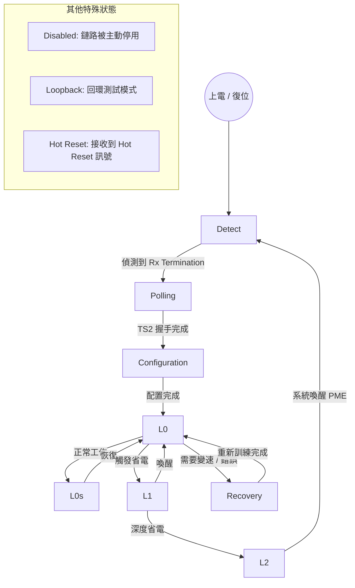
```mermaid
graph TD
    Start((上電 / 復位)) --> Detect
    Detect -->|偵測到 Rx Termination| Polling
    Polling -->|TS2 握手完成| Configuration
    Configuration -->|配置完成| L0

    L0 -->|正常工作| L0s
    L0s -->|恢復| L0

    L0 -->|觸發省電| L1
    L1 -->|喚醒| L0

    L0 -->|需要變速 / 錯誤| Recovery
    Recovery -->|重新訓練完成| L0

    L1 -->|深度省電| L2
    L2 -->|系統喚醒 PME| Detect

    subgraph 其他特殊狀態
        Disabled[Disabled: 鏈路被主動停用]
        Loopback[Loopback: 回環測試模式]
        HotReset[Hot Reset: 接收到 Hot Reset 訊號]
    end
```

**各 State 詳細說明**

**① Detect（實體偵測）**
這是 LTSSM 的起始狀態，也是系統上電或任何重置後必定回到的起點。
- **進入條件**：上電復位、Hot Reset、或從 L2 喚醒
- **運作方式**：Downstream Port（Host 側）在差分對（Differential Pair）上週期性施加一個微弱的直流偏壓，然後偵測電流是否有被牽引。若 Upstream Port（EP 側）的 **Rx Termination 電阻**（通常 50 Ω）存在，則電壓會明顯下降，Host 從而確認「對端存在」。
- **超時行為**：若超過 12 ms 仍未偵測到任何反應，LTSSM 會在 Detect 狀態中等待，持續送測試訊號。

**② Polling（輪詢同步）**
兩端確認實體存在後，開始進行「初次握手」，目的是對齊時脈並完成最基本的位元同步。

- **Polling.Active**：雙方以 Gen1（2.5 Gbps）速率持續發送 **TS1 有序集（Ordered Sets）**，直到接收方偵測到 8 個連續的 TS1，確認 Bit Lock（位元鎖定）。
- **Polling.Compliance**：如果在一定時間內無法完成，某一側會進入 Compliance 模式（發送固定訊號），供工程師用示波器觀察 Eye Diagram，這是 SI（Signal Integrity）除錯的重要入口。
- **Polling.Configuration**：雙方改發 **TS2**，收到 8 個連續 TS2 後確認 Symbol Lock，準備進入 Configuration。

**③ Configuration（鏈路配置）**

這個狀態負責協商最終的實體連線參數。

- **Lane Number 協商**：RC 端先分配 Lane 編號（Lane 0 ~ Lane N-1），EP 回傳確認。如果某條 Lane 訊號太差，雙方可協商降寬（例如 x8 降為 x4）。
- **Lane Reversal**：若 PCIe 走線為了 PCB 佈線方便做了鏡像翻轉，Configuration 狀態中的協商可自動修正，無需額外韌體介入。
- **Link Number 確認**：分配最終的 Link 識別編號。
- **完成**：雙方交換最終的 TS2 確認，進入 L0。

**④ L0（正常工作）**

這是唯一可傳送 TLP（Transaction Layer Packet）與 DLLP（Data Link Layer Packet）的狀態，也是整個 PCIe 系統的「正常運作狀態」。

- **TLP 傳輸**：所有的 Memory Read/Write、Config Read/Write、Completion 封包都在此狀態流通。
- **Flow Control**：透過 UpdateFC DLLP 持續更新兩端的緩衝區剩餘空間。
- **心跳機制**：若鏈路上一段時間沒有 TLP，DLL 層會自動發送 **SKP Ordered Sets** 來維持同步與補償時脈偏差。

**⑤ Recovery（恢復 / 重訓練）**

這是 L0 的「復原路徑」，當需要改變速率、修復通訊錯誤，或從省電狀態快速喚醒時，都會先進入 Recovery。

- **觸發條件**：
  - 從 L0s / L1 喚醒回到 L0
  - 需要升速（如 Gen1 → Gen4）
  - 接收到過多的 CRC 錯誤（超過閾值）
  - 軟體寫入 `Retrain Link` 位元（韌體除錯常用）
- **Recovery.RcvrLock**：重新發 TS1，嘗試重新獲得 Bit Lock / Symbol Lock。
- **Recovery.Equalization**（Gen3 / Gen4 新增）：協商 Tx 等化參數（Preset / Coefficient），是 Gen3+ 速率能否穩定訓練成功的關鍵。如果 EQ 協商失敗，鏈路會降速重試。
- **回到 L0 或降速**：成功則進入 L0；若多次失敗則降一個速率等級重來（Gen4 → Gen3 → Gen2 → Gen1）。

**⑥ L0s（淺層省電）**

一種極快速切換的省電模式，延遲極低（恢復時間 < 1 μs）。

- **適用場景**：鏈路有資料但偶發空閒（Burst Traffic）的場景。
- **機制**：Transmitter 進入 Electrical Idle，Receiver 保持監聽。任一端需要發送 TLP 時，立即送出 FTS（Fast Training Sequence）喚醒對方，然後回到 L0。
- **注意**：L0s 是 **可選的（Optional）**，不是所有 PCIe 裝置都必須支援。

**⑦ L1（中度省電）**

比 L0s 更深的省電模式，功耗更低，但恢復時間較長（約 2~100 μs）。

- **觸發方式**：由 PM（Power Management）協議協商觸發，或 ASPM（Active-State Power Management）機制自動觸發。兩端都同意後才能進入。
- **子狀態**：
  - **L1.1**（如果支援 CLKREQ# 訊號）：關閉 Common Clock，進一步降低功耗。
  - **L1.2**（如果支援）：關閉 PLL 電路，達到最大省電效果，但喚醒時間也最長（約 100 μs）。
- **韌體開發警告**：在 AST2700 / DC-SCM 的 xHCI over PCIe 架構下，L1.2 的啟用是虛擬 USB 斷線的最常見元兇！需要在 ACPI / PCIe 驅動層面謹慎設定。

**⑧ L2（深層省電）**

主電源準備關閉前的狀態，僅保留少量輔助電（Vaux）維持 PME（Power Management Event）喚醒能力。

- **進入**：Host 通過軟體 PM 流程（如 ACPI S3/S4/S5）通知裝置進入 L2。
- **退出**：裝置發出 PME 事件（如按下電源鍵），LTSSM 從 Detect 重新開始完整訓練流程。

**⑨ Disabled（停用）**

鏈路被主動停用的狀態。在以下情況會進入：

- 軟體寫入 Link Disable 位元
- Crosslink 配置需要
- 從 Configuration 或 Recovery 失敗後達到最大重試次數

**⑩ Loopback（回環）**

特殊的測試/診斷模式。Downstream Port 成為 Loopback Master，Upstream Port 將所有收到的位元原封不動地反射回去，供工程師在 Master 端量測 BER（Bit Error Rate）與 Eye Diagram。

**⑪ Hot Reset（熱重置）**

當 Downstream Port 需要對 EP 進行重置（例如韌體 Recovery、OS 驅動重載），會觸發此狀態。EP 收到 Hot Reset 訊號後，所有內部狀態恢復到初始值，然後從 Detect 重新開始訓練。

---

**省電狀態層次總覽**

| 狀態 | 別名 | 恢復時間 | 功耗 | PHY 狀態 | 備註 |
|:--|:--|:--|:--|:--|:--|
| **L0** | Active | — | 最高 | 全開 | 唯一可傳 TLP 的狀態 |
| **L0s** | Standby | < 1 μs | 略低 | Tx 電氣空閒 | 可選，非強制 |
| **L1** | Suspend | 2~100 μs | 低 | 雙向電氣空閒 | ASPM 管理 |
| **L1.1** | — | ~10 μs | 更低 | PLL 開，Clock 關 | 需 CLKREQ# 支援 |
| **L1.2** | — | ~100 μs | 最低（非 L2）| PLL 關 | ⚠️ USB/BMC 斷線風險 |
| **L2** | Sleep | 10 ms+ | 趨近於零 | 幾乎全關 | 僅 Vaux 存活 |

---

### 2.2 PCIe Power Saving

PCIe power saving 不是單一機制，而是由 **Link State**、**Device Power State** 與 **軟體電源管理策略** 共同決定。對 AST2700 / BMC 開發來說，重點不是「省多少電」，而是省電狀態是否會讓 Host/BMC 的 MMIO、Doorbell、MSI-X、MMBI、虛擬 xHCI 或 MCTP over PCIe 行為出現延遲、斷線或 recovery 問題。

#### 2.2.1 兩種常見省電模型

| 模型 | 管理對象 | 典型狀態 | 說明 |
| :--- | :--- | :--- | :--- |
| Link power state | PCIe link / PHY | `L0`、`L0s`、`L1`、`L1.1`、`L1.2`、`L2` | 控制 link 與 PHY 的省電深度，影響 TLP 能否立即傳輸。 |
| Device power state | PCIe function / device | `D0`、`D1`、`D2`、`D3hot`、`D3cold` | 控制 device/function 的工作狀態，通常由 PCI-PM / ACPI / driver policy 管理。 |

兩者相關但不相同。`L1.2` 表示 link 進入很深的省電狀態；`D3hot/D3cold` 則表示裝置功能本身被 OS 或平台電源管理降到低功耗狀態。實務上可能出現 link 還存在但 device function 已被 driver suspend，或 device 還在 D0 但 link 因 ASPM 進入 L1 的情況。

#### 2.2.2 ASPM 與 PCI-PM 差異

| 機制 | 全名 | 誰主導 | 對 BMC/EP 的影響 |
| :--- | :--- | :--- | :--- |
| ASPM | Active State Power Management | OS policy + PCIe capability + link 兩端協商 | 在裝置仍處於 active 使用期間，讓 link 自動進入 `L0s/L1/L1.1/L1.2`。可能造成 MMIO latency 增加或虛擬裝置 timeout。 |
| PCI-PM | PCI Power Management | OS driver / ACPI / PM core | 將 device function 切換到 `D0/D3hot/D3cold` 等狀態。可能導致 BAR、MSI-X、DMA 或 device context 需要重新初始化。 |
| PME | Power Management Event | Device 發起、Root Complex 接收 | 裝置用來喚醒 Host 或通知 power event。BMC 若需要喚醒 Host，需確認 PME path 與平台電源域。 |

#### 2.2.3 Link state 對 TLP 的影響

| Link State | 是否可傳 TLP | 對軟體可見影響 |
| :--- | :---: | :--- |
| `L0` | 是 | 正常傳輸 Memory / Config / Completion / Message TLP。 |
| `L0s` | 喚醒後可傳 | 延遲通常很低，對多數 MMIO 操作影響較小。 |
| `L1` | 喚醒後可傳 | MMIO read/write、Doorbell、Completion 都可能增加數十微秒等級延遲。 |
| `L1.1 / L1.2` | 喚醒後可傳 | 喚醒延遲更長，若 driver timeout 設太短，容易被誤判為裝置卡住或消失。 |
| `L2` | 否，需重新訓練 | 通常代表主電源準備關閉或平台進入深睡眠，恢復時需從 Detect 重新 link training。 |

#### 2.2.4 AST2700 / OpenBMC 常見風險

| 場景 | 風險 | 建議 |
| :--- | :--- | :--- |
| PCIe 虛擬 xHCI / KVM | Host 端 xHCI driver 可能因 link reset、D-state 或 L1.2 喚醒延遲誤判裝置移除。 | 對虛擬 USB 類功能保守設定 ASPM，必要時關閉 L1.2 或調整 driver timeout。 |
| Doorbell / Mailbox | Host MMIO write 在低功耗狀態下需先喚醒 link，BMC 看到事件會延遲。 | 對即時控制路徑避免過深 ASPM；ISR 不應假設 doorbell 低延遲固定。 |
| MMBI | Circular buffer 已寫入，但 interrupt 或 pointer update 因 link wake latency 延後被對端看到。 | pointer 與 packet data 需遵守 ordering；receiver 要支援 polling / timeout / retry。 |
| MSI / MSI-X | EP 發 MSI/MSI-X 需要 Memory Write TLP；link 低功耗或 device suspend 可能延遲中斷送達。 | 確認 Bus Master Enable、MSI/MSI-X enable、D-state 與 ASPM policy。 |
| MCTP over PCIe VDM | VDM 是 Message TLP，link 不在可傳狀態時需等待喚醒或重新訓練。 | 管理通道需處理 link down / timeout / endpoint rediscovery。 |
| BMC 作為 RC | 下游 NVMe 或 endpoint 可能進入低功耗，造成首次 I/O 延遲或 resume failure。 | 驗證 runtime PM、ASPM、NVMe APST 與 board power rail 的互動。 |

#### 2.2.5 開發時的判斷原則

| 問題 | 判斷方向 |
| :--- | :--- |
| 功能是否需要低延遲？ | 若是 Doorbell、KVM、虛擬媒體或即時管理事件，ASPM policy 應保守。 |
| 裝置是否可被 OS suspend？ | 若 Host driver 會進入 D3hot/D3cold，韌體需能處理 resume 後 BAR/MSI-X/context 重新初始化。 |
| BMC 是否需要喚醒 Host？ | 需確認 PME、WAKE#、GPIO 或平台定義喚醒路徑是否存在。 |
| Link down 後如何恢復？ | 應定義 retrain、reset、重新枚舉、重建 MCTP route 或重新初始化 MMBI 的策略。 |
| 是否能只關閉部分省電？ | 常見做法是保留較淺的 L0s/L1，關閉 L1.1/L1.2；實際策略依平台功耗與可靠性取捨。 |

常用觀察入口：

```bash
lspci -vv -s <BDF>
lspci -vv -s <BDF> | grep -i "ASPM\\|LnkCtl\\|LnkSta\\|PMCSR"
cat /sys/module/pcie_aspm/parameters/policy
dmesg | grep -i "pcie\\|aspm\\|aer\\|timeout"
```

總結來說，PCIe power saving 的核心取捨是：**省電越深，喚醒與恢復越複雜**。對 BMC 管理通道而言，設計時要先決定哪些通路需要全時穩定、低延遲，哪些通路可以接受喚醒延遲或重新初始化。

---

### 2.3 PCIe Reset 機制

PCIe reset 不是單一動作。不同 reset 會影響不同層級：有些只重訓 link，有些會清掉 device function 狀態，有些會讓整個下游 bus 重新初始化。對 AST2700 / BMC 開發來說，必須分清楚「reset 到哪一層」，才能判斷是否需要重新 link training、重新枚舉、重建 BAR/MSI-X/DMA context，或重建 MCTP/MMBI 通道。

#### 2.3.1 常見 reset 類型

| Reset 類型 | 影響範圍 | 是否重新 link training | 是否可能需要重新初始化 |
| :--- | :--- | :---: | :---: |
| Fundamental Reset / PERST# | 裝置硬體、PCIe function、link 狀態 | 是 | 是 |
| Hot Reset | Downstream Port 對下游 link / endpoint 發 reset | 是 | 是 |
| Secondary Bus Reset | Bridge / Root Port 下游 bus | 是 | 是 |
| Function Level Reset (FLR) | 單一 PCIe Function | 不一定 | 是，限該 function |
| Link Retrain | Link PHY / LTSSM | 是 | 通常否，但需檢查 link 狀態 |
| D3cold 後恢復 | 裝置電源域可能被關閉 | 是 | 通常是 |

#### 2.3.2 PERST# / Fundamental Reset

`PERST#` 是 PCIe 裝置最典型的硬體 reset。當 `PERST#` assert 時，Endpoint 必須回到初始狀態；deassert 後重新開始 link training，Host 再進行枚舉或 resume 初始化。

在 BMC/AST2700 情境中：

| 角色 | 影響 |
| :--- | :--- |
| AST2700 作為 EP | Host / HPM 端 assert PERST# 時，BMC PCIe EP function 狀態、BAR/MSI-X/context 可能被清掉，需等 Host 重新枚舉。 |
| AST2700 作為 RC | 平台透過 AST2700 的 GPIO、reset controller 或其他硬體邏輯控制下游 Endpoint 的 `PERST#`。解除 reset 後，BMC Linux 需等待 Endpoint 與 PCIe link 穩定，再進行枚舉或 driver recovery。 |

#### 2.3.3 Hot Reset 與 Secondary Bus Reset

Hot Reset 是透過 PCIe link 傳遞的 reset，常由 Root Port 或 Bridge 發起。Secondary Bus Reset 則是 Bridge/Root Port 對下游 bus 的 reset 行為，通常會影響該 bus 下的所有裝置。


```mermaid
flowchart LR
    A[Root Port / Bridge] -->|Hot Reset / Secondary Bus Reset| B[Downstream Link]
    B --> C[Endpoint Function reset]
    C --> D[LTSSM returns to Detect]
    D --> E[Link retraining to L0]
    E --> F[Driver restore / re-enumeration decision]

    style A fill:#dbeafe,stroke:#2563eb,stroke-width:2px,color:#111827
    style B fill:#fef3c7,stroke:#d97706,stroke-width:2px,color:#111827
    style C fill:#fee2e2,stroke:#dc2626,stroke-width:2px,color:#111827
    style D fill:#fef3c7,stroke:#d97706,stroke-width:2px,color:#111827
    style E fill:#dcfce7,stroke:#16a34a,stroke-width:2px,color:#111827
    style F fill:#ede9fe,stroke:#7c3aed,stroke-width:2px,color:#111827
```

這類 reset 通常會讓 link 回到 Detect/Training 流程。是否完整重新 enumeration，取決於 OS/driver 是否保留裝置模型、config context 與 resource assignment。

#### 2.3.4 Function Level Reset (FLR)

FLR 是 PCIe Capability 定義的 function-level reset，目標是只重置單一 function，而不影響同一個 device 裡其他 function。這對 Multi-Function Device 特別重要。

FLR 通常由 Host software 觸發。Host 會找到目標 Function 的 PCI Express Capability，對 `Device Control Register` 寫入 `Initiate Function Level Reset` bit；目標 Function 收到後，必須自行回到初始狀態。此 reset 通常不重新訓練 link，也不應影響同一個 Device 下的其他 Function。

```text
Host driver / PCI core
  ↓
找到目標 Function 的 PCI Express Capability
  ↓
寫入 Device Control Register 的 FLR bit
  ↓
目標 PCIe Function 執行 reset
  ↓
Host 等待 FLR 完成
  ↓
Driver 重新初始化該 Function
```

| 特性 | 說明 |
| :--- | :--- |
| 影響範圍 | 單一 PCIe Function。 |
| Link | 通常不需要重新 link training。 |
| BAR / MSI-X | Function 內部狀態會重置，driver 需重新設定必要 context。 |
| 適用情境 | Driver reload、錯誤恢復、虛擬化或多功能裝置局部 reset。 |

Linux 中常見觸發來源包含 driver error recovery、VFIO / device passthrough、AER recovery，以及 sysfs reset 入口：

```bash
echo 1 > /sys/bus/pci/devices/<BDF>/reset
```

但 sysfs reset 不保證一定使用 FLR。Kernel 會依裝置能力選擇 reset method，例如 FLR、PM reset、bus reset、hot reset 或 vendor-specific reset。

AST2700 若對 Host 呈現多個 EP function，例如 xHCI、MMBI、vendor-specific function，需要定義每個 function 在 FLR 後如何清理 queue、doorbell、DMA engine、MSI-X table 與 pending interrupt。

#### 2.3.5 Link Retrain

Link retrain 不是 device function reset，而是重新訓練 PCIe link。它常用於：

* 調整 link speed / width。
* 從 error recovery 回到 L0。
* 處理訊號品質不穩、equalization 失敗或 link down recovery。

Link retrain 成功後，BDF、BAR 與 driver binding 通常不需要重建；但若 retrain 伴隨 link down、timeout 或 endpoint reset，driver 仍可能需要重新初始化裝置。

#### 2.3.6 L2 / D3cold 回復與 re-enumeration

從 `L2` 回來時，link 一定需要重新從 Detect 開始訓練回 `L0`；但是否需要完整 re-enumeration 取決於平台是否保留 device/config context。

| 情況 | Link training | Re-enumeration | 說明 |
| :--- | :---: | :---: | :--- |
| 系統睡眠後 resume，config/context 保留 | 需要 | 不一定 | OS 可能保留 BDF/BAR/driver state，只走 resume flow。 |
| `D3hot` 回到 `D0` | 視平台而定 | 通常不完整重枚舉 | Driver 重新 enable BAR/MSI/DMA/context。 |
| `D3cold` 或 endpoint power rail 被關閉 | 需要 | 常常需要 | 裝置 power cycle 後 context 消失，可能需重新掃描或重新初始化。 |
| Root Port / Bridge reset | 需要 | 可能需要 | 若拓樸或 resource 不可信，OS 可能重掃 bus。 |
| Hot-plug / surprise removal | 需要 | 需要 | 等同裝置消失再出現。 |

#### 2.3.7 BMC 開發檢查點

| 檢查項目 | 重點 |
| :--- | :--- |
| Reset 來源 | 是 PERST#、Hot Reset、FLR、D3cold resume、link retrain，還是平台 power cycle？ |
| Config context | Vendor ID、BAR、Command Register、MSI/MSI-X、Bus Master Enable 是否需要重設？ |
| DMA / Queue | DMA descriptor、SQ/CQ、doorbell、MMBI pointer 是否需要清空或重建？ |
| Interrupt | MSI/MSI-X vector 是否仍有效？pending interrupt 是否需清掉？ |
| MCTP route | PCIe VDM 或 MMBI 通道 reset 後，`mctpd` 是否需要 rediscovery 或 route refresh？ |
| OpenBMC service | 上層 daemon 是否能處理 device disappear/reappear、timeout、retry 與 state rebuild？ |

一句話判斷：**reset 越靠近硬體與電源域，越可能需要重新 link training 與重新初始化；reset 越靠近 function 層，越應限制影響範圍並避免破壞其他 function。**

---


#### 第二階段：系統枚舉 (Enumeration)
當硬體層 (Physical Layer) 完成鏈路訓練並進入 L0 狀態後，系統的 **Root Complex (RC)** 會啟動枚舉流程。此階段旨在識別拓樸中的所有裝置、分配 BDF 地址，並配置必要的硬體資源。


1.  **配置空間存取 (Configuration Transactions)**：
    Root Complex 會沿著 PCIe 拓樸發送 **Configuration Request TLP (Type 0 或 Type 1)**。透過 **BDF (Bus, Device, Function)** 定址方式，掃描系統中所有的節點。
    *   **Type 0**：用於 RC 直接連接的裝置。
    *   **Type 1**：用於經過 Switch 或 Bridge 轉送，尋找下游匯流排的裝置。

2.  **裝置識別 (Identification)**：
    當 RC 點名掃描到 AST2700 時，會讀取其 Configuration Space 的首個 4 Bytes。
    *   **Vendor ID / Device ID**：AST2700 必須回報預設的值（如 ASPEED VID `0x1A03`）。
    *   **Master Abort**：若該 BDF 位址沒有裝置回應，RC 會收到一個由硬體產生或超時回傳的 `0xFFFF`，代表該插槽為空 (Empty Slot)。

3.  **BAR 資源容量評估 (BAR Sizing)**：
    RC 會讀取裝置的 **Base Address Registers (BAR)** 以決定其資源需求。
    *   **Sizing 機制**：RC 會暫時往 BAR 寫入全 `1` (All Fs)，裝置會依照硬體設計的位址空間需求，將低位元保持為 `0` 並回傳。RC 透過計算回傳值中 `0` 的個數，即可得知該裝置需要的空間大小（例如 AST2700 VGA 宣告 64MB）。

4.  **MMIO 位址映射 (Address Mapping)**：
    RC 評估完所有裝置的需求後，會從系統的實體記憶體空間 (System Physical Address Space) 中劃分一段連續位址給該裝置。
    *   **BAR 配置**：RC 將分配好的起始位址寫回 AST2700 的 BAR 暫存器中，並開啟 **Command Register** 中的 **Memory Space Enable** 位元。
    *   **MMIO 原理**：自此，Host CPU 對該段記憶體位址的讀寫動作，都會由 RC 自動封裝成 **Memory Read/Write TLP** 穿過 PCIe 鏈路直達 AST2700，實現硬體資源的透明映射。

5.  **類別代碼與驅動綁定 (Class Code & Driver Binding)**：
    最後，核心讀取 **Class Code** 暫存器（如 `0C0330` 代表 USB 3.0 xHCI 控制器）。作業系統根據此 Code 匹配並啟動對應的驅動程式。至此，裝置正式在系統中實例化 (Instantiated) 並可供軟體調用。

### 2.4 韌體介入時機

在 PCIe 生命週期中，韌體主要介入下列三個階段：

* **時機一：LTSSM 啟動前 (PRE-LTSSM)**
  在硬體狀態機進入 Detect 前，也就是 BMC 上電後的早期初始化階段，U-Boot 或早期 kernel 初始化程式需完成下列設定：
  * **設定 PHY 實體層參數**：包含參考時鐘架構，例如 SRIS 或 SSC，以及 Tx/Rx equalization 相關參數。
  * **填寫 PCIe Configuration Space**：Vendor ID、Device ID、BAR 空間大小與 Class Code 等資訊，都必須在 link training 前預先寫入 AST2700 PCIe 暫存器，否則 Host OS 枚舉時將無法取得有效裝置資訊。
  * **Enable LTSSM**：韌體必須設定晶片內的 `LTSSM Enable` 控制位元；若未啟用，即使實體連接正常，PCIe 狀態機也不會開始 link training。

* **時機二：LTSSM 無法進入 L0 時 (Recovery / Link Down)**
  若鏈路建立失敗，例如訊號品質不佳而停留在 Polling，或速率無法提升至 Gen4 而降回 Gen1，BMC 韌體可透過 Link Down 或 AER (Advanced Error Reporting) 中斷取得狀態。此時韌體可調整 Tx EQ 等訊號補償參數，並寫入 `Retrain Link` 暫存器，要求硬體狀態機重新進行 link training。

* **時機三：L0 建立後 (Active Phase)**
  當 link 進入 L0 且 Host OS 完成枚舉後，韌體主要負責 Mailbox、Doorbell、MSI/MSI-X 與 DMA engine 等通訊與資料搬運流程。

## 三、Host/BMC 通訊機制與 TLP 行為

本章整理 AST2700 作為 Endpoint 時，Host 與 BMC 之間常見的通訊機制——從 Doorbell、中斷、SQ/CQ、Mailbox、MMBI 到 MCTP over PCIe VDM——並在最後補上貫穿這些機制的 TLP 排序規則與 Completion／錯誤回應行為。

### 3.1 Doorbell 機制

> [!IMPORTANT]
> **Doorbell 並非 PCIe 規範強制定義的標準機制。**
> 它是裝置廠商在自己的 BAR 空間中自行實作的「私有設計模式」，PCIe 規格書中找不到「Doorbell Register」這個欄位定義。只有特定類別的高性能 PCIe 裝置才會提供這個機制。

**哪些裝置有 Doorbell？**

Doorbell 機制通常出現在需要頻繁、高效率「Host ↔ EP 通知」的裝置上：

| 裝置類型 | 是否有 Doorbell | 說明 |
|:--|:--|:--|
| **NVMe SSD** | ✅ 有（規範強制） | NVMe 規格明確定義了 SQ/CQ Doorbell 暫存器的位置與格式，是 NVMe 協定的核心 |
| **RDMA 網卡（InfiniBand / RoCE）** | ✅ 有（廠商實作） | 用於 Work Queue 的提交通知，效能極關鍵 |
| **GPU（NVIDIA / AMD）** | ✅ 有（廠商私有） | 用於命令佇列提交，驅動程式直接操作 |
| **BMC EP（如 AST2700）** | ✅ 有（廠商實作） | 用於 Host 通知 BMC 有新管理命令待處理 |
| **一般 PCIe 網路卡（1G/10G NIC）** | ⚠️ 視廠商而定 | 部分有類似的 Tx Doorbell，部分使用 polling 或 MSI 輪詢 |
| **USB 控制器（xHCI over PCIe）** | ❌ 通常沒有 | 使用 xHCI 規範定義的 Doorbell Array（屬於 USB 規格，非 PCIe Doorbell）|
| **簡易 PCIe GPIO / UART 擴充卡** | ❌ 沒有 | 僅提供基本 MMIO 暫存器，Host 直接讀寫，不需要額外通知機制 |

> [!NOTE]
> **xHCI 的 Doorbell Array** 是 USB 3.0 規範（非 PCIe 規範）定義的機制，雖然名稱相同、概念相近，但兩者是獨立的不同規格。

**沒有 Doorbell 的裝置如何通知對方**

對於不支援 Doorbell 的裝置，Host 與 EP 之間的同步通知通常改用以下替代方式：

1. **Polling（輪詢）**：Host 或 EP 定期主動讀取對方的狀態暫存器，確認是否有新任務。實作成本低，但 CPU 佔用率高，不適合高頻操作。
2. **純 MSI-X 驅動**：EP 完成工作後直接發出 MSI-X 中斷通知 Host；Host 不使用 Doorbell，而是直接寫入 Command Register 或 Control Register 觸發 EP 動作。
3. **Shared Memory Flag**：Host 和 EP 約定一塊共用記憶體區域，利用特定 Flag 欄位作為「虛擬門鈴」，再搭配定期輪詢或 MSI-X 觸發掃描。

---

**Doorbell（門鈴）** 是一種輕量級的「通知」機制，其本質是一個由 Endpoint（EP）對外暴露的特殊 MMIO 暫存器。其語意是：Host 準備好資料後，透過 MMIO write 通知 EP 有新工作待處理。


**運作原理**

Doorbell 機制的核心是一個寫入觸發流程：

1. **Host 準備資料**：Host CPU 或 DMA 引擎把要傳送的資料寫入雙方事先約定好的共享記憶體區域（通常由 EP 透過 BAR 映射對外提供）。
2. **Host 寫入 Doorbell**：Host 對 EP 的 Doorbell 暫存器執行一次 **MMIO Write**（Memory-Mapped Write TLP）。此寫入值通常代表已就緒的任務或佇列索引。
3. **EP 收到通知**：EP（例如 AST2700）的硬體邏輯偵測到 Doorbell 暫存器被寫入，即觸發內部中斷，喚醒韌體中對應的 ISR（中斷服務程序）。
4. **EP 取回資料**：韌體根據中斷資訊判斷哪個佇列有資料，發起 DMA 或 MMIO Read 取回資料，並清除 Doorbell 狀態。

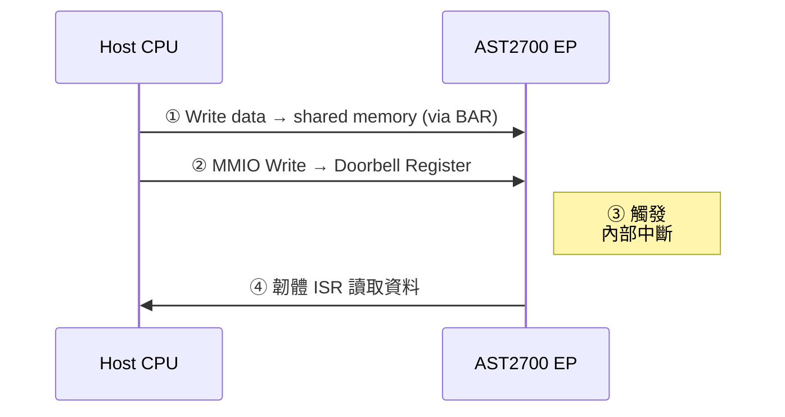
```mermaid
sequenceDiagram
    participant Host as Host CPU
    participant EP as AST2700 EP

    Host->>EP: ① Write data → shared memory (via BAR)
    Host->>EP: ② MMIO Write → Doorbell Register
    Note right of EP: ③ 觸發<br/>內部中斷
    EP->>Host: ④ 韌體 ISR 讀取資料
```

**Doorbell 的方向性**

Doorbell 機制本質上是**雙向的**，但需要兩套獨立的暫存器：

| 方向              | 實作方式                                           | 觸發目標         |
| :---------------- | :------------------------------------------------- | :--------------- |
| **Host → EP**     | EP 暴露 Doorbell 暫存器於 BAR 空間，Host 直接寫入 | EP 韌體 ISR      |
| **EP → Host**     | EP 發送 **MSI / MSI-X 中斷**（PCIe 標準中斷機制） | Host 驅動程式    |

> ⚠️ **注意**：EP 無法直接使用 Host 側的 Doorbell 語意，因此 EP 通知 Host 的標準做法是使用 **MSI-X（Message Signaled Interrupts Extended）**。這是 PCIe 規範中 EP 主動通知 Host 的正式機制，可視為 Host-to-EP Doorbell 的反向通知路徑。

**Doorbell vs. Mailbox 的差異**

這兩個詞在韌體開發中常一起出現，但角色不同：

| 特性       | Doorbell（門鈴）                      | Mailbox（信箱）                             |
| :--------- | :------------------------------------ | :------------------------------------------ |
| **功能**   | 純「通知」訊號，告知對方「有事發生」  | 承載「內容」，用於傳遞少量控制指令或狀態值  |
| **資料量** | 極小（通常 1~4 Bytes，僅含佇列索引）  | 較大（數十到數百 Bytes 的結構化命令）        |
| **語意**   | 單純通知對方有新工作待處理            | 傳遞帶內容的命令或狀態資料                  |
| **常見用法** | 通知 DMA 佇列已填滿，請開始傳輸       | 傳遞 PCIe 管理命令（如重置、查詢狀態）      |

**AST2700 韌體開發實務**

在 AST2700 的 EP 韌體實作中，Doorbell 暫存器通常會被映射在 **BAR0** 的特定偏移地址，韌體需要完成以下設定：

1. **IRQ 映射**：在 EP 韌體初始化時，將 Doorbell 暫存器的寫入事件綁定到對應的中斷向量。
2. **ISR 實作**：中斷服務程序需讀取 Doorbell 暫存器的值，根據值的內容（佇列索引）決定要處理哪個工作。
3. **清除機制**：ISR 處理完後必須**顯式清除（Clear）** Doorbell 暫存器，否則硬體可能持續觸發重複中斷。

### 3.2 SQ / CQ 佇列機制（Submission Queue / Completion Queue）

SQ/CQ 是 PCIe 裝置（尤其是 NVMe 儲存控制器）實現**高效非同步 I/O** 的核心資料結構。它將前幾節提到的 **Doorbell（通知 EP）** 與 **MSI-X（通知 Host）** 串接在一起，構成一個完整的請求—回應迴圈。

**設計理念**

傳統 I/O 介面（如 AHCI/SATA）採用「同步、單佇列」模型：Host 發一個命令，等 EP 完成後再發下一個，效率受限於往返延遲。SQ/CQ 引入了**非同步、多佇列**模型：Host 可一次提交多個命令，EP 並行處理，完成後各自回報，完全解耦了提交與完成的時序。

**核心資料結構**

SQ 和 CQ 都是存放在 **Host 記憶體**中的環形緩衝區（Ring Buffer），由 EP 透過 DMA 存取：

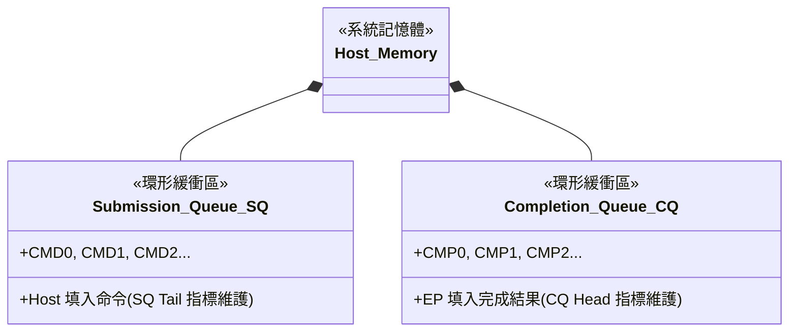
```mermaid
classDiagram
    class Host_Memory {
        <<系統記憶體>>
    }
    class Submission_Queue_SQ {
        <<環形緩衝區>>
        +CMD0, CMD1, CMD2...
        +Host 填入命令 (SQ Tail 指標維護)
    }
    class Completion_Queue_CQ {
        <<環形緩衝區>>
        +CMP0, CMP1, CMP2...
        +EP 填入完成結果 (CQ Head 指標維護)
    }
    Host_Memory *-- Submission_Queue_SQ
    Host_Memory *-- Completion_Queue_CQ
```

**指標分工：**

| 指標 | 全名 | 維護方 | 位置 |
|:--|:--|:--|:--|
| **SQ Tail** | SQ 尾指標 | **Host** | EP 的 Doorbell 暫存器 |
| **SQ Head** | SQ 頭指標 | **EP** | EP 內部 |
| **CQ Head** | CQ 頭指標 | **Host** | EP 的 Doorbell 暫存器 |
| **CQ Tail** | CQ 尾指標 | **EP** | EP 內部 |

**完整的一次 I/O 請求流程**

以下以 NVMe 讀取命令為例，展示 SQ/CQ 如何與 Doorbell、DMA、MSI-X 協作：

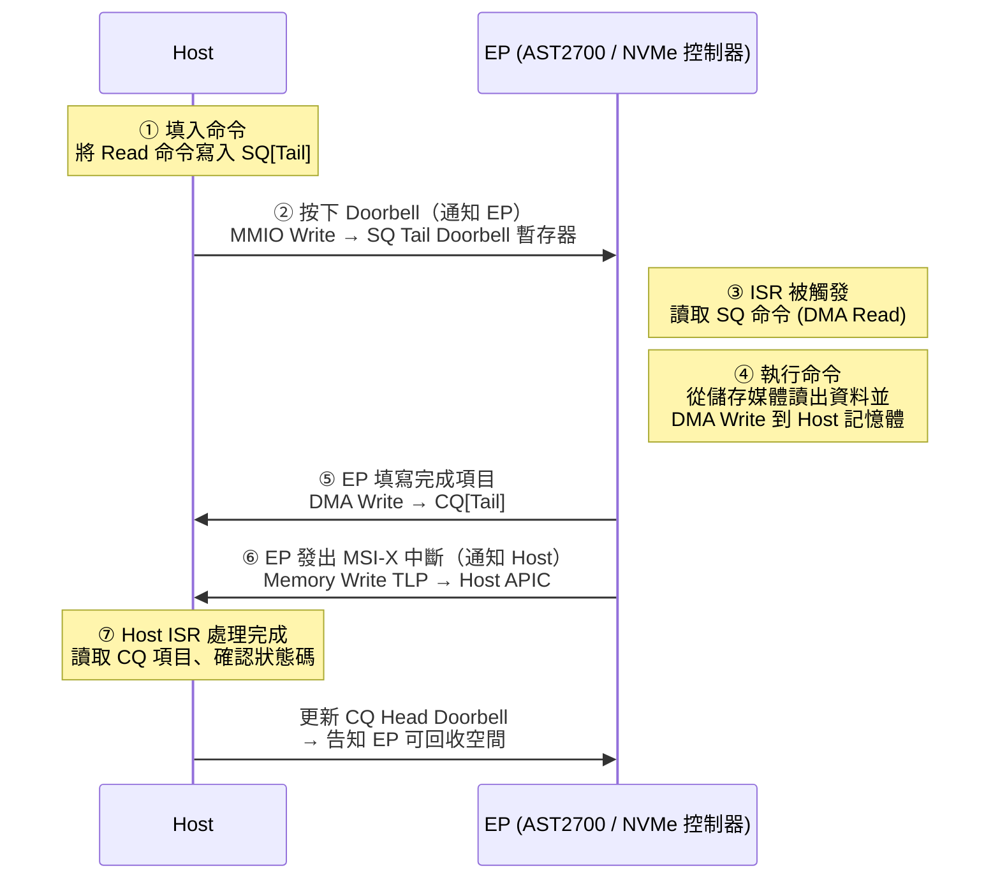
```mermaid
sequenceDiagram
    participant Host as Host
    participant EP as EP (AST2700 / NVMe 控制器)

    Note over Host: ① 填入命令<br/>將 Read 命令寫入 SQ[Tail]
    Host->>EP: ② 按下 Doorbell（通知 EP）<br/>MMIO Write → SQ Tail Doorbell 暫存器
    Note right of EP: ③ ISR 被觸發<br/>讀取 SQ 命令 (DMA Read)
    Note right of EP: ④ 執行命令<br/>從儲存媒體讀出資料並<br/>DMA Write 到 Host 記憶體
    EP->>Host: ⑤ EP 填寫完成項目<br/>DMA Write → CQ[Tail]
    EP->>Host: ⑥ EP 發出 MSI-X 中斷（通知 Host）<br/>Memory Write TLP → Host APIC
    Note over Host: ⑦ Host ISR 處理完成<br/>讀取 CQ 項目、確認狀態碼
    Host->>EP: 更新 CQ Head Doorbell<br/>→ 告知 EP 可回收空間
```

**多佇列帶來的並行優勢**

SQ/CQ 機制最強大之處在於支援**多組佇列對**。以 NVMe 為例，一個控制器可有：

| 佇列類型 | 數量 | 用途 |
|:--|:--|:--|
| **Admin SQ/CQ**（管理佇列） | 固定各 1 組 | 傳遞控制命令（建立 I/O 佇列、識別裝置等） |
| **I/O SQ/CQ**（資料佇列） | 最多 65535 組 | 每個 CPU Core 或執行緒可獨佔一組，消除鎖競爭 |

每個 SQ 可對應到一個獨立的 MSI-X 向量，使各 CPU Core 的 I/O 完成中斷互不干擾，實現真正的線性效能擴展。

> 💡 **為什麼 CQ Entry 需要回報 SQ Head 指標？**
> EP 在每次填寫 CQ 完成項目時，會把最新的 **SQ Head** 值一起夾帶在 CQ Entry 裡回傳給 Host。Host 收到後更新 SQ Head，才知道 EP 已消費掉哪些命令、SQ 環形緩衝區中哪些空間可被覆寫重用，避免 Host 覆蓋 EP 尚未讀取的命令。

**與 Doorbell / MSI-X 的整合關係**

```
Doorbell（Host → EP）：Host 更新 SQ Tail 時使用
                       Host 更新 CQ Head 時使用（釋放 CQ 空間）

MSI-X（EP → Host）：  EP 填完 CQ Entry 後，觸發對應向量通知 Host
                       一個 I/O 佇列通常綁定一個獨立的 MSI-X 向量
```

**在 AST2700 / BMC 韌體開發中的應用**

AST2700 在 DC-SCM 架構中主要扮演 EP 角色，SQ/CQ 的典型應用場景有：

1. **虛擬 NVMe（vNVMe）模擬**：AST2700 韌體模擬一顆 NVMe 控制器，Host 端的 NVMe 驅動透過標準 SQ/CQ 機制下達 I/O 請求，韌體解析命令後從 BMC 本地 eMMC/SPI Flash 取資料，再透過 DMA 回填到 Host 記憶體。
2. **高速 Mailbox 通道擴充**：對於需要高吞吐量的跨板管理命令流，可設計輕量化的自訂 SQ/CQ 結構，取代單一 Mailbox 暫存器，允許同時在途（in-flight）多筆管理請求而不需等待前一筆完成。

### 3.3 Mailbox 機制（信箱通訊）

> [!IMPORTANT]
> **Mailbox 不是 PCIe 規範定義的標準機制。**
> 與 Doorbell 相同，Mailbox 是廠商在自己的 BAR 空間（或廠商特定的 PCIe 能力擴充區域）中自行實作的「私有設計模式」，PCIe 規格書中並無此欄位定義。Mailbox 在 BMC/伺服器管理領域（如 ASPEED、Nuvoton 晶片）中極為常見，是 Host 與 BMC 之間交換管理命令的主要低速通道。

**Mailbox 的定義與核心概念**

Mailbox（信箱）是一組固定大小的 **共用暫存器（Shared Registers）**，Host 與 BMC 各自可讀、可寫其中的某些欄位，用來在不啟動 DMA、不需要大型緩衝區的前提下，交換少量的結構化控制訊息（如管理命令、狀態回報、韌體版本查詢等）。

**語意差異**：Doorbell 只提供事件通知；Mailbox 則提供可承載命令或狀態的資料通道。實務上，兩者通常搭配使用：Host 先將命令寫入 Mailbox，再透過 Doorbell 通知 BMC 讀取。

---

**Mailbox 的資料結構**

Mailbox 通常以固定大小的暫存器組形式存在於 EP 的 BAR 空間中。以 AST2700 / AST2600 系列為例，一個典型的 Mailbox 佈局如下：

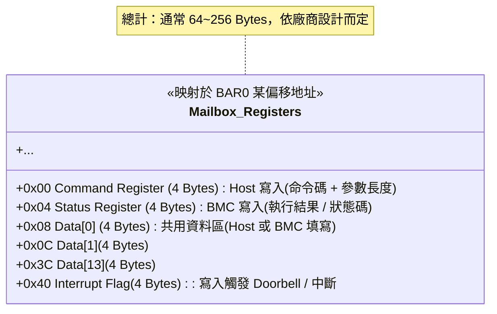
```mermaid
classDiagram
    class Mailbox_Registers {
        <<映射於 BAR0 某偏移地址>>
        +0x00 Command Register (4 Bytes) : Host 寫入 (命令碼 + 參數長度)
        +0x04 Status Register (4 Bytes) : BMC 寫入 (執行結果 / 狀態碼)
        +0x08 Data[0] (4 Bytes) : 共用資料區 (Host 或 BMC 填寫)
        +0x0C Data[1] (4 Bytes)
        +...
        +0x3C Data[13] (4 Bytes)
        +0x40 Interrupt Flag (4 Bytes) : 寫入觸發 Doorbell / 中斷
    }
    note for Mailbox_Registers "總計：通常 64~256 Bytes，依廠商設計而定"
```

> [!NOTE]
> AST2600 硬體上直接內建了一組 **Hardware Mailbox（HW Mailbox）** 暫存器（共 32 個 32-bit 暫存器，總計 128 Bytes），並提供對應的硬體中斷訊號，可讓 Host（x86 CPU）與 BMC 直接透過硬體訊號互相通知，無需完整的 PCIe TLP 往返。

---

**Mailbox 雙向通訊完整流程**

以 Host 發送一條「查詢 BMC 韌體版本」管理命令為例：

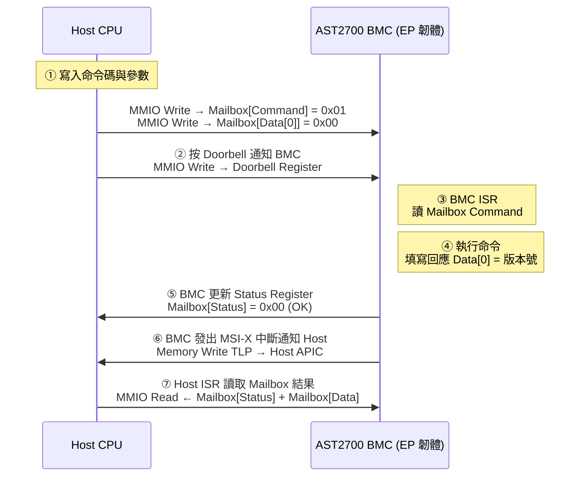
```mermaid
sequenceDiagram
    participant Host as Host CPU
    participant BMC as AST2700 BMC (EP 韌體)

    Note over Host: ① 寫入命令碼與參數
    Host->>BMC: MMIO Write → Mailbox[Command] = 0x01<br/>MMIO Write → Mailbox[Data[0]] = 0x00
    Host->>BMC: ② 按 Doorbell 通知 BMC<br/>MMIO Write → Doorbell Register
    Note right of BMC: ③ BMC ISR<br/>讀 Mailbox Command
    Note right of BMC: ④ 執行命令<br/>填寫回應 Data[0] = 版本號
    BMC->>Host: ⑤ BMC 更新 Status Register<br/>Mailbox[Status] = 0x00 (OK)
    BMC->>Host: ⑥ BMC 發出 MSI-X 中斷通知 Host<br/>Memory Write TLP → Host APIC
    Host->>BMC: ⑦ Host ISR 讀取 Mailbox 結果<br/>MMIO Read ← Mailbox[Status] + Mailbox[Data]
```

---

**Mailbox vs. Doorbell 差異完整對照**

| 特性               | Doorbell（門鈴）                          | Mailbox（信箱）                                   |
| :----------------- | :---------------------------------------- | :------------------------------------------------ |
| **核心功能**       | 純「通知」訊號，不攜帶業務資料            | 承載結構化「內容」，傳遞命令與回應資料            |
| **資料量**         | 極小（1~4 Bytes，僅含佇列索引或通知碼）   | 較大（64~256 Bytes 的命令封包）                   |
| **暫存器數量**     | 通常 1~N 個寫觸發暫存器                   | 多個欄位組成的暫存器陣列（Command/Status/Data）   |
| **讀寫分工**       | Host 寫入、EP 清除                        | Host 寫 Command/Data；EP 寫 Status/Data           |
| **使用時機**       | 通知 DMA 佇列更新、通知命令可取用         | 傳遞 IPMI OEM 命令、韌體更新請求、狀態查詢        |
| **搭配使用**       | 常與 Mailbox 搭配：先寫入命令，再通知對方 | 常與 Doorbell + MSI-X 搭配構成完整通訊迴圈        |
| **語意**           | 事件通知                                  | 帶內容的命令或資料通道                            |

---

**Mailbox 與其他通訊機制的定位比較**

| 機制          | 典型資料量      | 延遲     | 適用場景                             |
| :------------ | :-------------- | :------- | :----------------------------------- |
| **Mailbox**   | 64~256 Bytes    | 低       | 管理命令、韌體狀態查詢、OEM 擴充指令 |
| **Doorbell**  | 1~4 Bytes       | 極低     | 佇列更新通知、事件觸發信號           |
| **DMA**       | KB ~ GB         | 高吞吐   | KVM 影像、Virtual Media 資料流       |
| **SQ/CQ**     | 命令 64 Bytes/筆| 非同步   | NVMe I/O 命令、高吞吐儲存存取        |
| **MSI-X**     | 無資料（純中斷）| 極低     | EP → Host 方向的非同步事件通知       |

---

**AST2700 Mailbox 韌體開發實務**

在 AST2700 的 EP 韌體中，Mailbox 的完整設定流程如下：

1. **BAR 空間規劃**：在 PCIe Configuration Space 初始化時，將 Mailbox 暫存器區塊配置在 BAR0（或 BAR2）的固定偏移地址。Host OS 枚舉後即可透過 MMIO 直接存取。

2. **中斷綁定**：
   - **Host → BMC 方向**：將 Doorbell 暫存器（通常緊鄰 Mailbox 區塊）的寫入事件綁定至 BMC 內部 IRQ，觸發 `mailbox_isr()`。
   - **BMC → Host 方向**：BMC 完成命令後，透過 MSI-X 控制暫存器觸發對應向量，通知 Host 驅動讀取結果。

3. **ISR 實作要點**：
   ```c
   void mailbox_isr(void) {
       uint32_t cmd = mmio_read32(MAILBOX_BASE + CMD_REG);
       uint32_t data0 = mmio_read32(MAILBOX_BASE + DATA0_REG);

       switch (cmd & 0xFF) {          // 低 8-bit 為命令碼
           case CMD_GET_FW_VER:
               mmio_write32(MAILBOX_BASE + DATA0_REG, FW_VERSION);
               mmio_write32(MAILBOX_BASE + STATUS_REG, STATUS_OK);
               break;
           case CMD_RESET:
               schedule_reset();      // 排程重置，不在 ISR 中直接執行
               mmio_write32(MAILBOX_BASE + STATUS_REG, STATUS_PENDING);
               break;
           default:
               mmio_write32(MAILBOX_BASE + STATUS_REG, STATUS_ERR_UNKNOWN);
       }

       clear_doorbell();              // 清除 Doorbell 中斷旗標
       trigger_msix(MSIX_VEC_MAILBOX);// 發 MSI-X 通知 Host 讀取結果
   }
   ```

4. **原子性保護**：由於 Mailbox 暫存器可被 Host 與 BMC 雙方存取，需確保命令寫入與 Doorbell 觸發之間的原子性。BMC 韌體應在 ISR 中第一時間讀取並鎖定 Mailbox 內容，避免 Host 在 BMC 處理期間覆寫資料。

5. **逾時處理（Timeout）**：Host 驅動程式發出命令後，應設定一個 Watchdog 計時器（通常 100 ms ~ 1 s）。若 BMC 未在期限內回應（Status 仍為 BUSY），Host 可記錄錯誤並選擇重試或上報。

> ⚠️ **開發警告**：Mailbox 暫存器的存取是透過 PCIe MMIO（TLP）完成的，因此所有對 Mailbox 的讀寫都必須在 **L0 狀態**下進行。若 PCIe 鏈路因 ASPM 進入 L1/L2 狀態，Host 對 Mailbox 的寫入將被擱置，直到鏈路恢復——這是 Mailbox 通訊在低功耗環境中的常見陷阱。

---

### 3.4 MMBI 機制 (Memory-Mapped Buffer Interface)

> [!NOTE]
> DMTF（Distributed Management Task Force）定義了 **MMBI (Memory-Mapped Buffer Interface)** 規範（DSP0282）與 **MCTP over MMBI** 傳輸綁定規範（DSP0284）。早期文件名稱曾使用 Memory-Mapped BMC Interface；新版名稱改為 Buffer Interface，表示它不只限於 BMC，也可用於其他平台元件之間的 memory-mapped packet exchange。

**MMBI 的核心概念**

MMBI 是建立在底層 memory mapping 能力上的 packet-based 通訊介面。以 BMC PCIe Endpoint 為例，AST2700 可透過 PCIe BAR 將一段共享記憶體區域暴露給 Host；Host driver 以 MMIO read/write 操作這段區域，PCIe link 上實際表現為 Memory Read / Write TLP。

MMBI 不定義 PCIe link 本身，也不是另一條獨立匯流排。它定義的是：在一段已經可被雙方存取的 memory-mapped buffer 上，如何描述能力、安排 circular buffer、更新 read/write pointer、傳送 packet，以及選擇 polling 或 interrupt notification。

**基本資料結構**

| 結構 | 方向 / 權限 | 作用 |
| :--- | :--- | :--- |
| `MMBI_Desc` | 由 (B)MC 初始化，Host 讀取 | 描述 MMBI instance、buffer 位置、大小、protocol type、interrupt type/location/value 等能力資訊。 |
| `H2B circular buffer` | Host 寫入，(B)MC 讀取 | Host-to-(B)MC 封包佇列。 |
| `B2H circular buffer` | (B)MC 寫入，Host 讀取 | (B)MC-to-Host 封包佇列。 |
| `Host_RWS` | Host 可寫，(B)MC 讀取 | Host 更新 H2B write pointer、B2H read pointer 等 Host 端狀態。 |
| `Host_ROS` | Host 讀取，(B)MC 更新 | (B)MC 更新 H2B read pointer、B2H write pointer 等 BMC 端狀態。 |

這個設計的重點是 **雙向 circular buffer**。資料本體放在 buffer，控制面則靠 read/write pointer 表示目前已寫入、已讀取與可用空間。所有需要雙方原子更新的欄位都以 4-byte alignment 為基礎，避免半寫入狀態造成同步錯誤。

**Packet 傳送流程**

Host 傳送資料給 BMC 時，流程通常如下：

1. Host 檢查 `H2B circular buffer` 是否有足夠空間。
2. Host 將 packet 寫入 `H2B circular buffer`。
3. Host 更新 `H2B_WP`，表示新的 write pointer。
4. 若使用 interrupt mode，Host 依 `MMBI_Desc` 中的 BMC interrupt 描述觸發 BMC；若使用 polling mode，BMC 會輪詢 pointer 變化。
5. BMC 讀取 `H2B_WP` 與自己的 read pointer，計算 buffer 中有多少有效資料。
6. BMC 讀取 packet，處理完成後更新 H2B read pointer，讓 Host 知道哪些 buffer 空間可以重用。

BMC 傳送資料給 Host 則走相反方向：BMC 寫入 `B2H circular buffer`、更新 B2H write pointer，再視設定觸發 Host interrupt 或等待 Host polling。

**Interrupt / Polling 機制**

MMBI 的中斷是 optional notification mechanism，不是每次 MMIO write 都自動產生中斷。DMTF 規範允許兩種模式：

| 模式 | 行為 |
| :--- | :--- |
| Polling mode | Receiver 輪詢 read/write pointer 或 reset/status 狀態，偵測是否有新 packet 或狀態變化。 |
| Interrupt mode | Sender 在寫入 packet、讀走 packet、啟動 reset、完成 reset 等事件後，依 descriptor 描述觸發對端中斷。 |

MMBI descriptor 會描述 interrupt type、location 與 value。以 Host 通知 BMC 為例，Host 寫完 `H2B circular buffer` 並更新 `H2B_WP` 後，若 BMC interrupt 啟用，Host 會依 `BMC_Int_T` 選擇通知方式：

| 欄位 / 類型 | 意義 |
| :--- | :--- |
| `BMC_Int_T = 0` | 無中斷或由平台硬體自行監看 pointer，BMC 以 polling 或硬體輔助方式得知狀態變化。 |
| `BMC_Int_T = 1` | Host 對 `BMC_Int_L` 指定的 memory-mapped location 寫入 `BMC_Int_V`，藉此觸發 BMC interrupt。 |
| `BMC_Int_T = 2` | 使用 bus-specific in-band interrupt，例如 PCIe interrupt bits 或 virtual legacy wire 類機制。 |
| 其他值 | Reserved 或平台定義，需依規範與實作限制判斷。 |

BMC 通知 Host 則由 `H_Int_T` 描述，常見包含 no interrupt / polling、PCIe interrupt、physical pin / GPIO、eSPI Virtual Wire 等。若走 PCIe Endpoint 實作，BMC-to-Host notification 通常可映射到 MSI/MSI-X 或平台定義的 PCIe interrupt delivery。

Interrupt handler 收到通知後不應只假設「一定有新 packet」。它需要檢查 reset/status 狀態，並重新計算 circular buffer filled space；若 buffer 為空，該 interrupt 也可能代表對方已讀走先前 packet、reset sequence 前進，或多 instance 共用 interrupt 時其他 instance 產生事件。

**MCTP over MMBI**

MMBI 本身只定義 memory-mapped buffer 與 packet exchange。當 protocol type 使用 MCTP over MMBI 時，上層 MCTP packet 會放入 MMBI packet payload，再由 PLDM、SPDM、NVMe-MI 等協定使用。這與 MCTP over PCIe VDM 的差異在於：

| 項目 | MCTP over MMBI | MCTP over PCIe VDM |
| :--- | :--- | :--- |
| 底層傳輸 | BAR/MMIO backed shared buffer | PCIe MsgD / Vendor Defined Message |
| 是否依賴 BAR | 是 | 否 |
| Host 存取方式 | MMIO read/write circular buffer | 收送 PCIe Message TLP |
| 通知方式 | Polling 或 descriptor 指定的 interrupt | PCIe message routing 與對應 driver/firmware 處理 |
| 適合情境 | Host 與 BMC 有固定 memory-mapped interface，適合高吞吐 packet exchange | PCIe fabric 上傳遞管理訊息，不需配置共享 buffer |

**MMBI vs. 傳統 Mailbox 的比較**

| 比較項目 | 傳統 Mailbox (如 ASPEED HW Mailbox) | MMBI (Memory-Mapped Buffer Interface) |
| :--- | :--- | :--- |
| **標準化程度** | 廠商私有設計（Proprietary） | **DMTF 業界標準** (DSP0282/DSP0284) |
| **Host 軟體** | 需要廠商提供專屬 Host 驅動或客製化軟體 | 可依 DMTF 結構實作通用或平台共用驅動 |
| **承載協議** | 通常為 IPMI OEM 指令或裸資料 | 專為承載 **MCTP** 與進階管理協定設計 |
| **資料區大小** | 受限於硬體暫存器數量（如 128 Bytes） | 透過 memory-mapped circular buffer 規劃較大的 packet buffer |
| **通知方式** | 多為固定硬體中斷或 doorbell | Polling 或 descriptor 描述的 interrupt type/location/value |

**在 AST2700 / OpenBMC 的實務應用**

在 AST2700 PCIe 韌體與 OpenBMC 環境中，開發者會面臨以下 MMBI 的設計與設定：

1. **PCIe Endpoint 配置**：韌體需要分配一塊 BAR 空間（例如 BAR1 或 BAR2）作為 MMBI shared memory window，並在 Configuration Space 中正確暴露 BAR 大小與屬性。
2. **Descriptor 初始化**：BMC firmware 初始化 `MMBI_Desc`、H2B/B2H buffer、Host_RWS/Host_ROS pointer，以及 protocol type、buffer size、interrupt type/location/value。
3. **Cache / ordering 策略**：Host 對 MMBI 區域的存取不可被錯誤 cache 或 prefetch；write pointer、read pointer 與 packet data 的寫入順序必須可被對端正確觀察。
4. **Host-to-BMC interrupt**：若使用 interrupt mode，需決定 Host 是寫入某個 BMC-visible interrupt location，還是由 PCIe/eSPI/GPIO 等平台機制通知 BMC。
5. **BMC-to-Host interrupt**：若走 PCIe Endpoint，BMC 通知 Host 常見做法是映射到 MSI/MSI-X；若平台採用 GPIO 或 eSPI Virtual Wire，則需在 ACPI/driver/firmware 中配套描述。
6. **MCTP daemon 整合**：OpenBMC 端可由 kernel driver 或 user-space daemon 將 MMBI buffer 中的 MCTP packet 轉交給 MCTP/PLDM/SPDM stack。
7. **Reset 與錯誤處理**：MMBI 有 graceful reset sequence；若 Host 或 BMC 發生 ungraceful reset，上層協定仍需用 ACK、timeout 或重試機制處理可能的資料遺失。

---

### 3.5 MCTP over PCIe VDM 機制

**MCTP (Management Component Transport Protocol)** 是伺服器內部網管元件溝通的標準語言。在 PCIe 環境下，MCTP 經常透過 **VDM (Vendor Defined Message)** 封包來傳輸，稱為 **MCTP over PCIe VDM**。這也是 DC-SCM 架構下 Host 與 BMC 之間最主流的高速管理通道。

**使用 VDM 傳輸 MCTP 的原因**
PCIe 的 TLP 封包類型中，除了常見的 Memory Read/Write 之外，還有一種 Msg (Message) TLP。VDM 是一種特殊的 Msg TLP，允許設備廠商自定義封包內容。利用 VDM 傳輸 MCTP 有以下絕對優勢：
1. **不佔用 BAR 空間**：不需要像 Doorbell 或 Mailbox 那樣映射實體記憶體位置，完全透過獨立的訊息通道傳輸。
2. **穿透性良好**：VDM 封包的 Route 機制可輕易穿過 PCIe Switch，實現 Root Complex 與多個 Endpoint 之間，甚至是 **EP 與 EP 之間的點對點直接通訊**。
3. **帶內高速傳輸**：相較於 I2C/SMBus 等慢速介面，PCIe VDM 提供了極高的頻寬，對傳輸大型的 SPDM 憑證或 PLDM 韌體更新包非常有利。

**Route-to-RC（Route to Root Complex）**

`Route-to-RC` 是 PCIe `Msg / MsgD TLP` 的一種路由方式，表示封包要沿 PCIe 拓樸的 **上游方向** 傳送，直到 Root Complex 或平台指定的 RC-side 接收路徑。它描述的是 PCIe fabric 的路由方向，不等於「一定交給 Host CPU 軟體」。伺服器平台也可能再由 RC / IIO 將這類管理訊息導向 PCH、OOB 管理模組或 BMC 通道。


```mermaid
flowchart LR
    EP["PCIe Endpoint<br/>Requester ID = EP BDF"]
    DS["Downstream Port"]
    SW["PCIe Switch<br/>Upstream Port"]
    RC["Root Complex / RC-side Target"]

    EP -->|"MsgD: Route-to-RC"| DS --> SW --> RC

    style EP fill:#dcfce7,stroke:#16a34a,stroke-width:2px,color:#111827
    style DS fill:#fef3c7,stroke:#d97706,stroke-width:2px,color:#111827
    style SW fill:#ede9fe,stroke:#7c3aed,stroke-width:2px,color:#111827
    style RC fill:#dbeafe,stroke:#2563eb,stroke-width:2px,color:#111827
```

| 比較項目 | Route-to-RC | Route by ID |
| :--- | :--- | :--- |
| 路由目標 | 邏輯上的 Root Complex / RC-side path | 指定的 PCIe Function |
| Switch 判斷方式 | 直接往 Upstream Port 轉送 | 依 Destination ID（BDF）查找目的方向 |
| 是否需要目的 BDF | 不靠目的 BDF 決定路徑 | 需要 Target / Destination BDF |
| Requester ID | 保留來源裝置的 BDF，可辨識是哪個 EP 送出 | 同樣表示封包來源 Function |
| MCTP 常見用途 | Endpoint 將 discovery response 或通知送往 RC / Bus Owner 方向 | discovery 完成後，對已知 BDF 的 Endpoint 單播 request / response |

> **方向判斷：** `Route-to-RC` 是 **EP → Upstream → RC**；它不是 RC 主動送給 Endpoint。RC 要送往特定 Endpoint 時，通常使用 `Route by ID`，並在封包中帶入目標 BDF。

**Broadcast-from-RC（Broadcast from Root Complex）**

`Broadcast-from-RC` 是與 `Route-to-RC` 相反方向的 PCIe Message routing：封包由 Root Complex 端送入 PCIe hierarchy，Switch 收到後會將封包複製到符合轉送條件的各個 **Downstream Port**。因為目的不是單一 Function，所以不需要事先知道每個 Endpoint 的 BDF。

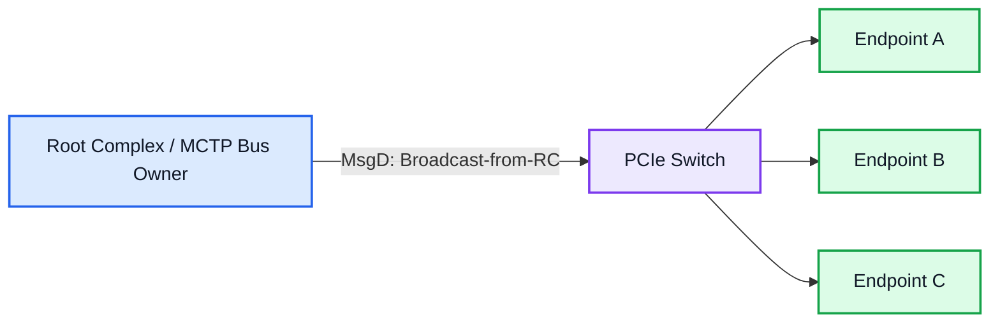
```mermaid
flowchart LR
    RC["Root Complex / MCTP Bus Owner"]
    SW["PCIe Switch"]
    EP1["Endpoint A"]
    EP2["Endpoint B"]
    EP3["Endpoint C"]

    RC -->|"MsgD: Broadcast-from-RC"| SW
    SW --> EP1
    SW --> EP2
    SW --> EP3

    style RC fill:#dbeafe,stroke:#2563eb,stroke-width:2px,color:#111827
    style SW fill:#ede9fe,stroke:#7c3aed,stroke-width:2px,color:#111827
    style EP1 fill:#dcfce7,stroke:#16a34a,stroke-width:2px,color:#111827
    style EP2 fill:#dcfce7,stroke:#16a34a,stroke-width:2px,color:#111827
    style EP3 fill:#dcfce7,stroke:#16a34a,stroke-width:2px,color:#111827
```

在 MCTP over PCIe VDM 的完整 Endpoint Discovery 中，兩種 routing 會成對出現：

1. RC-side 的 MCTP Bus Owner 以 `Broadcast-from-RC` 傳送 `Prepare for Endpoint Discovery Request` 或 `Endpoint Discovery Request`，Destination EID 使用 broadcast EID `0xFF`。
2. 各 Endpoint 以 `Route-to-RC` 回傳 `Endpoint Discovery Response`。
3. Bus Owner 從每個 response 的 PCIe `Requester ID` 得到來源 Endpoint 的 BDF。
4. BDF 已知後，Bus Owner 改用 `Route by ID` 對個別 Endpoint 傳送 `Set Endpoint ID` 等單播 request。

> **不要混淆：** `Broadcast-from-RC` 是 PCIe fabric 內的 Message TLP routing，不是 Ethernet broadcast，也不是把封包送到系統中的所有 PCIe hierarchy；實際範圍仍受 Root Complex hierarchy、Switch forwarding 與平台設定限制。

**MCTP over VDM 封裝結構**
當一筆 MCTP 訊息透過 PCIe VDM 傳送時，其封包結構宛如俄羅斯娃娃：

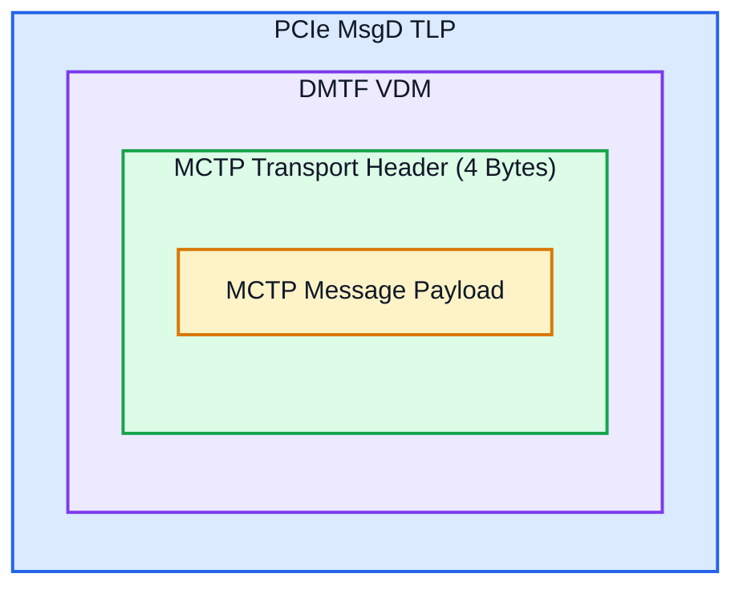
```mermaid
flowchart TB
    subgraph A["PCIe MsgD TLP"]
        direction TB
        subgraph B["DMTF VDM"]
            direction TB
            subgraph C["MCTP Transport Header (4 Bytes)"]
                direction TB
                D["MCTP Message Payload"]
            end
        end
    end

    style A fill:#dbeafe,stroke:#2563eb,stroke-width:2px,color:#111827
    style B fill:#ede9fe,stroke:#7c3aed,stroke-width:2px,color:#111827
    style C fill:#dcfce7,stroke:#16a34a,stroke-width:2px,color:#111827
    style D fill:#fef3c7,stroke:#d97706,stroke-width:2px,color:#111827
```

| 層次 | 這一層新增的欄位 | 作用 |
| :--- | :--- | :--- |
| <span style="display:inline-block;padding:2px 6px;border:1px solid #2563eb;background:#dbeafe;border-radius:4px;">PCIe MsgD TLP</span> | `Fmt/Type`、`Length`、`Requester ID`、`Route Control` | 把整包資料變成一筆可在 PCIe fabric 上傳送的 `MsgD` 封包，並決定路由方式。 |
| <span style="display:inline-block;padding:2px 6px;border:1px solid #7c3aed;background:#ede9fe;border-radius:4px;">DMTF VDM</span> | `Vendor ID = 0x1AB4` | 告訴接收端這不是一般 Message，而是 DMTF 定義的 VDM。 |
| <span style="display:inline-block;padding:2px 6px;border:1px solid #16a34a;background:#dcfce7;border-radius:4px;">MCTP Transport Header</span> | `Source EID`、`Destination EID`、`SOM`、`EOM`、`Packet Sequence`、`TO` | 描述這筆 MCTP 封包要送給誰、是不是分段封包、這是第幾段。 |
| <span style="display:inline-block;padding:2px 6px;border:1px solid #d97706;background:#fef3c7;border-radius:4px;">MCTP Message Payload</span> | `Message Type`、上層協定資料 | 真正承載 `PLDM`、`SPDM`、`NVMe-MI` 等內容。 |
| <span style="display:inline-block;padding:2px 6px;border:1px solid #6b7280;background:#f3f4f6;border-radius:4px;">PCIe Link Protection</span> | `LCRC` | 提供 PCIe 鏈路層的完整性校驗。 |

可整理為：

1. 以 `MsgD` 作為 PCIe 外層封包承載資料
2. 在裡面標明這是一筆 `DMTF VDM`
3. 再塞入 `MCTP Transport Header`
4. 最裡面才是真正的 `PLDM / SPDM / NVMe-MI` 內容

**在 AST2700 韌體中的實作重點：**
在 AST2700 韌體開發中，處理 MCTP over VDM 需要留意以下環節：
1. **VDM 控制器啟用**：AST2700 內建了硬體層級的 MCTP/VDM 控制器，韌體需設定將其綁定至對應的 PCIe Function，並確保 PCIe Configuration Space 的 VDM Enable 位元已開啟。
2. **EID 動態分配**：端點 ID (Endpoint ID) 是 MCTP 的網址。在 MCTP over PCIe VDM 架構中，Bus Owner 常位於 PCIe Root Complex 一側；AST2700 啟動後，若採用動態 EID，需透過 MCTP Control Message 與該 Bus Owner 互動，以取得或確認自身的 EID。
3. **收發與中斷處理**：當 AST2700 硬體收到目標為自己 EID 的 VDM 封包時，會將 Payload 放入內部 FIFO 並觸發中斷。韌體 ISR 需快速將資料取出，轉交給 OpenBMC 的 `mctpd` 服務進行高階協議解析。

---

### 3.6 Msg TLP (訊息封包) 解析

在 PCIe 協定中，**Msg TLP（Message Transaction Layer Packet，訊息封包）** 是一種非常特殊且重要的封包類型。

如果說 Memory Read/Write TLP 是用來「搬運實際的資料」，那麼 **Msg TLP 就是用來「傳遞系統事件與控制訊號」的虛擬實體線**。

##### 1. Msg TLP 的存在意義：虛擬化實體線路

在早期的傳統 PCI 時代，主機板上的插槽有許多專屬的實體腳位，用來傳遞特定訊號，例如：
*   實體中斷線（INTA#, INTB#...）
*   錯誤回報線（SERR#, PERR#）
*   電源管理訊號線（PME#）

到了 PCIe 時代，為了大幅減少實體接腳數量（改走高速序列傳輸），PCIe 協定把這些「實體線路的電位變化」，全部打包成數位化的網路封包來傳送——這種封包就是 **Msg TLP**。

##### 2. Msg TLP 的兩大類型

根據是否攜帶額外資料，Msg TLP 分為兩種：
*   **Msg (Message without Data)**：純通知訊號，不帶 Payload。封包只有 16 Bytes 的 Header。
*   **MsgD (Message with Data)**：除了通知外，還夾帶實質資料。封包由 16 Bytes Header + Payload 構成。

**Msg (Message without Data) 主要用途**

`Msg` 適合用來傳輸「Message Code 本身就足以表達語意」的事件。它不需要額外 payload，接收端只要看 `Message Code`、`Routing`、`Requester ID` 等 header 欄位，就能知道發生什麼事。

| 訊息類型 | 常見用途 | 為什麼不需要 payload |
| :--- | :--- | :--- |
| **Legacy INTx** | `Assert_INTx` / `Deassert_INTx`，模擬傳統 PCI 的 INTA# / INTB# / INTC# / INTD#。 | 中斷線狀態由 Message Code 表示即可。 |
| **Power Management Event** | Endpoint 發出 `PME`，通知 Root Complex 有電源管理事件或喚醒需求。 | 事件本身就是通知；後續狀態可由 configuration register 查詢。 |
| **Error Reporting** | `ERR_COR`、`ERR_NONFATAL`、`ERR_FATAL` 等錯誤回報。 | Message Code 表示錯誤嚴重程度；詳細錯誤資訊通常由 AER register 保存。 |
| **Hot-Plug / Slot 事件** | 通知 slot、presence、attention 或平台相關事件。 | 事件觸發後，軟體可再讀取對應 port / slot 狀態暫存器。 |
| **Vendor-defined 無資料事件** | 廠商自定義的簡短事件通知。 | 若只需表示「某事件發生」，不需帶資料，可用 Msg；若要帶管理封包，通常改用 MsgD。 |

簡單判斷：**Msg 是事件通知；MsgD 是事件通知加上一段資料 payload**。因此 INTx、PME、Error 這類控制訊號常用 `Msg`；MCTP over PCIe VDM 因為要承載 MCTP packet，通常使用 `MsgD`。

**MsgD payload 長度如何決定**

`MsgD` 的 payload 長度由 TLP Header 內的 **Length 欄位**決定。`Length` 是以 **DW (Double Word, 4 Bytes)** 為單位，不是 byte 為單位。

| 欄位 | 說明 |
| :--- | :--- |
| `Fmt` | 決定這是一筆 `Message without Data` 還是 `Message with Data`。 |
| `Type` | 表示 TLP 類型是 Message。 |
| `Length` | 表示 data payload 的 DW 數量。`1 DW = 4 Bytes`。 |
| `Message Code` | 表示這筆 Message 的事件或 VDM 類型。 |

計算方式：

```text
MsgD payload bytes = Length * 4
```

例如：

| TLP Length 欄位 | Payload 大小 | 說明 |
| :---: | :---: | :--- |
| `0x001` | 4 Bytes | 最小 1 DW payload。 |
| `0x004` | 16 Bytes | 4 DW payload。 |
| `0x010` | 64 Bytes | 16 DW payload；MCTP baseline transmission unit 的基本門檻。 |
| `0x100` | 1024 Bytes | 256 DW payload。 |

> **注意**：對有 data payload 的 TLP（例如 `MsgD`）而言，`Length = 0` 的編碼通常代表 `1024 DW`，也就是 `4096 Bytes`，不是 0 Bytes。`Msg without Data` 是否不帶 payload 是由 `Fmt` 決定，不應用這個方式解讀。實際可用 payload 大小還會受裝置能力、Max Payload Size、Message / VDM 格式與平台限制影響。

**MCTP over PCIe VDM 的 64 Bytes baseline**

對 MCTP over PCIe VDM 來說，實作至少要能支援 MCTP Base Specification 定義的 **baseline transmission unit**。常見基本值是 **64 Bytes**，也就是 PCIe VDM data 至少要能承載到 `16 DW`。

這裡要分清楚三個大小：

| 層級 | 大小意義 | 誰決定 / 宣告 |
| :--- | :--- | :--- |
| PCIe `Length` | 這筆 `MsgD` TLP data payload 有幾個 DW。 | TLP Header 直接帶出。 |
| PCIe Max Payload Size (MPS) | 此 PCIe function / path 允許單筆 data TLP 使用的最大 payload。 | PCIe enumeration 時由 Root Complex 讀 capability 並設定。 |
| MCTP transmission unit | 單個 MCTP packet 在此 transport/path 上可使用的最大傳輸單位。 | MCTP transport binding、endpoint / bridge / bus owner 能力與上層 discovery 決定。 |

因此，`MsgD Length` 只是這一包實際帶了多少資料；它不是「此裝置最大支援多少」的宣告欄位。能不能送超過 64 Bytes，要看 enumeration / discovery 後得到的上限。

**更大的 payload 如何 enumeration / discovery**

1. **PCIe enumeration 先決定硬體 TLP 上限**

   Host / Root Complex 在 PCIe enumeration 時會讀取 PCI Express Capability：

   | Capability / Register | 欄位 | 意義 |
   | :--- | :--- | :--- |
   | Device Capabilities Register | `Max_Payload_Size Supported` | 端點硬體最多支援多大的 TLP data payload。常見值為 128、256、512、1024、2048、4096 Bytes。 |
   | Device Control Register | `Max_Payload_Size` | Host 實際設定此 function 可使用的 MPS，通常不能超過 path 上任一元件可支援的最小值。 |

   實務判斷：

   ```text
   PCIe usable TLP payload upper bound
     = min(endpoint supported MPS,
           upstream/root-port configured MPS,
           bridge/switch path capability,
           platform policy)
   ```

   Linux 可用 `lspci -vv -s <BDF>` 觀察，常見欄位如下：

   ```text
   DevCap: MaxPayload 256 bytes
   DevCtl: MaxPayload 128 bytes
   ```

   這代表 endpoint 宣告可支援 256 Bytes，但 Host 目前只設定它使用 128 Bytes。

2. **MCTP 層再決定管理封包可用 transmission unit**

   MCTP baseline 是 64 Bytes；更大的 transmission unit 是 optional。若 endpoint、bridge、bus owner 或上層管理規格有宣告較大的 MCTP transmission unit，sender 才能使用更大的 MCTP packet。

   對 NVMe-MI 這類跑在 MCTP 上的管理協定，裝置的管理資料結構可宣告 **Maximum MCTP Transmission Unit Size**；若 port type 是 PCIe，這個值必須落在 **64 Bytes 到 PCIe Max Payload Size Supported** 之間。

3. **沒有確認前，不要假設超過 64 Bytes 可用**

   若韌體或 driver 尚未取得較大的 MCTP transmission unit，保守做法是：

   ```text
   effective_mctp_tu = 64 Bytes
   ```

   大於 64 Bytes 的 MCTP message 應切成多個 MCTP packets，使用 MCTP header 的 `SOM`、`EOM`、`Packet Sequence` 進行分段與重組。這也是為什麼實務上常看到「64 Bytes 以內正常，超過就 timeout」：通常不是 `MsgD` 本身不能超過 64，而是某一層的 MCTP transmission unit / bridge / endpoint capability 沒有被正確 discovery、設定或支援。

對 `MCTP over PCIe VDM` 來說，`MsgD payload` 裡面還會再放一層 VDM / MCTP 內容，因此「PCIe TLP payload 長度」不一定等於「真正的 MCTP message 長度」：

```text
PCIe MsgD payload
  = VDM header
  + MCTP transport header
  + MCTP message body
  + optional padding

Actual MCTP bytes
  = (TLP Length * 4)
  - VDM/MCTP header bytes
  - padding bytes
```

其中 padding 通常用來讓 payload 對齊 DW 邊界；接收端需依 MCTP over PCIe VDM header 中的長度 / padding 相關欄位，還原真正的 MCTP packet，不應只用 PCIe `Length` 欄位直接當成 MCTP message 長度。

##### 3. Msg TLP 的路由方式 (Routing)

一般的 Memory TLP 是靠「記憶體位址 (Address)」來決定如何走；但 Msg TLP 通常沒有記憶體位址，它依靠 TLP Header 中的 **Route Control (路由控制)** 欄位來決定去向。常見的路由方式有：
1.  **Route to Root Complex**：不管在哪，直接往上發給 CPU (最常見於錯誤回報)。
2.  **Broadcast from RC**：由 CPU 往下廣播給全系統的所有設備。
3.  **Local / Implicit**：只發送給相鄰的 PCIe Switch 或設備。
4.  **Route by ID**：精準指定目標設備的 Bus / Device / Function (BDF) 進行點對點傳送。

##### 4. 常見的 Msg TLP 種類 (Message Codes)

Msg TLP 的 Header 中有一個 **Message Code (8-bit)** 欄位，用來定義這個封包所代表的事件類型。常見的群組包含：

| 訊息類別 | 典型 Message Code | 說明 |
| :--- | :--- | :--- |
| **傳統中斷 (INTx)** | `Assert_INTA` / `Deassert_INTA` | 模擬傳統 PCI 的實體中斷線拉低與放開。 |
| **電源管理 (PM)** | `PM_PME`, `PME_Turn_Off` | 設備喚醒主機，或主機通知設備準備斷電。 |
| **錯誤回報 (Error)**| `ERR_COR`, `ERR_FATAL` | 設備通知 Root Complex 發生了可糾正或致命的硬體錯誤。 |
| **熱插拔 (Hot-Plug)**| `Attention_Button_Pressed` | 通知系統有人按下了 PCIe 插槽旁的退出按鈕。 |
| **自定義訊息 (VDM)** | `0x7E` (Type 0) / `0x7F` (Type 1) | **Vendor Defined Message (廠商自定義訊息)**。 |

---

##### 5. 與 AST2700 / BMC 開發最相關的 Msg TLP：VDM

對於負責 OpenBMC 與 AST2700 韌體開發的工程師來說，最需要關注的 Msg TLP 就是 **VDM (Vendor Defined Message, Msg Code = `0x7E` / `0x7F`)**。

前述 MCTP over PCIe VDM 機制展現了 VDM 的擴充彈性：
1.  **不吃 BAR 空間**：BMC 不需要映射任何 Host 的實體記憶體，就能透過 VDM 封包直接與 Host 對話。
2.  **良好的穿透性**：因為 VDM 可使用 "Route by ID"（指定 BDF），所以 AST2700 (BMC) 可直接發送 VDM Msg TLP 穿過 PCIe Switch，**定位至插在主機板上的另一張 NVMe 網卡或 GPU**，進行直接的網管控制（MCTP 協議），不需 Host CPU 軟體介入。

**總結來說**：
Msg TLP 是 PCIe 高速公路上的「警車、救護車與郵務車」，它們不搬運一般應用程式的記憶體資料，而是負責維持整個 PCIe 系統底層運作（報錯、省電、中斷）以及傳遞高階管理指令（如 VDM/MCTP）的關鍵機制。

---

### 3.7 TLP Ordering Rules（排序規則）

前面的 Doorbell、Mailbox、SQ/CQ、MMBI 都隱含同一個假設：**「先寫資料、再按門鈴」時，對端看到門鈴就保證資料已經到位**。這個保證不是軟體自己約定出來的，而是 PCIe 規範的 **Producer-Consumer Ordering Model** 在 fabric 層提供的。理解它，才能分清楚哪些順序是硬體保證、哪些要靠 firmware 自己加 barrier。

**三種 TLP 類別**

PCIe 排序規則以三種交易類別為基礎：

| 類別 | 代表 TLP | 特性 |
| :--- | :--- | :--- |
| **Posted (P)** | `MWr`、`MsgD` | 不等 Completion，發出即視為完成。 |
| **Non-Posted (NP)** | `MRd`、`CfgRd/Wr`、`IORd/Wr`、`AtomicOp` | 需要對端回 Completion。 |
| **Completion (C)** | `Cpl`、`CplD` | 回應某一筆 Non-Posted。 |

**核心排序矩陣（同一路徑、同一 Traffic Class）**

下表的「後者是否可超車前者」：`No` 表示必須保持順序、`Yes` 表示允許硬體重排：

| 後者 ↓ ＼ 前者 → | Posted | Non-Posted | Completion |
| :--- | :---: | :---: | :---: |
| **Posted** | No（必保序） | Yes | Yes |
| **Non-Posted** | No | Yes | Yes |
| **Completion** | No | Yes | Yes |

從這張表可萃取出韌體最常用的兩條保證：

1. **Posted 不能超越先前的 Posted**：兩筆 `MWr`（先寫資料、再寫 doorbell）在同一路徑上保持先後順序 → 這正是「按門鈴前資料一定先到」的硬體依據。
2. **Read 會把先前的 Write 推到底（Read pushes Write）**：發出 `MRd` 前的 `MWr` 必須先抵達。所以「寫完暫存器後讀回（read-back）」可當作 flush，確認前面的 write 已生效。

**Relaxed Ordering / ID-based Ordering**

- `Attr[RO]`（Relaxed Ordering）：允許硬體放寬上述部分限制以提升效能；一旦開啟，就不能再假設嚴格 producer-consumer 順序，doorbell / pointer 類控制路徑應避免使用。
- `IDO`（ID-based Ordering）：只對不同來源 ID 之間放寬排序，同一來源仍維持順序。

> **韌體重點**：控制面（doorbell、write/read pointer、status flag）一律用預設嚴格排序（`RO=0`），並以「資料先、通知後」的順序送出；需要強制 flush 時補一次 MMIO read-back。只有純資料搬運（如 KVM framebuffer、大量 DMA）才考慮開 RO 換效能。注意排序保證只在「同一條路徑、同一 Traffic Class」成立；跨 TC 或跨 path 不保證順序。

---

### 3.8 Completion 與錯誤回應（Completion Status / Timeout）

Non-Posted request（如 MMIO Read、Config Read）一定要等到一筆 Completion 才算結束。Completion 內含 **Completion Status** 欄位，決定這筆交易是成功、被拒、還是要重試。前面 1.2.4 與 2.4 提到的「MMIO read timeout」「枚舉讀到 `0xFFFF`」其實都是 Completion 行為的結果。

**Completion Status 代碼**

| Status | 名稱 | 意義 | 韌體 / 軟體常見對應 |
| :---: | :--- | :--- | :--- |
| `000b` SC | Successful Completion | 正常完成，`CplD` 帶回資料。 | 一切正常。 |
| `001b` UR | Unsupported Request | 目標不認得這筆 request（位址不在任何 BAR、不支援的 TLP type）。 | Host 端常顯示為讀回 `0xFFFFFFFF`；枚舉空槽即屬此類。 |
| `010b` CRS | Configuration Request Retry Status | 裝置還沒準備好回應 Config Read，要求 Host 稍後重試。 | 裝置上電 / 重置後尚未 ready，Host 會重發 Config Read。 |
| `100b` CA | Completer Abort | 目標存在，但因內部錯誤或非法存取而拒絕。 | EP 韌體判定 request 非法（越界、狀態不允許）時回報。 |

**Completion Timeout**

若 Requester 發出 Non-Posted 後，在規定時間內沒收到對應 Completion（對方掛了、link down、封包遺失、目標卡死），就觸發 **Completion Timeout**：

| 現象 | 可能原因 | 排查方向 |
| :--- | :--- | :--- |
| MMIO Read 卡住後 timeout | EP 沒回 Completion、link 不在 L0、completion path 異常 | 檢查 link state（ASPM 喚醒）、BAR / Memory Space Enable、EP ISR 是否卡死。 |
| CPU 讀回 `0xFFFFFFFF` | 收到 UR 或 master abort，RC 以全 1 回填 | 確認 BDF / BAR 是否正確、裝置是否已枚舉、function 是否存在。 |
| 枚舉時某 BDF 全 1 | 該位置無裝置回應（UR） | 正常的空槽偵測，非錯誤。 |

> **`0xFFFFFFFF` 的由來**：當 RC 收到 UR、或請求逾時（master abort）時，多數平台會對 CPU 端回填全 1。所以「讀到 `0xFFFF` / `0xFFFFFFFF`」本身不是資料，而是「沒有有效 Completer」的訊號——這也是枚舉判斷空槽的依據。

**與 Error Message（3.6）的關係**

UR、CA、Completion Timeout 不只是回給單筆 Requester；嚴重時 EP / RC 會另外發出 `ERR_COR` / `ERR_NONFATAL` / `ERR_FATAL` 這類 Error Message TLP（見 3.6），由 Root Complex 的 AER 收錄。對 **BMC 作為 RC** 的情境，下游 Endpoint 的 completion timeout 或 UR 常透過 AER 中斷與 `dmesg` 的 AER log 呈現。

> **韌體重點**：EP 韌體要明確定義「打不到任何 BAR 或非法存取時回 UR / CA」「裝置 reset 中尚未 ready 時對 Config Read 回 CRS」；不要讓 request 無回應而拖到 Host 端 Completion Timeout——前者 Host 可立即得到明確錯誤，後者要等數十 ms ~ 秒級逾時且更難除錯。

---

## 四、PCIe RC / EP 模式與多功能裝置

本章聚焦 PCIe controller 在不同拓樸中的角色。AST2700 作為 EP 時，指定的 PCIe 介面會向上游 Host 呈現可被枚舉的 Endpoint Function；作為 RC 時，BMC Linux 則管理一個獨立的 PCIe hierarchy，枚舉並控制實際連接於其 Root Port 下游的裝置。可用角色與模式配置仍取決於所使用的 controller、port 及板級設計。

### 4.1 PCIe Root Complex 模式

在 Endpoint (EP) 拓樸中，AST2700 向上游 Host 提供一個或多個可被枚舉的 PCIe Function，供 Host 載入對應 driver 並透過 BAR、DMA 或 Message TLP 與 BMC 功能通訊。在 Root Complex (RC) 拓樸中，AST2700 則建立由 BMC Linux 擁有的 PCIe hierarchy，負責下游裝置的枚舉、資源配置、中斷與 driver binding。

RC 模式的核心用途不是特指連接 NVMe，而是讓 BMC 能直接管理不屬於 Host CPU PCIe domain 的專用 PCIe 周邊。依硬體連接拓樸與產品需求，下游可連接 FPGA、網路或儲存控制器、PCIe switch，以及其他 BMC 專用的客製 Endpoint；前提是這些裝置實際連接於 AST2700 所管理的 Root Port。

#### 4.1.1 RC 與 EP 的角色差異

<table>
  <tr>
    <th style="text-align:center;">項目</th>
    <th style="text-align:center;background:#dbeafe;">PCIe Endpoint (EP)</th>
    <th style="text-align:center;background:#dcfce7;">PCIe Root Complex (RC)</th>
  </tr>
  <tr>
    <td><strong>核心角色</strong></td>
    <td style="background:#eff6ff;">AST2700 向 Host 呈現 PCIe Endpoint Function，供 Host 枚舉與驅動。</td>
    <td style="background:#f0fdf4;">BMC Linux 作為 PCIe host，建立並管理下游 PCIe hierarchy。</td>
  </tr>
  <tr>
    <td><strong>枚舉方向</strong></td>
    <td style="background:#eff6ff;">Host / Root Complex → BMC EP</td>
    <td style="background:#f0fdf4;">BMC RC → local endpoint / switch</td>
  </tr>
  <tr>
    <td><strong>Configuration Space</strong></td>
    <td style="background:#eff6ff;">BMC 對 Host 呈現 Type 0 Header。</td>
    <td style="background:#f0fdf4;">BMC 讀取下游裝置的 Configuration Space。</td>
  </tr>
  <tr>
    <td><strong>BAR 意義</strong></td>
    <td style="background:#eff6ff;">BMC 暴露 BAR 給 Host 存取。</td>
    <td style="background:#f0fdf4;">下游裝置暴露 BAR，BMC 分配 MMIO resource。</td>
  </tr>
  <tr>
    <td><strong>Kernel model</strong></td>
    <td style="background:#eff6ff;">PCI Endpoint Controller / EP Function</td>
    <td style="background:#f0fdf4;">PCI host bridge / PCI core / 下游裝置 driver</td>
  </tr>
  <tr>
    <td><strong>常見用途</strong></td>
    <td style="background:#eff6ff;">xHCI emulation、MMBI、MCTP over PCIe、Host/BMC 通訊。</td>
    <td style="background:#f0fdf4;">管理 BMC 專用的 FPGA、網路或儲存控制器、PCIe switch 與其他客製 Endpoint。</td>
  </tr>
</table>

#### 4.1.2 BMC 作為 RC 的典型流程

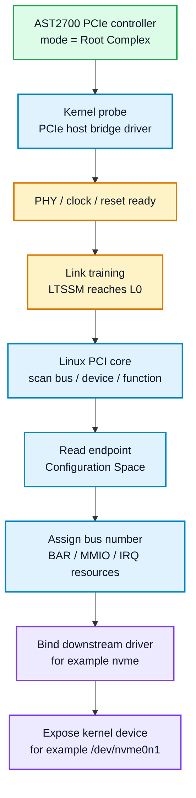
```mermaid
flowchart TD
    A[AST2700 PCIe controller<br/>mode = Root Complex] --> B[Kernel probe<br/>PCIe host bridge driver]
    B --> C[PHY / clock / reset ready]
    C --> D[Link training<br/>LTSSM reaches L0]
    D --> E[Linux PCI core<br/>scan bus / device / function]
    E --> F[Read endpoint<br/>Configuration Space]
    F --> G[Assign bus number<br/>BAR / MMIO / IRQ resources]
    G --> H[Bind downstream driver<br/>for example nvme]
    H --> I[Expose kernel device<br/>for example /dev/nvme0n1]

    style A fill:#dcfce7,stroke:#16a34a,stroke-width:2px,color:#111827
    style B fill:#e0f2fe,stroke:#0284c7,stroke-width:2px,color:#111827
    style C fill:#fef3c7,stroke:#d97706,stroke-width:2px,color:#111827
    style D fill:#fef3c7,stroke:#d97706,stroke-width:2px,color:#111827
    style E fill:#e0f2fe,stroke:#0284c7,stroke-width:2px,color:#111827
    style F fill:#e0f2fe,stroke:#0284c7,stroke-width:2px,color:#111827
    style G fill:#e0f2fe,stroke:#0284c7,stroke-width:2px,color:#111827
    style H fill:#ede9fe,stroke:#7c3aed,stroke-width:2px,color:#111827
    style I fill:#ede9fe,stroke:#7c3aed,stroke-width:2px,color:#111827
```

RC 模式的核心是：**BMC Linux 變成 PCIe host**。因此重點不再是 EPF 如何對 Host 呈現一個功能，而是 host bridge driver 是否能正確描述 root bus、resource window、interrupt domain 與 SoC PCIe controller 初始化。

#### 4.1.3 Kernel 提供的通用 PCIe Host 功能

Linux kernel 已提供 RC 模式所需的通用 PCIe host stack。當 AST2700 host bridge driver 完成控制器初始化並註冊 root bus 後，PCI core 會建立下游裝置模型；產品軟體再透過標準 class driver 或 vendor driver 使用這些裝置。正常情況下不應自行重作枚舉、BAR 配置或 driver binding。

<table>
  <tr>
    <th style="text-align:center;">Kernel 既有功能</th>
    <th style="text-align:center;">說明</th>
  </tr>
  <tr style="background:#e0f2fe;">
    <td><strong>PCI core enumeration</strong></td>
    <td>掃描 bus/device/function、讀取 Vendor ID / Device ID / Class Code。</td>
  </tr>
  <tr style="background:#e0f2fe;">
    <td><strong>Configuration Space access framework</strong></td>
    <td>透過 host bridge driver 提供的 config read/write 操作讀寫下游裝置。</td>
  </tr>
  <tr style="background:#e0f2fe;">
    <td><strong>BAR resource sizing / assignment</strong></td>
    <td>探測 BAR size，分配 MMIO / I/O resource，寫回 BAR。</td>
  </tr>
  <tr style="background:#e0f2fe;">
    <td><strong>Bus number management</strong></td>
    <td>管理 root bus、secondary bus、subordinate bus。</td>
  </tr>
  <tr style="background:#ede9fe;">
    <td><strong>Driver binding</strong></td>
    <td>根據 Vendor ID、Device ID、Class Code 綁定標準 driver 或 vendor driver。</td>
  </tr>
  <tr style="background:#ede9fe;">
    <td><strong>Class / vendor driver model</strong></td>
    <td>標準裝置使用既有 class driver；FPGA 或其他 BMC 專用的客製 Endpoint 則由 vendor driver 綁定。</td>
  </tr>
  <tr style="background:#ede9fe;">
    <td><strong>MSI / MSI-X framework</strong></td>
    <td>提供 generic MSI domain、IRQ allocation、interrupt delivery framework。</td>
  </tr>
  <tr style="background:#f3f4f6;">
    <td><strong>Power management</strong></td>
    <td>提供 PCI device power state、runtime PM、部分 ASPM / PME 支援。</td>
  </tr>
  <tr style="background:#f3f4f6;">
    <td><strong>sysfs / debugfs visibility</strong></td>
    <td><code>/sys/bus/pci/devices</code>、resource、config、driver binding 等標準觀察介面。</td>
  </tr>
</table>

在典型 BMC 管理應用中，Linux PCI core 先發現 FPGA 或其他 BMC 專用的 PCIe Endpoint，再由對應 driver 映射 BAR、配置中斷與 DMA，向上提供控制、telemetry、firmware update 或健康監控介面。PCI core 負責標準 PCIe 裝置生命週期；driver 與 OpenBMC service 才負責產品功能與管理語意。

#### 4.1.4 平台需實作與客製化的部分

RC 模式仍需要 SoC/BSP 正確提供平台相關實作。這些是通用 kernel core 無法憑空知道的內容：

| 區塊 | 需要提供的內容 |
| :--- | :--- |
| **硬體描述** | Device Tree / ACPI 描述 PCIe controller base address、reg range、bus range、interrupt、clocks、resets、power domains。 |
| **Controller bring-up** | PCIe host bridge driver 初始化 AST2700 PCIe controller，設定 mode、config access、link training、resource window。 |
| **PHY / clock / reset** | 啟動 SerDes/PHY、reference clock、controller reset sequence。 |
| **Address translation** | 設定 outbound window；若下游裝置 DMA 回 BMC memory，需設定 inbound region、DMA mask 或 IOMMU policy。 |
| **Interrupt routing** | 將 INTx、MSI、MSI-X 或平台中斷映射到 Linux IRQ。 |
| **Board power policy** | 控制 endpoint power rail、PERST#、CLKREQ#、reset timing、presence detect。 |
| **Recovery policy** | 處理 link down、AER、completion timeout、hot reset、retrain、power cycle 或重掃 bus。 |
| **Endpoint driver** | 依下游裝置功能實作或啟用對應 driver，處理 BAR register、DMA queue、interrupt、reset 與裝置專屬協定。 |
| **OpenBMC integration** | 將下游裝置整合至 inventory、telemetry、health monitoring、firmware update、事件紀錄、D-Bus 與 Redfish。 |

這些工作通常分散在 DTS、clock/reset driver、PHY driver、PCIe host driver、interrupt controller driver 與平台硬體初始化中。若 AST2700 上游 kernel 已有對應 host driver，平台通常只需補正 DTS 與 platform policy；若沒有，才需要新增或擴充 host bridge driver。

自行實作應集中在 SoC、平台硬體差異與產品需求，不應重作 PCIe 標準共通流程：

<table>
  <tr>
    <th style="text-align:center;background:#fee2e2;">不建議自行重作</th>
    <th style="text-align:center;background:#fee2e2;">原因</th>
  </tr>
  <tr>
    <td>PCI bus scanning</td>
    <td>Linux PCI core 已處理，重寫容易破壞 driver model。</td>
  </tr>
  <tr>
    <td>BAR sizing / assignment</td>
    <td>由 PCI core/resource allocator 負責，手動寫 BAR 會與 kernel resource tree 衝突。</td>
  </tr>
  <tr>
    <td>標準 class driver 與 PCI driver model</td>
    <td>標準裝置應使用既有 driver；客製功能也應以正常 PCI driver 綁定，不應繞過 driver core。</td>
  </tr>
  <tr>
    <td>MSI/MSI-X generic handling</td>
    <td>應接 Linux IRQ/MSI framework，不應私下繞過 kernel interrupt domain。</td>
  </tr>
  <tr>
    <td>Kernel 裝置模型與使用者空間介面建立</td>
    <td>應由 driver core 及對應 subsystem 建立 sysfs、devtmpfs、hwmon、netdev 或其他標準介面。</td>
  </tr>
</table>

#### 4.1.5 開發檢查清單

| 檢查項目 | 常用觀察方式 |
| :--- | :--- |
| Controller 是否 probe | `dmesg` 搜尋 PCIe host bridge / controller driver log。 |
| Link 是否進入 L0 | controller debug log、LTSSM 狀態暫存器、`dmesg` link up 訊息。 |
| Root bus 是否建立 | `ls /sys/bus/pci/devices`、`lspci`。 |
| 預期 Endpoint 是否出現 | `lspci -nn` 確認 BDF、Vendor ID、Device ID、Class Code 與拓樸位置。 |
| BAR 是否配置 | `lspci -vv`、`/sys/bus/pci/devices/.../resource`。 |
| Driver 是否綁定 | `lspci -k`、`/sys/bus/pci/devices/.../driver`。 |
| MSI/MSI-X 是否工作 | `/proc/interrupts`、driver log。 |
| BAR register 存取是否正常 | 使用 driver debug 介面或受控測試確認 MMIO read/write、register value 與 ordering。 |
| DMA 是否正常 | 執行裝置實際資料路徑測試，檢查 timeout、IOMMU、DMA mapping 與資料一致性錯誤。 |
| 管理功能是否可用 | 驗證控制命令、telemetry、health event、firmware update 與裝置 reset/recovery。 |
| OpenBMC 是否完成整合 | 檢查 D-Bus object、inventory、sensor/event log 與 Redfish 對外資訊。 |

總結來說，BMC 當 PCIe RC 時，**Linux PCI host stack 負責建立並管理 PCIe hierarchy**；平台開發負責讓 AST2700 controller 與平台電源、reset、address window、interrupt、DMA 正常運作；產品功能則由下游裝置 driver 與 OpenBMC service 完成。驗證時應以實際管理功能能否穩定運作為終點，而不只是確認 `lspci` 能看見裝置。

---

### 4.2 PCIe Endpoint 模式（Linux PCI Endpoint Framework）

與 4.1 的 RC 相反，EP 模式下 AST2700 不是 host，而是被上游 Host 枚舉的裝置——這也是它在 DC-SCM 最主要的角色。第一章說明 EP 對 Host 呈現什麼（Configuration Space）、第三章說明 EP 用哪些通道溝通；本節補上 **Linux 端如何把這個 EP function 實際做出來**。

#### 4.2.1 PCI Endpoint Framework 架構

Linux 的 PCI Endpoint Framework 把「控制器」與「功能」解耦：一邊是 SoC 的 PCIe controller，一邊是要對 Host 呈現的功能，兩者在執行期透過 configfs 綁定。

| 角色 | 說明 |
| :--- | :--- |
| **EPC**（Endpoint Controller） | AST2700 PCIe controller 的 EP 模式驅動。負責 link training、Config Space 存取、BAR / inbound / outbound window、MSI/MSI-X 硬體投遞。 |
| **EPF**（Endpoint Function） | 描述「要對 Host 呈現什麼功能」的 driver（如 xHCI、vendor function）。負責填 header、準備 BAR 內容、處理事件、發中斷、跑 DMA。 |
| **configfs**（`/sys/kernel/config/pci_ep/`） | 執行期把某個 EPF instance 綁定到某個 EPC，設定 Vendor / Device ID、BAR、MSI 數量等，再 `start` 觸發 link。 |

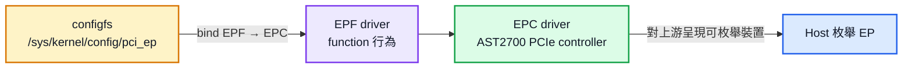
```mermaid
flowchart LR
    CFS["configfs<br/>/sys/kernel/config/pci_ep"] -->|bind EPF → EPC| EPF["EPF driver<br/>function 行為"]
    EPF --> EPC["EPC driver<br/>AST2700 PCIe controller"]
    EPC -->|對上游呈現可枚舉裝置| HOST["Host 枚舉 EP"]

    style CFS fill:#fef3c7,stroke:#d97706,stroke-width:2px,color:#111827
    style EPF fill:#ede9fe,stroke:#7c3aed,stroke-width:2px,color:#111827
    style EPC fill:#dcfce7,stroke:#16a34a,stroke-width:2px,color:#111827
    style HOST fill:#dbeafe,stroke:#2563eb,stroke-width:2px,color:#111827
```

#### 4.2.2 EPF driver 負責的事

| 工作 | 內容 | 對應章節 |
| :--- | :--- | :--- |
| 填寫 Config Space | 設定 Vendor ID / Device ID / Class Code / Header Type 與 Capability。 | 1.2 |
| 配置 BAR | 向 EPC 要求 BAR、決定大小與屬性，並準備 BAR 後面的 register / buffer。 | 1.2.3 |
| 處理 BAR 存取 | Host 的 inbound MMIO 命中 BAR 時，由 EPF 處理 doorbell / mailbox / queue 等行為。 | 三章 |
| 發 MSI / MSI-X | 透過 EPC API 對 Host 發中斷。 | 1.3 |
| DMA | 用 controller DMA engine 搬資料到 / 自 Host memory。 | 1.2.3（outbound） |

#### 4.2.3 Kernel 提供 vs 平台客製（對照 4.1）

| 分工 | EP 模式內容 |
| :--- | :--- |
| **Kernel 既有** | PCI Endpoint Framework 核心、configfs 介面、EPF / EPC 註冊與綁定模型、MSI/MSI-X delivery helper、`pci-epf-test` 等參考 EPF。 |
| **平台 / 產品需實作** | AST2700 的 EPC controller driver（PHY / clock / reset、BAR / window、link）、各功能的 EPF driver（xHCI emulation、MMBI、vendor function）、DTS 描述，以及與 Host 端 driver 的協定對接。 |

> **AST2700 實務**：第三章那些通訊機制（Doorbell、SQ/CQ、Mailbox、MMBI、MCTP over PCIe VDM）在 Linux EP 側，通常就是一個或多個 EPF driver 的行為；至於能不能同時對 Host 呈現多個 function，則回到下一節的 MFD 機制。

---

### 4.3 Multi-Function Device (MFD) 機制

#### 4.3.1 設備如何宣告為 MFD：Header Type Register

在 PCIe Configuration Space 的固定 64 Byte Header 中，偏移量 **`0x0E`** 的位置是 **Header Type Register**（8-bit）。MFD 的核心就是 Header Type 的 Bit 7：

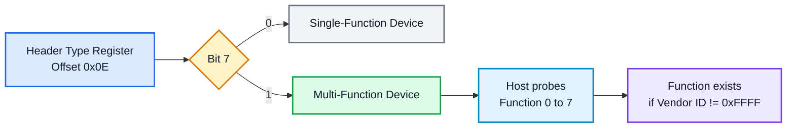
```mermaid
flowchart LR
    A[Header Type Register<br/>Offset 0x0E] --> B{Bit 7}
    B -->|0| C[Single-Function Device]
    B -->|1| D[Multi-Function Device]
    D --> E[Host probes<br/>Function 0 to 7]
    E --> F[Function exists<br/>if Vendor ID != 0xFFFF]

    style A fill:#dbeafe,stroke:#2563eb,stroke-width:2px,color:#111827
    style B fill:#fef3c7,stroke:#d97706,stroke-width:2px,color:#111827
    style C fill:#f3f4f6,stroke:#6b7280,stroke-width:2px,color:#111827
    style D fill:#dcfce7,stroke:#16a34a,stroke-width:2px,color:#111827
    style E fill:#e0f2fe,stroke:#0284c7,stroke-width:2px,color:#111827
    style F fill:#ede9fe,stroke:#7c3aed,stroke-width:2px,color:#111827
```

這個暫存器被切成兩個欄位：

| 位元範圍 | 欄位名稱                | 說明                                               |
| :------- | :---------------------- | :------------------------------------------------- |
| Bit 7    | **Multi-Function 旗標** | **1** = Multi-Function Device；**0** = Single-Function |
| Bit 6:0  | Header Layout Type      | `0x00` = Type 0（Endpoint）；`0x01` = Type 1（Bridge） |

**韌體只需要在 PCIe Configuration Space 初始化時，將 Bit 7 設為 1，Host 即可識別為 MFD。**


一個典型的 MFD 範例如下所示，三個 Function 共享同一個 Device Number：

```
Bus 0, Device 3, Function 0  ←  Header Type Bit7 = 1 → MFD 旗標
Bus 0, Device 3, Function 1  ←  另一個獨立功能 (e.g., Audio)
Bus 0, Device 3, Function 2  ←  又一個功能 (e.g., USB)
```

#### 4.3.2 Host 如何偵測 Function 數量：Configuration 掃描

Host 並**不**靠一個「Function 數量暫存器」來得知答案，而是透過 **逐一探測 (Brute-force Scanning)** 的方式確認。

**Routing ID（BDF）欄位結構**

在 CfgRd0 TLP Header 中，目標 Function 由一個 16-bit 的 **Routing ID（即 BDF：Bus / Device / Function）** 定位。注意這與 Configuration Space offset `00h` 的「Device ID」是完全不同的東西。這 16-bit 在識別碼中的實際位置為：

```
Routing ID[15:0] = Bus[15:8] : Device[7:3] : Function[2:0]
```

| 子欄位 | 位置 | 寬度 | 範圍 |
| :--- | :---: | :---: | :---: |
| Bus Number | `[15:8]` | 8 bits | 0 ~ 255 |
| Device Number | `[7:3]` | 5 bits | 0 ~ 31 |
| Function Number | `[2:0]` | 3 bits | 0 ~ 7 |

Host 只需改變低 3-bit 的 Function Number，即可依序對同一個 Device 下的 Function 0 ~ 7 發送 **Configuration Read Request**：

| 目標       | BDF (Bus:Dev:Fn) |
| :--------- | :--------------- |
| Function 0 | 1:00:**0** |
| Function 1 | 1:00:**1** |
| Function 2 | 1:00:**2** |
| …          | …         |
| Function 7 | 1:00:**7** |

**判斷依據：Vendor ID 是否有效**

Host 讀取每個 Function 的 **Vendor ID (Offset 00h)**：

* **非 `0xFFFF`**：Function 存在，繼續讀取並初始化該 Function。
* **`0xFFFF`**：無硬體回應，該 Function 不存在，跳過。


> 💡 **ARI 延伸**：在支援 **ARI (Alternative Routing-ID Interpretation)** 的設備（如 SR-IOV 虛擬化場景）中，一個 Device 可突破 8 個 Function 的限制，擴展至最多 **256 個 Function**。此時 Host 透過 Capability 串列中的 **Next Function Pointer** 來鏈式尋找，而非線性掃描 0~7。

#### 4.3.3 每個 Function 的獨立性與 Function 0

每個 Function 在 Host 眼中都是**獨立的 PCIe 實體**，各自擁有完整且互不共用的 Configuration Space：

| 資源 | 是否每個 Function 獨立 | 說明 |
| :--- | :---: | :--- |
| Configuration Space | 是 | 各 Function 有自己的 Type 0 Header（Vendor / Device ID、Class Code、Header Type）。 |
| BAR | 是 | 各 Function 宣告自己的 BAR，Host 分別配置 MMIO。 |
| Command Register | 是 | Memory Space Enable / Bus Master Enable 各自獨立啟用。 |
| MSI / MSI-X | 是 | 各 Function 有獨立的 capability 與 vector table。 |
| FLR | 是 | Function Level Reset 只重置該 Function，不影響其他（見 2.3.4）。 |

**Function 0 的特殊地位**

- **MFD 旗標只放在 Function 0 的 Header Type Bit 7**：Host 先讀 Function 0，看到 Bit 7 = 1 才會繼續探測 Function 1 ~ 7。
- **Function 0 必須存在**：若 Function 0 的 Vendor ID 回 `0xFFFF`，Host 會判定整個 Device 不存在，**不會**再去探測其他 Function。
- **Function 可以不連續**：實作上允許只提供 F0 與 F2、跳過 F1。傳統 brute-force 掃描會掃完 0 ~ 7、缺的就跳過；ARI 模式則靠 Next Function Pointer 串接。

> **AST2700 韌體重點**：把多個 EP 功能（如 xHCI、MMBI、vendor management）包成一個 MFD 時，務必確保 Function 0 永遠有效且帶 MFD bit；每個 Function 的 BAR、MSI-X、FLR 清理邏輯要各自獨立，避免某個 Function 的 reset 或錯誤狀態污染到其他 Function（呼應 2.3.4 FLR）。

---


## 五、PCIe 虛擬 USB 與 xHCI

### 5.1 PCIe 虛擬 USB：xHCI 控制器架構 (USB over PCIe)

在進階伺服器與 DC-SCM 架構中，為了減少 BMC 到主機板 (HPM) 的實體 USB 走線，可採用「透過 PCIe 虛擬化 USB」的設計。其核心概念是由 BMC 晶片透過 PCIe Endpoint 功能，對 Host 呈現為一個 **xHCI (eXtensible Host Controller Interface)** 控制器。

#### 5.1.1 xHCI 核心觀念
**xHCI** 是由 Intel 主導制定的 USB 3.0 主機控制器標準規範（向下相容 USB 2.0/1.1）。
在傳統架構中，xHCI 邏輯通常位於 CPU 的 PCH (南橋) 內。在「USB over PCIe」架構中，**AST2700 (BMC) 透過自身的 PCIe Endpoint (EP)**，向 Host 呈現為一個外接 xHCI USB 控制器。

#### 5.1.2 虛擬 USB 的運作流程
當伺服器開機，CPU (Host) 啟動 PCIe 硬體枚舉 (Enumeration) 時，流程如下：

1. **PCIe 枚舉 (Enumeration)**：CPU 掃描 PCIe Bus，並在 AST2700 Endpoint 上發現新裝置。讀取 PCIe Configuration Space 時，`Class Code` 顯示為 `0C0330`，代表 USB 3.0 xHCI Controller。
2. **載入通用驅動**：Host 作業系統 (Windows/Linux) 根據 class code 載入系統內建的標準 xHCI 驅動程式。此時並沒有實體 USB 訊號線參與，資料傳輸由 PCIe TLP 承載。
3. **BMC 軟體提供資料 (Virtual Media / KVM)**：BMC 內部 Linux 系統會將 Web UI 上的滑鼠、鍵盤事件，或掛載的 `.iso` 映像檔，轉換成符合 xHCI 規範的資料結構，例如 Transfer Rings，再交由 PCIe 控制器傳送給 Host CPU。
4. **Host 端處理**：Host CPU 接收到標準 xHCI 資料流後，依一般 USB 裝置流程處理，效果等同於接入實體鍵盤、滑鼠或儲存裝置。

#### 5.1.3 架構優缺點與開發注意事項
* ✅ **優勢 (省腳位與集中傳輸)**：可移除主機板上的實體 USB 銅線 (D+/D-)，並節省 DC-SCM 金手指上的專屬腳位，改由高頻寬且具備錯誤偵測與重傳機制的 PCIe link 承載。
* ⚠️ **開發注意事項 (ASPM 省電與斷線風險)**：由於 USB 功能依附於 PCIe link，若 Host 作業系統因省電策略進入 PCIe 低功耗狀態，例如 `ASPM L1`，或發生 PCIe link reset，Host xHCI driver 可能判定裝置被移除，導致遠端 KVM 或 Virtual Media 中斷。因此韌體需謹慎設定 ASPM、link power management 與 reset recovery 行為。

#### 5.1.4 BMC 本機「自用」實體 USB 與 NVMe 儲存
有些 SCM 板卡會在 BMC 所在環境預留實體 USB 埠或 M.2 插槽。若該設計目標是供 **BMC 本機使用**，例如儲存 debug log 或 BMC 快照備份，且不需要提供 Host Server 存取，資料路徑會完全不同。

BMC 此時的角色相當於獨立主機：

1. **若插上實體 USB 隨身碟 (AST2700 擔任 USB Host / xHCI)**：
   AST2700 晶片內部整合 **USB Host Controller**，其高階控制器可相容 xHCI 規範。此時主機板上的實體 USB 腳位會透過原生線路連至 AST2700 SoC。BMC 內部 Linux 系統可載入標準 `xhci-hcd` 或 ehci/uhci 核心驅動，枚舉插入的 USB 裝置，並掛載至自身檔案系統，例如 `/dev/sda`。
   > **重點**：整個存取過程完全在 SCM 卡內部完成，沒有使用到任何對外的 PCIe 金手指通道，Host Server 不會感知到該隨身碟的存在。

2. **若插上實體 NVMe SSD (AST2700 擔任 PCIe RC)**：
   若將高速 NVMe SSD 安裝於 SCM 板上的 M.2 插槽並供 BMC 專用，此時韌體開發者必須將 AST2700 晶片上對應該 M.2 插槽的 PCIe 控制器設定為 **RC (Root Complex)** 模式（作為 PCIe root 端）。只要鏈路訓練 (Link Training) 成功，BMC 內部的 Linux 就會啟動標準的 NVMe 磁碟驅動，將該 SSD 掛載成 `/dev/nvme0n1`，讓 BMC 獲得較高的儲存吞吐能力。此設計對應於「場景二」所提的 Local RC 合規設計。

### 5.2 實務總結：鍵盤與 USB 存取場景對照表

綜合上述 PCIe 架構與實體線路設計，可使用常見的「鍵盤敲擊」作為例子，歸納在四種不同的維護場景下，訊號所經過的轉譯路徑，以及實際扮演 USB Host 的元件：

| 場景 | 鍵盤實體位置 | USB Host 端 | 資料路徑（核心流程） | 是否經過 PCIe |
| :--- | :--- | :--- | :--- | :--- |
| **1. 遠端 KVM (管 HPM)** | 維護者的外部電腦 | HPM (主機 CPU) | 網路 → BMC CPU → vhub 虛擬打包 → **PCIe 隧道** → HPM | **是** |
| **2. 主機本地 (管 HPM)** | 插在伺服器前方主機埠 | HPM (主機 CPU) | 實體埠 → 主機板 PCH 晶片 xHCI → 主機 CPU | 否 |
| **3. BMC 遠端 (管 BMC)** | 維護者的外部電腦 | 無 (純網路數據封包) | 網路 → BMC 實體網卡 → AXI 內部匯流排 → BMC CPU | 否 |
| **4. BMC 本地 (管 BMC)** | 插在伺服器 BMC 專用埠 | BMC (AST2700) | 實體埠 → BMC 內建 xHCI → AXI 內部匯流排 → BMC CPU | 否 |

## 六、附錄：xHCI Doorbell Array（USB 規範的門鈴機制）

在 `3.1` 節中提到，**xHCI 的 Doorbell Array 並非 PCIe Doorbell**，兩者雖然名稱與概念相近，卻是完全獨立的規格。本節針對 xHCI Doorbell Array 進行完整說明，特別適用於理解 AST2700 虛擬 xHCI 控制器的韌體設計。

---

### 6.1 xHCI Doorbell Array 的規範背景

**xHCI（eXtensible Host Controller Interface）** 是 Intel 主導制定的 USB 3.x 主機控制器規範，向下相容 USB 2.0/1.1。xHCI 的 Doorbell Array 是規範中**明確定義**的一組通知暫存器，用來讓 **xHCI 驅動程式（軟體）** 通知 **xHCI 控制器硬體**：「某個佇列有新工作進來了，請去處理」。

> [!IMPORTANT]
> xHCI Doorbell Array 存在於 **xHCI 控制器的 MMIO 暫存器空間**中，是 USB 規格書（Intel xHCI Spec）定義的欄位，與 PCIe 規格書完全無關。無論該 xHCI 控制器是實體晶片還是 AST2700 模擬出來的虛擬裝置，都必須遵循相同的 Doorbell 暫存器佈局。

---

### 6.2 Doorbell Array 在 xHCI 記憶體空間中的位置

xHCI 控制器對外暴露的 MMIO 空間（透過 PCIe BAR 映射）被分為三個主要區域：

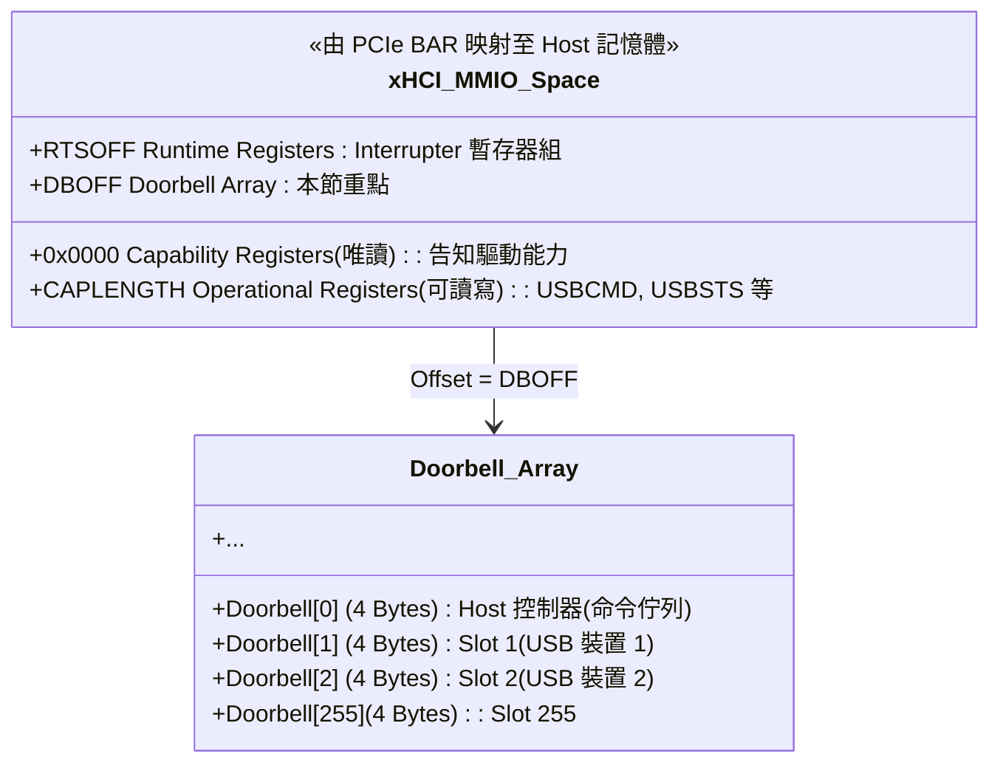
```mermaid
classDiagram
    class xHCI_MMIO_Space {
        <<由 PCIe BAR 映射至 Host 記憶體>>
        +0x0000 Capability Registers (唯讀) : 告知驅動能力
        +CAPLENGTH Operational Registers (可讀寫) : USBCMD, USBSTS 等
        +RTSOFF Runtime Registers : Interrupter 暫存器組
        +DBOFF Doorbell Array : 本節重點
    }
    class Doorbell_Array {
        +Doorbell[0] (4 Bytes) : Host 控制器 (命令佇列)
        +Doorbell[1] (4 Bytes) : Slot 1 (USB 裝置 1)
        +Doorbell[2] (4 Bytes) : Slot 2 (USB 裝置 2)
        +...
        +Doorbell[255] (4 Bytes) : Slot 255
    }
    xHCI_MMIO_Space --> Doorbell_Array : Offset = DBOFF
```

**DBOFF**（Doorbell Offset Register）：位於 Capability Registers 中，儲存 Doorbell Array 相對於 MMIO 基底位址的偏移量（4 Bytes 對齊）。驅動程式在初始化時讀取此值，才知道 Doorbell Array 放在哪裡。

---

### 6.3 Doorbell Register 資料結構（每個 4 Bytes）

每個 Doorbell Register 是一個 32-bit 的寫入觸發暫存器：

```
Bit 31:16  Stream ID   (16 bits) ── 串流 ID（用於 USB 3.x SuperSpeed Stream）
Bit 15:8   Reserved    (8 bits)  ── 保留，必須寫 0
Bit 7:0    DB Target   (8 bits)  ── 端點索引（Endpoint Target）
```

**Doorbell[0]（索引 0）— Host Controller Doorbell**

這個是「控制器自己的門鈴」，驅動程式用來通知控制器「Command Ring 上有新命令」。
- Bits 7:0 必須寫入 `0`（固定值）
- Bits 31:16 保留，寫 `0`

**Doorbell[1] ~ Doorbell[255]（索引 1~255）— Slot Doorbell**

每個 USB 裝置對應一個 Slot（由 Enable Slot 命令分配），每個 Slot 最多可有 31 個端點（Endpoint）。
- **Bits 7:0（DB Target）**：指定要通知的端點編號：
  - `0` = 控制端點（EP0，Bi-directional）
  - `1` = EP1 OUT，`2` = EP1 IN，`3` = EP2 OUT，`4` = EP2 IN，最大 `31`
- **Bits 31:16（Stream ID）**：針對 USB 3.x 的 Stream 協定，指定目標 Stream 編號（不用 Stream 則填 `0`）。

---

### 6.4 xHCI 驅動的完整通知流程

以驅動程式傳送 USB Bulk OUT 傳輸為例：

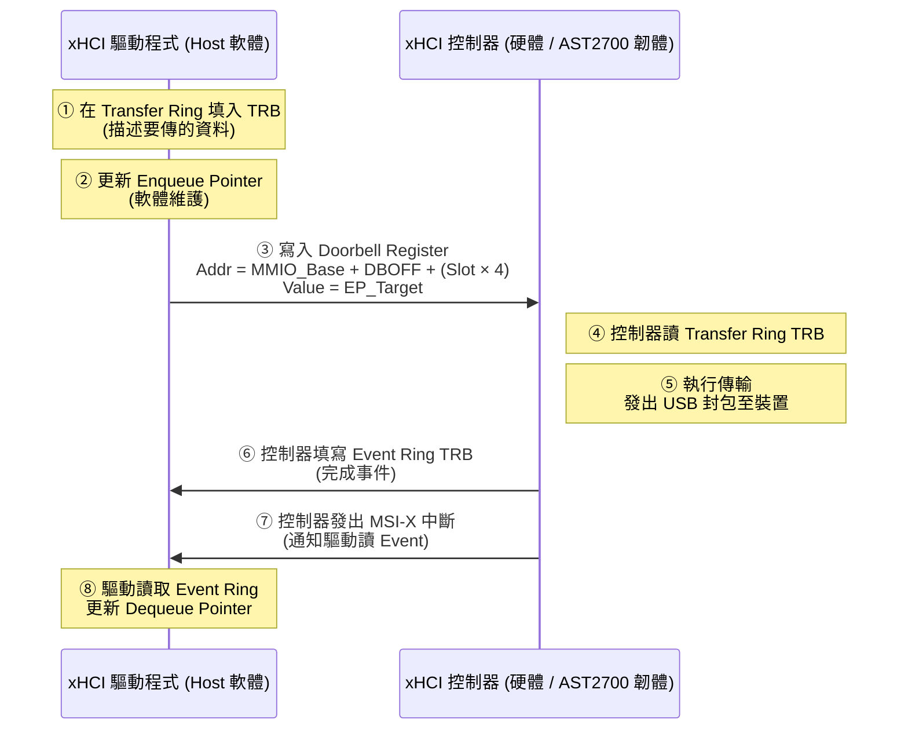
```mermaid
sequenceDiagram
    participant Host as xHCI 驅動程式 (Host 軟體)
    participant xHCI as xHCI 控制器 (硬體 / AST2700 韌體)

    Note over Host: ① 在 Transfer Ring 填入 TRB<br/>(描述要傳的資料)
    Note over Host: ② 更新 Enqueue Pointer<br/>(軟體維護)
    Host->>xHCI: ③ 寫入 Doorbell Register<br/>Addr = MMIO_Base + DBOFF + (Slot × 4)<br/>Value = EP_Target
    Note right of xHCI: ④ 控制器讀 Transfer Ring TRB
    Note right of xHCI: ⑤ 執行傳輸<br/>發出 USB 封包至裝置
    xHCI->>Host: ⑥ 控制器填寫 Event Ring TRB<br/>(完成事件)
    xHCI->>Host: ⑦ 控制器發出 MSI-X 中斷<br/>(通知驅動讀 Event)
    Note over Host: ⑧ 驅動讀取 Event Ring<br/>更新 Dequeue Pointer
```

> 💡 **關鍵觀察**：步驟 ③（驅動寫 Doorbell）= Host 按 Doorbell 通知 EP；步驟 ⑦（控制器發 MSI-X）= EP 用 MSI-X 通知 Host。兩個方向構成一次完整的 xHCI 傳輸迴圈。

---

### 6.5 xHCI Doorbell Array vs. PCIe Doorbell 差異對照

| 特性 | xHCI Doorbell Array | PCIe Doorbell（廠商自定）|
|:--|:--|:--|
| **規範來源** | USB xHCI 規格書（Intel 制定）| PCIe 規格書中**無定義**，為廠商私有設計 |
| **強制性** | **強制**，所有 xHCI 控制器都必須實作 | 可選，只有特定裝置才有 |
| **暫存器位置** | MMIO 空間中固定由 DBOFF 指向 | 廠商自行決定在 BAR 空間的偏移 |
| **通知對象** | xHCI 控制器硬體（告知有 TRB 待處理）| PCIe EP 韌體（告知有資料或命令）|
| **索引意義** | Slot 編號 + 端點編號 | 廠商定義（通常是佇列索引）|
| **在 AST2700 的角色** | 模擬 xHCI 時必須正確回應這些寫入 | 作為 PCIe EP 時暴露給 Host 的私有暫存器 |

---

### 6.6 對 AST2700 虛擬 xHCI 韌體的意義

當 AST2700 透過 PCIe 對 Host 呈現一顆 **xHCI 控制器**（Class Code = `0C0330`）時，Host 端會使用標準 xHCI driver 操作它。這代表 Host 看到的是一顆標準 USB Host Controller，而不是一套需要客製 driver 的 BMC 私有裝置。

在這個架構中，xHCI Doorbell 是 **Host driver 通知 xHCI 硬體開始處理工作的 MMIO 暫存器**。Host 寫 Doorbell 後，AST2700 xHCI 硬體會依 xHCI 規範處理 Command Ring、Transfer Ring、Event Ring 與 DMA；正常資料路徑不需要 BMC 韌體逐筆攔截 Doorbell，也不需要 BMC Linux ISR 解析每一次 Doorbell write。

| 項目 | AST2700 xHCI 硬體負責 | BMC 韌體 / 平台軟體負責 |
| :--- | :--- | :--- |
| **PCIe 裝置呈現** | 對 Host 暴露 xHCI function、BAR MMIO 與 xHCI capability。 | 啟用 PCIe xHCI function，設定 clock、reset、PHY 與平台 mux。 |
| **Doorbell 處理** | 接收 Host 對 Doorbell Array 的 MMIO write，啟動對應 Command Ring 或 Transfer Ring。 | 不逐筆攔截 Doorbell；只需確保 xHCI function 與 MMIO 空間正確可用。 |
| **資料搬移** | 透過 DMA 讀取 Host memory 中的 TRB / buffer，完成後寫回 Event Ring。 | 提供 KVM HID、Virtual Media、vHub 等上層資料來源與策略。 |
| **完成通知** | 透過中斷通知 Host xHCI driver 讀取完成事件。 | 管理功能啟停、錯誤恢復、reset / power state 與平台整合。 |

因此，韌體的核心任務不是實作每一筆 xHCI ring 操作，而是把 AST2700 的 PCIe xHCI 硬體正確初始化並接到 BMC 的虛擬 USB 功能。Host 端仍走標準 xHCI driver；Doorbell、TRB DMA 與 Event Ring completion 則屬於 xHCI 硬體資料路徑。

### 6.7 KVM 鍵鼠事件與 xHCI 資料路徑分界

透過 KVM 傳進來的鍵盤、滑鼠事件，不是由 BMC 的 network kernel 直接串到 xHCI。Network stack 只負責接收遠端連線與 socket 資料；真正把遠端輸入轉成 Host 可見 USB 鍵鼠的是 BMC 端的 KVM / virtual USB 軟體，再銜接 AST2700 的 xHCI 硬體資料路徑。


```mermaid
flowchart LR
    A["Remote Browser / KVM Client"] --> B["BMC Network Stack"]
    B --> C["BMC KVM Service"]
    C --> D["USB HID Report / vHub Data Source"]
    D --> E["AST2700 PCIe xHCI Hardware"]
    E --> F["Host xHCI Driver"]
    F --> G["Host USB HID Driver"]
    G --> H["Host Keyboard / Mouse Input"]

    style A fill:#eff6ff,stroke:#2563eb,color:#111827
    style B fill:#f0fdf4,stroke:#16a34a,color:#111827
    style C fill:#f0fdf4,stroke:#16a34a,color:#111827
    style D fill:#fef9c3,stroke:#ca8a04,color:#111827
    style E fill:#fee2e2,stroke:#dc2626,color:#111827
    style F fill:#ede9fe,stroke:#7c3aed,color:#111827
    style G fill:#ede9fe,stroke:#7c3aed,color:#111827
    style H fill:#ede9fe,stroke:#7c3aed,color:#111827
```

| 層級 | 主要責任 |
| :--- | :--- |
| **BMC network kernel** | 處理 Ethernet、TCP/IP、TLS / WebSocket 等連線資料，將遠端輸入交給 user-space。 |
| **BMC KVM service** | 解析遠端鍵盤、滑鼠事件，轉成 USB HID report 或 virtual USB 資料。 |
| **BMC virtual USB / vHub 路徑** | 提供 Host 可枚舉的虛擬 HID 裝置資料來源，銜接 AST2700 xHCI 硬體。 |
| **AST2700 xHCI 硬體** | 對 Host 呈現標準 xHCI controller，處理 Doorbell、TRB DMA、Event Ring 與完成中斷。 |
| **Host USB stack** | Host xHCI driver 與 USB HID driver 將虛擬 USB HID 裝置轉成作業系統鍵盤、滑鼠事件。 |

因此，KVM 鍵鼠功能的分界可以簡化為：**網路層收事件、KVM 軟體轉 HID、AST2700 xHCI 硬體對 Host 呈現標準 USB 鍵鼠**。xHCI Doorbell 與 ring 處理屬於硬體資料路徑；BMC 韌體與平台軟體負責初始化、資料來源與功能整合。

---
> 📌 本文件整合自開發者筆記與技術對話紀錄，適用於 AST2700 PCIe 韌體工程師參考。


