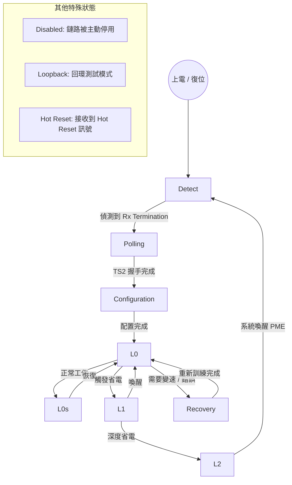
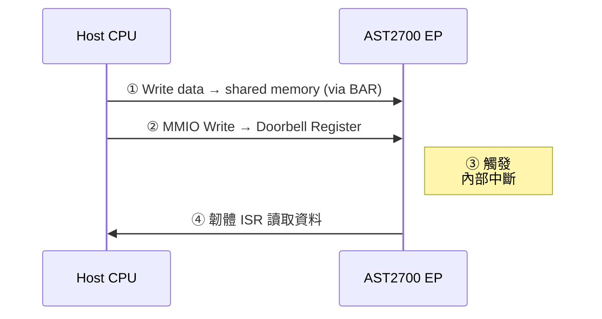
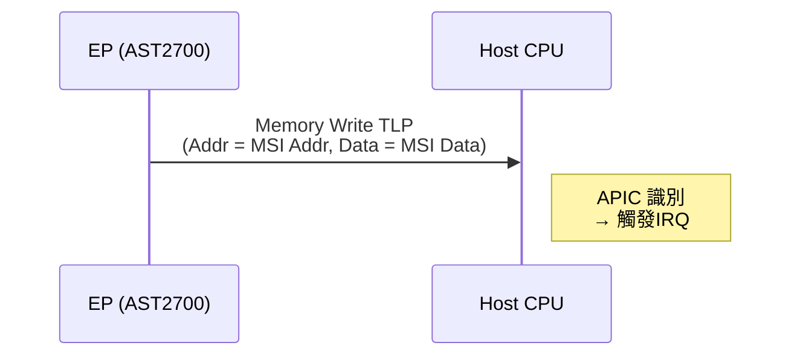
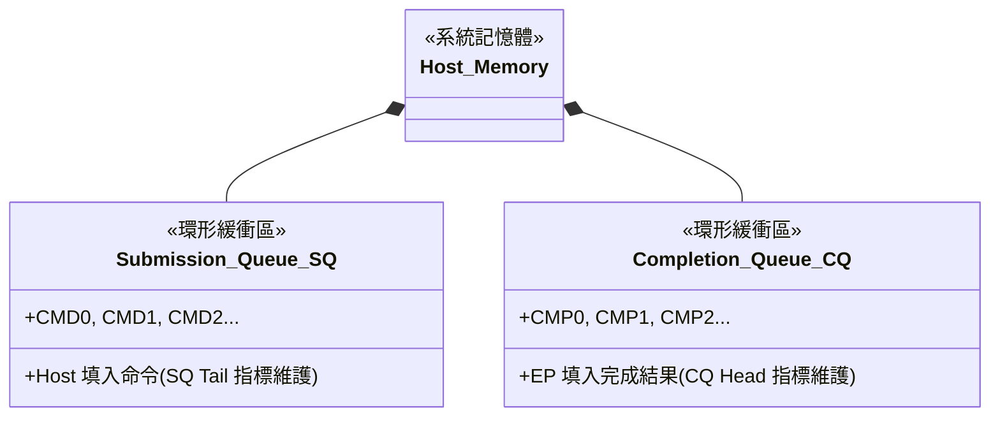
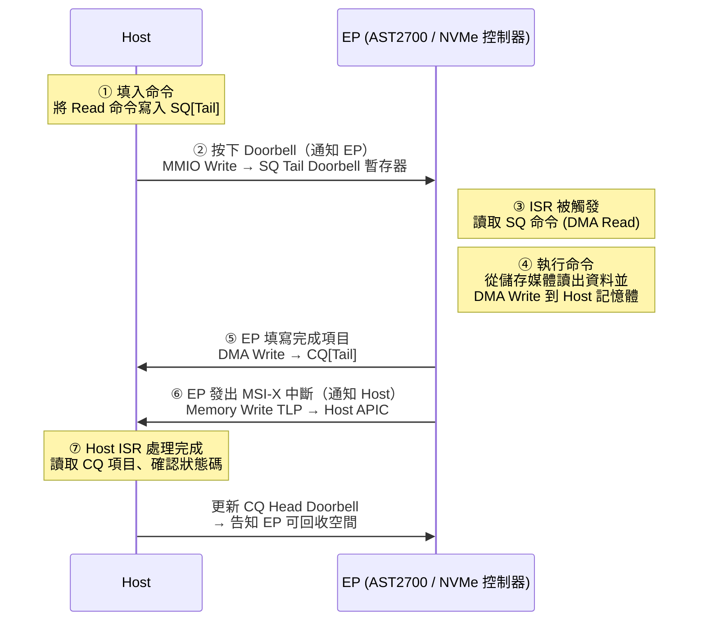
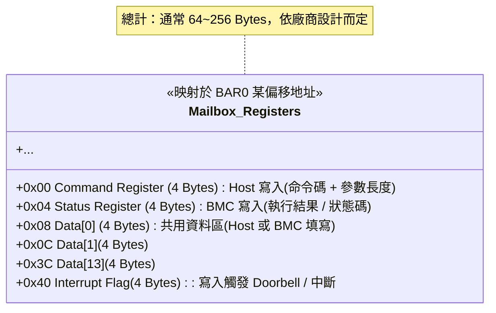
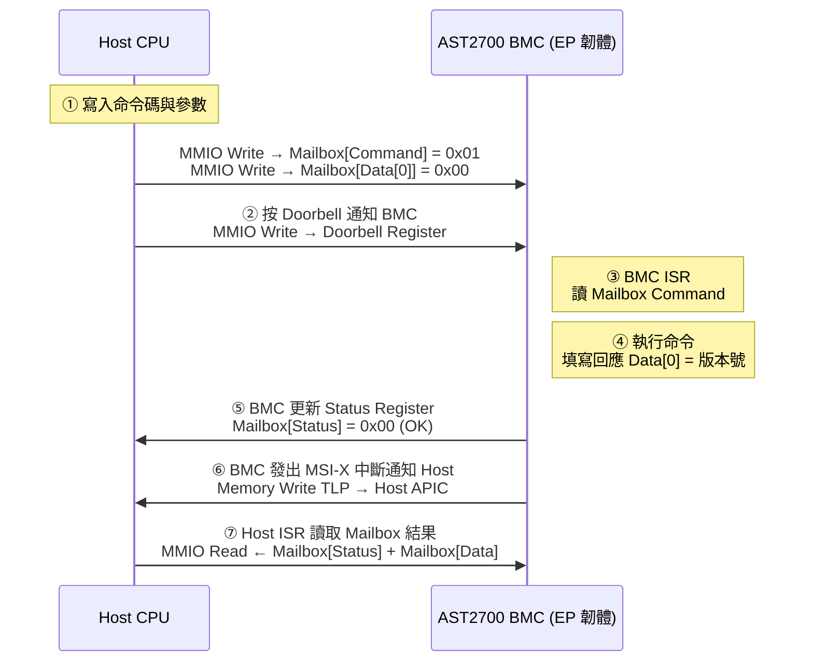
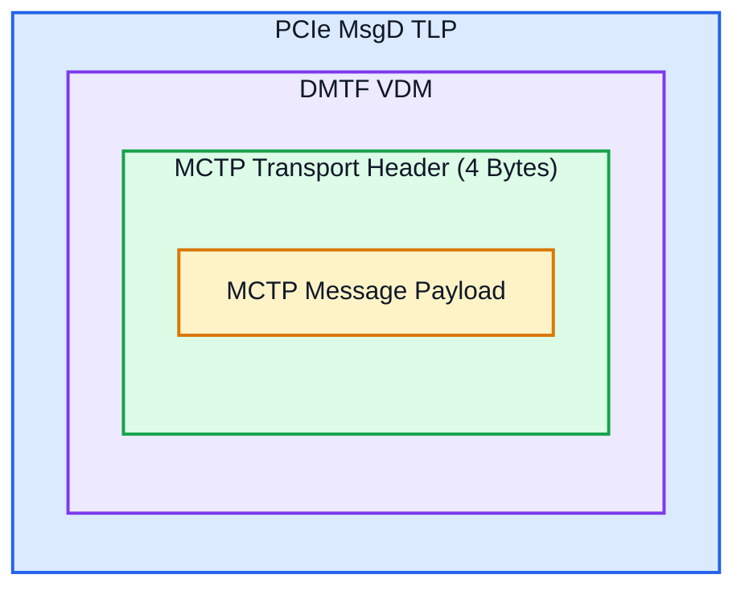
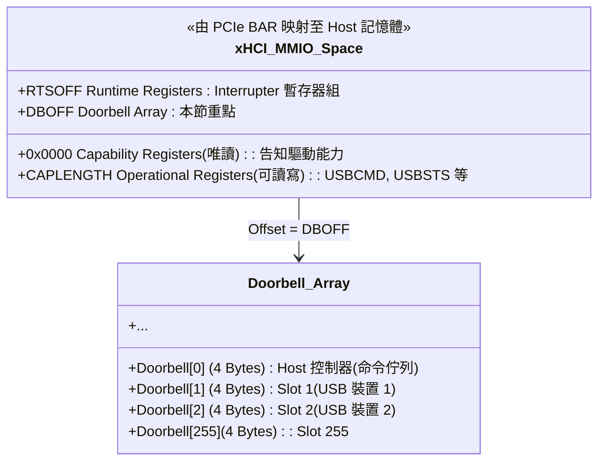
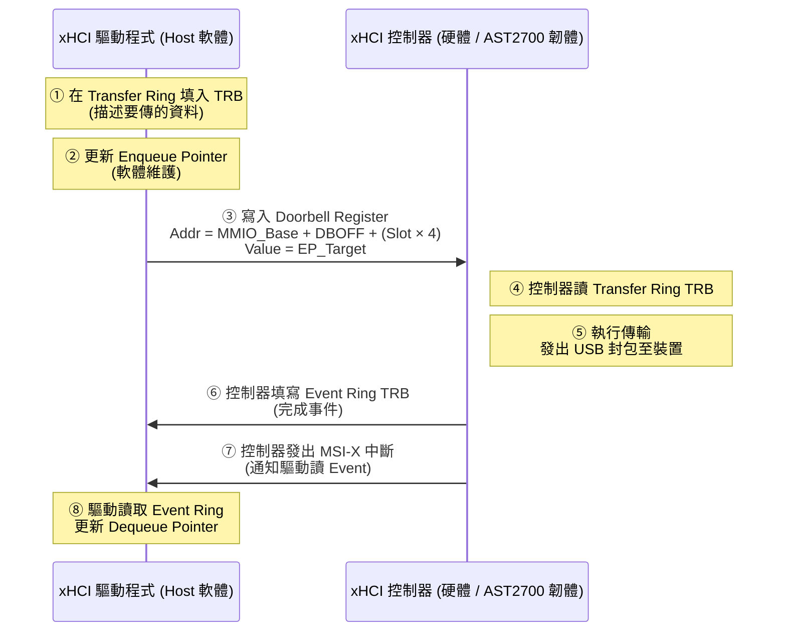

# PCIe 協定與韌體開發核心

> 本文件整理 AST2700 PCIe 韌體開發與 OpenBMC 實務中常見的核心議題，涵蓋 PCIe 封包結構、PCIe Configuration Space、鏈路建立與枚舉流程、Doorbell / MSI-X / SQ-CQ 通訊機制，以及 Multi-Function Device 宣告方式。適用於 AST2700 PCIe 韌體與 BMC 系統開發參考。

---

## 目錄

- [1.1 PCIe 封包封裝結構](#11-pcie-封包封裝結構-tlp-encapsulation)
- [1.2 PCIe Configuration Space 實務](#12-pcie-configuration-space-實務)
- [1.3 PCIe 鏈路建立、枚舉與通訊機制](#13-pcie-鏈路建立枚舉與通訊機制)
  - [1.3.1 韌體介入時機](#131-韌體介入時機)
  - [1.3.2 Doorbell 機制](#132-doorbell-機制)
  - [1.3.3 中斷機制（INTx / MSI / MSI-X）](#133-pcie-中斷機制intx--msi--msi-x)
  - [1.3.4 SQ / CQ 佇列機制](#134-sq--cq-佇列機制submission-queue--completion-queue)
  - [1.3.5 Mailbox 機制](#135-mailbox-機制信箱通訊)
  - [1.3.6 MMBI 機制 (Memory-Mapped Buffer Interface)](#136-mmbi-機制-memory-mapped-buffer-interface)
  - [1.3.7 MCTP over PCIe VDM 機制](#137-mctp-over-pcie-vdm-機制)
  - [1.3.8 Msg TLP (訊息封包) 解析](#138-msg-tlp-訊息封包-解析)
- [1.4 PCIe 虛擬 USB：xHCI 控制器架構](#14-pcie-虛擬-usbxhci-控制器架構-usb-over-pcie)
- [1.5 實務總結：鍵盤與 USB 存取場景對照表](#15-實務總結鍵盤與-usb-存取場景對照表)
- [1.6 Multi-Function Device (MFD) 機制](#16-multi-function-device-mfd-機制)
- [1.7 附錄：xHCI Doorbell Array（USB 規範的門鈴機制）](#17-附錄xhci-doorbell-arrayusb-規範的門鈴機制)

---

### 1.1 PCIe 封包封裝結構 (TLP Encapsulation)

PCIe 封包由 Transaction Layer 產生 TLP，再由 Data Link Layer 與 Physical Layer 補上鏈路傳輸所需資訊。

| 層級 | 封裝內容 | 主要目的 |
| :--- | :--- | :--- |
| Transaction Layer | TLP Header、Data Payload、Optional ECRC | 定義封包類型、路由、長度與實際承載資料。 |
| Data Link Layer | Sequence Number、LCRC、ACK/NAK | 提供鏈路層排序、錯誤偵測與重傳。 |
| Physical Layer | Framing、Ordered Set、Encoding | 將資料轉成實體 link 上可傳輸的 bit stream。 |

#### 1.1.1 一般 TLP Header 大小

`1 DW = 4 Bytes`。TLP Header 依 `Fmt` 與 `Type` 欄位決定格式，常見為 `3 DW` 或 `4 DW`。

| Header 格式 | 大小 | 常見用途 |
| :---: | :---: | :--- |
| `3 DW` | 12 Bytes | 32-bit Address Memory TLP、Configuration TLP、Completion TLP |
| `4 DW` | 16 Bytes | 64-bit Address Memory TLP、Message / MsgD、Vendor Defined Message |

以 Memory Request 為例：

| DW | 3 DW Header | 4 DW Header |
| :---: | :--- | :--- |
| DW0 | `Fmt`、`Type`、`TC`、`Attr`、`Length` 等共通欄位 | `Fmt`、`Type`、`TC`、`Attr`、`Length` 等共通欄位 |
| DW1 | `Requester ID`、`Tag`、`First DW BE`、`Last DW BE` | `Requester ID`、`Tag`、`First DW BE`、`Last DW BE` |
| DW2 | Address `[31:2]` | Address `[63:32]` |
| DW3 | 無 | Address `[31:2]` |

#### 1.1.2 MCTP over PCIe VDM 封裝

MCTP over PCIe VDM 使用 PCIe `MsgD` / Vendor Defined Message 承載 MCTP。封包格式如下：

<table>
  <tr>
    <th style="text-align:center;">Offset</th>
    <th style="text-align:center;">區塊</th>
    <th style="text-align:center;">大小</th>
    <th style="text-align:center;">主要欄位</th>
  </tr>
  <tr style="background:#dbeafe;">
    <td style="text-align:center;">Byte 0</td>
    <td><strong>PCIe Medium-Specific Header</strong></td>
    <td style="text-align:center;">4 Bytes</td>
    <td>Type、TC、OHC、TS、Attr、Length</td>
  </tr>
  <tr style="background:#dbeafe;">
    <td style="text-align:center;">Byte 4</td>
    <td><strong>PCIe Medium-Specific Header</strong></td>
    <td style="text-align:center;">4 Bytes</td>
    <td>PCI Requester ID、Pad Len、MCTP VDM Code、Message Code = Vendor Defined</td>
  </tr>
  <tr style="background:#dbeafe;">
    <td style="text-align:center;">Byte 8</td>
    <td><strong>PCIe Medium-Specific Header</strong></td>
    <td style="text-align:center;">4 Bytes</td>
    <td>PCI Target ID 或 reserved、Vendor ID = 0x1AB4</td>
  </tr>
  <tr style="background:#dcfce7;">
    <td style="text-align:center;">Byte 12</td>
    <td><strong>MCTP Transport Header</strong></td>
    <td style="text-align:center;">4 Bytes</td>
    <td>Rsvd、Header Version、Destination EID、Source EID、SOM/EOM/PktSeq/TO/Msg Tag</td>
  </tr>
  <tr style="background:#fef3c7;">
    <td style="text-align:center;">Byte 16</td>
    <td><strong>MCTP Packet Payload</strong></td>
    <td style="text-align:center;">Variable</td>
    <td>IC、Message Type、MCTP Message Header、MCTP Message Data</td>
  </tr>
  <tr style="background:#f3f4f6;">
    <td style="text-align:center;">Tail</td>
    <td><strong>Optional Trailer</strong></td>
    <td style="text-align:center;">Variable</td>
    <td>Message Integrity Check、Padding、Optional TLP Digest / ECRC</td>
  </tr>
</table>

| 顏色 | 對應區塊 |
| :---: | :--- |
| <span style="display:inline-block;width:48px;height:14px;background:#dbeafe;border:1px solid #93c5fd;"></span> | PCIe / TLP medium-specific header |
| <span style="display:inline-block;width:48px;height:14px;background:#dcfce7;border:1px solid #86efac;"></span> | MCTP Transport Header |
| <span style="display:inline-block;width:48px;height:14px;background:#fef3c7;border:1px solid #facc15;"></span> | MCTP Message Header / Payload |
| <span style="display:inline-block;width:48px;height:14px;background:#f3f4f6;border:1px solid #d1d5db;"></span> | Optional trailer / digest |

`Byte 0 ~ Byte 11` 為 PCIe medium-specific 欄位，`Byte 12 ~ Byte 15` 為 MCTP Transport Header，MCTP message payload 從 `Byte 16` 開始。

**常見 TLP 類型速查**

| TLP 類型 | 說明 |
| :--- | :--- |
| `Memory Read, MRd` | 讀 `Memory Space`，需要 `Completion` 回應。 |
| `Memory Write, MWr` | 寫 `Memory Space`，通常是 `Posted`，不需要 `Completion`。 |
| `I/O Read / I/O Write` | `Legacy I/O Space`，用在較舊相容設計，現代系統較少用。 |
| `Configuration Read / Write Type 0` | 設定同一個 Bus 上的 Endpoint。 |
| `Configuration Read / Write Type 1` | 經過 Bridge/Switch 往下游 Bus 做 Configuration。 |
| `Message, Msg` | 傳遞中斷、PM、Hot-Plug、Error 等訊息；`VDM (Vendor Defined Message)` 也屬於此類。 |
| `Message with Data, MsgD` | `Message` 類型，但會額外攜帶資料 payload；`MCTP over PCIe VDM` 常見使用此類。 |
| `Completion, Cpl` | 回應 Read / Config / I/O 等 `Non-Posted Request`，不帶資料。 |
| `Completion with Data, CplD` | `Completion` 且帶回資料，例如 `Memory Read` 的回傳資料。 |
| `AtomicOp` | 原子操作，例如 `FetchAdd`、`Swap`、`CAS`，常見於高階 PCIe 裝置。 |

### 1.2 PCIe Configuration Space 實務

PCIe Configuration Space 是 Host 認識裝置的標準資訊區。系統枚舉時，Root Complex 會送出 Configuration Read / Write TLP，讀取每個 Function 的 Vendor ID、Device ID、Class Code、BAR 與 Capability List，藉此判斷裝置身分、配置 MMIO 空間，並載入對應驅動。

AST2700 作為 Endpoint (EP) 時，對 Host 呈現的是 **Type 0 Configuration Space Header**。Type 0 用於一般 Endpoint；Type 1 則用於 PCIe Bridge / Switch Port。

#### 1.2.1 Host 枚舉時會看什麼

| 欄位 | 作用 | 對 AST2700 EP 的意義 |
| :--- | :--- | :--- |
| Vendor ID / Device ID | 標識廠商與裝置 | 讓 Host 辨識這是特定 ASPEED / 平台裝置。 |
| Class Code | 宣告裝置類型 | 決定 Host 可能載入哪一類驅動，例如 xHCI、NVMe 或 vendor-specific driver。 |
| Header Type | 宣告 header 格式 | Endpoint 使用 Type 0；若 Bit 7 設為 1，表示 Multi-Function Device。 |
| BAR0 ~ BAR5 | 宣告 MMIO / I/O 視窗需求 | Host 依 BAR 大小配置位址，之後可透過 Memory TLP 存取 EP 內部資源。 |
| Capability Pointer | 指向標準 capability linked list | Host 由此找到 MSI、MSI-X、PCIe Capability、Power Management 等能力。 |
| Interrupt Pin / Line | 傳統 INTx 相容欄位 | 現代 PCIe 裝置多使用 MSI / MSI-X，但仍可能保留相容資訊。 |

#### 1.2.2 BAR 與 MMIO 映射

BAR (Base Address Register) 用來告訴 Host：「這個 Endpoint 需要多少 MMIO 空間」。枚舉時 Host 會先探測 BAR 大小，再分配系統實體位址，最後寫回 BAR。

完成 BAR 配置後，Host CPU 對該 MMIO 位址的讀寫會被 Root Complex 轉成 PCIe Memory Read / Write TLP，送到 AST2700 Endpoint。Doorbell、Mailbox、Queue Register、MSI-X Table 等常見控制區都可能放在 BAR 對應的 MMIO 空間中。

#### 1.2.3 Command Register

`Command Register` 位於 Type 0 Header offset `04h`，控制裝置是否能回應特定類型的存取。

| Bit | 名稱 | 作用 |
| :---: | :--- | :--- |
| Bit 0 | I/O Space Enable | 允許裝置回應 I/O Space 存取；現代 PCIe Endpoint 較少使用。 |
| Bit 1 | Memory Space Enable | 允許裝置回應 BAR 對應的 MMIO Memory 存取。若未啟用，Host 對 BAR 的 Memory TLP 不應被裝置正常處理。 |
| Bit 2 | Bus Master Enable | 允許裝置主動發起 Memory Read / Write，例如 DMA 寫回 Host memory 或送出 MSI/MSI-X Memory Write。 |

對 AST2700 這類 BMC Endpoint 來說，`Memory Space Enable` 決定 Host 能不能操作 BAR；`Bus Master Enable` 則影響 DMA、MSI/MSI-X 與主動推送資料能力。

#### 1.2.4 Capability Linked List

標準 capability list 的起點在 Type 0 Header offset `34h`。每個 capability 由 `Capability ID` 與 `Next Pointer` 串接，Host 會沿著 linked list 探索裝置支援的功能。

| Capability ID | 名稱 | 實務用途 |
| :---: | :--- | :--- |
| `0x01` | Power Management | 電源狀態、PME、D-state 管理。 |
| `0x05` | MSI | Message Signaled Interrupts，使用 Memory Write TLP 送中斷。 |
| `0x10` | PCI Express Capability | PCIe 裝置、Link、Slot 與錯誤相關能力。 |
| `0x11` | MSI-X | 多向量中斷，常用於高效能 queue 或多功能裝置。 |

因此，Configuration Space 可視為 Endpoint 對 Host 的「自我描述」。AST2700 韌體或 EPF driver 若要模擬 xHCI、vendor-specific 管理介面或多功能裝置，核心工作就是正確準備這些欄位，讓 Host 枚舉、映射與驅動載入流程都能成立。

### 1.3 PCIe 鏈路建立、枚舉與通訊機制

本節先說明 PCIe link 如何進入可傳輸狀態，以及 Host 如何透過枚舉建立 Configuration Space、BAR 與 driver binding；接著整理 AST2700 Endpoint 常見的 Host/BMC 通訊方式，例如 Doorbell、MSI-X、SQ/CQ、Mailbox、MMBI 與 MCTP over PCIe VDM。

#### 第一階段：鏈路訓練 (LTSSM)
這是純硬體的底層交涉，**此時作業系統 (OS) 毫不知情，完全沒有介入**。兩邊的晶片會依賴內建的硬體狀態機 (LTSSM) 在短短幾毫秒內搞定連線。

##### LTSSM 完整狀態機

**LTSSM（Link Training and Status State Machine）** 是 PCIe 規範定義的有限狀態機，負責管理一條 PCIe 鏈路從「完全沒有訊號」到「穩定傳輸資料」，以及之後所有省電與錯誤恢復的完整生命週期。以下是 11 個主要 State 的完整說明：


```mermaid
graph TD
    Start((上電 / 復位)) --> Detect
    Detect -->|偵測到 Rx Termination| Polling
    Polling -->|TS2 握手完成| Configuration
    Configuration -->|配置完成| L0

    L0 -->|正常工作| L0s
    L0s -->|恢復| L0

    L0 -->|觸發省電| L1
    L1 -->|喚醒| L0

    L0 -->|需要變速 / 錯誤| Recovery
    Recovery -->|重新訓練完成| L0

    L1 -->|深度省電| L2
    L2 -->|系統喚醒 PME| Detect

    subgraph 其他特殊狀態
        Disabled[Disabled: 鏈路被主動停用]
        Loopback[Loopback: 回環測試模式]
        HotReset[Hot Reset: 接收到 Hot Reset 訊號]
    end
```

**各 State 詳細說明**

**① Detect（實體偵測）**
這是 LTSSM 的起始狀態，也是系統上電或任何重置後必定回到的起點。
- **進入條件**：上電復位、Hot Reset、或從 L2 喚醒
- **運作方式**：Downstream Port（Host 側）在差分對（Differential Pair）上週期性施加一個微弱的直流偏壓，然後偵測電流是否有被牽引。若 Upstream Port（EP 側）的 **Rx Termination 電阻**（通常 50 Ω）存在，則電壓會明顯下降，Host 從而確認「對端存在」。
- **超時行為**：若超過 12 ms 仍未偵測到任何反應，LTSSM 會在 Detect 狀態中等待，持續送測試訊號。

**② Polling（輪詢同步）**
兩端確認實體存在後，開始進行「初次握手」，目的是對齊時脈並完成最基本的位元同步。

- **Polling.Active**：雙方以 Gen1（2.5 Gbps）速率持續發送 **TS1 有序集（Ordered Sets）**，直到接收方偵測到 8 個連續的 TS1，確認 Bit Lock（位元鎖定）。
- **Polling.Compliance**：如果在一定時間內無法完成，某一側會進入 Compliance 模式（發送固定訊號），供工程師用示波器觀察 Eye Diagram，這是 SI（Signal Integrity）除錯的重要入口。
- **Polling.Configuration**：雙方改發 **TS2**，收到 8 個連續 TS2 後確認 Symbol Lock，準備進入 Configuration。

**③ Configuration（鏈路配置）**

這個狀態負責協商最終的實體連線參數。

- **Lane Number 協商**：RC 端先分配 Lane 編號（Lane 0 ~ Lane N-1），EP 回傳確認。如果某條 Lane 訊號太差，雙方可協商降寬（例如 x8 降為 x4）。
- **Lane Reversal**：若 PCIe 走線為了 PCB 佈線方便做了鏡像翻轉，Configuration 狀態中的協商可自動修正，無需額外韌體介入。
- **Link Number 確認**：分配最終的 Link 識別編號。
- **完成**：雙方交換最終的 TS2 確認，進入 L0。

**④ L0（正常工作）**

這是唯一可傳送 TLP（Transaction Layer Packet）與 DLLP（Data Link Layer Packet）的狀態，也是整個 PCIe 系統的「正常運作狀態」。

- **TLP 傳輸**：所有的 Memory Read/Write、Config Read/Write、Completion 封包都在此狀態流通。
- **Flow Control**：透過 UpdateFC DLLP 持續更新兩端的緩衝區剩餘空間。
- **心跳機制**：若鏈路上一段時間沒有 TLP，DLL 層會自動發送 **SKP Ordered Sets** 來維持同步與補償時脈偏差。

**⑤ Recovery（恢復 / 重訓練）**

這是 L0 的「復原路徑」，當需要改變速率、修復通訊錯誤，或從省電狀態快速喚醒時，都會先進入 Recovery。

- **觸發條件**：
  - 從 L0s / L1 喚醒回到 L0
  - 需要升速（如 Gen1 → Gen4）
  - 接收到過多的 CRC 錯誤（超過閾值）
  - 軟體寫入 `Retrain Link` 位元（韌體除錯常用）
- **Recovery.RcvrLock**：重新發 TS1，嘗試重新獲得 Bit Lock / Symbol Lock。
- **Recovery.Equalization**（Gen3 / Gen4 新增）：協商 Tx 等化參數（Preset / Coefficient），是 Gen3+ 速率能否穩定訓練成功的關鍵。如果 EQ 協商失敗，鏈路會降速重試。
- **回到 L0 或降速**：成功則進入 L0；若多次失敗則降一個速率等級重來（Gen4 → Gen3 → Gen2 → Gen1）。

**⑥ L0s（淺層省電）**

一種極快速切換的省電模式，延遲極低（恢復時間 < 1 μs）。

- **適用場景**：鏈路有資料但偶發空閒（Burst Traffic）的場景。
- **機制**：Transmitter 進入 Electrical Idle，Receiver 保持監聽。任一端需要發送 TLP 時，立即送出 FTS（Fast Training Sequence）喚醒對方，然後回到 L0。
- **注意**：L0s 是 **可選的（Optional）**，不是所有 PCIe 裝置都必須支援。

**⑦ L1（中度省電）**

比 L0s 更深的省電模式，功耗更低，但恢復時間較長（約 2~100 μs）。

- **觸發方式**：由 PM（Power Management）協議協商觸發，或 ASPM（Active-State Power Management）機制自動觸發。兩端都同意後才能進入。
- **子狀態**：
  - **L1.1**（如果支援 CLKREQ# 訊號）：關閉 Common Clock，進一步降低功耗。
  - **L1.2**（如果支援）：關閉 PLL 電路，達到最大省電效果，但喚醒時間也最長（約 100 μs）。
- **韌體開發警告**：在 AST2700 / DC-SCM 的 xHCI over PCIe 架構下，L1.2 的啟用是虛擬 USB 斷線的最常見元兇！需要在 ACPI / PCIe 驅動層面謹慎設定。

**⑧ L2（深層省電）**

主電源準備關閉前的狀態，僅保留少量輔助電（Vaux）維持 PME（Power Management Event）喚醒能力。

- **進入**：Host 通過軟體 PM 流程（如 ACPI S3/S4/S5）通知裝置進入 L2。
- **退出**：裝置發出 PME 事件（如按下電源鍵），LTSSM 從 Detect 重新開始完整訓練流程。

**⑨ Disabled（停用）**

鏈路被主動停用的狀態。在以下情況會進入：

- 軟體寫入 Link Disable 位元
- Crosslink 配置需要
- 從 Configuration 或 Recovery 失敗後達到最大重試次數

**⑩ Loopback（回環）**

特殊的測試/診斷模式。Downstream Port 成為 Loopback Master，Upstream Port 將所有收到的位元原封不動地反射回去，供工程師在 Master 端量測 BER（Bit Error Rate）與 Eye Diagram。

**⑪ Hot Reset（熱重置）**

當 Downstream Port 需要對 EP 進行重置（例如韌體 Recovery、OS 驅動重載），會觸發此狀態。EP 收到 Hot Reset 訊號後，所有內部狀態恢復到初始值，然後從 Detect 重新開始訓練。

---

**省電狀態層次總覽**

| 狀態 | 別名 | 恢復時間 | 功耗 | PHY 狀態 | 備註 |
|:--|:--|:--|:--|:--|:--|
| **L0** | Active | — | 最高 | 全開 | 唯一可傳 TLP 的狀態 |
| **L0s** | Standby | < 1 μs | 略低 | Tx 電氣空閒 | 可選，非強制 |
| **L1** | Suspend | 2~100 μs | 低 | 雙向電氣空閒 | ASPM 管理 |
| **L1.1** | — | ~10 μs | 更低 | PLL 開，Clock 關 | 需 CLKREQ# 支援 |
| **L1.2** | — | ~100 μs | 最低（非 L2）| PLL 關 | ⚠️ USB/BMC 斷線風險 |
| **L2** | Sleep | 10 ms+ | 趨近於零 | 幾乎全關 | 僅 Vaux 存活 |

---


#### 第二階段：系統枚舉 (Enumeration)
當硬體層 (Physical Layer) 完成鏈路訓練並進入 L0 狀態後，系統的 **Root Complex (RC)** 會啟動枚舉流程。此階段旨在識別拓樸中的所有裝置、分配 BDF 地址，並配置必要的硬體資源。


1.  **配置空間存取 (Configuration Transactions)**：
    Root Complex 會沿著 PCIe 拓樸發送 **Configuration Request TLP (Type 0 或 Type 1)**。透過 **BDF (Bus, Device, Function)** 定址方式，掃描系統中所有的節點。
    *   **Type 0**：用於 RC 直接連接的裝置。
    *   **Type 1**：用於經過 Switch 或 Bridge 轉送，尋找下游匯流排的裝置。

2.  **裝置識別 (Identification)**：
    當 RC 點名掃描到 AST2700 時，會讀取其 Configuration Space 的首個 4 Bytes。
    *   **Vendor ID / Device ID**：AST2700 必須回報預設的值（如 ASPEED VID `0x1A03`）。
    *   **Master Abort**：若該 BDF 位址沒有裝置回應，RC 會收到一個由硬體產生或超時回傳的 `0xFFFF`，代表該插槽為空 (Empty Slot)。

3.  **BAR 資源容量評估 (BAR Sizing)**：
    RC 會讀取裝置的 **Base Address Registers (BAR)** 以決定其資源需求。
    *   **Sizing 機制**：RC 會暫時往 BAR 寫入全 `1` (All Fs)，裝置會依照硬體設計的位址空間需求，將低位元保持為 `0` 並回傳。RC 透過計算回傳值中 `0` 的個數，即可得知該裝置需要的空間大小（例如 AST2700 VGA 宣告 64MB）。

4.  **MMIO 位址映射 (Address Mapping)**：
    RC 評估完所有裝置的需求後，會從系統的實體記憶體空間 (System Physical Address Space) 中劃分一段連續位址給該裝置。
    *   **BAR 配置**：RC 將分配好的起始位址寫回 AST2700 的 BAR 暫存器中，並開啟 **Command Register** 中的 **Memory Space Enable** 位元。
    *   **MMIO 原理**：自此，Host CPU 對該段記憶體位址的讀寫動作，都會由 RC 自動封裝成 **Memory Read/Write TLP** 穿過 PCIe 鏈路直達 AST2700，實現硬體資源的透明映射。

5.  **類別代碼與驅動綁定 (Class Code & Driver Binding)**：
    最後，核心讀取 **Class Code** 暫存器（如 `0C0330` 代表 USB 3.0 xHCI 控制器）。作業系統根據此 Code 匹配並啟動對應的驅動程式。至此，裝置正式在系統中實例化 (Instantiated) 並可供軟體調用。

#### 1.3.1 韌體介入時機

在 PCIe 生命週期中，韌體主要介入下列三個階段：

* **時機一：LTSSM 啟動前 (PRE-LTSSM)**
  在硬體狀態機進入 Detect 前，也就是 BMC 上電後的早期初始化階段，U-Boot 或早期 kernel 初始化程式需完成下列設定：
  * **設定 PHY 實體層參數**：包含參考時鐘架構，例如 SRIS 或 SSC，以及 Tx/Rx equalization 相關參數。
  * **填寫 PCIe Configuration Space**：Vendor ID、Device ID、BAR 空間大小與 Class Code 等資訊，都必須在 link training 前預先寫入 AST2700 PCIe 暫存器，否則 Host OS 枚舉時將無法取得有效裝置資訊。
  * **Enable LTSSM**：韌體必須設定晶片內的 `LTSSM Enable` 控制位元；若未啟用，即使實體連接正常，PCIe 狀態機也不會開始 link training。

* **時機二：LTSSM 無法進入 L0 時 (Recovery / Link Down)**
  若鏈路建立失敗，例如訊號品質不佳而停留在 Polling，或速率無法提升至 Gen4 而降回 Gen1，BMC 韌體可透過 Link Down 或 AER (Advanced Error Reporting) 中斷取得狀態。此時韌體可調整 Tx EQ 等訊號補償參數，並寫入 `Retrain Link` 暫存器，要求硬體狀態機重新進行 link training。

* **時機三：L0 建立後 (Active Phase)**
  當 link 進入 L0 且 Host OS 完成枚舉後，韌體主要負責 Mailbox、Doorbell、MSI/MSI-X 與 DMA engine 等通訊與資料搬運流程。

#### 1.3.2 Doorbell 機制

> [!IMPORTANT]
> **Doorbell 並非 PCIe 規範強制定義的標準機制。**
> 它是裝置廠商在自己的 BAR 空間中自行實作的「私有設計模式」，PCIe 規格書中找不到「Doorbell Register」這個欄位定義。只有特定類別的高性能 PCIe 裝置才會提供這個機制。

**哪些裝置有 Doorbell？**

Doorbell 機制通常出現在需要頻繁、高效率「Host ↔ EP 通知」的裝置上：

| 裝置類型 | 是否有 Doorbell | 說明 |
|:--|:--|:--|
| **NVMe SSD** | ✅ 有（規範強制） | NVMe 規格明確定義了 SQ/CQ Doorbell 暫存器的位置與格式，是 NVMe 協定的核心 |
| **RDMA 網卡（InfiniBand / RoCE）** | ✅ 有（廠商實作） | 用於 Work Queue 的提交通知，效能極關鍵 |
| **GPU（NVIDIA / AMD）** | ✅ 有（廠商私有） | 用於命令佇列提交，驅動程式直接操作 |
| **BMC EP（如 AST2700）** | ✅ 有（廠商實作） | 用於 Host 通知 BMC 有新管理命令待處理 |
| **一般 PCIe 網路卡（1G/10G NIC）** | ⚠️ 視廠商而定 | 部分有類似的 Tx Doorbell，部分使用 polling 或 MSI 輪詢 |
| **USB 控制器（xHCI over PCIe）** | ❌ 通常沒有 | 使用 xHCI 規範定義的 Doorbell Array（屬於 USB 規格，非 PCIe Doorbell）|
| **簡易 PCIe GPIO / UART 擴充卡** | ❌ 沒有 | 僅提供基本 MMIO 暫存器，Host 直接讀寫，不需要額外通知機制 |

> [!NOTE]
> **xHCI 的 Doorbell Array** 是 USB 3.0 規範（非 PCIe 規範）定義的機制，雖然名稱相同、概念相近，但兩者是獨立的不同規格。

**沒有 Doorbell 的裝置如何通知對方**

對於不支援 Doorbell 的裝置，Host 與 EP 之間的同步通知通常改用以下替代方式：

1. **Polling（輪詢）**：Host 或 EP 定期主動讀取對方的狀態暫存器，確認是否有新任務。實作成本低，但 CPU 佔用率高，不適合高頻操作。
2. **純 MSI-X 驅動**：EP 完成工作後直接發出 MSI-X 中斷通知 Host；Host 不使用 Doorbell，而是直接寫入 Command Register 或 Control Register 觸發 EP 動作。
3. **Shared Memory Flag**：Host 和 EP 約定一塊共用記憶體區域，利用特定 Flag 欄位作為「虛擬門鈴」，再搭配定期輪詢或 MSI-X 觸發掃描。

---

**Doorbell（門鈴）** 是一種輕量級的「通知」機制，其本質是一個由 Endpoint（EP）對外暴露的特殊 MMIO 暫存器。其語意是：Host 準備好資料後，透過 MMIO write 通知 EP 有新工作待處理。


**運作原理**

Doorbell 機制的核心是一個寫入觸發流程：

1. **Host 準備資料**：Host CPU 或 DMA 引擎把要傳送的資料寫入雙方事先約定好的共享記憶體區域（通常由 EP 透過 BAR 映射對外提供）。
2. **Host 寫入 Doorbell**：Host 對 EP 的 Doorbell 暫存器執行一次 **MMIO Write**（Memory-Mapped Write TLP）。此寫入值通常代表已就緒的任務或佇列索引。
3. **EP 收到通知**：EP（例如 AST2700）的硬體邏輯偵測到 Doorbell 暫存器被寫入，即觸發內部中斷，喚醒韌體中對應的 ISR（中斷服務程序）。
4. **EP 取回資料**：韌體根據中斷資訊判斷哪個佇列有資料，發起 DMA 或 MMIO Read 取回資料，並清除 Doorbell 狀態。


```mermaid
sequenceDiagram
    participant Host as Host CPU
    participant EP as AST2700 EP

    Host->>EP: ① Write data → shared memory (via BAR)
    Host->>EP: ② MMIO Write → Doorbell Register
    Note right of EP: ③ 觸發<br/>內部中斷
    EP->>Host: ④ 韌體 ISR 讀取資料
```

**Doorbell 的方向性**

Doorbell 機制本質上是**雙向的**，但需要兩套獨立的暫存器：

| 方向              | 實作方式                                           | 觸發目標         |
| :---------------- | :------------------------------------------------- | :--------------- |
| **Host → EP**     | EP 暴露 Doorbell 暫存器於 BAR 空間，Host 直接寫入 | EP 韌體 ISR      |
| **EP → Host**     | EP 發送 **MSI / MSI-X 中斷**（PCIe 標準中斷機制） | Host 驅動程式    |

> ⚠️ **注意**：EP 無法直接使用 Host 側的 Doorbell 語意，因此 EP 通知 Host 的標準做法是使用 **MSI-X（Message Signaled Interrupts Extended）**。這是 PCIe 規範中 EP 主動通知 Host 的正式機制，可視為 Host-to-EP Doorbell 的反向通知路徑。

**Doorbell vs. Mailbox 的差異**

這兩個詞在韌體開發中常一起出現，但角色不同：

| 特性       | Doorbell（門鈴）                      | Mailbox（信箱）                             |
| :--------- | :------------------------------------ | :------------------------------------------ |
| **功能**   | 純「通知」訊號，告知對方「有事發生」  | 承載「內容」，用於傳遞少量控制指令或狀態值  |
| **資料量** | 極小（通常 1~4 Bytes，僅含佇列索引）  | 較大（數十到數百 Bytes 的結構化命令）        |
| **語意**   | 單純通知對方有新工作待處理            | 傳遞帶內容的命令或狀態資料                  |
| **常見用法** | 通知 DMA 佇列已填滿，請開始傳輸       | 傳遞 PCIe 管理命令（如重置、查詢狀態）      |

**AST2700 韌體開發實務**

在 AST2700 的 EP 韌體實作中，Doorbell 暫存器通常會被映射在 **BAR0** 的特定偏移地址，韌體需要完成以下設定：

1. **IRQ 映射**：在 EP 韌體初始化時，將 Doorbell 暫存器的寫入事件綁定到對應的中斷向量。
2. **ISR 實作**：中斷服務程序需讀取 Doorbell 暫存器的值，根據值的內容（佇列索引）決定要處理哪個工作。
3. **清除機制**：ISR 處理完後必須**顯式清除（Clear）** Doorbell 暫存器，否則硬體可能持續觸發重複中斷。

#### 1.3.3 PCIe 中斷機制（INTx / MSI / MSI-X）

PCIe 定義了三種 EP 通知 Host 的中斷方式，從舊到新依序演進。理解三者的差異，是韌體工程師設定中斷路由與撰寫 ISR 的基礎。

##### (A) INTx — 傳統虛擬中斷線（Legacy）

在傳統 PCI 架構中，實體中斷線（INTA#、INTB#、INTC#、INTD#）是實際存在於連接器上的電氣訊號。進入 PCIe 後，實體中斷線不再以相同形式存在；為了向後相容，PCIe 透過 **Assert_INTx / Deassert_INTx** TLP 模擬傳統 INTx 中斷語意。

* **優點**：相容性最佳，無須任何韌體設定。
* **缺點**：共享中斷（多個 EP 可能共用同一條 INTx），Host 端需輪詢判斷中斷來源，效率差。SR-IOV 與 MSI-X 環境下可能被強制禁用。
* **設定方式**：在 EP 的 Command Register（Offset `04h`）Bit 10（Interrupt Disable）**清零**即可啟用。

##### (B) MSI — 訊息式中斷

**MSI（Message Signaled Interrupts）** 是 PCIe 推薦的標準中斷方式。EP 不再拉電位，而是在需要發出中斷時，向 Host 端寫入一筆特定的 Memory Write TLP，Host 根據寫入的目標位址與資料值辨識中斷來源。

**運作原理：**

1. **Host OS 分配**：枚舉時，Host OS 從 MSI Capability Structure 中讀取 EP 需要幾個中斷向量（最多 32 個），並將對應的 **目標記憶體位址** 與 **資料值** 寫回 EP 的 PCIe Configuration Space。
2. **EP 觸發**：EP 需要中斷時，直接發出一筆 Memory Write TLP，寫入 Host 指定的位址與資料。
3. **Host 處理**：Host 的中斷控制器（如 APIC）收到這筆寫入，對應觸發 CPU 的 IRQ 處理程序。


```mermaid
sequenceDiagram
    participant EP as EP (AST2700)
    participant Host as Host CPU

    EP->>Host: Memory Write TLP<br/>(Addr = MSI Addr, Data = MSI Data)
    Note right of Host: APIC 識別<br/>→ 觸發IRQ
```

* **優點**：無共享問題，Host OS 自動管理向量分配。
* **限制**：每個 Function 最多 **32 個中斷向量**；不支援 Per-vector Masking（無法個別屏蔽某一個向量）。

##### (C) MSI-X — 擴充訊息式中斷（推薦）

**MSI-X（Message Signaled Interrupts Extended）** 是 MSI 的強化版本，也是現代高性能 PCIe 設備（如 NVMe SSD、高速網卡）的標準選擇。

與 MSI 的核心差異：

| 特性               | MSI                              | MSI-X                                       |
| :----------------- | :------------------------------- | :------------------------------------------ |
| **最大向量數**     | 32                               | **2048**                                    |
| **向量表位置**     | 存放於 PCIe Configuration Space（有限） | 存放於 **BAR 空間**（MSI-X Table，彈性大）  |
| **Per-vector Mask**| ❌ 不支援                        | ✅ 每個向量可獨立 Mask/Unmask               |
| **Pending Bit Array (PBA)** | ❌               | ✅ 可查詢哪些中斷正在等待處理              |

**MSI-X Table 結構：**

MSI-X 的向量表存放在 EP 的某個 BAR 空間中，每個 Entry 固定 16 Bytes：

| Offset | 欄位 | 大小 | 主要用途 | 誰負責填寫 / 控制 |
| :--- | :--- | :--- | :--- | :--- |
| `+0x00` | `Message Address Low` | 4 Bytes | MSI-X Memory Write 的目標位址低 32-bit | `Host/OS` 分配並寫入 |
| `+0x04` | `Message Address High` | 4 Bytes | 目標位址高 32-bit | `Host/OS` 分配並寫入 |
| `+0x08` | `Message Data` | 4 Bytes | 送出中斷時要一起寫入的資料值 | `Host/OS` 分配並寫入 |
| `+0x0C` | `Vector Control` | 4 Bytes | 控制這個 vector 是否暫時被遮罩 | `Host/OS` 或韌體依需求控制 |

一個 MSI-X Entry 可視為：

- `Address`：中斷要寫到 Host 哪裡
- `Data`：寫入的資料內容
- `Mask`：此 vector 目前是否允許送出

其中最常關注的控制位是：

- `Vector Control[0] = Mask Bit`
- `0`：此 vector 可送出中斷
- `1`：此 vector 被屏蔽，暫時不送

實際觸發時，EP 並不是去改這張表，而是：

1. 讀出該 Entry 已經被 Host 填好的 `Address/Data`
2. 硬體送出一筆 `Memory Write TLP`
3. 寫到對應的 Host 中斷目標位址，完成 MSI-X 通知

**三種中斷機制總覽比較**

| 特性               | INTx（傳統）         | MSI(MSI Legacy)      | MSI-X（推薦）         |
| :----------------- | :------------------- | :------------------- | :-------------------- |
| **實現方式**       | 虛擬電位拉低 TLP     | Memory Write TLP     | Memory Write TLP      |
| **最大向量數**     | 4（A/B/C/D）         | 32                   | 2048                  |
| **是否共享**       | 可能共享             | 不共享               | 不共享                |
| **Per-vector Mask**| ❌                   | ❌                   | ✅                    |
| **PCIe Configuration Space Cap ID**| 無（預設行為）       | `05h`                | `11h`                 |
| **適用場景**       | 舊裝置相容           | 一般 EP 裝置         | NVMe、高速網卡、AST2700 |

> 💡 **韌體開發慣例**：現代 EP 韌體通常在 PCIe Configuration Space 中同時宣告 MSI 與 MSI-X Capability，讓 Host OS 自行選擇最佳方式。Host 在枚舉時，如果偵測到 MSI-X 支援，通常會**優先使用 MSI-X**，並停用 MSI 與 INTx。

**Host 如何判斷 EP 支援 MSI 或 MSI-X**

Host 是在 **PCI Configuration Space** 中檢查 **Capabilities Linked List**：

1. **先看 Header Status Register**：Host 讀取 PCI Header 的 `Status Register`，確認 `Capabilities List` bit 是否為 1。若此 bit 未設起，代表沒有標準 capability linked list 可走訪。
2. **找到第一個 Capability Pointer**：對一般 Type 0 Header 而言，Host 會從 offset `34h` 讀出第一個 capability 的 pointer。
3. **沿著 linked list 逐項走訪**：每個 capability 結構前 2 Bytes 包含：
   - `Capability ID`
   - `Next Capability Pointer`
4. **依 Capability ID 判斷支援項目**：
   - `05h` = **MSI Capability**
   - `11h` = **MSI-X Capability**
5. **據此決定可用中斷模式**：
   - 只有 `05h`：表示 EP 支援 MSI
   - 只有 `11h`：表示 EP 支援 MSI-X
   - `05h` 與 `11h` 都有：表示兩者都支援，現代 OS/driver 通常優先選 MSI-X
   - 兩者都沒有：退回使用傳統 `INTx`

此流程可整理為：

- **Configuration Space 負責宣告能力**
- **BAR 空間負責放運作時資料結構**

因此：

- `MSI` 的能力與寄存器欄位直接放在 `MSI Capability` 裡
- `MSI-X` 的能力宣告放在 `MSI-X Capability` 裡，但真正的 **MSI-X Table** 則位於某個 `BAR` 指向的 MMIO 空間

> ⚠️ **支援不等於啟用**：Host 看到 `05h` 或 `11h`，只代表該 EP **有能力**使用 MSI / MSI-X；真正進入工作狀態，還要由 OS 或 driver 後續寫入 capability control bits，甚至填入 MSI-X Table 的 Message Address / Message Data，才代表正式啟用。


#### 1.3.4 SQ / CQ 佇列機制（Submission Queue / Completion Queue）

SQ/CQ 是 PCIe 裝置（尤其是 NVMe 儲存控制器）實現**高效非同步 I/O** 的核心資料結構。它將前幾節提到的 **Doorbell（通知 EP）** 與 **MSI-X（通知 Host）** 串接在一起，構成一個完整的請求—回應迴圈。

**設計理念**

傳統 I/O 介面（如 AHCI/SATA）採用「同步、單佇列」模型：Host 發一個命令，等 EP 完成後再發下一個，效率受限於往返延遲。SQ/CQ 引入了**非同步、多佇列**模型：Host 可一次提交多個命令，EP 並行處理，完成後各自回報，完全解耦了提交與完成的時序。

**核心資料結構**

SQ 和 CQ 都是存放在 **Host 記憶體**中的環形緩衝區（Ring Buffer），由 EP 透過 DMA 存取：


```mermaid
classDiagram
    class Host_Memory {
        <<系統記憶體>>
    }
    class Submission_Queue_SQ {
        <<環形緩衝區>>
        +CMD0, CMD1, CMD2...
        +Host 填入命令 (SQ Tail 指標維護)
    }
    class Completion_Queue_CQ {
        <<環形緩衝區>>
        +CMP0, CMP1, CMP2...
        +EP 填入完成結果 (CQ Head 指標維護)
    }
    Host_Memory *-- Submission_Queue_SQ
    Host_Memory *-- Completion_Queue_CQ
```

**指標分工：**

| 指標 | 全名 | 維護方 | 位置 |
|:--|:--|:--|:--|
| **SQ Tail** | SQ 尾指標 | **Host** | EP 的 Doorbell 暫存器 |
| **SQ Head** | SQ 頭指標 | **EP** | EP 內部 |
| **CQ Head** | CQ 頭指標 | **Host** | EP 的 Doorbell 暫存器 |
| **CQ Tail** | CQ 尾指標 | **EP** | EP 內部 |

**完整的一次 I/O 請求流程**

以下以 NVMe 讀取命令為例，展示 SQ/CQ 如何與 Doorbell、DMA、MSI-X 協作：


```mermaid
sequenceDiagram
    participant Host as Host
    participant EP as EP (AST2700 / NVMe 控制器)

    Note over Host: ① 填入命令<br/>將 Read 命令寫入 SQ[Tail]
    Host->>EP: ② 按下 Doorbell（通知 EP）<br/>MMIO Write → SQ Tail Doorbell 暫存器
    Note right of EP: ③ ISR 被觸發<br/>讀取 SQ 命令 (DMA Read)
    Note right of EP: ④ 執行命令<br/>從儲存媒體讀出資料並<br/>DMA Write 到 Host 記憶體
    EP->>Host: ⑤ EP 填寫完成項目<br/>DMA Write → CQ[Tail]
    EP->>Host: ⑥ EP 發出 MSI-X 中斷（通知 Host）<br/>Memory Write TLP → Host APIC
    Note over Host: ⑦ Host ISR 處理完成<br/>讀取 CQ 項目、確認狀態碼
    Host->>EP: 更新 CQ Head Doorbell<br/>→ 告知 EP 可回收空間
```

**多佇列帶來的並行優勢**

SQ/CQ 機制最強大之處在於支援**多組佇列對**。以 NVMe 為例，一個控制器可有：

| 佇列類型 | 數量 | 用途 |
|:--|:--|:--|
| **Admin SQ/CQ**（管理佇列） | 固定各 1 組 | 傳遞控制命令（建立 I/O 佇列、識別裝置等） |
| **I/O SQ/CQ**（資料佇列） | 最多 65535 組 | 每個 CPU Core 或執行緒可獨佔一組，消除鎖競爭 |

每個 SQ 可對應到一個獨立的 MSI-X 向量，使各 CPU Core 的 I/O 完成中斷互不干擾，實現真正的線性效能擴展。

> 💡 **為什麼 CQ Entry 需要回報 SQ Head 指標？**
> EP 在每次填寫 CQ 完成項目時，會把最新的 **SQ Head** 值一起夾帶在 CQ Entry 裡回傳給 Host。Host 收到後更新 SQ Head，才知道 EP 已消費掉哪些命令、SQ 環形緩衝區中哪些空間可被覆寫重用，避免 Host 覆蓋 EP 尚未讀取的命令。

**與 Doorbell / MSI-X 的整合關係**

```
Doorbell（Host → EP）：Host 更新 SQ Tail 時使用
                       Host 更新 CQ Head 時使用（釋放 CQ 空間）

MSI-X（EP → Host）：  EP 填完 CQ Entry 後，觸發對應向量通知 Host
                       一個 I/O 佇列通常綁定一個獨立的 MSI-X 向量
```

**在 AST2700 / BMC 韌體開發中的應用**

AST2700 在 DC-SCM 架構中主要扮演 EP 角色，SQ/CQ 的典型應用場景有：

1. **虛擬 NVMe（vNVMe）模擬**：AST2700 韌體模擬一顆 NVMe 控制器，Host 端的 NVMe 驅動透過標準 SQ/CQ 機制下達 I/O 請求，韌體解析命令後從 BMC 本地 eMMC/SPI Flash 取資料，再透過 DMA 回填到 Host 記憶體。
2. **高速 Mailbox 通道擴充**：對於需要高吞吐量的跨板管理命令流，可設計輕量化的自訂 SQ/CQ 結構，取代單一 Mailbox 暫存器，允許同時在途（in-flight）多筆管理請求而不需等待前一筆完成。

#### 1.3.5 Mailbox 機制（信箱通訊）

> [!IMPORTANT]
> **Mailbox 不是 PCIe 規範定義的標準機制。**
> 與 Doorbell 相同，Mailbox 是廠商在自己的 BAR 空間（或廠商特定的 PCIe 能力擴充區域）中自行實作的「私有設計模式」，PCIe 規格書中並無此欄位定義。Mailbox 在 BMC/伺服器管理領域（如 ASPEED、Nuvoton 晶片）中極為常見，是 Host 與 BMC 之間交換管理命令的主要低速通道。

**Mailbox 的定義與核心概念**

Mailbox（信箱）是一組固定大小的 **共用暫存器（Shared Registers）**，Host 與 BMC 各自可讀、可寫其中的某些欄位，用來在不啟動 DMA、不需要大型緩衝區的前提下，交換少量的結構化控制訊息（如管理命令、狀態回報、韌體版本查詢等）。

**語意差異**：Doorbell 只提供事件通知；Mailbox 則提供可承載命令或狀態的資料通道。實務上，兩者通常搭配使用：Host 先將命令寫入 Mailbox，再透過 Doorbell 通知 BMC 讀取。

---

**Mailbox 的資料結構**

Mailbox 通常以固定大小的暫存器組形式存在於 EP 的 BAR 空間中。以 AST2700 / AST2600 系列為例，一個典型的 Mailbox 佈局如下：


```mermaid
classDiagram
    class Mailbox_Registers {
        <<映射於 BAR0 某偏移地址>>
        +0x00 Command Register (4 Bytes) : Host 寫入 (命令碼 + 參數長度)
        +0x04 Status Register (4 Bytes) : BMC 寫入 (執行結果 / 狀態碼)
        +0x08 Data[0] (4 Bytes) : 共用資料區 (Host 或 BMC 填寫)
        +0x0C Data[1] (4 Bytes)
        +...
        +0x3C Data[13] (4 Bytes)
        +0x40 Interrupt Flag (4 Bytes) : 寫入觸發 Doorbell / 中斷
    }
    note for Mailbox_Registers "總計：通常 64~256 Bytes，依廠商設計而定"
```

> [!NOTE]
> AST2600 硬體上直接內建了一組 **Hardware Mailbox（HW Mailbox）** 暫存器（共 32 個 32-bit 暫存器，總計 128 Bytes），並提供對應的硬體中斷訊號，可讓 Host（x86 CPU）與 BMC 直接透過硬體訊號互相通知，無需完整的 PCIe TLP 往返。

---

**Mailbox 雙向通訊完整流程**

以 Host 發送一條「查詢 BMC 韌體版本」管理命令為例：


```mermaid
sequenceDiagram
    participant Host as Host CPU
    participant BMC as AST2700 BMC (EP 韌體)

    Note over Host: ① 寫入命令碼與參數
    Host->>BMC: MMIO Write → Mailbox[Command] = 0x01<br/>MMIO Write → Mailbox[Data[0]] = 0x00
    Host->>BMC: ② 按 Doorbell 通知 BMC<br/>MMIO Write → Doorbell Register
    Note right of BMC: ③ BMC ISR<br/>讀 Mailbox Command
    Note right of BMC: ④ 執行命令<br/>填寫回應 Data[0] = 版本號
    BMC->>Host: ⑤ BMC 更新 Status Register<br/>Mailbox[Status] = 0x00 (OK)
    BMC->>Host: ⑥ BMC 發出 MSI-X 中斷通知 Host<br/>Memory Write TLP → Host APIC
    Host->>BMC: ⑦ Host ISR 讀取 Mailbox 結果<br/>MMIO Read ← Mailbox[Status] + Mailbox[Data]
```

---

**Mailbox vs. Doorbell 差異完整對照**

| 特性               | Doorbell（門鈴）                          | Mailbox（信箱）                                   |
| :----------------- | :---------------------------------------- | :------------------------------------------------ |
| **核心功能**       | 純「通知」訊號，不攜帶業務資料            | 承載結構化「內容」，傳遞命令與回應資料            |
| **資料量**         | 極小（1~4 Bytes，僅含佇列索引或通知碼）   | 較大（64~256 Bytes 的命令封包）                   |
| **暫存器數量**     | 通常 1~N 個寫觸發暫存器                   | 多個欄位組成的暫存器陣列（Command/Status/Data）   |
| **讀寫分工**       | Host 寫入、EP 清除                        | Host 寫 Command/Data；EP 寫 Status/Data           |
| **使用時機**       | 通知 DMA 佇列更新、通知命令可取用         | 傳遞 IPMI OEM 命令、韌體更新請求、狀態查詢        |
| **搭配使用**       | 常與 Mailbox 搭配：先寫入命令，再通知對方 | 常與 Doorbell + MSI-X 搭配構成完整通訊迴圈        |
| **語意**           | 事件通知                                  | 帶內容的命令或資料通道                            |

---

**Mailbox 與其他通訊機制的定位比較**

| 機制          | 典型資料量      | 延遲     | 適用場景                             |
| :------------ | :-------------- | :------- | :----------------------------------- |
| **Mailbox**   | 64~256 Bytes    | 低       | 管理命令、韌體狀態查詢、OEM 擴充指令 |
| **Doorbell**  | 1~4 Bytes       | 極低     | 佇列更新通知、事件觸發信號           |
| **DMA**       | KB ~ GB         | 高吞吐   | KVM 影像、Virtual Media 資料流       |
| **SQ/CQ**     | 命令 64 Bytes/筆| 非同步   | NVMe I/O 命令、高吞吐儲存存取        |
| **MSI-X**     | 無資料（純中斷）| 極低     | EP → Host 方向的非同步事件通知       |

---

**AST2700 Mailbox 韌體開發實務**

在 AST2700 的 EP 韌體中，Mailbox 的完整設定流程如下：

1. **BAR 空間規劃**：在 PCIe Configuration Space 初始化時，將 Mailbox 暫存器區塊配置在 BAR0（或 BAR2）的固定偏移地址。Host OS 枚舉後即可透過 MMIO 直接存取。

2. **中斷綁定**：
   - **Host → BMC 方向**：將 Doorbell 暫存器（通常緊鄰 Mailbox 區塊）的寫入事件綁定至 BMC 內部 IRQ，觸發 `mailbox_isr()`。
   - **BMC → Host 方向**：BMC 完成命令後，透過 MSI-X 控制暫存器觸發對應向量，通知 Host 驅動讀取結果。

3. **ISR 實作要點**：
   ```c
   void mailbox_isr(void) {
       uint32_t cmd = mmio_read32(MAILBOX_BASE + CMD_REG);
       uint32_t data0 = mmio_read32(MAILBOX_BASE + DATA0_REG);

       switch (cmd & 0xFF) {          // 低 8-bit 為命令碼
           case CMD_GET_FW_VER:
               mmio_write32(MAILBOX_BASE + DATA0_REG, FW_VERSION);
               mmio_write32(MAILBOX_BASE + STATUS_REG, STATUS_OK);
               break;
           case CMD_RESET:
               schedule_reset();      // 排程重置，不在 ISR 中直接執行
               mmio_write32(MAILBOX_BASE + STATUS_REG, STATUS_PENDING);
               break;
           default:
               mmio_write32(MAILBOX_BASE + STATUS_REG, STATUS_ERR_UNKNOWN);
       }

       clear_doorbell();              // 清除 Doorbell 中斷旗標
       trigger_msix(MSIX_VEC_MAILBOX);// 發 MSI-X 通知 Host 讀取結果
   }
   ```

4. **原子性保護**：由於 Mailbox 暫存器可被 Host 與 BMC 雙方存取，需確保命令寫入與 Doorbell 觸發之間的原子性。BMC 韌體應在 ISR 中第一時間讀取並鎖定 Mailbox 內容，避免 Host 在 BMC 處理期間覆寫資料。

5. **逾時處理（Timeout）**：Host 驅動程式發出命令後，應設定一個 Watchdog 計時器（通常 100 ms ~ 1 s）。若 BMC 未在期限內回應（Status 仍為 BUSY），Host 可記錄錯誤並選擇重試或上報。

> ⚠️ **開發警告**：Mailbox 暫存器的存取是透過 PCIe MMIO（TLP）完成的，因此所有對 Mailbox 的讀寫都必須在 **L0 狀態**下進行。若 PCIe 鏈路因 ASPM 進入 L1/L2 狀態，Host 對 Mailbox 的寫入將被擱置，直到鏈路恢復——這是 Mailbox 通訊在低功耗環境中的常見陷阱。

---

#### 1.3.6 MMBI 機制 (Memory-Mapped Buffer Interface)

> [!NOTE]
> DMTF（Distributed Management Task Force）定義了 **MMBI (Memory-Mapped Buffer Interface)** 規範（DSP0282）與 **MCTP over MMBI** 傳輸綁定規範（DSP0284）。早期文件名稱曾使用 Memory-Mapped BMC Interface；新版名稱改為 Buffer Interface，表示它不只限於 BMC，也可用於其他平台元件之間的 memory-mapped packet exchange。

**MMBI 的核心概念**

MMBI 是建立在底層 memory mapping 能力上的 packet-based 通訊介面。以 BMC PCIe Endpoint 為例，AST2700 可透過 PCIe BAR 將一段共享記憶體區域暴露給 Host；Host driver 以 MMIO read/write 操作這段區域，PCIe link 上實際表現為 Memory Read / Write TLP。

MMBI 不定義 PCIe link 本身，也不是另一條獨立匯流排。它定義的是：在一段已經可被雙方存取的 memory-mapped buffer 上，如何描述能力、安排 circular buffer、更新 read/write pointer、傳送 packet，以及選擇 polling 或 interrupt notification。

**基本資料結構**

| 結構 | 方向 / 權限 | 作用 |
| :--- | :--- | :--- |
| `MMBI_Desc` | 由 (B)MC 初始化，Host 讀取 | 描述 MMBI instance、buffer 位置、大小、protocol type、interrupt type/location/value 等能力資訊。 |
| `H2B circular buffer` | Host 寫入，(B)MC 讀取 | Host-to-(B)MC 封包佇列。 |
| `B2H circular buffer` | (B)MC 寫入，Host 讀取 | (B)MC-to-Host 封包佇列。 |
| `Host_RWS` | Host 可寫，(B)MC 讀取 | Host 更新 H2B write pointer、B2H read pointer 等 Host 端狀態。 |
| `Host_ROS` | Host 讀取，(B)MC 更新 | (B)MC 更新 H2B read pointer、B2H write pointer 等 BMC 端狀態。 |

這個設計的重點是 **雙向 circular buffer**。資料本體放在 buffer，控制面則靠 read/write pointer 表示目前已寫入、已讀取與可用空間。所有需要雙方原子更新的欄位都以 4-byte alignment 為基礎，避免半寫入狀態造成同步錯誤。

**Packet 傳送流程**

Host 傳送資料給 BMC 時，流程通常如下：

1. Host 檢查 `H2B circular buffer` 是否有足夠空間。
2. Host 將 packet 寫入 `H2B circular buffer`。
3. Host 更新 `H2B_WP`，表示新的 write pointer。
4. 若使用 interrupt mode，Host 依 `MMBI_Desc` 中的 BMC interrupt 描述觸發 BMC；若使用 polling mode，BMC 會輪詢 pointer 變化。
5. BMC 讀取 `H2B_WP` 與自己的 read pointer，計算 buffer 中有多少有效資料。
6. BMC 讀取 packet，處理完成後更新 H2B read pointer，讓 Host 知道哪些 buffer 空間可以重用。

BMC 傳送資料給 Host 則走相反方向：BMC 寫入 `B2H circular buffer`、更新 B2H write pointer，再視設定觸發 Host interrupt 或等待 Host polling。

**Interrupt / Polling 機制**

MMBI 的中斷是 optional notification mechanism，不是每次 MMIO write 都自動產生中斷。DMTF 規範允許兩種模式：

| 模式 | 行為 |
| :--- | :--- |
| Polling mode | Receiver 輪詢 read/write pointer 或 reset/status 狀態，偵測是否有新 packet 或狀態變化。 |
| Interrupt mode | Sender 在寫入 packet、讀走 packet、啟動 reset、完成 reset 等事件後，依 descriptor 描述觸發對端中斷。 |

MMBI descriptor 會描述 interrupt type、location 與 value。以 Host 通知 BMC 為例，Host 寫完 `H2B circular buffer` 並更新 `H2B_WP` 後，若 BMC interrupt 啟用，Host 會依 `BMC_Int_T` 選擇通知方式：

| 欄位 / 類型 | 意義 |
| :--- | :--- |
| `BMC_Int_T = 0` | 無中斷或由平台硬體自行監看 pointer，BMC 以 polling 或硬體輔助方式得知狀態變化。 |
| `BMC_Int_T = 1` | Host 對 `BMC_Int_L` 指定的 memory-mapped location 寫入 `BMC_Int_V`，藉此觸發 BMC interrupt。 |
| `BMC_Int_T = 2` | 使用 bus-specific in-band interrupt，例如 PCIe interrupt bits 或 virtual legacy wire 類機制。 |
| 其他值 | Reserved 或平台定義，需依規範與實作限制判斷。 |

BMC 通知 Host 則由 `H_Int_T` 描述，常見包含 no interrupt / polling、PCIe interrupt、physical pin / GPIO、eSPI Virtual Wire 等。若走 PCIe Endpoint 實作，BMC-to-Host notification 通常可映射到 MSI/MSI-X 或平台定義的 PCIe interrupt delivery。

Interrupt handler 收到通知後不應只假設「一定有新 packet」。它需要檢查 reset/status 狀態，並重新計算 circular buffer filled space；若 buffer 為空，該 interrupt 也可能代表對方已讀走先前 packet、reset sequence 前進，或多 instance 共用 interrupt 時其他 instance 產生事件。

**MCTP over MMBI**

MMBI 本身只定義 memory-mapped buffer 與 packet exchange。當 protocol type 使用 MCTP over MMBI 時，上層 MCTP packet 會放入 MMBI packet payload，再由 PLDM、SPDM、NVMe-MI 等協定使用。這與 MCTP over PCIe VDM 的差異在於：

| 項目 | MCTP over MMBI | MCTP over PCIe VDM |
| :--- | :--- | :--- |
| 底層傳輸 | BAR/MMIO backed shared buffer | PCIe MsgD / Vendor Defined Message |
| 是否依賴 BAR | 是 | 否 |
| Host 存取方式 | MMIO read/write circular buffer | 收送 PCIe Message TLP |
| 通知方式 | Polling 或 descriptor 指定的 interrupt | PCIe message routing 與對應 driver/firmware 處理 |
| 適合情境 | Host 與 BMC 有固定 memory-mapped interface，適合高吞吐 packet exchange | PCIe fabric 上傳遞管理訊息，不需配置共享 buffer |

**MMBI vs. 傳統 Mailbox 的比較**

| 比較項目 | 傳統 Mailbox (如 ASPEED HW Mailbox) | MMBI (Memory-Mapped Buffer Interface) |
| :--- | :--- | :--- |
| **標準化程度** | 廠商私有設計（Proprietary） | **DMTF 業界標準** (DSP0282/DSP0284) |
| **Host 軟體** | 需要廠商提供專屬 Host 驅動或客製化軟體 | 可依 DMTF 結構實作通用或平台共用驅動 |
| **承載協議** | 通常為 IPMI OEM 指令或裸資料 | 專為承載 **MCTP** 與進階管理協定設計 |
| **資料區大小** | 受限於硬體暫存器數量（如 128 Bytes） | 透過 memory-mapped circular buffer 規劃較大的 packet buffer |
| **通知方式** | 多為固定硬體中斷或 doorbell | Polling 或 descriptor 描述的 interrupt type/location/value |

**在 AST2700 / OpenBMC 的實務應用**

在 AST2700 PCIe 韌體與 OpenBMC 環境中，開發者會面臨以下 MMBI 的設計與設定：

1. **PCIe Endpoint 配置**：韌體需要分配一塊 BAR 空間（例如 BAR1 或 BAR2）作為 MMBI shared memory window，並在 Configuration Space 中正確暴露 BAR 大小與屬性。
2. **Descriptor 初始化**：BMC firmware 初始化 `MMBI_Desc`、H2B/B2H buffer、Host_RWS/Host_ROS pointer，以及 protocol type、buffer size、interrupt type/location/value。
3. **Cache / ordering 策略**：Host 對 MMBI 區域的存取不可被錯誤 cache 或 prefetch；write pointer、read pointer 與 packet data 的寫入順序必須可被對端正確觀察。
4. **Host-to-BMC interrupt**：若使用 interrupt mode，需決定 Host 是寫入某個 BMC-visible interrupt location，還是由 PCIe/eSPI/GPIO 等平台機制通知 BMC。
5. **BMC-to-Host interrupt**：若走 PCIe Endpoint，BMC 通知 Host 常見做法是映射到 MSI/MSI-X；若平台採用 GPIO 或 eSPI Virtual Wire，則需在 ACPI/driver/firmware 中配套描述。
6. **MCTP daemon 整合**：OpenBMC 端可由 kernel driver 或 user-space daemon 將 MMBI buffer 中的 MCTP packet 轉交給 MCTP/PLDM/SPDM stack。
7. **Reset 與錯誤處理**：MMBI 有 graceful reset sequence；若 Host 或 BMC 發生 ungraceful reset，上層協定仍需用 ACK、timeout 或重試機制處理可能的資料遺失。

---

#### 1.3.7 MCTP over PCIe VDM 機制

**MCTP (Management Component Transport Protocol)** 是伺服器內部網管元件溝通的標準語言。在 PCIe 環境下，MCTP 經常透過 **VDM (Vendor Defined Message)** 封包來傳輸，稱為 **MCTP over PCIe VDM**。這也是 DC-SCM 架構下 Host 與 BMC 之間最主流的高速管理通道。

**使用 VDM 傳輸 MCTP 的原因**
PCIe 的 TLP 封包類型中，除了常見的 Memory Read/Write 之外，還有一種 Msg (Message) TLP。VDM 是一種特殊的 Msg TLP，允許設備廠商自定義封包內容。利用 VDM 傳輸 MCTP 有以下絕對優勢：
1. **不佔用 BAR 空間**：不需要像 Doorbell 或 Mailbox 那樣映射實體記憶體位置，完全透過獨立的訊息通道傳輸。
2. **穿透性良好**：VDM 封包的 Route 機制可輕易穿過 PCIe Switch，實現 Root Complex 與多個 Endpoint 之間，甚至是 **EP 與 EP 之間的點對點直接通訊**。
3. **帶內高速傳輸**：相較於 I2C/SMBus 等慢速介面，PCIe VDM 提供了極高的頻寬，對傳輸大型的 SPDM 憑證或 PLDM 韌體更新包非常有利。

**MCTP over VDM 封裝結構**
當一筆 MCTP 訊息透過 PCIe VDM 傳送時，其封包結構宛如俄羅斯娃娃：


```mermaid
flowchart TB
    subgraph A["PCIe MsgD TLP"]
        direction TB
        subgraph B["DMTF VDM"]
            direction TB
            subgraph C["MCTP Transport Header (4 Bytes)"]
                direction TB
                D["MCTP Message Payload"]
            end
        end
    end

    style A fill:#dbeafe,stroke:#2563eb,stroke-width:2px,color:#111827
    style B fill:#ede9fe,stroke:#7c3aed,stroke-width:2px,color:#111827
    style C fill:#dcfce7,stroke:#16a34a,stroke-width:2px,color:#111827
    style D fill:#fef3c7,stroke:#d97706,stroke-width:2px,color:#111827
```

| 層次 | 這一層新增的欄位 | 作用 |
| :--- | :--- | :--- |
| <span style="display:inline-block;padding:2px 6px;border:1px solid #2563eb;background:#dbeafe;border-radius:4px;">PCIe MsgD TLP</span> | `Fmt/Type`、`Length`、`Requester ID`、`Route Control` | 把整包資料變成一筆可在 PCIe fabric 上傳送的 `MsgD` 封包，並決定路由方式。 |
| <span style="display:inline-block;padding:2px 6px;border:1px solid #7c3aed;background:#ede9fe;border-radius:4px;">DMTF VDM</span> | `Vendor ID = 0x1AB4` | 告訴接收端這不是一般 Message，而是 DMTF 定義的 VDM。 |
| <span style="display:inline-block;padding:2px 6px;border:1px solid #16a34a;background:#dcfce7;border-radius:4px;">MCTP Transport Header</span> | `Source EID`、`Destination EID`、`SOM`、`EOM`、`Packet Sequence`、`TO` | 描述這筆 MCTP 封包要送給誰、是不是分段封包、這是第幾段。 |
| <span style="display:inline-block;padding:2px 6px;border:1px solid #d97706;background:#fef3c7;border-radius:4px;">MCTP Message Payload</span> | `Message Type`、上層協定資料 | 真正承載 `PLDM`、`SPDM`、`NVMe-MI` 等內容。 |
| <span style="display:inline-block;padding:2px 6px;border:1px solid #6b7280;background:#f3f4f6;border-radius:4px;">PCIe Link Protection</span> | `LCRC` | 提供 PCIe 鏈路層的完整性校驗。 |

可整理為：

1. 以 `MsgD` 作為 PCIe 外層封包承載資料
2. 在裡面標明這是一筆 `DMTF VDM`
3. 再塞入 `MCTP Transport Header`
4. 最裡面才是真正的 `PLDM / SPDM / NVMe-MI` 內容

**在 AST2700 韌體中的實作重點：**
在 AST2700 韌體開發中，處理 MCTP over VDM 需要留意以下環節：
1. **VDM 控制器啟用**：AST2700 內建了硬體層級的 MCTP/VDM 控制器，韌體需設定將其綁定至對應的 PCIe Function，並確保 PCIe Configuration Space 的 VDM Enable 位元已開啟。
2. **EID 動態分配**：端點 ID (Endpoint ID) 是 MCTP 的網址。在 MCTP over PCIe VDM 架構中，Bus Owner 常位於 PCIe Root Complex 一側；AST2700 啟動後，若採用動態 EID，需透過 MCTP Control Message 與該 Bus Owner 互動，以取得或確認自身的 EID。
3. **收發與中斷處理**：當 AST2700 硬體收到目標為自己 EID 的 VDM 封包時，會將 Payload 放入內部 FIFO 並觸發中斷。韌體 ISR 需快速將資料取出，轉交給 OpenBMC 的 `mctpd` 服務進行高階協議解析。

---

#### 1.3.8 Msg TLP (訊息封包) 解析

在 PCIe 協定中，**Msg TLP（Message Transaction Layer Packet，訊息封包）** 是一種非常特殊且重要的封包類型。

如果說 Memory Read/Write TLP 是用來「搬運實際的資料」，那麼 **Msg TLP 就是用來「傳遞系統事件與控制訊號」的虛擬實體線**。

##### 1. Msg TLP 的存在意義：虛擬化實體線路

在早期的傳統 PCI 時代，主機板上的插槽有許多專屬的實體腳位，用來傳遞特定訊號，例如：
*   實體中斷線（INTA#, INTB#...）
*   錯誤回報線（SERR#, PERR#）
*   電源管理訊號線（PME#）

到了 PCIe 時代，為了大幅減少實體接腳數量（改走高速序列傳輸），PCIe 協定把這些「實體線路的電位變化」，全部打包成數位化的網路封包來傳送——這種封包就是 **Msg TLP**。

##### 2. Msg TLP 的兩大類型

根據是否攜帶額外資料，Msg TLP 分為兩種：
*   **Msg (Message without Data)**：純通知訊號，不帶 Payload。封包只有 16 Bytes 的 Header。
*   **MsgD (Message with Data)**：除了通知外，還夾帶實質資料。封包由 16 Bytes Header + Payload 構成。

##### 3. Msg TLP 的路由方式 (Routing)

一般的 Memory TLP 是靠「記憶體位址 (Address)」來決定如何走；但 Msg TLP 通常沒有記憶體位址，它依靠 TLP Header 中的 **Route Control (路由控制)** 欄位來決定去向。常見的路由方式有：
1.  **Route to Root Complex**：不管在哪，直接往上發給 CPU (最常見於錯誤回報)。
2.  **Broadcast from RC**：由 CPU 往下廣播給全系統的所有設備。
3.  **Local / Implicit**：只發送給相鄰的 PCIe Switch 或設備。
4.  **Route by ID**：精準指定目標設備的 Bus / Device / Function (BDF) 進行點對點傳送。

##### 4. 常見的 Msg TLP 種類 (Message Codes)

Msg TLP 的 Header 中有一個 **Message Code (8-bit)** 欄位，用來定義這個封包所代表的事件類型。常見的群組包含：

| 訊息類別 | 典型 Message Code | 說明 |
| :--- | :--- | :--- |
| **傳統中斷 (INTx)** | `Assert_INTA` / `Deassert_INTA` | 模擬傳統 PCI 的實體中斷線拉低與放開。 |
| **電源管理 (PM)** | `PM_PME`, `PME_Turn_Off` | 設備喚醒主機，或主機通知設備準備斷電。 |
| **錯誤回報 (Error)**| `ERR_COR`, `ERR_FATAL` | 設備通知 Root Complex 發生了可糾正或致命的硬體錯誤。 |
| **熱插拔 (Hot-Plug)**| `Attention_Button_Pressed` | 通知系統有人按下了 PCIe 插槽旁的退出按鈕。 |
| **自定義訊息 (VDM)** | `0x7E` (Type 0) / `0x7F` (Type 1) | **Vendor Defined Message (廠商自定義訊息)**。 |

---

##### 5. 與 AST2700 / BMC 開發最相關的 Msg TLP：VDM

對於負責 OpenBMC 與 AST2700 韌體開發的工程師來說，最需要關注的 Msg TLP 就是 **VDM (Vendor Defined Message, Msg Code = `0x7E` / `0x7F`)**。

前述 MCTP over PCIe VDM 機制展現了 VDM 的擴充彈性：
1.  **不吃 BAR 空間**：BMC 不需要映射任何 Host 的實體記憶體，就能透過 VDM 封包直接與 Host 對話。
2.  **良好的穿透性**：因為 VDM 可使用 "Route by ID"（指定 BDF），所以 AST2700 (BMC) 可直接發送 VDM Msg TLP 穿過 PCIe Switch，**定位至插在主機板上的另一張 NVMe 網卡或 GPU**，進行直接的網管控制（MCTP 協議），不需 Host CPU 軟體介入。

**總結來說**：
Msg TLP 是 PCIe 高速公路上的「警車、救護車與郵務車」，它們不搬運一般應用程式的記憶體資料，而是負責維持整個 PCIe 系統底層運作（報錯、省電、中斷）以及傳遞高階管理指令（如 VDM/MCTP）的關鍵機制。

---

### 1.4 PCIe 虛擬 USB：xHCI 控制器架構 (USB over PCIe)

在進階伺服器與 DC-SCM 架構中，為了減少 BMC 到主機板 (HPM) 的實體 USB 走線，可採用「透過 PCIe 虛擬化 USB」的設計。其核心概念是由 BMC 晶片透過 PCIe Endpoint 功能，對 Host 呈現為一個 **xHCI (eXtensible Host Controller Interface)** 控制器。

#### 1.4.1 xHCI 核心觀念
**xHCI** 是由 Intel 主導制定的 USB 3.0 主機控制器標準規範（向下相容 USB 2.0/1.1）。
在傳統架構中，xHCI 邏輯通常位於 CPU 的 PCH (南橋) 內。在「USB over PCIe」架構中，**AST2700 (BMC) 透過自身的 PCIe Endpoint (EP)**，向 Host 呈現為一個外接 xHCI USB 控制器。

#### 1.4.2 虛擬 USB 的運作流程
當伺服器開機，CPU (Host) 啟動 PCIe 硬體枚舉 (Enumeration) 時，流程如下：

1. **PCIe 枚舉 (Enumeration)**：CPU 掃描 PCIe Bus，並在 AST2700 Endpoint 上發現新裝置。讀取 PCIe Configuration Space 時，`Class Code` 顯示為 `0C0330`，代表 USB 3.0 xHCI Controller。
2. **載入通用驅動**：Host 作業系統 (Windows/Linux) 根據 class code 載入系統內建的標準 xHCI 驅動程式。此時並沒有實體 USB 訊號線參與，資料傳輸由 PCIe TLP 承載。
3. **BMC 軟體提供資料 (Virtual Media / KVM)**：BMC 內部 Linux 系統會將 Web UI 上的滑鼠、鍵盤事件，或掛載的 `.iso` 映像檔，轉換成符合 xHCI 規範的資料結構，例如 Transfer Rings，再交由 PCIe 控制器傳送給 Host CPU。
4. **Host 端處理**：Host CPU 接收到標準 xHCI 資料流後，依一般 USB 裝置流程處理，效果等同於接入實體鍵盤、滑鼠或儲存裝置。

#### 1.4.3 架構優缺點與開發注意事項
* ✅ **優勢 (省腳位與集中傳輸)**：可移除主機板上的實體 USB 銅線 (D+/D-)，並節省 DC-SCM 金手指上的專屬腳位，改由高頻寬且具備錯誤偵測與重傳機制的 PCIe link 承載。
* ⚠️ **開發注意事項 (ASPM 省電與斷線風險)**：由於 USB 功能依附於 PCIe link，若 Host 作業系統因省電策略進入 PCIe 低功耗狀態，例如 `ASPM L1`，或發生 PCIe link reset，Host xHCI driver 可能判定裝置被移除，導致遠端 KVM 或 Virtual Media 中斷。因此韌體需謹慎設定 ASPM、link power management 與 reset recovery 行為。

#### 1.4.4 BMC 本機「自用」實體 USB 與 NVMe 儲存
有些 SCM 板卡會在 BMC 所在環境預留實體 USB 埠或 M.2 插槽。若該設計目標是供 **BMC 本機使用**，例如儲存 debug log 或 BMC 快照備份，且不需要提供 Host Server 存取，資料路徑會完全不同。

BMC 此時的角色相當於獨立主機：

1. **若插上實體 USB 隨身碟 (AST2700 擔任 USB Host / xHCI)**：
   AST2700 晶片內部整合 **USB Host Controller**，其高階控制器可相容 xHCI 規範。此時主機板上的實體 USB 腳位會透過原生線路連至 AST2700 SoC。BMC 內部 Linux 系統可載入標準 `xhci-hcd` 或 ehci/uhci 核心驅動，枚舉插入的 USB 裝置，並掛載至自身檔案系統，例如 `/dev/sda`。
   > **重點**：整個存取過程完全在 SCM 卡內部完成，沒有使用到任何對外的 PCIe 金手指通道，Host Server 不會感知到該隨身碟的存在。

2. **若插上實體 NVMe SSD (AST2700 擔任 PCIe RC)**：
   若將高速 NVMe SSD 安裝於 SCM 板上的 M.2 插槽並供 BMC 專用，此時韌體開發者必須將 AST2700 晶片上對應該 M.2 插槽的 PCIe 控制器設定為 **RC (Root Complex)** 模式（作為 PCIe root 端）。只要鏈路訓練 (Link Training) 成功，BMC 內部的 Linux 就會啟動標準的 NVMe 磁碟驅動，將該 SSD 掛載成 `/dev/nvme0n1`，讓 BMC 獲得較高的儲存吞吐能力。此設計對應於「場景二」所提的 Local RC 合規設計。

### 1.5 實務總結：鍵盤與 USB 存取場景對照表

綜合上述 PCIe 架構與實體線路設計，可使用常見的「鍵盤敲擊」作為例子，歸納在四種不同的維護場景下，訊號所經過的轉譯路徑，以及實際扮演 USB Host 的元件：

| 場景 | 鍵盤實體位置 | USB Host 端 | 資料路徑（核心流程） | 是否經過 PCIe |
| :--- | :--- | :--- | :--- | :--- |
| **1. 遠端 KVM (管 HPM)** | 維護者的外部電腦 | HPM (主機 CPU) | 網路 → BMC CPU → vhub 虛擬打包 → **PCIe 隧道** → HPM | **是** |
| **2. 主機本地 (管 HPM)** | 插在伺服器前方主機埠 | HPM (主機 CPU) | 實體埠 → 主機板 PCH 晶片 xHCI → 主機 CPU | 否 |
| **3. BMC 遠端 (管 BMC)** | 維護者的外部電腦 | 無 (純網路數據封包) | 網路 → BMC 實體網卡 → AXI 內部匯流排 → BMC CPU | 否 |
| **4. BMC 本地 (管 BMC)** | 插在伺服器 BMC 專用埠 | BMC (AST2700) | 實體埠 → BMC 內建 xHCI → AXI 內部匯流排 → BMC CPU | 否 |

### 1.6 Multi-Function Device (MFD) 機制

#### 1.6.1 設備如何宣告為 MFD：Header Type Register

在 PCIe Configuration Space 的固定 64 Byte Header 中，偏移量 **`0x0E`** 的位置是 **Header Type Register**（8-bit）。這個暫存器被切成兩個欄位：

| 位元範圍 | 欄位名稱                | 說明                                               |
| :------- | :---------------------- | :------------------------------------------------- |
| Bit 7    | **Multi-Function 旗標** | **1** = Multi-Function Device；**0** = Single-Function |
| Bit 6:0  | Header Layout Type      | `0x00` = Type 0（Endpoint）；`0x01` = Type 1（Bridge） |

**韌體只需要在 PCIe Configuration Space 初始化時，將 Bit 7 設為 1，Host 即可識別為 MFD。**


一個典型的 MFD 範例如下所示，三個 Function 共享同一個 Device Number：

```
Bus 0, Device 3, Function 0  ←  Header Type Bit7 = 1 → MFD 旗標
Bus 0, Device 3, Function 1  ←  另一個獨立功能 (e.g., Audio)
Bus 0, Device 3, Function 2  ←  又一個功能 (e.g., USB)
```

#### 1.6.2 Host 如何偵測 Function 數量：Configuration 掃描

Host 並**不**靠一個「Function 數量暫存器」來得知答案，而是透過 **逐一探測 (Brute-force Scanning)** 的方式確認。

**DeviceID 欄位結構**

在 CfgRd0 TLP Header 中，DeviceID 包含三個子欄位：

```
DeviceID = Bus[7:0] : Device[4:0] : Function[2:0]
```

Host 只需改變低 3-bit 的 Function Number，即可依序對同一個 Device 下的 Function 0 ~ 7 發送 **Configuration Read Request**：

| 目標       | DeviceID  |
| :--------- | :-------- |
| Function 0 | 001:00:**0** |
| Function 1 | 001:00:**1** |
| Function 2 | 001:00:**2** |
| …          | …         |
| Function 7 | 001:00:**7** |

**判斷依據：Vendor ID 是否有效**

Host 讀取每個 Function 的 **Vendor ID (Offset 00h)**：

* **非 `0xFFFF`**：Function 存在，繼續讀取並初始化該 Function。
* **`0xFFFF`**：無硬體回應，該 Function 不存在，跳過。


> 💡 **ARI 延伸**：在支援 **ARI (Alternative Routing-ID Interpretation)** 的設備（如 SR-IOV 虛擬化場景）中，一個 Device 可突破 8 個 Function 的限制，擴展至最多 **256 個 Function**。此時 Host 透過 Capability 串列中的 **Next Function Pointer** 來鏈式尋找，而非線性掃描 0~7。

---

### 1.7 附錄：xHCI Doorbell Array（USB 規範的門鈴機制）

在 `1.3.2` 節中提到，**xHCI 的 Doorbell Array 並非 PCIe Doorbell**，兩者雖然名稱與概念相近，卻是完全獨立的規格。本節針對 xHCI Doorbell Array 進行完整說明，特別適用於理解 AST2700 虛擬 xHCI 控制器的韌體設計。

---

#### 1.7.1 xHCI Doorbell Array 的規範背景

**xHCI（eXtensible Host Controller Interface）** 是 Intel 主導制定的 USB 3.x 主機控制器規範，向下相容 USB 2.0/1.1。xHCI 的 Doorbell Array 是規範中**明確定義**的一組通知暫存器，用來讓 **xHCI 驅動程式（軟體）** 通知 **xHCI 控制器硬體**：「某個佇列有新工作進來了，請去處理」。

> [!IMPORTANT]
> xHCI Doorbell Array 存在於 **xHCI 控制器的 MMIO 暫存器空間**中，是 USB 規格書（Intel xHCI Spec）定義的欄位，與 PCIe 規格書完全無關。無論該 xHCI 控制器是實體晶片還是 AST2700 模擬出來的虛擬裝置，都必須遵循相同的 Doorbell 暫存器佈局。

---

#### 1.7.2 Doorbell Array 在 xHCI 記憶體空間中的位置

xHCI 控制器對外暴露的 MMIO 空間（透過 PCIe BAR 映射）被分為三個主要區域：


```mermaid
classDiagram
    class xHCI_MMIO_Space {
        <<由 PCIe BAR 映射至 Host 記憶體>>
        +0x0000 Capability Registers (唯讀) : 告知驅動能力
        +CAPLENGTH Operational Registers (可讀寫) : USBCMD, USBSTS 等
        +RTSOFF Runtime Registers : Interrupter 暫存器組
        +DBOFF Doorbell Array : 本節重點
    }
    class Doorbell_Array {
        +Doorbell[0] (4 Bytes) : Host 控制器 (命令佇列)
        +Doorbell[1] (4 Bytes) : Slot 1 (USB 裝置 1)
        +Doorbell[2] (4 Bytes) : Slot 2 (USB 裝置 2)
        +...
        +Doorbell[255] (4 Bytes) : Slot 255
    }
    xHCI_MMIO_Space --> Doorbell_Array : Offset = DBOFF
```

**DBOFF**（Doorbell Offset Register）：位於 Capability Registers 中，儲存 Doorbell Array 相對於 MMIO 基底位址的偏移量（4 Bytes 對齊）。驅動程式在初始化時讀取此值，才知道 Doorbell Array 放在哪裡。

---

#### 1.7.3 Doorbell Register 資料結構（每個 4 Bytes）

每個 Doorbell Register 是一個 32-bit 的寫入觸發暫存器：

```
Bit 31:16  Stream ID   (16 bits) ── 串流 ID（用於 USB 3.x SuperSpeed Stream）
Bit 15:8   Reserved    (8 bits)  ── 保留，必須寫 0
Bit 7:0    DB Target   (8 bits)  ── 端點索引（Endpoint Target）
```

**Doorbell[0]（索引 0）— Host Controller Doorbell**

這個是「控制器自己的門鈴」，驅動程式用來通知控制器「Command Ring 上有新命令」。
- Bits 7:0 必須寫入 `0`（固定值）
- Bits 31:16 保留，寫 `0`

**Doorbell[1] ~ Doorbell[255]（索引 1~255）— Slot Doorbell**

每個 USB 裝置對應一個 Slot（由 Enable Slot 命令分配），每個 Slot 最多可有 31 個端點（Endpoint）。
- **Bits 7:0（DB Target）**：指定要通知的端點編號：
  - `0` = 控制端點（EP0，Bi-directional）
  - `1` = EP1 OUT，`2` = EP1 IN，`3` = EP2 OUT，`4` = EP2 IN，最大 `31`
- **Bits 31:16（Stream ID）**：針對 USB 3.x 的 Stream 協定，指定目標 Stream 編號（不用 Stream 則填 `0`）。

---

#### 1.7.4 xHCI 驅動的完整通知流程

以驅動程式傳送 USB Bulk OUT 傳輸為例：


```mermaid
sequenceDiagram
    participant Host as xHCI 驅動程式 (Host 軟體)
    participant xHCI as xHCI 控制器 (硬體 / AST2700 韌體)

    Note over Host: ① 在 Transfer Ring 填入 TRB<br/>(描述要傳的資料)
    Note over Host: ② 更新 Enqueue Pointer<br/>(軟體維護)
    Host->>xHCI: ③ 寫入 Doorbell Register<br/>Addr = MMIO_Base + DBOFF + (Slot × 4)<br/>Value = EP_Target
    Note right of xHCI: ④ 控制器讀 Transfer Ring TRB
    Note right of xHCI: ⑤ 執行傳輸<br/>發出 USB 封包至裝置
    xHCI->>Host: ⑥ 控制器填寫 Event Ring TRB<br/>(完成事件)
    xHCI->>Host: ⑦ 控制器發出 MSI-X 中斷<br/>(通知驅動讀 Event)
    Note over Host: ⑧ 驅動讀取 Event Ring<br/>更新 Dequeue Pointer
```

> 💡 **關鍵觀察**：步驟 ③（驅動寫 Doorbell）= Host 按 Doorbell 通知 EP；步驟 ⑦（控制器發 MSI-X）= EP 用 MSI-X 通知 Host。兩個方向構成一次完整的 xHCI 傳輸迴圈。

---

#### 1.7.5 xHCI Doorbell Array vs. PCIe Doorbell 差異對照

| 特性 | xHCI Doorbell Array | PCIe Doorbell（廠商自定）|
|:--|:--|:--|
| **規範來源** | USB xHCI 規格書（Intel 制定）| PCIe 規格書中**無定義**，為廠商私有設計 |
| **強制性** | **強制**，所有 xHCI 控制器都必須實作 | 可選，只有特定裝置才有 |
| **暫存器位置** | MMIO 空間中固定由 DBOFF 指向 | 廠商自行決定在 BAR 空間的偏移 |
| **通知對象** | xHCI 控制器硬體（告知有 TRB 待處理）| PCIe EP 韌體（告知有資料或命令）|
| **索引意義** | Slot 編號 + 端點編號 | 廠商定義（通常是佇列索引）|
| **在 AST2700 的角色** | 模擬 xHCI 時必須正確回應這些寫入 | 作為 PCIe EP 時暴露給 Host 的私有暫存器 |

---

#### 1.7.6 對 AST2700 虛擬 xHCI 韌體的意義

當 AST2700 透過 PCIe 對 Host 呈現一顆 **虛擬 xHCI 控制器**（Class Code = `0C0330`）時，韌體必須在 BAR 空間中完整模擬 xHCI 規範定義的暫存器佈局，包括 Doorbell Array：

1. **DBOFF 設定**：在 Capability Registers 中正確填寫 Doorbell Array 的偏移量，讓 xHCI 驅動程式能找到正確位址。

2. **Doorbell 寫入攔截**：Host 的 xHCI 驅動對 Doorbell Array 執行 MMIO Write 時，AST2700 的 PCIe 控制器觸發內部中斷，ISR 需要：
   - 解析寫入值（Slot 索引 + Endpoint Target + Stream ID）
   - 從對應的 Transfer Ring 取出 TRB
   - 執行 USB 虛擬傳輸（Virtual Hub、Virtual Mass Storage 等）

3. **Event Ring 回寫**：傳輸完成後，韌體將 Completion TRB 寫入 Event Ring，發出 MSI-X 中斷通知 Host 驅動讀取結果。

這整個流程就是 AST2700 實現 **KVM 鍵鼠** 和 **Virtual Media（虛擬光碟）** 功能的底層機制。

---
> 📌 本文件整合自開發者筆記與技術對話紀錄，適用於 AST2700 PCIe 韌體工程師參考。

