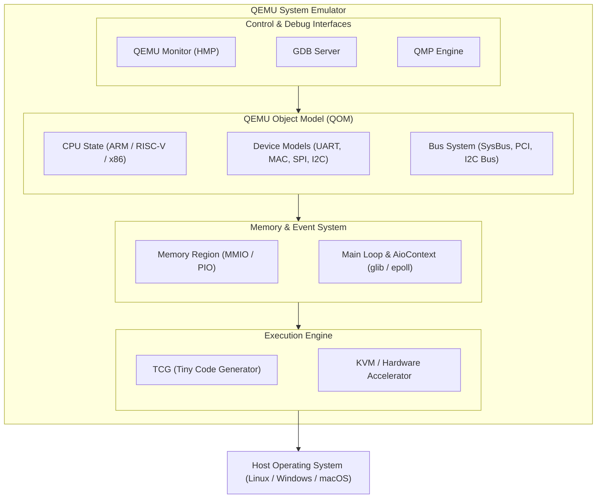

# QEMU 系統模擬與韌體開發實戰筆記

## 1. QEMU 概述與核心觀念 (Overview & Core Concepts)

**QEMU** 是一套開源的機器模擬器（Machine Emulator）與虛擬化平台。它可透過 **TCG（Tiny Code Generator）** 動態翻譯目標架構指令，也能在 Host 與 Guest 架構相容時使用 KVM 等硬體虛擬化加速器。在嵌入式系統、Linux Kernel 開發、BMC（Baseboard Management Controller）韌體開發以及作業系統教學領域中，QEMU 是常用的開發與測試工具。

### 1.1 兩種主要執行模式

1. **全系統模擬模式 (System Emulation Mode, `qemu-system-<arch>`)**
   - 模擬一整台完整的計算機硬體環境，包含 CPU、記憶體 (RAM)、記憶體管理單元 (MMU)、匯流排 (Bus)、中斷控制器 (GIC/APIC)、計時器與各類周邊裝置（如 UART、I2C、SPI、NIC、PCIe 等）。
   - 可在不需要真實硬體的情況下直接執行引導載入程式（U-Boot）、Linux Kernel、BMC 韌體影像（如 OpenBMC）或完整 OS。
   - **應用場景**：BMC 韌體虛擬測試、驅動程式開發、Kernel 除錯、系統架構開發。

2. **使用者空間模擬模式 (User-mode Emulation, `qemu-<arch>`)**
   - 允許在宿主機（Host）OS 上直接執行為不同 CPU 架構編譯的單一 Linux 二進位執行檔（例如在 x86_64 Host 上執行 ARM64 的 ELF 檔）。
   - QEMU 會捕捉目標（Target）程式的系統呼叫（Syscalls），將其轉譯為 Host OS 的系統呼叫。
   - **應用場景**：跨架構執行測試、CI、自動化驗證，以及 Chroot／Container 交叉環境開發。它執行並動態轉譯程式，不是靜態分析器。

---

### 1.2 模擬（Emulation）與虛擬化（Virtualization）的差別

| 特性 | 全軟體模擬 (Full Emulation / TCG) | 硬體輔助虛擬化 (Hardware-assisted Virtualization / KVM) |
| :--- | :--- | :--- |
| **目標 CPU 架構** | 可與 Host 架構不同 (如 x86 Host 執行 ARM Target) | 目標 CPU 架構必須與 Host 相同 (如 x86 Host 執行 x86 Guest) |
| **指令執行方式** | 使用 TCG 將 Target 二進位指令動態翻譯為 Host 指令 | 直接由 Host CPU 的硬體虛擬化擴充功能 (Intel VT-x / AMD-V) 執行 |
| **執行效能** | 通常較慢；實際差距受工作負載、目標／宿主架構與 I/O 模型影響 | 通常較接近原生執行；仍受虛擬裝置、I/O 路徑與工作負載影響 |
| **主要用途** | 跨架構開發、嵌入式/BMC 韌體模擬、晶片 tape-out 前測試 | 雲端虛擬機 (AWS, GCP, KVM VPS)、高效能虛擬伺服器 |

---

## 2. QEMU 核心內部架構 (Core Architecture)

QEMU 內部架構由數個核心模組組成，如下圖所示：



### 2.1 TCG (Tiny Code Generator) 動態翻譯引擎

當 QEMU 運行在純軟體模擬模式時，TCG 負責將 Target 架構的二進位機器碼轉換為 Host 架構的機器碼：

1. **Fetch & Decode**：讀取 Target 架構的二進位指令。
2. **Translate to IR**：將 Target 指令翻譯成 QEMU 的中介碼（Intermediate Representation, IR）。
3. **Optimize & CodeGen**：TCG 針對中介碼進行簡單優化後，生成 Host CPU 的原生機器碼。
4. **Translation Block (TB) Caching**：將翻譯結果組成 Translation Block 並快取，避免重複翻譯相同程式碼。TB 與一般編譯器的 Basic Block 概念相近但不完全相同，其邊界還會受分支、頁面邊界與 CPU 狀態等條件限制。

### 2.2 QOM (QEMU Object Model) 物件導向模型

QEMU 雖然是以純 C 語言寫成，但實作了一套完整且嚴謹的物件導向框架——**QOM**：

- **類別與實例 (Class & Instance)**：透過結構體繼承與指標組合實現。
- **屬性系統 (Properties)**：支援整數、字串、連結與布林值等屬性。部分屬性可由命令列設定或透過 QMP／QOM 查詢，但許多建立期屬性在裝置 `realize` 後便不能任意修改。
- **介面 (Interface)**：允許裝置實作特定的硬體介面（如 `ResettableInterface` 用於復位邏輯）。
- **樹狀結構 (QOM Tree)**：所有硬體物件（CPU、Bus、Device、MemoryRegion）皆構成一棵樹狀目錄，可用 `info qom-tree` 指令查看。

### 2.3 主迴圈與事件驅動 (Main Loop & Event Loop)

QEMU 使用 main loop 與 `AioContext` 事件基礎架構，並可整合 GLib event source：
- **File Descriptor 監聽**：透過 `poll()` / `epoll()` 處理網路 Socket、VNC、Serial 串列埠 I/O。
- **Timer 處理**：模擬硬體計時器中斷（如 ARM Generic Timer、AST2600 Timer）。
- **Bottom Halves (BH)**：非同步延遲執行的工作佇列，避免在鎖定或中斷處理階段執行過長時間的操作。

---

## 3. 裝置模擬與匯流排機制 (Device Emulation & Bus Infrastructure)

在嵌入式與 BMC 韌體開發中，理解 QEMU 的裝置模擬方式至關重要。

### 3.1 記憶體映射 I/O (MMIO) 處理流程

1. **建立 Memory Region**：
   裝置在初始化時宣告一塊 MMIO 記憶體區域，並註冊讀寫操作回調函式 (`MemoryRegionOps`)。
2. **掛載至 Address Space**：
   將 Memory Region 掛載到 CPU 的系統記憶體位址空間（System Memory Address Space）。
3. **Guest OS 讀寫匯流排**：
   當 Guest OS（如 Linux kernel driver）執行 `readl(base_addr + offset)` 或 `writel(val, base_addr + offset)` 時：
   - 觸發 QEMU 的 MMIO 攔截機制。
   - QEMU 呼叫對應裝置模型的 `.read` 或 `.write` 回調函式。
   - 裝置模型更新內部暫存器狀態，或觸發相對應的操作（如發送網路封包、寫入 SPI Flash 等）。

### 3.2 中斷線（IRQ Line）與連線機制

QEMU 透過 `qemu_irq` 訊號線連結裝置與中斷控制器：

```c
/* 裝置模型觸發中斷 */
qemu_set_irq(s->irq, 1); /* Assert IRQ */
qemu_set_irq(s->irq, 0); /* Deassert IRQ */
```

- **GPIO / IRQ Wiring**：在 Machine 腳本或 Board 初始化代碼中，使用 `qdev_connect_gpio_out()` 將裝置的 IRQ 腳位連接至 GIC/NVIC/VIC 的中斷輸入腳位。

---

## 4. QEMU 在 BMC 與嵌入式韌體模擬中的應用 (BMC & Firmware Emulation)

### 4.1 ASPEED AST2500 / AST2600 / AST2700 模擬支援

Upstream QEMU 已內建多款 ASPEED SoC 與開發板模型。共用板級程式主要位於 `hw/arm/aspeed.c`；AST2700 系列則使用 `hw/arm/aspeed_ast27x0.c`、`hw/arm/aspeed_ast27x0_evb.c`、`hw/arm/aspeed_ast27x0-fc.c`、`hw/arm/aspeed_ast27x0-ssp.c` 與 `hw/arm/aspeed_ast27x0-tsp.c` 等檔案。實際檔名與支援範圍仍應以使用中的 QEMU 版本為準。

- **CPU 模擬**：
  - AST2500: ARM1176J-S
  - AST2600: Dual-core ARM Cortex-A7
  - AST2700: 四核心 ARM Cortex-A35（64-bit AArch64）；`ast2700fc` machine 另加入兩個 Cortex-M4 協同處理器模型（SSP／TSP），不是 RISC-V CPU。
- **SoC 周邊裝置模組**：
  - **FMC / SMC、SPI**：支援 SPI Flash 相關控制器與 Flash 裝置模型，但不代表所有命令、時序與錯誤條件都與實體晶片完全一致。
  - **I2C / I3C**：依 SoC 與 machine 提供相應控制器模型；Master／Slave、DMA、SMBus／I3C 協定細節的完整度需逐項確認。
  - **UART**：提供 UART 裝置模型；Guest 中的 `/dev/ttyS*` 編號由 machine、Device Tree alias 與 Kernel 探測順序決定，不應假設固定對應。
  - **Ethernet**：ASPEED machine 可使用 FTGMAC100 等網路模型連接 QEMU 的網路 backend；NC-SI 與實體 PHY 行為是否可用需依版本與板型確認。
  - **其他周邊**：Timer、RTC、GPIO、ADC、Watchdog、SD／eMMC、USB、LPC 等僅有不同程度的模型支援。

> **支援邊界**：QEMU 的 ASPEED 模型是功能模型，不是整顆 SoC 的 cycle-accurate RTL。以 AST2700 為例，upstream 文件仍列出 PWM/Fan、PCIe、MCTP、Mailbox、Virtual UART 與 eSPI 等未實作裝置；已列為 supported 的裝置也可能只有基本或 dummy 介面。測試特定功能前，應先查閱該版本的 `docs/system/arm/aspeed.rst` 與對應原始碼。

### 4.2 執行 OpenBMC 韌體映像檔 (AST2600 範例)

執行一個完整 OpenBMC 韌體影像的常用命令：

```bash
qemu-system-arm \
    -M ast2600-evb \
    -m 1024M \
    -nographic \
    -drive file=obmc-phosphor-image-ast2600.static.mtd,if=mtd,format=raw \
    -nic user,model=ftgmac100,hostfwd=tcp::2222-:22,hostfwd=tcp::4443-:443,hostfwd=tcp::8080-:80
```

**參數解析**：
- `-M ast2600-evb`：指定目標硬體平台板型為 ASPEED AST2600 Evaluation Board。
- `-m 1024M`：分配 1GB 虛擬記憶體給 BMC。
- `-nographic`：停用 GUI 視窗，將主控制台 (Console) 直接重定向至目前的 Terminal。
- `-drive file=...,if=mtd`：將 OpenBMC 全軟體包 (MTD SPI Flash Image) 掛載為 Flash 裝置。
- `-nic user,model=ftgmac100,...`：以現代 `-nic` 簡寫建立 FTGMAC100 網卡與 User-mode 網路 backend（SLIRP），並將 Host 的 2222、4443、8080 連接埠分別轉發至 Guest 的 22（SSH）、443（HTTPS）、80（HTTP）。實際可用的網卡型號與連接方式應以所用 QEMU 版本的 `-nic help` 與 `-device help` 為準。

---

## 5. QEMU 常用指令與除錯實戰 (Command Line & Debugging)

### 5.1 關鍵命令列選項

| 選項 | 說明 |
| :--- | :--- |
| `-M <machine>` / `-machine` | 指定模擬的硬體主機板 (如 `ast2600-evb`, `virt`, `malta`) |
| `-cpu <cpu_type>` | 指定 CPU 型號 (如 `cortex-a7`, `cortex-a35`, `max`) |
| `-smp <n>` | 指定虛擬 CPU 核心數量 |
| `-m <size>` | 指定虛擬 RAM 大小 (如 `512M`, `2G`) |
| `-kernel <file>` | 指定可由該 machine 直接載入的 Kernel image；格式依目標架構與 machine 而定（例如 ARM `zImage` 為具自解壓流程的壓縮映像，AArch64 `Image` 通常為未壓縮映像） |
| `-initrd <file>` | 指定 initial ramdisk (ramfs) 檔案 |
| `-dtb <file>` | 指定 Device Tree Binary 檔案 |
| `-drive <options>` | 配置區塊裝置 (Block Device)，如 SPI Flash、MMC、NVMe |
| `-gdb tcp::<port>` / `-s` | 啟動 GDB Server 監聽（`-s` 預設監聽 TCP 1234 連接埠） |
| `-S` | 啟動時即凍結 CPU 執行，等待 GDB 下達 `continue` 指令（用於除錯 Bootloader/Kernel 入口） |

---

### 5.2 結合 GDB 進行 Linux Kernel / U-Boot 除錯

QEMU 內建 GDB Stub，是低階韌體與 Kernel 開發者最強大的除錯工具：

#### Step 1: 啟動 QEMU 並等待 GDB 連接
```bash
qemu-system-arm -M ast2600-evb -drive file=flash.img,if=mtd,format=raw -nographic -s -S
```

#### Step 2: 在另一個 Terminal 啟動跨平台 GDB (`gdb-multiarch`)
```bash
gdb-multiarch ./vmlinux
```

#### Step 3: GDB 內部連線與除錯操作
```gdb
(gdb) target remote localhost:1234
Remote debugging using localhost:1234
(gdb) break start_kernel
Breakpoint 1 at 0xc0100000: file init/main.c, line 580.
(gdb) continue
Continuing.

Thread 1 hit Breakpoint 1, start_kernel () at init/main.c:580
580         char *command_line;
(gdb) print boot_command_line
(gdb) step
```

> `0xc0100000` 僅是示意輸出。實際中斷點位址會受 Kernel 組態、載入位址、重定位與 KASLR 影響；應以目前建置產生的 `vmlinux` 符號及執行時位址為準。

---

### 5.3 QEMU Monitor (HMP) 與 QMP 介面

#### HMP (Human Monitor Protocol)
使用 `-nographic` 的預設 multiplexed character backend 時，在 QEMU 執行期間按下 `Ctrl+A` 然後按 `C` 通常可切換至 HMP 控制台。若使用自訂 `-serial`、`-monitor` 或未啟用 mux 的 character backend，切換鍵與可用性可能不同。

- `info registers`：查看目前 CPU 暫存器 (R0-R15 / PC / SP / CPSR)。
- `info qtree` / `info qom-tree`：印出現有裝置與匯流排節點。
- `info irq`：查看中斷統計資料。
- `xp /10xw 0x1e6e2000`：直接檢看實體記憶體/暫存器位址的記憶體內容 (Physical Memory Dump)。
- `memsave` / `pmemsave`：傾印記憶體內容至檔案。

#### QMP (QEMU Monitor Protocol)
基於 JSON 格式的自動化控制介面，適合與 CI/CD 自動化測試腳本（如 Python 程式）整合：
```json
{ "execute": "qmp_capabilities" }
{ "execute": "query-kvm" }
{ "execute": "system_powerdown" }
```

---

## 6. QEMU 自訂裝置開發實作 (Developing Custom Device in QEMU)

本節示範如何依照 **QEMU C coding style** 實作一個簡化的 MMIO 暫存器裝置骨架。QEMU 雖與 Linux Kernel 風格有部分相似之處，但採四個空白縮排、一般 C 檔不使用 Tab，且 `if`／`else` 等控制區塊即使只有一行也要加大括號。

### 6.1 簡化版 MMIO 虛擬裝置骨架

```c
/*
 * qemu_dummy_dev.c - Simple Dummy MMIO Device Model for QEMU
 *
 * Coding Style: QEMU C style
 */

#include "qemu/osdep.h"
#include "hw/sysbus.h"
#include "qemu/log.h"
#include "qemu/module.h"

#define TYPE_DUMMY_DEV "dummy-dev"
OBJECT_DECLARE_SIMPLE_TYPE(DummyDevState, DUMMY_DEV)

/* Register Offsets */
#define REG_ID          0x00
#define REG_CTRL        0x04
#define REG_DATA        0x08

#define DUMMY_DEV_MAGIC 0x44554d59 /* "DUMY" */

struct DummyDevState {
    SysBusDevice parent_obj;

    MemoryRegion mmio;
    qemu_irq irq;

    /* Internal Device Registers */
    uint32_t reg_ctrl;
    uint32_t reg_data;
};

static uint64_t dummy_dev_read(void *opaque, hwaddr offset, unsigned size)
{
    DummyDevState *s = DUMMY_DEV(opaque);

    switch (offset) {
    case REG_ID:
        return DUMMY_DEV_MAGIC;
    case REG_CTRL:
        return s->reg_ctrl;
    case REG_DATA:
        return s->reg_data;
    default:
        qemu_log_mask(LOG_GUEST_ERROR,
                      "%s: Bad offset 0x%" HWADDR_PRIx "\n",
                      __func__, offset);
        return 0;
    }
}

static void dummy_dev_write(void *opaque, hwaddr offset,
                            uint64_t val, unsigned size)
{
    DummyDevState *s = DUMMY_DEV(opaque);

    switch (offset) {
    case REG_CTRL:
        s->reg_ctrl = val;
        /* Trigger IRQ if bit 0 is enabled */
        if (val & 0x01) {
            qemu_set_irq(s->irq, 1);
        } else {
            qemu_set_irq(s->irq, 0);
        }
        break;
    case REG_DATA:
        s->reg_data = val;
        break;
    default:
        qemu_log_mask(LOG_GUEST_ERROR,
                      "%s: Bad offset 0x%" HWADDR_PRIx "\n",
                      __func__, offset);
        break;
    }
}

static const MemoryRegionOps dummy_dev_ops = {
    .read = dummy_dev_read,
    .write = dummy_dev_write,
    .endianness = DEVICE_LITTLE_ENDIAN,
    .valid = {
        .min_access_size = 4,
        .max_access_size = 4,
    },
};

static void dummy_dev_init(Object *obj)
{
    DummyDevState *s = DUMMY_DEV(obj);
    SysBusDevice *sbd = SYS_BUS_DEVICE(obj);

    /* Initialize MMIO Region */
    memory_region_init_io(&s->mmio, obj, &dummy_dev_ops, s,
                          "dummy-dev-mmio", 0x100);
    sysbus_init_mmio(sbd, &s->mmio);

    /* Initialize IRQ */
    sysbus_init_irq(sbd, &s->irq);
}

static const TypeInfo dummy_dev_info = {
    .name          = TYPE_DUMMY_DEV,
    .parent        = TYPE_SYS_BUS_DEVICE,
    .instance_size = sizeof(DummyDevState),
    .instance_init = dummy_dev_init,
};

static void dummy_dev_register_types(void)
{
    type_register_static(&dummy_dev_info);
}

type_init(dummy_dev_register_types)
```

> **重要限制**：以上只有型別註冊、MMIO region 與 IRQ 腳位初始化，仍是**尚未掛入 Machine 的裝置模型骨架**。僅編譯這個檔案，Guest 不會自動看到裝置。

若要成為可用的裝置模型，至少還需完成：

1. **建置整合**：在對應目錄的 `meson.build`／Kconfig 納入此來源檔。
2. **Machine／SoC 整合**：由 board 或 SoC 程式建立並 `realize` 裝置，再以 `sysbus_mmio_map()` 映射位址，並以 `sysbus_connect_irq()` 或適合的 GPIO API 連接中斷控制器。映射位址與 IRQ 編號也必須反映在 Device Tree 或 ACPI 描述中。
3. **Reset 行為**：定義上電值與 reset callback，清除 `reg_ctrl`、`reg_data` 並解除 IRQ；否則 Guest reset 後可能保留不合理的舊狀態。
4. **Migration／Snapshot 狀態**：若需支援 live migration 或 VM snapshot，應以 `VMStateDescription` 宣告所有會影響 Guest 行為的狀態，並處理版本相容性。若專案明確不支援 migration，也應在設計與測試限制中寫清楚。
5. **裝置語意與測試**：補上存取寬度、未對齊存取、唯讀／保留 bit、中斷清除條件與錯誤路徑，並加入 qtest 或功能測試。目前範例中的 `size` 參數雖由 `.valid` 限制為 4 bytes，仍只適合作為教學起點。

---

## 7. QEMU Image 與 FPGA / Real ASIC Image 核心差異比較 (QEMU vs FPGA Image Differences)

在晶片 Tape-out 前（Pre-silicon）或硬體驗證階段，團隊可能同時使用 QEMU、FPGA 原型板與實體 ASIC 開發韌體。但 **QEMU Image 與 FPGA Image 並不是 upstream QEMU、U-Boot 或 OpenBMC 強制定義的兩種標準映像格式**。QEMU 的 ASPEED machine 經常可直接啟動正常的 OpenBMC MTD image；是否分成兩套產物，取決於專案的 machine 設定、Device Tree、BootROM／SPL 流程、硬體初始化需求與映像封裝方式。

因此，下表比較的是**常見差異來源**，不是所有專案都必然成立的規則：

| 比較項目 | QEMU 環境的常見情況 | FPGA／實體硬體的常見情況 |
| :--- | :--- | :--- |
| **DRAM / 記憶體初始化** | QEMU 由 Host 配置 Guest RAM；部分 machine 只提供足以開機的 SDRAM controller 介面或訓練結果，因此韌體可能走簡化路徑。是否能直接略過 DDR 初始化，取決於該 machine 與 BootROM／SPL 實作。 | 必須符合原型板或 ASIC 的 DDR controller、PHY、記憶體顆粒與時脈設計；FPGA 是否執行完整 training 也取決於 RTL 原型涵蓋範圍。 |
| **時脈樹與 Baud Rate** | Clock／SCU 模型可能只實作 Guest 需要的暫存器語意。模型若未模擬真實傳輸時序，錯誤分頻未必會以真實硬體相同方式失敗，但韌體仍應使用正確 clock 資訊。 | UART、Timer、SPI、Ethernet 等分頻必須對應實際板級時脈；FPGA 原型常降頻運作，但頻率值是板級設計資料，不能套用固定範例數字。 |
| **裝置樹 (DTS)** | 可沿用實際板 DTS，也可使用與 QEMU machine 相符的 DTS。未實作裝置通常應停用，IRQ、位址與相容字串必須和模型一致。 | 必須描述 RTL 已實現的 IP、板載周邊、IRQ、clock、reset、pinctrl 與電源關係；它不一定與最終 ASIC 板完全相同。 |
| **PHY 與外部裝置** | 網卡可接 QEMU user、tap 等 backend；某些 PHY、MDIO 或外部晶片行為可能被簡化、固定或未實作。是否需要 fixed-link／fixed PHY 由 DTS 與模型決定。 | 必須配合實際 PHY 型號、介面模式、MDIO 位址、reset GPIO 與自動協商；相應驅動可 built-in 或 module，依開機需求決定。 |
| **安全啟動與根信任** | QEMU 不等於「預設繞過」。某些 ASPEED machine 已模型化 OTP／Secure Boot Controller 的部分流程，也可選擇未啟用安全啟動的測試情境；能驗證到哪一層須以該版本模型為準。 | 只有專案啟用 Secure Boot 時才要求對應簽章與金鑰配置。FPGA 的 OTP／eFuse 可能由 RTL、BRAM 或測試介面模擬，與量產 ASIC 的不可逆燒錄流程仍有差異。 |
| **可觀察性與除錯** | 可用 GDB stub、QMP/HMP、trace、qtest 與 deterministic 測試提高可觀察性；但無法驗證 QEMU 未建模的類比、PHY、時序與訊號完整性。 | 可觀察性通常受 JTAG、UART、logic analyzer 與 FPGA probe 資源限制，但能驗證 RTL 連線、實際時序及硬體／軟體交互作用。 |

---

### 7.1 編譯參數與組態選項 (Kconfig / Makefile / Build Flags) 具體差異

在編譯 U-Boot、Linux Kernel 與 OpenBMC image 時，應先區分三種來源：

1. **Upstream 已存在的板型設定**：名稱可以在對應版本的 repository 中查到。例如 upstream U-Boot 的 AST2600 EVB defconfig 為 `configs/evb-ast2600_defconfig`；不能自行推導成 `ast2600_qemu_defconfig` 或 `ast2600_fpga_defconfig`。
2. **Yocto／OpenBMC machine 設定**：`MACHINE` 名稱由 layer 中的 `conf/machine/*.conf` 定義。QEMU 有時直接使用實際板型的 OpenBMC image，有時專案另建 QEMU machine；名稱必須以實際 layer 為準。
3. **Vendor／專案自訂設定**：若 BSP 真的提供 `*-qemu_defconfig`、`*-fpga_defconfig`、自訂 DDR flag 或專用 image tool，可以使用，但文件必須標示來源 repository、branch 與檔案路徑，不能描述成 upstream 通用介面。

#### 1. 建構目標與板型設定 (Machine & Target Selection)

- **先確認 QEMU machine**：使用 `qemu-system-arm -machine help`，再查閱 `docs/system/arm/aspeed.rst`。QEMU machine 名稱（例如 `ast2600-evb`）不代表建置系統必定存在同名的 Yocto `MACHINE` 或 defconfig。
- **再確認韌體目標**：在所用 branch 中搜尋 `configs/*ast2600*defconfig`、Kernel `arch/arm/configs/`、DTS 與 Yocto `conf/machine/`。例如 upstream U-Boot 可使用：

```bash
make evb-ast2600_defconfig
```

- **專案若需要分流**：優先共用基礎設定，將 QEMU／FPGA 差異放在可追蹤的 config fragment、DTS overlay、machine include 或 recipe override 中，避免複製出長期漂移的整套組態。

#### 2. U-Boot Kconfig 設定差異

- **DDR／低階初始化**：是否設定 `CONFIG_SKIP_LOWLEVEL_INIT` 必須由實際 U-Boot 啟動階段與 board code 決定。`CONFIG_SYS_DDR_INTERVAL`、`CONFIG_DRAM_AST2600_FPGA` 等名稱若不在使用中的 Kconfig／vendor tree，就不能加入 `.config` 或列為通用選項。
- **Clock／UART**：優先由 clock driver、Device Tree 與 SoC 實作提供時脈，不要假設所有 QEMU 為 24 MHz、所有 FPGA 為 12.5 MHz。若 BSP 仍使用 `CONFIG_SYS_NS16550_CLK`，值應來自該平台可驗證的 clock tree。
- **SPI Flash**：`CONFIG_SF_DEFAULT_SPEED` 或 DTS 中的 `spi-max-frequency` 應符合控制器模型／RTL 與 Flash 限制。QEMU 不模擬完整實體時序，不代表可將任意高頻值視為硬體可行。
- **啟動來源與映像配置**：Flash offset、SPL、FIT、U-Boot proper、環境區與 redundant image 的配置必須和 QEMU 掛載方式及 FPGA flash layout 同步；這往往比單一 Kconfig flag 更關鍵。

#### 3. Linux Kernel `.config` 設定差異

- **Device Tree 選擇**：DTS 檔名必須確實存在於該 Kernel tree，並由 bootloader 傳入正確 DTB。不要假設存在 `ast2600-evb-qemu` 或 `ast2600-fpga`；若是專案自訂 DTS，應明確註記。
- **驅動設定**：QEMU 僅需啟用已建模且測試要用的控制器與外部裝置；FPGA 則依 RTL 與板載元件啟用驅動。`CONFIG_FIXED_PHY`、`CONFIG_REALTEK_PHY`、`CONFIG_MARVELL_PHY` 等不是由「QEMU／FPGA」標籤自動決定，而是由實際 DTS 與硬體拓撲決定。
- **除錯選項**：KASAN、lock debugging、debug info 等可在 QEMU 或 FPGA 啟用；代價是記憶體、映像大小與執行效能。QEMU 通常較方便觀察與重現，但不代表所有高成本選項都應預設開啟。
- **共同核心優先**：若硬體模型足夠，盡量使用相同 Kernel binary，僅切換 DTB 或 boot arguments，可減少「只在 QEMU build 通過」的組態偏差。

#### 4. Image 簽章與打包工具參數 (Image Signing & Packaging)

- **未啟用 Secure Boot 的測試**：QEMU 與 FPGA 都可能使用未簽章映像，前提是其 BootROM／啟動政策允許。這是專案安全設定，不是執行平台的固有差異。
- **啟用 Secure Boot 的測試**：兩邊都應依驗證鏈產生簽章與 metadata。FIT image 可依 ITS 與 U-Boot 流程使用 `mkimage` 簽署；SoC boot image 若還需要 ASPEED `socsec` 或 vendor tool，參數、header 與 OTP 配置必須依該 SoC revision 與 BSP 文件決定。
- **金鑰管理**：QEMU／CI 可使用明確標示的測試金鑰；FPGA 也不應預設使用量產私鑰。私鑰不應寫死在命令、repository 或一般 build log 中，應由受控的 signing service 或秘密管理機制提供。
- **驗證界線**：QEMU 即使能走完簽章檢查，也只證明已建模的 BootROM／OTP／crypto 路徑；FPGA 即使通過，也不等同量產 eFuse、類比特性與不可逆 provisioning 已驗證完成。

---

## 8. 總結與學習資源 (Summary & References)

1. **開發優勢**：QEMU 提供晶片前開 (Pre-silicon) 與軟體韌體併行開發的能力，極大地加速了 BMC 與 Linux 驅動程式的開發週期。
2. **與 GDB 結合**：提供指令層級與記憶體層級的完全控制力，能輕易重現軟體死鎖、記憶體損毀與例外狀況。
3. **延伸參考文件**：
   - [QEMU Official Documentation](https://www.qemu.org/documentation/)
   - [QEMU ASPEED Machine Documentation](https://www.qemu.org/docs/master/system/arm/aspeed.html)
   - [Upstream QEMU ASPEED Source (`hw/arm/`)](https://gitlab.com/qemu-project/qemu/-/tree/master/hw/arm)
   - [OpenBMC QEMU Development Guide](https://github.com/openbmc/openbmc/blob/master/docs/qemu.md)
