# UFS 基本知識與 Linux 驗證筆記

> 使用情境：從 SoC / BMC / Linux 開發角度理解 UFS（Universal Flash Storage）的硬體介面、協定分層、UFSHCI DMA 資料結構、裝置初始化、SCSI I/O 路徑，以及常見的 bring-up 與錯誤定位方法。

---

## 目錄

- [1. UFS 是什麼](#1-ufs-是什麼)
- [2. UFS 協定分層](#2-ufs-協定分層)
- [3. UFS 與 eMMC、SATA、NVMe 的差異](#3-ufs-與-emmcsatanvme-的差異)
- [4. Host 與 Device 的硬體架構](#4-host-與-device-的硬體架構)
- [5. UFSHCI 與 DMA 資料結構](#5-ufshci-與-dma-資料結構)
- [6. UPIU 與命令類型](#6-upiu-與命令類型)
- [7. UFS 裝置模型](#7-ufs-裝置模型)
- [8. 初始化與 Link Startup](#8-初始化與-link-startup)
- [9. 一筆 Read I/O 的完整流程](#9-一筆-read-io-的完整流程)
- [10. 中斷、完成與錯誤處理](#10-中斷完成與錯誤處理)
- [11. 電源管理與效能](#11-電源管理與效能)
- [12. Linux 軟體堆疊](#12-linux-軟體堆疊)
- [13. Linux 驗證指令](#13-linux-驗證指令)
- [14. Bring-up 與除錯順序](#14-bring-up-與除錯順序)
- [15. 常見誤解](#15-常見誤解)
- [16. 重點總結](#16-重點總結)
- [參考資料](#參考資料)

---

## 1. UFS 是什麼

UFS（Universal Flash Storage）是 JEDEC 定義的高效能快閃儲存介面，常見於手機、平板、車用系統與其他嵌入式平台。

它把 NAND Flash、控制器、韌體與管理資訊整合在 UFS Device 內，Host 不需要直接處理 NAND page、block、ECC 或 wear leveling，只需透過標準命令存取邏輯區塊。

UFS 的主要特性包括：

- **全雙工序列介面**：上行與下行可同時傳輸。
- **命令佇列**：可同時保留多筆尚未完成的 I/O，提高平行度。
- **SCSI 命令模型**：一般資料存取使用 SCSI Command Descriptor Block（CDB）。
- **低功耗設計**：支援多種 link 與 device power state。
- **分層協定**：上層 UFS 命令透過 UTP、UniPro 與 M-PHY 傳輸。

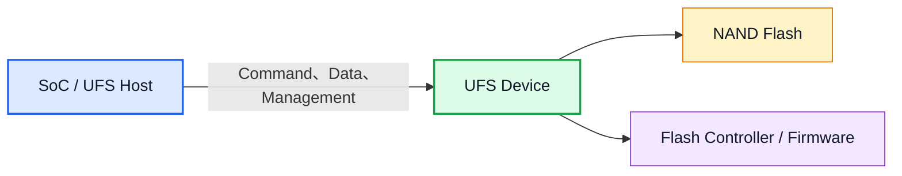

> **範圍界定**：UFS 規範描述 Host 與 Device 之間的介面與行為；NAND 內部的 FTL、垃圾回收、壞塊管理與 wear leveling 通常是 Device 廠商的實作細節。

---

## 2. UFS 協定分層

UFS 不是單一層協定。從 Linux 發出的 block I/O 到實體線路，大致會經過以下層級：

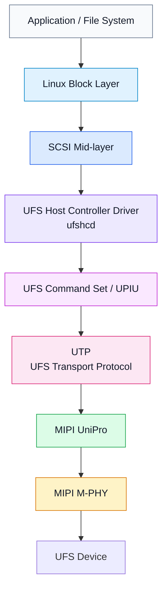

| 層級 | 主要責任 | 常見除錯對象 |
| :--- | :--- | :--- |
| UFS Application / SCSI | Read、Write、Inquiry、Test Unit Ready 等儲存命令 | SCSI status、sense data、LUN 狀態 |
| UPIU | 封裝 Command、Response、Data 與 Query | Transaction Type、Task Tag、Response、Status |
| UTP | Host Controller 與記憶體中的 request descriptor / command descriptor | UTRD、UCD、PRDT、doorbell |
| UniPro | Link、transport、flow control 與可靠傳輸 | UIC error、link state、DME attribute |
| M-PHY | 差動訊號、lane、gear、PWM / HS mode | clock、reset、lane、signal integrity |

MIPI 官方將 **UniPro** 定位為分層的 transport / link protocol，並以 **M-PHY** 作為實體層；JEDEC UFS 再使用這組 interconnect 承載儲存協定。

---

## 3. UFS 與 eMMC、SATA、NVMe 的差異

| 項目 | UFS | eMMC | SATA / AHCI | NVMe / PCIe |
| :--- | :--- | :--- | :--- | :--- |
| 主要場景 | 行動與嵌入式儲存 | 成本導向嵌入式儲存 | PC、伺服器與傳統儲存 | 高效能 PC / Server / Embedded |
| 實體介面 | MIPI M-PHY | 平行 clock/data bus | SATA serial link | PCIe |
| 傳輸方向 | 全雙工 | 半雙工 | 全雙工 | 全雙工 |
| 命令模型 | SCSI-based | MMC command | ATA command | NVMe command |
| 佇列能力 | UFSHCI 3.x 為 32 slot 單一 doorbell；UFSHCI 4.0 起支援 MCQ 多組 SQ / CQ | eMMC 5.1 起支援 Command Queuing（最多 32 slot），但仍受半雙工匯流排限制 | AHCI NCQ 最多 32 | 多組深度 SQ / CQ |
| Host 軟體介面 | UFSHCI | MMC Host Controller | AHCI | NVMe Controller Register / Queue |

UFS 與 eMMC 都常以 BGA 封裝焊接在板上，但兩者的線路、Host Controller、協定與 Linux driver 並不相容。

UFS 雖然使用 SCSI 命令，實體介面卻不是 SAS 或 SATA；SCSI 在此主要是上層命令語意。

---

## 4. Host 與 Device 的硬體架構

典型 SoC 平台包含 UFS Host Controller、UniPro Controller、M-PHY、clock/reset、電源 rail 與 UFS Device。

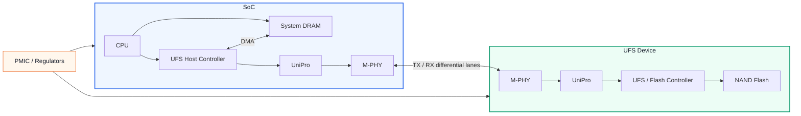

### 4.1 常見硬體訊號

| 類型 | 用途 |
| :--- | :--- |
| `TX_DP/TX_DN` | Host 傳送方向的差動 lane |
| `RX_DP/RX_DN` | Host 接收方向的差動 lane |
| Reference Clock | Host 提供給 Device 的參考時脈，UFS 定義 19.2 / 26 / 38.4 / 52 MHz 四種 |
| Reset | 重設 UFS Device 或 Host 相關邏輯 |
| `VCC` | NAND Flash 供電，常見 2.5V 或 3.3V |
| `VCCQ` | Device controller core 供電，常見 1.2V |
| `VCCQ2` | Device I/O / 介面供電，常見 1.8V |

`VCC` / `VCCQ` / `VCCQ2` 是 JEDEC 定義的標準名稱，不是平台自訂。Linux `ufshcd` 也直接以這組名稱取得 regulator，Device Tree 對應 `vcc-supply`、`vccq-supply`、`vccq2-supply`。

Reference clock 有一個容易忽略的細節：Device 端有 `bRefClkFreq` attribute，必須與板子實際供給的頻率一致。兩者不符時 link 可能起得來，卻在後續 power mode change 或高 gear 下出現不穩定，屬於典型的 bring-up 陷阱。

> **Bring-up 重點**：看到 Host Controller register 可讀，不代表 UFS Device 已供電，也不代表 M-PHY / UniPro link 已建立。控制器、PHY、電源與裝置重設必須分層確認。

---

## 5. UFSHCI 與 DMA 資料結構

UFSHCI（UFS Host Controller Interface）定義軟體如何控制 UFS Host Controller。Driver 透過 MMIO register 設定 descriptor list 的 DMA address、啟用 Controller、敲 doorbell，硬體再從 DRAM 取得命令與資料描述。

### 5.1 主要資料結構

| 結構 | 全名 | 用途 |
| :--- | :--- | :--- |
| UTRD | UTP Transfer Request Descriptor | 描述一般 transfer request，並指向 UCD |
| UTMRD | UTP Task Management Request Descriptor | Abort Task、Logical Unit Reset 等 task management |
| UCD | UTP Command Descriptor | 容納 Request UPIU、Response UPIU 與 PRDT |
| PRDT | Physical Region Description Table | 描述實際 data buffer 的 DMA address 與長度 |

注意 UCD 的規格名稱是 **UTP Command Descriptor**，中間沒有 Transfer；帶 Transfer 的是 UTRD。

除了指向 UCD 之外，UTRD 本身還帶著除錯時最常看的幾個欄位：

| UTRD 欄位 | 意義 |
| :--- | :--- |
| Command Type / UTP Transfer Request Type | 標示這是哪一類 UTP request |
| Data Direction（DD） | 標示 host-to-device、device-to-host 或無資料傳輸 |
| Interrupt（I） | 完成時是否產生中斷 |
| **OCS** | Overall Command Status，Host Controller 回寫的整體結果 |
| Response UPIU Offset / Length | Response UPIU 在 UCD 內的位置與長度 |
| PRDT Offset / Length | PRDT 在 UCD 內的位置與 entry 數 |

其中 OCS 由硬體在命令完成時回寫進 UTRD，這也是第 10 章「先看 OCS 再看 Response UPIU」的資料來源——OCS 反映 host controller / transport 層是否正常，Response UPIU 才反映 Device 與 SCSI 層的結果。

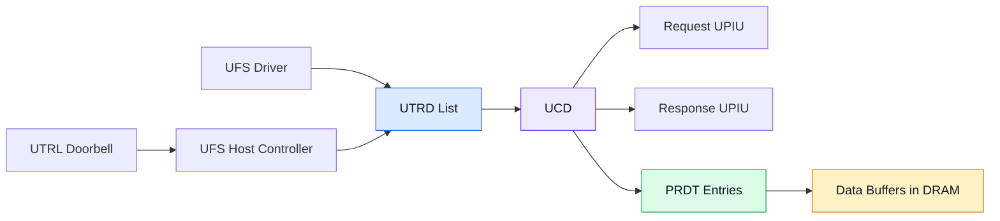

### 5.2 PRDT 的角色

PRDT 用於 scatter-gather DMA。每個 entry 指向一段實際 data buffer，Host Controller 依序在這些 buffer 與 UFS link 之間搬移資料。

> **重要**：PRDT 只保存 DMA buffer 的位址、長度與控制資訊，不保存 Read / Write 的實際 payload。實際資料位於 PRDT 指向的 DRAM buffer。

### 5.3 Doorbell 與完成

Doorbell 是 Driver 與 UFS Host Controller 之間的工作提交通知。Descriptor 說明 request 的內容，Doorbell 則表示這些內容已經準備完成，Controller 可以開始取得並執行。

> **核心概念**：Descriptor 告訴 Controller「工作內容是什麼」；Doorbell 告訴 Controller「工作已準備好，可以開始了」。

一般 transfer request 的概念流程：

1. Driver 準備 UTRD、UCD、UPIU 與 PRDT。
2. Driver 完成必要的 DMA mapping 與 memory ordering。
3. Driver 在 Transfer Request Doorbell 設定對應 slot bit。
4. Controller 取得 descriptor，送出命令並搬移資料。
5. Controller 回寫結果並產生中斷。
6. Driver 清理 DMA mapping，將完成狀態交回 SCSI mid-layer。

#### 5.3.1 Descriptor 與 Doorbell 為何分成兩個步驟

UTRD、UCD 與 PRDT 位於 System DRAM，Driver 需要依序填妥 Command Type、Data Direction、UPIU、DMA address、data length 等欄位。完成 DMA mapping 與 memory ordering 後，Doorbell 成為 request 的正式發布點，讓 Controller 取得一份完整且可供 DMA 存取的 descriptor。

這個兩階段設計帶來幾個效果：

- Driver 可以完整準備多個欄位與 scatter-gather buffer，再一次提交。
- Controller 直接依 Doorbell 指定的 slot 取得工作，減少持續輪詢 DRAM 的流量與功耗。
- Driver 與 Controller 透過清楚的提交時點轉移 request ownership。
- 多筆 outstanding command 可以分別占用不同 slot 並行處理。

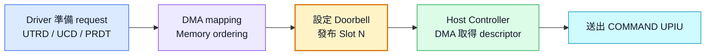

Doorbell 屬於 Host 內部的 MMIO 操作，UFS Device 從 link 收到的是 COMMAND UPIU。Device 收到 COMMAND UPIU 後即可解析並安排該命令。

#### 5.3.2 Host Slot 的軟硬體分工

Host Slot 是 `ufshcd` 與 UFS Host Controller 共同使用的 UFSHCI 介面。UTRD List 放在 System DRAM，Driver 管理 slot 的配置與生命週期，Controller 則透過 DMA 讀取並回寫對應 entry。

| 元件 | 與 Host Slot 相關的工作 |
| :--- | :--- |
| `ufshcd` | 配置 UTRD List、選擇空閒 slot、填寫 UTRD / UCD / PRDT、設定 Doorbell、完成後回收 slot |
| UFS Host Controller | 依 Doorbell 取得 slot、DMA 讀取 descriptor、執行傳輸、回寫 OCS / Response、更新完成狀態 |
| UFS Device | 依 COMMAND UPIU 的 LUN、Task Tag 與 SCSI CDB 建立 Device 端 command context |

Controller 可依 UTRD List base address 與 slot index 找到 request：

> **UTRD address = UTRD List Base + Slot Index × UTRD Size**

在 SDB 模式中，`UTRLDBR` 的每個 bit 對應一個 Host Slot。例如 Driver 準備好 Slot 5 後寫入 `BIT(5)`，Controller 便會取得 `UTRD[5]` 及其指向的 UCD / PRDT。

Host Slot 的資訊留在 Host 端。送上 UFS link 的 COMMAND UPIU 使用 Task Tag 配對後續 DATA 與 RESPONSE；常見實作會從 Host request tag 或 slot index 建立 Task Tag，兩者分別服務 UFSHCI 與 UPIU 層級。

#### 5.3.3 一筆 SCSI Command 與 Slot 的關係

在 SDB 模式中，一筆 outstanding SCSI command 通常占用一個 UTRD slot，直到 Controller 完成 request、更新結果並由 Driver 回收資源。

| 情境 | Host Slot 使用方式 |
| :--- | :--- |
| 一筆 `READ(10)`，一個連續 DMA buffer | 一個 slot、一個 PRDT entry |
| 一筆 `READ(10)`，四個 scatter-gather buffer | 一個 slot、四個 PRDT entries |
| 一筆 `READ(10)`，回傳多個 DATA IN UPIU | 一個 slot，以同一 Task Tag 配對 |
| 上層 I/O 被拆成四筆 SCSI command | 最多四個 slot，可同時 outstanding |

因此，PRDT entry 數與 DATA IN / OUT UPIU 數量描述同一筆 command 的資料分段；SCSI command 的數量則決定需要多少個 request slot。

#### 5.3.4 Doorbell 與 Interrupt 的方向

| 機制 | 方向 | 用途 |
| :--- | :---: | :--- |
| Doorbell | Driver → Host Controller | 提交已準備完成的 request |
| Completion Interrupt | Host Controller → Driver | 通知 request 已完成或有狀態需要處理 |

Doorbell bit 持續為 1 表示該 slot 仍處於 outstanding 狀態。除錯時可搭配 Interrupt Status、UTRD OCS、Response UPIU、Task Tag、PRDT 與 UIC Error Register 還原 request 停留的階段。

#### 5.3.5 USB xHCI 的對照

USB Mass Storage 透過 xHCI 傳輸時也採用相近的 Host 軟硬體交接方式：USB Driver 先建立 Transfer Ring TRB，再設定 xHCI Doorbell；xHCI Controller 隨後將包含 `READ(10)` 的 CBW 或 Command IU 傳給 USB Device。

| 階段 | UFS | USB xHCI |
| :--- | :--- | :--- |
| Driver 準備工作 | UTRD / UCD / PRDT | Transfer TRB |
| 通知 Host Controller | UFSHCI Doorbell | xHCI Doorbell |
| 線路上的儲存命令 | COMMAND UPIU | CBW / Command IU |
| 線路上的讀取資料 | DATA IN UPIU | Bulk IN Data |
| Controller 回報完成 | OCS / Response / Interrupt | Event TRB / Interrupt |

Protocol Analyzer 位於外部 link 時，畫面會從儲存命令開始；Descriptor 與 Doorbell 則可由 Host Controller register、memory dump 或 Driver trace 觀察。

### 5.4 SDB 與 MCQ

上面描述的是 **Single Doorbell（SDB）** 模式：一份 UTRD list、最多 32 個 slot，所有 request 共用 `UTRLDBR` 這一個 doorbell register，以 bit position 對應 slot。這是 UFSHCI 3.x 之前唯一的模式。

UFSHCI 4.0 起加入 **MCQ（Multi-Circular Queue）**，改為多組 Submission Queue / Completion Queue，每個 queue 有自己的 head / tail doorbell，概念上接近 NVMe 的 SQ / CQ：

| 面向 | SDB | MCQ |
| :--- | :--- | :--- |
| Request 容器 | 單一 UTRD list | 多組 SQ，各自獨立 |
| 完成通知 | 回寫 UTRD 的 OCS | 寫入對應 CQ 的 completion entry |
| Doorbell | 單一 `UTRLDBR`，bit 對應 slot | 每個 queue 各自的 doorbell |
| 深度上限 | 32 | 遠高於 32，依 controller 實作 |
| 多核擴展 | 共用 slot 與 lock，易成瓶頸 | 可對應到 CPU / hardware queue |

Upstream Linux 在 6.3 開始具備 MCQ 基礎支援，6.5 進一步補齊 abort 與 error handler；實際能否啟用仍取決於 Host Controller、UFSHCI capability 與 platform variant driver。除錯時要先確認目前跑的是哪一種模式：MCQ 模式下沒有傳統的 doorbell bitmap 可看，「doorbell 不清」這類判斷方式並不適用，要改看對應 SQ / CQ 的 head / tail 指標與 completion entry。

---

## 6. UPIU 與命令類型

UPIU（UFS Protocol Information Unit）是 Host 與 Device 之間交換命令、回應與資料的基本協定單位。

### 6.1 常見 UPIU

| UPIU 類型 | 方向 | 用途 |
| :--- | :---: | :--- |
| NOP OUT / NOP IN | Host → Device / Device → Host | 確認 Device 可回應 UPIU |
| COMMAND / RESPONSE | Host → Device / Device → Host | 承載 SCSI command 與完成狀態 |
| DATA OUT / DATA IN | Host → Device / Device → Host | Write / Read payload 傳輸 |
| QUERY REQUEST / QUERY RESPONSE | Host → Device / Device → Host | 存取 Descriptor、Attribute、Flag |
| TASK MANAGEMENT REQUEST / RESPONSE | Host → Device / Device → Host | Abort Task、LUN Reset 等復原操作 |
| READY TO TRANSFER | Device → Host | Write data transfer 的流量協調 |
| REJECT | Device → Host | Device 無法接受該 UPIU 時回報 |

每一列都是**成對的單向 UPIU**，不是同一種 UPIU 可雙向傳送：斜線前為 Host 送出，斜線後為 Device 回應。

UPIU header 中常見的追蹤欄位包括：

- `Transaction Type`：UPIU 類型。
- `LUN`：目標 Logical Unit。
- `Task Tag`：配對 request 與 response。
- `Data Segment Length`：UPIU data segment 長度。
- `Response` / `Status`：命令完成結果。

### 6.2 SCSI Command 與 Query Request 不同

- **SCSI Command**：用於正常 block I/O 與裝置操作，例如 `READ(10)`、`WRITE(10)`、`INQUIRY`。
- **Query Request**：用於讀寫 UFS Device 的 Descriptor、Attribute 與 Flag。
- **UIC Command**：由 Host Controller 對 UniPro / M-PHY interconnect 執行 DME 操作，不是送給 LUN 的 SCSI command。

這三條控制路徑的失敗訊息與除錯層級不同，不應混為一談。

---

## 7. UFS 裝置模型

### 7.1 Logical Unit（LUN）

一顆 UFS Device 可提供多個 Logical Unit。Linux 掃描完成後，這些 LUN 通常會以 SCSI disk 的形式出現在 `/dev/sdX`。

除了一般 user LUN，UFS 也定義四個特殊用途的 **Well-Known LUN（W-LUN）**：

| W-LUN | ID | 用途 |
| :--- | :---: | :--- |
| REPORT LUNS | `0x81` | 回報目前可用的 LUN 清單 |
| UFS Device | `0xD0` | Device 層級管理操作，例如 SSU（Start Stop Unit）電源控制 |
| BOOT | `0xB0` | 對應目前被選為開機來源的 Boot LUN |
| RPMB | `0xC4` | Replay Protected Memory Block，防重放的安全儲存區 |

W-LUN 不會像一般 user LUN 那樣呈現成可掛載的 block device。Upstream Linux 會為 UFS Device、RPMB 與 Boot W-LUN 建立 SCSI device，但不會為 REPORT LUNS W-LUN 建立獨立裝置；實際可見項目仍會受 kernel 版本與 driver 行為影響。Linux SCSI 層使用從 `0xC100` 開始的 W-LUN 編碼，因此在 `lsscsi` 中可能看到 W-LUN，卻沒有對應的 `/dev/sdX`。

#### 7.1.1 RPMB

RPMB 是一塊需要驗證才能寫入的區域，寫入時必須附上以預先燒錄的金鑰計算出的 MAC，並搭配單調遞增的 write counter，因此重播舊的寫入封包會被拒絕。典型用途包括安全開機的防回滾計數器、DRM 金鑰與裝置識別資料。

存取 RPMB 不是走一般的 block I/O，而是透過 `SECURITY PROTOCOL IN` / `SECURITY PROTOCOL OUT` 這組 SCSI command 對 RPMB W-LUN 下達。金鑰一旦寫入即不可更改也不可讀回，量產流程中燒錯是不可逆的。

### 7.2 Descriptor、Attribute、Flag

| 類別 | 特性 | 例子 |
| :--- | :--- | :--- |
| Descriptor | 多 byte 結構化資料 | Device、Configuration、Unit、Geometry、String Descriptor |
| Attribute | 固定寬度的數值狀態或設定 | Power mode、active ICC level 等 |
| Flag | Boolean 狀態或控制 | Device initialization 等 |

Driver 透過 Query Request 讀寫這些管理項目。Descriptor 提供的是裝置能力與配置資訊，不是一般檔案系統資料。

### 7.3 Boot LUN

部分平台可從 UFS Boot LUN 啟動。Boot ROM、Bootloader 與 Linux 對 Boot LUN 的選擇與存取方式屬於不同開機階段；分析啟動問題時，需先確認當下執行者與可用的 Host Controller 功能。

---

## 8. 初始化與 Link Startup

不同 SoC 的 register 與時序會不同，但 Linux UFS bring-up 通常可概念化為：

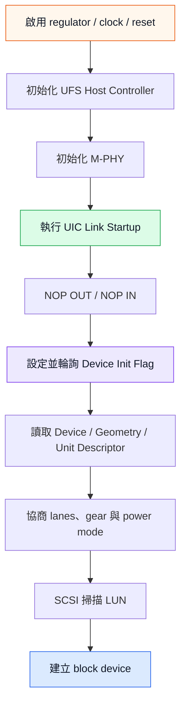

### 8.1 各階段代表的證據

| 觀察結果 | 可以證明 | 仍不能證明 |
| :--- | :--- | :--- |
| UFSHCI MMIO 可讀 | Host register path 基本可用 | Device 已上電或 link 已建立 |
| Link Startup 成功 | UniPro / M-PHY 已完成基本 link establishment | UFS Device 初始化與 LUN I/O 一定成功 |
| NOP IN 收到 | Device 能處理基本 UPIU | Descriptor、SCSI I/O 與所有 LUN 正常 |
| Descriptor 可讀 | Query path 與部分裝置管理功能正常 | Read / Write data path 正常 |
| SCSI disk 建立 | LUN 掃描與基本 SCSI path 成功 | 壓力測試、休眠喚醒與錯誤復原均正常 |

---

## 9. 一筆 Read I/O 的完整流程

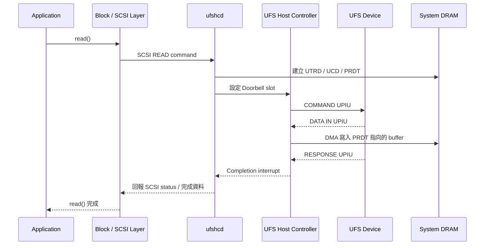

### 9.1 SCSI、UPIU 與資料傳輸的分工

UFS 使用 SCSI CDB 描述儲存操作，再由 UPIU、UTP、UniPro 與 M-PHY 完成命令、資料與狀態的傳送：

| 階段 | UFS 傳輸單位 | 內容 |
| :--- | :--- | :--- |
| 命令 | COMMAND UPIU | SCSI `READ(10)` CDB、LUN、Task Tag、Expected Data Transfer Length |
| 讀取資料 | DATA IN UPIU | Device 從儲存媒體取得的實際 payload |
| 完成狀態 | RESPONSE UPIU | UFS response、SCSI status 與必要的 sense information |

Read data path 的關鍵是：

- SCSI CDB 指定 LBA 與 transfer length。
- PRDT 描述 Host DRAM 中接收資料的位置。
- Device 回傳 DATA IN 與 RESPONSE UPIU。
- Host Controller DMA 寫入 buffer，Driver 再將完成狀態交還上層。

一筆 `READ(10)` 可以回傳多個 DATA IN UPIU。這些 UPIU 使用相同 Task Tag，並以 Data Offset / Length 組成完整資料；最後的 RESPONSE UPIU 回報命令完成狀態。

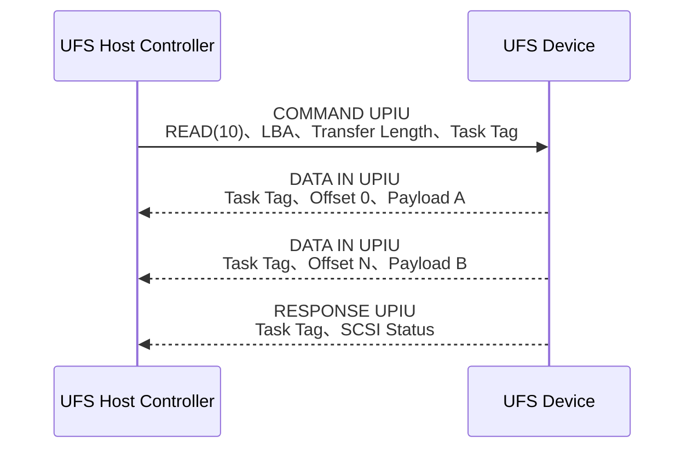

### 9.2 Device 收到 READ(10) 後的工作

UFS Device 以 COMMAND UPIU 作為命令入口。Device Controller 解析 LUN、Task Tag 與 SCSI CDB，建立內部 command context，再依裝置資源與 task attribute 排程儲存操作。

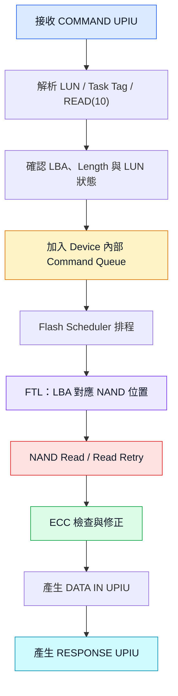

Device 端主要負責：

- UPIU 與 SCSI CDB 解析。
- LUN、LBA、transfer length 與存取條件確認。
- Device 內部 command queue 與 flash scheduler。
- FTL mapping、NAND channel / die / plane 排程。
- ECC、read retry、bad block 與 Device cache 管理。
- DATA IN UPIU、RESPONSE UPIU、SCSI status 與 sense data 的產生。

多筆 COMMAND UPIU 可在 Device 端形成多個 command context。Device 依 task attribute、LUN 狀態與 NAND 資源安排執行順序，再利用 Task Tag 讓 Host 將 DATA / RESPONSE 配回正確 request。

### 9.3 Host Controller 與 Device 的資料交接

UFS Device 將讀取內容放入 DATA IN UPIU，經 UniPro / M-PHY 傳到 Host Controller；Host Controller 再依 PRDT 將資料 DMA 寫入 System DRAM：

> **NAND → Device Controller → DATA IN UPIU → UniPro / M-PHY → UFS Host Controller → DMA → System DRAM**

這條路徑提供清楚的責任分工：

| 元件 | READ data path 的主要工作 |
| :--- | :--- |
| UFS Device | 從 NAND 取得資料並產生 DATA IN / RESPONSE UPIU |
| UFS Host Controller | 接收 UPIU，依 PRDT 在 UFS link 與 System DRAM 之間搬移資料 |
| `ufshcd` | 建立 request、提交 Doorbell、處理完成狀態並交回 SCSI layer |

若命令已收到 Response，而 buffer 內容未更新，可沿著 Response status、DATA IN、PRDT address / length、DMA mapping 與 cache coherency 逐層確認。

### 9.4 Trace 中會看到什麼

不同 trace 位置呈現不同層級的證據：

| Trace 類型 | 常見內容 |
| :--- | :--- |
| UFS Protocol Analyzer | COMMAND UPIU、DATA IN / OUT UPIU、RESPONSE UPIU 與 payload |
| M-PHY / UniPro Analyzer | Link frame 與重組後的 UPIU，視 decoder 能力顯示 payload |
| Kernel UFS tracepoint | CDB、UPIU header、Task Tag、狀態與時序；資料完整度依 tracepoint 而定 |
| UFSHCI register dump | Doorbell、Interrupt、Controller status 與 error register |
| UTRD / UCD / PRDT dump | Request descriptor、UPIU 與 DMA buffer 描述 |
| DRAM / AXI trace | Host Controller 的 DMA transaction 與資料內容 |

Protocol Analyzer 可能把 COMMAND、DATA IN 與 RESPONSE 重組後統稱為一筆 `READ(10)` transaction。協定層級上，`READ(10)` CDB 位於 COMMAND UPIU，實際讀取 payload 位於後續 DATA IN UPIU。

---

## 10. 中斷、完成與錯誤處理

### 10.1 完成資訊來源

| 來源 | 觀察重點 |
| :--- | :--- |
| Interrupt Status | Transfer completion、task management、UIC command、fatal error |
| Doorbell | 哪些 request slot 尚未完成 |
| UTRD OCS | Host Controller / transport 層的 overall command status |
| Response UPIU | UFS response、SCSI status、sense information |
| UIC Error Registers | Data Link、Network、Transport、DME 等 interconnect error |

同一筆 I/O 可能同時留下多層狀態。分析時應從 Host interrupt 往下追到 OCS、Response UPIU，再視需要查看 sense data 與 UIC error。

### 10.2 常見復原層級

由局部到全面通常包括：

1. Abort 單一 task。
2. 對特定 LUN 執行 reset。
3. 重設 Host Controller / 重建 link。
4. 重新初始化 Device。
5. 平台層 power cycle。

應依錯誤層級選擇復原方式；對所有 timeout 直接 power cycle 會掩蓋真正的 failure boundary。

---

## 11. 電源管理與效能

UFS 的功耗管理同時涉及 Device state 與 Link state。

| 面向 | 例子 | 影響 |
| :--- | :--- | :--- |
| Device power mode | Active、Sleep、PowerDown | Device 內部功能與喚醒延遲 |
| Link state | Active、Hibern8、Off | UniPro / M-PHY link 功耗與恢復時間 |
| Link power mode | PWM、High-Speed mode | 頻寬、功耗、訊號要求 |
| Link capability | Gear、lane 數、HS Rate Series（A / B） | 最大傳輸率與相容設定 |

### 11.1 Hibern8

Hibern8 是 M-PHY link 的低功耗狀態。Auto-Hibern8 可讓 Host Controller 在閒置一段時間後自動進入 Hibern8，以降低功耗，但也會增加下一筆 I/O 的喚醒延遲。

### 11.2 Gear 與 Lane

理解 UFS link speed 時，必須把 **Gear** 與 **Lane** 分開看：

| 名詞 | 意義 | 直觀理解 |
| :--- | :--- | :--- |
| Gear | 單一 Lane 的傳輸速度等級 | 每條車道的速限 |
| Lane | 可平行傳輸的實體資料通道 | 高速公路的車道數 |
| Rate A / B | 同一個 HS Gear 的兩種 line rate series | 相同檔位下的兩組速率；Rate B 通常稍快 |

因此，**Gear 決定每條 Lane 有多快，Lane 數決定能同時使用幾條通道**。較高 Gear 或更多 active lane 都能增加總頻寬，但它們代表不同的硬體條件，不能只看其中一項。

#### 11.2.1 TX Lane 與 RX Lane

UFS 使用獨立的 TX 與 RX sub-link：

- **TX Lane**：從目前觀察端送出資料。
- **RX Lane**：由目前觀察端接收資料。
- 對 Host 而言，TX 是 Host → Device，RX 是 Device → Host。
- UFS 可同時在兩個方向傳輸，因此屬於 full-duplex link。

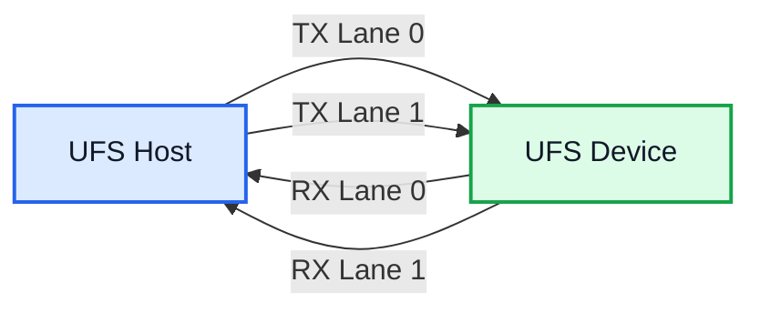

規格或 log 中的 `x2 Lane` 通常表示**每個方向使用 2 條 Lane**，也就是 Host TX 有 2 條、Host RX 也有 2 條，不是將 TX 與 RX 合計成 2 條。

#### 11.2.2 Gear 代表單一 Lane 的速度

M-PHY HS gear 的每 lane 原始速率（Rate B）與對應的 UFS 版本大致如下：

| HS Gear | 每 lane 速率（Rate B） | 主要出現於 |
| :--- | :--- | :--- |
| HS-G1 | 約 1.46 Gbps | UFS 1.x |
| HS-G2 | 約 2.92 Gbps | UFS 1.x |
| HS-G3 | 約 5.83 Gbps | UFS 2.0 / 2.1 / 2.2 |
| HS-G4 | 約 11.6 Gbps | UFS 3.0 / 3.1 |
| HS-G5 | 約 23.2 Gbps | UFS 4.0 / 4.1 |

表中的數值是**單一方向、單一 Lane 的原始線速**。例如 HS-G4 代表每條 active Lane 約可傳送 `11.6 Gbps`，並不代表整條 UFS link 的總頻寬固定是 `11.6 Gbps`。

#### 11.2.3 Gear 與 Lane 的速率計算

單一方向的原始速率可用下式估算：

> **單方向原始速率 = 每條 Lane 的速率 × Active Lane 數**

以 `HS-G4 × 2 Lane` 為例：

```text
11.6 Gbps/Lane × 2 Lanes = 23.2 Gbps
23.2 Gbps ÷ 8 ≈ 2.9 GB/s
```

`2.9 GB/s` 仍是尚未扣除 line encoding、UniPro、UPIU、flow control 與其他協定負擔的換算結果，不能直接當成 `dd` 或 `fio` 應量到的速度。

常見組合比較如下：

| Link 設定 | 計算方式 | 單方向原始速率 |
| :--- | :---: | ---: |
| HS-G3 × 1 Lane | `5.83 × 1` | 約 5.83 Gbps |
| HS-G3 × 2 Lanes | `5.83 × 2` | 約 11.66 Gbps |
| HS-G4 × 1 Lane | `11.66 × 1` | 約 11.66 Gbps |
| HS-G4 × 2 Lanes | `11.66 × 2` | 約 23.32 Gbps |
| HS-G5 × 2 Lanes | `23.32 × 2` | 約 46.64 Gbps |

由此可看出，`HS-G3 × 2 Lanes` 與 `HS-G4 × 1 Lane` 的原始頻寬接近，但兩者使用的 Gear、PHY 條件、Lane 數與功耗策略不同，不能只因頻寬相近就視為相同設定。

#### 11.2.4 如何判讀實際協商結果

若 kernel log 或 debug register 顯示：

```text
Gear RX: 4
Gear TX: 4
Lane RX: 2
Lane TX: 2
Rate: B
```

可以解讀為：

- Host → Device 使用 HS-G4、2 條 TX Lane。
- Device → Host 使用 HS-G4、2 條 RX Lane。
- 兩個方向都使用 Rate B。
- 每個方向的原始速率約為 `11.66 × 2 = 23.32 Gbps`。

TX 與 RX 的 Gear 或 Lane 數在協定上是分開描述的，分析 trace 或 register 時應分別記錄，不能用單一「目前是 Gear 4」概括整條 link。

#### 11.2.5 Bring-up 與效能判斷

較高 Gear 或更多 active lane 必須同時受到 Host、Device、PHY、clock 與板級訊號品質支援。Bring-up 初期可先使用雙方共同支援的保守模式建立穩定 link，再逐步切換到目標 Gear、Lane 數與 Rate Series。

實務上可根據實際協商到的 Gear 與 Lane 數推估 link 上限；若量測值遠低於此，需一併檢查：

- 實際協商到的 TX / RX Gear 與 active Lane 數。
- Rate A / B 與 PWM / High-Speed mode。
- Link error、NAC、replay 或降速情況。
- Queue depth、I/O size 與 read/write workload。
- Host Controller、DMA 與 driver 行為。
- Device 內部效能、WriteBooster 與 thermal throttling。

Rate A 與 Rate B 的差別在於參考頻率不同，Rate B 略快，兩端必須支援同一組設定才能協商成功。

### 11.3 WriteBooster

較新 UFS 裝置可能提供 WriteBooster，以快取策略改善寫入效能。它涉及裝置能力、buffer 狀態、flush 與生命週期管理，不能只以短時間 benchmark 判斷長期穩態效能。

### 11.4 Clock Scaling

Linux `ufshcd` 支援以 devfreq 為基礎的 dynamic clock scaling：在負載低時降低 controller clock 並把 link 切到較低 gear，負載升高時再切回去。這對功耗有幫助，但也帶來三個除錯上的影響：

- **Clock scaling 與 Hibern8 是相關但不同的流程**：若 scaling 同時改變 gear，driver 會執行 power mode change；upstream `ufshcd` 在 scaling 期間會避免 link 進入低功耗狀態，因此不能把每次 scaling 都描述成必然經過 Hibern8 enter / exit。若 PHY 設定或 quirk 不完整，問題仍可能只在 clock / gear 切換瞬間出現。
- **問題具有負載相依性**：輕度 I/O 一切正常、壓力測試才失敗，很可能是 scaling 邊界而不是資料路徑本身。這也是第 14.6 節症狀表把 clock scaling 列為壓測失敗優先檢查項的原因。
- **效能量測會被干擾**：同一組 `dd` 或 `fio` 參數在不同起始 gear 下結果可能不同。

除錯時可先暫時關閉 clock scaling，把變因固定下來：

先尋找目前 kernel 實際提供的節點：

```bash
find /sys/bus/platform/devices -path '*.ufs/clkscale_enable' -print 2>/dev/null
find /sys/bus/platform/drivers/ufshcd -name clkscale_enable -print 2>/dev/null
```

Upstream ABI 的常見位置如下；將 `<controller>.ufs` 替換成實際節點後再操作：

```bash
cat /sys/bus/platform/devices/<controller>.ufs/clkscale_enable
echo 0 > /sys/bus/platform/devices/<controller>.ufs/clkscale_enable
```

`clkscale_enable` 是較新的 upstream ABI，舊版或 vendor kernel 可能沒有此節點，也可能使用不同路徑。

若關閉後壓力測試就穩定，代表問題落在 gear 切換或 power mode change 流程，而不是一般 I/O 路徑。同理，`auto_hibern8` 也可以先關掉以排除 Hibern8 exit 的影響。

---

## 12. Linux 軟體堆疊

Linux 的核心 UFS Host Controller Driver 通常稱為 `ufshcd`，它作為 SCSI low-level driver，負責：

- 初始化 UFS Controller 與 link。
- 將 SCSI command 組成 UPIU 與 UTP descriptor。
- 管理 DMA、request slot、doorbell 與 completion。
- 執行 Query Request 與 UIC command。
- 處理 runtime / system power management。
- 處理 timeout、task abort、host reset 與錯誤復原。

平台通常還有 variant driver，用來處理 SoC 特有的 clock、reset、regulator、PHY、quirk 與 power change sequence。

### 12.1 原始碼位置

這裡有一個查資料時常踩的坑：**Linux 6.0 起 UFS 已從 `drivers/scsi/ufs/` 搬到 `drivers/ufs/`**。舊教學、舊 commit 與舊的 `MAINTAINERS` 條目給的路徑在新 kernel 上都找不到。

| 路徑 | 內容 |
| :--- | :--- |
| `drivers/ufs/core/` | 核心驅動，`ufshcd.c`、`ufs-sysfs.c`、`ufs_bsg.c`、`ufshcd-crypto.c` 等 |
| `drivers/ufs/host/` | 各 SoC 的 variant driver 與 PCI glue |
| `Documentation/devicetree/bindings/ufs/` | UFS Device Tree binding |
| `include/ufs/` | `ufshcd.h`、`ufs.h`、`ufshci.h` 等對外標頭檔 |
| `Documentation/ABI/testing/sysfs-driver-ufs` | sysfs 節點的權威清單 |

最後一項特別值得先讀：它逐項列出 `ufshcd` 匯出的 sysfs attribute（Descriptor、Attribute、Flag、health、WriteBooster、power management 等）與其意義，比在 `/sys` 底下亂撈可靠得多。

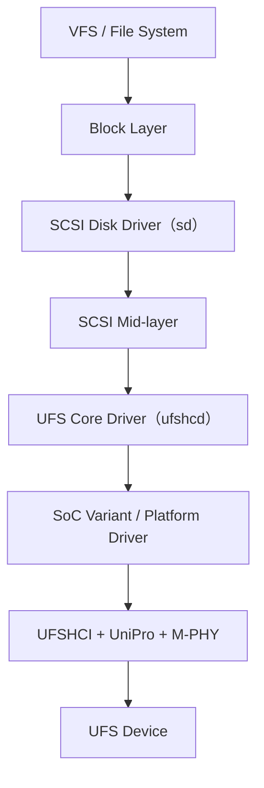

> Linux kernel 的 UFS 文件將 UFSHCD 描述為 SCSI Framework 下的 low-level driver；實際平台可能是 platform bus、PCIe 或其他整合方式，不能假設所有 UFS Host Controller 都以相同 bus 枚舉。

---

## 13. Linux 驗證指令

### 13.1 確認 kernel log

```bash
dmesg | grep -iE 'ufs|ufshcd|scsi'
journalctl -k | grep -iE 'ufs|ufshcd|scsi'
```

先觀察：

- Host Controller probe 是否成功。
- Link Startup 是否成功。
- Device initialization 是否 timeout。
- Power mode change 是否失敗。
- 是否出現 UIC、fatal、abort 或 reset 訊息。
- SCSI LUN 與 block device 是否建立。

### 13.2 查看 SCSI 與 block device

```bash
lsblk -o NAME,MAJ:MIN,SIZE,RO,TYPE,MODEL,SERIAL
lsscsi -g
cat /proc/scsi/scsi
```

若系統沒有 `lsscsi`，仍可從 `lsblk`、`/sys/class/scsi_device/` 與 kernel log 取得基本資訊。

### 13.3 查看 sysfs

```bash
find /sys -maxdepth 8 -path '*ufs*' 2>/dev/null
find -L /sys/class/scsi_host/ -maxdepth 2 -type f 2>/dev/null
```

兩個容易寫錯的地方：`-maxdepth` 是 global option，必須放在 `-path` 這類測試條件**之前**，否則 GNU find 會發出警告；而 `/sys/class/scsi_host/hostN` 是 symlink，不加 `-L` 的話 find 不會跟進去，`-type f` 會得到空結果。

實際節點會隨 kernel 版本、controller bus 與 driver 設定改變。常見資訊包含 Device Descriptor、health、power management、capability 與 WriteBooster 狀態，完整清單見 `Documentation/ABI/testing/sysfs-driver-ufs`。

### 13.4 基本讀寫測試

先確認目標裝置與分割區，再執行非破壞性的讀取測試：

```bash
blockdev --getsize64 /dev/<device>
dd if=/dev/<device> of=/dev/null bs=1M count=64 iflag=direct status=progress
```

`iflag=direct` 會繞過 page cache。不加的話重複執行會讀到快取，數字會失真到沒有參考價值。

寫入測試會破壞資料，應使用專用測試分割區或檔案系統中的測試檔，不要直接對未知的 raw device 寫入。

### 13.5 效能觀察

```bash
iostat -xz 1
cat /sys/block/<device>/queue/nr_requests
cat /sys/block/<device>/device/queue_depth
```

效能結果需連同 I/O size、queue depth、read/write ratio、cache / WriteBooster、溫度與測試時間一起記錄。

### 13.6 用 sg3_utils 驗 SCSI 路徑

`dmesg` 與 `lsblk` 只能看到結果，`sg3_utils` 可以主動下 SCSI command，用來確認第 14.5 節的資料路徑：

```bash
sg_turs -v /dev/<device>          # Test Unit Ready，最輕量的存活確認
sg_inq /dev/<device>              # INQUIRY，取得 vendor / product / 版本
sg_readcap -l /dev/<device>       # READ CAPACITY，確認容量與 block size
sg_vpd -a /dev/<device>           # 所有 VPD page，含 device identification
sg_logs -a /dev/<device>          # Log page，部分裝置提供健康與錯誤統計
sg_luns /dev/<device>             # REPORT LUNS，直接問 Device 有哪些 LUN
```

`sg_turs -v` 特別適合當第一步：它幾乎不搬資料，若它失敗但 link 是好的，問題就縮小到 UTP / UPIU 或 Device 狀態，而不是 DMA 資料路徑。`sg_luns` 則能直接驗證「Descriptor 可讀但 LUN 不出現」這個症狀究竟是 Device 沒回報，還是 Linux 沒掃到。

### 13.7 用 ufs-utils 存取 Descriptor / Attribute / Flag

第 6.2 與 7.2 節講的 Query Request 路徑，在 userspace 有對應的操作方式。`ufshcd` 會匯出一個 bsg 節點：

```bash
ls /dev/bsg/ | grep -i ufs        # 常見為 ufs-bsg0
ls -l /dev/ufs-bsg* 2>/dev/null   # 部分 udev 設定會建立這個名稱
```

節點名稱依 kernel 版本與 udev 規則而異，`/dev/bsg/ufs-bsg0` 與 `/dev/ufs-bsg` 都可能出現，使用前先確認實際路徑。

Western Digital / SanDisk 維護的開源工具 **`ufs-utils`**（GPL-2.0，<https://github.com/westerndigitalcorporation/ufs-utils>）透過這個節點下 Query Request 與 UPIU，主要子命令包括：

| 子命令 | 用途 |
| :--- | :--- |
| `desc` | 讀寫 Descriptor（Device、Geometry、Unit、Configuration 等） |
| `attr` | 讀寫 Attribute |
| `fl` | 讀寫 Flag |
| `uic` | 下 UIC command |
| `err_hist` | 讀取 Device 端錯誤歷史 |
| `rpmb` / `arpmb` | RPMB 相關操作 |
| `ffu` | Field Firmware Update |
| `vendor` | 廠商自訂命令 |

實際參數格式依工具版本而異，使用前先看 `ufs-utils --help` 與各子命令的 help。

> **注意**：Query Request 中有一部分是**可寫**的，例如 provisioning 相關的 Configuration Descriptor 與 `bConfigDescrLock`。一旦鎖定或寫錯 LUN 配置，通常無法還原。在未確認語意之前，只做讀取操作。

三條控制路徑對應的工具整理如下，可與第 6.2 節對照：

| 控制路徑 | 驗證方式 |
| :--- | :--- |
| SCSI Command | `sg3_utils`、一般 block I/O |
| Query Request | `ufs-utils desc / attr / fl`、部分 sysfs 節點 |
| UIC Command | `ufs-utils uic`；另可靠 kernel log 與 UIC error register 觀察 |

`ufs-utils` 另外還有 `err_hist`（讀 Device 端錯誤歷史）、`ffu`（韌體更新）與 `hmr`（Host Manual Refresh）等子命令，其中 `err_hist` 在間歇性錯誤的分析上很有用。

---

## 14. Bring-up 與除錯順序

建議依序確認，避免把不同層級的現象混在一起：

### 14.1 第一層：Platform 資源

- Regulator 是否啟用且電壓穩定。
- Reference clock、controller clock 與 PHY clock 是否存在。
- Reset polarity、assert / deassert 時序是否正確。
- Pinmux、lane mapping 與 Device Tree 資源是否吻合。

### 14.2 第二層：Host Controller

- MMIO base 與 register access 是否正常。
- Host Controller Enable 是否完成。
- UTRL / UTMRL base address 與 alignment 是否正確。
- DMA address width、IOMMU 與 cache coherency 是否一致。

### 14.3 第三層：M-PHY / UniPro Link

- Link Startup 成功或 timeout。
- TX / RX lane 數與 gear 是否為雙方共同能力。
- UIC command result 與 UIC error register。
- Hibern8 enter / exit 是否穩定。

### 14.4 第四層：UFS Device 初始化

- NOP OUT / IN 是否成功。
- Device Init Flag 是否能完成。
- Descriptor / Attribute / Flag 是否可讀。
- `bRefClkFreq` 是否與板子實際供給的 reference clock 一致。
- Power mode change 是否成功。

### 14.5 第五層：SCSI 與資料路徑

- LUN 是否被掃描。
- SCSI status、sense key / ASC / ASCQ。
- UTRD OCS 與 Response UPIU。
- PRDT address、length、DMA direction 與 cache coherency。
- 單筆 I/O 正常後，再逐步提高 queue depth 與壓力。

### 14.6 症狀對照

| 症狀 | 優先檢查 |
| :--- | :--- |
| UFSHCI register 讀值全為固定值或 bus error | clock、reset、MMIO mapping、power domain |
| Link Startup timeout | UFS Device power/reset、M-PHY、lane、clock、PHY calibration |
| Link 成功但 NOP timeout | UTP / UPIU path、Device 狀態、interrupt、descriptor DMA |
| Descriptor 可讀但 LUN 不出現 | Unit configuration、SCSI scan、Report LUNs、Device init |
| Doorbell 長時間不清 | interrupt、UTRD/UCD、DMA、Response UPIU、UIC error（MCQ 模式下改看 SQ / CQ 指標） |
| 小量 I/O 正常、壓力測試失敗 | queue/slot 管理、DMA scatter-gather、clock scaling、power transition、thermal；可先關 `clkscale_enable` 與 `auto_hibern8` 固定變因 |
| Link 起得來但高 gear 不穩 | `bRefClkFreq` 與實際時脈是否一致、Rate A/B 設定、板級訊號品質 |
| Resume 後失敗 | regulator/clock restore、PHY state、Hibern8 exit、重新初始化順序 |

---

## 15. 常見誤解

### 15.1 UFS 就是更快的 eMMC

兩者都整合 NAND 與 controller，但 Host interface、PHY、協定與 driver 架構不同，不能只視為速度不同。

### 15.2 UFS 使用 SCSI，所以線路也是 SCSI bus

UFS 使用 SCSI command set 表達儲存操作，底層則是 UPIU、UTP、UniPro 與 M-PHY。

### 15.3 Doorbell 清除就代表資料一定正確

Doorbell 清除代表 request 已離開 outstanding 狀態。仍需檢查 OCS、Response UPIU、SCSI status、sense data 與 DMA buffer。

### 15.4 Link Startup 成功就代表檔案系統可以掛載

Link Startup 只證明 interconnect 已建立。後續仍有 Device initialization、Descriptor、LUN scan、SCSI I/O、partition 與 file system 等階段。

### 15.5 PRDT 內存放傳輸資料

PRDT 存放的是資料 buffer 的 DMA 描述；payload 位於它指向的記憶體。

### 15.6 UFS 永遠只有 32 個 outstanding command

那是 SDB 模式的限制。UFSHCI 4.0 的 MCQ 以多組 SQ / CQ 取代單一 UTRD list，深度不再受 32 限制，doorbell 的觀察方式也不同。

### 15.7 UFS driver 在 `drivers/scsi/ufs/`

Linux 6.0 起已搬到 `drivers/ufs/`，標頭檔則在 `include/ufs/`。舊文件與舊 commit 給的路徑在新 kernel 上不存在。

---

## 16. 重點總結

1. UFS 是整合式快閃儲存介面，Host 以 SCSI command 操作邏輯區塊。
2. 資料路徑由 UFS / UPIU、UTP、UniPro 與 M-PHY 多層組成。
3. UFSHCI 透過 UTRD、UCD、PRDT 與 doorbell 管理 DMA request；UTRD 的 OCS 是硬體回寫的第一手結果。
4. UFSHCI 3.x 的 SDB 為 32 slot 單 doorbell，UFSHCI 4.0 的 MCQ 改為多組 SQ / CQ，除錯方式不同。
5. Query Request、SCSI Command 與 UIC Command 屬於不同控制層級，對應的驗證工具也不同。
6. Link 成功、Device 初始化成功與 block I/O 成功是三個不同的證據點。
7. Linux `ufshcd` 位於 SCSI mid-layer 與 UFS Host Controller 之間，原始碼自 6.0 起位於 `drivers/ufs/`。
8. Bring-up 應依 Platform、HCI、M-PHY / UniPro、Device、SCSI / DMA 的順序定位。

---

## 參考資料

- [Linux Kernel Documentation — Universal Flash Storage](https://docs.kernel.org/scsi/ufs.html)
- [Linux Kernel — `Documentation/ABI/testing/sysfs-driver-ufs`](https://github.com/torvalds/linux/blob/master/Documentation/ABI/testing/sysfs-driver-ufs)（sysfs 節點權威清單）
- [Linux Kernel — `drivers/ufs/`](https://github.com/torvalds/linux/tree/master/drivers/ufs)（6.0 起的 UFS 驅動位置）
- [Linux Kernel — UFS Device Tree bindings](https://github.com/torvalds/linux/tree/master/Documentation/devicetree/bindings/ufs)
- [ufs-utils — userspace UFS 操作工具（Western Digital / SanDisk，GPL-2.0）](https://github.com/westerndigitalcorporation/ufs-utils)
- [sg3_utils](https://sg.danny.cz/sg/sg3_utils.html)
- [MIPI Alliance — UniPro](https://www.mipi.org/specifications/unipro-specifications)
- [MIPI Alliance — M-PHY](https://www.mipi.org/specifications/m-phy)
- [MIPI Alliance — M-PHY Version History Table](https://www.mipi.org/hubfs/Specification-Feature-Tables/MIPI-M-PHY-Version-History-Table-7-Oct-2025.pdf)
- JEDEC UFS Device、UFSHCI 與相關規格文件（完整規格內容依 JEDEC 授權版本為準）
