# AHCI 基本知識與 PCIe RC 驗證筆記

> 使用情境：主機平台作為 PCIe Root Complex（RC），外接一張 PCIe AHCI SATA Controller Card，透過 OpenBMC / Linux 驗證 PCIe、AHCI、DMA、中斷與 SATA 裝置存取。

---

## 1. AHCI 是什麼

AHCI（Advanced Host Controller Interface）是 SATA Host Controller 的標準化軟體介面。

它定義：

- Host 如何透過 MMIO Register 控制 SATA Controller
- Command List、Command Table、PRDT 等 DMA 資料結構
- SATA FIS 的收發方式
- Port 狀態、中斷與錯誤處理
- NCQ（Native Command Queuing）等進階功能

AHCI 解決的是：

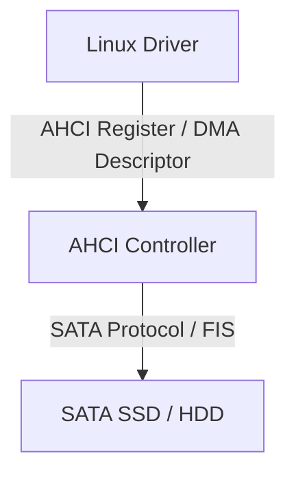

其範圍止於 Host Controller 的軟體控制；SATA 實體層則由 Controller 與裝置端負責。

---

## 2. AHCI、SATA、SCSI 的關係

在 Linux 裡，典型軟體路徑如下：

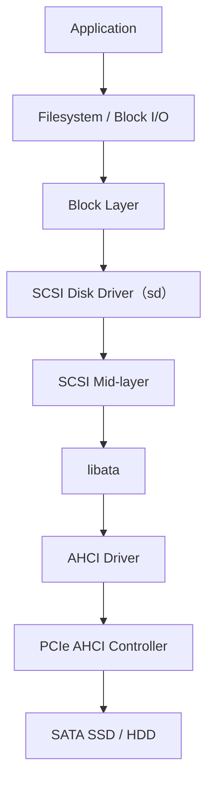

因此 SATA SSD 最後通常會顯示為 `/dev/sda`、`/dev/sdb` 等 Block Device。

雖然底層是 SATA，Linux 仍會透過 SCSI mid-layer 呈現磁碟裝置。

---

## 3. PCIe RC 驗證架構

本次目標架構：

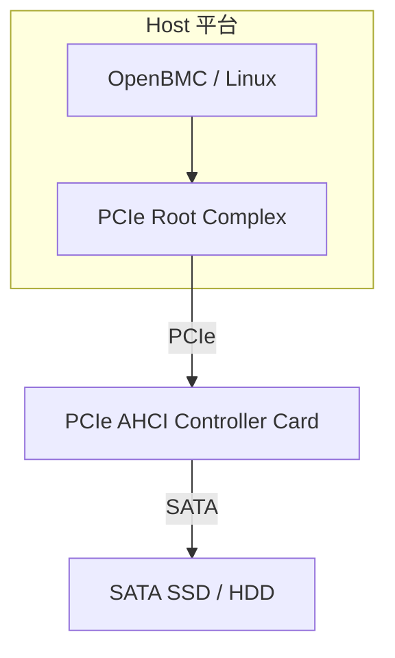

測試會同時經過：

1. PCIe Link Training
2. PCIe Enumeration
3. BAR 配置與 MMIO
4. AHCI Controller 初始化
5. Interrupt
6. Endpoint DMA 存取 Host DRAM
7. SATA Link Training
8. ATA Command
9. Linux Block Device 建立

AHCI 卡的驗證範圍雖然超出純 PCIe 測試，卻很適合用來檢查完整資料路徑。

---

## 4. PCIe AHCI Device 的基本特徵

標準 PCIe AHCI Controller 通常使用：

| 欄位 | 數值 | 意義 |
|---|---:|---|
| Base Class | `0x01` | Mass Storage Controller |
| Sub-Class | `0x06` | SATA Controller |
| Prog IF | `0x01` | AHCI |

完整 Class Code 為 `0x010601`。

Linux `lspci` 常見顯示：

```text
SATA controller: Vendor Device (rev xx)
```

查看方式：

```bash
lspci -nn
lspci -nnk
lspci -vv -s <BDF>
```

預期看到：

```text
Class 0106
Kernel driver in use: ahci
Kernel modules: ahci
```

---

## 5. ABAR：AHCI 的 MMIO Register 空間

AHCI Controller 透過 PCI BAR 暴露 Register 空間。AHCI 規範將 **ABAR（AHCI Base Address Register）** 定義於 PCI BAR5，也就是 PCI Configuration Space 的 offset `0x24`；ABAR 存放 AHCI MMIO Register 空間的基底位址。

Linux 會從 PCI BAR 取得 MMIO base，然後存取 AHCI Register。

典型流程：

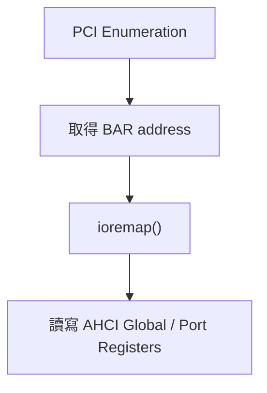

---

## 6. AHCI Register 架構

AHCI Register 可分成兩大類：

| AHCI MMIO 區域 | 用途 |
|---|---|
| Generic Host Control Registers | Controller 全域控制與狀態 |
| Port Registers | 各 SATA Port 的控制與狀態 |

### 6.1 Generic Host Control Registers

常見 Register：

| Register | 名稱 | 用途 |
|---|---|---|
| `CAP` | Host Capabilities | Controller 能力，例如 Port 數、NCQ、64-bit DMA |
| `GHC` | Global Host Control | AHCI Enable、Interrupt Enable、Controller Reset |
| `IS` | Interrupt Status | 各 Port 的中斷狀態 |
| `PI` | Ports Implemented | 哪些 Port 實際存在 |
| `VS` | AHCI Version | AHCI 規格版本 |
| `CCC_CTL` | Command Completion Coalescing | 中斷合併控制 |
| `CAP2` | Host Capabilities Extended | 額外能力 |
| `BOHC` | BIOS/OS Handoff Control | BIOS 與 OS 所有權交接 |

其中最常先看的是 `CAP`、`GHC`、`PI` 與 `VS`。

### 6.2 每個 Port 的 Registers

每個 SATA Port 都有一組獨立 Register。

常見 Register：

| Register | 名稱 | 用途 |
|---|---|---|
| `PxCLB` | Command List Base | Command List DMA address |
| `PxFB` | FIS Base | Received FIS DMA address |
| `PxIS` | Interrupt Status | Port 中斷狀態 |
| `PxIE` | Interrupt Enable | Port 中斷遮罩 |
| `PxCMD` | Command and Status | 啟動 Command Engine、FIS Receive |
| `PxTFD` | Task File Data | ATA Status/Error |
| `PxSIG` | Signature | 裝置類型辨識 |
| `PxSSTS` | SATA Status | SATA Link 狀態 |
| `PxSCTL` | SATA Control | COMRESET 等 Link 控制 |
| `PxSERR` | SATA Error | SATA 錯誤資訊 |
| `PxSACT` | SATA Active | NCQ command active bitmap |
| `PxCI` | Command Issue | NCQ 與非 NCQ 共用的 command issue bitmap |

---

## 7. Port 狀態判斷

### 7.1 `PxSSTS`

`PxSSTS` 可用來判斷 SATA Link 是否建立。

| 欄位 | 意義 |
|---|---|
| `DET` | Device Detection |
| `SPD` | Current Interface Speed |
| `IPM` | Interface Power Management |

常見 `DET`：

| DET | 意義 |
|---:|---|
| 0 | 沒偵測到裝置 |
| 1 | 偵測到裝置，但 PHY 未建立 |
| 3 | 裝置存在，PHY communication established |
| 4 | PHY offline |

一般希望看到 `DET = 3`。

### 7.2 `PxTFD`

`PxTFD` 反映 ATA Task File 狀態。

常見重要 bit 包括 `BSY`、`DRQ` 與 `ERR`。

如果初始化卡住，常見現象是 **`BSY` 一直不清**。

---

## 8. AHCI 的 DMA 資料結構

資料搬移主要由 Controller 透過 DMA 完成，CPU 負責準備命令與相關資料結構。

主要資料結構：

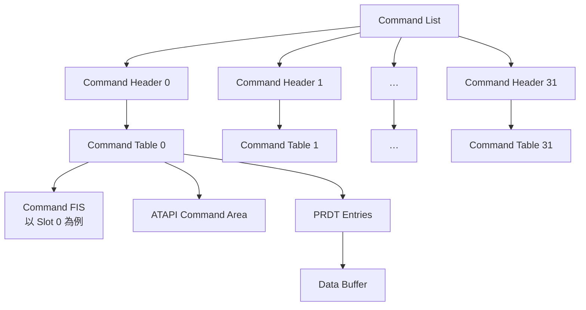

每個 Command Header 都透過 `CTBA/CTBAU` 指向該 Slot 使用的 Command Table；上圖展開 Slot 0 作為內容示例。

---

## 9. Command List

每個 Port 有一份 Command List。

Command List：

- 最多 32 個 Command Slot
- 每個 Slot 對應一個 Command Header
- `PxCLB/PxCLBU` 指向 Command List 的 DMA address

Command List 大小為 **32 slots × 32 bytes = 1024 bytes（1 KiB）**。

Command List 的 DMA 位址必須以 **1 KiB 對齊**。Controller 可使用的 Command Slot 數由 `CAP.NCS + 1` 決定，最多 32 個。

---

## 10. Command Header

每個 Command Header 固定為 **32 bytes（8 個 DWORD）**，是 Command List 中一個 Slot 的控制與狀態描述。Slot `n` 的 Header 位址為：

`Command Header address = PxCLB/PxCLBU + n × 0x20`

Command Header 不直接存放 ATA Command 或傳輸資料；它描述命令類型、資料方向與 PRDT 長度，並透過 `CTBA/CTBAU` 指向實際的 Command Table。

### 10.1 32-byte 版面

下表依 **Byte Offset 由低到高**排列；DW0 內的欄位名稱則依 **bit 31 到 bit 0**排列，與 10.2 節一致。

| Byte Offset | DWORD | 欄位 | 主要寫入者 | 用途 |
|---:|---:|---|---|---|
| `0x00` | DW0 | `PRDTL`、`PMP`、Reserved、`C`、`B`、`R`、`P`、`W`、`A`、`CFL` | Driver | 描述命令的格式、方向與 PRDT entry 數量 |
| `0x04` | DW1 | `PRDBC` | Driver 初始化、Controller 更新 | 記錄已成功傳輸的 byte 數 |
| `0x08` | DW2 | `CTBA` | Driver | Command Table DMA address 的低 32 bits |
| `0x0C` | DW3 | `CTBAU` | Driver | Command Table DMA address 的高 32 bits |
| `0x10`～`0x1F` | DW4～DW7 | Reserved | Driver 寫 `0` | 保留欄位 |

### 10.2 DW0：命令描述欄位

| Bits | 欄位 | 詳細意義 |
|---:|---|---|
| `31:16` | `PRDTL` | **PRDT Length**，單位是「PRDT Entry 數量」，不是 byte 數。`0` 代表此命令不傳輸資料；最大值 `0xFFFF` 代表 65,535 個 Entry。Controller 依此值決定要讀取多少個 PRDT Entry。 |
| `15:12` | `PMP` | **Port Multiplier Port**。直接連接 SATA Device 時填 `0`；經 Port Multiplier 時填目標下游 Port 編號。 |
| `11` | Reserved | 必須寫 `0`。 |
| `10` | `C` | **Clear Busy upon R_OK**。設為 `1` 時，Controller 在送出該 FIS 並收到 `R_OK` 後，會清除 `PxTFD.STS.BSY` 與該 Slot 的 `PxCI` bit。這是特殊流程控制欄位；軟體 Reset sequence 的第一個 Register FIS 會與 `R` bit 一起使用，一般資料命令不應任意設定。 |
| `9` | `B` | **BIST**。設為 `1` 代表 Command Table 中建立的是 BIST FIS，Controller 送出後進入測試模式；正常讀寫命令填 `0`。 |
| `8` | `R` | **Reset**。表示這個 FIS 是操作 Device Control Register `SRST` 的 Software Reset sequence 一部分。設為 `1` 時，Controller 必要時會先執行 SYNC escape，使 Device 進入 idle 狀態後再送出 FIS；正常讀寫命令填 `0`。 |
| `7` | `P` | **Prefetchable**。只有 `PRDTL != 0` 或 `A = 1` 時此 bit 才有效。`PRDTL != 0` 時允許 Controller 預取 PRDT；`A = 1` 時允許預取 ATAPI Command；若同時為寫入方向（`W = 1`），Controller 也可能預取 Data Buffer。這是提示，不保證硬體一定預取；`P = 0` 也不保證硬體不會預取。NCQ 命令與啟用 FIS-based Switching 的 Port Multiplier 情境不可設為 `1`。 |
| `6` | `W` | **Write direction**。`1`：System Memory → SATA Device；`0`：SATA Device → System Memory。也就是磁碟寫入設 `1`，磁碟讀取設 `0`。 |
| `5` | `A` | **ATAPI**。設為 `1` 時，Command Table 的 `ACMD` 區域包含 12-byte 或 16-byte ATAPI Command；一般 ATA 命令填 `0`。 |
| `4:0` | `CFL` | **Command FIS Length**，單位為 DWORD。合法長度為 2～16 DWORD；常見的 Register Host-to-Device FIS 為 20 bytes，因此填 `5`，不是填 `20`。 |

`W` 最容易看反。它以 **SATA Device 的操作方向**命名：Host 要把資料寫進 SSD 時，資料由記憶體流向 Device，所以 `W = 1`；Host 從 SSD 讀資料時，資料流向記憶體，所以 `W = 0`。

**Software Reset 前置條件：** Command List 中不應有其他命令。Driver 必須先清除 `PxCMD.ST`、等待 `PxCMD.CR = 0`，再重新設定 `PxCMD.ST`，並確認 `PxTFD.STS.BSY = 0`、`PxTFD.STS.DRQ = 0`。若 `BSY/DRQ` 仍無法清除，應嘗試 Port Reset，或在 Controller 支援時使用 `PxCMD.CLO`。

### 10.3 DW1：`PRDBC`

`PRDBC`（Physical Region Descriptor Byte Count）是 **Controller 回寫的傳輸進度／結果欄位**：

1. Driver 在發命令前必須將它初始化為 `0`。
2. Controller 在資料傳輸過程中更新已成功傳輸的 byte 數。
3. 對非 NCQ 命令，Controller 在清除對應的 `PxCI` bit 前，`PRDBC` 必須反映有效的最終傳輸量，可用來判斷 underflow。
4. 對 NCQ 命令，規範不要求 `PRDBC` 有效，不能依靠它判斷完成；應配合 `PxSACT`、Set Device Bits FIS 與錯誤狀態。
5. 若發生 overflow，`PRDBC` 不保證包含完整傳輸量，應檢查 `PxIS.OFS`。

因此，`PRDTL` 與 `PRDBC` 的角色不同：

| 欄位 | 性質 | 表示內容 |
|---|---|---|
| `PRDTL` | Driver 填寫的命令設定 | PRDT 有幾個 Entry |
| `PRDBC` | Controller 更新的執行狀態 | 實際成功傳輸多少 bytes |

### 10.4 DW2～DW3：`CTBA/CTBAU`

`CTBA/CTBAU` 合併後是 Command Table 的 64-bit DMA address：

`Command Table DMA address = (CTBAU << 32) | CTBA`

- `CTBA[6:0]` 為 Reserved，因此 Command Table 必須以 **128 bytes 對齊**。
- `CAP.S64A = 1` 時，`CTBAU` 才有效。
- 若 Controller 僅支援 32-bit DMA，`CTBAU` 應為 `0`，且 Command Table 必須配置在 4 GB 以下可存取的 DMA address。
- 這裡填的是 **DMA address**，不是 CPU virtual address。

### 10.5 填寫範例：4 KiB `READ DMA EXT`

假設命令使用一個 PRDT Entry、一般 Register H2D FIS、直接連接 SATA Device，且不啟用 Prefetch：

| 欄位 | 設定值 | 原因 |
|---|---:|---|
| `CFL` | `5` | Register H2D FIS 為 20 bytes，即 5 DWORD |
| `A` | `0` | 是 ATA，不是 ATAPI |
| `W` | `0` | 資料由 SSD 傳到 System Memory |
| `P/R/B/C` | `0` | 此範例不使用特殊控制功能 |
| `PMP` | `0` | Device 直接連接 |
| `PRDTL` | `1` | 使用一個 PRDT Entry |
| `PRDBC` | `0` | 發命令前由 Driver 清零 |
| `CTBA/CTBAU` | Command Table 的 DMA address | 必須 128-byte 對齊 |

在上述條件下，DW0 的值為 `0x00010005`。如果改成 4 KiB `WRITE DMA EXT`，其餘欄位不變，只將 `W` 設為 `1`，DW0 會成為 `0x00010045`。對應 PRDT Entry 的 `DBC` 填 `4095`，因為 `DBC` 是 zero-based byte count。

### 10.6 Driver 與 Controller 的責任邊界

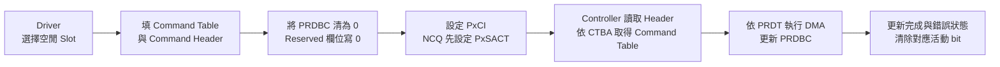

Driver 必須先確認該 Slot 在 `PxCI` 與 `PxSACT` 中都未被使用，再建立 Command Table 與 Command Header；所有 DMA 內容對 Controller 可見後，最後才設定 `PxCI`。命令送出後，不應在 Slot 仍活動時重複使用或改寫其 Header、Command Table 與 PRDT。

---

## 11. Command Table

Command Table 內含：

- Command FIS
- ATAPI Command Area
- Reserved Area
- PRDT Entries

Command Header 的 `CTBA/CTBAU` 指向 Command Table，其 DMA 位址必須以 **128 bytes 對齊**。

### Command FIS

Host 發送 ATA Command 時，通常會建立 **Register Host-to-Device FIS**。

其中包含：

- Command opcode
- LBA
- Sector count
- Device register
- Features

例如讀取命令可能使用 `READ DMA EXT` 或 `READ FPDMA QUEUED`。

---

## 12. PRDT

PRDT（Physical Region Descriptor Table）是 AHCI Controller 執行 DMA 時使用的 scatter-gather 描述表。它記錄資料 Buffer 的 DMA 位址與長度，本身不存放傳輸資料。

| PRDT Entry 欄位 | 用途 |
|---|---|
| `DBA` / `DBAU` | Data Buffer 的 64-bit DMA address；起始位址必須以 2 bytes 對齊 |
| `DBC` | 此 Entry 的傳輸長度，欄位值為實際 byte 數減 1 |
| `I` | Interrupt on Completion；完成此 Entry 後設定 `PxIS.DPS`，並在中斷條件成立時產生中斷 |

多個 PRDT Entry 可描述不連續的記憶體區域，Controller 會依序對各段 Buffer 搬移資料。單一 Entry 最多描述 **4 MiB**，資料長度必須是偶數 byte，因此 `DBC[0]` 必須為 `1`。例如傳輸 4096 bytes 時，`DBC` 應填入 `4095`。

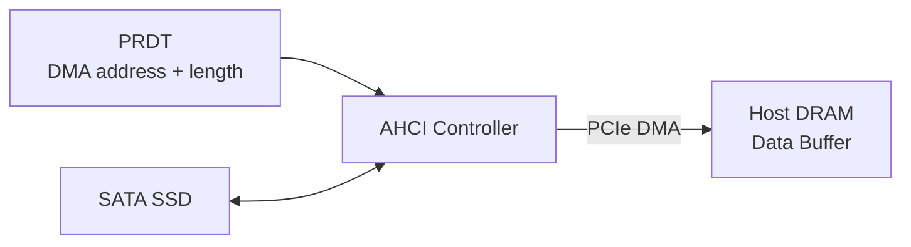

---

## 13. 32-bit 與 64-bit DMA

Controller 是否支援 64-bit DMA，通常可由 `CAP.S64A` 判斷。

若 AHCI Controller 只支援 32-bit DMA，**DMA address 必須低於 4 GB**。

否則可能發生：

- Command timeout
- Completion timeout
- 資料錯誤
- 完全沒有中斷
- Controller 卡死
- PCIe Unsupported Request

Linux driver 通常會設定 DMA mask，但前提是：

- 平台 DMA mapping 正確
- RC inbound mapping 正確
- DRAM address 可被 Endpoint 存取
- IOMMU / SMMU 設定正確

---

## 14. Command 執行流程

### 14.1 非 NCQ 命令

以下為非 NCQ 資料傳輸命令成功完成的簡化流程：

1. Driver 準備 Data Buffer。
2. Driver 建立 PRDT。
3. Driver 建立 Command FIS。
4. Driver 填寫 Command Table。
5. Driver 填寫 Command Header。
6. Driver 確保 DMA mapping 與資料結構的記憶體可見性就緒，再設定 `PxCI` 對應 bit。
7. AHCI Controller 讀取 Command List。
8. AHCI Controller 讀取 Command Table。
9. AHCI Controller 發送 SATA FIS。
10. SSD 執行 Command。
11. Controller 透過 DMA 搬移資料。
12. Controller 處理 Device 的完成狀態，清除 `PxCI` 對應 bit，並更新相關中斷狀態。
13. 在中斷啟用條件成立時，Controller 透過已配置的 INTx、MSI 或 MSI-X 模式通知 CPU。
14. Linux driver 檢查完成與錯誤狀態，完成 request。

### 14.2 NCQ 命令

NCQ 同樣使用 Command List、Command Table 與 PRDT，但發命令及完成判斷需配合 `PxSACT`：

1. Driver 準備命令與 DMA 資料結構，先設定 `PxSACT` 對應 bit，再設定 `PxCI` 對應 bit。
2. Controller 將命令送給 Device；Device 接受命令後，Controller 可清除 `PxCI` 對應 bit，此時命令仍可能等待執行或資料傳輸。
3. Device 完成命令後，透過 Set Device Bits FIS 回報；Controller 據此更新 `PxSACT` 與相關中斷狀態。
4. Linux driver 依 `PxSACT` 的變化及錯誤狀態判斷完成的命令。

**NCQ 的 `PxCI` bit 清除代表命令發送階段已結束；命令完成需配合 `PxSACT` 與錯誤狀態判斷。**

---

## 15. Port 初始化基本流程

簡化版 AHCI Port 初始化：

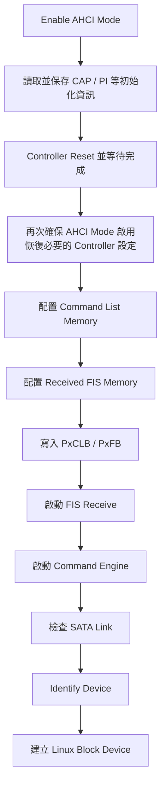

`PxCMD` 常見重要 bit：

| Bit | 意義 |
|---|---|
| `ST` | Start |
| `FRE` | FIS Receive Enable |
| `CR` | Command List Running |
| `FR` | FIS Receive Running |

停止 Command Engine 時通常不能直接亂清 bit，需要等 `CR/FR` 狀態正確改變。

---

## 16. Received FIS

`PxFB/PxFBU` 指向 Received FIS Buffer。

一般模式下，Received FIS Buffer 大小為 **256 bytes**，DMA 位址必須以 **256 bytes 對齊**。使用 FIS-based Switching 時，此區域為 **4 KiB**，位址也必須以 **4 KiB 對齊**。

Controller 會將 SATA Device 回傳的 FIS DMA 到此區域，例如：

- Register Device-to-Host FIS
- PIO Setup FIS
- DMA Setup FIS
- Set Device Bits FIS

這也是另一條 Endpoint DMA 寫入 Host DRAM 的路徑。

---

## 17. Interrupt

AHCI Controller 可使用：

- Legacy INTx
- MSI
- MSI-X

Bring-up 時建議先確認一種中斷模式穩定，再擴充驗證其他模式。

典型中斷路徑：

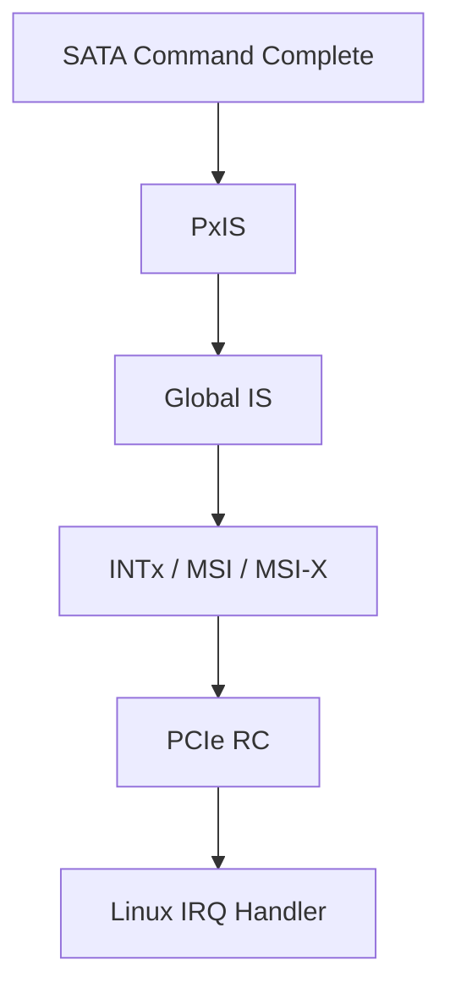

如果 polling 可工作、interrupt 模式不工作，問題大多在：

- MSI address / data routing
- INTx routing
- IRQ domain
- GIC mapping
- Port interrupt enable
- Global interrupt enable

---

## 18. NCQ

NCQ（Native Command Queuing）允許多筆 Command 同時 outstanding。

相關 Register 為 `PxSACT` 與 `PxCI`。

NCQ 的好處：

- 提高併發效能
- SSD/HDD 可重新排序 request
- 減少等待

但初期 bring-up 不需要先追求 NCQ。

建議優先順序：

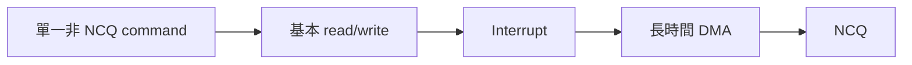

---

## 19. Linux AHCI Driver 架構

Linux kernel 主要路徑：

- `drivers/ata/ahci.c`
- `drivers/ata/libahci.c`
- `drivers/ata/libata-core.c`
- `drivers/ata/libata-scsi.c`
- `drivers/scsi/sd.c`

軟體堆疊：

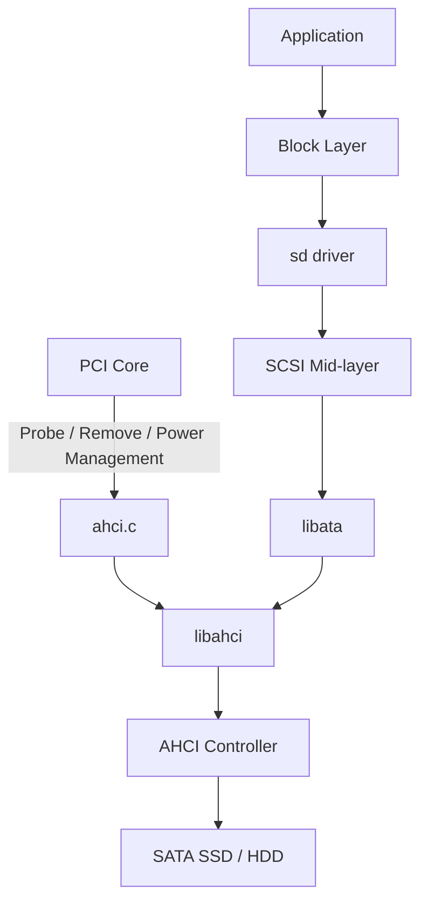

PCIe AHCI Controller 通常由 `drivers/ata/ahci.c` 接管。

---

## 20. OpenBMC Kernel Config

至少需要：

```config
CONFIG_PCI=y
CONFIG_ATA=y
CONFIG_SATA_AHCI=y
CONFIG_SCSI=y
CONFIG_BLK_DEV_SD=y
```

`CONFIG_ATA` 會選入 `CONFIG_SCSI`，`CONFIG_SATA_AHCI` 會選入內部符號 `CONFIG_SATA_HOST`；目前 Linux Kconfig 沒有 `CONFIG_SATA`。

可能還需要：

```config
CONFIG_PCI_MSI=y
CONFIG_SCSI_PROC_FS=y
CONFIG_DEVTMPFS=y
CONFIG_DEVTMPFS_MOUNT=y
```

若 AHCI 編成 module：

```config
CONFIG_SATA_AHCI=m
```

則 image 內需要 `ahci.ko` 與 `libahci.ko`。

檢查方式：

```bash
zcat /proc/config.gz | grep -E \
'^(CONFIG_(PCI|ATA|SATA_AHCI|SATA_HOST|SCSI|BLK_DEV_SD|PCI_MSI)=|# CONFIG_(PCI|ATA|SATA_AHCI|SATA_HOST|SCSI|BLK_DEV_SD|PCI_MSI) is not set$)'
```

---

## 21. 驗證階段建議

### 階段 1：PCIe Link

先確認：

```bash
lspci
```

如果完全看不到 AHCI 卡，先不要看 AHCI driver。

檢查：

- REFCLK
- PERST#
- Power
- LTSSM
- Lane width
- Link speed
- RC outbound config access
- Bus number 配置

---

### 階段 2：PCIe Enumeration

```bash
lspci -nn
lspci -vv -s <BDF>
```

確認：

- Vendor ID / Device ID 正確
- Class code 是 `0106`
- BAR 有配置
- Memory Enable
- Bus Master Enable
- Link status 正常

常見資訊：

```text
Control: I/O- Mem+ BusMaster+
```

---

### 階段 3：AHCI MMIO

先不接 SATA SSD，也應該能確認：

- Linux driver bind
- ABAR 可讀寫
- `CAP` 合理
- `VS` 合理
- `PI` 非零
- Port register 可讀
- Controller reset 不 timeout

檢查：

```bash
dmesg | grep -iE 'ahci|ata|sata|pci'
lspci -nnk
```

預期：

```text
Kernel driver in use: ahci
```

---

### 階段 4：SATA Link

接上 SATA SSD 後：

```bash
dmesg -w
```

預期：

```text
ata1: SATA link up
ata1.00: ATA-...
```

若是：

```text
SATA link down
```

可能問題：

- SATA power
- SATA cable
- SATA PHY
- COMRESET
- Controller clock/reset
- Port enable
- SSD 相容性

---

### 階段 5：Identify Device

成功後通常可看到：

```text
ata1.00: ATA-...
sd 0:0:0:0: [sda] ...
```

檢查：

```bash
lsblk
cat /proc/partitions
hdparm -I /dev/sda
```

---

### 階段 6：Read-only 測試

先不要寫磁碟。

```bash
dd if=/dev/sda of=/dev/null bs=1M count=128 iflag=direct status=progress
```

或：

```bash
hexdump -C -n 512 /dev/sda
```

`dd` 使用 `iflag=direct` 避免讀取命中 Linux page cache；需確認目標環境的 `dd` 支援此選項。`hexdump` 適合查看少量內容，其讀取可能命中 page cache。

此階段可檢查基本讀取是否成功，並搭配 kernel log 與 IRQ count 觀察 DMA、PRDT 與中斷路徑是否正常運作。

資料完整性需將讀回內容與已知正確資料或 checksum 比對；長時間穩定性則需持續執行壓力測試。單次讀取 128 MiB 或查看 512 bytes，只能作為基本讀取檢查。

---

### 階段 7：Write 測試

請使用可清除的測試 SSD。

```bash
dd if=/dev/zero of=/dev/sda bs=1M count=128 \
   conv=fsync status=progress
```

> **注意：這會破壞磁碟資料。**

較安全的方式是先建立測試 partition 或 filesystem，再針對檔案測試。

---

### 階段 8：壓力測試

可使用：

```bash
fio
```

例如：

```bash
fio --name=ahci-read \
    --filename=/dev/sda \
    --ioengine=libaio \
    --rw=read \
    --bs=128k \
    --iodepth=1 \
    --direct=1 \
    --runtime=60 \
    --time_based
```

此範例使用非同步 `libaio` 引擎，需確認目標環境的 fio 已包含此引擎。初期使用 `iodepth=1`，確認穩定後再增加 queue depth，並檢查 fio 輸出的 I/O depth 分布是否達到預期。同步 I/O 引擎無法單靠提高 `iodepth` 增加併發。

此範例用於持續讀取與觀察錯誤，資料完整性仍需另外進行內容比對。

---

## 22. 建議觀察資訊

### PCIe

```bash
lspci -vv -s <BDF>
```

重點：

- `LnkCap`
- `LnkSta`
- `DevSta`
- `AER`
- `MSI/MSI-X`
- `BusMaster`
- BAR address

### Kernel log

```bash
dmesg | grep -iE \
'pci|pcie|ahci|ata|sata|scsi|sd |timeout|error|aer'
```

### Interrupt

```bash
cat /proc/interrupts
```

執行磁碟讀取時，AHCI 對應 IRQ count 應增加。

### Block device

```bash
lsblk -o NAME,MAJ:MIN,SIZE,TYPE,MODEL,TRAN
```

---

## 23. 常見失敗情境

### 23.1 `lspci` 看不到裝置

優先檢查 PCIe Link、Reset、Clock 與 Power。

此階段尚未進入 AHCI driver。

---

### 23.2 `lspci` 看得到，但 driver 沒 bind

可能原因：

- Class Code 不正確
- Kernel 沒開 `CONFIG_SATA_AHCI`
- Device ID 被 quirk 排除
- BAR 配置失敗
- Driver probe error

檢查：

```bash
lspci -nnk
dmesg | grep -i ahci
```

---

### 23.3 Driver bind，但 reset timeout

可能原因：

- ABAR MMIO 存取有問題
- BAR outbound mapping 錯誤
- Controller clock/reset 沒解除
- MMIO ordering 問題
- PCIe Completion Timeout

---

### 23.4 AHCI probe 成功，但 SATA link down

可能原因：

- SSD 沒供電
- SATA cable
- SATA PHY
- COMRESET
- Port 未實作
- `PI` 對應 Port 不正確

---

### 23.5 Identify timeout

可能原因：

- FIS 收發失敗
- Command Engine 沒真正啟動
- Received FIS DMA 失敗
- Interrupt 失敗
- SATA device 未正常回應

---

### 23.6 小量讀取成功，大量讀取失敗

優先懷疑：

- PRDT 多 entry
- DMA boundary
- Cache coherency
- 32-bit DMA address
- RC inbound window
- MSI lost
- Descriptor alignment

---

### 23.7 Polling 成功，中斷模式失敗

優先懷疑：

- MSI address translation
- MSI data
- INTx routing
- IRQ domain
- GIC mapping
- Interrupt enable bit

---

### 23.8 讀取資料錯誤但 command 沒 timeout

優先懷疑：

- Cache maintenance
- DMA coherency
- PRDT byte count
- DMA address mapping
- Endianness
- Memory corruption

---

## 24. PCIe RC 平台注意事項

### 24.1 CPU MMIO 與 Endpoint DMA 是兩條路

CPU 讀寫 AHCI BAR：

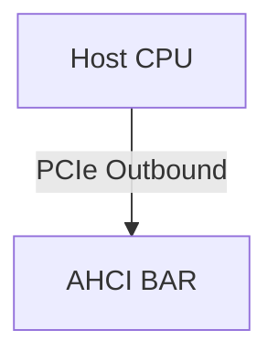

AHCI 卡 DMA 到 DRAM：

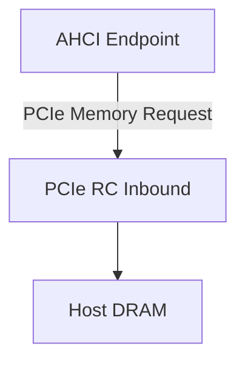

`lspci` 正常只代表 Config Space 基本可存取。

AHCI probe 正常代表 MMIO 基本可存取。

真正讀寫磁碟成功，才代表 DMA 路徑大致成立。

---

### 24.2 Cache Coherency

若 PCIe Endpoint DMA 與 CPU cache 非硬體 coherent，需要確認：

- DMA API 是否正確使用
- Cache flush / invalidate
- Device Tree `dma-coherent`
- SMMU / IOMMU 設定

Linux AHCI driver 會使用 DMA API，但 platform / RC driver 必須提供正確的 DMA mapping 行為。

---

### 24.3 Address Translation

需確認：

- CPU physical address
- PCIe bus address
- Endpoint DMA address

上述位址之間的轉換關係是否正確。CPU physical address 與裝置看到的 DMA address 可以不同，Controller 的 DMA 資料結構應填入 Linux DMA API 回傳的 DMA address。

有些平台需要透過 `dma-ranges`、IOMMU 或 Inbound ATU 進行轉換。

---

### 24.4 MSI

MSI 本質上是 Endpoint 發出一筆 PCIe Memory Write。

因此 MSI 驗證也依賴：

- MSI target address
- RC inbound routing
- GIC MSI controller
- Device Tree 描述
- Linux MSI domain

---

## 25. 建議 bring-up 順序

1. Link up。
2. Config Space read/write。
3. BAR assignment。
4. 確認 AHCI CAP / VS / PI 可讀。
5. Controller reset。
6. Driver bind。
7. Port 初始化。
8. SATA link up。
9. IDENTIFY DEVICE。
10. 單一 sector read。
11. 大區塊 read。
12. Write。
13. 長時間壓力測試。
14. MSI / MSI-X。
15. NCQ。

不要一開始同時追 **Gen3、MSI-X、NCQ、多 Port 與高 queue depth**。

---

## 26. 最小驗證指令集合

```bash
# PCIe enumeration
lspci -nn
lspci -nnk
lspci -vv -s <BDF>

# Kernel log
dmesg | grep -iE 'pci|pcie|ahci|ata|sata|scsi|sd '

# Kernel config
zcat /proc/config.gz | grep -E \
'^(CONFIG_(PCI|ATA|SATA_AHCI|SATA_HOST|SCSI|BLK_DEV_SD|PCI_MSI)=|# CONFIG_(PCI|ATA|SATA_AHCI|SATA_HOST|SCSI|BLK_DEV_SD|PCI_MSI) is not set$)'

# Block device
lsblk
cat /proc/partitions

# Interrupt
cat /proc/interrupts

# Read-only test
dd if=/dev/sda of=/dev/null bs=1M count=128 iflag=direct status=progress
```

---

## 27. 問題定位速查表

| 現象 | 優先檢查 |
|---|---|
| `lspci` 沒裝置 | Link、PERST#、REFCLK、Power |
| 有裝置但沒 BAR | RC resource window、PCI enumeration |
| 有 BAR 但 probe timeout | MMIO、outbound translation |
| AHCI 正常但 link down | SATA PHY、Cable、Power |
| Identify timeout | FIS、DMA、Interrupt |
| 小量成功、大量失敗 | PRDT、DMA boundary、cache |
| Polling 成功、中斷失敗 | INTx/MSI routing |
| 讀到錯誤資料 | cache coherency、DMA mapping |
| 只在高負載失敗 | queue depth、NCQ、lost IRQ、AER |

---

## 28. 名詞整理

| 名詞 | 說明 |
|---|---|
| AHCI | SATA Host Controller 的標準軟體介面 |
| ABAR | AHCI Base Address Register，存放 AHCI MMIO Register 空間的基底位址 |
| FIS | Frame Information Structure，Host Controller 與 SATA Device 之間傳輸的封包格式 |
| PRDT | 描述 DMA Data Buffer 的表格 |
| NCQ | SATA Native Command Queuing |
| HBA | Host Bus Adapter |
| RC | PCIe Root Complex |
| EP | PCIe Endpoint |
| CLB | Command List Base |
| FB | Received FIS Base |
| CI | Command Issue |
| SACT | SATA Active |
| COMRESET | SATA Link reset sequence |

---

## 29. 核心結論

對 PCIe RC 驗證而言，AHCI 卡的價值是它能一次覆蓋：

- PCIe Enumeration
- BAR / MMIO
- Interrupt
- DMA Read
- DMA Write
- Long-running Traffic
- Linux Standard Driver
- Real Block Device

但問題切割時必須記住：

| 現象 | 優先檢查 |
|---|---|
| 看不到 PCIe Device | PCIe |
| 看得到 Device，但 AHCI probe 失敗 | MMIO / BAR / Controller reset |
| AHCI probe 成功，但沒有 SATA Device | SATA Link / PHY / SSD |
| 可辨識 SSD，但 I/O timeout | DMA / Interrupt / PRDT / Cache |

初期驗證應以逐層證明為主，效能調校留到基本路徑穩定之後：


